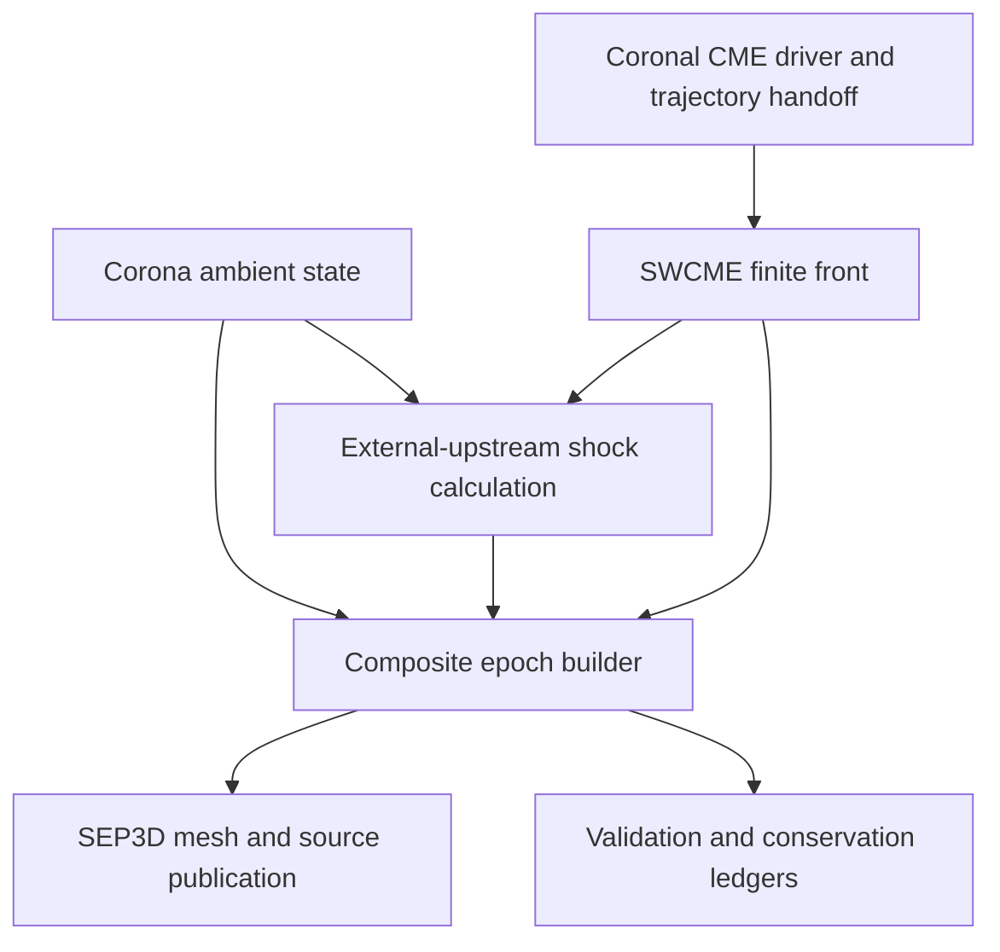

# Corona–SWCME composite plasma and magnetic-field provider

**Document:** model.md  
**Revision:** design 1.2, 2026-10-03; analytical replacement for MHD, incorporating both coupling reviews and the clarified scientific scope.  
**Status:** implementation and validation roadmap; the proposed composite provider and new tests are not implemented by this document.  
**Suggested repository location:** `src/models/sep_corona_swcme/model.md`.  
**Application adapters:** `srcSEP3D` and a separately qualified field-aligned `srcSEP` adapter; the shared model must remain usable without AMPS or MPI.

## 1. Purpose and scientific scope

Develop an analytical/semi-empirical alternative to global MHD evolution for supplying time-dependent solar-wind, magnetic-field, and CME-shock information to SEP transport. Couple the existing corona and SWCME components through one neutral shared provider; publish one physical event and one consistent epoch to `srcSEP3D`, with the same physics contracts available to `srcSEP`.

The production target is a coronal ambient beginning at a declared radius such as $1.01R_\odot$, with an outer SWCME trajectory/geometry continuation beginning at a declared handoff such as $20R_\odot$. Continue the event to 1 AU and maintain background/observer coverage beyond it, for example to 1.1 AU. These values are configurable case choices. The absorbing solar body at $1R_\odot$, the first valid plasma sample at $1.01R_\odot$, and the CME launch radius are distinct. No state is extrapolated through the excluded inner interval merely to fill an AMPS cell.

The corona component supplies the **one ambient-plasma and IMF authority over the entire covered domain**. SWCME supplies finite shock/front geometry and analytical or observation-constrained propagation. Its local shock calculation receives that ambient as external upstream data. The composite owns event identity, handoff, region/capability classification, source provenance, and publication. Solving a trajectory ODE, a flux-tube wind ODE, a local jump system, or a potential-matching problem is permitted; none introduces global fluid evolution.

**Scope decision:** no coronal or heliospheric MHD evolution solver, imported-MHD operating mode, solver-driven sheath, ALE solver dependency, or MHD-comparison prerequisite belongs to this roadmap. The retained local fast-wave and Rankine–Hugoniot equations are algebraic physical constraints for a magnetized shock. The coupled model does not import or solve global fluid evolution.

The model has two capability levels, with region-specific capabilities inside Level B:

| Level | Delivered capability | Scientific qualification |
| --- | --- | --- |
| A: ambient plus prescribed front | One coronal ambient, continuous shock/front history, local upstream/downstream jump states, and source metadata | Analytical kinematics and local shock physics. No spatially resolved sheath, ejecta, or wake claim |
| B: analytical disturbance | A declared analytical or semi-empirical sheath/layer, and optionally an independently prescribed ejecta field/flow | Qualify each region, transport operator, and observable with independent equations, mass/flux/induction/interface checks, bounded force/heat/work discrepancy, and observations. No global dynamical solution is claimed |

A front-only event and an analytical shock/sheath event can both select **`ejecta_model=none`**. A spheromak is not needed for propagation, shock arrival, local jumps, or upstream SEP connectivity. An interior field prescription is needed only for requested magnetic-ejecta vector histories or particle transport inside that region. A spheromak is one optional detached reference field; a line-tied rope is a separate optional topology, not a mandatory implementation prerequisite.

Missing regions return explicit unsupported-capability results. Publishing the quiet ambient inside an unsupported CME region does not turn it into CME plasma. Level A may support a declared upstream source/transport approximation, but cannot silently enable an operator requiring unavailable downstream trajectories. Level B with a qualified sheath but no ejecta must still mask unsupported ejecta/wake histories. Capability qualification is per observable, not one all-purpose full-field flag.

“Continuous transition” means no artificial jump or reset when trajectory ownership changes. Physical shocks, contacts, and current sheets retain their jumps and one-sided identities. Smoothness is required only away from those interfaces.

### 1.1 Relationship to similar work

SSE and drag-based propagation provide reduced geometric and kinematic precedents [R2, R3, R15]. Iso-poly wind modeling provides a reduced thermodynamic/flow precedent [R11]. Existing magnetized-CME/particle studies [R5, R6] identify observables worth checking; they do not prescribe this model's implementation architecture or coefficients. Their spacecraft data can motivate independent observation cases without importing their solver outputs.

The older component-coupling papers [R1, R4, R7, R8] are retained as bibliographic context only. They create no solver dependency, operating capability, or release gate here. This project's equations, closures, interface contracts, and test acceptance are specified below and qualified on their own evidence.

### 1.2 Review disposition and first implementation choices

Design 1.2 retains valid corrections from the design-1.0 review [R17], evaluates the design-1.1 review [R18], and applies the user's requirement that the model replace MHD. Both reviews are design inputs, not execution evidence. All listed new tests are **reserved proposed tests**, not registered or executed by this document update.

| Topic | Adopted decision and qualification | Implementation and tests |
| --- | --- | --- |
| Ambient scope and calibration | Production target is the complete selected r4 analytical background, not an assembly of isolated diagnostic kernels. Preserve source semantics but bind numerical calibration to the actual ambient/transport configuration | Sections 6.0 and 6.7; S1/S8; CSWC0109, CSWC0111, CSWC0811 |
| Wind thermodynamics | Qualify $\rho,\mathbf U,T_s,p$ together. Select a reduced tube-isopoly solution or the r4 empirical wind with its declared residual budget; changing temperature alone is diagnostic | Section 6.0; S1/S9; CSWC0108, CSWC0110, CSWC0901 |
| Shock versus ejecta | Preserve independently identified feature histories and local fast-shock admissibility. Nose standoff remains an applicability-limited diagnostic; no arbitrary near-Mach-one cap | Sections 6.3 and 6.3.1; S2/S4; CSWC0407–CSWC0410 |
| Source scope | Keep r4 finite-reference semantics and coronal taper/latch. Extended injection needs its own calibrated differential release law; the handoff does not move source termination | Section 6.7; S8; CSWC0807–CSWC0809, CSWC0811–CSWC0812 |
| Geometry and drag | Retain the complete coronal surface, differentiate the transition, and declare drag units/feature identity/added mass. Fixed-shape bias is checked analytically and observationally | Sections 6.1–6.2; S2/S3 |
| Analytical sheath | Replace design-1.1's evolved sheath by an explicitly qualified analytical closure. Keep the prescribed shock as sole authority. Exact planar fixtures precede curved shock-fed maps | Section 6.4.1; S6; CSWC0610–CSWC0612, CSWC0615–CSWC0616 |
| Optional ejecta field | Default to no interior field. Add a reference field only for requested ejecta observables. Detached and Sun-connected topologies advertise different capabilities | Section 6.4.2; S6; CSWC0607 optional, CSWC0613–CSWC0614 |
| SEP scoring and connectivity | Qualify downstream use per region/history/operator; retain uncertainty and coverage masks and the epoch-aware connectivity cache | Section 12.4; S8/S9; CSWC0810, CSWC0907 |
| MHD and moving-mesh recommendations | Outside this model's scope. Remove S10's imported-evolution path and its test prerequisites. Self-similar coordinates may simplify analytical maps but do not require a moving-mesh solver | S6 and revised S10 |

The first release is **Level A with a jointly qualified ambient, independently prescribed shock, and an explicit source policy**. It can carry a front to 1 AU with injection disabled or already terminated. Level B is optional and remains analytical. No spheromak or sheath module blocks Level A.

### 1.3 What the review does and does not establish

Reusing the r4 source contract is distinct from reusing a numerical calibration. An incompatible calibration is rejected, but the same release semantics can be calibrated on a different declared background. Completing the r4 kernels alone does not establish event-specific predictive skill; quiet-wind and held-out event evidence remain required.

The review's claim that a detached spheromak excludes every magnetic-cloud particle reduction is too strong: the cited study [R6] reproduced a reduction with that topology. It does not thereby establish solar-footpoint connectivity. Its seed-injection prescription also does not establish a universal $\eta(\theta_{Bn},X,M_f)$ finite-reference release law. Any such parameterization is qualified separately under Section 6.7.

The review's interface-inflow, MHD-relaxation, and ALE requirements do not apply to a trajectory handoff between analytical prescriptions. Existing shock-admissibility checks remain local physical requirements. Proposed test IDs are reconciled below rather than overwriting existing IDs such as CSWC0810.

## 2. Current code baseline and missing capabilities

Paths in this document are relative to the AMPS source root. The reviewed baseline is the corona-coupling source package prepared on 2026-10-02. Implementation must record its actual source commit or archive SHA-256 at Stage S0; this document does not invent a Git revision.

| Existing component | Reusable capability | Required extension or qualification |
| --- | --- | --- |
| `src/models/sep_coronal_cme/include/sep_coronal_cme/background_provider.h` | Immutable `CoronalBackgroundModel` with a diagnostic PFSS/Parker/isothermal/H–He prescription | Production r4 ambient assembly, CME driver, and qualified analytical disturbance are absent or must be checked at S0 |
| `src/models/sep_coronal_cme/src/background_provider.cpp` | Open/closed classification, prescribed open-tube flow, hydrostatic closed plasma, and exterior Parker mapping | The open flow is not a solved curved-tube momentum equation; open/closed pressure balance is not assumed |
| `src/models/swcme/swcme3d.hpp` and `swcme3d.cpp` | Finite SSE, ellipsoid/sphere geometry, prepared states, BALLISTIC/DBM/DATA_DRIVEN apex evolution | Shock evaluation constructs an internal analytical density, Parker field, radial velocity, and thermodynamic closure |
| `src/models/sep_coronal_cme/include/sep_coronal_cme/mhd_jump_solver.h` | Ideal-MHD characteristics and oblique fast-shock jump solver | Select and validate one canonical solver path for composite runs |
| `src/models/sep_coronal_cme/include/sep_coronal_cme/shock_provider.h` | Transactional patch snapshots, area/rate ledgers, and `LocateFirstFastCrossing` | Connect to SWCME geometry and the composite ambient epoch |
| `src/models/sep_coronal_cme/include/sep_coronal_cme/source_surface_coupling.h` | SCS/interface kernels, longitude maps, and vector-potential transition helper | These kernels are not the assembled, qualified corona diagnostic provider |
| `src/models/sep_coronal_cme/include/sep_coronal_cme/interface_balance.h` | Sharp-interface and volume residual diagnostics | Extend where necessary for the new moving CME interfaces |
| `srcSEP3D/background/bg_provider.h` | Prepare/evaluate lifecycle, batching, metadata, and derivative capabilities | Add an explicit composite provenance and field-representation contract |
| `srcSEP3D/background/bg_corona.*` and `bg_swcme.*` | Separate model adapters | Add an adapter for the shared composite |
| `srcSEP3D/runtime/background_factory.*` | Model registration and validation | Add strict parser/factory dispatch without bypassing ownership checks |
| `srcSEP3D/main_lib.cpp` | Owner candidate preparation, native buffer writing, halo exchange, and runtime boundary updates | Join the CME/shock/source candidate to the same transaction |

The current `background.provider=corona` configuration rejects active SWCME shock/source coupling because its upstream state would have a different authority. Do not remove this rejection until the external-upstream contract and corresponding tests pass.

The full `AnalyticCoronalCompositeProvider` described in the existing `sep_coronal_cme/model/architecture_exchange.md` is a broader specification than the implemented diagnostic provider. Reusing isolated shared kernels must not be reported as completion of that specification.

Neither a constant coronal temperature nor a new temperature painted onto an unchanged incompatible flow may be described as an observationally qualified 1-AU ambient. The existing coronal specification also terminates its baseline active source near 20 solar radii while allowing earlier particles to travel to 1 AU. Extending front propagation does not implicitly extend that source. Both changes require the explicit contracts and tests in this revision.

### 2.1 Integration policy

Add a new neutral shared module, proposed as `sep_corona_swcme`, rather than importing application classes into the corona or SWCME physics kernels. Reuse `sep_common` status/vector contracts or introduce narrow adapters where the existing types differ.

Append new serialized authority/provenance values; preserve existing enum values. Keep standalone corona and standalone SWCME configurations supported and regression-tested.

Keep physics preparation outside particle loops. Shared kernels must not include `pic.h`, `mpi.h`, native mesh types, or global AMPS state. MPI collectives and buffer mutation belong to the application adapter.

Reuse the existing runtime-provider/native-storage coupling mechanism already used for SWCME. Application-specific selection, includes and source/field coordination belong in the shared model and application adapters; the AMPS/PIC core must remain functional for other applications without depending on this module.

## 3. Distinguish the physical boundaries and transition controls

| Surface/control | Meaning | Required behavior |
| --- | --- | --- |
| Solar body, $R_\odot$ | Physical inner exclusion and absorbing particle boundary | Exclude interior volume; preserve AMPS cut-cell measures and output masks |
| Ambient inner support, $R_{\rm ambient,min}$ | First radius where the selected analytical plasma/field prescription is valid, e.g. $1.01R_\odot$ | Never extrapolate into the gap to the solar body without a separately declared valid inner prescription |
| Magnetic source surface, $R_{\rm ss}$ | Transition within the coronal magnetic prescription | Preserve mapped flux, topology, sector and one-sided states |
| Trajectory handoff, $R_h$, with band $[R_-,R_+]$ | Coronal history changes to outer SWCME geometry/propagation, e.g. $20R_\odot$ | Match event, position, velocity, geometry, support and lineage; ambient ownership does not change |
| Thermal transitions, $r_{T,s}$ | Species-specific wind thermodynamic regimes | Match the selected complete wind solution, not temperature alone |
| Source termination, $r_0$ | Physical release-envelope cutoff under the selected source contract | Persist the exact-zero latch; independent of $R_h$ and domain allocation |
| Outer support, $R_{\rm max}$ | Covered background and observer extent, e.g. 1.1 AU | Cover requested front, reference surfaces, observers, derivatives and particle excursions |

These radii need not coincide. A default $R_h=20R_\odot$ is a model/event choice [R3], not a physical plasma discontinuity or a numerical fluid inflow boundary. No superfast-inflow condition is attached to that ownership handoff. A shock patch still has to exceed the local upstream normal fast speed under Section 6.3.

Use the same corona ambient prescription on both sides of $R_h$. No magnetic/plasma normalization resets there. A future analytical ambient-interface extension requires its own state, flux, thermodynamic, derivative and temporal compatibility contract; a trajectory blend cannot serve as a plasma-field blend.

There is no independently evolving domain interface $R_d$ in this design. Analytical tables may be partitioned or cached for efficiency, but that partition is not a new physical boundary or a second ambient authority.

## 4. Architecture and authority



### 4.1 Proposed components

The architecture diagram shows the Level A path. S6 adds optional analytical regional samples to the same epoch; the prescribed surface remains the sole shock authority. S10 qualifies the complete analytical release and adds no alternate evolution model.

| Component | Responsibility | Explicit exclusions |
| --- | --- | --- |
| `AmbientPlasmaProvider` | Frozen ambient $\rho,p,p_e,\mathbf U,\mathbf B$, EOS/composition, region, and coverage | Does not independently insert the CME |
| `CoronalCmeDriver` | Coronal event trajectory and, where supplied, surface/material state | Diagnostic PFSS alone is not a driver |
| `ContinuousCmeTrajectory` | One event history, handoff, outward continuation, and dense time evaluation | Does not create a second launch at $R_{\rm h}$ |
| `CmeSurfaceProvider` | Ejecta and shock geometry, normals, velocities, and patch IDs | Does not assume all patches are shocks |
| `ExternalUpstreamShockProvider` | Ambient sampling, characteristic classification, canonical RH solution, and source eligibility | Never reconstructs an internal Parker upstream in composite mode |
| `CmeDisturbanceProvider` | Qualified analytical sheath/layer and optional ejecta/wake representation | May explicitly advertise no full-field capability |
| `CoronaSwcmeCompositeModel` | Immutable combined state, region classification, samples, derivatives, and ledgers | Owns no PIC storage or MPI communication |
| `CoronaSwcmeBackgroundProvider` | SEP3D adapter and provenance mapping | Does not duplicate shared model physics |
| `CompositePublicationCoordinator` | Collective prepare/write/halo/commit and source publication | Never publishes mixed generations |

The coronal driver is an observation-constrained or analytical height–time/surface history. Both implement the same handoff contract. The analytical disturbance consumes that event; it does not launch or detect a second competing shock.

### 4.2 Lifecycle

1. Resolve and validate all configuration, assets, units, frames, and coverage.
2. Freeze an ambient candidate at time $t$.
3. Advance or reconstruct the event candidate at $t$, without modifying the published event.
4. Construct physical surface patches and their velocities.
5. Sample ambient upstream and prepare shock/source candidates.
6. Prepare the selected disturbance representation and region graph.
7. Validate primitives, derivatives, invariants, identities, and capability requirements.
8. Prepare owner-cell buffers and the joined publication record.
9. Perform collective precommit validation.
10. Write native/application buffers, exchange halos, validate received identities, and expose the committed epoch before particle work.

Before live writes, rejection leaves the previous committed epoch intact. After a write or halo operation has partially modified live storage, failure must prevent particle transport; terminate or restore all affected storage from a complete rollback image. “Transactional” must not imply rollback that the implementation does not provide.

## 5. Required data contracts

### 5.1 Coordinates, units, and time

The initial frame is Sun-centered heliocentric inertial Cartesian, with a declared +Z rotation axis. SI units are mandatory in public model APIs. Solar radii and AU are input conveniences converted once using fingerprinted constants.

Use one reference UTC epoch and one monotonically increasing simulation-time coordinate. Asset observation times, coronal driver times, SWCME times, and native runtime times must resolve to that coordinate. Rotation transformations must carry both position and vector components; velocities need the appropriate frame term.

Each sample records the physical evaluation time. A generation number is not a replacement for an epoch. Dense trajectory evaluation for event finding must not increment the published background generation.

### 5.2 Ambient state

A canonical `AmbientState` must contain:

| Quantity | Units | Meaning |
| --- | --- | --- |
| $\rho$ | kg m$^{-3}$ | Actual mass density from the selected composition |
| $n_e,n_p,n_\alpha$, when available | m$^{-3}$ | Explicitly named species number densities |
| $p$ | Pa | Total scalar thermal pressure used by the declared analytical characteristic/jump closure |
| $p_e$ | Pa | Electron pressure, independently supplied when required |
| $T_e,T_p,T_\alpha$, when available | K | Species temperatures |
| $\mathbf U$ | m s$^{-1}$ | Full inertial bulk velocity |
| $\mathbf B$ | T | Signed magnetic vector |
| $\gamma_{\rm wave}$, $\gamma_{\rm energy}$, and closure ID | dimensionless / identifier | Effective characteristic response and energy/jump closure; the first release uses one consistent scalar-gamma one-fluid closure |
| Thermal-profile ID, parameters, and validity | identifier / declared units | Species-profile authority, calibration interval, radial regime, and uncertainty; distinct from the wave/jump closure |
| Region and sector | categorical | Open/closed/exterior classification and one-sided sector |
| Time, generation, digest | s / identifiers | Exact source epoch and configuration |
| Coverage and validity | categorical | Qualified domain, interface side, and failure reason |

Do not infer $\rho=m_p n_e$ when He is present. Do not pass electron pressure into a solver expecting total thermal pressure. The shock energy closure must also define downstream partition into species temperatures/electron pressure before those values can be exported.

For the isotropic H/He first release, use $n_e=n_p+2n_\alpha$, $\rho=m_p n_p+m_\alpha n_\alpha$ with the stated negligible-electron-mass convention, $p=k_B(n_eT_e+n_pT_p+n_\alpha T_\alpha)$, and $p_e=k_Bn_eT_e$. A radial polytropic index describes the background profile; it is not automatically the perturbation adiabatic index or the RH energy closure. Anisotropic pressure and distinct species wave responses require a new characteristic/jump contract rather than substitution into the scalar formula.

The existing SEP3D `BackgroundSample` lacks an explicit mass-density/species-density contract. Either extend that public contract compatibly or retain a complete canonical shared sample and provide a documented native export mapping. Native export must not discard information needed later to reconstruct $v_A$, EOS, or shock states.

### 5.3 CME event state

A proposed `CmeEventState` includes:

- Stable event ID; launch/reference UTC; current physical time; driver and continuation fingerprints.
- Ejecta-center/apex position and velocity; shock-apex position and velocity; their explicitly defined separation.
- Width, aspect ratios, axis/attitude, and their time derivatives.
- Declared mass, magnetic flux, helicity/orientation parameters, and material reference state, when supported.
- Handoff status, crossing time, crossing state, and any fitted-surface residuals.
- State representation: observed/prescribed front, analytical shock/sheath, or analytical disturbance with an optional interior field; always retain region-specific qualification.
- Physical-domain mask, excluded area/rates, and source/field capability flags.
- Independent feature identities and propagation parameters for shock and ejecta; separation-closure ID and its supported domain, or explicit `ejecta-history-unavailable` status.
- Geometry reference surface, surface-velocity data, transition correspondence, and the fixed-shape/deformable approximation flag.
- Source-contract version, branch/calibration ID, finite reference length, source envelope and termination latch.
- Driver force/heat/work asset identity and allowed residual budget when full fields are requested.

Measured white-light leading-edge position must be labeled as ejecta, shock, or uncertain feature. Do not silently use an ejecta trajectory as shock geometry.

### 5.4 Surface patch state

Each patch contains physical position, area, outward normal, normal surface speed, stable patch/parent ID, event ID, surface type, ambient generation, upstream/downstream states, fast Mach number, compression, obliquity, jump residuals, and source eligibility.

For an active source, it additionally identifies the finite upstream reference surface, release-law version, source species, momentum/angular/frame law, calibration domain, untapered rate, taper, and realized number/energy rates. Distinguish the shock-patch area from the offset reference-surface area and include the required area mapping exactly once.

Stable IDs survive ownership changes. When a patch is split, children carry parent IDs and close the parent's physical area and source measures. Excluded flank or photospheric patches remain in ledgers; their excluded source must not be renormalized onto retained patches.

### 5.5 Composite epoch

One immutable `CompositeEpoch` contains the ambient handle, event handle, geometry/shock handles, disturbance handle, field representation, capability set, region/interface graph, and all component digests.

It also carries epoch, generation, valid-time interval, mesh revision, frame, numerical-policy digest, and source/turbulence identities. Restart and runtime sampling must reject a mixture of components from different epochs.

## 6. Governing prescriptions and transition rules

### 6.0 Ambient authority and coupled wind thermodynamics

**Production target.** Assemble the selected r4 analytical background [R16]: PFSS open/closed classification, finite-shell current-sheet treatment and transitions, longitude-dependent Parker-map Jacobian, structured slow/fast wind, closed-field plasma, plasma-sheet prescription where selected, and open-flux normalization with independent calibration/validation roles. Use one complete provider and digest. Isolated SCS/transition kernels or the current diagnostic `CoronalBackgroundModel` do not establish completion. The manifest records which r4 requirements are implemented, excluded, or unsupported for the chosen case.

`ambient_profile=r4-analytic` is a production **target**, not an assertion that all those capabilities exist in the current source. The parser must reject it until its implementation is registered. A narrower empirical provider can be qualified for explicitly limited observables/support; it cannot silently advertise the full r4 capability. `ambient_profile=diagnostic-pfss-parker` remains available for manufactured/regression work and separately identified diagnostic studies, with its own source-calibration identity. No diagnostic run becomes event-qualified merely by changing its selector.

**Joint wind state.** Select a complete $\rho,\mathbf U,T_e,T_p,T_\alpha,p,\mathbf B$ prescription. Supported design branches are `r4-empirical` and `tube-isopoly`; the latter is a reduced flux-tube wind calculation, not global fluid evolution. Fit the selected population/sector and radial support rather than assuming one universal index or transition radius [R11].

For a common-velocity, constant-composition open tube with arc length $s$ and positive area $A(s)$, the reduced steady equations are

$$
\rho u A=\dot m_{\rm tube},\qquad
u\frac{du}{ds}=-\frac{1}{\rho}\frac{dp}{ds}
-\frac{GM_\odot}{r^2}\frac{dr}{ds}+a_{\parallel,\rm declared}(s),
$$

$$
p=k_B(n_eT_e+n_pT_p+n_\alpha T_\alpha),\quad
n_e=n_p+2n_\alpha,\quad
\rho=m_p n_p+m_\alpha n_\alpha.
$$

The first branch neglects electron mass, differential species drift and pressure anisotropy; other branches need their own contract. Tube geometry and $A$ come from the selected flux/geometry prescription. For a field-aligned thin tube, $A|B|$ is the declared flux invariant only where that approximation is valid. Do not replace its area by $r^2$ in a nonradial expanding tube.

An isothermal/polytropic temperature law represents a heat/exchange closure; it does not imply zero heating. Record the implied species energy terms and their independently bounded validity. A solved reduced momentum equation is not a claim of a first-principles energy solution.

The extra acceleration/heating models, if used, are independently declared and bounded. Setting them to zero is a physical branch, not a fit performed after inspecting residuals. Thermal-only iso-poly acceleration is not guaranteed to fit every slow-wind population [R11]. Solve the regular transonic branch when that branch is requested; locate its critical point using the actual derivative of total pressure along the closure. Its critical derivative is not automatically the scalar-gamma wave speed used in the shock jump equations.

For each species, a polytropic regime can use

$$
T_s=T_{s,*}\left[n_s/n_s(r_*)\right]^{\gamma_{s,\rm poly}-1}.
$$

The inner regime is isothermal only where declared. If a smooth thermal band is selected, use $S(z)=10z^3-15z^4+6z^5$ and

$$
\ln T_s=(1-S)\ln T_{s,\rm in}+S\ln T_{s,\rm out}.
$$

Differentiate the full expression, including $S'$ and its density/velocity dependence, and solve/recompute the wind with that pressure law. Do not retain a velocity computed using another temperature and call the joined state a solved wind. Smooth inputs give positive temperatures and a $C^2$ endpoint join; a nonsmooth input table requires its own interpolation contract.

For `r4-empirical`, determine density from its declared mass-per-tube/flux rule and velocity, supply the associated species temperatures, and record the dimensional/normalized momentum and species-energy residuals. This is a complete empirical state, not automatically a steady momentum solution. Observational qualification and independently frozen model-discrepancy bounds define its permitted use. A temperature-only correction of an incompatible diagnostic flow remains diagnostic. Numerical residuals must converge; finite physical model discrepancy need not disappear with mesh refinement and must not be hidden in the numerical tolerance.

**Preparation procedure:** freeze geometry/flux/composition and population assets; construct or integrate $u$; derive consistent species densities and temperatures; calculate total/electron pressure and full gradients; check mass/flux and force/heating budgets; export one immutable ambient epoch. If the wind, flux calibration, or thermal asset changes, rebuild its digest and recheck all source calibration and restart compatibility before publication.

The independent illustrative pure-H fixture remains: $n_p=n_e=6$ cm$^{-3}$, $B=6$ nT, $\gamma=5/3$, perpendicular normal. It gives $v_A=53.43$ km s$^{-1}$. For $T_e=T_p=1.2$ MK, $a_s=181.71$ and $c_f=189.40$ km s$^{-1}$; for $T_e=1.4\times10^5$ K and $T_p=10^5$ K, $a_s=57.46$ and $c_f=78.46$ km s$^{-1}$. A 150-km-s$^{-1}$ relative normal speed changes classification. This verifies sensitivity and equations, not the actual plasma of the reported failure.

Quiet-wind qualification compares velocity, density, species temperatures/proxies, total/electron pressure and vector IMF together, by population and radial coverage. Propagate their uncertainties into Mach, compression, connectivity, source eligibility and arrival. Round-off targets apply to exact algebraic fixtures; numerical tube integration uses an independently checked transonic reference and convergence/tolerance budget.

### 6.1 Continuous trajectory and handoff

Use either one data-driven trajectory over the full covered interval or a coronal history continued by an outer propagation law. Existing monotone DATA_DRIVEN/PCHIP machinery is reusable, but its extrapolation and monotonicity policies must remain explicit.

At a handoff time $t_{\rm h}$, require

$$
R_{\rm outer}(t_{\rm h})=R_{\rm coronal}(t_{\rm h}),\qquad
V_{\rm outer}(t_{\rm h})=V_{\rm coronal}(t_{\rm h}).
$$

Use the crossing state to initialize the continuation. Never reinitialize the CME from a second unrelated radius/speed pair.

A smooth transition may prescribe one position curve over $[t_-,t_+]$, with velocity and acceleration obtained by differentiation. A quintic Hermite curve can match endpoint position, velocity, and acceleration; validate that it remains outward and within the declared acceleration bounds. Matching endpoint accelerations does not imply that a data-driven PCHIP history is globally $C^2$. Do not blend position and velocity independently.

For an optional outer driver drag law,

$$
\dot R=V,\qquad
\dot V=a_{\rm net}(R,t)
-\Gamma(R,t)(V-u_{\rm ambient})|V-u_{\rm ambient}|.
$$

Here $a_{\rm net}$ explicitly includes the selected net coronal forces; do not add gravity again if the fitted acceleration already includes it. If a body-based drag prescription is selected, one convention is

$$
\Gamma=\frac{C_D\rho_{\rm ambient}A_{\rm CME}}{2M_{\rm eff}},\qquad
M_{\rm eff}=M_{\rm CME}+M_v.
$$

Declare the drag convention, sampled wind location/component, mass-loading policy, and the distinction between body and shock speeds. This spatially varying law is a new numerical continuation, not the current constant-parameter closed-form DBM.

If a fitted coronal surface cannot be represented exactly by outer SSE, preserve the original surface through a transition or carry a richer representation. An abrupt best-fit SSE replacement fails continuity even when apex position matches.

#### 6.1.1 Drag parameterization, feature identity, and added mass

The first continuation should use a fitted nonnegative inverse drag length $\Gamma$ in m$^{-1}$, with uncertainty, wind sampling convention, fitting interval, and prediction cutoff recorded [R3]. Convert a quoted km$^{-1}$ coefficient once. A fit to a shock track is a phenomenological **shock-track continuation**; do not call its coefficient a measured body drag. A fitted coefficient can absorb unresolved geometry/added-mass effects and must not receive an extra added-mass correction afterward without refitting.

For the optional body-based branch, define projected area, closed-body volume $\mathcal V$, physical mass, and drag-coefficient convention. One diagnostic added-mass model is $M_v=C_a\rho_{\rm ambient}\mathcal V$; $C_a=1/2$ is the incompressible-sphere reference, not a universal CME value. The convention above places a factor $1/2$ in the drag force; papers that absorb it into $C_D$ must be translated explicitly. Added mass is particularly important for an ejecta with density comparable to or below the ambient density [R12].

If $M_v$, physical mass, or entrained momentum changes, specify the effective-inertia/momentum-transfer equation before adding those changes to the acceleration law. Updating a denominator is not a derivation of a variable-mass equation. Keep constant/fitted DBM as the first supported branch; reject an incomplete body-based evolution rather than mixing inconsistent terms.

A single apex continuation with fixed shape couples all patch motions to one history. For fixed SSE, $R(\alpha,t)=F(\alpha)R_a(t)$, so radial speeds and accelerations scale by $F(\alpha)$; they are not equal at every flank. This approximation still cannot represent independent deformation caused by different ambient streams. Report that limitation and widen off-axis uncertainty from controlled structured-wind comparisons, not from an arbitrary multiplier.

### 6.2 Finite SSE geometry

For fixed half-width $\lambda$, shock-apex radius $R_a$, and unit axis $\mathbf e$, the existing SSE generating sphere has

$$
c=\frac{R_a}{1+\sin\lambda},\qquad a=c\sin\lambda.
$$

For a ray making angle $\alpha$ with $\mathbf e$,

$$
R(\alpha)=c\cos\alpha+
\sqrt{a^2-c^2\sin^2\alpha},\qquad 0\leq\alpha\leq\lambda.
$$

There is no front outside the finite angular support. These are the project's 3-D axisymmetric use of the SSE geometry, not a derivation of CME magnetic structure [R2].

For evolving width or attitude, evaluate a material surface parameterization
$\mathbf x(\xi,\eta,t)$ and use

$$
V_n=\mathbf n\cdot\partial_t\mathbf x.
$$

A radial-apex scaling alone omits expansion/rotation contributions in this case.

Low-coronal validity requires special attention. For $0<\lambda<\pi/2$, the tangent-flank radius is $R_a\cos\lambda/(1+\sin\lambda)$. A wide SSE front can therefore intersect the inner boundary even when its apex is outside it. At $\lambda=\pi/2$, the limiting tangent point is at the Sun and must be treated as an endpoint, not a usable shock patch.

Use an explicit physical mask, a qualified narrower early surface, or a coronal surface supplied by the driver. Do not hide invalid patches with a radius floor. Separate geometry-domain validation from the old SWCME analytical-wind minimum-radius guard after external upstream support is introduced.

#### 6.2.1 Implementable surface handoff algorithm

Retain a common surface coordinate $q=(\xi,\eta)$ and its patch lineage throughout the event. A fitted coronal ellipsoid can be represented by $\mathbf x_c(q,t)=\mathbf c(t)+Q(t)D(t)\mathbf y(q)$, with positive semiaxes in $D$, a differentiable rotation $Q$, and a declared physical cap/mask. Export $\partial_t\mathbf x_c$, not just the apex speed. A shock cap and a closed ejecta body are separate surfaces.

**Preferred outer geometry:** save the complete reference surface $\mathbf x_h(q)$ at the handoff and continue it by heliocentric self-similar scaling,

$$
s(t)=R_a(t)/R_{a,h},\qquad
\mathbf x_o(q,t)=s(t)\mathbf x_h(q),\qquad
\partial_t\mathbf x_o=\dot s\mathbf x_h.
$$

Scale the heliocentric center as well as the semiaxes. Holding the center fixed while scaling only axes is a different geometry. This continuation preserves shape, angular support, and positions, with area proportional to $s^2$. It preserves velocity at a direct handoff only if $\partial_t\mathbf x_c(q,t_h)=\dot s(t_h)\mathbf x_h(q)$ over the retained surface. Test that condition; an apex match alone is insufficient. Elliptical propagation models provide precedent for retaining noncircular front geometry [R15], without validating a 3-D magnetic body.

When the velocity condition fails, or an explicitly requested SSE shape differs, use a finite time band with well-defined early and outer candidate surfaces on the **same** patch coordinates. Continue each candidate through the band, align correspondence using the documented orientation/feature map, and construct

$$
\mathbf x(q,t)=(1-w(t))\mathbf x_c(q,t)+w(t)\mathbf x_o(q,t),
$$

$$
\partial_t\mathbf x=(1-w)\partial_t\mathbf x_c+w\partial_t\mathbf x_o
+\dot w(\mathbf x_o-\mathbf x_c),\qquad
w=S\!\left(\frac{t-t_-}{t_+-t_-}\right).
$$

The quintic weight has zero first and second endpoint derivatives. It produces position/velocity matching to the respective candidate at each endpoint; it does not establish that arbitrary candidates form a regular surface. Compute area and normal from $\partial_\xi\mathbf x\times\partial_\eta\mathbf x$, orient the normal consistently, and obtain $V_n$ from the full differentiated velocity. For regular charts, require positive area, no folds or self-intersections, ordered shock/ejecta surfaces, bounded motion, and valid support at all sampled times. Handle chart poles with regular quadrature charts rather than treating coordinate singularities as physical folds. A closed-body map additionally requires positive volume Jacobian.

Freeze the transition correspondence, start/end states, time band, and selected mode in the restart record. If angular support differs, define an explicit evolving physical mask and its boundary motion/excluded-area ledger; do not abruptly introduce new injection area. A transition that fails regularity or continuity returns `GEOMETRY_TRANSITION_INVALID`. Its remedy is a longer qualified band or retained richer geometry, not a positional clamp.

#### 6.2.2 Deferred deformable-front mode

After fixed-shape qualification, a separate mode may evolve angular elements against local ambient wind and a declared local drag/inertia closure. It must evolve one regular surface, conserve its patch measures under remeshing, and supply differentiated velocities. Smoothing introduces a geometric model term whose scale and effect must be reported and refinement-tested. Independent ray trajectories followed by an undocumented smoothing pass do not establish a compatible surface, material map, or closed magnetic ejecta. Compare with independently prescribed structured-wind fixtures and withheld off-axis imaging/arrival data before claiming reduced flank uncertainty.

### 6.3 External upstream and shock formation

Evaluate the undisturbed ambient provider at the patch time and upstream side. Do not evaluate the composite disturbance recursively to obtain its own upstream. For a single CME in the first release, upstream is the ambient corona state; CME–CME interactions require a separate disturbed-upstream evolution contract.

That rule applies to both capability levels for the first single-CME model. S6 constructs the downstream disturbance from the same upstream and prescribed shock; it does not replace the shock authority. A foreshock-modified or earlier-CME upstream is a separate explicit analytical extension with its own canonical state/epoch and validation. Never query a disturbance recursively as its own upstream.

For outward normal $\mathbf n$, let $w_1=V_n-\mathbf U_1\cdot\mathbf n$. With

$$
a_s^2=\gamma p_1/\rho_1,\quad
v_A^2=B_1^2/(\mu_0\rho_1),\quad
v_{A,n}^2=(\mathbf B_1\cdot\mathbf n)^2/(\mu_0\rho_1),
$$

the first release uses $\gamma=\gamma_{\rm wave}=\gamma_{\rm energy}$ for its declared scalar closure. The empirical radial $\gamma_{s,\rm poly}$ is a separate quantity and must not be substituted. The local one-fluid magnetized-plasma normal fast speed is

$$
c_f^2=\tfrac12\left[a_s^2+v_A^2+
\sqrt{(a_s^2+v_A^2)^2-4a_s^2v_{A,n}^2}\right],
\quad M_{f,n}=w_1/c_f.
$$

A nonpositive $w_1$ or subfast state is not a forward fast shock. Require the selected fast branch, compression, entropy condition, and RH residual closure before producing a shock state. Fast-shock existence and injection eligibility are separate decisions; a supercritical-source criterion needs its own validated convention/table.

Bracket and locate first fast crossings in continuous time. A cadence sample must not define the physical formation time. Multiple crossings require a documented onset/termination history, rather than a function that assumes a single crossing forever.

For $M_f$ indistinguishable from one at numerical accuracy, report a bounded transition/uncertainty class, source budget, and refinement requirement. A tolerance must not erase an actually resolvable weak shock. True solver failures preserve diagnostic context and reject the candidate according to the configured policy.

#### 6.3.1 Shock–ejecta placement and authority

The first Level A release selects `shock-history=independent-prescribed`: identify a shock feature in the coronal/imager history, initialize its own continuation at its own crossing state, and give it its own width/shape/uncertainty. Supply an independently identified ejecta history when available. If it is unavailable, return `EJECTA_HISTORY_UNAVAILABLE` for separation/ejecta-arrival queries; a front-only run remains possible but cannot score an ejecta arrival or claim a sheath thickness.

When both surfaces exist, compute their separation along a declared ray or driver normal, verify event/feature identity and nonintersection on the common supported cap, and separately locate shock and ejecta observer crossings. A radial apex separation is not every patch's sheath thickness. The propagated geometric shock candidate must still pass the local fast/RH tests: a subfast candidate is an inactive front, not an admissible shock.

An optional **nose-only diagnostic** closure can investigate the Farris–Russell bow-shock relation [R13],

$$
\frac{\Delta}{R_c}=0.81\,
\frac{(\gamma-1)M^2+2}{(\gamma+1)(M^2-1)},\qquad M>1.
$$

$R_c$ is the local nose curvature radius of the **driver obstacle**, not automatically the SSE shock sphere radius. Declare the Mach convention, driver expansion/translation ratio, curvature direction for a nonspherical body, applicability interval, and calibration evidence. CME propagation and expansion sheaths differ [R14]; the relation is not a general 3-D CME closure. It does not prescribe flanks, which remain unsupported unless independently provided or separately qualified.

If Mach is evaluated at the displaced shock, the placement is implicit. Iterate displacement and canonical upstream evaluation with a bounded root solve in the qualified regime, and differentiate the resulting surface history to obtain its actual shock speed. Substituting body speed for the displaced surface speed omits $\dot\Delta$. Check uniqueness, continuity, and the outer-domain coverage before accepting the result. Do not advertise this optional branch as implemented by the current DBM/SSE code.

The relation diverges as $M\rightarrow1$. Below the predeclared applicability threshold, return `STANDOFF_MODEL_OUT_OF_RANGE`, retain the uncertainty/excluded-source ledger, and require an independent shock history or a separately qualified analytical placement closure. An arbitrary standoff cap is a diagnostic sensitivity parameter, never evidence of physical weak-shock closure. A detached shock can still exist under an independent history; numerical placement failure is distinct from physical subfast/no-shock status.

The review's multi-hour shock/ejecta lead times are illustrative evaluations of this formula and an assumed curvature/speed. They are not a universal arrival correction. Validation must compare independently identified features without converting the formula into an imposed observational truth.

Report local $w_1/c_f$, compression/entropy status, normal separation, its change with time, and shock/ejecta observer crossings with feature uncertainty. A finite admissible forward fast shock requires $w_1>c_f$ within the resolved weak-limit policy; equality is not a new finite shock branch. A thinning sheath or a decelerating driver is not automatically unphysical, and a detached shock can outlive its driver. Use propagation/expansion distinctions [R14], multipoint arrivals and type-II tracks as diagnostics, with density-model, emission-harmonic and feature-association uncertainty. No universal monotonic sheath-thickness gate is imposed.

### 6.4 Analytical plasma and magnetic-field assembly

Classify queries into ambient, modeled foreshock, shock interface, qualified sheath/layer, optional ejecta/wake, physical inner exclusion, or uncovered domain. Every returned region names its closure, support, one-sided interface and capability. Level A publishes the ambient for supported upstream transport plus separately typed local jump metadata; a downstream metadata sample is not a spatial transport environment.

Direct magnetic-vector blending is not a general matching method. Even with solenoidal endpoints,

$$
\nabla\cdot[w\mathbf B_1+(1-w)\mathbf B_2]
=\nabla w\cdot(\mathbf B_1-\mathbf B_2).
$$

A declared common-gauge vector-potential transition gives

$$
\mathbf A=w\mathbf A_1+(1-w)\mathbf A_2,\qquad
\mathbf B=w\mathbf B_1+(1-w)\mathbf B_2+
\nabla w\times(\mathbf A_1-\mathbf A_2).
$$

Its cross term, compatible normal flux, geometry, gauge and outer support are required. It is not a force-balance proof and cannot erase a physical discontinuity. Time-dependent construction also needs $\mathbf E=-\partial_t\mathbf A-\nabla\phi$ and Faraday consistency. An ideal branch additionally requires $\mathbf E=-\mathbf U\times\mathbf B$; a nonideal branch declares and budgets its electric field. Solenoidal snapshots alone do not establish induction.

A material map $\mathbf x(\mathbf a,t)$ with $F=\partial\mathbf x/\partial\mathbf a$ and $J=\det F>0$ provides

$$
\rho=\rho_0/J,\qquad \mathbf B=F\mathbf B_0/J,\qquad
\mathbf U=\partial_t\mathbf x.
$$

For compatible divergence-free reference fields and a regular map, these are kinematic mass/flux-freezing identities. They do not determine momentum, pressure, or driver forces. The reference, boundary fluxes, thermodynamics and physical discrepancy must be specified independently. Piecewise maps need interface checks; separate solenoidal patches do not guarantee one globally admissible field.

#### 6.4.1 Analytical sheath/layer closure and implementation sequence

**No fluid-evolution solver is selected.** The prescribed shock surface and canonical local RH solution remain authoritative. A sheath closure must match those states on its shock boundary and any separately supplied contact/lateral boundaries. Arbitrarily prescribing both a shock and a contact can be incompatible; reject that candidate as `ANALYTIC_CLOSURE_INCOMPATIBLE` rather than switching to another model or concealing the mismatch.

The first downstream implementation shall use an **exact moving planar shock in uniform plasma** as its reference. Use the independently computed constant upstream/downstream states and a front moving with their RH-compatible speed. A supported finite downstream observation layer needs no closed ejecta and no spheromak. Test interface fluxes, one-sided samples, derivatives, particle crossings and number/energy accounting before generalizing to a curved solar front. A collection of local planar fits is only a diagnostic approximation until its cross-patch, curvature and time-dependent compatibility have passed.

For the subsequent curved analytical branch, use an explicitly parameterized **shock-fed material map** or a declared potential/stream-function construction. A proposed implementable shock-fed procedure is:

1. Label admitted parcels by shock patch/lineage and crossing time $\tau$. Sample the canonical upstream and solve RH at that same epoch; keep the compression and downstream species-partition conventions.
2. With $w_2=V_n-\mathbf U_2\cdot\mathbf n>0$, assign crossing mass from $dM=\rho_2w_2\,dA_{\rm shock}\,d\tau=\rho_1w_1\,dA_{\rm shock}\,d\tau$. Use the actual shock area at birth. This is swept plasma mass, not a particle-source rate or an accumulated volume inferred from current shell thickness.
3. Prescribe the downstream parcel map/flow from a small frozen analytical or independently calibrated parameter set. Export analytic velocities and deformation derivatives; integrating parcel trajectories through that prescribed velocity is permitted. Maps must be positive-J, single-valued on their support, and regular across neighboring labels. Derive parcel density from its admitted mass and current physical volume.
4. Initialize magnetic flux consistently with the RH state and neighboring patches, then transport it with the Cauchy map where the ideal branch is claimed. The initialization must close the *global* normal-flux/interface constraints; independent patch values are not sufficient. If no compatible reference/mapping exists, reject the field capability. A vector-potential alternative has the full electric/induction contract above.
5. Prescribe species compression heating at birth and the subsequent adiabatic/heating/exchange law. An adiabatic material branch may use $p_s=p_{s,\rm birth}J_{\rm rel}^{-\gamma_{s,\rm adv}}$, with the map referenced to that parcel's birth configuration. Never apply the shock compression a second time. Treat empirical heating as an independently bounded asset.
6. Account for material/flux exit through lateral support and the wake, not just entry through the nose. A finite cap or corridor requires these boundary ledgers. If an ejecta contact is supplied, impose its compatible motion/normal-flux/electric-field and stress/energy budgets; do not trap all admitted mass in an arbitrary closed shell.
7. Freeze geometry, map, boundary/source and force/heat/work parameters before grading. Check the local jump limits, volume balances, induction, interfaces and observed profiles. Publish only the regions that pass; unavailable contact/wake/ejecta regions stay typed and masked.

This procedure is a construction and qualification contract, not a proof that every fitted front/contact pair admits such a map. Exact uniform planar and manufactured expanding cases provide independent oracles. General solar-event closures remain unqualified until the specified evidence is present. A visually smooth radial interpolation is a possible diagnostic profile but does not establish conservation, induction, or particle-valid downstream fields.

For a smooth claimed region, check

$$
\partial_t\rho+\nabla\cdot(\rho\mathbf U)=S_\rho,\qquad
\partial_t\mathbf B+\nabla\times\mathbf E=0.
$$

For the ideal branch this reduces to $\partial_t\mathbf B-\nabla\times(\mathbf U\times\mathbf B)=0$. Include declared mass loading, nonideal terms, surface contributions, gravity, stress, heating and mechanical/electromagnetic work in the corresponding control-volume budgets. No omitted term is silently zero.

**Qualification policy:** numerical mass/normal-flux/divergence/induction and interface errors must converge to their declared budget. Momentum/energy discrepancies are reported separately as numerical error and independently bounded physical model discrepancy. This analytical model is not required to reproduce a global dynamical solution, but an observational or conservation claim cannot be bought by fitting force/work to the residual after the run. A closure exceeding the preregistered discrepancy budget loses the affected capability and remains diagnostic. Analytical fixtures and observations provide the required independent evidence; there is no MHD reference prerequisite.

#### 6.4.2 Optional ejecta field: why and when to add it

**Default: `ejecta_model=none`.** This does not disable front propagation, local shock jumps, source termination, or upstream SEP transport. A separate geometric ejecta history can still be used to compare arrival/separation without claiming an interior field. Return `EJECTA_FIELD_UNAVAILABLE` for field/transport queries requiring that interior.

An interior prescription is added only for a declared target such as magnetic-cloud $B_x,B_y,B_z$, duration, particle access or transport inside the ejecta. The selector names its topology and coverage; no option automatically establishes all of those observables.

| Optional reference | Useful representation | Limitation to retain |
| --- | --- | --- |
| Detached constant-alpha spheromak | Closed magnetic body with signed flux, orientation, handedness and a compact analytic reference | No Sun-connected legs; detached topology cannot stand in for solar-footpoint connectivity |
| Sun-connected flux rope | Declared toroidal/leg geometry, footpoints, twist and flux for connectivity-dependent studies | Needs its own regular map, boundary/footpoint and observational qualification; not inferred from an SSE cap |
| Other divergence-free reference/potential | A separately documented field appropriate to the chosen limited observable | Topology, induction, plasma support and interface validity are specified rather than assumed |

If a spheromak is explicitly selected, use a detached reference ball with $\nabla\times\mathbf B_0=\alpha\mathbf B_0$, $\nabla\cdot\mathbf B_0=0$, and $\mathbf B_0\cdot\mathbf n_0=0$. Record its eigenmode, flux convention, axis, radius, handedness, mass/composition and pressure. This is an optional mathematical reference, not a compulsory physical CME description. The reference field can use $\mathbf x=\mathbf c(t)+Q(t)D(t)\mathbf a$ with positive $J$ and the map identities above. General anisotropic expansion need not retain force-freeness.

An ejecta insertion requires exterior normal-flux matching. A controlled static fixture can use $\mathbf B=\mathbf B_{\rm ambient}+\nabla\Phi$, $\nabla^2\Phi=0$, and $\partial_n\Phi=-\mathbf B_{\rm ambient}\cdot\mathbf n$ on a closed $B_n=0$ body, with compatible outer flux and a fixed additive constant. Check net-flux solvability. Repeating this static solve as the body moves does not prove time-dependent induction; use a qualified temporal construction/map or keep it diagnostic. A Sun-connected reference requires a different boundary/flux construction.

A heliocentric self-similar coordinate $\mathbf x=s(t)\widetilde{\mathbf x}$ can simplify analytical maps, with $d\widetilde{\mathbf x}/dt=(\mathbf U-\dot s\widetilde{\mathbf x})/s$. It fixes the body only when its center and axes scale by the same $s$ and its orientation is constant. Translation, rotation or anisotropic deformation require their complete map terms. This is a coordinate choice, not an ALE mesh or a fluid solver requirement.

Detached topology may reproduce some shielding/trapping or intensity reductions [R6], but it cannot establish Sun-connected leg access or the solar origin of bidirectional populations. Keep those capability limits in particle-history and observation masks. Adding an optional field never resets the event, ambient authority, shock history, or source calibration.

### 6.5 Derivatives and physical interfaces

Supply full $\nabla\mathbf B$, $\nabla\mathbf U$, focusing quantities, and other advertised derivatives with documented analytic/numerical provenance.

Use branch-preserving one-sided stencils near physical interfaces. Do not average opposite magnetic sectors into a spurious weak field or differentiate through a mathematical shock as if it were smooth. At a true magnetic null, guiding-center/focused transport validity requires a separate physical treatment or a typed exclusion; no substituted magnetic floor is allowed.

Choose one particle representation of shock compression: a qualified resolved layer or a qualified surface-crossing operator. Record the choice so transport, source spectra, and diagnostics do not count the same acceleration twice.

### 6.6 Moving-interface flux conditions

For a physical interface with outward normal $\mathbf n$ and normal speed $V_s$, define $\mathbf w=\mathbf U-V_s\mathbf n$, $w_n=\mathbf w\cdot\mathbf n$, and $B_n=\mathbf B\cdot\mathbf n$. Square brackets denote the downstream-minus-upstream jump. A source-free, planar interface under the selected one-fluid ideal magnetized-plasma closure must satisfy these local flux constraints:

$$
[\rho w_n]=0,\qquad [B_n]=0,\qquad
[\mathbf n\times(\mathbf w\times\mathbf B)]=0,
$$

$$
\left[\rho w_n\mathbf w+
\left(p+\frac{B^2}{2\mu_0}\right)\mathbf n
-\frac{B_n\mathbf B}{\mu_0}\right]=0,
$$

$$
\left[w_n\left(\frac{\rho w^2}{2}+\frac{\gamma p}{\gamma-1}
+\frac{B^2}{\mu_0}\right)
-\frac{B_n(\mathbf w\cdot\mathbf B)}{\mu_0}\right]=0.
$$

These conditions express mass, normal magnetic flux, tangential electric field, momentum, and energy continuity in the local interface frame. The energy formula assumes the stated scalar, constant-gamma closure. Other closures require their own energy flux. Contacts, tangential discontinuities, and shocks must use their appropriate branch/kinematic conditions; there is no universal requirement that all primitives be continuous across them.

An artificial model-ownership boundary represents no physical jump. Require matching physical states there, or a qualified finite transition satisfying its measured volume balances. If surface sources, heat, nonideal fields, or driver work are prescribed, include them explicitly in the corresponding jump/control-volume budgets.

### 6.7 Source contract and source termination

Use the versioned source contract in `src/models/sep_coronal_cme/model/physics.md`, revision r4, Sections 10.3–10.6, as the baseline authority [R16]. Preserve stable species IDs and compiled-slot validation, source frame, momentum/angular distribution, and additive number/momentum/energy ledgers.

The r4 specification itself identifies schema 5 as a pre-freeze draft. Citing it does not assert that its entire provider/source contract is implemented or released. S0 must map each reused requirement to the actual source baseline, and reserve unimplemented capabilities behind explicit validation gates.

**Calibration binding.** Reuse of these *semantics* does not authorize reuse of numerical $\eta g(p)$ or $L_{\rm ref}$ from an incompatible run. Store a derived `release_calibration_fingerprint` in the calibration/resolved manifest and compare it with the active canonical configuration before source publication or restart. It is not a second user-entered parser authority that can override the model.

The binding includes the ambient profile/geometry/composition/thermal and flux-normalization configuration, shock/jump policy, coefficient and scattering/mean-free-path configuration, stable species and momentum/angular support, source/placement semantics, reference distance and normal/frame conventions, transport mover/frame, calibration diagnostic/tolerances, exact calibration horizon with follow-up/censoring policy, and evidence checksums/data-use roles as specified by r4. Include the shock/background/coefficient generation identities required by the selected r4 contract. Separate structural calibration bindings from each time-varying runtime epoch: epochs must lie within the declared calibrated support and follow the asset's explicit generation/evolution policy; a routine update is not permission to mix configurations and is not by itself a request to recalibrate every tick. If an asset binds exact generations, enforce those exact identities; do not invent a compatible-generation translation or weaken the existing r4 check.

Report `SOURCE_CALIBRATION_MISMATCH` or a typed out-of-support status before publication when a covered configuration or validity condition differs. A diagnostic ambient may use its own diagnostic calibration; it cannot inherit production qualification. A newly qualified r4 ambient still needs compatible source evidence. A source-disabled run needs no numerical release calibration, but its zero-rate identity and disabled state must remain explicit.

The preferred production branch releases particles through a moving **finite upstream reference surface**, at positive signed-front distance $L_{\rm ref}$. It supplies the calibrated one-way first-passage rate and spectrum represented by $\eta\,g(p)$ and the rest of that contract. Acceleration/return between the shock and reference surface are already included in the calibrated release rate. Do not add them again with a second transport/source operator or reinterpret this rate as gross shock injection.

For every epoch validate the reference-surface normal reach, regularity, patch correspondence/area map, side and domain coverage. $L_{\rm ref}$ is a physical calibration length, not a mesh fraction. Rates are physical represented measures; Monte Carlo particle counts/weights implement them without changing their meaning. Preserve the baseline eligibility conditions, including the supported geometric/cross-field escape treatment, rather than assuming that a first-passage rate is universal for arbitrary transport.

Support two explicitly different policies:

| Policy | Release law and radial scope | Required behavior |
| --- | --- | --- |
| `coronal-only-r4` | r4 release semantics with calibration matching the selected ambient/transport; nominal termination near 20 solar radii and the documented 30-solar-radius sensitivity branch | Preserve configured taper and exact-zero termination latch. Continue front/background and transport of previously released particles to 1 AU |
| `extended-shock-first-passage` | Same source-boundary semantics, with a separately versioned/calibrated heliospheric efficiency, spectral/angular law, reference length, and validity domain | Permit active injection beyond the baseline cutoff only after extended-source validation. No implicit reuse of a coronal efficiency at 1 AU |

For the baseline envelope, retain $H_{\rm term}=1-S((r_a-r_1)/(r_0-r_1))$ inside $r_1<r_a<r_0$, exact one/zero outside, and the persistent latch once $r_0$ is reached. Record which physical surface's apex defines $r_a$ and its mapping to the legacy coronal candidate-front convention. Moving the trajectory handoff must not move the source zero radius or reset the latch. Retain untapered/realized rates and taper fraction separately.

An extended calibration may parameterize the differential release law by local $\theta_{Bn}$, compression $X$, $M_f$, momentum/species, and the declared seed/turbulence/transport/reference-length variables. A reduced $\eta(\theta_{Bn},X,M_f)$ is an optional fitted slice within frozen other parameters, not a universal law. The effective finite-reference escape efficiency differs from gross shock seed-injection efficiency; keep its spectrum/angular distribution and number/energy measures normalized together. The seed-injection example in [R6] does not establish this escape law. Fit independent ESP/SEP evidence under the chosen capability and withhold an independent event; reject parameter extrapolation beyond the calibrated support.

An extended source must declare onset, local fast/supercritical eligibility, calibration/energy bounds, global termination time/radius, and latch/reactivation rules. Local shock eligibility can change with the wind before the declared global termination; track those crossings. A final global termination is persistent on restart. Observer allocation or corridor coverage is a numerical support check, **not** the physical source termination mechanism.

If coronal and heliospheric calibrations differ, construct one continuous law over a predeclared physical transition interval and validate its number/energy budgets; that interval need not coincide with $R_h$. For a compatible momentum/frame convention, one possible model is a smooth nonnegative blend of the two *differential physical release-rate measures*, followed by integration to obtain total rate and normalized spectrum. Blending only efficiency while independently switching spectral shape is insufficient. The chosen blend is a calibrated model assumption and must satisfy its energy bound. If no calibration supports a continuous extension, keep the coronal-only policy or report the unsupported interval explicitly.

In a uniform-ambient ownership test, hold geometry, eligibility, reference length, and release-law identity fixed while crossing $R_h$: differential spectrum and integrated number/energy rates must be continuous. This test isolates an artificial ownership jump. Genuine physical onset, the declared source envelope, and a separately calibrated source transition have their own tests and must not be hidden by forced continuity.

## 7. Configuration, output, and restart specification

### 7.1 Proposed configuration

The following is a **design sketch**, not a runnable current input. S0 assigns the schema and accepted keys; the current parser must not be expected to accept these new selectors. Keep `[run]` first in delivered strict-INI examples. Every production example must use the actually registered schema and include a validated stop/coverage contract.

```ini
# DESIGN ONLY: proposed keys; not accepted by the current parser.
[run]
start_time_s = 0
end_time_s = 259200
# Example finite limit, not proof of arrival: choose from the declared
# trajectory and requested comparison interval. A test must check that
# the front actually crossed 1 AU before this limit.

[background]
provider = corona-swcme

[coupling]
ambient_authority = corona
field_representation = ambient-plus-front
# No solver operating mode; only event/geometry ownership changes here.
handoff_radius_rs = 20
transition_inner_rs = 15
transition_outer_rs = 25
trajectory_transition = matched-position-curve
unsupported_region_policy = reject-request

[ambient]
# Production target: parser accepts this only after assembly/qualification.
profile = r4-analytic
minimum_radius_rs = 1.01
maximum_radius_au = 1.1
wind_model = r4-empirical
# Alternative planned reduced wind: tube-isopoly. Both supply u,n,T,p
# together. Diagnostic PFSS/Parker is a distinct labeled profile.
state_asset = verification/assets/declared-ambient-state.json

[cme]
event_id = declared-event-id
shock_history = independent-prescribed
shock_trajectory_asset = verification/assets/declared-shock-height-time.csv
shock_outer_continuation = fitted-dbm
shock_drag_fit_asset = verification/assets/declared-shock-drag-fit.json
shock_surface = retained-coronal-shape
geometry_transition = differentiated-surface-blend
# An identified ejecta history is optional and independent of its field.
ejecta_history = unavailable

[disturbance]
model = none
# Optional after S6 qualification: analytic-shock-sheath, with a frozen
# map/profile, lateral/contact coverage and budget asset. Not a solver.

[ejecta]
model = none
# Optional interior field only for requested ejecta observables:
# detached-spheromak or an independently qualified Sun-connected rope.

[source]
# Coupling-only validation needs no particles or numerical calibration.
enabled = false
policy = coronal-only-r4
contract = upstream-reference-first-passage-r4
calibration_asset = none
termination_zero_radius_rs = 20
# If enabled, supply a compatible calibrated asset containing L_ref,
# differential rate/spectrum/angular law, taper, exact horizon and binding.
# Extended injection additionally needs its own heliospheric calibration.
# Fingerprints are derived/checksummed manifests, not input overrides.

[domain]
allocation = full
# Initial native baseline is full allocation; production may select a
# corridor only after actual field-line/diffusion/source coverage passes.
solar_body_radius_rs = 1
outer_radius_au = 1.1
refinement = declared-case-plan
# Refinement controls resolution; allocation controls active volume.
# Keep the solar body/cut-cell exclusion independent of both controls.
```

These assets are placeholders describing required contents, not files supplied by this document. A run starting with a shock at $20R_\odot$ is a heliospheric propagation test; it does not establish a low-coronal launch or the earlier handoff. Deliver separate low-corona and 20-$R_\odot$ inputs when those scopes are implemented.

The resolved manifest additionally includes:

- Ambient assembly/profile/version, wind population, geometry/flux normalization, composition and complete species thermal/pressure laws; production versus diagnostic label and support.
- Wind/thermal/field assets, constants, wave/jump versus profile indices, uncertainty, force/heating budgets, tracing/null/sector policy and calibration/holdout roles.
- Feature identities, observations/projection uncertainties, fitting method and forecast cutoff; separate shock/ejecta histories, drag/added-mass conventions, masks and unavailable statuses.
- Shock solver and residual/weak-limit policy, downstream thermal partition, region capabilities and source eligibility.
- Source enabled/disabled state, contract/branch, exact reference-surface/area/frame semantics, calibration binding/support, termination/latch and any differential-rate transition.
- Analytical disturbance/map/reference, optional interior topology, boundary/induction/electric-field policy, independently frozen force/heat/work bounds and per-region qualification.
- Derivative/layer/interpolation policies, native mesh coverage/update cadence, component/asset checksums, UTC frame and restart identity.
- Particle-history/observer capability masks, connectivity-cache accuracy/key and invalidation policy; no unsupported bin interpreted as zero flux.
- Stop time/radius event policy, trajectory/data coverage and the scientific completion condition. Reaching a configured time limit alone is not PASS for an arrival test.

Unknown/duplicate keys, unregistered capabilities, inconsistent support/transition bounds, incompatible active source calibration and insufficient time coverage are errors before publication. A source-disabled case does not require a numerical efficiency asset. A corridor is acceptable only with quantified front/source/particle and diffusion coverage; a fixed Parker refinement curve is not authoritative coronal connectivity.

### 7.2 Diagnostics

Produce a machine-readable epoch ledger and compact logs containing event ID, epoch, generation, propagation phase, handoff time/state, apex and ejecta radii/speeds, width, shock area, subfast/transition/excluded areas, source number/energy rates, and halo readiness.

Include complete ambient/wind/thermal and source-calibration binding IDs, wave/energy closure, shock/ejecta feature identities, fixed-shape/deformable mode, local normal Mach and separation/thickness diagnostics, $L_{\rm ref}$ validity, source enabled state/envelope/latch, and eligible/excluded source budgets. Record unsupported regional capabilities independently of numerical failures. Report capability-masked SEP bins and their reason/count/duration; excluded observations are not zero flux and are not included in PASS denominators.

For full-field representations, record magnetic divergence/flux, mass, induction, momentum, and energy residuals and their normalization. Preserve maxima and high-percentile values, rather than only global means.

For individual failures, include rank, physical coordinates, sample/patch ID, region/sector, upstream provider digest, time, and solver residuals. Distinguish “another rank rejected” from the original scientific/numerical failure.

### 7.3 Restart

Checkpoint component fingerprints, event state, handoff mode/state, trajectory cursor/integrator state when needed, surface lineage, generation, last committed time, mesh revision, and source/turbulence state. A deterministic analytical provider may reconstruct its fields from its frozen assets and exact event/epoch. An incremental shock-fed parcel inventory or prescribed transport state requires its full labels, birth records and accumulated boundary ledgers; no solver checkpoint is required.

Checkpoint shock/ejecta histories when present, transition correspondence, exact source-calibration binding/envelope latch, analytical map/reference state and any shock-fed parcel inventory when used. Connectivity caches may be discarded and reconstructed if their complete keys and numerical policy are preserved. A cache built from an old epoch must never survive a restart as current merely because an integer generation is reused.

Changing the ambient normalization, handoff law, geometry, asset content, or source closure invalidates a continuation unless an explicit migration/reinitialization procedure is requested and recorded. Restart must not cause a second launch, duplicate injection, or replay a completed handoff.

## 8. Implementation stages and dependencies

All stages below are **planned**. A future PASS requires recorded execution evidence; this document implements neither the provider nor its tests. Design 1.2 reserves **95 active tests across 11 stages**. IDs are versioned requirements, not existing runner selectors.

| Stage | Main deliverable | Dependencies | Release contribution |
| --- | --- | --- | --- |
| S0 | Baseline, analytical scope, contracts, schema and evidence registry | Existing source tree | Acceptance and compatibility contracts |
| S1 | Complete selected analytical ambient and jointly qualified wind/EOS | S0 | Level A foundation |
| S2 | Continuous coronal/outer shock and optional ejecta histories | S0–S1 | No second launch/reset |
| S3 | Regular finite front, complete handoff and patch lineage | S2 | Qualified geometry |
| S4 | One external upstream and local shock/jump authority | S1–S3 | Level A shock physics |
| S5 | Immutable samples, capabilities and one-sided derivatives | S1–S4 | Level A provider; optional regional extensions |
| S6 | Analytical sheath/layer and optional interior/reference fields | S5; independent analytic fixtures and declared physical budgets | Level B only for qualified regions/observables |
| S7 | AMPS owner/native/halo publication and field-aligned adapter contract | S5; S6 only for requested disturbance regions | Application integration |
| S8 | Source/particle/turbulence, calibration binding and restart | S4–S5, S7 | SEP qualification |
| S9 | Quiet-wind, shock and capability-supported observation comparisons | Applicable S1–S8 gates | Event-specific scientific evidence |
| S10 | Analytical end-to-end qualification and reproducible release | Applicable S0–S9 gates | Release/campaign evidence, no additional physical solver |

Level A does not depend on S6 or any ejecta reference. Level B with sheath-only support does not require a spheromak. Magnetic-ejecta and Sun-connected-interior observables have separate optional gates. No stage depends on an MHD simulation, dataset or imported solver.

Stage readiness follows its dependencies: S5 needs S1–S4, native S7 needs actual MPI evidence, source-enabled S8 needs compatible calibration, and S9 needs frozen observations for the specific capability. Analytical construction is not event validation, and a listed proposed test is not an implementation result.

**Test-ID transition from design 1.1.** Retire CSWC0603, CSWC0608 and CSWC0609 (evolved exterior/ALE/MHD-comparison requirements) and CSWC1001–CSWC1006 (imported evolution/interface requirements). Do not reuse them for new physics or transfer an old `last_pass`. Their status is `RETIRED_OUT_OF_SCOPE`, excluded from active PASS/FAIL/SKIP totals and listed in the registry migration record. New S6 analytical tests use CSWC0610 onward; revised S10 uses CSWC1011 onward. CSWC0607 remains optional spheromak verification. The calibration-binding test is CSWC0811, preserving existing CSWC0810 for connectivity-cache validation. If any ID was already implemented, retain its historical evidence under its old contract version and migrate explicitly; this document cannot erase it.

### S0 — Freeze the baseline and define the contracts

**Implementation work**

1. Record source/archive identity and run the existing corona, SWCME, shared-kernel, and SEP3D baseline suites.
2. Add the neutral module target and public API headers; document dependencies and ownership.
3. Freeze data contracts in Sections 4–5 and serialization/version rules.
4. Add strict composite configuration validation, initially returning unsupported for unimplemented representations.
5. Create stable test IDs, evidence classes, case manifests, and prerequisite behavior.
6. Freeze the choices in Section 1.2: thermal/wave closures, source contract and branch, geometry transition, shock authority, and optional analytical disturbance/reference and independently frozen physical budgets. Register tests only as their runnable implementations are added.

**Validation cases**

| ID | Setup and independent oracle | Acceptance |
| --- | --- | --- |
| CSWC0001 | Compile public shared headers with a minimal compiler-only host, without AMPS/MPI include paths | No application/MPI dependencies or unresolved global application symbols |
| CSWC0002 | Feed unknown/duplicate keys, reversed transition bounds, conflicting authorities, and unsupported representation/source combinations | Each case returns the declared typed error before provider publication |
| CSWC0003 | Change one asset byte, frame, composition, handoff parameter, or closure while preserving filename | Digest/restart identity changes; formatting-only normalized input changes follow the documented policy |
| CSWC0004 | Run existing accepted standalone corona and SWCME examples | Existing semantics and serialized enum values remain unchanged |
| CSWC0005 | Remove one native binary/evidence asset; then corrupt a supplied asset | Missing prerequisite is SKIP; supplied corrupt evidence is ERROR or FAIL as specified, never PASS |
| CSWC0006 | Build/run shared Level A fixtures without any external fluid-evolution library or simulation dataset; request a removed evolution selector | Analytical path has no solver/reference dependency; unsupported selectors are rejected before publication rather than silently downgraded |

**Exit gate:** source baseline and public contracts are reproducible; composite selection cannot silently use the old independent upstream.

### S1 — Establish the analytical ambient and joint wind state

**Implementation work**

1. Assemble/adapt the selected r4 analytical ambient into one canonical immutable provider; audit Section 6.0's required magnetic/wind/plasma-sheet components rather than counting isolated kernels as completion.
2. Export actual composition, species/total pressure and full vectors/gradients at an explicit frozen epoch; qualify covered open/closed/sector states.
3. Cover the declared inner support (e.g. $1.01R_\odot$) through the outer support (e.g. 1.1 AU), with physical solar and unsupported intervals masked.
4. Retain standalone-SWCME and diagnostic PFSS/Parker regression paths with distinct identities and labels.
5. Implement `r4-empirical` and/or `tube-isopoly` as complete wind states. Support only registered branches; freeze population assets, extra acceleration/heating and model-discrepancy budgets.
6. Derive consistent density/temperature/pressure from the selected wind and mass/flux rules; differentiate the full joins, distinguish profile and wave/jump indices.
7. Compare speed, density, species thermodynamics and IMF together against independent fixtures and quiet-wind observations. Carry state/flux calibration into source compatibility.

**Validation cases**

| ID | Setup and independent oracle | Acceptance |
| --- | --- | --- |
| CSWC0101 | Manufactured uniform H/He plasma with separately calculated EOS and $v_A$ | Species neutrality, actual mass density, total/electron pressures and wave speeds agree |
| CSWC0102 | Open-tube and exterior samples across magnetic transitions with independently specified area/flux | $\rho u A$ and mapped magnetic flux close; $r^2$ is used only in the declared radial-tube limit; one-sided limits converge |
| CSWC0103 | Tilted/nonaxisymmetric PFSS at poles and fixed inertial positions at multiple times | Independent harmonic/vector/frame fixtures agree; finite valid pole limits |
| CSWC0104 | Null, separatrix, sector sheet, solar exclusion and uncovered radius/time probes | Correct categorical/typed result; no field floor, cross-sector interpolation or extrapolated inner plasma |
| CSWC0105 | Batch permutation, empty local batch and concurrent const evaluation | Values/statuses are order-independent; epoch and generation are immutable |
| CSWC0106 | Independent positive species profiles/tables crossing thermal bands | Species temperatures, pressures and complete join derivatives agree; malformed species/support are detected |
| CSWC0107 | Pure-H fixture in Section 6.0, H/He variants and profile/wave-index perturbations | Independent fast/sound speeds and eligibility agree; profile index is not RH gamma |
| CSWC0108 | Accelerating empirical/tube flows at three resolutions, including a temperature-only correction with unchanged incompatible velocity | Mass/flux and declared momentum/heating budgets are checked together; incompatible corrected flow cannot acquire solved-wind qualification |
| CSWC0109 | Registered r4 analytical ambient sampled directly and through the composite at the same epoch, including independent boundary/derivative fixtures | Wrapper preserves complete state, derivatives, sector/support and digest; separate r4 physics evidence remains necessary |
| CSWC0110 | Exact/manufactured transonic tube and independently integrated nonradial iso-poly reference | Critical point, $u,\rho,T_s,p$ and momentum residual meet frozen tolerance and converge; numerical integration is not required to reach round-off |
| CSWC0111 | Frozen slow/fast populations, finite-shell sheet, longitude-map Jacobian, plasma sheet and open-flux calibration perturbations | Declared r4 mass/flux/topology/profile metrics pass; altered assets change identity and calibration compatibility; missing production components are not silently supplied by diagnostics |

**Exit gate:** one complete, truthful ambient state supports local shock and particle sampling. Quiet-wind evidence is required for realistic event Mach/connectivity claims. Diagnostics remain available with their limitations, and a solved reduced wind claim is distinct from a calibrated empirical state.

### S2 — Implement the continuous coronal-to-outer trajectory

**Implementation work**

1. Add the coronal driver adapter and distinguish ejecta/shock observations.
2. Reuse or adapt monotone height–time interpolation with explicit derivatives and coverage.
3. Locate the handoff crossing and initialize the outer continuation from its state.
4. Implement one position-derived transition curve where needed; validate monotonicity and acceleration bounds.
5. Provide dense evaluation and restartable event state without modifying live epochs during root finding.
6. Implement fitted drag with SI inverse-length units and feature-specific calibration. Add body-based/added-mass evolution only after freezing its effective-momentum equation and coefficient convention.
7. Preserve separate shock/ejecta histories and unavailable-feature status; report fixed-shape and structured-wind uncertainty.

**Validation cases**

| ID | Setup and independent oracle | Acceptance |
| --- | --- | --- |
| CSWC0201 | Manufactured constant-speed and smooth accelerated histories with analytical position/derivatives | Position and velocity meet the declared interpolation error; $V=dR/dt$ independently verified |
| CSWC0202 | Constant ambient wind/drag cases with both signs of $V-u$, plus $V=u$ | Numerical continuation matches the independently evaluated DBM solution; no artificial acceleration at zero relative speed |
| CSWC0203 | Handoff placed between cadence samples; probe $t_h\pm\epsilon$ | Position/velocity are continuous; crossing time and one-sided limits converge as tolerances tighten |
| CSWC0204 | Change $R_h$, band width, cadence, and coronal/outer law mismatch | Continuity still passes; physical prediction sensitivity is reported; invalid overshoot/reversal is rejected |
| CSWC0205 | Restart before, inside, and after the transition; evaluate beyond observation coverage | Event/state matches uninterrupted evaluation within numerical tolerance; extrapolation obeys the declared reject/continuation policy |
| CSWC0206 | Equivalent m$^{-1}$/km$^{-1}$ fitted coefficients, declared force conventions, and dense/tenuous body added-mass fixtures | Unit/convention translations agree; fitted drag is not corrected twice; incomplete variable-mass combinations are rejected |
| CSWC0207 | Independent shock and ejecta trajectories plus a case lacking an identified ejecta | Each crossing state initializes its own continuation; feature identities, separation uncertainty and unavailable queries are preserved on restart |

**Exit gate:** an event reaches 1 AU without a second launch; trajectory continuity is independent of runtime update cadence.

### S3 — Implement continuous geometry and physical surface support

**Implementation work**

1. Add an explicit surface parameterization and patch quadrature independent of radial-ray queries.
2. Preserve stable IDs and physical area across partition changes.
3. Implement retained-coronal self-similar geometry first and keep fixed-width SSE as an explicit alternative; add evolving width/attitude only with correct surface velocities.
4. Add low-coronal masks or a driver-supplied early geometry.
5. Implement Section 6.2.1's compatibility check and differentiated surface blend when needed; match complete position/velocity/area/support, not only the apex.
6. Reject folded/self-intersecting transitions and record evolving masks. Defer local-wind deformation until fixed-shape uncertainty is quantified.

**Validation cases**

| ID | Setup and independent oracle | Acceptance |
| --- | --- | --- |
| CSWC0301 | Fixed-width SSE nose/interior/flank/no-hit cases; independent ray–sphere intersections | Positions/normals agree; no surface beyond angular support; tangent-limit behavior is bounded |
| CSWC0302 | Manufactured translating, rotating, and expanding surfaces; independently differentiate physical positions | $V_n$ includes translation, expansion, and attitude terms and converges with differentiation step |
| CSWC0303 | Wide front launched near the inner boundary, including the 90-degree limiting geometry | Solar-interior patches are explicitly excluded or represented by the qualified early surface; no radius clamp |
| CSWC0304 | Quadrature refinement and deterministic patch splitting across MPI ownership changes | Area and number/energy-rate partitions close; stable lineage and geometry are ownership-independent |
| CSWC0305 | Coronal ellipsoid/custom cap with an equal-apex but incompatible SSE shape or nonsimilar surface velocity | Direct handoff is rejected; a regular differentiated transition matches endpoint position, area and normal velocity; omitting the $\dot w$ term fails |
| CSWC0306 | Offset ellipsoid undergoing compatible self-similar motion, with analytical area and point velocity | Center and all axes scale together; point position/velocity/area and lineage agree on both sides of handoff; fixed-center scaling is detected |
| CSWC0307 | Shared-chart blends containing a controlled fold, intersecting shock/ejecta pair, moving support boundary and restart inside the band | Invalid geometries return the typed error; valid support/area ledgers and transition correspondence survive restart; chart poles are treated correctly |
| CSWC0308 | Frozen two-stream ambient, fixed-shape continuation and later deformable mode at three angular resolutions | Fixed-shape flank bias is reported against independent analytical/observational reference; a deformable mode, if implemented, must pass regularity, velocity, smoothing-sensitivity and area gates |

**Exit gate:** surface area, location, velocity, and support are continuous and correctly identified through handoff. A fixed SSE flank alone must not define a closed ejecta volume.

### S4 — Use the external upstream and qualify shock physics

**Implementation work**

1. Refactor composite-mode SWCME shock evaluation to accept the canonical upstream primitive and closure.
2. Preserve the internal upstream path exclusively for standalone SWCME.
3. Select one canonical jump solver, using thin type adapters rather than duplicate physics.
4. Connect fast-crossing events, weak-shock classifications, supercritical-source policy, and exclusion ledgers.
5. Implement and validate downstream species thermal partition.
6. Bind the selected independent prescribed shock history as the sole authority at both capability levels. Implement optional diagnostic nose standoff only with its explicit applicability/curvature/weak-limit contract.

**Validation cases**

| ID | Setup and independent oracle | Acceptance |
| --- | --- | --- |
| CSWC0401 | Uniform unmagnetized normal shock and independently tabulated oblique magnetized shocks | Analytical hydrodynamic limit and independent RH flux residuals agree; selected branch has compression and entropy increase |
| CSWC0402 | External plasma with nonradial velocity and H/He composition deliberately unlike internal SWCME wind | Solution uses the supplied upstream; changing dormant internal wind values has no effect |
| CSWC0403 | Sweep Mach number across one, with slow/Alfvén/fast branch checks and multiple onset crossings | Subfast states are physical no-shock states; resolved weak shocks close residuals; uncertain cases are budgeted, not silently discarded |
| CSWC0404 | Nose/flank samples crossing magnetic sectors, high obliquity, and an invalid magnetic-null sample | Obliquity and characteristic classification use full vectors; invalid samples retain physical reason/coordinates |
| CSWC0405 | Match the external adapter to the original SWCME upstream exactly | Standalone/composite states agree within solver tolerance, including downstream and eligibility metadata |
| CSWC0406 | Replay the reported $t=180$ s failure near $(7.8429796951\times10^{10},-3.1283096399\times10^{10},\pm2.9997489698\times10^9)$ m with original input identity | Record independent upstream Mach and expected classification; a genuine fast shock must solve, a subfast state must remain no-shock, and unresolved physics must remain visible |
| CSWC0407 | Uniform prescribed ambient and driver curvature with independently evaluated Farris–Russell nose relation in its declared regime | Diagnostic displacement agrees; driver versus shock curvature is distinguished; implicit-root and $\dot\Delta$ consistency are checked where selected. This verifies the formula/algorithm, not its validity for all CMEs |
| CSWC0408 | Standoff sequence approaching Mach one, an unsupported flank, and a separately prescribed detached fast shock | Out-of-range placement is typed and budgeted without a physical cap/fake PASS; independent resolved shocks remain admissible; numerical failure is distinct from subfast status |
| CSWC0409 | Different identified shock/body histories hitting radial/off-axis observers; then two competing analytical shock histories | Separate ordering/separation is correct on common support; no equality is assumed; duplicate shock authority is rejected |
| CSWC0410 | Independent feature histories with admissible and subfast shock candidates, a detached shock, and changing sheath thickness | Local fast/RH checks retain their physical meaning; separation and uncertainty diagnostics are emitted; a universal monotonic-thickness or body/shock equality rule is not imposed |

**Exit gate:** a shock is calculated from the same plasma/IMF that SEP3D sees. The last regression cannot be satisfied merely by suppressing the old error message.

### S5 — Assemble the composite provider and interface derivatives

**Implementation work**

1. Implement immutable composite epochs and explicit representation capabilities.
2. Supply ambient samples plus separately identified front/shock states for Level A.
3. Add a region/interface graph and the analytical regional extension points needed by S6.
4. Implement side-aware batching and derivatives; preserve genuine physical jumps.
5. Establish scalar/vector export conventions and identity checks.

**Validation cases**

| ID | Setup and independent oracle | Acceptance |
| --- | --- | --- |
| CSWC0501 | CME disabled and prelaunch event states | Composite reduces to corona samples and derivatives; no spurious disturbance or source |
| CSWC0502 | Query all supported/unsupported regions under ambient-plus-front mode | Advertised capabilities are truthful; a request for resolved sheath/ejecta data is explicitly rejected |
| CSWC0503 | Manufactured smooth fields with analytical gradients; translate the trajectory handoff through the field | Derivatives converge at their declared order; no artificial field jump at $R_h$ |
| CSWC0504 | Physical shock/contact/sector boundaries with queries from both sides | Correct one-sided values and categorical identities; no stencil mixes distinct regions |
| CSWC0505 | Inject a failure during ambient, geometry, shock, or derivative preparation | Previous published handles remain immutable; no new generation is exposed |
| CSWC0506 | Evaluate equivalent single/batch requests and permuted patch order | Values, statuses, epoch tags, and digest remain consistent |

**Exit gate:** Level A is available as a neutral provider, with exact capability limits and no misleading CME-interior field output.

### S6 — Qualify optional analytical disturbance regions

**Implementation work**

1. Implement the independent exact planar-shock/downstream reference in Section 6.4.1; keep Level A fully usable with `disturbance=none` and `ejecta_model=none`.
2. Add the shock-fed material-map or separately declared potential/stream-function closure with crossing-mass, reference-flux, density, thermodynamic and lateral-boundary contracts.
3. Preserve the prescribed shock and ambient authority; check local RH limits and global cross-patch/interface compatibility before publication.
4. Implement the full derivatives/electric field required by each claimed induction/transport branch; expose invalid/unsupported domains rather than fabricating values.
5. Add optional interior reference fields only for selected ejecta observables. An optional spheromak/reference map and a Sun-connected rope have distinct topology/support gates.
6. Freeze force/heat/work laws and physical discrepancy bounds independently; evaluate differential/integral mass, flux, induction, momentum, energy and moving-interface ledgers at three resolutions.
7. Validate solar-event disturbance profiles against frozen observations for each region/observable. No independent MHD comparison is required. Failure removes the affected qualification, not the already qualified front-only path.

**Validation cases**

| ID | Setup and independent oracle | Acceptance |
| --- | --- | --- |
| CSWC0601 | Uniform/anisotropic affine expansion of an independently specified divergence-free reference | $\rho=\rho_0/J$, $\mathbf B=F\mathbf B_0/J$, mass/flux invariants and map velocities agree |
| CSWC0602 | Time-dependent analytical map at three space/time resolutions | Material mass/induction residuals meet the declared numerical budget and converge; positive-J support is explicit |
| CSWC0604 | Common-gauge potential transition and a deliberately naive direct-$B$ blend | Normal flux/divergence pass for compatible construction; the defective blend fails |
| CSWC0605 | Accelerating/expanding manufactured state with independently known force/work, then an unbalanced zero-work declaration | Numerical and physical residuals are distinguished; omitted terms and post hoc force/work fitting cannot qualify the frozen case |
| CSWC0606 | Off-axis observers through the supported analytical layer/sheath and optional ejecta/wake | Correct region order, units, identities and support; unavailable regions are not ambient-filled and scored as predictions |
| CSWC0607 | Optional detached spheromak eigenmode under positive-J maps | Independent curl/divergence/normal/signed-flux checks pass; general deformation is not falsely force-free. Not required when `ejecta_model=none` |
| CSWC0610 | Exact uniform moving planar shock and finite downstream observation layer with no ejecta | Independent RH/one-sided states, velocities, crossing fluxes and supported particle energy transformations agree; no spheromak or global fluid solver is required |
| CSWC0611 | Manufactured shock-fed map with independently integrated admission/exit mass and known material volumes | $\rho_1w_1dA d\tau=\rho_2w_2dA d\tau$ and parcel/inventory budgets close; a current-area or missing-lateral-exit defect fails |
| CSWC0612 | Compatible analytic shock/contact/lateral states, then deliberately mismatched normal flux, contact speed and traction/work | Interface ledgers meet their frozen budgets; incompatible construction is rejected before particle-visible publication |
| CSWC0613 | `ejecta_model=none`, detached reference and topology-dependent particle queries | Propagation/upstream tests remain available with no interior model; Sun-connected/interior requests receive the correct capability result and history mask |
| CSWC0614 | Optional Sun-connected reference with independently known footpoints, twist and flux under a compatible map | Claimed connectivity/flux and boundary motion agree; singular or incompatible footpoint maps fail. This is an optional capability |
| CSWC0615 | Time-dependent analytical potentials/maps and independently evaluated Faraday/ideal-electric-field residuals | Both divergence and induction close under the selected branch; individually solenoidal but induction-inconsistent snapshots fail |
| CSWC0616 | True heliocentric self-similar map, then translation/rotation/anisotropic departures | Full physical velocities and Jacobians agree; scalar expansion is used only in its declared regime and no moving-mesh solver is needed |

**Exit gate:** Level B is qualified separately for sheath, interior and wake support, with exact capability/transport limits, convergent numerical checks, bounded physical discrepancy and applicable observation evidence. A planar or isolated reference PASS does not qualify the general curved solar-event closure. Unsupported requests remain explicit; no missing solver is introduced as a prerequisite or fallback.

### S7 — Integrate with AMPS mesh publication and MPI halos

**Implementation work**

1. Register the composite adapter and append its provenance.
2. Build owner-cell candidates without touching published storage.
3. Join the event/shock/source epoch to the existing collective precommit boundary.
4. Write application and required native DATAFILE buffers; preserve the runtime-provider policy disabling file scheduling/interpolation.
5. Exchange ghost fields and their effective epoch identity after writes and after mesh changes.
6. Validate sampling positions, interpolation masks, allocated ghost support, and derivative export.
7. Bind `srcSEP` through the same neutral sampling/jump/source contracts at its field-line coordinates; keep this adapter separate from the `srcSEP3D` mesh publisher and qualify it independently.

DATAFILE is a native storage representation in this path. Naming a coupling mode does not make a physically inconsistent upstream consistent. A new storage mode is needed only if an actual storage/lifecycle requirement demands it.

**Validation cases**

| ID | Setup and independent oracle | Acceptance |
| --- | --- | --- |
| CSWC0701 | One/four ranks with identical manufactured fields and supported mesh; canonical owner coordinates | Owner/native values and derivatives match independent values at the same positions and epoch |
| CSWC0702 | Exchange all six ghost faces, then poison a ghost value or epoch tag | Received values match authoritative owner samples; every deliberate stale/corrupt case is detected |
| CSWC0703 | Move through handoff and background updates with native file interpolation compiled both off and on where supported | Particle-visible state is the committed runtime epoch; no file scheduler or stale time-slot overwrite |
| CSWC0704 | Repartition/refine immediately before $t=180$ s; replay the earlier SWBGAMPS03 owner/ghost comparison | Coordinates, masks, generations, and derivatives agree after the actual native exchange |
| CSWC0705 | One rank rejects a candidate; include ranks with zero local physical owner cells | Collective rejection is consistent, old precommit state is intact, and zero-local-owner ranks remain legal |
| CSWC0706 | Inject post-write/halo failure in a controlled native fixture | No particle phase observes a partial epoch; documented stop or complete rollback is exercised |
| CSWC0707 | Sample the same frozen event with field-aligned `srcSEP` and 3-D `srcSEP3D` adapters at identical physical points/epochs | Ambient, shock and source identities/states agree within declared coordinate/interpolation tolerance; unavailable adapter execution is recorded separately and cannot establish both-application support |

**Exit gate:** native one- and four-rank evidence passes on the intended MPI platform, including actual halo exchange. Portable fixtures alone do not establish this gate.

### S8 — Couple transport, sources, turbulence, and restart

**Implementation work**

1. Bind shock/source eligibility and spectra to the committed composite patch epoch.
2. Trace observer connectivity through the authoritative field rather than an independent Parker approximation.
3. Qualify either resolved-layer or surface-crossing transport, including its energy budget.
4. Select a turbulence evolution/remapping/reset policy for changing background fields; keep its generation consistent.
5. Implement checkpoint/restart across handoff and mesh updates.
6. Check domain/corridor coverage for perpendicular diffusion and relevant shock patches.
7. Bind either `coronal-only-r4` or a qualified `extended-shock-first-passage` calibration; validate offset-surface reach and area mapping, and persist the exact-zero source latch.
8. Implement source ownership-continuity and differential-rate transition tests. Add capability masks for unsupported transport histories and observer intervals, and the epoch/accuracy-controlled connectivity cache.
9. Check the full derived calibration binding and parameter/time support before active release or restart. Qualify optional local-parameter differential rates without reinterpreting gross seed injection as finite-reference escape.

**Validation cases**

| ID | Setup and independent oracle | Acceptance |
| --- | --- | --- |
| CSWC0801 | Uniform planar compression with an independent shock-crossing or resolved-layer transport reference | Particle weight and physical energy transformations converge; the same compression is not applied twice |
| CSWC0802 | Known uniform/dipolar connectivity fixtures and then a non-Parker coronal field | Field-line endpoints and shock intersections match independent tracing; uncertainty/multiple connections are reported |
| CSWC0803 | Source disabled, subfast patches, then an analytically integrable injection distribution | Zero cases remain zero; eligible patch-integrated number/energy measures agree without exclusion renormalization |
| CSWC0804 | Background magnitude/geometry changes under each supported turbulence policy | Correct turbulence identity and documented invariant/budget; unqualified policy combinations are rejected |
| CSWC0805 | Checkpoint before/inside/after handoff and after repartition, with deterministic particle streams | No duplicate source/event transition; uninterrupted and restarted observables agree under the declared reproducibility policy |
| CSWC0806 | Full domain versus a corridor with deliberate omitted flank/observer support | Inadequate corridor fails coverage; a covered corridor converges to full-domain target observables within its declared budget |
| CSWC0807 | Uniform ambient and fixed admissible surface/release law crossing $R_h$, with independently integrated finite-reference spectrum and source area mapping | Differential spectrum and physical number/energy rates have no ownership jump; no double area factor, efficiency reset, or duplicated shock-to-reference acceleration |
| CSWC0808 | Coronal-only taper through exact zero, then front motion to 1 AU and restart beyond termination; also extended-source branch without its calibration | Baseline source remains latched zero while earlier particles/geometry continue; extended branch is rejected without its own calibration; moving $R_h$ does not alter termination |
| CSWC0809 | Two compatible independently integrated differential release measures with a declared transition; then a folded/out-of-domain reference surface | Blended number/energy measures and physical bounds close; spectral/area conventions match; invalid finite reference length/support is typed and never replaced by a mesh fraction |
| CSWC0810 | Analytical connectivity fixtures with warm/cold caches; change field epoch, observer, sector, accuracy, geometry and restart state | Cache agrees with uncached tracing within declared endpoint/intersection errors; stale/underresolved hits are rejected; geometry changes invalidate intersections even if the ambient trace is reusable |
| CSWC0811 | Valid calibration, then independently mutate ambient/thermal/flux assets, mover/frame, scattering, L_ref, species/momentum support or exact horizon; include a source-disabled run | Each incompatible active calibration is rejected before publication/restart; no user-entered fingerprint can bypass checks; disabled injection remains exact zero without requiring a numerical release asset |
| CSWC0812 | Independently integrable local-parameter differential release laws and a deliberately out-of-support query | Number/energy and normalized spectral/angular measures close; eligibility and support are respected; seed injection and first-passage release are not double counted |

**Exit gate:** integrated particle/source behavior is tied to the committed plasma/IMF state, with finite-reference, termination, capability-mask, connectivity and restart evidence beyond background-only tests. Extended injection beyond the baseline cutoff is qualified separately from propagation.

### S9 — Validate observations and quantify uncertainty

**Implementation work**

1. Freeze public-data selections, feature classifications, coordinate conversions, quality masks, and prediction cutoffs.
2. Validate background species temperatures, pressure, wind/density and IMF before adding the CME, including derived characteristic speeds and their uncertainty.
3. Fit coronal motion using allowed early observations; withhold the target arrival for forecast-style validation.
4. Compare shock/ejecta timing and plasma/field profiles at multiple radial/off-axis observers where data support it.
5. Validate SEP observables separately from plasma and CME geometry.
6. Run parameter ensembles for direction, width, trajectory, ambient field/wind, handoff radius, and source/transport uncertainty.
7. Freeze the observer/particle validity masks in Section 12.4 and report masked coverage separately from science scores; do not use unsupported downstream intervals to grade Level A.

**Validation cases**

| ID | Setup and independent oracle | Acceptance |
| --- | --- | --- |
| CSWC0901 | Quiet/background intervals at available radii outside the CME disturbance | Species temperature/proxy, total/electron pressure, sound/fast speed, wind speed/density and IMF metrics pass predeclared wind-population targets; uncertainty in Mach is propagated |
| CSWC0902 | Coronagraph height–time/width/direction data with explicit projection uncertainty | Report residuals and holdout performance; no unacknowledged conversion of plane-of-sky speed to radial speed |
| CSWC0903 | Independently identified shock and ejecta arrivals at 1 AU | Arrival/region-order and plasma jump metrics pass declared targets; a good apex arrival cannot mask a wrong flank hit |
| CSWC0904 | Qualified optional S6 interior prescription against observed magnetic-ejecta vector histories | Compare field components/orientation and duration; No-interior cases report this capability unavailable, never PASS |
| CSWC0905 | SEP time profiles/spectra at appropriate interplanetary observers under the selected capability and frozen validity mask | Supported coverage, energy response, onset/peak/fluence metrics and uncertainty are reported; unsupported downstream/straddling bins and contaminated histories are excluded with reasons; normalization fit is distinguished from prediction |
| CSWC0906 | Ensembles and $R_h$/transition-width sensitivity with the same forecast cutoff | Confidence/coverage and transition sensitivity meet declared limits; target observations used for calibration are not counted as independent validation |
| CSWC0907 | Synthetic observer/particle histories crossing a shock with arrival uncertainty, mixed pre/post-shock instrument bins, and zero surviving coverage | Level A retains supported upstream data and excludes unresolved downstream use; no masked bin is treated as zero flux; insufficient required coverage cannot yield PASS or improve scores by hidden masking |
| CSWC0908 | Multipoint shock/ejecta identifications and a type-II synthetic/observed drift with declared density/harmonic uncertainty | Independent-feature and separation diagnostics are emitted with propagated uncertainties; no exact density-independent radio height or universal sheath-thickness law is assumed |
| CSWC0909 | Source-disabled analytical shock launched at 20 R_sun and actually followed to 1 AU, with frozen imaging/in-situ observations and fit cutoff | Arrival, speed, direction and local jumps are compared for the selected capability; particle rates remain zero; PNG/EPS figures distinguish fit/holdout data, uncertainty and unsupported intervals |

**Exit gate:** at least one complete event chain and a second independently selected event are documented. Model quality is reported per observable and capability, not as one all-purpose PASS.

### S10 — Qualify and deliver the analytical model

**Implementation work**

1. Run end-to-end analytical campaigns with quiet wind, launch/handoff, arrival, source-disabled and calibrated-source cases. Require each case to state its capability and physically achieved radius/time range.
2. Freeze a calibration/training event and a separate held-out event. Compare the intended observables and propagate ambient, geometry, drag, thermal and source uncertainties.
3. Establish convergence and handoff/cadence/parameter sensitivity, separating model discrepancy from numerical error. Refuse to improve a score by hiding required observation coverage.
4. Verify both application adapters under the same canonical physical inputs and their intended native platforms. No new solver or simulation dataset is introduced.
5. Produce reproducible JSON/JUnit, failed-case/log summaries, and publication-quality PNG/EPS observation comparisons with units, frames, fit/holdout labels and uncertainty.
6. Deliver a clean source/data-manifest package, current parser-compatible examples and registry. Document implemented versus planned analytical capabilities and retired test IDs.

**Validation cases**

| ID | Setup and independent oracle | Acceptance |
| --- | --- | --- |
| CSWC1011 | Complete low-coronal event/handoff followed beyond 1 AU, plus separate 20-R_sun propagation case | Declared launch/coverage and actual crossing are verified; the short outer case cannot claim low-coronal qualification; no event/ambient reset |
| CSWC1012 | Independent training/holdout events and fast/slow ambient populations | Frozen data-use roles and per-observable targets hold; a fitted arrival/source normalization is not counted as an independent prediction |
| CSWC1013 | Three resolutions/cadences plus handoff/shape/thermal/drag/reference-length parameter ensembles | Numerical convergence and model sensitivity are separated; uncertainty and allowed support are reported without changing the calibration identity silently |
| CSWC1014 | Level A, qualified sheath-only Level B and optional-interior Level B requests with intentional unsupported histories | Each science claim follows its actual regional/transport capability and required coverage; no unsupported bin becomes zero or a vacuous PASS |
| CSWC1015 | Registered `srcSEP`/`srcSEP3D` and native one/four-rank replay with frozen manifests | Same physical identity, valid state/observable agreement, actual native exchange/restart evidence; absent adapter execution leaves its gate incomplete |
| CSWC1016 | Extract clean source package, resolve bundled/cached observation manifests and rerun the applicable analytical campaign | Builds/examples/registry/data checksums and generated JSON/PNG/EPS paths are reproducible; no global evolution dependency or claimed result from an unexecuted test |

**Exit gate:** the delivered analytical model has reproducible qualification for its declared applications, radial/time scope and observables. Global dynamical eruption or unrestricted downstream predictions are not inferred from a good front arrival. This stage replaces the out-of-scope imported-evolution stage; it does not add a third physical capability level.

## 9. Cross-stage validation cases

Maintain the following small reproducible cases in addition to individual test fixtures.

| Case | Configuration | Main purpose | Required stages |
| --- | --- | --- | --- |
| C0 uniform ambient | Uniform $\rho,p,\mathbf U,\mathbf B$, no CME | Exact EOS/derivatives and native transfer | S0–S1, S5, S7 |
| C1 corona only | Tilted diagnostic PFSS/Parker field, no CME | Reduction to the baseline corona provider | S1, S5 |
| C2 matched propagation | Manufactured early trajectory continued by constant-wind DBM | Handoff continuity and root finding | S2 |
| C3 finite early front | Narrow/driver-supplied front that widens while its physical support is tracked | Low-coronal geometry and moving-width velocity | S3 |
| C4 mixed shock cap | External nonradial wind/B producing fast and subfast patches | Local shock onset and exclusion budgets | S4 |
| C5 rotating open field | Nonaxisymmetric ambient field and one continuous finite CME | Frame consistency, connectivity, and derivatives | S1–S5, S8 |
| C6 optional interior map | Known reference field under a prescribed positive-J expansion | Optional mass, magnetic flux, induction and interface qualification; not a Level A prerequisite | S6 |
| C7 native handoff smoke | Front starts just inside a manufactured handoff band, reaches beyond it in ten updates | Actual owner/native/ghost publication across transition | S7–S8 |
| C8 weak-shock/repartition | Preserved failing SSE input and $t=180$ s coordinates, plus a controlled repartition | Prior runtime/halo regressions with scientific classification | S4, S7 |
| C9 low corona to 1 AU | Declared launch above the inner boundary, full time/radius coverage, finite CME, radial/off-axis probes | Complete propagation without resets | S1–S5, S7–S8; S6 only for requested disturbance regions |
| C10 event replay/holdout | Frozen observations and parameter fitting cutoff | Scientific validation and uncertainty | S9 |
| C11 analytical downstream pulse | Exact moving planar shock and a manufactured prescribed flow/map | Local jump, induction, material/interface and transport checks without interior-field assumptions | S6, S8 |
| C12 thermal/Mach sensitivity | One plasma/composition and front with independently selected isothermal and observed-like species temperatures | Detect false shock eligibility from a coronal temperature at 1 AU | S1, S4, S9 |
| C13 split feature/source histories | Independent shock/ejecta motion and a coronal-only source that terminates before the front reaches 1 AU | Separate arrival identity, source termination, ownership continuity and restart | S2–S4, S8–S9 |
| C14 analytical shock/sheath | Qualified shock-fed map, no interior field by default, frozen lateral/force/heat/work budgets and observed profiles | Analytical regional qualification without residual-fitted work, duplicate shock or solver dependency | S6–S9 |
| C15 calibration incompatibility | Complete ambient/transport/reference/horizon mutation set | Numerical calibration cannot migrate silently between physical models | S0–S1, S8 |
| C16 joint wind state | Reduced iso-poly and empirical slow/fast states with independent thermodynamic/flow oracles | Pressure correction does not retain an incompatible solved-wind claim | S1, S9 |

C7 is a numerical handoff fixture; its artificial boundary and trajectory must not be presented as a solar-event validation. C9 must actually traverse the configured radial range. Ten 60-s updates starting at $20R_\odot$ do not establish low-corona-to-1-AU propagation.

## 10. Acceptance metrics and tolerance policy

Freeze tolerances before inspecting the result being graded. Record absolute floors as numerical normalization scales, never as replacements for physical fields/densities.

### 10.1 Proposed initial engineering targets

These are starting targets for double-precision smooth manufactured fixtures. S0 must confirm conditioning and revise them transparently where necessary; they are not universal observational accuracy claims.

| Metric | Initial target or required procedure |
| --- | --- |
| Exact EOS and simple geometry fixtures | Relative error $\leq10^{-12}$, with declared absolute scales for expected zeros |
| Handoff position/velocity limit | Normalized one-sided residual $\leq10^{-10}$ for exact matched fixtures; observation-driven interpolation uses a separately declared error budget |
| Root/event time | Absolute error below the configured root tolerance and at least ten times smaller than the update cadence in the event fixture |
| RH normalized flux residuals | Target $\leq10^{-9}$ for well-conditioned fixtures; weak-shock cases include strength-scaled conditioning and entropy/branch checks |
| Derivative convergence | At least three step sizes/resolutions; expected order demonstrated in the asymptotic range away from interfaces |
| Deterministic native owner/ghost transfer | Bitwise equality when transferring identical stored scalars; separately interpolated values use their independently qualified interpolation tolerance |
| Mesh/rank invariance | Field identities exact; physical results agree within the declared reduction/interpolation/particle-statistics error |
| Conservation and induction | Discrete and integral residuals close to the declared numerical plus prescribed-physics budget and decrease under refinement |
| Thermal/characteristic consistency | Independent species EOS, pressure and wave speeds agree; exterior temperature and wind-population evidence have separate predeclared observational targets |
| Source ownership continuity | With identical physical release law and eligibility, differential spectrum and integrated rates meet the handoff tolerance; explicit physical source changes are graded against their own contract |
| Momentum/energy qualification | Analytical closure has convergent numerical accounting and separately bounded physical force/heat/work discrepancy. No global dynamical-solution requirement; no post hoc fitted budget can create qualification |
| Connectivity cache | Cached endpoint and shock-intersection errors stay within the frozen tracing/event tolerances; discrete epoch/sector/capability identity remains exact |
| Observation metrics | Event/instrument-specific targets fixed in the case manifest; never borrowed from the manufactured-fixture tolerances |

Use independent physical scales for vanishing flux components. A large upstream background flux must not normalize away an erroneous small shock jump. Verify both total flux closure and jump/strength behavior as the shock becomes weak.

### 10.2 Magnetic and conservation metrics

For smooth covered cells, report

$$
\epsilon_{\nabla B}=
\frac{h|\nabla\cdot\mathbf B|}
{\max(|\mathbf B|,B_{\rm norm})}.
$$

Here $B_{\rm norm}$ is a declared diagnostic normalization, not a field floor. Also report signed magnetic flux through closed control surfaces and discrete face-flux closure. Pointwise differential estimates alone are insufficient near a physical discontinuity.

For each moving or fixed control volume, record integrated mass, momentum, energy, and magnetic-flux budgets with boundary fluxes, motion terms, and prescribed sources/work. Independently test the bookkeeping with manufactured cases having known nonzero source/work.

For each claimed analytical Level B region, report raw dimensional momentum and energy discrepancies, maxima/percentiles, and integral closures. Physical model discrepancy and numerical error have separate thresholds; refinement cannot remove an intrinsic prescribed-flow imbalance. Normalize against independent physical scales derived from declared inertia, thermal/magnetic stresses, gravity, expansion time and heat/work bounds, not against the discrepancy itself. Separate discretization error estimated by refinement from prescribed-model discrepancy. Freeze allowed force/work parameters and model-error limits before grading; a required large sustaining force is a scientific limitation even if its numerical accounting is exact. A changed force/work asset changes source/evidence identity and requires new validation.

For a second-order smooth spatial/temporal branch, the error reduction should approach four under halving in its asymptotic regime. A shock/contact may have different convergence behavior; grade integrated jump/transport observables and position rather than imposing smooth-field pointwise order there.

### 10.3 Observational metrics

Record at least:

- Height–time residual and uncertainty-aware fit/holdout error.
- Shock and ejecta arrival errors separately.
- Plasma compression, density/speed/temperature profiles, and shock normal/Mach estimates where available.
- IMF magnitude, components, orientation, sector, and magnetic-ejecta duration for qualified full-field models.
- SEP onset, peak timing, fluence, energy spectra, and valid data coverage, with detector response and counting uncertainty.
- Ensemble interval coverage and sensitivity to transition radius, width, and ambient normalization.

Do not compensate a timing error by an undisclosed shift. If amplitude or time alignment is fitted, record the fitted parameter and report unshifted/unscaled performance as well.

## 11. Test organization, runners, and evidence

### 11.1 Proposed source layout

```text
src/models/sep_corona_swcme/
    model.md
    README.md
    include/sep_corona_swcme/
        ambient_state.h
        thermal_profile.h
        joint_wind_state.h
        calibration_binding.h
        cme_event.h
        continuous_trajectory.h
        surface_provider.h
        shock_ejecta_history.h
        release_policy.h
        disturbance_closures.h
        shock_fed_map.h
        optional_ejecta_reference.h
        composite_model.h
    src/
    test/
        run_tests.py
        list
        cases/
            CSWC0001/
            ...
    verification/
        manifests/
        assets/
        references/
srcSEP3D/background/bg_corona_swcme.h
srcSEP3D/background/bg_corona_swcme.cpp
srcSEP3D/examples/sep3d_corona_swcme_handoff_smoke.in
srcSEP3D/examples/sep3d_corona_swcme_weakshock_regression.in
srcSEP3D/examples/sep3d_corona_swcme_sun_1au.in
srcSEP3D/test/individual-test/
    <composite adapter and native evidence checks>
```

This is a proposed layout. Register it through the existing build/test conventions instead of creating a second unmanaged build system. A test's local directory contains its runner/source, case manifest, independent reference or reference generator, expected metrics, and README.

Use `verification` for versioned small assets, manifests, and reference definitions next to the shared model. Use `test_output` for generated logs, JSON, binaries, plots, checkpoints, and native evidence; these are not source assets. Large public downloads can live in an external cache referenced by content hash. Generated `.o`/`.d` files must not enter a source-only archive.

### 11.2 Evidence classes

| Class | Required execution/evidence | What it establishes |
| --- | --- | --- |
| U: unit/manufactured | Shared C++ kernels, independent equations/references | Local numerical and interface correctness |
| P: portable integration | Shared model plus SEP3D adapter without native MPI mesh | Provider lifecycle, samples, identity, and configuration |
| N: native MPI | Actual AMPS binary, owner/native buffers, MPI halos, and particle-phase ordering | Host publication and transport integration |
| O: observation | Frozen public data, quality/projection choices, and a held-out comparison | Event-specific scientific performance |
| A: analytical regional qualification | Independent manufactured maps/jumps, boundary/control-volume ledgers, frozen physical discrepancy and applicable O evidence | Specific analytical sheath/interior/wake capability; no simulation-reference prerequisite |

A portable native-writer fixture is useful, but it does not replace a real N-class MPI run. An absent prerequisite is SKIP, not PASS. A supplied malformed dataset/configuration is a typed ERROR. A valid run that misses its scientific/numerical target is FAIL.

Every test writes a result record containing test ID, source/configuration/asset hashes, executable identity, command and working directory, MPI/thread counts, mesh revision, epochs/generations, measured metrics/tolerances, outcome, prerequisite reason, and artifact paths.

Use stable test IDs from this document. Register proposed suites such as `composite-unit`, `composite-portable`, `composite-native`, and `composite-observation` only when implemented. Do not imply these selectors exist in the current runner.

Maintain `last_pass` as an execution record tied to source/configuration/evidence identity. Old PASS evidence does not qualify a changed implementation. Updating a source-controlled registry should remain an explicit development action.

### 11.3 Runner commands

The existing baseline command, executed from `AMPS/srcSEP3D`, remains:

```bash
env MAKEFLAGS="-j16" python3 test/run_tests.py --all --amps-source .. --make-config ../Makefile.conf --output-dir test_output/all --rebuild
```

The existing aggregate entry point is `srcSEP3D/test/run_coupled_sep_corona.py`. During implementation, connect the new shared-module registry and native adapter checks to its discovery path so current and future registered coupled tests are selected automatically. Users select a scenario/capability and run duration, not an explicit list of test IDs. Preserve live progress, per-case outcomes, failure summaries, execution/diagnostic log paths and aggregate JSON/JUnit. Proposed but unimplemented IDs must not appear as fabricated PASS results, and a claimed completed stage must detect a missing required registered test.

The known initialization baseline, executed from the AMPS root, is:

```bash
python3 srcSEP3D/test/run_coupled_sep_corona.py --amps ./amps --ranks 4 --test-input srcSEP3D/examples/sep3d_analytic_parker_active_tube.in --test-steps 0
```

This existing input/zero-step command is a baseline, not the new composite input or a propagation/observation test. New registry integration and scenario files remain implementation work.

The following native command is a **planned example after the new input and native checks are registered**, executed from the AMPS root:

```bash
mpiexec -n 4 ./amps --test-suite sep-corona --test-input srcSEP3D/examples/sep3d_corona_swcme_handoff_smoke.in --test-steps 10 --expect-mpi-ranks 4 --test-json test_output/corona-swcme/handoff/native.json --artifact-directory test_output/corona-swcme/handoff/artifacts
```

Preserve one-rank and four-rank versions. The ten-step handoff smoke input must intentionally bracket the handoff within those updates. The full Sun-to-1-AU case needs a separately declared duration and step count based on its trajectory and cadence. The weak-shock fixture must preserve the original failure's parameter identity and scientific expected outcome.

### 11.4 Independent references and negative controls

Avoid tests that calculate “expected” values by calling the same production function under another wrapper.

Use analytical uniform/affine fields, independent EOS calculations, analytical constant-parameter DBM, independent ray–sphere geometry, RH flux checks evaluated separately, and frozen observational/reference datasets with provenance. No solver-output dataset is required as an oracle.

Include deliberate defects: stale ghost epochs, wrong coordinate frame, electron/total pressure swaps, wrong composition, omitted expansion velocity, duplicate launch/source, direct magnetic-vector blend, mixed shock/background generations, and undercovered corridor. Each defect must produce the intended failure.

Also include a constant coronal temperature mislabeled as a qualified 1-AU profile, profile gamma substituted for wave gamma, a missing $\dot w$ surface term, body/shock feature swap, capped out-of-range standoff mislabeled as physical, duplicate added-mass correction, reactivated termination latch, finite-reference area counted twice, omitted driver work, and a stale connectivity intersection, an incompatible source calibration, and a claimed interior field with `ejecta_model=none`. Keep negative controls tied to their independent expected consequences rather than only checking an implementation's own status text.

## 12. Observational cases and data preparation

### 12.1 Initial event candidates

| Candidate | Role | Qualification conditions |
| --- | --- | --- |
| CME of 2012-07-12 / ESP event of 2012-07-14 | Spacecraft/imaging event documented in [R6] | Obtain actual observations, freeze fit/holdout choices and compare only supported plasma/SEP regions; no reproduction of its simulation is required |
| 2011-03-07 CME | Observational event context in [R4] | Resolve original imaging/in-situ products and feature identity; evaluate the analytical model against observations without requiring solver output |
| 2013-04-11 | Additional SEP validation candidate and existing SEP3D case directory | Audit plasma/shock/SEP coverage and feature identity first; a preexisting directory alone is not validation evidence |
| Additional independent fast/slow or glancing event | Holdout and geometry/ambient sensitivity | Select before tuning to its target observations; require adequate quality/coverage |

A publication's figures support comparison design but do not supply machine-readable observations. Obtain and checksum the actual selected products. Missing required observations leave that science gate incomplete; simulation assets are not prerequisites.

### 12.2 Public-data sources

Use official sources, with exact products and intervals resolved in each case manifest:

- NASA/SPDF CDAWeb for selected spacecraft plasma, magnetic-field, and energetic-particle measurements, including ACE/Wind products where suitable [R9].
- SOHO/LASCO CDAW CME catalog and its height–time measurements as a starting point for coronal trajectory selection [R10].
- Event-appropriate additional imaging, magnetogram, radio, and spacecraft ephemeris products, resolved and documented before use.

LASCO catalog heights/widths and speeds need an explicit viewing/projection convention; a catalog entry is not automatically a 3-D shock reconstruction. Radio signatures can support onset/density constraints, but conversion to a shock Mach number or location needs additional assumptions.

Prefer interplanetary particle observers for the first SEP validation. Geosynchronous particle profiles require separate magnetospheric-access and instrument-response treatment.

### 12.3 Frozen preprocessing contract

For each dataset, retain product ID/version, retrieval date, DOI/URL, original checksum, UTC interval, native cadence, units/frame, quality flags, uncertainty, and any fill/gap mask.

Preprocessing must document:

1. Time/position alignment and spacecraft location.
2. Coordinate transformation and vector rotation.
3. Density/species interpretation and thermal moments.
4. Resampling rule and gap limits.
5. Coronagraph projection/feature classification.
6. Shock/ejecta arrival identification procedure and uncertainty.
7. Particle energy-channel response and exposure.
8. Calibration interval and withheld forecast/validation interval.

Store the transformation code and a small independently checked fixture. Never overwrite raw observations with fitted or shifted curves. Freeze the prediction cutoff, then build the target comparison; using the 1-AU arrival to tune drag must be labeled hindcast calibration.

### 12.4 Capability-aware SEP comparisons

Level A supplies a geometric front and immediate one-sided RH states. It does **not** supply a resolved downstream magnetic field, sheath flow, ejecta or wake for transport. Local downstream metadata must not be mistaken for that capability.

Freeze an observational mask using independent shock-arrival identification, instrument coverage and arrival uncertainty before scoring. Apply additional model-validity masks with explicit reasons. For Level A, exclude downstream intervals and bins that straddle the uncertain local shock crossing, plus observables materially dependent on particle histories through unsupported sheath/ejecta regions. A returned upstream particle can carry such a history; its current position alone is not proof of validity. Track the affected represented weight/energy and resulting observable coverage. Do not delete those particles and label the remaining signal a complete physical flux.

Retain supported upstream precursor/foreshock observations, including pre-shock enhancements sometimes discussed with ESP events, when the selected source/transport approximation supports them. Do not claim validation of the complete ESP peak or post-shock profile under Level A. An analytical Level B region may include those intervals only after its downstream transport and response/coverage gates pass. A qualified sheath does not imply a qualified interior or wake; apply the history mask separately to each region.

Keep separate mask reason codes for instrument gaps, unsupported capability, arrival uncertainty, invalid reference surface, corridor loss, and contaminated transport history. Report retained duration, bins, energy range, and represented-weight uncertainty alongside metrics. Masks cannot conceal a bad shock-arrival prediction: score arrival/geometry independently and freeze the required observation interval and minimum coverage before calibration. Insufficient coverage for a requested scientific comparison is FAIL, not a zero-flux prediction or a vacuous PASS. A declared unavailable capability can be SKIP in its capability-specific test, with that gate left incomplete.

### 12.5 Reproducible observation-comparison figures

Each executed event case writes its comparison data and metrics before plotting. Save identical publication panels as PNG and EPS, with stable basenames such as `shock-track`, `shock-arrival`, `upstream-state`, and, only when supported, `sheath-state`, `ejecta-field` and `sep-profile`. Store the plotted UTC/coordinate/unit arrays, uncertainty/mask columns, figure settings and asset hashes beside them. PNG is a raster preview; EPS retains vector curves/text. Embed or use publication-safe fonts and check label/legend clipping on both outputs.

For the source-disabled 20-$R_\odot$-to-1-AU case, compare the selected shock feature's height/elongation track, arrival and speed with independent imaging/in-situ observations. Use the appropriate forward projection for imager elongation; do not relabel an ejecta brightness track as a measured shock. Show fit data and withheld validation data distinctly, with uncertainty and any projection assumptions. Report achieved propagation range and confirm zero source rates in the machine-readable result.

State panels compare only the selected capability: Level A shows supported upstream histories and separately identified local jump values, not a fabricated continuous downstream curve. A qualified analytical sheath may add its supported interval; a no-interior run shades or labels the ejecta interval as unavailable. Draw independently identified shock/ejecta times with their uncertainties and do not shift model time to force arrival agreement. Figure captions state ambient/closure identity, fit cutoff, observation products, capability and retained coverage. Missing required observations produce a prerequisite outcome and reference-only plots, not a model-validation PASS.

## 13. Performance and resolution requirements

Cache immutable ambient tables and trajectory interpolation state at prepare time. Evaluate surfaces/shock patches in batches, reuse canonical upstream states where physically valid, and keep provider preparation out of particle hot loops.

Avoid tracing a coronal field line independently for every particle or repeated identical mesh sample. Any cache must key on the full epoch, configuration, coordinate/branch policy, and spatial accuracy requirement.

Control temporal update error using measured front motion and field variation. A proposed resolved-layer condition is

$$
|V_n|\Delta t_{\rm bg}\leq f\min(h,\delta_{\rm layer}),
$$

with a declared accuracy factor $f$, local mesh scale $h$, and represented layer thickness. This is an accuracy criterion to validate, not a universal CFL rule for analytical front tracking. Surface-crossing transport additionally needs event localization so a particle cannot skip a front between samples.

Refine coronal gradients, transition bands, shocks/layers, and relevant connectivity/particle support. Allocation and resolution are separate settings. Full-domain allocation is the initial integration baseline; corridor qualification is a later performance study with explicit coverage budgets.

Measure prepare time, batch throughput, native write/halo cost, peak memory, scaling, and particle cost separately. Freeze benchmark inputs and hardware/thread settings. Performance optimization must not change the physical exclusion or validity policy.

### 13.1 Connectivity cache and accuracy contract

Separate the cached **field-line trace** from its intersections with the moving shock/reference surface. A trace key contains the field/ambient authority digest, exact evaluation epoch or explicitly qualified interpolation interval, configuration/assets, seed/observer position and frame, integration method and tolerances, region/sector/null policy, spatial accuracy, and mesh/revision if native mesh fields are traced. Intersections additionally key on event and geometry/source-reference epochs, lineage and their root tolerances. Reuse an unchanged ambient trace across front updates only when its full field key matches; recompute the moving intersections.

Use adaptive arc-length integration with the declared error norm, physical boundary/event localization, and branch-preserving handling at sheets/separatrices/nulls. Retain connection multiplicity and uncertainty rather than selecting the cheapest cached branch. Store a coverage/error certificate with each entry; reaching an iteration limit is not a valid connection. A nearby seed or time cannot reuse a trace merely because it hashes to the same spatial bin; interpolation needs its own qualified endpoint/topology error bound.

Set endpoint-distance and angular tolerances from the allocated source-patch/observer resolution, and intersection time/radius tolerances from the source and particle-phase accuracy budget. Record their numerical values in each case manifest. Verify them with analytic fields, tighter uncached traces and resolution refinement. Exact categorical topology and epoch identity are required even where continuous coordinates have finite numerical tolerances.

Invalidate affected entries on field/topology/configuration changes, native mesh revision when relevant, observer motion, tolerance tightening, and restart identity mismatch. An old trace may remain in a bounded LRU cache but cannot count as a hit for a new key. Never commit entries from a collectively rejected candidate as current. Track hit/miss/invalidation counts, memory, trace/intersection error and cold-versus-warm observable agreement; cache optimization must not alter source support or science masks.

## 14. Documentation and source delivery requirements

Each new public structure/function must document units, frame, epoch/generation behavior, ownership, capability requirements, physical assumptions, and failure/rollback behavior. Explain why guards exist, particularly low-coronal SSE masks, weak-shock classification, and magnetic/interface handling.

Update:

- Shared-module README with build/API examples and capability levels.
- SEP3D background/runtime/test READMEs with selection, publication ordering, native evidence, and restart behavior.
- Parser-compatible input examples with `[run]` first and comments distinguishing solar exclusion, ambient inner/outer support, $R_{\rm ss}$, $R_h$, thermal bands, source termination, region capabilities and finite run completion.
- Existing corona/SWCME documentation with the difference between standalone internal upstream and composite external upstream.
- Release notes and test registry with implemented versus reserved features and reproducible commands.

Source delivery must modify the real source files. Do not require an `apply_fix.py` script. Include the new commented inputs, shared sources/headers, tests/references/manifests, documentation, and build registration. Exclude local binaries, object/dependency files, core dumps, credentials, and generated large test artifacts.

A source archive must be extracted into a clean directory and built there. Verify that relative asset/example paths work independently of the original working directory and that renamed sphere/SSE/composite inputs are referenced consistently.

## 15. Release gates and implementation priority

| Gate | Required evidence | Allowed claim |
| --- | --- | --- |
| G0 contracts | S0, baseline/contract identity and truthful analytical selectors | Composite design/interfaces available |
| G1 continuous front | S1–S5, joint ambient/wind evidence, geometry/feature scope, external upstream and jump checks | Continuous prescribed shock/front over its actually tested range; event Mach/connectivity claims need quiet-wind qualification |
| G2 native Level A | G1 plus actual S7–S8 publication/halo, calibration, source termination, cache/mask and restart evidence | Corona/SWCME front and supported SEP coupling for each tested application; extended injection is qualified separately |
| G3 analytical regions | Applicable G1/G2 plus S6 regional map/flux/induction/interface, numerical and bounded physical-discrepancy evidence, then relevant S9 observations | Only the qualified analytical sheath/interior/wake and its supported transport observables; no required ejecta field |
| G4 event validation | S9 frozen observations, fit/holdout separation and uncertainty for selected capability | Event-specific scientific performance |
| G5 analytical release | Applicable gates plus S10 end-to-end, convergence/sensitivity, application evidence and reproducible source/data/plots | Documented analytical replacement within its validated scope; no global fluid-evolution claim |

Implement S0–S5, then S7–S8 for Level A. Preserve the source-disabled and coronal-only cases first; qualify extended release separately. Use S9 to test complete quiet-wind states, shock/optional-ejecta features and supported SEP observables. Develop S6 only when spatial downstream observables are requested, starting with exact planar fixtures and compatible analytical maps. Add an optional interior reference only for its explicitly requested science case.

S10 packages and qualifies the resulting analytical release. No MHD solver, imported-evolution mode or comparison gate is introduced. Failure of an optional downstream closure does not invalidate an independently qualified ambient/front path, but it must prevent unsupported downstream claims.

The API exposes per-region/observable capabilities from S0; advertised qualification increases only after evidence passes. Shock arrival, continued source release, sheath profiles, magnetic-ejecta fields, and Sun-connected interior transport remain distinct claims.

## 16. References and design relevance

### R1 — Coronal/heliospheric component separation

Pomoell, J., and Poedts, S. (2018). **EUHFORIA: European heliospheric forecasting information asset.** *Journal of Space Weather and Space Climate*, 8, A35.  
DOI: [10.1051/swsc/2018020](https://doi.org/10.1051/swsc/2018020).  
Author-institution record: [University of Helsinki](https://researchportal.helsinki.fi/en/publications/euhforia-european-heliospheric-forecasting-information-asset/).

**Use in this plan:** historical component-separation context only. Neither its solver architecture nor interface boundary conditions are requirements for the analytical trajectory handoff.

### R2 — Finite-width SSE front geometry

Möstl, C., and Davies, J. A. (2013; preprint 2012). **Speeds and arrival times of solar transients approximated by self-similar expanding circular fronts.** *Solar Physics*, 285, 411–423.  
DOI: [10.1007/s11207-012-9978-8](https://doi.org/10.1007/s11207-012-9978-8).  
Open manuscript: [arXiv:1202.1299](https://arxiv.org/abs/1202.1299).

**Use in this plan:** finite angular width and flank-dependent arrival geometry. This reference supports geometric approximation and highlights sensitivity of glancing encounters; it does not provide a magnetic-ejecta evolution model.

### R3 — Observation-constrained drag-based propagation

Žic, T., Vršnak, B., and Temmer, M. (2015). **Heliospheric Propagation of Coronal Mass Ejections: Drag-Based Model Fitting.** *Astrophysical Journal Supplement Series*, 218, 32.  
DOI: [10.1088/0067-0049/218/2/32](https://doi.org/10.1088/0067-0049/218/2/32).  
Open manuscript: [arXiv:1506.08582](https://arxiv.org/abs/1506.08582).

**Use in this plan:** observation-constrained outer propagation and the approximately $20R_\odot$ drag-dominance assumption. The spatially varying drag, smooth handoff, and body/shock separation proposed here need their own implementation/validation.

### R4 — Sun-to-heliosphere MHD CME evolution

Jin, M., et al. (2017; preprint 2016). **Chromosphere to 1 AU Simulation of the 2011 March 7th Event: A Comprehensive Study of Coronal Mass Ejection Propagation.** *Astrophysical Journal*, 834, 172.  
DOI: [10.3847/1538-4357/834/2/172](https://doi.org/10.3847/1538-4357/834/2/172).  
Open manuscript: [arXiv:1611.08897](https://arxiv.org/abs/1611.08897).

**Use in this plan:** observational event context and examples of quantities to compare. Its numerical evolution is outside the present implementation scope and is not a release prerequisite.

### R5 — Importance of internal CME magnetic structure

Scolini, C., Rodriguez, L., Mierla, M., Pomoell, J., and Poedts, S. (2019). **Observation-based modelling of magnetised Coronal Mass Ejections with EUHFORIA.** *Astronomy & Astrophysics*, 626, A122.  
DOI: [10.1051/0004-6361/201935053](https://doi.org/10.1051/0004-6361/201935053).  
Open manuscript: [arXiv:1904.07059](https://arxiv.org/abs/1904.07059).

**Use in this plan:** separate magnetic-ejecta qualification, off-axis observers, and expansion/propagation sensitivity to internal magnetic forces. Geometric continuity alone cannot establish correct internal IMF.

### R6 — CME/shock/energetic-particle modeling chain

Wijsen, N., et al. (2022). **Observation-based modelling of the energetic storm particle event of 14 July 2012.** *Astronomy & Astrophysics*, 659, A187.  
DOI: [10.1051/0004-6361/202142698](https://doi.org/10.1051/0004-6361/202142698).  
Open manuscript: [arXiv:2201.06454](https://arxiv.org/abs/2201.06454).

**Use in this plan:** observed ESP/plasma event and capability-dependent comparison choices. Its detached spheromak reproduced an interior intensity reduction, without proving solar connectivity. Its 50-keV seed injection uses compression/radius dependence; it does not establish the proposed finite-reference escape-efficiency function. No simulation or fitted coefficient is required or transferred as qualification evidence.

### R7 — Multicomponent coupling and adaptive numerical infrastructure

Tóth, G., et al. (2012). **Adaptive numerical algorithms in space weather modeling.** *Journal of Computational Physics*, 231, 870–903.  
DOI: [10.1016/j.jcp.2011.02.006](https://doi.org/10.1016/j.jcp.2011.02.006).  
Publisher record: [ScienceDirect](https://www.sciencedirect.com/science/article/pii/S002199911100088X).  
NASA record: [NTRS 20110005631](https://ntrs.nasa.gov/citations/20110005631).

**Use in this plan:** framework-level component coupling, independent model discretizations, adaptive mesh infrastructure, and explicit separation of numerical integration responsibilities.

### R8 — Operational EUHFORIA interface description

NASA CCMC. **EUHFORIA 1.0.4 model description.** Accessed 2026-10-02.  
[Official model page](https://ccmc.gsfc.nasa.gov/models/EUHFORIA~1.0.4/).

**Use in this plan:** bibliographic context for that different operational architecture. Its 0.1-AU numerical interface is not a physical boundary or an inflow gate for this analytical model.

### R9 — Spacecraft validation data

NASA/SPDF. **Coordinated Data Analysis Web (CDAWeb).** Accessed 2026-10-02.  
[Official archive interface](https://cdaweb.gsfc.nasa.gov/cdaweb/).

**Use in this plan:** discovery and retrieval of selected public spacecraft plasma, magnetic-field, and particle products. Each case must cite its actual product/version, not only this portal.

### R10 — Coronal imaging/height–time starting data

NASA CDAW Data Center. **SOHO LASCO CME Catalog: description and catalog.** Accessed 2026-10-02.  
[Catalog description](https://cdaw.gsfc.nasa.gov/CME_list/catalog_description.htm).

**Use in this plan:** initial CME identification and height–time data selection, with catalog coverage and projection limitations preserved. It does not independently identify every observed feature as a shock.

### R11 — Species thermodynamics and radial wind evolution

Dakeyo, J.-B., Maksimovic, M., Démoulin, P., Halekas, J., and Stevens, M. L. (2022). **Statistical Analysis of the Radial Evolution of the Solar Winds between 0.1 and 1 au, and their Semi-empirical Iso-poly Fluid Modeling.** *Astrophysical Journal*.  
DOI: [10.3847/1538-4357/ac9b14](https://doi.org/10.3847/1538-4357/ac9b14).  
Open manuscript: [arXiv:2207.03898](https://arxiv.org/abs/2207.03898).

**Use in this plan:** jointly computed velocity/density/species-temperature wind and wind-population calibration. The reduced nonradial H/He tube extension and smooth joins here require their own qualification; the paper does not justify a temperature-only correction to a different flow.

### R12 — Drag conventions and virtual mass

Cargill, P. J. (2004). **On the Aerodynamic Drag Force Acting on Interplanetary Coronal Mass Ejections.** *Solar Physics*, 221, 135–149.  
DOI: [10.1023/B:SOLA.0000033366.10725.a2](https://doi.org/10.1023/B:SOLA.0000033366.10725.a2).  
[Publisher record](https://link.springer.com/article/10.1023/B:SOLA.0000033366.10725.a2).

**Use in this plan:** density-dependent drag behavior and the significance of virtual mass for tenuous/comparable-density ICMEs. Coefficient conventions must be translated; the paper does not establish a universal added-mass coefficient for every CME geometry or justify correcting a fitted coefficient twice.

### R13 — Restricted bow-shock standoff reference

Farris, M. H., and Russell, C. T. (1994). **Determining the standoff distance of the bow shock: Mach number dependence and use of models.** *Journal of Geophysical Research*, 99(A9), 17681–17689.  
DOI: [10.1029/94JA01020](https://doi.org/10.1029/94JA01020).  
[Publisher record](https://agupubs.onlinelibrary.wiley.com/doi/10.1029/94JA01020).

**Use in this plan:** a semiempirical nose-standoff diagnostic, dependence on Mach and obstacle curvature, and explicit low-Mach applicability limits. It is not a general evolving-CME/sheath prescription. The optional displacement algorithm needs separate qualification under expansion and magnetic/geometry conditions.

### R14 — Propagation and expansion sheath differences

Siscoe, G., and Odstrcil, D. (2008). **Ways in which ICME sheaths differ from magnetosheaths.** *Journal of Geophysical Research: Space Physics*, 113.  
DOI: [10.1029/2008JA013142](https://doi.org/10.1029/2008JA013142).  
[Open publisher article](https://agupubs.onlinelibrary.wiley.com/doi/full/10.1029/2008JA013142).

**Use in this plan:** distinguish propagation from expansion and their hybrid sheath behavior. This is the reason a stationary obstacle standoff formula cannot be assumed to determine a CME's complete sheath or flank arrival.

### R15 — Retained elliptical front geometry

Möstl, C., et al. (2015). **Strong coronal channelling and interplanetary evolution of a solar storm up to Earth and Mars.** *Nature Communications*, 6, 7135.  
DOI: [10.1038/ncomms8135](https://doi.org/10.1038/ncomms8135).  
[Open publisher article](https://www.nature.com/articles/ncomms8135).  
Open manuscript: [arXiv:1506.02842](https://arxiv.org/abs/1506.02842).

**Use in this plan:** ElEvo provides a geometric precedent for elliptical shock-front propagation and observer-dependent arrivals. Its ecliptic-plane result does not itself validate the proposed 3-D surface blend, internal magnetic topology, or the conservation/induction budgets of an analytical disturbance.

### R16 — Existing coronal source contract

AMPS project. **Shared Stand-Alone Low-Coronal CME-Shock Model for 3-D and Field-Aligned SEP Transport**, specification revision **2026-09-28-r4**.  
Repository source: `src/models/sep_coronal_cme/model/physics.md`, especially the radial scope in Section 1 and source Sections 10.3–10.6. Application schema 5 is identified there as a pre-freeze draft.

**Use in this plan:** finite upstream-reference first-passage semantics, species/normalization contracts, calibrated release spectra, and the baseline taper/exact-zero latch. These remain explicit compatibility requirements. Implementation and release status must be checked at S0; an extended heliospheric source is a separate calibrated branch.

### R17 — Coupling review and revision traceability

**Corona–SWCME Composite Plasma and Magnetic-Field Provider: Review of the Sun-to-1-AU coupling approach: correctness, feasibility and implementability.** Working draft, 2026-10-02.  
User-supplied document: `Corona_SWCME_coupling_review.docx`; reviews design 1.0 of this roadmap.

**Use in this plan:** the seven findings mapped in Section 1.2. Accepted gaps are resolved through explicit contracts/algorithms and reserved tests. Proposed blanket source-cutoff replacement, weak-shock standoff capping, and removal of momentum/energy gates are qualified as described above rather than adopted as universal physical rules.


### R18 — Design-1.1 review and clarified analytical scope

**Corona–SWCME Composite Plasma and Magnetic-Field Provider: Review of design 1.1: findings and suggested improvements.** Working draft, 2026-10-03. User-supplied `Corona_SWCME_design1.1_review.docx`.

**Use in this plan:** ambient/calibration compatibility, joint wind-state qualification, optional topology and shock/source diagnostics, subject to the dispositions in Sections 1.2–1.3. The user's clarification on 2026-10-03 establishes an analytical replacement for MHD and makes an interior spheromak unnecessary for the baseline purpose. Consequently this revision removes evolution/solver/reference prerequisites, retains local magnetized-shock and physical-budget constraints, and replaces the out-of-scope stage/tests rather than accepting every recommendation wholesale.

### Revision summary — design 1.1 to 1.2

- Made the analytical replacement objective explicit across scope, architecture, regional capabilities, configuration, restart, evidence and release gates.
- Removed mandatory evolved sheath/imported evolution, ALE and simulation-comparison prerequisites. Revised S6 and S10; retired nine reserved solver-only test IDs without reusing their historical results.
- Made the ejecta reference optional, with `none` as the baseline and detached versus Sun-connected capability limits.
- Specified the complete production ambient target, coupled empirical/tube wind states, full H/He EOS, derivative/residual/observation qualification and distinct physical boundaries.
- Bound source calibration to the actual complete physical configuration/support, retaining r4 semantics, source cutoff/latch, source-disabled operation and separately qualified extended differential rates.
- Added analytical sheath construction/compatibility checks, shock–ejecta diagnostics, corrected independent tests and a source-disabled 20-R_sun-to-1-AU observation case with PNG/EPS comparisons.
- Preserved shared-kernel neutrality, application/core boundaries, transactional native publication, corridor coverage, masks and truthful implemented-versus-planned reporting.

This revision changes the model description only. Implementation status, actual registered tests and current parser behavior are established from the source baseline at S0, not inferred from these proposed contracts.
