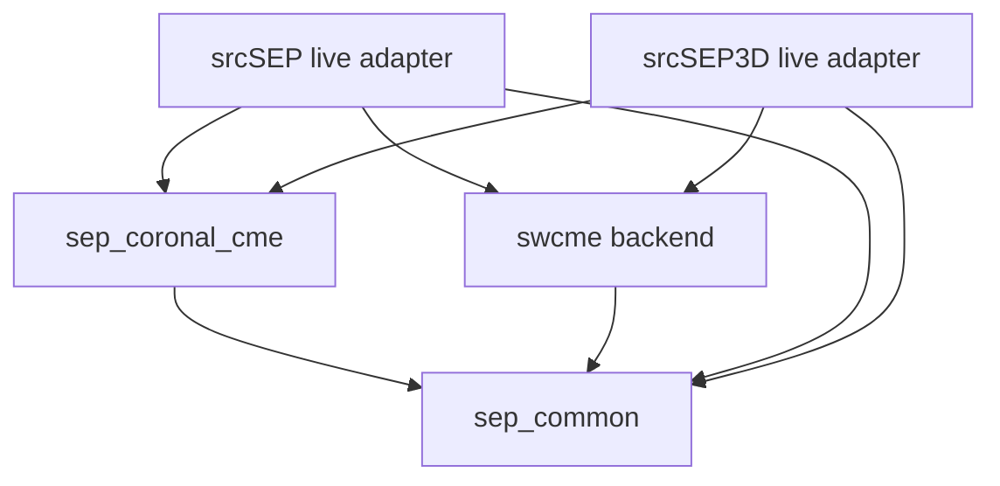
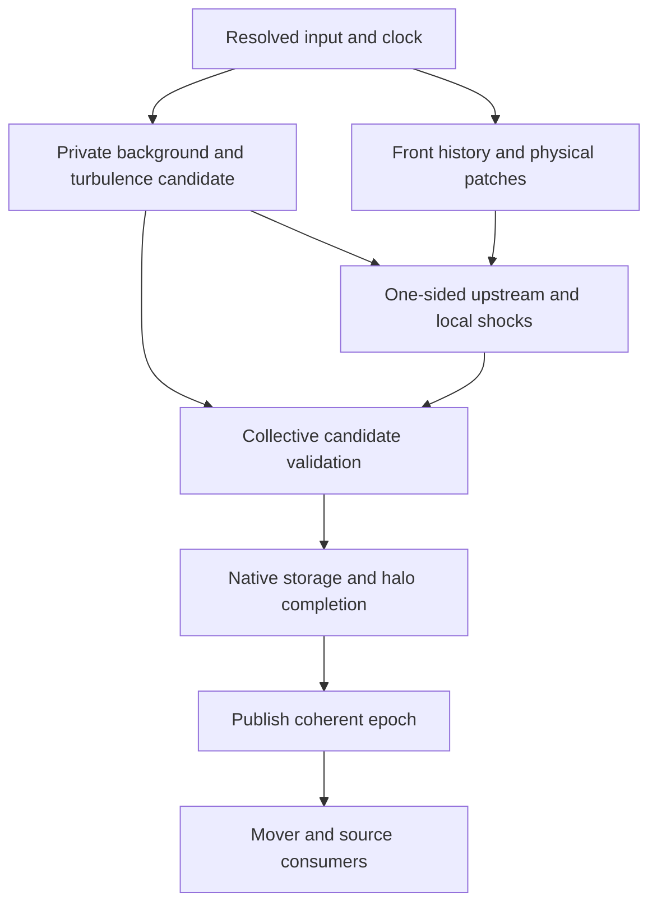

# Roadmap: shared low-coronal CME launch for srcSEP and srcSEP3D

**Revision:** 2026-10-03, plan 1.2 — qualified launch-review corrections  
**Status:** implementation and validation plan; the work described below is not newly implemented by this document.  
**Code baseline audited:** `SEP3D_corona_coupling_compile_fix_20261003.tar.gz`.  
**Suggested repository location:** `src/models/sep_coronal_cme/docs/CME_SURFACE_LAUNCH_ROADMAP.md`. The repository uses `src/models`, plural. Application READMEs should link to this shared roadmap.

## 1. Deliverable and physical scope

The deliverable is one shared, input-driven coronal-CME model that both `srcSEP` and `srcSEP3D` can construct independently. It initializes a finite candidate front just above the photosphere, advances its prescribed three-dimensional shape and motion, evaluates local shock states using the same coronal upstream authority supplied to either transport application, and writes complete diagnostics. Each application then adds physically normalized SEP release and its native transport, with ownership, restart and conservation accounting.

All launch, background, geometry, shock, release and field-line reduction physics belongs under `src/models`, alongside the existing SWCME and corona components. `srcSEP` uses a field-aligned representation of this shared three-dimensional state; `srcSEP3D` uses a Cartesian AMR representation. The CME is not replaced by a one-dimensional spherical front in `srcSEP`. Both applications query the same finite geometry, histories and local source law through thin adapters.

This is a stand-alone, prescribed-front model. Launch direction, shape, and acceleration history are inputs. The code determines where the prescribed front is a physically admissible fast shock; it does not derive the eruption or acceleration history from magnetic instability. No external global MHD solver, imported-MHD runtime, spheromak, or flux-rope insertion is a prerequisite. The existing `mhd_jump_solver` name refers to local magnetized-plasma jump relations, not to running a global evolution solver.

“From the solar surface” means a dome whose mathematical ellipsoid intersects the solar sphere, with its exposed apex initially in the low corona. Use `1.05 R_sun` for the first verification configuration; qualify `1.01 R_sun` only after geometry, background, mesh, and stencil convergence. These heights are proposed numerical test cases from the existing specification, not universal physical CME onset heights. A zero-area point at exactly `r=R_sun` is not a suitable finite source surface. The solar sphere is the absorbing particle boundary, not a CME particle-injection boundary.

Solar clipping, valid plasma coverage, particle-transport support and qualified source support have separate bounds. In particular, the r4 minimum qualified source radius `R_in` is not the background's inner boundary. A dome with apex exactly at `R_in` may have zero qualified initial source area while its exposed geometry and permitted guard-shell transport remain valid. Section 4.3 defines these contracts; an initialization test must not force a nonzero source by changing the launch physics.

Four completion claims must remain separate. A and B require evidence from both application consumers before shared availability is declared complete:

| Milestone | Required observable result | Permitted claim |
|---|---|---|
| A: native front launch | Shared input-driven dome and local states; srcSEP line publication and srcSEP3D mesh/halo publication; finite output from each | Both applications consume a prescribed low-coronal candidate front. An initially sub-fast front is valid. |
| B: native SEP launch | A plus qualified release support, physical source measures, native particles in each application, transport, return/escape ledgers, restart and MPI checks | Both applications release SEPs from the same prescribed coronal shock and transport them in their declared upstream domain. |
| C: event qualification | B plus qualified event background, reconstructed front history, independent data and response metrics | The specified event model passes its stated observational tests. |
| D: disturbed plasma provider | Independently specified shared spatial sheath/ejecta closure, regional fields, line/mesh consumers, conservation and validity tests | Both consumers can query spatial plasma and magnetic fields modified by the CME within supported regions. |

Milestone D is additional shared-model work. Local downstream jump values at a front do not define a spatially resolved CME sheath or ejecta. A/B can operate with an upstream-only transport policy and an explicit front-return boundary. Their plasma output must clearly label the ambient field and the separate surface jump diagnostics; it must not display the ambient field behind the front as a computed downstream solution.

Application-specific progress may be recorded as A-SEP, A-SEP3D, B-SEP or B-SEP3D. Completion of one consumer is useful partial progress, but it does not close the requirement that both consumers have access. Cross-application agreement is required only in matched physical limits; general 3-D transport with perpendicular diffusion or drift is outside a field-aligned production mover's dimensional scope.

## 2. What the source audit established

The audit inspected the delivered source files and compiled a small consumer of the actual schema-5 parser. It did not execute a native NASA HPE MPT run. The following are concrete code findings, not assumptions about a remote installation.

| Existing component | Reusable implementation | Remaining connection or hardening |
|---|---|---|
| `src/models/sep_coronal_cme/src/ellipsoid_geometry.cpp` | Fixed radial-principal basis, center/apex factories, independent smooth histories, Hermite history, normals, normal speeds, curvature and tessellation | Construct the history from input; qualify solar clipping and surface support; preserve physical patch identity in the runtime. |
| `.../configuration_parser.cpp` and `schema5_registry.inc` | Strict versioned lexer, key registry and raw assignment map | The registry lacks the documented radial and two lateral semiaxis fields. The typed configuration materializes only Stage 0–2 authorities. A complete front resolver is missing. |
| `srcSEP3D/runtime/configuration_io.cpp` | Native schemas 1–4, strict application configuration | Its version check rejects schema 5. No native schema-5 CME configuration path exists. |
| `srcSEP3D/runtime/run_configuration.h/.cpp` | Immutable application configuration and runtime gates | `ShockAuthority` currently contains only `None` and `Swcme`. Corona explicitly requires schema 4, transport-only, no shock and no source. Add a distinct coronal-front authority and its profile gate. |
| `.../background_provider.cpp`, `srcSEP3D/background/bg_corona.cpp` | PFSS/Parker diagnostic ambient provider and native background updates | Assemble the launch profile deliberately. The current diagnostic profile is not the complete schema-5 PFSS/SCS/wind event model. |
| `.../shock_provider.cpp` | Patchwise local fast-shock classification, interface evidence, measures and local transactional snapshot | Build inputs from actual front patches and the authoritative upstream. The implementation hard-codes `5/3` for characteristics and jumps; resolve the configured EOS instead. Add application-wide staging. |
| `.../mhd_jump_solver.cpp` | Local jump solver and residual checks | The compression scan starts at `1+1e-6`; sufficiently weak valid shocks may lie below that cutoff. Qualify a weak-shock branch before trusting delayed activation. |
| Geometry/provider IDs | Tessellator produces IDs beginning at zero | Shock preparation rejects ID zero. Establish one stable, documented mapping before joining the APIs. |
| `srcSEP3D/adapters/shock_geometry.h` | Sphere and finite-SSE geometry | No triaxial geometry is accepted. Carry full shape/history into crossings and step control; preserve legacy sphere/SSE behavior. |
| `srcSEP3D/adapters/transport_adapter.cpp` | Native transport adapter and sphere/SSE intersection handling | No moving triaxial intersection; current crossing deduplication can skip further contacts within the same generation. Define physical encounter identity. |
| `srcSEP3D/adapters/source_runtime.*` | Existing injection planning and allocation path | Source records are declared through a SWCME-specific header. Add a neutral contract for absolute coronal release measures and reference-surface placement. |
| `.../particle_source.cpp` | Spectrum/CDF, species validation, source budgets, keyed sampling, reference-surface and ledger kernels | Assemble those kernels into an interval-aware native source; several APIs remain narrower than the normative event contract. |
| `srcSEP3D/main_lib.cpp` | Mesh filling, both native DATAFILE slots, halo exchange, time-boundary source allocation | Join background, front/shock, turbulence and source eligibility into one consistent epoch; implement coronal factories and allocation. |
| `srcSEP3D/output/restart.cpp` | Legacy sphere/SSE checkpoint fields | Decoder permits geometry values only through 1. No triaxial histories, activation intervals or source-termination latch are serialized. |
| `.../field_line_reduction.*` | Both-sign tracing, outward arc length, finite flux-tube measures, front intersections and neutral line-set construction | Reuse for live srcSEP consumption; qualify interior/tangent roots, per-intersection eligibility and complete time histories rather than duplicating 3-D geometry in srcSEP. |
| `srcSEP/adapters/field_line_bundle_adapter.*` | Strict neutral bundle loading and bounded line resampling into application snapshots | An import path is not a native live coronal launch factory. Add an independent live-provider adapter and retain replay as an explicit alternative. |
| `.../model/architecture_exchange.md`, baseline dependency contract | srcSEP3D links the model; baseline srcSEP imports neutral bundles without linking the coronal model | This roadmap deliberately changes that restriction: both live consumers may link the shared model. Update the normative contract and architecture tests together. |

The reproduced parser diagnostic was:

```text
line 4: unknown schema-5 key shock_geometry.radial_semiaxis.initial_value_m
```

The normative configuration text says “Same fields as shock_geometry.center_distance” for the three axis sections, but the generator skips comments and therefore does not generate those keys. Expand the authoritative grammar explicitly or implement an explicit, verified grammar inheritance rule. A generated-file byte check alone cannot discover this omission because the incomplete file exactly matches the incomplete extraction.

These findings refine the earlier assessment: the work belongs chiefly to unfinished baseline Stage 8–9 integration, with required Stage 0 and Stage 5–7 hardening. Completing Stage-14 research extensions is not necessary to obtain milestones A/B.

## 3. Non-negotiable contracts

1. **One upstream authority.** The front samples the same coronal model, composition, frame, epoch and configuration identity used to fill native mesh cells or field-line nodes. Do not attach a SWCME shock with its independent upstream density or field.
2. **Prescribed geometry is not automatically a shock.** A candidate patch with no positive inflow or with `M_f<=1` has no fast-shock source. Geometry and diagnostics remain available. Zero particles can be the correct initialized result.
3. **Independent motion and expansion.** The local normal speed comes from the implicit moving surface. Apex speed is not applied to every patch.
4. **Explicit supported domain.** Use exact solar and escape surfaces. Guiding-center transport must respect null, sector, interface and downstream-support boundaries. No magnetic floor or replacement Parker field may conceal a rejected region.
5. **One complete epoch.** A mover never observes new background fields with an old front/shock or old turbulence. Every source cohort records the actual epoch bindings.
6. **Physical rates before Monte Carlo counts.** Changing particles, ranks, mesh or patch tessellation must not change the requested physical source. Missing support is separately budgeted, not hidden by survivor renormalization.
7. **Stable identity.** Patch, species, source cohort and random-stream identities do not depend on MPI rank, vector order or a transient mesh address.
8. **Native evidence is distinct.** Shared-library unit tests, native initialization, native transport, convergence and event validation have separate evidence records.
9. **Generic AMPS remains generic.** Reuse the SWCME runtime-provider/DATAFILE ownership mechanism. Keep front, source and corona logic in the model and application adapters. Preserve default file scheduling for other applications.
10. **Both applications are first-class consumers.** Each may construct and advance the shared model through its own adapter. Neither launches the other executable, reads the other's internal headers or requires artifacts generated by the other to run a live coronal CME.

### 3.1 Shared ownership and dependency contract

| Layer | Owns | Must not own |
|---|---|---|
| `src/models/sep_common` | Neutral status, capability, epoch, geometry/source/line records; reusable transport, coefficient, spectrum, species and numerical utilities | Coronal/SWCME formulas, application configuration, PIC/MPI storage or a dependency on either upper physics model |
| `src/models/sep_coronal_cme` | Coronal field/plasma/EOS, launch/history resolution, exposed CME geometry, local shocks, eligibility, physical release plans, line tracing/reduction, model history serialization | AMPS particle allocation, application movers, host mesh/line containers or rank-owned output |
| `src/models/swcme` | Existing heliospheric SWCME physics behind the common consumer contract | Coronal-model internals or either SEP application's internals |
| `srcSEP/adapters` | Provider selection, line snapshot installation, field-aligned particle/source hooks, host ownership and restart integration | A second launch, shock, source-normalization or field-line tracing model |
| `srcSEP3D/adapters` | Provider selection, AMR/DATAFILE installation, halo readiness, native particle/source hooks and restart integration | A second launch, shock, source-normalization or geometry model |

The neutral layer is the lowest dependency. The coronal and SWCME models remain sibling backends; neither includes the other's internals. A generic contact/root utility can live in `sep_common`; the triaxial coronal history and SWCME finite-SSE formula stay in their respective model. Both applications may link the selected backend and `sep_common` directly.



These arrows are permitted build dependencies, not a requirement to construct both physics backends in every run. The model's public headers remain standard C++17 plus neutral headers, with no `srcSEP`, `srcSEP3D`, PIC, MPI or application-output include. Collective success and native readiness are enforced by the host adapters around private shared candidates.

### 3.2 Independent live mode and optional bundle replay

The audited baseline specification explicitly prohibits srcSEP from linking or invoking `sep_coronal_cme` and restricts it to checksummed bundle import. The user's shared-availability requirement supersedes that design restriction for the planned live mode. Change `model/architecture_exchange.md`, the generated `model.md`, architecture/build tests, Stage 10 documentation and both application READMEs before declaring that mode implemented. Do not merely link the library while leaving contradictory normative text.

- **Live shared-provider mode:** either application resolves the same model configuration and advances its own immutable epochs. srcSEP obtains field-line reductions directly from the shared model, without a preceding srcSEP3D run.
- **Bundle replay mode:** srcSEP may retain the existing checksummed neutral import path for frozen-state comparison and offline reproduction. A bundle-only build can remain independent of the coronal/SWCME archives. Replay must declare its time coverage and cannot silently act as an evolving live provider.

Backend choice and transport-equation choice remain independent. The generic consumer contract carries explicit capabilities, provenance and validity. Unavailable combinations fail before allocation; selecting Parker or focused transport cannot quietly select a different background or alter source normalization. A future continuous corona-to-SWCME provider may occupy a separate proposed `src/models/sep_corona_swcme` sibling, compose the two backends through their public contracts and serve both applications. That handoff is a separate roadmap milestone, not functionality implemented by this document.

### 3.3 Normative ownership and review traceability

The modular r4 files under `sep_coronal_cme/model/` remain the authority for coronal physics and configuration; the generated `model.md` is their derived document. This roadmap owns the implementation order, evidence and exit gates. The separate corona-to-SWCME composite design, revision 1.2, owns continuous handoff and any selected spatial disturbance closure. A roadmap paragraph cannot silently override either physics contract. L0 records the exact source revision/checksum of each normative module and composite design, and L1 changes the authoritative modules and generated outputs together wherever a contract must change.

| Contract | Authority and required reconciliation | Implementation / evidence |
|---|---|---|
| Solar, plasma, transport and source radii | r4 `model/physics.md` and `model/configuration_validation.md`; reconcile the composite design's first-valid-plasma radius with r4's initialized precipitation/guard shell | L0–L3, L6; CMLU33, CMLU36, CMLN17 |
| Fixed-orientation geometry, clipping and histories | r4 physics Section 8 and its complete schema; attachment is a declared support condition, not a material-footpoint claim | L1–L2; CMLU05–09, CMLU34 |
| Local fast-shock classification and weak limit | r4 physics Section 9; preserve the configured EOS and distinguish unqualified diagnostics from source-eligible states | L3–L4; CMLU14–16, CMLU33 |
| Finite reference surface and release measure | r4 physics Section 10; separately state physical calibration bounds, geometric regularity and numerical error | L7/L12; CMLU23–27, CMLU35, CMLF03–04 |
| Solar precipitation and equation validity | r4 transport/source contracts; one physical photospheric sink with a qualified equation-specific representation | L6/L11/L13; CMLU22, CMLU36, CMLN11, CMLF08–09 |
| Optional disturbed volume and continuous handoff | Composite provider design, proposed `src/models/sep_corona_swcme/model.md`, revision 1.2; launch roadmap Section 12 tracks dependencies only | Milestone D and the composite roadmap; no A/B volume-state claim |
| Shared live/replay availability | `model/architecture_exchange.md`; explicitly revise the baseline bundle-only restriction while retaining a neutral replay build | L0/L1/L12–13; CMLF06–07, CMLF12 |
| Native storage and readiness | Neutral epoch contracts plus each host's storage/phase-order documentation; preserve generic AMPS behavior | L5/L9; CMLN01, CMLN05–06, CMLF05, CMLF10 |

**Known cross-document conflict to resolve:** r4 requires a fully initialized, source-free precipitation/guard shell down to the solar boundary. Composite design 1.2 permits a first valid plasma radius above that boundary and forbids extrapolation into an uncovered interval. An application cannot transport particles through that interval without a separately declared and tested closure. L0 must record the conflict; L1/L3 must either supply the guard closure, choose a provider with complete coverage, or reject that transport profile. Moving the qualified source radius or treating the whole interval as geometry-only does not close it. This roadmap update does not itself edit those normative documents.

### 3.4 Disposition of the launch review

| Review finding | Qualified correction adopted | Limits on the correction |
|---|---|---|
| 1. Solar clipping versus inner radius | Separate geometry, background/guard transport and source masks; prohibit qualified release below `R_in`; track all excluded area | `R_in` is a source qualification bound, not automatically a plasma boundary. Valid guard-shell transport still needs initialized fields. |
| 2. Early detachment and large acceleration | Replace the introductory history with an explicitly attached, expansion-dominant verification fixture; retain the old history as a detachment stress oracle | Attachment and acceleration bounds are case-specific. Detached fronts are allowed only by a declared branch; neither a fixed duration nor a universal acceleration limit establishes physical validity. |
| 3. Parker solar losses | Verify the Parker diffusion limit against focused transport and document its boundary layer; retain a common physical photospheric sink | No default reflecting boundary or fixed per-contact loss-cone probability. Both would change the model or introduce timestep bias without a derived closure. |
| 4. Reference offset near high curvature | Add independent calibration, regularity and resolution gates; budget unsupported source measure | An exact area factor larger than one is valid for an outward convex offset. Large curvature alone is not a numerical failure. |
| 5. Launch observations | Add V17–V19 for EUV geometry, radio/shock onset and reconstructed nose/flank properties | Observation height, emission/visibility, density and reconstruction uncertainties are part of each test. A sample's onset-height range is not a universal launch constraint. |
| 6. Fixed orientation | Declare its event scope and test direction/tilt sensitivity; reject unsupported time-dependent attitude/deflection selectors | The current kernel is fixed-orientation. A general formula containing `Q_dot` does not mean angular motion is implemented. Future path deflection and body rotation are separate capabilities. |
| 7. Overlapping design documents | Assign normative ownership and explicit cross-document reconciliation at L0/L1 | This plan remains a roadmap, not a third independently maintained physics specification. |

## 4. Input contract to implement

### 4.1 Version dispatch and ownership

Implement a true native schema-5 dispatch in both applications: existing schemas continue through their existing parser; schema 5 passes through the shared parser, a complete model resolver, and the appropriate host-configuration translator. Do not change an input version to 4 to bypass a check, and do not make a native parser accept 5 while silently retaining legacy field meanings.

Before freezing schema 5, reconcile its complete grammar with both native hosts: clock and maximum steps, line/Cartesian mesh, observers, storage, source species, output and restart. Use one documented source of truth for each quantity. Add any missing native profile selector explicitly to the normative modules and generated registry. A diagnostic launch profile must be named and cannot inherit an event-qualified label.

Keep a common model input or common resolved model record for the launch, corona, EOS, source, physical species and observer definitions. Application wrappers supply their line/AMR discretization, macro counts, compiled-species mapping, output and checkpoint settings. If wrappers reference a shared model file, resolve that reference relative to the wrapper's directory and checksum it; reject duplicate competing physics declarations. The mechanism and exact selector names are to be implemented and documented, not inferred from the example filenames.

Both consumers report the same resolved physics identity for the same event. Discretization, sampling and transport choices receive separate numerical/run identities. Changing line-node count or AMR size must not redefine the prescribed event. Changing a declared physical transport coefficient still changes the physical transport configuration identity. Retain existing srcSEP CLI precedence and help behavior through its current CLI parser; do not introduce an unrelated launch parser in `main_lib.cpp`.

### 4.2 Required launch quantities

| Quantity | Canonical section/key or record | Required behavior |
|---|---|---|
| Clock origin | `[shock_geometry] reference_time_s` and run start time | Distinguish simulation start, geometry reference time and observational epoch. |
| Shape | `model=triaxial-ellipsoid`, `axis_convention=radial-principal-axis` | Three positive semiaxes; immutable convention. |
| Direction | `direction_frame`, `direction_longitude_rad`, `direction_latitude_rad` | Explicit frame and radians; convert observation products once. |
| Lateral tilt | `lateral_axis_tilt_rad` | Right-handed rotation about the radial principal axis. |
| Orientation capability | `orientation_evolution=fixed`; constant direction in its declared frame | Baseline supports a fixed basis. Reject requested attitude/deflection histories until their separate capabilities exist. |
| Initial radial location | `initial_parameterization`, center distance or `initial_apex_radius_m` | Exactly one radial parameterization; reject conflicting input. |
| Translation history | `[shock_geometry.center_distance]` | Initial value, initial/final rates and transition timing. |
| Expansion histories | `[shock_geometry.radial_semiaxis]`, `[shock_geometry.lateral_semiaxis_1]`, `[shock_geometry.lateral_semiaxis_2]` | Same complete law fields, independently resolved and validated. |
| History choice | `evolution=independent-component-laws` or `tabulated-snapshots` | Reject unsupported interpolation/extrapolation; do not mix authorities. |
| Initial shock gate | `[shock] initial_fast_shock_requirement` | Start with `none`; this gate never manufactures a shock. |
| Shock activation | `activation=fast-magnetosonic` | Local inflow, field orientation and EOS, with event times. |
| EOS | `[plasma_eos] adiabatic_index` and composition | Use the resolved gamma and mass density everywhere. Wind closure gamma is distinct. |
| Piston | `[cme_piston]` and `[piston_geometry]` | Optional independent geometry; minimum separation and nesting tests. |
| Source support | `[source]` population, boundary, normalization, species and energy fields | Needed for milestone B, not to plot a source-free front. |
| Radius/guard support | Typed geometry, plasma-coverage, transport and source bounds; exact grammar to freeze at L1 | Separate `R_sun`, minimum valid plasma radius and `R_in`; reject required uncovered transport rather than extrapolate. |
| Attachment support | Typed attached/detached policy and declared history interval; exact grammar to freeze at L1 | Certify the policy between knots and reject unsupported detachment. Never infer it from initial intersection alone. |
| Reference calibration | Physical `L_ref` and declared source-law support, distinct from numerical tolerances | Hold the offset fixed under refinement; a changed offset requires source recalibration or a qualified transfer. |
| Numerical controls | Surface quadrature, clipping, crossing, activation and source-integration tolerances | Add explicit contracts where absent; distinguish tolerances from physical parameters. |

Every component law needs `initial_value_m`, `kinematics`, `initial_rate_m_per_s`, `final_rate_m_per_s`, `transition_start_time_s`, `transition_duration_s` and `after_transition`. Keep inactive zero/none values explicit. Under the apex initial parameterization, compute the initial center from the apex and radial semiaxis. If an independently prescribed apex motion law is desired, specify a separate complete branch; an initial apex scalar alone does not define that history.

An illustrative fragment of the **planned** configuration is below. It is not runnable in the current native executable and is not a complete schema-5 deck. All four component histories are shown to remove ambiguity. The completed fixture must declare attached support for `0 <= t <= 1200 s`, solar radius `6.957e8 m`, and separate background/source bounds. It is a geometry/acceleration verification case, not an observation-derived eruption or a guarantee of shock formation.

```ini
[shock_geometry]
model = triaxial-ellipsoid
axis_convention = radial-principal-axis
initial_parameterization = center-and-principal-axes
reference_time_s = 0
direction_frame = HCI-like-inertial
direction_longitude_rad = 0
direction_latitude_rad = 0.7853981633974483
lateral_axis_tilt_rad = 0.2617993877991494
orientation_evolution = fixed
# Direction and body basis remain fixed: no deflection or rotation history.
evolution = independent-component-laws
initial_apex_radius_m = 0
snapshots_file = none
snapshot_interpolation = none
snapshot_extrapolation = reject

[shock_geometry.center_distance]
# d_c = 0.97 Rs. With a_r = 0.08 Rs, initial apex is 1.05 Rs.
# Keep the center fixed during this attached, expansion-dominant fixture.
initial_value_m = 6.74829e8
kinematics = smooth-rate-transition
initial_rate_m_per_s = 0
final_rate_m_per_s = 0
transition_start_time_s = 0
transition_duration_s = 1200
after_transition = constant-final-rate

[shock_geometry.radial_semiaxis]
# Radial expansion supplies the apex motion: 25 to 600 km/s over 20 min.
# This declared 1200-s interval retains a solar intersection throughout.
initial_value_m = 5.5656e7
kinematics = smooth-rate-transition
initial_rate_m_per_s = 25000
final_rate_m_per_s = 600000
transition_start_time_s = 0
transition_duration_s = 1200
after_transition = constant-final-rate

[shock_geometry.lateral_semiaxis_1]
# First transverse axis begins at 0.12 Rs and expands independently.
initial_value_m = 8.3484e7
kinematics = smooth-rate-transition
initial_rate_m_per_s = 5000
final_rate_m_per_s = 200000
transition_start_time_s = 0
transition_duration_s = 1200
after_transition = constant-final-rate

[shock_geometry.lateral_semiaxis_2]
# Unequal second transverse axis begins at 0.10 Rs; units are SI.
initial_value_m = 6.957e7
kinematics = smooth-rate-transition
initial_rate_m_per_s = 4000
final_rate_m_per_s = 160000
transition_start_time_s = 0
transition_duration_s = 1200
after_transition = constant-final-rate
```

The fixed-center fixture keeps `d_c-a_r<R_sun` throughout its declared interval and has positive axes. At 1200 s its apex is approximately `1.58903 R_sun`. Its mean apex acceleration is `0.47917 km/s^2` and its peak is `0.89844 km/s^2`; these are analytic checks of the chosen interpolation, not universal CME limits. Continued constant-final-rate expansion beyond the declared interval requires a new attachment/domain-support certificate. A complete source-enabled deck must additionally qualify the corona, finite reference surface, local Mach state, open-field connectivity and release normalization.

For the selected convention,

\[
r_{\rm apex}=d_c+a_r,\qquad v_{\rm apex}=\dot d_c+\dot a_r.
\]

The existing smooth-rate transition uses `tau=(t-t_start)/T`, `S(tau)=10 tau^3-15 tau^4+6 tau^5` for `0<=tau<=1`, and rate `v=v0+(v1-v0)S`. Its integrated position is `q=q0+v0 T tau+(v1-v0)T(2.5 tau^4-3 tau^5+tau^6)`. Thus the endpoint displacement is `T(v0+v1)/2`, and peak acceleration is `1.875(v1-v0)/T` at the midpoint for a positive rate change. Validation must inspect the full interval, not just knot endpoints.

Retain the previous 120-s example as a **detachment stress fixture**: initial center/axes as above, center rate `20 -> 600 km/s`, radial rate `5 -> 100 km/s`, then constant final rates. Its mean/peak apex accelerations are `5.625` / `10.546875 km/s^2`. While `d_c>a_r` and the center is on the radial principal axis, its minimum surface radius is `d_c-a_r`. The last solar intersection occurs at approximately `211.254 s`, at apex `1.204345 R_sun`; immediately afterward the ellipsoid is detached. CMLU34 must reject this history in attached mode and preserve it in an explicitly supported detached-front mode. For more general center/attitude histories or an ellipsoid enclosing the origin, use the actual surface-extremum/contact problem rather than assuming that radial expression applies. Expansion at least as fast as translation is a sufficient attached-history design choice in this radial case; it is not a necessary condition or an event model.

Mass, internal magnetic flux/helicity and ejecta temperature are not required to specify this front-only launch. They become necessary if a later closure publishes an actual CME volume state. The input and documentation must distinguish these two representations.

### 4.3 Separate radius bounds and validity masks

The following symbols describe resolved records; they do not introduce already implemented input keys.

| Bound / mask | Meaning | Required handling |
|---|---|---|
| `R_sun` | Exact solar clipping sphere and absorbing particle boundary | Remove mathematical surface below it; solar absorption is a transport event. No source is placed on or below it. |
| `R_bg,min` | Lowest radius at which the selected provider or explicitly declared guard closure supplies valid plasma/field/derivative data | Every permitted transport and upstream/reference query must have valid coverage. No silent extrapolation into an uncovered gap. |
| `R_in` | Lowest radius at which the coronal shock/source profile is qualified | No qualified injection from front patches below it, even if an offset reference point is higher. It is independent of `R_bg,min`. |
| Guard transport | Source-free region between the solar boundary and qualified source support | Where particles are allowed, initialize fields/closures, interpolation, boundary stencils and validity categories; do not declare the whole region query-free. |
| Geometric mask | Solar-exposed candidate front, including sub-fast and source-unqualified portions | Retain geometry and clipped area in output. Diagnostic local states require valid plasma and an explicit qualification flag. |
| Source mask | Intersection of radial qualification, valid upstream/reference support, fast-shock state, connectivity and release-law eligibility | Keep geometric, excluded and eligible measures distinct. Zero eligible measure is valid; missing required positive-source support is a typed rejection. |

In r4 the intended guard shell is fully initialized down to the solar boundary, while source support begins at `R_in`. The current diagnostic provider can also evaluate below `R_in`, but that coverage alone does not certify a production near-surface closure. A profile with `R_bg,min>R_sun` must explicitly supply the missing transport closure or reject a request to traverse the gap. Geometry-only diagnostics in a source-unqualified band are allowed; they do not excuse missing fields for particles.

Split interval integration at crossings of `R_in`, clipping changes and coverage/support boundaries. Report solar-clipped area, exposed but radially unqualified area, other exclusion reasons, and qualified area without rescaling the survivors. At apex `R_in=1.05 R_sun` the initial fixture has zero qualified area up to a measure-zero contact: milestone A still succeeds. A test requiring nonzero initial release must declare an apex strictly above `R_in`, an eligible finite area and independently fast/open-field states; `R_in+0.05 R_sun` can be one chosen fixture, not a universal default.

### 4.4 Fixed orientation and future attitude/deflection capability

The audited `FixedOrientationEllipsoid` stores a constant basis, and `SurfaceVelocity` includes center translation and axis growth only. In the baseline, `R_dot=0`; `Q_dot` comes from changing semiaxes. This is sufficient for a scoped fixed-direction launch, but it does not implement observation-derived rotation or a changing propagation direction.

A later capability must distinguish center-path deflection, `c=d_c e_r(t)` with `c_dot=d_c_dot e_r+d_c e_r_dot`, from body attitude `R(t)` and its angular-velocity terms in `Q_dot`. A quaternion history alone does not prescribe the center path. Its schema must define frame conventions, normalized SO(3) interpolation, consistent derivatives, valid time coverage, immutable history identity and restart reconstruction, with independent velocity/normal-speed/contact tests. Such histories remain unavailable until those gates pass. For milestones A/B use fixed-direction fixtures; for event milestone C, propagate direction/tilt uncertainty and document any omitted deflection. Reject an event use whose sensitivity exceeds its declared tolerance rather than claiming that static orientation describes arbitrary eruptions.

## 5. Implementation stages and exit gates

Stages L0–L13 below are supplemental launch tasks, not replacements for the canonical Stage 0–14 numbering. Their numbers identify work packages rather than a compulsory serial schedule. L12 adds the field-aligned consumer and begins as soon as shared configuration/geometry are available; it must not wait until 3-D event qualification. L13 qualifies joint availability. L10 supplies tests and output throughout development.

### L0 — Rebaseline capabilities and reproduce interface failures

**Goal:** produce an honest inventory before widening any runtime selector.

**Work:**

- Record which public APIs construct real providers, which consume caller-built records and which are validation kernels. Run the existing shared, srcSEP and srcSEP3D suites against one source tree.
- Add an external-header consumer that joins configuration, ellipsoid, upstream, shock and source APIs without AMPS or SWCME dependencies.
- Preserve reproductions for missing semiaxis grammar, patch ID zero, gamma propagation, weak roots and missing triaxial restart/mover geometry.
- Record separately whether each application's native MPI tests executed. Keep a compatibility matrix for diagnostic corona, SWCME sphere/SSE, analytic Parker, bundle replay and a representative non-SEP application.
- Audit the bundle-only architecture restriction and name each contract/build test that must change to admit the new live srcSEP consumer. Preserve the lowest-layer and generic-core prohibitions.
- Build the Section 3.3 traceability table against exact source revisions/checksums. Resolve who owns solar/guard plasma coverage, source qualification, fixed-orientation kinematics, transport boundaries and optional composite volume state. Preserve the r4/composite guard-shell disagreement as a blocking negative fixture until the selected profile has a declared closure.

**Files:** model `README.md`, architecture contract, Stage 0/5/7/8/9/10 documentation, both application READMEs, `CORONA_MESH_BACKGROUND.md` and all applicable test registries.

**Tests:** CMLU01, CMLU32 and the contract/preflight parts of CMLU33–36; CMLN01 and CMLF12 for independent native compatibility.

**Exit:** no “native complete” status is inferred from shared tests; every blocker has a negative fixture and owner. Required plasma/guard coverage has one consistent normative contract, or the affected transport profile is explicitly unavailable.

### L1 — Complete the schema and construct typed CME configuration

**Goal:** a complete input deck produces an immutable front/shock/source configuration before native line/AMR allocation.

**Work:**

- Expand the three semiaxis grammar sections; regenerate `schema5_registry.inc` and the normative model document. Test actual parser acceptance, not just generator consistency.
- Materialize geometry, history, piston, shock, source and numerical controls into typed shared records. Validate every requested history over the run interval, including between tabulated knots.
- Add native schema-5 dispatch and an explicitly selected coronal shock authority to both applications. Keep existing schema-4 corona background-only rules intact.
- Translate native line/AMR mesh, storage, clock and output options without duplicating physical parsing. Detect different model and host solar radii, EOS, epochs or source bounds.
- Freeze checksums for tabulated histories, magnetograms and calibration assets. Fingerprints include physical selectors, numerical laws and supported profiles; comments do not change physics identity.
- Reject unavailable capabilities before expensive AMR allocation. Do not parse-and-ignore unsupported source branches.
- Resolve distinct solar/plasma/transport/source bounds, attached/detached history support and physical reference-calibration bounds. Validate initial qualified source area separately from exposed geometric area. A source-free initialization is a legitimate profile.
- Keep fixed orientation explicit. Unsupported time-dependent direction/attitude input is a capability error; accepting a general kinematic expression cannot substitute for a supported history implementation. Freeze case-specific acceleration and geometry-support checks before evaluating the fixture.

**Files:** shared `model_configuration.*`, `configuration_parser.*`, grammar generator; each application's existing configuration/CLI entry points and provider/factory registration.

**Tests:** CMLU02–04, CMLU33–35; native CMLN02 and compatibility CMLN01; CMLF01, CMLF06 and CMLF12 as the srcSEP binding becomes available.

**Exit:** all four component histories survive parse → resolve → serialize → provider construction without implicit defaults. Invalid launch input fails with its key and reason before allocation.

### L2 — Assemble the moving dome and qualify solar clipping

**Goal:** one authoritative geometry history supplies output, shock patches, reference surfaces, line/mesh queries and mover crossings.

The shared surface remains

\[
F(\mathbf x,t)=(\mathbf x-\mathbf c)^T Q(\mathbf x-\mathbf c)-1,
\quad \mathbf c=d_c\hat{\mathbf e}_r,
\quad Q=R\,\mathrm{diag}(a_r^{-2},a_1^{-2},a_2^{-2})R^T.
\]

Its exposed physical surface is `F=0` with `r>=R_sun`. Its exact normal speed is

\[
V_n=-F_t/|\nabla F|,\quad
F_t=-2\dot{\mathbf c}\cdot Q(\mathbf x-\mathbf c)
 +(\mathbf x-\mathbf c)^T\dot Q(\mathbf x-\mathbf c).
\]

**Work:**

- Build immutable, time-queryable front history from the typed records using the existing smooth/Hermite kernels.
- Qualify a constant body basis in the baseline. The general implicit speed formula permits rotation mathematically, but here `R_dot=0` and axis growth supplies `Q_dot`. Time-dependent body rotation or center-path deflection needs Section 4.4's separate capability.
- Validate center distance and positive axes throughout each interval. Compute the solar intersection contour and clipping topology; midpoint rejection alone is insufficient for boundary patches.
- Integrate partially clipped parameter cells with adaptive subdivision or a verified cut-surface rule. Keep geometric area, removed solar area and quadrature uncertainty separately.
- Independently split exposed patches at `R_in` and any plasma/support boundary. Retain source-unqualified exposed area; never remove valid geometry just because it cannot inject. Certify radius/support events between publication times and history knots.
- Map tessellator parameter indices to nonzero global physical IDs; reserve zero explicitly. Preserve parent/child lineage when clipping or interfaces split a patch.
- Define whether the representation must remain attached throughout its declared low-coronal interval. Reject an attached-dome history that loses the required intersection. A detached-front branch must be explicit; do not claim permanently anchored material footpoints from a moving clipping contour.
- Compute minimum/maximum heliocentric surface radius and intersection topology throughout each history interval. In the radial `d_c>a_r` fixture, use `d_c-a_r` as an independent minimum-radius oracle; other supported configurations require a true extremum/contact solver. Verify the quintic law's peak acceleration and the 211.254-s detachment stress case independently.
- Preserve rear/front geometry semantics of the canonical ellipsoid rather than introducing an undocumented spherical-cap mask. Let local inflow classify non-shock patches; any separately restricted physical surface requires its own declared support.
- If enabled, resolve the independent piston and test nesting/separation on common heliocentric rays over time.

**Files:** shared `ellipsoid_geometry.*`; proposed `cme_front_configuration.*`, `cme_front_history.*`, `cme_surface_quadrature.*`.

**Tests:** CMLU05–09, CMLU33–34; native solar-boundary CMLN17.

**Exit:** finite nonzero exposed dome area, no physical patch or birth point below the photosphere, converged geometric/qualified/excluded areas, correct unequal-axis speeds and stable IDs. Attachment holds over the declared attached interval; an allowed detached branch is labeled separately. Zero qualified initial source area does not fail this geometry gate.

### L3 — Build a canonical upstream bridge and topology-aware native support

**Goal:** the front and particles use the same physical upstream authority.

**Work:**

- Expose an immutable upstream query that returns B, U, mass density, total/electron pressure, species composition/temperatures, EOS, region, sector, interface validity, frame and background generation.
- Map that same query to srcSEP line nodes and srcSEP3D owner/ghost cells. Focusing, parallel gradients and directional turbulence use the shared primitives and declared one-sided derivatives; neither host invents a second corona.
- Use `CoronalPrimitive::plasma` for density/composition. Do not recover mass density by treating electron density as proton density or by inverting a separately stored Alfven speed. The current `BackgroundSample` has no independent mass-density field; add a capability-guarded application/neutral record or retain a bound canonical upstream record rather than inventing a conversion. New storage fields need a layout fingerprint and legacy-provider defaults.
- For the first diagnostic launch, compose the existing PFSS/Parker diagnostic background under an explicit diagnostic profile. For a baseline event profile, assemble and qualify the Stage 1–3 PFSS/SCS/wind components and their interface evidence. Do not relabel the existing profile as event-grade.
- Retain categorical region/sector/validity evidence through native storage or an application-owned categorical cache. The current native numeric sample does not expose the complete shared identity contract. Halo exchange must cover these tags as well as B/U and derivative tensors.
- Query surface upstream one-sidedly. At mixed interfaces, split patches or exclude a physically measured, budgeted clearance region. Surface and source samplers cannot interpolate across sector or open/closed changes.
- Keep gradients branch-preserving at the photosphere, source surface and separatrix. Reuse the existing adapter's one-sided stencil logic; verify the mover's interpolation also respects the categories.
- Initialize every permitted guard-shell transport path using the selected provider or a separately qualified guard closure. Record `R_bg,min` independently of `R_in`; coverage, derivative and interpolation checks apply below `R_in` whenever particles may reach that region. An uncovered required interval rejects the profile before transport, without extrapolation or an implicit reflecting boundary.
- Begin with a full allocated low-coronal domain. A prescribed Parker corridor does not establish PFSS connectivity. Later pruning must use authoritative traced open lines plus the complete source/reference/observer support and a conservative halo buffer.
- That full/corridor allocation control belongs to srcSEP3D. srcSEP requests supported field lines and finite footprints directly; it does not need to allocate a Cartesian domain to access the shared provider. Its omitted tube/source measures still require explicit coverage and exclusion budgets.

**Files:** shared background/plasma/topology and field-line reduction contracts; each host's background snapshot/storage and gather/interpolation adapters; srcSEP3D `background/bg_corona.*`, `bg_provider.h` and active-region preflight.

**Tests:** CMLU10–13, CMLU33; CMLN05, CMLN12 and CMLN17.

**Exit:** surface, line and mesh samples agree at matching coordinates/epochs within their declared representation error; topology evidence is preserved; all required source paths have coverage. A diagnostic run cannot claim event qualification.

### L4 — Assemble shock patches, delayed activation and weak-shock handling

**Goal:** the prescribed front yields valid local states without forcing weak or sub-fast patches into strong shocks.

For every patch evaluate

\[
u_{1n}^{\rm in}=V_n-\mathbf U_1\cdot\hat{\mathbf n},
\qquad M_f=u_{1n}^{\rm in}/c_f.
\]

**Work:**

- Build `ShockPatchInput` from actual patch position, area, normal, normal speed and upstream query. Preserve geometry alongside the current snapshot, which does not itself carry all position/normal data needed by the host.
- Supply gamma from the resolved EOS to characteristics and jumps. Remove hard-coded `5/3`, or explicitly reject other gamma values until supported; never silently ignore configuration.
- Distinguish no inflow, sub-fast, admissible fast, criticality-inapplicable and numerical failure. Keep geometric/fast/source-active masks separate. A simple fixed critical-Mach threshold cannot masquerade as a qualified obliquity/beta table.
- Below `R_in`, allow a local diagnostic state only when its upstream query is valid, and mark its shock/source qualification explicitly. Do not construct a qualified source there merely because a jump solve converges or the reference point lies above `R_in`.
- Harden the jump solve near `M_f=1`: bracket the physical root in a variable such as `r-1`, isolate the trivial `r=1` branch, use scaled residuals and cancellation-resistant weak limits, and check entropy/characteristic ordering. Retain independent parallel/perpendicular/oblique tests.
- In the hydrodynamic verification limit use the independent oracle `r=(gamma+1)M^2/[(gamma-1)M^2+2]`. It demonstrates why a fixed lower bound of `r=1+1e-6` cannot resolve every `M>1` case.
- If a weak solution remains unresolved, preserve an explicit numerical status. Production must reject it unless an independently bounded approximation/exclusion policy has been defined and validated. Do not clamp Mach number, substitute a compression floor or convert numerical failure to physical sub-fast status.
- Root-locate activation/deactivation and source support changes inside each interval. The existing first-crossing helper needs an event-search layer that can bracket multiple crossings; matching endpoint signs does not prove no event occurred.
- Apply the initial-fast requirement only to initialization, not as an accidental repeated “must remain fast” rule on every later publication. Persist source termination independently of later Mach values.

**Files:** `shock_provider.*`, `mhd_jump_solver.*`, proposed coronal surface builder/history; model numerical contracts and tests.

**Tests:** CMLU14–17, CMLU33; CMLN03–04, CMLN06 and CMLN15.

**Exit:** a valid sub-fast initialization succeeds with zero source; activation time converges independently of publication cadence; weak solutions satisfy physical residuals or produce a traceable rejection before publication.

### L5 — Publish one coherent native background/front/shock epoch

**Goal:** initialize and update a complete coronal-CME state through the existing generic coupling mechanism.

**Work:**

- Assemble the background handle, front history, patch surface, shock snapshot, turbulence and source-support metadata in the shared model. Each application factory constructs this assembly and holds its immutable handles; it does not implement a separate physical preparation sequence.
- Prepare all fallible candidates privately. The existing shared shock `Prepare` commits a local snapshot; wrap it in a candidate-owned instance or split preparation from publication so a later MPI rejection cannot advance live provider state.
- Define an immutable epoch bundle with a bundle ID and explicit background, front, shock and turbulence bindings. Do not require unrelated counters to be numerically equal; require each referenced generation and epoch to match its actual authority.
- Validate all ranks before touching live center data. Stage both the SEP application cache and both AMPS DATAFILE slots, retaining the existing runtime-provider ownership flag and disabling file scheduling/interpolation exactly as in SWCME.
- Complete associated-data and categorical halo exchange, derived-cache completion and collective readiness checks before publishing the bundle to movers/source/output.
- For srcSEP, stage the shared line reduction, bounded node state, line/segment ownership, front/reference intersections and source records before installing a ready line snapshot. Mesh-halo completion and line publication are separate host readiness obligations around the same model epoch.
- Prevalidate allocations/layouts and use staging or fail-stop semantics where a late write/halo error cannot be rolled back. Do not advertise rollback of partially modified native memory without an actual shadow-buffer/restore mechanism.
- On a rejected candidate, leave the previous live bundle intact for inspection and stop at the boundary unless an explicit retry succeeds for the same required time. Continuing with stale fields while advancing the clock is not allowed.
- Preserve the integer clock. Clip the last interval at run/historical coverage boundaries; compute front motion at substep time from the same history while using the declared frozen or interpolated upstream-time approximation.

**Files:** shared provider assembly/lifecycle; proposed coronal runtime adapters in each application; background factory, native initialization/time-step entry points and storage integration. Generic `src/pic` should need no new model-specific branch.

**Tests:** CMLU17–18; CMLN02, CMLN05–06 and CMLN15; reuse `BLDL3D13` and existing runtime-background lifecycle tests.

**Exit:** initialization-only and advancing runs contain one coherent epoch in each consumer; owner/ghost or line/segment fields and identities match their prepared state; injected candidate failures cannot become visible to particles.



The diagram is a dependency contract. Background geometry/shock/source candidates are prepared outside particle loops; source integration then consumes the published interval and event history.

### L6 — Add reusable moving-front contacts and native transport hooks

**Goal:** a particle detects the same moving front used by the shock/source calculations.

**Work:**

- Introduce a neutral geometry discriminant or immutable geometry interface for sphere, finite SSE and fixed-orientation triaxial histories. Implement backend shape/history queries in shared models and generic root/event mathematics in the neutral layer where reusable. Do not approximate the ellipsoid by its apex radius.
- Replace radial gap and sphere-only step bounds with conservative distance/curvature/normal-speed bounds for the actual geometry. Evaluate pose at substep time.
- Solve `F(x(t),t)=0` for the first physically relevant contact. Use an exact quadratic oracle for fixed geometry and linear trajectories; for changing axes use certified interval subdivision/bracketing. Handle tangent, multiple-root and near-surface cases without forcing a vanishing step loop.
- Verify the contact is on the exposed physical surface and inside supported domain. Retain the actual normal and instantaneous speed at the event.
- Replace “one encounter per shock generation” suppression with an event/cohort-aware policy. Two distinct contacts in one published generation cannot disappear because a flag already equals that generation.
- For Parker diffusion, endpoint/straight-segment intersection alone does not prove no absorbing-boundary encounter. Implement a validated bridge/event treatment or a verified step-convergent boundary method. A stationary/linearly moving planar boundary provides an independent Brownian-bridge oracle.
- Preserve the physical photospheric sink in both movers. Focused transport resolves pitch-angle mirroring; Parker transport needs a qualified isotropic-limit boundary representation and applicability checks. Use Section 6.1's independent loss-cone and boundary-layer tests; reflecting or partially absorbing variants are separately declared sensitivity/closure profiles, not automatic fixes.
- Define the native upstream-only front-return rule. Record the first removing event once; do not apply an unimplemented downstream transport, reflection or reacceleration rule. Closed/unsupported regions and the solar/escape boundaries have distinct event reasons.
- Keep gamma/EOS and field-frame terms consistent with the existing selected Parker/focused equations. Do not append shock energy changes twice when the selected return boundary removes the particle.
- Give srcSEP the same contact contract evaluated on its field-aligned trajectory `x_line(s,t)`. Application wrappers translate native particle coordinates and store event state; shared routines own the physical surface, root semantics and boundary disposition.

**Files:** shared coronal shape/history and neutral geometry/contact utilities; each application's mover adapter, geometry cache and encounter record. Existing `srcSEP3D/adapters/shock_geometry.h` becomes a compatibility wrapper over shared contracts rather than the sole owner of triaxial capability.

**Tests:** CMLU19–22, CMLU36; CMLN07–08, CMLN11 and CMLN17.

**Exit:** linear/nonlinear front encounters converge against independent oracles; sphere/SSE results remain unchanged; genuine repeated contacts and Brownian returns are handled correctly. Solar losses converge under the declared transport approximation and common physical sink; front-return, precipitation and escape remain distinct events.

### L7 — Construct the physical release surface and interval source

**Goal:** turn eligible shock patches into a declared physical SEP source, not a collection of arbitrarily placed particles.

**Work:**

- Construct the finite upstream reference surface `x_ref=x_front+L_ref*n`, with `L_ref` fixed in physical units under numerical refinement. Separately verify the declared physical calibration support, map regularity/no folds or self-intersections, photospheric/domain/topology clearance, and numerical background/surface resolution over the complete history.
- Define the source area measure: front area, reference area, or an explicit push-forward. For a smooth outward offset of a convex surface, the local area factor is `(1+L_ref*k1)(1+L_ref*k2)` under outward-positive principal curvature. Do not omit or double-apply that factor when mapping a declared rate density.
- At the initial fixture's nose the principal curvature radii are `a_1^2/a_r=0.18 R_sun` and `a_2^2/a_r=0.125 R_sun`. Fixed offsets `0.02 R_sun` and `0.05 R_sun` therefore have exact nose area factors about `1.28889` and `1.78889`. These finite factors are not failures. An independently declared bound on `L_ref*k_max` may limit a source calibration, but it must be physically justified and frozen for that source law; it is not a universal criterion for geometric resolution.
- Distinguish a geometrically regular but physically unsupported reference from a numerically unresolved query/quadrature. The former has a typed reason and, if an exclusion policy permits it, a physical area/rate budget; the latter triggers refinement or rejection, not a silent source suspension. Any permitted source exclusions must close the omitted measure without survivor renormalization. Only the declared physical source-termination condition sets its permanent zero latch.
- Define the reference surface velocity from the offset geometry, including `L_ref*n_dot`. For a smooth parallel surface with constant `L_ref`, its normal is the front normal and its normal speed equals the front normal speed because `n_dot dot n=0`; its tangential velocity and area mapping still change. Evaluate plasma/field at the reference point, and never substitute apex speed for this local normal speed. A variable-offset branch would require a separate derivation and capability.
- Preserve the canonical net-first-passage source interpretation. Calibrate `eta*g(p)` at this finite reference surface; it is not gross shock emission or a derived downstream distribution.
- Changing `L_ref` changes the release definition and needs recalibration or a qualified transfer between reference surfaces. Never shrink it with mesh size to hide a curvature, boundary or support failure.
- For each source-enabled compiled species, evaluate the incident number and energy measures and the chosen normalization. Apply efficiency once. Use absolute patch rates and independently check number-flux and nonthermal-energy caps.
- Integrate source rate over event-split intervals containing activation, eligibility changes, clipping/interface changes, radial taper and termination. Sample birth times from the integrated rate, or explicitly qualify the convergence of a named endpoint-birth approximation.
- Reuse normalized local-compression/fixed spectra with correct phase-space Jacobian and mass-dependent energy conversion. Near compression one, `q=3r/(r-1)` becomes large: evaluate normalization/CDF/inverse CDF stably in log space or a verified limiting form. Do not cap q or impose a compression floor to hide overflow. For focused transport implement the full signed positive-normal-flux support required by the canonical source contract, including tangent-field/no-escape/unresolved distinctions.
- Audit existing trapezoidal/fixed-quadrature helpers against the full event requirement. Add error-controlled support/root quadrature where existing helpers are insufficient; a kernel test is not proof that the assembled source meets that contract.
- Preserve the coronal source taper and zero latch. The existing specification uses a nominal `20 R_sun` source end with a separately declared `30 R_sun` sensitivity. Geometry and previously injected particles continue after source termination. Do not extend efficiency to 1 AU without a separate qualified heliospheric source model.

**Files:** shared coronal `particle_source.*`, source configuration/history and physical release planner; neutral source birth records and generic spectrum/species utilities; thin coronal source adapters in both applications. Neutralize the application record currently declared by `swcme_source_adapter.h` without moving SWCME physics into shared low-level code. srcSEP line projection consumes the physical planner and is qualified in L12.

**Tests:** CMLU23–27, CMLU35; CMLN03, CMLN09–10 and CMLN15.

**Exit:** source number/energy measures close independently of macro count and tessellation; all sampled births have supported geometry, frame and escape phase space; every excluded physical measure is retained.

### L8 — Allocate native particles and close physical ledgers

**Goal:** actual AMPS particles represent exactly the integrated coronal release.

**Work:**

- Validate every compiled species, stable ID, slot, mass, charge, source enable flag and nucleon count. Require explicit per-species normalization/fractions; do not assign the same undeclared composition to every species.
- Build globally deterministic allocation from absolute physical measures and semantic keys, then allocate only on the owning rank. Sampling changes do not rescale disconnected physical rate into surviving patches.
- Separate shared physical birth plans and semantic sampling from native installation. The srcSEP adapter places births on owned line segments with finite-tube weights; the srcSEP3D adapter places them in owned AMR cells. Both retain the same reference-surface provenance and declared physical normalization.
- Define behavior when fewer macros than positive-rate patches are requested. Either require enough representatives or use a verified unbiased sampling scheme; reject an insufficient deterministic allocation rather than silently losing a patch.
- Stage source plans before linked-list mutation. Validate owner cells, supported positions, species, weights and memory capacity collectively. On failure stop before partial injection or implement a real reversible transaction.
- Integrate births causally. A particle born at `t_b` in an interval must experience transport only after `t_b`, including the remaining part of that interval. Document a single host phase order; attaching an old birth time to a particle inserted at interval end is not sufficient.
- Carry source label, stable cohort ID, birth epoch/time, patch lineage and keyed sampling identity in particle/restart records.
- Close committed release, delayed front return, solar absorption, escape, unsupported-region loss and surviving inventory separately. Preserve immutable birth energy separately from event-time energy and cooling/work diagnostics.
- Record radius-unqualified area and reference-calibration/regularity exclusions with their event times and any independently defined physical measures. A rate outside its qualified law is inapplicable, not a known zero or an extrapolated source budget. Do not attribute particles removed at the upstream-only front to solar precipitation; native loss ledgers are required before claiming excess photospheric loss.
- Permit a zero physical source with zero allocation as success. A malformed fast source, uncovered positive source or cap violation remains an error/scientific rejection with a reason.

**Files:** shared physical source/ledger/sampling records; each application's source and particle adapters, mover records, native population and checkpoint integration.

**Tests:** CMLU27–29; CMLN09–11 and CMLN13.

**Exit:** exact integer/sample identity and represented-weight closure where promised; correct birth-time transport; no duplicate allocation after a repeated callback; all species bind correctly.

### L9 — Make epoch, MPI repartition and restart reproducible

**Goal:** the same physical event survives rank changes and restarts without resetting geometry or source history.

**Work:**

- Version the checkpoint format when adding triaxial geometry. Keep existing sphere/SSE tags and explicit legacy decode behavior; do not reinterpret tag 1.
- Store or reconstruct from checksum-bound input all four histories, basis/frame, current event intervals, activation history, source zero latch, generation bindings, cohort/encounter state and next semantic sampling counters.
- Include radius/guard coverage, attached/detached support, physical reference-calibration and boundary-closure identities. Restart cannot silently select a different precipitation model or lose the history's attachment certificate.
- Serialize model state through one shared, versioned contract. Host checkpoints separately serialize AMR/particle state or line/segment/particle state, then bind it to the same model identity. Cross-application particle-checkpoint conversion is not required; within-application MPI/rank changes and live-versus-replay identity are required.
- Rebuild the immutable coronal model and background epoch before validating checkpoint generations. Check history coverage and configuration identity before mesh mutation or particle allocation.
- Preserve stable IDs through repartition and AMR. Rebuild ownership and spatial acceleration structures from physical records; never serialize a mesh pointer as identity.
- Compare exact integer IDs, streams, source commits and termination state where deterministic guarantees apply. Compare floating fields and estimators within declared reproducibility/convergence tolerances unless the implementation supplies deterministic reductions.
- Test interrupted/rejected publication and injection, duplicate callbacks, no-source restarts, and restarts after source termination. A restarted source must not reactivate merely because its current Mach number is fast.

**Files:** shared model/history serialization and neutral source/identity records; each application's existing restart, population, line/mesh ownership and collective integration.

**Tests:** CMLU29–31; CMLN13–15.

**Exit:** continuous and restarted runs close the same physical ledgers; supported 1↔4 rank changes preserve identity; mismatches fail before live state is changed.

### L10 — Supply complete diagnostics, decks, runners and documentation

**Goal:** every stage has reviewable artifacts and no test passes on an unrelated provider.

**Work:**

- Produce an initialization-only deck and source-free launch deck first; add delayed-activation, source-enabled Parker, focused, weak-shock, restart and 1-AU transport decks as their dependencies pass.
- Include complete, commented input files. Explain fixed direction/tilt, center versus apex, independent expansion, initial zero-source behavior, source cutoff, profile status and full-domain versus traced-corridor allocation.
- Comment the solar/plasma/source radius distinction, guard closure, declared attached interval, quintic peak acceleration, fixed orientation and fixed physical reference offset. Ship the attached baseline and detachment stress fixture with expected classifications; do not relabel either as an event-derived CME.
- Ship one shared launch-physics input and separate srcSEP/srcSEP3D wrappers. Explain finite tube versus characteristic-line measures, live versus bundle replay, arc-length/pitch-angle conventions, background time support and which mesh controls belong to which application.
- Write a surface dataset containing patch/parent ID, parameter coordinates, position, normal, area, speed, clipping/region/sector, inflow, Mach, shock state, compression, residual, source eligibility and rejection reason. Distinguish inapplicable downstream data from finite valid values.
- Export minimum/maximum front radius, attachment/contact history, all qualification masks and geometric/excluded/source areas. Record reference Jacobians and separate calibration, regularity and resolution statuses. Precipitation products include boundary closure, focusing/scattering applicability, event reason and timestep convergence provenance.
- Write epoch manifests, activation/termination histories, source and loss ledgers, field/halo summaries, and detector-facing particle output with units and frame metadata. A one-number `PASS` log is insufficient evidence.
- Add proposed tests to one canonical registry after checking IDs for collisions. Keep shared/native/test-fixture/evidence-required status separate. A requested native test that did not execute must not be reported as passed.
- Integrate with `srcSEP3D/test/run_tests.py` and `run_coupled_sep_corona.py`. Preserve `sep-corona` suite naming if retained, but gate test selection by the actual provider/capability and assert its identity.
- Integrate srcSEP through its existing CLI and test manager, preserving aliases, input/CLI precedence, help-before-initialization and library entry points that do not parse process arguments. Run its applicable PCLI01–12 gates and existing CLI01–05 checks; add launch-specific bindings without weakening those checks.
- Preserve the reported SWCME compatibility regressions: runtime-provider file scheduling, owner/received-ghost derivative agreement, finite-SSE crossings and the weak-shock failure at epoch 180 s. Where the original configuration is available, retain its failing coordinates and native command as regression provenance. The shared coronal compression cutoff is a separate audited risk; it has not been established as the cause of that earlier SWCME failure.
- Resolve test inputs relative to the runner/repository root, not the caller's current directory. Register every renamed example path and archive input/reference assets. Exclude `.o`, `.d`, caches and build output from source delivery.
- Document precise native build configuration and commands. Reuse the default-preserving generic core policy; put detailed comments on model/application contracts, units, phase order and failure handling.
- Link the shared normative modules and this roadmap from both READMEs; link the composite design for optional volume/handoff work. Keep a review-disposition/change record and regenerate derived physics/schema documents when their canonical modules change.

**Files:** shared model examples/docs/test fixtures; `srcSEP/examples` and `srcSEP3D/examples`; both application READMEs, relevant Stage documents, validation registries, runners and source manifests.

**Tests:** CMLU32, CMLN01–02, CMLN16 and CMLN18–19; CMLF06–07 and CMLF12; applicable existing srcSEP CLI tests.

**Exit:** a clean source extraction independently rebuilds both applications and runs their tests from supported AMPS-root/application directories; artifact inspection proves the intended corona/front/source actually executed in each.

### L11 — Execute coupled convergence and event qualification

**Goal:** establish the accuracy and scope of the integrated model, not just successful execution.

**Work:**

- Execute the validation cases in Section 8 with nested surface, spatial, timestep/cadence and particle-count studies. Separate stochastic error from deterministic bias.
- Verify first `1.05 R_sun`, then the proposed `1.01 R_sun` case. Quantify changes in exposed area, normal speed, activation time, eligible source area, represented release and observer metrics.
- Compare a full-domain run with a conservatively supported traced-corridor run. The corridor result is accepted only when excluded physical measures and observer exposure satisfy predeclared bounds.
- Freeze event geometry, background, source calibration, transport parameters, selection masks and response functions before evaluating withheld measurements.
- Check coronal background against independent magnetic/plasma constraints and reconstruct front shape/motion from multiple viewpoints. An apex-height fit alone cannot validate flank speed or obliquity.
- Execute launch-specific V17–V19 when the claimed event and assets support them: EUV projected footprint/emission geometry, radio/shock onset with density/visibility uncertainty, and independent nose/flank geometry/compression. Freeze metrics and uncertainties before withheld comparison; unavailable required evidence leaves milestone C incomplete without blocking diagnostic A/B.
- Test fixed-direction/tilt sensitivity over the reconstructed event uncertainty. A failure of the scoped fixed-orientation approximation identifies an unavailable event capability; it must not be hidden by adjusting release normalization. Keep any future attitude/deflection implementation separately qualified.
- Verify precipitation and transport approximation in matched Parker/focused scattering regimes. Report `lambda_parallel/L_B`, anisotropy and solar boundary-layer validity; quantify front-return separately. Require the predeclared strong-scattering limit and decline a Parker event claim outside its tested scope rather than changing the physical boundary automatically.
- Start with a data-independent diagnostic case. Use an event such as 2011-03-07 only after data assets and profile qualification are complete; the existence of a published reconstruction does not supply an automatically runnable deck.
- For 1-AU transport, stop the coronal source at its configured endpoint and continue the existing particles. Mark downstream/observer intervals outside the upstream-only model support as unsupported. Do not discard contaminated history merely at the current observer time.
- Publish a qualification matrix with passed, failed, unavailable and inapplicable gates. Evidence-required tests remain unavailable until their actual measurements and response processing exist.
- Report the qualified consumer and dimensional scope for every case. Joint availability and matched 1-D/3-D limits are closed by L13; a general 3-D event need not have a field-aligned equivalent, and that difference must not be hidden by retuning its source.

**Tests:** CMLU34–36, CMLN11–15, CMLN17 and CMLN20; V17–V19 and existing canonical release/event gates after their capability bindings are audited.

**Exit:** milestone B has native verification and convergence evidence; milestone C additionally has frozen-input independent observational evidence. Neither is established by source-free initialization.

### L12 — Implement the field-aligned srcSEP live consumer

**Goal:** srcSEP launches and transports particles from the same coronal-CME model without requiring a srcSEP3D execution or a pre-exported bundle.

**Dependencies:** start the factory/configuration work after L1; add geometry/tracing after L2/L3; complete shock/source and native allocation after L4/L5/L7/L8. Shared contact, identity and restart work in L6/L9 also serve this consumer. L11 event campaigns are not a prerequisite for beginning L12.

**Work:**

- Add a thin live-provider adapter alongside the existing bundle adapter. Construct the shared model through its public factory, using the same typed launch configuration and profile gates as srcSEP3D. Do not add coronal formulas to `srcSEP/main_lib.cpp`, `field_line.cpp` or a local background utility.
- Reuse `TraceSunConnectedLine`, `AssignFiniteFluxTubeMeasure`, `FindFrontIntersections` and `BuildFieldLineSet`. Their present existence does not certify every production topology or tangent event. Harden the shared algorithms and interfaces where necessary rather than copying them into either application.
- Resolve explicit stable line/footprint requests and trace authoritative Sun-to-outer-boundary support. Multiple lines, stable IDs, history bounds, topology/sector changes, null exclusions and observer overlap are typed. A nearest-existing-line fallback is not a substitute for the requested connection.
- Carry outward geometric arc length independently of magnetic polarity. Declare whether the selected mover's pitch-angle cosine is measured along signed B or the outward tangent, and transform streaming, directional waves, focusing and escape support exactly once. Test inward and outward magnetic sectors with the same geometry and physical source.
- Publish plasma, field, focusing/parallel-gradient and directional-wave primitives from the same immutable epoch. Bounded node interpolation cannot mix region, sector or interface identities. A valid background generation does not certify that a new line geometry is compatible with existing particle coordinates.
- Find every supported front and upstream-reference intersection, with position, arc coordinate, normal/speed, event identity and one-sided state. Geometric connection and source eligibility remain separate. Extend the current single `sourceEligible` argument where needed to classify each intersection from its own local shock/source state. Search interior and tangent roots with convergence evidence; endpoint signs alone are insufficient.
- Keep source integration and energy/number caps in the shared release planner. Map its declared surface measure into disjoint finite tube/footprint measures, preserving species, physical birth time, reference offset and source termination. A characteristic line with no finite flux measure may supply connectivity diagnostics but cannot receive a count-based physical source.
- For a thin resolved tube with unsigned magnetic flux `Phi`, set its perpendicular section `A_perp(s)=Phi/|B(s)|`. At an isolated transverse reference-surface crossing, the local intersection area is `dA_ref=A_perp/|b dot n_ref|`, where B and the normal are evaluated on that same reference surface. Integrate the declared rate density over the actual supported footprint; this local formula is not a license to assign the entire CME rate to each line.
- Handle tangency, finite tube width, partial intersection, multiple branches and footprint overlap explicitly. Near tangency the transverse approximation can fail and its denominator can become unresolved. Use validated finite-footprint integration or a typed, budgeted exclusion; never replace the denominator by an arbitrary epsilon or silently duplicate area.
- Preserve the distinction between rate per front area, rate per reference area, rate per magnetic flux, volumetric source and line-integrated particle number. Store units and the mapping/Jacobian provenance; apply the L7 offset-area factor exactly once. Sum disjoint finite-line contributions against an independently integrated matched 3-D source-support fixture before native injection.
- Install births on their owned native line segments and evolve only after their sampled birth times. Verify phase-space/momentum versus per-nucleon energy measures and the native represented particle weights; do not recycle a Cartesian-cell volume normalization for a flux tube.
- Reuse the shared moving-front contact interface on `x_line(s,t)` for return, solar absorption and escape. Store event/cohort identity and losses in native srcSEP checkpoints; avoid an independent radial front-return rule.
- For the first live launch qualification, explicitly select a supported steady coronal background with a moving prescribed front. Updating front/history/shock/source epochs is still live model coupling when B and the physical field lines are steady. Do not silently freeze a requested time-dependent background.
- A genuinely moving field-line profile requires a declared line map `x(xi,t)`, metric `|dx/dxi|`, coordinate/grid velocity, particle-coordinate transfer and a conservative moving-coordinate transport formulation. Validate its focusing, convection and energy terms against the selected equations. Retracing new nodes while retaining old `s` values does not establish that formulation. Reject unsupported moving-line combinations with a typed unavailable-capability status before stepping.
- Stage line and source candidates privately, validate host ownership/readiness collectively, publish one immutable line epoch, and checkpoint both shared model history and host line/particle state. No live-provider update occurs inside particle loops.

**Files:** shared `field_line_reduction.*`, source projection/measure and model lifecycle interfaces; neutral field-line/source records and utilities; proposed `srcSEP/adapters/sep_coronal_cme_live_adapter.*`; existing srcSEP snapshot runtime, CLI/configuration, field-aligned mover/source hooks, checkpoint and test manager.

**Tests:** CMLF01–07, CMLF10–12; reuse existing field-line bundle, interpolation, focused/Parker, species-source and CLI gates. Moving-line tests must be added and passed before that capability is advertised.

**Exit:** a standalone native srcSEP run constructs the shared model, advances front/shock/source epochs and allocates a nonzero independently predicted release on finite supported tubes. Geometry-only and zero-source cases also pass. No srcSEP3D runtime or pre-exported artifact is required; bundle replay remains independently verified.

### L13 — Qualify shared availability and matched 1-D/3-D limits

**Goal:** prove that two host representations consume one physical model, with quantified dimensional limits.

**Work:**

- Build each consumer separately against installed public shared-model headers/archives. Link/model-dependency checks reject application-to-application headers and include cycles. A srcSEP live build and a model-free neutral replay build are distinct supported configurations.
- Use a single frozen launch/background/source configuration and record its model identity in both native outputs. Keep transport and numerical identities separate. Select one finite, disjoint tube set and matched observer exposure so integrated source and intensity comparisons have the same denominator.
- Compare direct-model queries with line reduction and Cartesian owner samples at identical physical points, epochs and one-sided regions. Compare actual srcSEP live publication with replay of an equivalent checksummed line-state history, not merely two calls to the same helper.
- Run matched steady-background Parker cases with perpendicular diffusion and drift disabled in the 3-D consumer. Run matched focused cases with the same pitch-angle convention, coefficients, birth distribution, return boundary and adiabatic terms. Compare each equation with its corresponding dimensional reduction; do not equate Parker and focused solutions outside their physical approximation limit.
- Add a strong-scattering Parker/focused comparison using the same physical solar sink and a qualified effective boundary representation; refine spatial resolution and timestep independently. Include a weak-scattering mirror/loss-cone fixture to show the limits of an isotropic approximation, not to require Parker agreement where the reduction is invalid. A reflecting sensitivity case has a separate physical identity.
- Validate source activation/cutoff, absolute number/energy measures, finite-tube weights, birth-time transport, loss ledgers, spectra, observer exposure and normalized profiles. Perform independent spatial/line, temporal and sampling refinement; a shared bias can produce close agreement and still fail an independent oracle.
- Qualify MPI ownership/restart and source-termination history in both applications. Match exact model/cohort identities where promised; compare floating/stochastic metrics with stated uncertainty rather than requiring identical particle trajectories from different discretizations.
- Keep genuinely moving-line transport, perpendicular effects and downstream volume transport in separate capability rows. A restricted matched case cannot certify those capabilities.

**Files:** shared validation fixtures/metrics and architecture tests; both application native suites, runners and READMEs; joint evidence manifest and qualification matrix.

**Tests:** CMLF07–12 plus the shared/3-D registry and applicable existing srcSEP tests; V13–V16 below.

**Exit:** A/B can be declared available to both applications only after each required native gate executes and the matched physical-limit evidence passes. An unsupported or unexecuted consumer remains explicitly incomplete.

## 6. Source and native phase order

Initialization must establish input/coverage, model tables, front history, native line/AMR domain, node/owner-cell background, turbulence, local shock/source support, all-species weights/time steps, ownership/halo readiness, observers and output dictionaries before exposing a ready epoch. A valid zero-source candidate satisfies the shock initialization condition through its prepared geometry/classification; it does not need fabricated active patches.

For interval `[t_k,t_{k+1}]`:

1. At a joined boundary, prepare and publish the complete supported epoch/interval bundle.
2. Bracket geometry/shock/source support events in the interval using the declared upstream-time approximation and continuous geometry history.
3. Integrate physical source rates on event-split support and plan births with physical birth times.
4. Execute native transport and births under one documented causal phase order. Each mover holds an owning handle to the same complete epoch; no provider is prepared inside a hot loop.
5. Close source/transport ledgers and collective counters at the boundary.
6. Publish output/checkpoint only from the closed state, then advance the next complete epoch before the next particle phase.

If background refresh, source or sampling have different cadences, store the exact dependency bindings. Geometry events cannot wait for a coarse file/background refresh merely because both use one loop tick. Conversely, a faster geometry query cannot invent an unprepared upstream epoch. The finite cadence error must be measured and reduced.

This order applies to both consumers. Their native storage and movement differ, but shared epoch preparation, physical event integration and source normalization do not. If a line geometry changes, its coordinate/particle-state transfer is completed and validated before srcSEP publication; a new epoch number alone is insufficient.

### 6.1 Solar precipitation and transport-approximation contract

The physical boundary remains an absorbing photosphere. Focused transport can resolve pitch-angle focusing and magnetic mirroring before that boundary; Parker transport evolves an approximately isotropic distribution and does not resolve individual mirrors. It still retains magnetic geometry in its supported diffusion reduction. For example, on a steady thin flux tube its parallel diffusion operator is `A^-1 d/ds(A kappa_parallel df/ds)` with `A` proportional to `1/|B|`. Absence of an explicit pitch-angle focusing term in Parker is therefore not evidence that its geometric focusing effect is absent. The coefficient, coordinate and boundary implementations must be checked against the chosen reduction rather than repaired by an ad hoc wall condition.

For an independent collisionless mirror oracle, assume a static monotonically increasing field toward the Sun, adiabatic magnetic-moment conservation, no scattering or electric work, and a locally isotropic test population. Let `b=|B_local|/|B_sun|`, `0<b<=1`, and `mu_c=sqrt(1-b)`. The sunward loss cone contains pitch cosines with `|mu|>=mu_c`. Three different fractions must not be confused:

| Sampling measure | One-end solar loss-cone fraction | Use |
|---|---|---|
| Uniform number in the sunward hemisphere | `1-mu_c`, approximately `b/2` for small `b` | Number-angle oracle, not an incident-flux probability |
| Uniform number in the full isotropic population | `(1-mu_c)/2` | One-end number fraction; the other hemisphere is not incident toward that end |
| Sunward incident flux, weighted by `|mu|` | `1-mu_c^2=b` | Flux-angle oracle for a single incident population |

These are one-pass test identities, not a universal precipitation law. Scattering refills the cone, repeated encounters alter eventual loss, and a nonmonotonic field or electric forces need another oracle. The solar sink, front-return sink and outer escape surface also remove particles at different events. Report each first removal separately before diagnosing excessive solar loss.

For a Parker production profile, predeclare and test diffusion validity using `lambda_parallel/L_B`, with `L_B=|d ln|B|/ds|^-1`, isotropy, gradient scales and the kinetic layer near the absorbing boundary. A small bulk ratio alone does not certify the boundary layer. Derive an effective Parker boundary from the selected kinetic/scattering model or restrict the claim to a tested diffusion limit. CMLN11 and CMLF08–09 must show convergence toward the same physical-sink result in that limit, with matched source and observer measures. A weak-scattering fixture must report the failure of the approximation honestly; it cannot require agreement outside that limit.

A zero-flux reflecting photosphere is a separately named verification/sensitivity case with a different physical identity. It is not the default correction for an unmeasured loss discrepancy. If a partial-absorption closure is selected, derive and document a Robin/radiation boundary, its units, coefficient and applicable scattering regime. Its stochastic representation must use a validated local-time formulation or the corresponding timestep-scaled crossing probability, including the correct reflection direction for anisotropic diffusion. A fixed loss-cone probability applied at every Brownian contact generally changes the result with timestep; it cannot be accepted as a physical prescription. Independent Robin survival/flux oracles, spatial/timestep refinement, and comparison with the kinetic model are mandatory before that capability becomes available. See the partially reflected diffusion reference in Section 13.2.

## 7. Proposed test registry

All IDs in this section are **proposed and unregistered**. Register them only after checking the complete existing registry. Reuse canonical tests where they already test the same contract; these records add cross-layer launch assertions rather than duplicating implementation details.

### 7.1 Shared and adapter tests

| ID | Assertion and independent evidence | Stage |
|---|---|---|
| CMLU01 | External consumer and architecture audit distinguish available provider assembly from raw kernels. | L0 |
| CMLU02 | All three complete axis sections parse; unknown/missing/duplicate fields fail. Includes reproduced regression. | L1 |
| CMLU03 | Center/apex exclusivity, interval positivity and history coverage survive typed resolution. | L1 |
| CMLU04 | Comment/path handling, asset checksum mutations and profile/EOS changes give correct identity behavior. | L1 |
| CMLU05 | Integrated smooth histories have correct value/rate/acceleration limits; Hermite knots and derivatives match independent formulas. | L2 |
| CMLU06 | Fixed-basis triaxial normal/speed and apex sums agree with independent implicit differentiation and controlled finite differences; unavailable attitude/deflection histories fail instead of being ignored. | L1–2 |
| CMLU07 | Solar intersection topology and partial-patch area converge against an analytic displaced-sphere cap and a separate high-resolution quadrature. | L2 |
| CMLU08 | Zero-based tessellation IDs map bijectively to valid provider IDs; clipping/order changes retain lineage. | L2 |
| CMLU09 | Independent piston nesting/separation pass/fail on common rays and throughout the history. | L2 |
| CMLU10 | H/He EOS conversion, ne, rho, total/electron pressure and gamma propagation match independently calculated states. | L3–4 |
| CMLU11 | Mixed-region/sector stencils are rejected; one-sided derivatives converge and carry correct identity. | L3 |
| CMLU12 | Required front/reference/observer support is covered by authoritative traces; an incompatible Parker corridor is rejected. | L3 |
| CMLU13 | Same model coordinate, time and generation produce matching upstream and native owner representations within stated tolerance. | L3–5 |
| CMLU14 | Mixed no-inflow/sub-fast/fast surfaces retain geometry and zero source where required; criticality remains typed. | L4 |
| CMLU15 | Weak-shock sweep, including `M-1=1e-2` through `1e-10` where representable, matches independent hydro/parallel/perpendicular oracles or honest numerical bounds. | L4 |
| CMLU16 | Activation, deactivation and multiple interior events converge under different outer cadences. | L4 |
| CMLU17 | A failed later background/shock/turbulence candidate cannot publish any part of the new epoch. | L4–5 |
| CMLU18 | Numeric and categorical layout/generation/halo requirements are validated before readiness. | L5 |
| CMLU19 | Sphere/SSE legacy geometry remains exact; triaxial records cannot be decoded as a sphere. | L6 |
| CMLU20 | Fixed and nonlinear moving ellipsoid first-contact roots include tangent/double/multiple-root cases. | L6 |
| CMLU21 | Distinct contacts in one generation are processed; duplicate callbacks for one removing event are not. | L6 |
| CMLU22 | Moving planar absorbing-boundary diffusion/bridge and ballistic/focused encounters agree with independent first-passage evidence. | L6 |
| CMLU23 | Finite reference offset, curvature area factor, boundary velocity, no-fold and clearance tests close. | L7 |
| CMLU24 | Signed focused escape law, polarity, tangent field and zero/unresolved support agree with independent quadrature. | L7 |
| CMLU25 | Spectral CDF and mass-dependent energy transform recover declared dN/dp, including weak-shock large-q limits; fixed q=5 gives dN/dp proportional to p^-3. | L7 |
| CMLU26 | Event-split time integration and termination latch close absolute number/energy budgets without efficiency duplication. | L7 |
| CMLU27 | Macro count/patch refinement/omitted support do not alter physical release; insufficient representative counts are explicit. | L7–8 |
| CMLU28 | Every compiled species has correct semantic identity, composition measure, mass/charge and per-nucleon applicability. | L8 |
| CMLU29 | Keyed streams and source commit registry give reproducible births and exactly one physical commit. | L8–9 |
| CMLU30 | New checkpoint roundtrip includes histories, latch and encounters; old sphere/SSE formats retain their meaning. | L9 |
| CMLU31 | Partition/order changes preserve physical IDs and deterministic integer ledgers; floating reductions meet their stated contract. | L9 |
| CMLU32 | Test/deck inventory, artifact schema, provider identity and finite validity flags prevent false capability passes. | L10 |
| CMLU33 | Separate solar/plasma/source radius masks match an independent displaced-sphere cap oracle; apex equal to `R_in` has zero qualified initial area; eligible-area crossings are integrated; valid guard queries work and missing required guard coverage rejects transport. No excluded measure is renormalized. | L1–4 |
| CMLU34 | Full-interval history extrema, attachment and quintic acceleration match analytic oracles: the 1200-s fixed-center fixture stays attached, while the old fixture reaches last contact at 211.254 s. Attached mode rejects subsequent detachment; an explicitly supported detached branch preserves geometry. | L1–2/L11 |
| CMLU35 | Convex offset factors 1.28889/1.78889 agree with exact nose curvature; a valid large factor passes. Independently triggered calibration, regularity and resolution failures have distinct dispositions/budgets. Refinement keeps `L_ref` fixed; changing it invalidates the old calibration identity. | L1/L7 |
| CMLU36 | Collisionless mirror tests distinguish hemisphere/full-population number from incident-flux fractions; the steady-tube Parker diffusion operator matches an independent reduction. A selected Robin capability must pass independent survival/flux and timestep oracles; an unavailable or fixed-per-contact implementation is rejected. | L6/L11/L13 |

### 7.2 Native AMPS tests

| ID | Native operation and required evidence | Stage |
|---|---|---|
| CMLN01 | Independently build coupled srcSEP and srcSEP3D plus an available representative generic/non-SEP configuration; default DATAFILE scheduling, existing srcSEP CLI behavior and SWCME regressions remain valid. | L0/L10 |
| CMLN02 | Initialization-only at 1 and 4 ranks: native mesh, corona, dome, local states, distinct radius/qualification masks, valid zero-initial-source area and actual provider identities. | A |
| CMLN03 | Delayed activation produces zero source before the event and correctly integrated native particles afterward. | L4/L7–8 |
| CMLN04 | Entirely sub-fast/no-eligible-source case completes with no fabricated injection. | L4/L8 |
| CMLN05 | Owner/ghost B/U/EOS/derivatives/categories match the prepared epoch after each update and repartition. | L3/L5 |
| CMLN06 | Inject failure on a selected rank: no partial epoch becomes visible; report includes rejection and previous committed identities. | L5 |
| CMLN07 | Native nonlinear triaxial front catches a controlled ballistic particle at the independently calculated time/location. | L6 |
| CMLN08 | Near-surface and repeated same-generation contacts obey front-return/solar-boundary policy exactly once. | L6 |
| CMLN09 | Source-enabled multiple-species run: correct owning rank, birth frame/time, sample IDs and global physical measures. | L8 |
| CMLN10 | Empty physical source, unsupported positive source and budget excess produce distinct expected dispositions; reference calibration failure is distinct from numerical under-resolution and never silently sets the source zero latch. | L7–8 |
| CMLN11 | Parker and focused runs use the same front/upstream/normalization and physical solar sink; independent loss ledgers and strong-scattering boundary-limit refinement pass. Weak-scattering mirror sensitivity is scoped separately from Parker applicability. | L6–8/L11/L13 |
| CMLN12 | Full-domain versus supported traced corridor: connectivity, exclusion budgets and upstream observer products converge. | L3/L11 |
| CMLN13 | Forced AMR/repartition retains epochs, source ownership, stable identities and physical ledgers. | L8–9 |
| CMLN14 | Continuous versus restart, including 4→1 and 1→4 ranks when supported, before/after activation and after source termination. | L9 |
| CMLN15 | Background/source cadence and transport timestep refinement converge in activation, release and observer metrics. | L4–9 |
| CMLN16 | Native surface/mesh/source/observer artifacts contain complete units, identities, qualification/exclusion measures, attachment/reference/boundary statuses and finite validity flags. | L10 |
| CMLN17 | 1.05 then 1.01 Rs cases resolve solar clipping, `R_in` eligibility, initialized guard transport, near-boundary stencils and absorption under spatial/timestep refinement; required uncovered plasma intervals fail before stepping. | L2–6/L11 |
| CMLN18 | Clean-extraction short and extended smoke runs execute all required native launch checks, not source-free substitutes. | L10 |
| CMLN19 | Runners work from both supported directories; all referenced inputs/assets are present and build products excluded. | L10 |
| CMLN20 | Coronal source termination followed by 1-AU upstream transport; support masks and independent event evidence are reported separately. | L11 |

### 7.3 Field-aligned and joint-consumer tests

The following twelve additional IDs cover the requirement that both applications access the capabilities. CMLF01–05 are portable shared/adapter tests; CMLF06–12 require actual native consumer execution. Together with CMLU01–36 and CMLN01–20, this gives **68 proposed tests: 41 portable shared/adapter and 27 native or joint-native tests**. CMLU33–36 add the qualified review regressions; existing native gates are extended rather than given duplicate IDs. All remain assertions to implement, not newly passing evidence.

| ID | Assertion and independent evidence | Stage |
|---|---|---|
| CMLF01 | Live shared query, field-line node and host snapshot agree at identical coordinates/epoch; independent EOS and both magnetic-polarity fixtures verify frame, density, pressure and signed transport conventions. | L1/L3/L12 |
| CMLF02 | Analytic multiple/interior/tangent intersections retain geometric presence, event identity and independently local source eligibility; reference and front surfaces remain distinct. | L2/L6/L12 |
| CMLF03 | Finite flux-tube and reference-footprint measures match independent planar/curved quadrature; tangent/partial/overlapping footprints cannot gain, lose or duplicate an unbudgeted rate. | L7/L12 |
| CMLF04 | Physical source push-forward, species/momentum/energy transformations and interval integration close absolute number/energy against an independent finite-footprint source oracle. | L7–8/L12 |
| CMLF05 | Line geometry, metric, node background and particle-coordinate generations remain coherent; manufactured supported moving-coordinate transfer conserves number, while an unavailable moving-line profile is explicitly rejected. | L5/L9/L12 |
| CMLF06 | Native srcSEP live initialization and advancing delayed activation use the actual coronal-CME provider and allocate the independently predicted nonzero finite-tube source without srcSEP3D artifacts. | A/B/L12 |
| CMLF07 | Actual srcSEP live consumption and equivalent checksummed bundle-history replay agree on state, source, identities and qualified transport within separate interpolation/cadence tolerances. | L12–13 |
| CMLF08 | Matched srcSEP/srcSEP3D Parker runs on the same supported steady field, finite source tubes, physical solar sink and observers converge with perpendicular diffusion/drift disabled; an independent tube propagator and applicable kinetic diffusion-limit boundary check also pass. | L13 |
| CMLF09 | Matched focused runs use the same pitch-angle law, coefficients, source/time distribution and finite observer exposure; mirror/loss-cone, precipitation, spectra, anisotropy, number/energy and front-return metrics converge against independent oracles. | L13 |
| CMLF10 | Native srcSEP ownership/repartition and continuous versus restarted runs preserve line/cohort IDs, epoch binding, causal births and the source-termination latch across supported MPI sizes. | L9/L12–13 |
| CMLF11 | Both applications terminate the same coronal source at the declared cutoff and continue supported upstream transport toward 1 AU without source reactivation or hidden unsupported observer history. | L11–13 |
| CMLF12 | Independent builds and launch CLI/test discovery work without application-to-application dependencies; optional neutral replay remains model-free, and existing srcSEP CLI/library entry semantics and generic AMPS compatibility pass. | L0/L10/L12–13 |

Reused suites should include the existing ellipsoid, jump, snapshot, source, background-coupling, build-policy and native initialization checks. A passing SCCM initialization callback must assert the new coronal-front authority before it is counted toward A/B; initialization against analytic Parker/SWCME is not equivalent evidence.

## 8. Validation cases and quantitative convergence policy

| Case | Setup | What it isolates | Acceptance |
|---|---|---|---|
| V1 | Displaced sphere intersecting the solar sphere | Solar clipping, exposed area and contour | Analytic cap area/contour recovery; quadrature error decreases under refinement. |
| V2 | Unequal axes, independent expansion and translation | Normal speed and geometry identity | Implicit derivative oracle; no uniform-apex-speed shortcut. |
| V3 | Uniform analytic upstream, prescribed accelerating front | Delayed activation | Independent `M_f(t)=1` event and integrated source interval. |
| V4 | Hydro/parallel/perpendicular/oblique shock sweep | Jump solver and weak limit | Physical branch, scaled jump residuals, correct no-shock states and bounded numerical disposition. |
| V5 | Real diagnostic PFSS/Parker corona with source disabled | Native front/background assembly | Finite surface/mesh output and explicit diagnostic profile; no event claim. |
| V6 | Declared supported open-field source patches | Native release and composition | Source spectra, birth geometry/frame, represented number/energy closure. |
| V7 | Manufactured interface and footprint crossing | One-sided support and exclusions | Exact physical measures before/after splits, correct zero denominators and budget decisions. |
| V8 | Moving planar absorbing front with diffusion; controlled ballistic crossings | Return boundary and birth-time treatment | Independent first-passage/crossing evidence and timestep convergence. |
| V9 | Repartition and checkpoint around activation/termination | Lifecycle robustness | Exact IDs/commits where promised; no lost source, double birth or latch reset. |
| V10 | Full domain and authoritative traced corridor | Domain pruning bias | Matched physical support, explicitly bounded exclusions and consistent observers. |
| V11 | Coronal source ends at configured radius, particles continue to 1 AU | Source/transport separation | Zero latched source after cutoff; supported upstream observation histories. |
| V12 | Frozen reconstructed event with withheld measurements | Event validity | Geometry, plasma, source and detector metrics with declared uncertainty/coverage. |
| V13 | Disjoint finite tubes cutting a planar and curved reference surface, including grazing and partial footprints | Shared source projection and dimensional measure | Absolute number/energy agrees with independent surface quadrature; overlap and unresolved tangency are accounted explicitly. |
| V14 | Same model/line history through srcSEP live mode and neutral replay | Consumer independence and exchange fidelity | Native snapshots, source ledgers and qualified observer metrics agree without a srcSEP3D execution in live mode. |
| V15 | Matched steady-field Parker and focused cases in srcSEP/srcSEP3D, with 3-D perpendicular effects disabled | Field-aligned limit of shared coupling | Each equation converges to its own independent reduced oracle; matched source/observer exposure and physical identities agree. |
| V16 | Manufactured line-coordinate deformation and steady-background moving front as distinct fixtures | Line motion versus front motion | Conservative supported coordinate transfer passes its oracle; unsupported moving-line profiles fail early; steady-line live front/source updates remain valid. |
| V17 | Reconstructed low-coronal EUV footprint and time history | Launch geometry and projected expansion | Compare the modeled exposed contour or declared emission-height surface after projection, occultation and instrument registration. Freeze the mapping to the measured EUV feature; report position/extent/time residuals and uncertainty. Do not equate a mathematical photospheric intersection with a coronal emitting contour without this model. |
| V18 | Event-specific type-II onset with independent front/background evidence | Local shock formation and observational onset | Compare onset time and eligible-shock location/height using declared density, radio visibility and fundamental/harmonic alternatives. Propagate height/time/density uncertainty and account for non-detection. Radio onset is a proxy, not the exact definition of `M_f=1`. |
| V19 | Withheld multi-viewpoint nose/flank reconstruction and density/compression constraints | Three-dimensional front shape, direction/tilt scope and local shock state | Compare local normals, speeds, extent and compression with independent uncertainties/coverage; report direction/tilt sensitivity and unsupported sectors. An apex fit or a globally constant compression cannot close the test. |

V17–V19 are observational event gates under L11/milestone C. They do not block data-independent launch verification A/B. An event evidence plan declares which gates and visibility intervals are applicable before fitting; missing required assets leave C incomplete, while an independently justified inapplicable gate is recorded as such, never as `PASS`. Gopalswamy et al. (2013) report CME heights of `1.20–1.93 R_sun` at metric type-II onset for their particular 32-event sample. That result motivates a comparison and its uncertainty, not a universal onset window or a reason to forbid an initially sub-fast front at 1.01/1.05 Rs.

### 8.1 Do not use one tolerance for every quantity

Define and freeze separate tolerances for geometry distance, surface area, field/plasma representation, activation/crossing time, jump residuals, physical source integration and observer estimators. Use absolute-plus-relative tests with explicit zero/inapplicable behavior. Event-scale numerical budgets must be smaller than the scientific uncertainty they are intended to resolve; freeze the budget before inspecting the fitted event result.

- Geometry contact: test both `|F|` and the SI distance estimate `|F|/|grad F|` against an independent root. Time accuracy must account for the local relative normal speed and should not divide by an unresolved tangent speed.
- Activation: refine event search separately from the outer background cadence. Physical upstream uncertainty can yield an activation interval; do not turn uncertainty into an arbitrary Mach floor.
- Shock: each dimensional conservation residual has its own stable scale and zero-state handling. A tiny residual alone does not prove the correct branch or positive entropy.
- Source: compare absolute integrated number/energy and patch contributions before comparing normalized fractions. Zero physical rate is a typed state, not a division error.
- Stochastic observers: use independent seeds/replicates and confidence intervals. Estimate deterministic bias with nested dt/h/geometry studies; agreement within Monte Carlo noise alone is insufficient.

### 8.2 Required refinement families

Use at least three useful levels for space, surface quadrature and timestep/cadence, changing one authority at a time before a combined study. For Monte Carlo count use a sample ladder and independent seeds sufficient to resolve estimator variance. Report measured convergence rather than assigning an expected order to a discontinuous clipping/event calculation without evidence.

For near-surface initialization, a useful proposed resolution budget is `h <= (r_apex-R_sun)/N` with `N=4` as an initial diagnostic target, followed by `N=8` and `N=16`. For a 1.05 Rs apex, N=4 gives `h<=0.0125 Rs`. The delivered corona example's minimum cell size is `0.5 Rs`, so it is not a resolved low-coronal launch deck. The clearance rule is necessary only as one radial diagnostic; it does not by itself resolve lateral curvature, local scale heights, shock-source support or derivatives. Perform memory preflight and begin with a small full low-coronal domain, for example a declared 10–30 Rs verification domain, before a 1-AU production mesh.

Surface patch size must independently resolve curvature, source eligibility and topology cuts. Background and source cadences must resolve launch acceleration and support events. Choose the timestep from these scales and convergence tests rather than copying the current 60-second diagnostic background step unchanged.

Also refine the attachment/extremum certificate, `R_in` cap-area/event integration, guard-shell derivatives, finite-offset surface quadrature and solar-boundary first-passage treatment. Keep physical `L_ref`, source calibration, radius bounds, attachment policy and boundary closure fixed during each numerical ladder. A physical offset or boundary sensitivity study is a different family, with its own identity and recalibration/kinetic justification. Report numerical resolution error separately from geometric-map regularity and source-law applicability.

For srcSEP, refine line-node spacing, tracing tolerance, intersection/event search, finite footprint quadrature and temporal publication independently. A pointwise line trace does not resolve a finite source or detector footprint. In V13–V15, hold the physical flux/footprint measures fixed under changes in line count and macro count, and integrate matching observer exposure before comparing normalized profiles. General 3-D perpendicular spreading is outside these reduced fixtures and needs its own 3-D evidence.

## 9. File changes and code ownership

| Location | Required responsibility |
|---|---|
| `src/models/sep_coronal_cme/model/*` | Authoritative profile/schema, separate radius/guard support, attachment, fixed-orientation scope, reference calibration, transport-boundary, weak-shock and lifecycle contracts; regenerate `model.md` and parser metadata. |
| `src/models/sep_coronal_cme/include` and `src` | Resolve front histories; clip/tessellate; evaluate local geometry; prepare upstream/shock/source measures, physical birth plans and field-line reduction; serialize model history. Public APIs contain no AMPS/MPI/application headers. |
| `src/models/sep_common` | Neutral source/epoch/geometry/line records and reusable transport, coefficient, spectrum, species and numerical utilities. Never depend on SWCME, coronal model or applications. |
| `src/models/swcme` | Existing alternative heliospheric backend; implement common consumer contracts where needed without importing coronal or application internals. Preserve sphere/SSE and scheduling compatibility. |
| Proposed `src/models/sep_corona_swcme/model.md` | Authority for the composite handoff and optional spatial CME closure under its separate design. Reconcile shared guard/coverage dependencies explicitly; this launch update does not modify that file or implement its stages. |
| `src/models/sep_coronal_cme/model/architecture_exchange.md` | Replace the baseline srcSEP bundle-only restriction with explicit live and replay modes; regenerate documentation and update dependency tests together. |
| `src/models/sep_coronal_cme/examples` and shared `test`/`validation` | Common launch-physics inputs, assets, independent source/geometry oracles, shared fixtures and joint-consumer comparison metrics. Paths are proposed where not yet present. |
| `srcSEP/adapters` | Thin live-provider selection, node/line snapshot mapping and shared source/contact handoff; retain the existing neutral bundle adapter. |
| `srcSEP` native initialization, source/mover, snapshot runtime and restart hooks | Actual field-aligned allocation/transport, owned line/segment state, particle-coordinate validity, causal birth integration, collectives and checkpoint binding. |
| `srcSEP/util/sep_cli.*`, examples, test and README | Extend existing parser and manager; preserve aliases/precedence/library-entry semantics; ship fully commented application wrappers and native evidence gates. |
| `srcSEP3D/background` | Thin corona background mapping, categorical/derivative capability and native snapshot contracts. |
| `srcSEP3D/adapters` | Thin coronal factory/host epoch staging, neutral geometry/source handoff and native transport events. Physical preparation, normalization and release plans remain shared. |
| `srcSEP3D/amps` and `main_lib.cpp` | Actual PIC allocation, owner/halo installation, source/mover phase order, collectives and native evidence. |
| `srcSEP3D/output` | Versioned restart, finite surface/mesh/particle products and closed physical ledgers. |
| Both applications' `test` and `validation` | Native registries and runners, input/asset inventory, convergence and event reports; consume shared physics fixtures without requiring the other application to generate them. |
| Generic `src/pic` | Reuse existing runtime ownership API. Any generic change needs its own compatibility rationale and tests; no SEP-only assumptions. |

Proposed new filenames in this plan are design suggestions, not claims that they currently exist. Consolidate them with existing interfaces where that preserves ownership and avoids duplicate physics.

Use detailed source comments where a physical unit, frame, measure, history/capability bound, error disposition or ownership decision would otherwise be ambiguous. Put the physical derivation and common input contract in the shared model README/docs. Put only host installation, line/AMR settings, mover selection, run commands and host evidence in each application README, with links back to the shared contract. Avoid three independently maintained explanations of the same launch law.

## 10. Build/run workflow to deliver

The implementation must ship common physics files plus fully commented application wrappers. The physics files belong under the shared model's examples; line and AMR wrappers belong under their respective applications. No application wrapper may redefine the common launch/source law.

| Proposed shared input | Purpose |
|---|---|
| `corona_cme_launch_1p05rs.model.in` | Complete common corona/EOS, finite attached dome/history for the declared 1200-s fixture, separate radius/guard/source masks, local shock and fixed physical reference-source definitions. |
| `corona_cme_launch_1p01rs.model.in` | Qualified near-surface variant with the same declared physical conventions. |
| `corona_cme_launch_detachment_stress.model.in` | Old 120-s history with independent 211.254-s last-contact oracle; attached rejection and explicitly supported detached continuation are distinct test modes. |
| `corona_cme_launch_weak_shock.model.in` | Common controlled weak-limit fixture and expected physical classifications. |
| `corona_cme_launch_to_1au.model.in` | Common coronal source cutoff and upstream transport support; no implicit heliospheric source extension. |

At least the following srcSEP3D wrappers are required:

| Proposed example | Purpose |
|---|---|
| `sep3d_corona_cme_launch_init_1p05rs.in` | Milestone A initialization-only, finite dome, no source. |
| `sep3d_corona_cme_launch_delayed_activation.in` | Source-free diagnostic motion followed by independently determined activation. |
| `sep3d_corona_cme_launch_parker.in` | Milestone B Parker transport with a finite upstream reference source. |
| `sep3d_corona_cme_launch_focused.in` | Matched focused transport and signed escape support. |
| `sep3d_corona_cme_launch_weak_shock.in` | Controlled weak-shock regression with explicit expected classifications. |
| `sep3d_corona_cme_launch_detachment_stress.in` | Declared attached/detached support regression; no event-qualified eruption claim. |
| `sep3d_corona_cme_launch_restart.in` | Checkpoint/restart around activation and termination. |
| `sep3d_corona_cme_launch_1p01rs.in` | Near-surface convergence qualification. |
| `sep3d_corona_cme_launch_to_1au.in` | Coronal source cutoff plus extended upstream SEP transport. |

The srcSEP wrappers must expose the same available physical cases:

| Proposed srcSEP example | Purpose |
|---|---|
| `sep_corona_cme_launch_init_1p05rs.in` | Direct shared-provider construction, finite line geometry, no source and native initialization diagnostics. |
| `sep_corona_cme_launch_delayed_activation.in` | Independently determined local source onset on finite traced tubes. |
| `sep_corona_cme_launch_parker.in` | Matched field-aligned Parker release/transport with explicit tube measures. |
| `sep_corona_cme_launch_focused.in` | Matched focused release, signed escape support and directional transport conventions. |
| `sep_corona_cme_launch_detachment_stress.in` | Same shared detachment history through the field-aligned consumer, with explicit policy and expected disposition. |
| `sep_corona_cme_launch_restart.in` | Line/particle restart around activation and termination. |
| `sep_corona_cme_launch_bundle_replay.in` | Equivalent frozen/history-covered neutral replay, with explicit provenance. |
| `sep_corona_cme_launch_1p01rs.in` | Qualified near-surface line/source refinement. |
| `sep_corona_cme_launch_to_1au.in` | Source cutoff and continued supported upstream transport. |

These new files do not exist in the current delivered coupling. Build each application using the installation's normal application-selection/configuration procedure. Keep independently identified executables, for example `amps-sep` and `amps-sep3d`, so the test runner cannot accidentally reuse a binary built for the other application. The names below denote those selected builds; a renamed executable alone does not select an application.

The commands below specify future acceptance workflows. Existing runner syntax is reused, but the new input decks and test bindings must be implemented before they can launch a CME.

```bash
# Existing srcSEP3D standalone regression, from the AMPS root.
env MAKEFLAGS="-j16" python3 srcSEP3D/test/run_tests.py --all --amps-source . --make-config Makefile.conf --output-dir test_output/cme-launch/sep3d-standalone --rebuild

# Build through the installation's normal AMPS configuration procedure.
env MAKEFLAGS="-j16" make amps

# Existing srcSEP runner: reuse its independently configured linked binary.
# Do not request srcSEP3D-only test/stage1 or clean-standalone targets.
python3 srcSEP/test/run_tests.py --amps ./amps-sep --all --output-dir test_output/cme-launch/sep-native-regression

# Planned milestone A in each consumer; first supply the decks and binding.
mpiexec -n 4 ./amps-sep3d --input srcSEP3D/examples/sep3d_corona_cme_launch_init_1p05rs.in --initialization-only --initialization-output-dir test_output/cme-launch/sep3d-init
mpiexec -n 4 ./amps-sep --input srcSEP/examples/sep_corona_cme_launch_init_1p05rs.in --initialization-only --initialization-output-dir test_output/cme-launch/sep-init

# Planned native launch suite; --test-steps must cover the deck's intended event.
mpiexec -n 4 ./amps-sep3d --test-suite sep-corona --test-input srcSEP3D/examples/sep3d_corona_cme_launch_parker.in --test-steps 20 --expect-mpi-ranks 4 --test-json test_output/cme-launch/sep3d-native/native.json --artifact-directory test_output/cme-launch/sep3d-native/artifacts

# Planned srcSEP native test through its existing test manager.
# The registered test/deck must verify communicator size and event coverage.
mpiexec -n 4 ./amps-sep --test CMLF06 --test-input srcSEP/examples/sep_corona_cme_launch_delayed_activation.in --test-json test_output/cme-launch/sep-native/native.json --test-output-dir test_output/cme-launch/sep-native/artifacts
```

Twenty steps is a smoke-test length, not a guarantee that a particular prescribed CME has become fast or reached an observer. The deck and selected tests must declare their event coverage. Initialization testing can use zero steps; release validation must include a nonzero, independently predicted source interval. Use unique output directories for separate mesh/provider cases.

## 11. Milestone acceptance and recommended implementation order

| Milestone | Blocking work | Required evidence |
|---|---|---|
| A | L0–L5; applicable L10 diagnostics; L12 live line initialization and L13 independent consumer build/state checks | Complete common input → declared attached/detached dome → authoritative upstream/local shock → native line or mesh/halo epoch → finite artifacts, in both consumers at 1 and 4 ranks. Geometry, guard coverage and qualified-source masks remain distinct; zero initial source area is valid. |
| B | A plus L6–L9, source/transport parts of L10/L12, basic L11 convergence and L13 matched limits | Real native particles in both applications; causal births; fixed-reference calibration/measure closure; finite-tube measures; qualified solar-boundary/transport approximation and distinct loss ledgers; no unsupported downstream transport; MPI/restart and matched-limit evidence. |
| C | B plus full L11 event profile, assets and withheld response metrics; qualified consumer scope from L13 | A separately scoped observational report with V17–V19 applicability/evidence, frozen uncertainty/coverage, direction/tilt sensitivity and dimensional/capability limits. Missing required observations leave C incomplete. |
| D | A/B plus the separately owned composite/volume-state closure and corresponding line/mesh consumers, tracked in Section 12 | Spatial CME plasma/field semantics, supported field-line reduction and independent conservation/coverage tests; no claim from local jump values alone. |

Implement shared L1 and L2 first, with L0/L10 tests already present. Start both thin factories and the L12 field-line binding at that point. Connect a source-free diagnostic front to each consumer before changing particle injection. Next assemble shared L3/L4 and atomic L5 publication, with separate host storage readiness. Then generalize shared contact geometry and add finite-reference release/allocation, including finite-line projection. Restart and repartition qualification precede long production runs. Execute L13 matched cases before declaring both-consumer availability. Keep event calibration and Stage-14 research features outside the critical path for the first native launch.

For each stage, the completion record must list changed source/contracts, passing shared checks, executed native checks, artifact locations, open failures and unsupported capabilities. Do not assign a calendar estimate until the required native build, MPI environment and validation assets are available.

## 12. Additional work for spatial CME plasma and magnetic fields

The front-plus-upstream release model does not itself update the plasma state behind the CME. The separately owned composite design, revision 1.2, proposed at `src/models/sep_corona_swcme/model.md`, specifies continuous corona-to-SWCME handoff and its optional analytical regional disturbance. Its Level A retains one ambient authority and an independently prescribed front; its optional Level B owns the selected sheath/ejecta closure. Launch milestones A/B must not be confused with those composite levels.

This section tracks the launch model's interface dependencies rather than defining another volume model:

| Dependency to close in the composite design | Required launch-side evidence / consumer obligation |
|---|---|
| Region geometry, mass/thermodynamic state and any selected internal field/flux inputs | Pass the same event/geometry identity and declared support. Local compression alone is not a spatial sheath/ejecta solution; no mandatory spheromak or global MHD dependency is introduced. |
| One-sided joins to local jump states, magnetic-flux constraints, continuity/induction and independently declared work/energy budgets | Bind qualified surface states and region validity to the same epoch; reject unsupported joins rather than fill a volume from the nearest patch. |
| Inner plasma/guard coverage and outer background/observer support | Reconcile Section 3.3's radius conflict before enabling transport through a region; no uncovered inner extrapolation or hidden source extension to 1 AU. |
| Continuous event, trajectory, shape and lineage handoff without an ambient reset | Export immutable launch histories, patch lineage, source provenance and the termination latch through public shared contracts; qualify the composite's matching rules in its own stages. |
| Native line/mesh publication and supported transport operators | Use L5/L9 readiness/identity mechanisms; require qualified one-sided interpolation and, where requested, moving-line coordinates before downstream use. |
| Spatial state, conservation, observer, MPI/restart and handoff validation | Execute the composite's independent gates and record their exact evidence. A launch/front test or jump-solver pass cannot close them. |

Normative changes to these closures belong in the composite design and referenced physics modules, with explicit revisions and regenerated derived documents. This roadmap only records the consuming stages and milestone D evidence. The work remains a prescribed analytical replacement model; it does not block a correctly scoped upstream SEP launch or require a global MHD runtime.

## 13. References and implementation evidence

### 13.1 Normative project sources

- `src/models/sep_coronal_cme/model/physics.md`, revision 2026-09-28-r4: Sections 8–10 for prescribed geometry, local shock activation and finite upstream first-passage release; source termination and future-capability limits.
- `.../model/configuration_validation.md`: schema-5 grammar and required/inactive-value semantics.
- `.../model/testing_validation.md` and generated `model.md`: baseline Stage 0–13 and separately scoped Stage-14 research gates.
- Shared Stage 0, 5, 7, 8 and 9 implementation documentation; source audit in Section 2.
- `srcSEP3D/CORONA_MESH_BACKGROUND.md`: delivered diagnostic profile and native runtime-provider publication path.
- `.../model/architecture_exchange.md`, Section 15, and `.../docs/STAGE10_FIELD_LINE_EXCHANGE.md`: shared ownership, neutral line/tube measures and existing bundle-only baseline. The planned live srcSEP mode explicitly revises that baseline restriction.
- `srcSEP/adapters/field_line_bundle_adapter.*`, `srcSEP/util/sep_cli.*`, the srcSEP README/test contract and applicable `srcSEP/AGENTS.md`: existing host integration/CLI constraints to preserve; no duplicated provider, source or tracing physics.
- Composite corona-to-SWCME provider design, revision 2026-10-03, design 1.2, proposed at `src/models/sep_corona_swcme/model.md`: continuous handoff, one ambient authority, optional analytical volume closure and its independent validation. Its current inner-coverage contract needs the explicit reconciliation recorded in Section 3.3.
- `CME_launch_roadmap_review.docx`: seven review findings, incorporated only with the qualifications in Section 3.4. This review is not a replacement physics authority or implementation evidence.

### 13.2 Primary research supporting the geometry/validation choices

1. **Kouloumvakos et al. (2022), PyThea.** [DOI: 10.3389/fspas.2022.974137](https://doi.org/10.3389/fspas.2022.974137). The authors describe multi-viewpoint reconstruction using GCS for CME morphology and ellipsoid/spheroid models for shocks, including kinematic products. This supports separate, observation-constrained front/ejecta geometry; it does not supply a volume plasma closure or native AMPS integration.
2. **Kwon and Vourlidas (2018), The density compression ratio of shock fronts associated with coronal mass ejections.** [Author preprint](https://arxiv.org/abs/1801.04355). The authors combine an ellipsoidal front reconstruction with independent white-light density modeling and demonstrate nose/flank variation of compression. This supports validating local surface properties and upstream density rather than assigning one global compression.
3. **Kocharov et al. (2009), A unified model of solar energetic particle transport in structured solar wind.** [DOI: 10.1029/2008JA013837](https://doi.org/10.1029/2008JA013837). The paper formulates energetic-particle transport and energy changes on moving magnetic field lines. It supports treating line motion and transport terms as a physical formulation, rather than just replacing node coordinates.
4. **Zhang et al. (2023), A Data-driven, Physics-based Transport Model of Solar Energetic Particles Accelerated by Coronal Mass Ejection Shocks Propagating through the Solar Coronal and Heliospheric Magnetic Fields.** [NASA-hosted author publication](https://ntrs.nasa.gov/api/citations/20240005976/downloads/Zhang_2023_ApJS_266_35.pdf). Its focused transport includes streaming, convection, focusing, cooling and diffusion with a coronal/heliospheric source. This motivates declaring exactly which terms and dimensional reduction a matched consumer test retains; it does not validate the present AMPS implementation.
5. **Gopalswamy et al. (2013), Height of Shock Formation in the Solar Corona Inferred from Observations of Type II Radio Bursts and Coronal Mass Ejections.** [DOI: 10.1016/j.asr.2013.01.006](https://doi.org/10.1016/j.asr.2013.01.006); [author preprint](https://arxiv.org/abs/1301.0893). Their 32-event sample combines near-surface EUV/coronagraph measurements with metric type-II onset, including projection control. It motivates V18's event-specific height/time/visibility comparison; its reported height interval is not a universal onset criterion.
6. **Singer, Schuss, Osipov and Holcman (2008), Partially Reflected Diffusion, SIAM Journal on Applied Mathematics 68(3), 844–868.** [DOI: 10.1137/060663258](https://doi.org/10.1137/060663258); [author-hosted publication](https://web.math.princeton.edu/~amits/publications/radiation_siap.pdf). The paper derives the relationship between a Robin boundary and stochastic partial reflection, with crossing absorption scaled to the timestep and a specified reflection direction. This supports the numerical boundary gates in Section 6.1; it does not derive a solar loss-cone closure for this model.
7. **Kay and Opher (2015), The Heliocentric Distance Where the Deflections and Rotations of Solar Coronal Mass Ejections Occur.** [DOI: 10.1088/2041-8205/811/2/L36](https://doi.org/10.1088/2041-8205/811/2/L36); [author preprint](https://arxiv.org/abs/1509.04948). Their ForeCAT cases show the importance of coronal trajectory/orientation evolution. This motivates explicit fixed-orientation scope, event sensitivity and separately qualified deflection/attitude histories; it does not establish a universal history or add rotation to the current ellipsoid kernel.

The cited papers motivate the modeling and validation strategy. Numerical implementation decisions, API gaps and acceptance gates in this roadmap are engineering conclusions from the audited source and the project specification. They are not claims that those papers validate this code.
