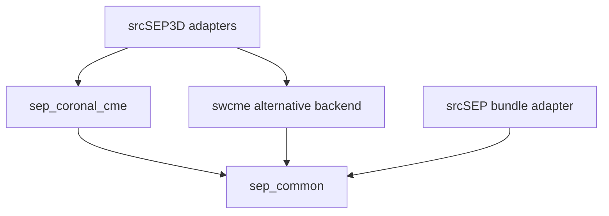
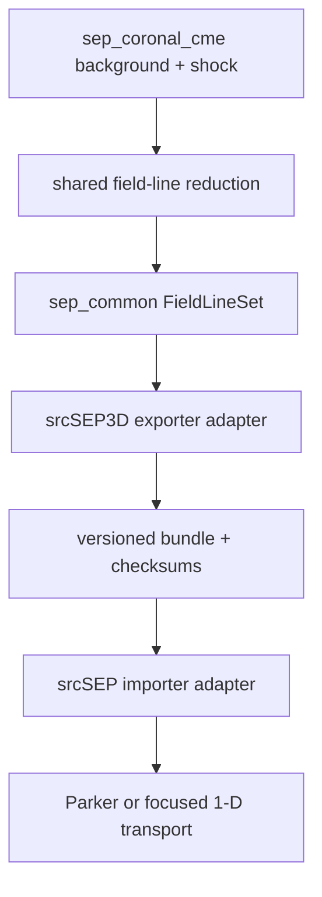

# Shared Stand-Alone Low-Coronal CME-Shock Model for 3-D and Field-Aligned SEP Transport

## Document status

**Specification revision:** 2026-09-28-r4  
**Application input schema:** 5  
**Field-line bundle schema:** 3

Schema 5 remains a **pre-freeze draft** until the existing review-3 release
gates in Sections 14, 16, and 17 pass and the review-4 documentation and
future-capability dispositions are traceable in those contracts. The changes
below therefore refine the proposed
schema-5 contract before implementation; they do not reinterpret a released
schema. Once the first schema-5 deck is accepted as a release artifact, any
subsequent incompatible key or enum change requires a new schema number.

This document is the canonical physics and software contract for the shared
AMPS `src/models/sep_coronal_cme` model. `srcSEP3D` links the model through a
thin AMPS-facing adapter. Field-aligned `srcSEP` does not link or invoke the
three-dimensional model; it consumes an immutable, versioned field-line bundle
through neutral `sep_common` records. Neither application owns or may fork the
background, CME-front, shock, turbulence, source, or field-line-reduction
physics specified here. The shared model permits a prescribed CME
candidate front to begin at an apex height of
`1.01--1.05 R_sun` and propagate through the corona and heliosphere without
calling SWMF/AWSoM, MAS, ENLIL, EUHFORIA, or another external MHD solver during
the run. The front becomes a shock only where and when the local fast-mode and
Rankine--Hugoniot admissibility tests pass. The same authoritative
three-dimensional background and candidate-front/shock state
can be reduced onto one or more open magnetic field lines, exported through a
versioned interface, and consumed by `srcSEP` for one-dimensional Parker or
focused field-aligned transport. The export is a controlled dimensional
reduction of the 3-D model, not a separately reconstructed Parker background.

This revision incorporates the completed physics reviews: separate wind and
shock thermodynamics; authoritative closed-field plasma; a finite-shell
Schatten current-sheet layer; a conservative longitude-dependent Parker map;
structured fast/slow wind; delayed patchwise shock activation; fully specified
ellipsoid kinematics; bounded critical-Mach and near-parallel jump handling;
magnetogram filtering; smooth/broken scattering and source closures; and
non-lossy connection status for field-line export. Review 2 additionally
requires quantitative current-sheet radialization, absolute open-flux
comparison, an observation-constrained kinematic-wind branch, local
separatrix stress diagnostics, a topology-safe PFSS/SCS transition policy,
force-based turbulence validity, policy-dependent critical-Mach coverage, one
solar-rotation authority, and explicit upstream-release semantics. Review 3
adds a finite physical release surface, a two-zone observation-constrained
wind, honest open/closed-interface policies, quantitative consumer-impact
budgets, joint background/shock calibration, independently identified
field-aligned wind products, and an executable modular-document authority.
Review 4 sharpens the physical interpretation of the finite release surface,
separates diagnostic Péclet depth from a return probability, and records the
additional physics needed before a momentum-dependent release surface or
post-release recycling could be enabled. It also makes explicit that
self-generated waves, gradient/curvature drift, time-dependent CME deflection
and body rotation, and a flare-associated source are future model branches,
not hidden capabilities of schema 5. Finally, it defines the observational
content required for a future continuous wind-plausibility qualification while
preserving the present positivity, continuity, D7, and momentum-residual
gates. These review-4 clarifications do not change application input schema 5
or field-line bundle schema 3 and do not claim that any of the future branches
is implemented.
Where added realism would require a global MHD or kinetic calculation, the
document defines a typed failure or an explicitly bounded approximation
instead of implying that the stand-alone model solves that missing physics.

### Review-correction disposition

Accepted review findings are requirements, while partially correct proposals
are incorporated only after their physics and scope are corrected. Every
disposition is traceable in the specification and release tests:

| Review item | Resolution in this revision |
|---|---|
| F1: one adiabatic index used for two physical roles | Separate `gamma_w`, `gamma_ad`, and `gamma_c` govern the effective wind, rapid MHD response/shock EOS, and optional closed-plasma polytrope (Sections 2, 4, 5, and 9). |
| F2: no authoritative closed-field upstream state | A composition-aware gravity-plus-centrifugal hydrostatic provider owns every closed-field plasma query; separatrix quadrature is one-sided (Section 4). |
| F3: zero-field HCS and unrealistic latitude structure | A finite-shell, nonnegative-qualified SCS solution restores discrete polarity and supplies a one-sided HCS; a separately normalized plasma sheet is optional (Section 6). |
| F4: nearly uniform polytropic wind | A target-speed polytrope remains a D7-qualified sensitivity branch. The recommended event branch combines versioned inner-density and outer-velocity/temperature products through one resolution-invariant mass-loading authority and reports compatibility, coverage, and momentum residuals (Sections 5, 13, and 17). |
| F5: missing longitude-map Jacobian | The outer map advances the forward/inverse Jacobian, preserves magnetic flux, and fails on characteristic folding (Section 6). |
| F6: forced initial shock | The candidate front may initialize entirely sub-fast; shock and source activation are local, delayed, and time-rooted (Sections 9 and 14). |
| F7: under-specified front geometry | Center translation and three semiaxes have independent histories; direction and tilt are explicit but fixed in schema 5, and apex state is derived (Section 8). |
| S1--S7: criticality, switch-on, PFSS truncation, scattering, source end, zero-source status, and rotation/provenance | Bounded critical-Mach tables and near-parallel branches, qualified spectral filtering, broken-MFP/collision models, smooth latched termination, non-lossy root/line status, and explicit frame/rotation metadata are specified in Sections 2, 4, 6--11, and 13--17. |
| R1: a thin SCS shell may leave the latitude structure unchanged | Finite-shell attenuation is evaluated analytically and numerically; all-mode attenuation remains diagnostic, while production must pass the absolute outer zonal-power and longitude-averaged latitude-flatness gates. `R_scs=2.5 R_sun` has no automatic exemption (Sections 6, 14, and 17). |
| R2: target-speed polytropes can produce unrealistic density or mass flux | `tube-from-target-speed` is a qualified sensitivity branch. The event branch combines an inner observed-density zone with an outer observed-velocity zone, derives velocity everywhere from one independently constrained mass-per-flux authority, and publishes overlap, momentum-residual, density, and mass-flux diagnostics (Sections 5, 13, 14, and 17). |
| R3: no absolute open-flux calibration | A same-rotation in-situ open-flux comparison, nested-sphere closure test, optional one-time magnetogram scaling from a construction-role asset, and a disjoint qualification-role D6 product are mandatory for event work. One observation or covariance partition cannot both determine the scale and qualify/weight its candidate (Sections 4, 13, 14, and 17). |
| R4: the SCS HCS is not automatically a flux surface of the PFSS/SCS transition | The transition distinguishes solenoidality from topology. Its signed-field vector potential and gauge are specified, and schema-5 production excludes a convergence-qualified transition-sheet band from source, transport, observers, and export; a constructed common flux surface remains a future capability (Sections 6, 11--14, and 17). |
| R5: an arbitrary separatrix pressure jump violates a stationary tangential-interface interpretation | The interface contract now distinguishes a diagnostic kinematic construction, a bounded event approximation, and a true stationary tangential-discontinuity state. All retain hard topology/kinematic gates; sharp interfaces gate the mass-flux jump and report the full vector MHD traction jump, whereas smooth transitions report a volume momentum residual. Pointwise values, quantiles, and maxima are retained, and a global mean can never establish balance (Sections 4, 14, and 17). |
| R6: `p_w/p` is not the omitted wave-force error | Wave/thermal and `delta B/B` ratios remain diagnostics, while the normative uncoupled-wind gate uses the wave-pressure-gradient acceleration relative to retained momentum terms and remains closure specific (Sections 7, 14, and 17). |
| R7: one critical-Mach table miss can abort an otherwise diagnostic calculation | EOS/convention mismatch remains fatal. Domain misses use an explicit policy: diagnostic inapplicability for a fast-only source, or preflight failure/budgeted source exclusion when criticality controls injection (Sections 9, 14, and 17). |
| R8: two configuration sections own the same rotation rate | `[solar_rotation]` is the sole physical authority; closed plasma, mapping, observers, and field-line export consume its resolved sidereal value read-only (Sections 2 and 14). |
| R9: moving-source normalization does not say which population is represented | `eta*g(p)` is explicitly the empirical **net first-passage flux through a finite physical upstream reference surface**, not gross shock emission or the total downstream DSA population. A front conormal-flux/no-through-flow boundary is a named sensitivity branch, while the former shock-adjacent absorbing construction is verification-only because its surviving population vanishes with placement distance (Sections 10, 14, and 17). |
| R10: a monolithic specification risks cross-section drift | The canonical document is generated deterministically from four nonoverlapping physics, configuration/validation, architecture/exchange, and testing/validation modules. Stable requirement records own the review-disposition, schema/API/test trace, and document links. R10 is satisfied only when the checked-in registry, generator, and generation test exist and pass; this prose alone cannot satisfy it (Sections 15--17). |
| N1: an absorbing shock plus a placement layer sent to zero makes release mover- and resolution-dependent | Event production now uses a finite physical upstream net-first-passage reference surface whose distance is held fixed during placement/mesh convergence. Focused release uses sign-certified root partitioning and error-controlled positive-normal-flux quadrature whose numerical tolerances never redefine exact Z=0, explicit tangent-field handling, upstream-only placement, and typed no-escape versus unresolved-numerics states. DelayedFrontReturn is the sole post-reference front-return ledger, and NetFirstPassageRelease remains distinct from time-dependent SurvivingUpstreamInventory; Parker conormal/no-through-flow is sensitivity-only, and gross shock-adjacent emission is verification-only (Sections 10, 14, 15, and 17). |
| N2: a speed-only empirical wind cannot determine low-coronal density or mass loading | The event branch now uses independently coordinated and supported observed inner-density, outer-velocity, and species-temperature channels in a checksummed manifest, exact certified quintic-Hermite C2 interpolation, and one independently supported eta_m; it includes composition/charge-state conversion, covariance-aware mismatch gates, distinct data-use roles, and physical-measure D7 coverage (Sections 5, 13, 14, 16, and 17). |
| N3: independent open/closed closures cannot generally satisfy a universal stationary tangential-discontinuity gate | The interface now has three typed open/closed policies and diagnostic/bounded generic open/open policies. Hard normal-field and interface-relative normal-flow gates apply to the open/closed tangential separatrix and are typed not applicable for generic open/open or plasma-sheet structure; sharp interfaces gate mass-flux jump and use the full vector MHD traction jump, while smooth open/closed, open/open, or plasma-sheet transitions use a volume momentum residual. Fitted normalizations are sensitivities, not equilibrium solvers (Sections 4, 6, 14, 16, and 17). |
| N4: transition-clearance and absorbing-front losses had no acceptance caps | Preregistered consumer budgets now cap otherwise-source-eligible area, counterfactual number/energy source rate, finite-footprint magnetic flux, represented runtime number loss, and lost birth-energy fraction with explicit denominators. Event-time energy/momentum impact remains an unbounded dimensional diagnostic. Zero caps are legal; point observers use typed valid/rejected states, and front-loss caps activate only for a removing boundary policy (Sections 6, 10, 14, 16, and 17). |
| N5: open-flux scaling and source-surface radii were not jointly discriminated with shock-formation constraints | Campaign C now evaluates the full preregistered magnetogram/scale/radius/wind/front candidate product against independent-qualification D6, coronal topology, D1, D2, and a density-conditioned event-specific type-II/EUV likelihood, never SEP output. Construction, qualification, and withheld roles remain separate; pre-inferred heights carry their density-model covariance. Radius changes rebuild both topology and field magnitude (Sections 9, 13, 14, and 17). |
| N6: radial velocity can be misapplied to nonradial or field-aligned profile coordinates | Each checksummed profile channel independently declares velocity component/reference frame, a channel-local radial-projection guard, deterministic disjoint consumer selector, radius/arc-length abscissa, spatial frame/epoch/origin, support, line IDs, background fingerprint, provenance, role, and covariance. Radius support is split where r(s) is nonmonotone; D7 retains stable rejected tube/line IDs and reasons, and missing required consumer support is fatal for event-nominal use (Sections 5, 13--17). |
| N7: the canonical specification was described as generated but had no generator or maintained modules | The shared model now has four nonoverlapping maintained modules, a structured requirement/review registry, a deterministic generator, and executable byte-identity and negative validation tests under the model-neutral `DOCSCCM01` gate (Sections 15--17). |
| P1: the finite reference distance lacks an inference rule and delayed returns are removed | The fixed finite distance remains the schema-5 baseline and must be bound to its calibration, coefficient, mean-free-path, selected-mover, return-policy, frame, support, and exact calibration-horizon fingerprints. D10 gains the integrated release-depth Péclet diagnostic `integral(u_1n^in/kappa_nn,dd)` and finite-horizon no-front-return accounting; `P<1` means inside one constant-planar diffusion length and is not a return probability. A momentum-dependent fixed-Péclet surface is a nonseparable future source-family capability, and simple re-emission or redrawing from `g(p)` is rejected because physical renewal requires residence, downstream-transfer, pitch/momentum, and shock-work closure (Sections 10, 14--17). |
| P2: shock-generated turbulence is absent from post-reference scattering | The omission is correct and is now explicit. Schema 5 retains prescribed/WKB turbulence or direct mean free paths and must not advertise a nonexistent `srcSEP` self-excited-wave solver. A versioned empirical foreshock scattering proxy is future sensitivity-only; a physical self-generated-wave branch instead requires a coupled spectral wave equation, growth/damping/cascade, wave-to-scattering closure, particle-wave conservation, and wind coupling whenever wave forces or heating cease to be negligible. Campaigns D/E own a separate complete, non-release streaming-limit evidence record; agreement cannot promote an ambient or empirical-proxy branch into a coupled-wave model (Sections 7, 10, 11, and 14--17). |
| P3: gradient and curvature drift are absent from the three-dimensional movers | The omission is real, but a drift velocity and an extra `q E dot v_d` term cannot be appended independently to the present focused mover without risking double-counted energy evolution. Schema 5 keeps drift disabled. A future ordered operator must evolve position and energy coherently, demonstrate guiding-center validity, guard weak-field/separatrix regions, treat finite-thickness HCS drift separately, recover the no-drift result, and compare with full-orbit trajectories before drift-sensitive perpendicular-diffusion inference (Sections 11, 12, and 14--17). |
| P4: the CME front cannot dynamically deflect or rotate | Schema 5 retains a fixed propagation direction and attitude, while the sensitivity campaign uses event-reconstruction covariance rather than a universal angle scan. A future capability must represent nonradial center translation and smooth SO(3) attitude as independent histories, derive center velocity and angular velocity analytically, and include both terms in front normal speed; componentwise quaternion interpolation is forbidden (Sections 8 and 14--17). |
| P5: SEP transport validation relies on one event | The validation plan now requires an out-of-sample event with the equations, inference procedure, and parameters claimed transferable frozen while event-specific magnetic, wind, front, and observer inputs are prepared independently. The 2012 May 17 GLE is classified as a difficult stress test unless its pre-existing magnetic-cloud connectivity is represented; failure is reported as a model-form or transferability finding rather than tuned away (Sections 13, 16, and 17). |
| P6: the analytic background has no matched MHD structural comparison | A matched offline benchmark now evaluates identical event support and the identical prescribed front on analytic and external thermodynamic-MHD samples, comparing density, temperature, pressure, vector magnetic field and velocity, characteristic speeds, topology/connectivity, fast-Mach number, obliquity, and activation products. It is explicitly an inter-model structural-uncertainty comparison, never observational truth, a tuning asset, or evidence that a runtime imported-MHD provider exists; that provider/bundle integration remains future work (Sections 13--17). |
| P7: a shock-only baseline cannot test flare-associated onset attribution | This is a valid limitation, not a defect in the declared shock-only baseline. A future optional impulsive open-field source must have observation-owned location/time support, its own spectrum and provenance, completely separate number/energy ledgers, and no contribution to shock-source efficiency calibration. It must also classify births relative to the moving front and define terminal encounter versus validated transfer/reacceleration while preserving impulsive ancestry and shock-work ledgers without creating a second shock first-passage birth. Mixed-source runs remain attribution sensitivities until independently validated (Sections 10 and 14--17). |
| P8: the derived inner wind lacks a continuous full-support plausibility envelope | The review is partly stale: schema 5 already enforces positivity, observed-zone compatibility, one mass-per-flux authority, and pointwise momentum-residual gates. The genuine remaining gap is a continuous event-specific envelope that can detect an interior speed spike or excessive acceleration/deceleration between comparison radii. One future versioned asset contains distinct single-quantity velocity and acceleration channels plus explicit gate pairings; every channel declares its component/frame, topology/selector, full support, units, interpolant, extrema certificate/tolerance, and uncertainty, while the asset binds covariance, provenance, and construction/qualification role. No speed envelope is reused for acceleration, and no universal monotonic-wind rule or undocumented speed cap is introduced (Sections 5 and 14--17). |

Additional corrections needed for a defensible production baseline are also
normative: the PFSS/SCS join is divergence preserving and spatially resolved;
PFSS and composite topology are distinct; repeated observers use edge-defined
energy channels and finite empty-bin output; and 1-D `srcSEP` inputs are exact
reductions of the prepared 3-D background rather than reconstructed models.

### Acronyms and model names

| Term | Meaning |
|---|---|
| AMPS / AMR / API | Adaptive Mesh Particle Simulator / adaptive mesh refinement / application programming interface |
| CME / SEP / GLE | coronal mass ejection / solar energetic particle / ground-level enhancement |
| MHD / EOS / IMF | magnetohydrodynamics / equation of state / interplanetary magnetic field |
| PFSS / SCS / HCS / CSSS | potential-field source-surface / Schatten current-sheet / heliospheric current sheet / current-sheet source-surface |
| DSA / QLT / SOQLT | diffusive shock acceleration / quasilinear theory / second-order quasilinear theory |
| WKB / WSA / RTV / CIR / CFL | Wentzel--Kramers--Brillouin / Wang--Sheeley--Arge / Rosner--Tucker--Vaiana / corotating interaction region / Courant--Friedrichs--Lewy |
| HCI / HEEQ | heliocentric inertial / heliocentric Earth equatorial coordinate frame |
| GONG / HMI / EUV | Global Oscillation Network Group / Helioseismic and Magnetic Imager / extreme ultraviolet |
| SWMF / AWSoM / MAS | Space Weather Modeling Framework / Alfvén Wave Solar atmosphere Model / Magnetohydrodynamics Around a Sphere |
| ENLIL / EUHFORIA | named heliospheric MHD model / European Heliospheric Forecasting Information Asset |

The model is intended to be:

1. physically constrained and internally self-consistent at the level claimed;
2. inexpensive enough for baseline SEP transport and acceleration studies;
3. deterministic and reproducible from a versioned input file;
4. compatible with the existing AMPS mesh, particle, sampling, restart, and
   population-control infrastructure;
5. structured so that an imported time-dependent MHD background can later
   replace the analytic background without replacing the particle-transport
   implementation; and
6. able to drive matched 3-D and 1-D calculations from the same background,
   shock, turbulence, source, species, coordinate, and provenance contracts.

The model is **not** a substitute for a global coronal MHD simulation. It does
not predict CME initiation, shock formation, or the global downstream sheath
from first principles. It prescribes a time-dependent candidate-front geometry
and kinematics, evaluates whether each patch is an admissible MHD fast shock in
the analytic upstream corona, and uses only source-eligible shock patches as
an SEP source. This distinction is part of the model contract and must be
preserved in code, output metadata, and publications.

---

## 1. Scientific objective and scope

The primary objective is to model SEP release and transport from a CME-driven
shock in the low corona to one or more observers. The computational domain may
begin immediately above the photosphere, while AMPS' registered internal
spherical boundary represents the solar surface at `r = R_sun`.

The background and particle mesh are defined on the physical side of the solar
sphere, `R_sun<r<=R_dom`, where `R_dom=domain.outer_radius_m` is the exact
spherical escape boundary enclosed by the Cartesian AMR box. The separately
configured **qualified source inner radius** is

\[
  R_{\rm in}=1.01\text{--}1.05\,R_\odot,
  \qquad R_\odot\equiv R_{\rm sun},
\]

and only points with `r>=R_in` may support the low-coronal shock source; it is
not a second absorbing boundary. The configurable outer boundary extends
to at least 1 AU for Sun-to-Earth transport. The default baseline should use
`R_in = 1.05 R_sun`; the
`1.01 R_sun` option is retained for controlled sensitivity experiments because
the density, temperature, magnetic topology, and characteristic wave speeds
have especially steep and observation-dependent gradients at that height.

The model contains six coupled but separately testable components:

1. a potential-field source-surface (PFSS) low-coronal magnetic field;
2. a finite-shell Schatten-type current-sheet (SCS) field and a discrete
   heliospheric-current-sheet sector map;
3. composition-consistent open-tube wind and closed-field hydrostatic plasma;
4. a solar-anchored, expanding ellipsoidal CME piston and candidate front;
5. Parker or focused SEP transport using locally admissible shock patches as a
   moving source; and
6. a conservative field-line reduction and exchange layer through which one
   or more selected open lines are produced by the shared model, exported by a
   `srcSEP3D` adapter, and used by `srcSEP`.

The production magnetic background has three separately identified analytic
authorities and a resolved PFSS/SCS join. PFSS is solved to a radial outer
boundary `R_b`; the composite field transitions from PFSS to a finite-shell
SCS representation beginning at `R_i`; and the SCS solution is made radial at
`R_scs`, where the conservative rotating-footpoint Parker extension begins.
Direct PFSS-to-Parker coupling is retained only as a named analytic
verification mode. `R_b`, `R_i`, and `R_scs` remain distinct inputs in the
production composite model. No numerical value of `R_scs`, including
`2.5 R_sun`, is accepted solely because it is a conventional coupling radius:
the realized shell must report its complete spectral attenuation, while its
absolute outer zonal power and the completed field's registered latitude-
flatness metrics must pass.
If winding is required to begin at `2.5 R_sun` but that radius fails the SCS
radialization gate, the existing radial Parker map is inapplicable. A future
general solenoidal pushforward may use a distinct winding radius only after
its nonradial mapping, Jacobian, wind coupling, and topology tests pass.
In the no-SCS analytic verification branch, `R_i` and `R_scs` are derived as
`R_b` rather than supplied as independent radii. None of these radii is a
universal physical constant; an event calculation must constrain them using coronal
holes, streamer/current-sheet morphology, and open-flux diagnostics [2--4,
34--36, 54, 55].

### 1.1 Radial domain of applicability

The computational outer radius and the radial range over which the prescribed
shock remains physically credible are different limits. The analytic
background and SEP transport may extend to an observer at 1 AU even after the
low-coronal shock source has been deactivated. The recommended baseline is:

| Radial interval | Model role | Permitted interpretation |
|---|---|---|
| `R_sun--R_in` | fully initialized precipitation/guard shell with no SEP injection | boundary transport only; outside source-validation claims |
| `R_in--R_i` | signed PFSS field, PFSS/composite topology diagnostics, open wind or closed hydrostatic plasma selected by composite topology, and ellipsoidal candidate front | primary low-coronal source domain |
| `R_i--R_scs` | resolved PFSS/SCS join followed by finite-shell SCS field, discrete sectors/HCS, continued open-tube wind, and candidate front | outer-coronal current-sheet domain |
| `R_scs--min(20 R_sun,R_zero)` when nonempty | conservative Parker extension, continued wind, and candidate front/shock | baseline early-heliospheric acceleration domain; an empty interval is reported rather than written with inverted limits |
| `20--min(30 R_sun,R_zero)` when nonempty | transition/sensitivity interval | shock results require a stated model-form uncertainty; an empty interval is valid and explicit |
| configured zero-source radius through `1 AU` | composite SCS/Parker background and particle transport after low-coronal injection; Parker only where `r>=R_scs` | baseline Sun-to-observer transport domain; the source stops at `20 R_sun` nominally or up to `30 R_sun` only in the stated sensitivity branch, independently of the magnetic-authority boundary |
| beyond `1 AU` | unsupported by the baseline validation | requires an explicitly extended and independently validated heliospheric model |

For the first production release, the domain should extend to `1 AU`, while
the active low-coronal shock source should terminate at a configurable apex
radius whose recommended value is `20 R_sun`; `30 R_sun` is a sensitivity
case, not a new default. A surface patch is locally source-inactive whenever it
fails its configured fast-mode or supercritical criterion; it may reactivate
only if its recorded Mach history again satisfies the criterion before the
global source envelope reaches exact zero. Particles injected earlier continue
to propagate to all observers.

The approximate `20 R_sun` source termination is not a numerical limit. Beyond the
upper corona, CME propagation becomes increasingly controlled by interaction
with the ambient solar wind and is commonly represented by a drag-based
heliospheric model [26--28]. Extending the shock itself to 1 AU therefore
requires a new branch containing at least a propagated CME driver, a separately
evolved shock surface and standoff distance, local shock weakening in the
structured wind, and validation against heliospheric-imager tracks and in-situ
shock arrival. A drag law alone supplies CME kinematics; it does not supply the
local compression, obliquity, criticality, or SEP-injection efficiency.

The field-line exchange API must not encode `1 AU` as a hard limit. It may
export a longer line for a separately qualified `srcSEP` study, including a
future 5-AU transport calculation, but the bundle must record that the present
composite PFSS--SCS--Parker wind and turbulence realization is validated only
to 1 AU. A claim
beyond 1 AU requires additional validation of solar-wind structure, stream
interactions, turbulence and scattering evolution, and outer-heliospheric
particle physics.

### 1.2 Matched 3-D and field-aligned use

The 1-D mode is intended for controlled, computationally inexpensive
field-aligned transport along one or more selected magnetic connections. It
has three principal uses:

1. production 1-D SEP calculations along observer-connected field lines;
2. direct Parker-versus-focused and 1-D-versus-3-D intercomparisons; and
3. ensembles over multiple shock-connected field lines without allocating the
   complete 3-D AMR particle domain.

Each exported line is an oriented curve `x_l(s,t)` with outward arc length
`s`; schema 5 freezes the background geometry at its declared trace time, but
the time argument remains explicit in the exchange model.
The coordinate orientation is geometric and always points away from the Sun;
magnetic polarity is stored independently. Therefore

\[
 \left.\frac{\partial\mathbf x_l}{\partial s}\right|_t=\hat{\mathbf t}_l,
 \qquad
 \hat{\mathbf b}=\sigma_{B,l}\hat{\mathbf t}_l,
 \qquad \sigma_{B,l}\in\{-1,+1\}.
\]

This convention prevents a polarity reversal from silently reversing the
meaning of the inner and outer particle boundaries. Only open lines that reach
the requested outer radius may be exported for Sun-to-observer transport.
Closed lines are reported diagnostically and rejected as `srcSEP` transport
inputs. The first production focused-transport model is sector confined: an
exported line may approach but may not cross an unresolved zero-thickness HCS
or an unverified PFSS/SCS field-direction discontinuity.

---

## 2. Definitions, frames, and notation

### 2.1 Coordinates

All kernels use SI units internally. Let

\[
  \mathbf{x}=r\,\hat{\mathbf e}_r
\]

be the position relative to the configured heliocentric origin. Spherical
coordinates are `(r, theta, phi)`, where `theta` is colatitude and `phi`
increases in the right-handed sense about the configured solar-rotation axis.
The coordinate frame, epoch, solar north, zero-longitude direction, and
rotation convention are mandatory metadata.

With rigid field-line rotation, the analytic background is naturally stationary
in a frame rotating at `Omega_F`. A latitude-dependent rotation law has no
single corotating frame and must instead be evaluated in an inertial or a
declared fixed-rate frame as a time-dependent mapping. Particle positions and
observer ephemerides may be stored in an inertial frame, but every conversion
must be explicit and tested. A vector must never be identified as HCI, HEEQ,
Carrington, or an application-local frame solely because it is Sun-centered.

The first production profile accepts one rigid **sidereal** `Omega_F` expressed
relative to the declared inertial heliocentric axes. A synodic input is legal
only when an ephemeris-owned orbital angular rate and sign convention convert
it to that sidereal value before any centrifugal, longitude-map, source, or
observer calculation. Latitude-dependent rotation is an analytic-verification
branch until a time-dependent 3-D background and closed-corona provider are
qualified; it is not a production shortcut.

`[solar_rotation]` is the sole configuration authority for `Omega_F`, its
convention, and any synodic-conversion asset. The closed-plasma potential,
open-tube frame, Parker winding, observer transformations, and field-line
export receive the same resolved sidereal value from the immutable prepared
configuration. Provider-local copies may appear in manifests for regression
checking, but they are derived values and cannot be entered independently.

### 2.2 Plasma variables

The upstream and downstream states use subscripts 1 and 2. The principal
quantities are

| Symbol | Meaning | SI unit |
|---|---|---:|
| `rho` | total mass density | kg m^-3 |
| `n_s` | number density of species `s` | m^-3 |
| `p` | total thermal pressure | Pa |
| `T_s` | species temperature | K |
| `u` | bulk plasma velocity | m s^-1 |
| `B` | magnetic field | T |
| `v_A` | Alfvén speed | m s^-1 |
| `a_w` | effective polytropic/isothermal wind sound speed | m s^-1 |
| `c_s` | thermodynamic adiabatic sound speed used by waves and shocks | m s^-1 |
| `c_f` | fast-magnetosonic speed | m s^-1 |
| `w_out`, `w_in` | wave energies propagating geometrically outward/inward | J m^-3 |
| `w_+`, `w_-` | derived wave energies parallel/antiparallel to signed `B` | J m^-3 |
| `lambda_parallel` | parallel particle mean free path | m |
| `gamma_w` | effective open-wind polytropic index | dimensionless |
| `gamma_ad` | thermodynamic ideal-MHD adiabatic index | dimensionless |
| `gamma_c` | optional closed-plasma polytropic index | dimensionless |
| `sigma_B` | magnetic polarity relative to the outward tube tangent | `-1` or `+1` |
| `R_b` | PFSS radial outer-boundary radius | m |
| `R_i` | PFSS/SCS interface radius | m |
| `R_scs` | radial SCS boundary and Parker-coupling radius | m |
| `R_w` | Parker-winding start radius; equals `R_scs` for the schema-5 radial map | m |

For a proton-electron baseline with optional alpha particles,

\[
  \rho = m_p n_p + m_\alpha n_\alpha + m_e n_e,
  \qquad n_e=n_p+2n_\alpha,
\]

and

\[
  p=k_B(n_pT_p+n_eT_e+n_\alpha T_\alpha).
\]

Electron mass may be neglected in `rho` only if that approximation is recorded
in the resolved configuration. It must not be neglected in charge neutrality.

The wind and shock indices are intentionally distinct:

\[
 a_w^2=\gamma_w\frac{p}{\rho},
 \qquad
 c_s^2=\gamma_{\rm ad}\frac{p}{\rho}.
\]

`a_w` controls the steady wind critical point and represents the effective
heating closure. `c_s` controls rapid compressive disturbances and the MHD
jump conditions. The downstream shock state is not constrained to lie on the
effective wind polytrope.

### 2.3 Shock frame

At a point on the moving shock, `n_hat` points from the downstream region into
the upstream region. If the surface normal speed is `V_sh,n`, the plasma
velocity in the local shock frame is

\[
  \mathbf{v}_i=\mathbf{u}_i-V_{\rm sh,n}\hat{\mathbf n}.
\]

Normal and tangential components are

\[
  v_{in}=\mathbf{v}_i\cdot\hat{\mathbf n},\qquad
  \mathbf{v}_{it}=\mathbf{v}_i-v_{in}\hat{\mathbf n},
\]

with analogous definitions for `B_n` and `B_t`.

### 2.4 Particle kinematics, species, and momentum frame

For compiled species mass `m` and signed charge `q_s`, kinetic energy, momentum,
speed, and rigidity use the exact special-relativistic relations

\[
 E_k(p,m)=\sqrt{p^2c^2+m^2c^4}-mc^2,
 \qquad
 p(E_k,m)=\frac{\sqrt{E_k(E_k+2mc^2)}}{c},
\]

\[
 v(p,m)=\frac{pc^2}{E_k+mc^2},
 \qquad
 \mathcal R=\frac{pc}{|q_s|}.
\]

Here the species charge is henceforth `q_s`; bare `p` in particle/source/
transport equations is momentum magnitude, whereas `p` in plasma and MHD
equations is thermal pressure. These conventional symbols never denote both
quantities in the same equation. The DSA spectral slope is written `q_DSA`,
not `q_s`.

Rigidity is in volts when SI momentum and coulombs are used. “Energy per
nucleon” means `E_k/A`, where integer nucleon count `A` is supplied by
validated species metadata. It is undefined for electrons, unresolved isotope
mixtures, and any compiled symbol without an unambiguous `A`; such a selection
is rejected rather than estimated from the floating-point mass.

Unless a record says otherwise, mover variables `p`, `mu`, the source spectrum,
and scattering coefficients are defined in the **local plasma rest frame**,
while position and time are coordinates in the declared transport frame. A
spectrum defined in another supported momentum frame is sampled there and
transformed into the local-plasma mover frame through an exact Lorentz boost
of each particle four-momentum; a Galilean energy shift is not used for
relativistic particles. Such a source frame is selectable only when the
transformed distribution remains representable by the mover's isotropic or
gyrotropic state. An exact boost of individual particles does not justify
discarding gyrophase dependence or redefining mover `p,mu` in the coordinate
frame. The source ledger stores sampled-frame and local-plasma four-momenta
and, as separately derived diagnostic views, shock-, detector-, or Cartesian
storage-frame four-momenta. Those diagnostic/storage views never overwrite
the phase-space coordinates advanced by the mover.

For the generic transformation below, let the sampled inertial frame move
with velocity `V` relative to a chosen local orthonormal destination frame,
and let `E'_tot=E'_k+mc^2` and
`gamma_V=(1-|V|^2/c^2)^(-1/2)`.

The calculation is performed in local orthonormal inertial tetrads after any
rotating-coordinate basis/velocity conversion; a non-inertial coordinate
velocity is never inserted directly into a Lorentz formula. For source
insertion the destination is the local plasma frame. If AMPS requires a full
Cartesian stored momentum, the adapter reconstructs the sampled gyrophase and
transforms that individual four-vector to the documented storage frame; this
is a representation conversion, not a change to the mover's `p,mu` frame.

The boost is

\[
 E_{\rm tot}=\gamma_V(E'_{\rm tot}+\mathbf V\cdot\mathbf p'),
\]

\[
 \mathbf p=\mathbf p'+
 \left[
  \frac{\gamma_V-1}{|\mathbf V|^2}(\mathbf V\cdot\mathbf p')+
  \frac{\gamma_V E'_{\rm tot}}{c^2}
 \right]\mathbf V,
\]

with the continuous identity limit at `V=0`. The inverse uses `-V`. The frame
velocity is evaluated at the sampled patch and epoch and is stored with the
source event.

---

## 3. Model architecture and authority boundaries

The stand-alone model separates authority as follows.

| Quantity | Authoritative component |
|---|---|
| Coronal `B` below `R_i` | signed PFSS provider |
| Unsigned outer-coronal `B` from `R_i` to `R_scs` | finite-shell SCS provider |
| Magnetic sector and HCS geometry | field-line sector mapper |
| Open/closed topology and separatrix geometry | composite topology provider |
| Open-tube `u`, `rho`, `p`, `T` | transonic wind solver on the completed composite tube |
| Closed-tube `u`, `rho`, `p`, `T` | closed-field hydrostatic provider |
| Optional plasma-sheet thermodynamics | empirical tube-normalization provider |
| Heliospheric `B` above `R_scs` | conservative rotating-footpoint extension |
| Wind critical derivative | wind closure using `gamma_w` |
| Characteristic speeds and shock EOS | plasma EOS using `gamma_ad` |
| Shock position, shape, and velocity | ellipsoid kinematics provider |
| Shock existence and downstream jump | oblique ideal-MHD jump solver |
| Shock criticality | critical-Mach model selected by input |
| Generic injection spectra, species-source records, and distribution kernels | dimension-independent `sep_common` injection/species primitives |
| Coronal release eligibility, finite upstream release surface, normalization, and deterministic birth plan | `sep_coronal_cme` source-release planner, composed from the prepared background/shock state and generic `sep_common` primitives |
| Particle scattering and diffusion | generic `sep_common` coefficient physics/registry evaluated from the turbulence and plasma primitives prepared by `sep_coronal_cme` |
| Particle trajectories and weights | AMPS plus the selected application's thin mover adapter |
| Exported field-line geometry/state | shared `sep_coronal_cme` reduction of the prepared background/front snapshots, invoked by a `srcSEP3D` adapter |
| Field-line candidate-front intersections and local shock/source state | shared intersection kernel using the prepared front/shock snapshot |
| Imported 1-D trajectories and weights | AMPS plus the thin `srcSEP` field-line mover adapter |

No component may silently replace a failed value with a value from a different
provider. A PFSS failure cannot fall back to the existing Parker provider; an
inadmissible MHD jump cannot fall back to a user-entered compression ratio; and
missing turbulence cannot become zero scattering unless the input explicitly
selects a ballistic mode.

Topology, magnetic region, sector, and interface side are resolved before
interpolation. No interpolation or finite-difference stencil may mix open-wind
and closed-hydrostatic states, opposite magnetic sectors, or different
one-sided interface states.

Two shock-use modes are distinguished:

1. **Moving-source mode (initial production target).** The locally admissible
   shock surface injects an accelerated population into the upstream region.
   The analytic background is not overwritten by a synthetic downstream
   volume. This mode can represent shock release and subsequent SEP transport,
   but it does not model repeated crossings of a resolved shock sheath.
2. **Discontinuity-transport mode (later capability).** Particles can cross an
   exact mathematical shock surface and sample both upstream and downstream
   states. This requires a separately validated downstream/sheath extension.
   Local Rankine--Hugoniot relations alone do not define a globally
   divergence-free, time-dependent downstream CME solution.

The first mode is the scientifically defensible stand-alone baseline. The
second must not be advertised until its global consistency tests pass.

`sep_common` owns dimension-independent transport mathematics, coefficient
registries, injection-spectrum/species primitives, and every neutral snapshot,
birth-plan, and field-line wire record. `sep_coronal_cme` composes those
primitives into the coronal background and turbulence initialization,
candidate-front/jump classification, finite-surface source release and
normalization, and field-line reduction defined here. Application adapters may
convert application inputs to the shared SI contract, bind compiled species,
populate AMPS storage, and schedule queries, but they may not duplicate an
equation, reclassify a state, or recalculate a physical source weight. The
precise dependency and header rules are normative in Section 15.

---

## 4. PFSS coronal magnetic field

### 4.1 Governing equations

PFSS assumes that electric currents do not contribute to the modeled
large-scale coronal field:

\[
  \nabla\times\mathbf B=0,
  \qquad \nabla\cdot\mathbf B=0.
\]

Therefore

\[
  \mathbf B=-\nabla\Psi,
  \qquad \nabla^2\Psi=0.
\]

In the spherical shell `R_sun <= r <= R_b`, the scalar potential is expanded
as

\[
 \Psi(r,\theta,\phi)=
 \sum_{\ell=1}^{L_{\max}}\sum_{m=-\ell}^{\ell}
 \left(a_{\ell m}r^\ell+b_{\ell m}r^{-(\ell+1)}\right)
 Y_{\ell m}(\theta,\phi).
\]

The monopole term is excluded because the net magnetic flux through the solar
surface must vanish to numerical precision.

### 4.2 Inner magnetic boundary

At the photosphere,

\[
 B_r(R_\odot,\theta,\phi)=B_{r,0}(\theta,\phi).
\]

`B_r,0` may be supplied in either of two ways:

1. **Analytic-harmonic baseline:** input coefficients define a dipole,
   quadrupole, and optional higher harmonics. This mode is data-independent and
   is required for exact regression tests.
2. **Magnetogram mode:** a local GONG or HMI synoptic/synchronic map is
   transformed into spherical-harmonic coefficients. The map, calibration,
   pole treatment, flux-balance correction, epoch, and checksum become part of
   the run manifest.

The code may remove a measured net-flux offset only through a documented
flux-balance operation. It must report the removed monopole flux and the ratio
of that correction to the unsigned flux.

Magnetogram processing must also specify the native angular grid, cell-area
quadrature, polar treatment, and an admissible `L_max` for that grid. The
available spectral choices are `none` and a named heat-kernel filter

\[
 \widetilde g_{\ell m}=g_{\ell m}
 \exp\left[-\frac{\ell(\ell+1)}
                  {\ell_a(\ell_a+1)}\right].
\]

Filtering is optional for exact low-order analytic inputs but is part of the
convergence study for a magnetogram used as low as `1.01 R_sun`. Raw and
filtered coefficients, the transfer function, map/grid metadata, weighted
reconstruction errors, unsigned-flux change, neutral-line displacement, and
open/closed topology changes are recorded. Filtering is a declared smoothing
of the measured boundary; it must never be described as an exact
reconstruction of the raw map. The harmonic truncation, grid quadrature, and
direct-versus-cached PFSS solution are qualified by convergence tests [42].

### 4.3 PFSS radial/source-surface boundary

The PFSS field is constrained to be radial at `R_b`:

\[
 B_\theta(R_b)=B_\phi(R_b)=0.
\]

Equivalently, the potential is constant on the source surface. For every
non-monopole harmonic,

\[
 a_{\ell m}R_b^{\ell}
 +b_{\ell m}R_b^{-(\ell+1)}=0,
\]

so that

\[
 b_{\ell m}=-a_{\ell m}R_b^{2\ell+1}.
\]

If the raw lower radial field is expanded in the same normalized basis,

\[
 B_{r,0}(\theta,\phi)=
 \sum_{\ell m}g_{\ell m}Y_{\ell m}(\theta,\phi),
 \qquad
 g_{\ell m}=\int B_{r,0}Y_{\ell m}^{*}\,d\Omega,
\]

define the selected coefficients

\[
 g_{\ell m}^{\rm sel}=g_{\ell m}
 \quad\hbox{for no spectral filter},
 \qquad
 g_{\ell m}^{\rm sel}=\widetilde g_{\ell m}
 \quad\hbox{for the heat-kernel filter}.
\]

The PFSS solve uses `g_lm_sel`, so

\[
 a_{\ell m}=
 -\frac{g_{\ell m}^{\rm sel}}
 {\ell R_\odot^{\ell-1}
 +(\ell+1)R_b^{2\ell+1}R_\odot^{-(\ell+2)}},
 \qquad
 b_{\ell m}=-a_{\ell m}R_b^{2\ell+1}.
\]

For a real magnetic field, the complex coefficients obey the corresponding
conjugate-symmetry relation, for example
`g_sel_(l,-m)=(-1)^m conj(g_sel_(l,m))` under the standard
complex-harmonic convention.
The selected raw or filtered boundary representation therefore determines
`a_lm` and `b_lm` without a numerical elliptic solve. Only the unfiltered,
untruncated representation is described as reproducing the raw map exactly;
every filtered or truncated solve reports its boundary residual.

The implementation should use normalized associated Legendre functions and an
explicit normalization convention; the convention is part of the fingerprint.

### 4.4 Open and closed topology

Field-line integration uses

\[
  \frac{d\mathbf x}{ds}=\pm\frac{\mathbf B}{|\mathbf B|}.
\]

A PFSS line that reaches `R_b` is `pfss_open_to_Rb`; a PFSS line that returns to
the solar boundary before `R_b` is `pfss_closed_below_Rb`. Independently, a
line in the production composite field that reaches `R_i` from below is
`composite_open_to_Ri`; a line whose two directions return to the solar
boundary below `R_i` is `composite_closed_below_Ri`. These classifications can
differ when `R_i<R_b`, because the SCS construction deliberately replaces the
PFSS field above `R_i` and can open a line that the unused PFSS continuation
would close.

Every background query returns both stable classifications (or `separatrix`)
and the generation in which they were made. Composite topology controls
open-wind versus closed-plasma ownership, particle-corridor eligibility, and
shock-patch topology. A target-speed asset separately declares whether its
coronal-hole boundary, expansion factor, and calibration use PFSS topology at
`R_b` or composite topology at `R_i`; applying it outside that declared
topology is fatal. Classification must converge with trace tolerance and may
not be inferred from the AMR cell containing the point.

The active SEP corridor must be centered on an open line. Configuration
validation fails if a requested Sun-to-observer line closes below `R_i`.
Shock diagnostics may be calculated over both topologies, but source injection
from a closed patch is disabled by the recommended baseline policy.

### 4.5 Authoritative closed-field plasma

The transonic-wind provider owns plasma variables only on open tubes. A
separate closed-field provider owns `rho`, `p`, species temperatures,
composition, and velocity on closed tubes. A visualization-only value may not
be consumed as shock input.

For the first release, a static closed provider is defined in the same rigidly
corotating frame with the resolved angular velocity `Omega_F` owned by
`[solar_rotation]`. The closed provider consumes that immutable value read-only;
there is no `Omega_c` input or second physical authority. Its effective
potential is

\[
 \Phi_{\rm eff}(\mathbf x)=-\frac{GM_\odot}{r}
 -\frac12|\boldsymbol\Omega_F\times\mathbf x|^2,
 \qquad
 \Delta\Phi_{\rm eff}=\Phi_{\rm eff}(\mathbf x)
 -\Phi_{\rm eff}(\mathbf x_0).
\]

Here `x_0` is the topology-consistent reference footpoint or reference point
on the configured sphere `r=R_c0`; the base density, composition, and species
temperatures are defined at that same point. The provider may not mix a base
state at `R_c0` with a potential difference referenced to another radius.
Schema 5 names this distinct radius
`closed_field_plasma.reference_radius_m`.

For the first-release `isothermal-hydrostatic` closure, the composition-aware
EOS supplies `rho_0` and `p_0` at `R_c0`, and

\[
 c_T^2=\frac{p_0}{\rho_0},\qquad
 \rho(\mathbf x)=\rho_0
 \exp\left[-\frac{\Delta\Phi_{\rm eff}}{c_T^2}\right],\qquad
 p(\mathbf x)=p_0
 \exp\left[-\frac{\Delta\Phi_{\rm eff}}{c_T^2}\right].
\]

Species temperatures remain at their declared base values. This form avoids
an ambiguous mean molecular mass: for a quasi-neutral proton-electron plasma,
for example, `p = n_p k_B(T_p+T_e)` while `rho` is approximately `m_p n_p`.
The baseline takes `u'=0` in this corotating frame; in an inertial frame the
closed plasma corotates. The manifest reports the maximum centrifugal-to-
gravity acceleration ratio. A gravity-only option is an explicitly named
small-rotation approximation, not the default. A latitude-dependent rotation
law has no globally static closed-corona frame and is rejected by this provider
unless a separately validated time-dependent closed model is selected.

An optional `polytropic-hydrostatic` closure uses its own `gamma_c>1`, not
`gamma_w`:

\[
 h=\frac{\gamma_c p}{(\gamma_c-1)\rho},\qquad
 h(\mathbf x)=h_0-\Delta\Phi_{\rm eff},
\]

\[
 \rho(\mathbf x)=\rho_0
 \left(\frac{h(\mathbf x)}{h_0}\right)^{1/(\gamma_c-1)},\qquad
 p(\mathbf x)=p_0
 \left(\frac{h(\mathbf x)}{h_0}\right)^{\gamma_c/(\gamma_c-1)}.
\]

Each declared species temperature follows the same polytropic scaling,

\[
 T_s(\mathbf x)=T_{s0}
 \left[\frac{\rho(\mathbf x)}{\rho_0}\right]^{\gamma_c-1},
\]

and the composition-aware sum of species pressures must reproduce `p`. The two
solar footpoints of a closed loop must predict the same pressure at a common
reference point within tolerance; incompatible footpoint boundary data are
rejected rather than blended.

Every requested point must satisfy `h>0`; otherwise preparation fails. These
closures enforce field-aligned hydrostatic balance but do not solve loop
heating, thermal conduction, evaporation, siphon flow, reconnection, or
CME-driven opening. Resolving dynamic coronal opening requires a global MHD
model rather than either static closure [30]. An RTV-type loop option would
require pressure and heating in addition to loop length and is therefore a
separate future model [31].

### 4.6 Open--closed interface and closed-loop policy

The separatrix is topology aligned. A sharp representation is queried from a
declared side; interpolation, derivative stencils, and shock quadrature may
not combine its open and closed states. A shock element intersected by it is
split and each child uses its own upstream authority. A finite-width
representation instead owns a physical signed-distance coordinate and an
explicit layer thickness; it is not produced by blending primitive variables
through an arbitrary angular weight.

Let `n` point from catalog side A to catalog side B; for an open--closed
separatrix, side A is closed and side B is open. The stored surface basis
`(n,t_1,t_2)` is deterministic, right handed, and bound to a stable basis ID.
A geometrical moving surface defines a unique **normal** speed `V_I,n`; a tangential "interface
velocity" is only a surface-parametrization choice and must not enter a
physical jump condition. In one fixed declared coordinate frame define

\[
 w_{n,k}=\mathbf u_k\mathbin{\cdot}\mathbf n-V_{I,n},\qquad
 B_{n,k}=\mathbf B_k\mathbin{\cdot}\mathbf n .
\]

Every **open--closed separatrix** policy below retains the two hard
topology/kinematic gates

\[
 |B_{n,k}|\le\tau_{B,\rm abs}+\tau_{B,\rm rel}|\mathbf B_k|,
 \qquad
 |w_{n,k}|\le\tau_{w,\rm abs}+\tau_{w,M}c_{f,k},
\]

at every qualified point on each side. The second expression is relative to
the moving interface; using `u dot n` without subtracting `V_I,n` is
incorrect for a moving surface. The combined absolute-plus-relative form
remains defined at magnetic nulls and vanishing flow. A relative diagnostic is
typed `inapplicable-near-zero` when its denominator is unresolved, while its
absolute gate remains active.

For a **sharp** interface, the relevant momentum-flux traction is the full
conservative moving-control-surface flux, not only its normal component. For
side `k`,

\[
 \mathbf t_k=
 \rho_k w_{n,k}\mathbf u_k+
 \left(p_k+\frac{|\mathbf B_k|^2}{2\mu_0}\right)\mathbf n
 -\frac{B_{n,k}}{\mu_0}\mathbf B_k,
 \qquad
 \Delta\mathbf t=\mathbf t_B-\mathbf t_A.
\]

This expression is invariant to a tangential reparametrization of the
surface. A formula written with a full relative-velocity vector is legal only
in one explicitly fixed Galilean frame and together with a verified zero
mass-flux jump; it is not the primary interface contract. The provider also
reports and gates

\[
 \Delta j_m=\rho_Bw_{n,B}-\rho_Aw_{n,A}
 \quad [\mathrm{kg\,m^{-2}\,s^{-1}}],
\]

including the signed and absolute values, a dimensionless value with a
declared nonzero normalization floor, its physical-area distribution, the
configured quantile, and the pointwise maximum.

A stationary ideal-MHD tangential discontinuity in the interface frame
satisfies `B_n=0`, `w_n=0`, `Delta j_m=0`, and `Delta t=0` pointwise. Only
under those conditions does the normal component reduce to continuity of
`p+B_t^2/(2*mu_0)`. The implementation must not assume that the two magnetic
traces are identical and then test `[p]=0`; such an assumption would conceal
a tangential magnetic-stress error. It emits the signed normal component,
both signed tangential components in a deterministic surface basis, the
Euclidean norm, absolute-plus-relative normalized values, the area-weighted
distribution, a configured quantile, and the pointwise maximum. A global
signed or absolute mean is diagnostic only and can never pass a gate.

For a **finite-width** interface or empirical open-wind/plasma-sheet
transition, a surface jump is not the correct balance diagnostic. In the
declared frame the provider evaluates the volume momentum residual

\[
 \mathbf R_{\rm mom}=
 \frac{\partial(\rho\mathbf u)}{\partial t}+
 \boldsymbol\nabla\mathbin{\cdot}
 \left[\rho\mathbf u\mathbf u+
 \left(p+\frac{B^2}{2\mu_0}\right)\mathbf I-
 \frac{\mathbf B\mathbf B}{\mu_0}\right]
 -\rho\mathbf g-\mathbf f_{\rm declared}.
\]

`f_declared` contains every explicitly retained nonideal, wave-pressure, and
frame-force term, with signs and units recorded in the manifest; omitting a
term does not make its residual vanish. The layer reports every vector
component, `|R_mom|`, an absolute force-density value in `N/m^3`, a
normalization by the local sum of retained force magnitudes with a registered
floor, pointwise values, volume-weighted quantiles, and the maximum. It also
demonstrates stability across preregistered mesh and physical-thickness
ensembles. A sharp traction jump and a smooth volume residual are different
objects and are never compared as though they were the same metric.

The same representation rule applies to **open--open** structure. A genuinely
sharp boundary between two open states reports the two one-sided states,
`Delta j_m`, and the complete vector traction jump. A resolved fast/slow-wind
transition, streamer/plasma-sheet layer, or any other continuously varying
open-state blend reports the volume momentum residual and its declared force
inventory instead; it must not manufacture one-sided traces merely to obtain a
small jump. D8 covers both open--closed and open--open interfaces and records
the stable interface ID, interface class, state provenance, deterministic
surface basis, topology classes, and representation type before selecting the
applicable diagnostic. The separatrix-specific `B_n≈0` and `w_n≈0` hard gates
are **not** imposed on a generic open--open boundary: an open--open MHD class
boundary may carry normal magnetic flux and mass flux. Its sharp contract is
instead the signed mass-flux jump and complete vector traction jump; its smooth
contract is the resolved volume momentum residual. A future open--open
tangential-discontinuity subclass would need its own explicit catalog tag and
gates rather than inheriting the open--closed assumption implicitly.

`open_closed_interface.policy` selects one of three contracts:

1. **`diagnostic-kinematic`.** This is the default for the independently
   assembled analytic PFSS/SCS field, open wind, and hydrostatic closed
   plasma. The hard `B_n` and relative-normal-flow gates still apply, but the
   traction jump or volume residual is reported rather than forced to zero.
   The state is a kinematic background, not an MHD equilibrium. It is valid
   for analytic verification and declared sensitivities, but cannot be called
   a stationary tangential discontinuity or used as an event-grade equilibrium.
2. **`bounded-approximation`.** This is the event-grade stand-alone option
   when no self-consistent global MHD state is available. In addition to the
   hard gates, every sharp-interface traction residual or every smooth-layer
   volume residual must stay within preregistered absolute and relative
   pointwise bounds. The manifest records observational input uncertainty,
   interface-location or layer-thickness uncertainty, the mesh/thickness
   convergence sequence, the selected quantile, and the maximum. Passing
   these bounds establishes only a quantified approximation, not exact force
   balance.
3. **`stationary-td-equilibrium`.** This strict sharp-interface policy is
   available only to a solver-produced or imported state whose provenance
   declares the equilibrium construction. It requires the full vector
   traction jump, mass-flux jump, `B_n`, and interface-relative `w_n` to pass
   at every point.
   An independently normalized analytic open/closed pair cannot select this
   policy merely because a post hoc fit makes one scalar residual small.

The closed provider may use prescribed base normalization, a single global
pressure-scale sensitivity, or a loop/footpoint-resolved constrained asset.
Those operations explore sensitivity; they do not solve the multidimensional
force-balance problem. In particular, copying an open-side temperature to the
closed side cannot enforce pressure or traction continuity because density,
composition, magnetic stress, and tangential momentum also enter the balance.
Opposite local residuals can cancel in an area mean, and a fit that minimizes a
quantile can leave an unacceptable maximum. Therefore all policies preserve
pointwise records, quantiles, and maxima, and event gates are evaluated on the
pointwise bounds. The null/cusp mask and its area are reported; no quantity is
divided by `B^2/(2*mu_0)` inside that mask. A loop with incompatible
two-footpoint hydrostatic data is rejected rather than averaged.

A finite-width layer must reconstruct an EOS-consistent state, preserve or
re-solve the open-tube invariants, and pass registered resolution and
thickness studies. A universal angular blend of density and temperature is
not a physical default.

One-way outward WKB turbulence is invalid on a line with two solar
footpoints. Closed-field scattering must explicitly select a bidirectional
prescribed model, a direct mean-free-path closure, or a future two-footpoint
reflection/cascade model. No automatic WKB-to-prescribed substitution is
allowed. With parallel-only transport, particles remain on the loop and may
precipitate into either absorbing solar footpoint; cross-field escape requires
an explicitly enabled and interface-aware operator.

No such open/closed-separatrix transmission operator belongs to the first
production profile. Therefore a nonzero perpendicular coefficient is rejected
whenever a reachable stochastic domain intersects the separatrix. Analytic
verification may use perpendicular diffusion only after proving geometrically
that the reachable domain remains on one smooth topology side. A failed proof
is a configuration error, not an absorbing or reflecting fallback.

### 4.7 PFSS limitations and numerical qualification

PFSS neglects active-region currents, magnetic free energy, and dynamical
opening by the CME. Its purpose here is to provide a reproducible large-scale
coronal topology and flux-tube expansion, not to model CME initiation. The
limitation is strongest close to a sheared active region and must be discussed
when event-specific results are interpreted [2--4].

High-degree spherical-harmonic evaluation can also suffer from map-grid
aliasing, polar errors, and ringing. Direct harmonic evaluation remains the
authority; any cached spherical grid is only an optimization and must reproduce
the direct field, derivatives, topology, and flux within registered error.
Magnetogram qualification reports reconstruction error, flux changes, and
topology sensitivity versus `L_max`, grid/quadrature choice, and filter
strength at both `1.01` and `1.05 R_sun`.

---

## 5. Transonic solar wind on an open flux tube

### 5.1 Flux-tube area

Magnetic-flux conservation on the completed PFSS--SCS--Parker line gives

\[
  A(s)|B(s)|=\Phi_B=\text{constant},
\]

where `s` is distance along the open field line. The production wind solver
uses the complete composite field; a PFSS-only tube is a kernel-verification
case. It must not assume `A proportional r^2` below `R_scs`, and a
longitude-structured Parker extension must also include the mapping Jacobian
described in Section 6.

The scalar wind speed is defined without reference to magnetic polarity. Let
`t_hat=dx/ds` point geometrically away from the Sun and let

\[
 \mathbf u'=\mathbf u-\boldsymbol\Omega_F\times\mathbf x
             =u_s\hat{\mathbf t},\qquad u_s>0,
\]

where `u` is the inertial velocity and `u'` is the velocity in the selected
rigidly rotating frame. Because
`B=sigma_B |B| t_hat`, `u'` is parallel or antiparallel to signed `B` according
to sector but is always outward. Define

\[
 u_r=\mathbf u\cdot\hat{\mathbf e}_r
     =u_s\hat{\mathbf t}\cdot\hat{\mathbf e}_r.
\]

Thus `u_s` is the speed in the one-dimensional nozzle equations, while WSA-like
targets and heliospheric observations refer explicitly to inertial radial
speed `u_r`. In a tube-labeled differential-rotation option, `Omega_F` is
constant along one tube but may vary between source latitudes. That branch is
a quasi-steady ensemble, not one globally stationary rotating-frame MHD
solution, and its validity requires a reported evolution-timescale check.

### 5.2 Conservation laws

For a steady, inviscid, single-fluid baseline without wave pressure, mass
conservation is

\[
  \rho u_s A=\dot m_{\rm tube}=\text{constant}.
\]

In the rigidly rotating tube frame, define

\[
 \Phi_{\rm eff}(\mathbf x)=-\frac{GM_\odot}{r}
 -\frac12|\boldsymbol\Omega_F\times\mathbf x|^2.
\]

The field-aligned momentum equation is

\[
  u_s\frac{du_s}{ds}
  =-\frac{1}{\rho}\frac{dp}{ds}
   -\frac{d\Phi_{\rm eff}}{ds}.
\]

The Coriolis force does no work along `u'`. The centrifugal potential is kept;
dropping it is a named small-rotation verification approximation. This
one-dimensional equation enforces along-tube dynamics but not transverse force
balance or the magnetic torque needed to derive the adopted azimuthal flow.

The effective polytropic wind closure is

\[
  p=K_w\rho^{\gamma_w},
  \qquad a_w^2=\frac{\partial p}{\partial\rho}
             =\gamma_w\frac{p}{\rho},
\]

where `a_w` is the effective wind sound speed. Combining these equations gives the
nozzle form

\[
 \left(u_s-\frac{a_w^2}{u_s}\right)\frac{du_s}{ds}
 =a_w^2\frac{d\ln A}{ds}
  -\frac{d\Phi_{\rm eff}}{ds}.
\]

At a smooth critical point,

\[
 u_{s,c}=a_{w,c},
 \qquad
 a_{w,c}^2\left.\frac{d\ln A}{ds}\right|_c
 =\left.\frac{d\Phi_{\rm eff}}{ds}\right|_c.
\]

The physical solution passes continuously through the appropriate critical
point and becomes supersonic. Rapidly expanding coronal-hole tubes can admit
multiple mathematical critical points; the admissible branch must be selected
using the global transonic topology, not a nearest-root rule [1, 5].

For the polytropic model with `gamma_w>1`, the Bernoulli invariant is

\[
  \frac{u_s^2}{2}+\frac{a_w^2}{\gamma_w-1}
  +\Phi_{\rm eff}=\mathcal E_w,
\]

provided no explicit heating, wave work, or thermal conduction is included.

The isothermal branch is selected explicitly, not by an exact floating-point
comparison inside the solver. With constant `a_w`,

\[
 p=a_w^2\rho,
 \qquad
 \frac{u_s^2}{2}+a_w^2\ln\left(\frac{\rho}{\rho_*}\right)
 +\Phi_{\rm eff}=\mathcal E_{\rm iso}.
\]

`rho_*` is a fixed positive reference density used only to make the logarithm
dimensionless; changing it shifts the isothermal Bernoulli constant by a
constant and cannot change the
wind solution.

For this no-heating accelerating-wind closure, the production polytropic range
is restricted to `1 < gamma_w < 3/2`; the spherical Parker problem identifies
`3/2` as the critical value. The restriction is a declared baseline-model
condition, not a theorem for every possible non-spherical heated wind. Every
accepted input must still pass the full variable-area transonic existence and
branch test [1, 5, 29].

### 5.3 Boundary-value formulation

The transonic wind is an eigenvalue problem. The input may prescribe a base
temperature/composition and one independent density or mass-flux constraint,
but it must not independently prescribe an arbitrary base speed, base density,
and 1-AU mass flux if those values overdetermine the transonic solution.

The open-wind base is one explicit sphere `r=R_w0`, with
`R_sun <= R_w0 <= R_in`; schema 5 calls it
`solar_wind.base_reference_radius_m`. The same `R_w0` is used for open-wind
temperature, density/mass loading, composition, any open turbulence datum
explicitly declared base-owned, and the Bernoulli boundary condition. The
closed-plasma and non-base turbulence records have their own named reference
radii and are not silently forced onto `R_w0`. The global transonic solution is
integrated both inward and outward as needed, so
choosing `R_w0>R_sun` does not leave the guard shell below `R_w0` undefined.
Changing `R_w0` while retaining the same numerical base values changes the
physical model and therefore the fingerprint.

The solver should use the following procedure:

1. trace an open composite tube through PFSS and SCS to `R_scs` and, when
   required by a target-speed condition, through the outer Parker domain;
2. calculate a differentiable `A(s)` separately inside every smooth magnetic
   region and identify every typed interface;
3. locate every critical-point candidate;
4. determine the global transonic branch by regularity and outer-boundary
   consistency;
5. integrate inward and outward from the critical point using a regularized
   derivative and apply the interface conditions below; and
6. determine the density normalization from the selected base density or
   resolution-independent outer mass-flux measure.

At an idealized PFSS/SCS kink, `|B|` and hence `A` can jump even though `B_r`
is continuous. The smooth nozzle ODE is not integrated through that jump. Its
one-sided states preserve the mass loading per magnetic flux,

\[
 \eta_m=\frac{\rho u_s}{|B|}
       =\frac{\dot m_{\rm tube}}{\Phi_B},
\]

the selected wind entropy/isothermal closure, and the appropriate Bernoulli
invariant. Continuity of `B_r` then gives continuity of normal mass flux
`rho u_n=eta_m B_r/sigma_B`, where at this spherical interface
`u_n=u dot e_r=u_r`. The prescribed surface-current layer may carry a
normal/tangential stress residual; that residual is reported and is a model
limitation, not silently forced to zero. The production recommendation is a
finite, divergence-preserving transition whose width is resolved by the wind,
AMR, and particle step. The zero-thickness kink remains a magnetic/kernel
verification option and cannot be crossed by a transport mover without a
separately verified conservative interface operator.

Mass flux, Bernoulli invariant, positivity, and monotonic passage through the
critical point are mandatory diagnostics. Interface mass-loading, energy,
stress-residual, and transition-width diagnostics are mandatory as well.

### 5.4 Derived plasma quantities

For the selected composition and thermodynamic plasma EOS,

\[
  v_A=\frac{|\mathbf B|}{\sqrt{\mu_0\rho}},
  \qquad
  c_s=\sqrt{\frac{\gamma_{\rm ad}p}{\rho}}.
\]

For propagation at angle `theta_Bn` to the upstream magnetic field, the fast
speed is

\[
 c_f^2=\frac12\left[
 v_A^2+c_s^2+
 \sqrt{(v_A^2+c_s^2)^2
       -4v_A^2c_s^2\cos^2\theta_{Bn}}
 \right].
\]

These values must be computed from the same mass density, pressure, and field
used by the shock solver. Electron density cannot be substituted for mass
density in `v_A`.

For the first release, `gamma_ad=5/3` represents an isotropic,
nonrelativistic, ideal single-fluid plasma. A later multispecies EOS may use

\[
 c_s^2=\frac{\sum_s\gamma_{{\rm ad},s}p_s}{\rho},
\]

where `gamma_ad,s` is the rapid adiabatic response of species `s`; such a
model must replace the scalar-pressure shock closure consistently.

### 5.5 Uniform, target-speed, and empirical-kinematic open-tube closures

The analytic verification mode uses one declared base-temperature closure on
all open tubes. This mode is reproducible and useful for isolating geometry,
but it cannot by itself reproduce the full observed fast/slow-wind contrast.

A `tube-from-target-speed` polytropic option may instead define

\[
 u_{t,i}=F_{\rm WSA}(f_{s,i},\theta_{b,i};\mathbf c),
\]

where `f_s` is the tube expansion, `theta_b` is distance to the selected
open-field boundary, and the exact relation and coefficients come from a
versioned, checksummed asset [39, 40]. That asset declares the topology
definition, expansion-factor radii, coronal-hole-boundary algorithm, target
speed definition, calibration interval, and coefficient units. For a
finite-radius target, each tube solves

\[
 F_i(T_{0,i})=
 u_{r,i}(r_t;T_{0,i},\gamma_w,A_i)-u_{t,i}=0,
\]

where `u_r`, not `u_s`, is the inertial radial speed. The asymptotic option
instead solves

\[
 \lim_{r\to\infty}\left[u_r(r)-u_t\right]=0
\]

on the asymptotic branch and requires `target_speed_radius_m=0`; a finite-radius option requires a positive
radius equal to that encoded by the coefficient asset. Both use a bracketed
inversion of the complete transonic boundary-value solution.
A closed-form Bernoulli temperature may seed the solve but is not the
accepted answer because it omits the finite-radius enthalpy and gravity,
base eigenvelocity, and its dependence on temperature.

This inversion is a useful controlled sensitivity branch, but it is not
automatically event grade. A no-heating polytrope has too few physical degrees
of freedom to fit, independently, a tube's terminal speed, low-coronal density
and temperature, and heliospheric mass flux. In the spherical limit the same
temperature change that produces a fast target speed can generate orders-of-
magnitude changes in the critical-point density and mass flux; variable area
and rotation change the numbers but not the need for observational gates
[29, 53]. Every target-speed solution therefore publishes D7 and may be used
only as a schema-5 sensitivity branch; it cannot be labeled event-nominal or
used as the production-qualified background. A sensitivity campaign may attach
an observational D7 asset and must then report its realized density,
temperature, and mass-flux mismatches, but passing them does not promote the
closure. Combining `tube-from-target-speed` with one uniform base density is
forbidden, and replacing it with a uniform mass-loading constraint does not
remove the requirement to emit D7.

Mass-flux normalization is an independent, resolution-invariant closure. It
may prescribe the mass loading per unit magnetic flux,

\[
 \eta_{m,i}=\frac{\rho_i u_{s,i}}{|B_i|}
 \quad [\mathrm{kg\,s^{-1}\,Wb^{-1}}],
\]

or the radial mass-flux density at a declared radius,

\[
 F_{m,i}(r_m)=\rho_i(r_m)u_{r,i}(r_m)
 \quad [\mathrm{kg\,m^{-2}\,s^{-1}}].
\]

Alternatively, a declared base density fixes the normalization. An absolute
`kg/s` assigned independently to every numerical trace is forbidden because
it changes under tube refinement. A versioned empirical density--speed asset
may supply either `eta_m` or `F_m` and must declare its represented magnetic or
solid-angle measure. The same datum may not independently normalize both the
base and outer states. The structured solution is an ensemble of
one-dimensional flux tubes, not a transverse 3-D MHD equilibrium; it does not
form stream-interaction regions or CIR shocks.

The recommended first event branch is `empirical-kinematic`, but an
event-nominal instance is **not** a speed-only density inference. A speed at
one radius does not determine mass loading: without a co-located density and
magnetic field, infinitely many values of `eta_m` produce the same speed. The
expression `rho=eta_m|B|/u_s` is also singular as `u_s->0`. The deficiency is
physical underdetermination (and a zero-speed singularity), not a numerical
conditioning problem that can be repaired by choosing a different
interpolator.

The event-nominal closure therefore has two observational zones on every
qualified open tube:

1. an **inner density zone**, constrained by an electron-density or
   composition-resolved mass-density reconstruction; and
2. an **outer velocity zone**, constrained by an independently processed
   velocity profile.

These are independent channel records, not columns whose meaning is imposed by
one file-wide velocity or abscissa selector. A checksummed channel manifest identifies
the inner density, outer velocity, and every species-temperature record
separately. Each channel owns its variable, units, velocity component/reference
frame and consumer selector where applicable, spatial frame, abscissa, line/
tube IDs, support intervals, interpolation certificate, uncertainty/covariance
identity, and data-use role. Density may, for example, be radial while velocity
is supplied on oriented arc length, provided both are evaluated on the same
fingerprinted tube and genuinely overlap. No channel inherits another
channel's coordinate or support, and the provider never relabels a radial
record as field aligned, radius as arc length, or one species temperature as
another.

The zones overlap over the explicit radial interval `[r_a,r_b]`, where
`R_w0<=r_a<r_b` and both products have support. Every use of this radial blend
requires `r(s)` to be strictly outward monotone, with its registered derivative
margin satisfied throughout the overlap. A nonmonotone line is split at each
certified turning point into maximal monotone segments; no blend, interpolant,
source, observer, or export request may span a turning point, and repeated
values of `r` are never silently assigned the same branch. Let `rho_in(s)` be
the positive inner-zone mass density after the composition conversion below. Let
`u_s,out(s)` be the positive outer velocity converted into the outward-
geometric-tangent, corotating quantity according to its declared component and
reference-frame pair. Exactly one
mass-per-flux authority `eta_m>0` is fixed before constructing the overlap.
The outer-zone density implied by that authority is

\[
 \rho_{\rm out}(s)=\frac{\eta_m|\mathbf B(s)|}{u_{s,{\rm out}}(s)}.
\]

With `xi=(r-r_a)/(r_b-r_a)`, a positive reference density `rho_*` recorded in
the channel manifest, and the `C2` endpoint-flat blend

\[
 w(\xi)=10\xi^3-15\xi^4+6\xi^5,
\]

the authoritative density is

\[
 \ln\!\left(\frac{\rho(s)}{\rho_*}\right)=
 \begin{cases}
   \ln[\rho_{\rm in}(s)/\rho_*], & r\le r_a,\\
   [1-w(\xi)]\ln[\rho_{\rm in}(s)/\rho_*]
     +w(\xi)\ln[\rho_{\rm out}(s)/\rho_*], & r_a<r<r_b,\\
   \ln[\rho_{\rm out}(s)/\rho_*], & r\ge r_b,
 \end{cases}
 \qquad
 u_s(s)=\frac{\eta_m|\mathbf B(s)|}{\rho(s)}.
\]

Thus positivity is preserved, density and its first two radial derivatives
join smoothly when the one-sided input interpolants are `C2`, and the final
velocity is derived **everywhere** from the same continuity authority. It
equals the prescribed outer velocity beyond `r_b`; inside the overlap the
velocity adjusts continuously to the density product rather than violating
mass conservation. The overlap is a compatibility test, not a hidden fit.
The provider reports

\[
 d(s)=\Delta_{\ln\rho}(s)=
 \ln\!\left[\frac{\rho_{\rm in}(s)}{\rho_{\rm out}(s)}\right]
\]

pointwise, by preregistered weighted quantile, and by maximum. It also reports
an explicit covariance-aware statistic. On the preregistered overlap
evaluation grid, collect the residuals into `d` and transform the declared
joint density/velocity/composition/magnetic-field/mass-loading covariance into
log-residual space with the complete Jacobian, `C_d=J C_x J^T`. The provider
verifies that `C_d` is symmetric positive semidefinite within a registered
eigenvalue tolerance, records its numerical rank `r_C`, and evaluates

\[
 \chi_d^2=\mathbf d^{\mathsf T}C_d^+\mathbf d,
 \qquad \chi_{d,\rm red}^2=\chi_d^2/r_C,
\]

where `C_d^+` is the Moore--Penrose inverse formed with the same preregistered
rank tolerance. A component of `d` in the covariance null space beyond its
absolute numerical tolerance is an inconsistent asset, not a direction of
zero penalty; `r_C=0` is typed covariance-inapplicable and cannot qualify an
event member. No diagonal-only approximation or regularization may silently discard the
declared cross-channel correlations. An event-nominal member fails
when either the absolute-log mismatch or covariance-normalized mismatch
exceeds its preregistered bound; it never rescales one product to manufacture
agreement.

`eta_m` itself must come from exactly one versioned normalization record. A
record may provide `eta_m` directly; a co-located positive `rho`, `u`, and
mapped `B`; or a radial mass-flux density `F_m=rho u_r` together with the
mapped nonzero `B_r` at the same position and epoch. The latter two give

\[
 \eta_m=\frac{\rho u_s}{|\mathbf B|}
       =\frac{\rho u_r}{|B_r|}
       =\frac{F_m}{|B_r|}.
\]

A lone speed, or a mass-flux product without its co-located mapped field,
cannot define `eta_m` and is rejected. Each normalization record states its
represented magnetic-flux or solid-angle measure so that refinement cannot
change the physical loading.

Electron density is converted to mass density only through the declared
composition and charge state. With ion abundance `f_j=n_j/n_p` and charge
number `Z_j`, quasineutrality gives

\[
 n_p=\frac{n_e}{\sum_j Z_j f_j},\qquad
 \rho=n_p\sum_j m_j f_j+\epsilon_e m_e n_e,
\]

where `epsilon_e` is exactly the `plasma_eos.electron_mass_in_density`
choice. The asset records abundance uncertainties and their covariance with
the density inversion; an alpha abundance is not silently assumed from the
`proton-electron` branch. Pressure follows from the same species abundances
and the declared species-temperature products.

Velocity component, velocity reference frame, and profile abscissa are
independent discriminated fields on each channel record. The pair
`velocity_component=radial, velocity_reference_frame=inertial` means the
channel contains inertial `u_r`. Position, tangent, and velocity are first
transformed to the channel's declared spatial frame and trace epoch. With
`q=t_hat dot e_r`, the provider must then use

\[
 u_s=\frac{u_r}{\hat{\mathbf t}\cdot\hat{\mathbf e}_r}
\]

over its complete support with the **same channel's**
`t_hat dot e_r >= minimum_radial_projection > 0`. A tangent with zero or
negative radial projection, an inward-turning segment, or a sub-margin value
is a typed geometry/profile mismatch; the provider never divides by zero,
changes the tangent sign, borrows another channel's tolerance, or silently
reinterprets radial data as field-aligned speed.

The pair `field-aligned,corotating` contains the rotating-frame quantity

\[
 u_s=(\mathbf u_{\rm inertial}-\boldsymbol\Omega_F\times\mathbf x)
       \mathbin{\cdot}\hat{\mathbf t}
\]

directly and does not apply the radial projection. The pair
`field-aligned,inertial` instead stores
`u_inertial dot t_hat`; the provider subtracts
`(Omega_F cross x) dot t_hat` exactly once at the registered epoch. The
combination `radial,corotating` is noncanonical and unsupported by schema 5
(rigid heliocentric rotation has no radial component), so it is rejected
rather than given a second meaning. Both field-aligned
pairs set the channel-local radial-projection guard to its inactive zero value
and are legal only for separately supplied products bound to stable field-line
IDs, trace epoch, spatial frame, rotation authority, and the immutable
background fingerprint on which they were reconstructed. Changing a label is
not a frame conversion, and a radial file can never activate either branch.

Here field aligned always means the outward geometric tangent `t_hat`; magnetic
polarity remains a separate `b_hat`/sector datum. Each outer-velocity channel
also owns a selector over either stable mutually exclusive topology classes or
an explicit set of stable line/tube IDs. A broad topology selector may subtract
explicit stable IDs so an exceptional field-aligned subset does not overlap the
ordinary radial population. Before evaluation, every selector is expanded
against the frozen line/tube catalogue. Over the requested physical support,
the expanded domains must be pairwise disjoint and every required source,
observer, and export consumer must match exactly one channel. Multiple matches
return `AmbiguousKinematicRoute`; zero matches follow the declared required-
consumer coverage policy. File order, support order, component type, and
priority are not routing rules, and failure of the selected channel's support,
frame, projection, or interpolation certificate never falls back to another
channel. This permits ordinary tubes to use a radial product while separately
identified nonradial/separatrix-adjacent tubes use a field-aligned product
without requiring one contradictory global projection setting.

Likewise, `abscissa=heliocentric-radius` evaluates the asset at `r`, whereas
`abscissa=oriented-field-line-arclength` evaluates it at the bundle's
oriented `s`, whose origin is `s=0` at the registered inner endpoint of that
specific trace. Arc-length data require that origin, the trace epoch and frame,
the same line-ID catalogue, and the exact background fingerprint; a
radius-tabulated product is never reinterpreted as arc length.

The required interpolation is the exact
`quintic-hermite-c2-certified` construction. For every positive channel the
asset supplies, at every node, the value and the first and second derivatives
with respect to its own abscissa. For a physical value `y>0` and its recorded
positive reference `y_*`, the provider forms
`z=ln(y/y_*)`, `z'=y'/y`, and
`z''=y''/y-(y'/y)^2`, then interpolates `z` with the unique quintic Hermite
polynomial matching `z,z',z''` at both endpoints. It verifies bit-consistent
shared node derivatives and hence `C2` continuity, finds every real stationary
point of each polynomial segment, and certifies finite positive reconstruction
and no overshoot outside the endpoint range. Failure of any certificate
rejects the segment; derivatives are never invented online by a different
application. Extrapolation across a
data edge, topology event, magnetic interface, turning point, or line-ID change
is forbidden.

Every density, velocity, temperature, composition, and normalization record
declares instrument/reconstruction source, processing version, epoch,
coordinate frame, units, topology class, stable tube/line IDs, radial or
arc-length support, checksum, data-use role (`construction`, `qualification`,
or `withheld-validation`), uncertainty, and covariance/ensemble identity.
Construction and qualification roles cannot reuse the same observations.
Coverage is evaluated by physical measure, not by counting numerical traces:
the manifest reports covered open magnetic flux and open area, potential
source incident-number/energy flux, every finite observer-footprint exposure,
and every requested export interval. In event-nominal mode, any uncovered
required source support, observer footprint, or export interval is fatal.
Diagnostic masking is available only to a sensitivity run and leaves an
explicit uncovered-measure census. The census preserves every originally
requested stable line/tube ID. A rejected ID remains in the manifest with its
original identity, requested support, physical measure when defined, and all
typed rejection reasons; accepted IDs are never renumbered to hide a rejection.

This branch satisfies continuity by construction but does **not** claim to
solve the field-aligned momentum equation. It reports the signed acceleration
residual

\[
 {\cal R}_{\rm mom}=
 u_s\frac{du_s}{ds}+\frac{1}{\rho}\frac{dp}{ds}
 +\frac{d\Phi_{\rm eff}}{ds},
\]

its absolute value, and a dimensionless value normalized by the sum of the
absolute retained accelerations plus a registered nonzero reference floor.
Production requires the residual distribution and maximum to remain below
declared tolerances over every source patch, active mover cell, observer
support, and exported line. Passing this gate makes the approximation measured
and reproducible; it does not turn it into a momentum solution. A future
heated or wave-driven branch is the physical successor.

The existing positivity, continuity, D7 observational comparisons, and
pointwise momentum-residual gates do not by themselves exclude an unphysical
speed spike or excessive deceleration between comparison radii. A future
event-grade qualification may therefore add a **continuous wind-plausibility
envelope**, but that envelope is not an active schema-5 input and is not a
universal solar-wind speed cap. It must be a versioned, checksummed,
event-specific observational asset that states, independently for every
channel:

- whether it constrains inertial radial speed `u_r`, corotating
  field-aligned speed `u_s`, or (for the quasi-steady schema-5 wind) the
  field-aligned advective acceleration `u_s*du_s/ds`; a future time-dependent
  asset instead constrains the consistently projected material derivative
  `b_hat dot [partial_t u+(u dot grad)u]` and may not omit the time derivative;
- coordinate frame, epoch, topology/line selector, physical support,
  uncertainty or covariance, interpolation certificate, and data-use role;
- whether monotonic acceleration is observationally justified on that support
  or whether bounded deceleration is allowed; and
- the continuous acceptance functional, including how extrema between asset
  nodes and interpolation uncertainty are bounded.

Qualification evaluates the authoritative continuous wind representation,
including every certified interior extremum, rather than sampling only the
asset nodes. A limit on `u_r` is never applied to `u_s` by relabeling, and an
acceleration envelope is never replaced by a speed envelope. Construction and
qualification observations remain disjoint under the same data-role rules as
D7. Until such an asset and its tests exist, schema 5 reports the current D7
and residual diagnostics and must not claim continuous observational
plausibility between the registered comparison points.

When the target speed varies with source longitude, the wind and longitude
map in Section 6 are coupled. A qualified polytropic preparation iterates the transonic
tube solution, longitude map, mapping Jacobian, composite `B`, and tube area
until velocity, mass flux, momentum residual, and mapping all meet tolerance.
Failure to converge or formation of a mapping fold is fatal. A one-pass
ballistic mapping is not licensed merely because the wind profiles are
empirical: the kinematic branch uses the same full longitude Jacobian and must
also fail before a fold. Its measured momentum residual remains explicit.

### 5.6 More advanced wind option

A later wave-driven option may add wave pressure and heating to the momentum
and energy equations. That option would be closer to a ZEPHYR-class open
flux-tube model [6], but it must be a distinct named closure. A polytropic
wind must not be described as wave heated merely because turbulence is also
initialized for particle scattering. Heating below and above the sonic point
affects mass flux and terminal speed differently [53], so the future closure
must solve a stated energy equation rather than tune one effective temperature.

---

## 6. Solenoidal PFSS--current-sheet--Parker magnetic field

### 6.1 Magnetic regions and radii

The production field contains three analytic authorities plus a resolved join:

1. signed PFSS for `R_sun <= r < R_i`;
2. a divergence-free PFSS/SCS transition for
   `R_i <= r <= R_i+w_tr`;
3. a finite-shell Schatten-type current-sheet solution for
   `R_i+w_tr < r < R_scs`; and
4. a conservative rotating-footpoint Parker extension for `r >= R_scs`, with
   its value at equality taken from the single shared radial interface trace.

PFSS itself is solved to the radial boundary `R_b`. A direct **PFSS/SCS
interface** uses `R_i=R_b`. An overlap-minimized PFSS/SCS option may use
`R_i<R_b`: PFSS remains solved to `R_b`, but its field at `R_i` supplies the
SCS inner boundary. `R_i` is an interface radius, not a CSSS cusp unless the
distinct CSSS equations are implemented. The selected radii, open-flux change,
interface kink statistics, and topology hashes are part of the physics
fingerprint [34, 35, 51].

A separate no-SCS analytic verification branch couples the signed radial PFSS
field directly to the Parker map at `R_b`. In that branch `R_i` and `R_scs` are
derived as `R_b`, all SCS-only input fields are inactive, no SCS sector map is
constructed, and current-sheet transport is `not-applicable`. Because the
signed PFSS radial field vanishes on its neutral line, this branch is not the
event-grade heliospheric field and cannot be selected by a production deck.

The `direct-pfss-scs` choice with `R_i=R_b` is likewise a **zero-width sharp
verification interface** and requires `w_tr=0`; it cannot satisfy the overlap
condition for a positive transition. Production requires `R_i<R_b` and

\[
 0<w_{\rm tr}\le\min(R_b,R_{\rm scs})-R_i,
\]

with the complete transition resolved and qualified as specified below.

The finite-shell construction below is related to, but not identical to, the
original Schatten solution whose potential outer boundary is at infinity.
The distinction is required in output and publications.

### 6.2 Unsigned finite-shell SCS field

Define the mathematical unsigned inner target

\[
 q_0(\theta,\phi)=
 |B_r^{\rm PFSS}(R_i,\theta,\phi)|.
\]

Represent it with an independently resolved, nonnegative-constrained SCS
spectral fit `q_L`, and define an unsigned potential field

\[
 \widetilde{\mathbf B}=-\nabla\widetilde\Psi,
 \qquad \nabla^2\widetilde\Psi=0,
 \qquad R_i\le r\le R_{\rm scs},
\]

with boundary conditions

\[
 \widetilde B_r(R_i,\theta,\phi)=q_L(\theta,\phi),
\]

\[
 \widetilde B_\theta(R_{\rm scs})=
 \widetilde B_\phi(R_{\rm scs})=0.
\]

Using

\[
 \widetilde\Psi=
 \sum_{\ell=0}^{L_{\rm scs}}\sum_{m=-\ell}^{\ell}
 \left(c_{\ell m}r^\ell+d_{\ell m}r^{-\ell-1}\right)Y_{\ell m},
\]

the `ell=0` mode is mandatory because the unsigned inner boundary has nonzero
net flux. If `h_lm` are the coefficients of the accepted constrained
representation,

\[
 q_L(\theta,\phi)=\sum_{\ell m}h_{\ell m}Y_{\ell m},
\]

then, for every `ell>=1`, the finite radial outer boundary gives

\[
 d_{\ell m}=-c_{\ell m}R_{\rm scs}^{2\ell+1},
\]

\[
 c_{\ell m}=-\frac{h_{\ell m}}
 {\ell R_i^{\ell-1}+
  (\ell+1)R_{\rm scs}^{2\ell+1}R_i^{-\ell-2}}.
\]

For `ell=0`, the tangential outer-boundary condition is automatic and does
not determine the additive constant in the scalar potential. The
implementation fixes the harmless monopole gauge by imposing
`Psi_00(R_scs)=0`; only with that explicit gauge does
`d_00=-c_00 R_scs` hold. The inner unsigned flux then determines
`d_00=h_00 R_i^2`. Magnetic fields and every diagnostic are gauge invariant.

The shell thickness is a physical/numerical model choice, not a cosmetic
coupling parameter. For an unsigned inner-boundary harmonic of degree
`ell>=1`, the amplitude at the radial outer boundary relative to the monopole,
divided by the same ratio at `R_i`, is

\[
 G_\ell(x)=
 \frac{(2\ell+1)x^{\ell+1}}
      {\ell+(\ell+1)x^{2\ell+1}},
 \qquad x=\frac{R_{\rm scs}}{R_i}.
\]

Thus a geometrically thin shell can be almost inert. For example,
`R_i=2.3 R_sun`, `R_scs=2.5 R_sun` gives `G_2=0.9800`; it removes only about
two percent of the dominant quadrupolar component of a dipole-like
`|cos(theta)|` pattern. This number is illustrative rather than universal:
the realized attenuation depends on `R_scs/R_i` and the complete accepted
harmonic spectrum. Preparation reports every retained `G_ell`, the input and
output non-monopole powers, and the dominant-mode attenuation before any
Parker winding is applied.

The harmonic normalization and quadrature convention are compatible with PFSS,
but `L_scs` and the positivity-preserving fit controls are independent
fingerprinted inputs.
The absolute-value cusp generates power above the PFSS truncation and a naive
finite reconstruction can ring negative. Therefore an adaptive angular
verification must establish `q_L>=0`, bounded unsigned-flux error, converged
neutral-line displacement, no unintended nulls, and successful tracing of
every sampled unsigned line from `R_i` to `R_scs`. The fit must conserve the
unsigned monopole flux and reduce the one-sided normal-field mismatch under
angular refinement. A failing reconstruction is rejected; negative values are
never clipped cell by cell. The mathematical sharp-interface limit uses `q_0`
exactly, while a finite representation declares and reports its maximum and
flux-weighted `q_L-q_0` error.

Production additionally applies two independent radialization gates. First,
let

\[
 P_{\rm nm}^{\rm in}=\sum_{\ell\ge1,m}|h_{\ell m}|^2,
 \qquad
 P_{\rm nm}^{\rm out}=\sum_{\ell\ge1,m}|h_{\ell m}|^2G_\ell^2,
 \qquad
 P_{\rm zon}^{\rm out}=\sum_{\ell\ge1}|h_{\ell 0}|^2G_\ell^2,
\]

and define the **absolute outer zonal non-monopole fraction**

\[
 F_{\rm zon}^{\rm out}=
 \frac{P_{\rm zon}^{\rm out}}
 {|h_{00}|^2+P_{\rm zon}^{\rm out}}.
\]

The denominator must be positive. `F_zon_out` is the quantity constrained by
`maximum_outer_zonal_nonmonopole_power_fraction`; it measures structure in the
longitude mean and allows both an already-flat input and genuine longitudinal
structure to avoid a false latitude penalty. The all-mode `P_nm_out`, its
absolute fraction, individual `G_ell`, and attenuation ratio
`P_nm_out/P_nm_in` are reported diagnostics. The ratio is defined as zero when
`P_nm_in=0`; none of these all-mode quantities is itself an event-acceptance
gate.

Second, the completed exterior solution is sampled at every explicitly listed
diagnostic radius. Every listed radius must be at or outside `R_scs` and
inside the exact spherical domain. The input list must contain 10 and 20 solar
radii whenever each is both exterior to `R_scs` and inside the domain; the
parser never appends an un-fingerprinted radius.

For `X=r^2|B_r|`, longitude samples inside the common HCS/transition clearance
mask are removed. In latitude bin `j`, form the quadrature-weighted longitude
mean `Xbar_j` from the remaining samples and require the configured minimum
unmasked longitude fraction. With `W_j` equal to the represented unmasked
solid angle and `Xbar=sum_j W_j Xbar_j/sum_j W_j`, define

\[
 \epsilon_{\rm lat,rms}=
 \left[\frac{\sum_jW_j(\overline X_j/\overline X-1)^2}
 {\sum_jW_j}\right]^{1/2}.
\]

The percentile metric is the area-weighted `P95(Xbar_j)/P05(Xbar_j)`, not a
percentile over all longitude pixels. A nonpositive/nonfinite mean or P05,
insufficient longitude coverage in any accepted bin, or nonfinite metric is a
typed gate failure. Sector-resolved longitude structure is still reported as
a diagnostic but does not contaminate the latitude-flatness measure. The RMS
and percentile gates are observation/configuration inputs, not hidden constants.
The outer rotating-footpoint map can redistribute longitude through `J_phi`
but cannot be credited with SCS latitude flattening. Failure of either gate
invalidates the event configuration; moving `R_scs`, changing `R_i`, or
changing SCS resolution requires a new fingerprinted preparation.

### 6.3 Polarity restoration and the HCS

For a point not on the current sheet, trace `B_tilde` to its footpoint
`x_i` on `R_i` and define

\[
 \sigma_B(\mathbf x)=
 \operatorname{sgn}\left[B_r^{\rm PFSS}(R_i,\mathbf x_i)\right],
 \qquad
 \mathbf B(\mathbf x)=\sigma_B(\mathbf x)\widetilde{\mathbf B}(\mathbf x).
\]

`sigma_B` is a discrete sector identifier, not an interpolated scalar. The HCS
is the union of unsigned field lines launched from the PFSS neutral line.
Consequently `B_tilde` is tangent to the HCS. Distributionally,

\[
 \nabla\cdot(\sigma_B\widetilde{\mathbf B})
 =\sigma_B\nabla\cdot\widetilde{\mathbf B}
  +\widetilde{\mathbf B}\cdot\nabla\sigma_B=0.
\]

The two one-sided limits satisfy

\[
 \mathbf B^+=-\mathbf B^-,\qquad
 |\mathbf B^+|=|\mathbf B^-|,\qquad
 \mathbf B^\pm\cdot\hat{\mathbf n}_{\rm HCS}=0.
\]

These statements apply to the pure finite-SCS region and its conservative
outer continuation. Inside the PFSS/SCS overlap, the inherited surface traced
from the SCS neutral line is denoted `S_tr`, the **transition sector surface**.
It is not assumed to be tangent to the final composite field. There the
antiparallel/tangency relations hold only if a separately constructed
common-flux-surface or finite-thickness branch passes its topology gate. The
SCS construction sector and the sector obtained from the unique non-neutral
photospheric footpoint of a final composite-field line are stored separately;
agreement is a diagnostic, not a relabeling operation.

There is no single vector value on an ideal zero-thickness sheet. A query on
the sheet must supply a side or receive a typed discontinuity result. Sector
connectivity and an explicit field-line-generated sheet surface are stored;
trilinear interpolation of the sign is forbidden. Signed, unsigned, and
sector-resolved flux must close on nested spheres. Zero signed flux is recovered
only when the PFSS boundary is flux balanced and the numerical sector map
preserves both polarity fluxes.

### 6.4 PFSS/SCS interface

At `R_i`, the mathematical boundary and polarity restoration guarantee

\[
 [B_r]=0,
\]

but generally

\[
 [\mathbf B_t]\ne0,
 \qquad
 \mathbf K_s=\frac{1}{\mu_0}\hat{\mathbf e}_r\times
   (\mathbf B_{\rm SCS}-\mathbf B_{\rm PFSS}).
\]

The discrete PFSS/SCS coupling uses one conservative normal-flux mortar trace;
it may not evaluate unrelated PFSS and SCS approximations and accept their
difference. Its `q_L-q_0` projection error must converge below the registered
interface tolerance. The tangential jump is a modeled surface current and
field-line kink, not only a derivative discontinuity. Evaluation, derivatives,
shock quadrature, and output are one-sided and record the jump and kink angle.

For production transport, replace the ideal jump by a declared overlap shell
`r_a=R_i <= r <= r_b=R_i+w_tr`, with
`r_b<=min(R_b,R_scs)`. The blend uses globally single-valued vector
potentials of the **signed, flux-balanced** PFSS and SCS fields. It never
constructs `A_SCS` from the unsigned `B_tilde`, whose required monopole flux
precludes a global single-valued vector potential on a spherical shell.

The reproducible baseline uses the Mie representation

\[
 \mathbf B=\nabla\times\nabla\times(P\mathbf r)
            +\nabla\times(T\mathbf r),
 \qquad
 \mathbf A=\nabla\times(P\mathbf r)+T\mathbf r.
\]

Only `ell>=1` signed modes are admitted; the surface means of `P` and `T` are
zero on every radius, and both fields use the same harmonic normalization,
frame, pole convention, and radial integration constants. `P` is recovered
from `B_r` and `T` from `(curl B)_r` through surface Poisson problems. The
signed SCS discontinuity is represented on a sheet-conforming sector grid or
an equivalent weak discretization, not spectrally smoothed across its sign
jump. A piecewise potential must satisfy `n_S cross [A]=0` to numerical
tolerance; otherwise its curl contains an unrequested sheet-delta field and
preparation fails. Signed flux closure, one-sided `curl(A)=B`, the tangential
traces, and the fixed-gauge constraints are verified before blending. A common
fixed gauge is mandatory because the interior blend depends on the potential
difference even though each endpoint field is gauge invariant.

After matching the conservative normal-flux trace and the verified potential
traces, use a quintic blend

\[
 \mathbf A_{\rm tr}=(1-\chi)\mathbf A_{\rm PFSS}
                    +\chi\mathbf A_{\rm SCS},
 \qquad
 \mathbf B_{\rm tr}=\nabla\times\mathbf A_{\rm tr},
\]

where, with `z=(r-r_a)/(r_b-r_a)`,

\[
 \chi(r)=6z^5-15z^4+10z^3.
\]

Thus `chi(r_a)=0`, `chi(r_b)=1`, and its first and second derivatives vanish
at both ends. Taking the curl after blending makes `div(B_tr)=0` analytically; blending
the magnetic components directly is forbidden. The transition's distributed
current, magnetic-energy change, maximum direction rotation per gyroradius/
mean-free-path, and residual force imbalance are reported. The wind is solved
on the completed transitioned field, not blended afterward. This construction
is a controlled divergence-free regularization of a model interface, not a
claim that its current or force balance was derived from coronal MHD.

Explicitly,

\[
 \mathbf B_{\rm tr}=(1-\chi)\mathbf B_{\rm PFSS}
 +\chi\mathbf B_{\rm SCS}
 +\nabla\chi\times(\mathbf A_{\rm SCS}-\mathbf A_{\rm PFSS}).
\]

Although `B_SCS` is tangent to the inherited transition sector surface
`S_tr`, in general

\[
 \mathbf B_{\rm tr}\cdot\hat{\mathbf n}_{S_{\rm tr}}=
 (1-\chi)\mathbf B_{\rm PFSS}\cdot\hat{\mathbf n}_{S_{\rm tr}}
 +[\nabla\chi\times(\mathbf A_{\rm SCS}-\mathbf A_{\rm PFSS})]
  \cdot\hat{\mathbf n}_{S_{\rm tr}}\ne0.
\]

Therefore `curl(A_tr)` proves solenoidality but not HCS tangency, sector
connectivity, or the absence of in-shell nulls and X-lines.

#### Transition-sheet topology and production policies

Schema 5 supports `exclude-clearance` as the first-release production policy.
The region `|d_tr|<=d_clear` around `S_tr`, together with every connected
component having ambiguous composite footpoints, is excluded from source
injection, particle transport, observer support, interpolation/derivative
stencils, and production field-line export. A particle segment reaching the
clearance is event-located and removed into a species-, weight-, momentum-,
and energy-resolved `TransitionSheetExcludedLoss` ledger; it is never passed
through by the ideal-HCS sign relabeling. Shock diagnostics remain available,
but source rate in the excluded region is exactly zero and separately
accounted. Clearance convergence is mandatory.

A future `common-flux-surface-qualified` policy must construct a sheet from
the final composite field and demonstrate both one-sided tangencies, a unique
two-sector partition, no self-intersection or terminating/null line, endpoint
matching to the exterior SCS sheet, and converged geometry/enclosed flux.
Footpoint labels alone cannot satisfy this test. A future
`finite-thickness-qualified` policy belongs to Stage 11A and requires its own
continuous-field crossing/drift operator. Neither future selector silently
falls back to an exclusion or to an ideal sign flip.

For the inherited zero-thickness surface, evaluate both one-sided transition
traces `B_tr^+` and `B_tr^-`; an unsided field value is undefined. The common
normal-flux mortar trace `B_n^*` exists only after

\[
 \epsilon_{[B_n]}=
 \frac{\int_{S_{\rm tr}}|\mathbf B_{\rm tr}^+\cdot\hat{\mathbf n}
 -\mathbf B_{\rm tr}^-\cdot\hat{\mathbf n}|\,dS}
 {\Phi_{\rm open}(r_b)}
\]

passes its registered normal-trace tolerance. The implementation then uses the
conservative mortar value for the grid-independent crossing measures

\[
 \Phi_{\rm cross}^{\rm abs}=\int_{S_{\rm tr}}
 |B_n^*|\,dS,
 \qquad
 \Phi_{\rm cross}^{\rm net}=\int_{S_{\rm tr}}
 B_n^*\,dS,
\]

\[
 \epsilon_{\rm cross}=\frac{\Phi_{\rm cross}^{\rm abs}}
 {\Phi_{\rm open}(r_b)}.
\]

Both raw one-sided fluxes are retained for audit. Directional diagnostics are
valid only when both `|B_tr^+|` and `|B_tr^-|` are at least the configured
positive `transition_minimum_field_tesla`; otherwise the point is typed
`weak-field-direction-inapplicable` and belongs to the exclusion mask. At a
valid point define the dimensionless jump support

\[
 a_{\rm jump}=\frac{|\mathbf B_{\rm tr}^+-\mathbf B_{\rm tr}^-|}
 {|\mathbf B_{\rm tr}^+|+|\mathbf B_{\rm tr}^-|}\in[0,1],
\]

the signed one-sided incidence cosines

\[
 \iota_\pm=\frac{\mathbf B_{\rm tr}^\pm\cdot\hat{\mathbf n}}
 {|\mathbf B_{\rm tr}^\pm|}\in[-1,1],
\]

and, only where
`a_jump>=transition_jump_support_fraction`, the antipodality defect

\[
 \delta_{\rm anti}=\arccos[\operatorname{clamp}
 (-\hat{\mathbf B}_{\rm tr}^+\cdot\hat{\mathbf B}_{\rm tr}^-,-1,1)]
 \in[0,\pi].
\]

Outside that support, `delta_anti` is typed `inapplicable-zero-jump`, because
coincident fields at a zero-amplitude endpoint would otherwise produce the
meaningless value `pi`; `iota_+/-` remain valid when their field thresholds
pass. These flux measures, incidence cosines, supported non-antipodality, null
census, sector mismatch, and immutable exclusion-mask geometry form the
pre-run **D9-background** product.

The checksummed clearance-convergence asset preregisters at least three
strictly ordered physical clearances together with the transition widths,
angular/radial grids, field-line tolerances, minimum-field threshold, request
set, and refinement order used at each member. It also declares absolute and
relative convergence bounds for every D9-background scalar/measure and for
each separate shock/source, observer/export, and runtime-loss consumer ledger.
The production clearance is an identified member and passes only when its
successive refined changes and all support-coverage fractions meet those
bounds; the asset cannot be generated or reweighted after inspecting SEP
results. Shock/source overlap, rejected observer/export requests, and runtime
particle losses are separate generation-indexed consumer ledgers and are never
hashed into the immutable background identity. A traced-line count may
accompany those ledgers but cannot be a D9 acceptance metric because it depends
on seed density.

The clearance is also subject to preregistered **consumer-impact budgets**;
convergence of the background mask is necessary but is not an acceptance cap.
For surface generation `g`, registered interval `I`, and every `t in I`, let
`P_cf(s,g,t)` be the physical shock patches for species `s` that satisfy every
source gate (geometry, upstream authority, fast/jump/criticality, topology,
species, abundance, spectrum, and radial envelope) **except** the
`S_tr`-clearance gate. After exact patch splitting at the mask boundary, define

\[
 A_{\rm cf}(t)=\sum_{j\in P_{\rm cf}(t)}A_j(t),
 \qquad
 A_{\rm tr}(t)=\sum_{j\in P_{\rm cf}(t)}A_j(t) I_{{\rm tr},j}(t),
 \qquad f_A^{\rm tr}(t)=A_{\rm tr}(t)/A_{\rm cf}(t),
\]

where `I_tr,j` is one only for the clearance-excluded child. The same
counterfactual set supplies the number- and energy-rate denominators

\[
 \dot N_{\rm cf,s}(t)=\sum_j\int \dot q_{{\rm cf},s,j}(p,t)\,dp,
 \qquad
 \dot E_{\rm cf,s}(t)=\sum_j\int K_s(p)\dot q_{{\rm cf},s,j}(p,t)\,dp,
\]

and the excluded numerators insert `I_tr,j` under the sums. Thus
`f_N_tr=dot(N_tr,s)/dot(N_cf,s)` and
`f_E_tr=dot(E_tr,s)/dot(E_cf,s)` measure what the clearance alone removes;
their denominators are not the whole candidate dome and do not omit another
failed source gate merely to make the fractions small. For an interval, the
normative measures are ratios of time integrals,

\[
 F_A^{\rm tr}(I)=\frac{\int_I A_{\rm tr}(t)\,dt}
                           {\int_I A_{\rm cf}(t)\,dt},\quad
 F_N^{\rm tr}(I)=\frac{\int_I \dot N_{\rm tr,s}(t)\,dt}
                           {\int_I \dot N_{\rm cf,s}(t)\,dt},\quad
 F_E^{\rm tr}(I)=\frac{\int_I \dot E_{\rm tr,s}(t)\,dt}
                           {\int_I \dot E_{\rm cf,s}(t)\,dt}.
\]

The code never substitutes an integral or arithmetic mean of instantaneous
fractions. It stores both sides of every ratio, the instantaneous maxima, and
the ratio-of-integrals for every registered interval. `A_cf(t)=0` and
`integral_I A_cf dt=0` are typed `inapplicable-no-counterfactual-area`;
zero number- or energy-rate denominators are typed
`inapplicable-no-counterfactual-source`. None is converted to numerical zero
or counted as a passing ratio.

Every finite observer or exported-line footprint `F` is budgeted by its
unsigned represented magnetic flux,

\[
 \Phi_F=\int_F |\mathbf B\!\cdot\!\hat{\mathbf n}_F|\,dA,
 \qquad
 f_{\Phi,F}^{\rm tr}=
 \frac{\int_{F\cap C_{\rm tr}}
 |\mathbf B\!\cdot\!\hat{\mathbf n}_F|\,dA}{\Phi_F},
\]

using the same traced footprint and quadrature that define its physical
measure. A finite footprint with `Phi_F=0` is typed
`inapplicable-zero-footprint-flux`; its ratio is not evaluated and a required
event-grade consumer follows the preregistered missing-measure action rather
than receiving a fabricated zero. For a moving footprint the interval measure
is likewise the ratio of the time-integrated excluded unsigned flux to the
time-integrated total unsigned flux. A characteristic line or mathematical point observer has no finite
flux measure: it receives a typed `valid` or `rejected-clearance` result and
its flux fraction is `inapplicable-point-measure`, never a fictitious zero or
one. The checksummed consumer-budget asset supplies aggregate and per-species,
birth-energy-bin, stable patch-lineage, and birth-time-bin maxima. Exceeding
any area, counterfactual-rate, footprint-flux, or runtime-loss maximum marks an
event run `not-event-grade` with the exact numerator, denominator, stratum,
generation, interval, and violated bound in the manifest. Thresholds are
registered before SEP output is inspected and cannot be reweighted afterward.

For isotropic Parker transport, merely labelling the direction jump is not a
conservative crossing rule: one-sided density, advection, and diffusion tensors
require continuity of normal particle flux. The production baseline therefore
uses a finite, divergence-preserving transition resolved by the field, wind,
mesh, and particle step. A zero-thickness Parker interface operator is legal
only after a finite-volume/Fokker--Planck and stochastic-interface test proves
the same conservative transmission law.

A gyrotropic focused particle cannot in general be mapped through an arbitrary
instantaneous field rotation from `(p,mu)` alone because gyrophase has been
averaged out. It likewise requires the resolved transition or a separately
verified operator that samples the unresolved gyrophase while preserving
physical velocity and energy. Until one is qualified, either mover is rejected
when the interface treatment is unresolved or the kink exceeds its verified
tolerance. Overlap-minimized coupling can reduce the kink but does not prove
vector continuity.

### 6.5 Conservative rotating-footpoint mapping

The finite-shell field is radial at `R_scs`, so the Parker extension begins
continuously with `B_theta=B_phi=0`. Let `alpha` label longitude at `R_scs` and
let `Phi(r,theta,alpha)` be the rotating-frame longitude of that labeled tube:

\[
 \Phi(R_{\rm scs},\theta,\alpha)=\alpha,
 \qquad
 \frac{d\Phi}{dr}=-K,
\]

\[
 K=\frac{\Omega_F-u_\phi/(r\sin\theta)}{u_r}.
\]

For the baseline angular-momentum-conserving azimuthal velocity,

\[
 u_\phi=\Omega_F\frac{R_{\rm scs}^2}{r}\sin\theta,
 \qquad
 K=\frac{\Omega_F(1-R_{\rm scs}^2/r^2)}{u_r}.
\]

Define the forward and inverse longitude-map Jacobians

\[
 A_\phi=\frac{\partial\Phi}{\partial\alpha},
 \qquad
 J_\phi=\frac{\partial\alpha}{\partial\phi}=A_\phi^{-1}.
\]

For an Eulerian `K(r,theta,phi)`,

\[
 \frac{dA_\phi}{dr}=-(\partial_\phi K)A_\phi,
 \qquad
 \frac{dJ_\phi}{dr}=(\partial_\phi K)J_\phi,
 \qquad A_\phi(R_{\rm scs})=1.
\]

At an evaluation point, the periodic monotone equation
`Phi(r,theta,alpha)=phi` is inverted for `alpha`. The field is

\[
 B_r=\left(\frac{R_{\rm scs}}{r}\right)^2
 B_{r,\rm scs}(\theta,\alpha)J_\phi,
 \qquad B_\theta=0,
\]

\[
 B_\phi=-r\sin\theta\,K B_r.
\]

With the same `u_phi` and `K`, the one-sided rotating-frame velocity obeys

\[
 \mathbf u'=\mathbf u-\boldsymbol\Omega_F\times\mathbf x
            =\frac{u_r}{B_r}\mathbf B,
 \qquad
 u_s=\frac{u_r|\mathbf B|}{|B_r|},
\]

away from the ideal HCS. Thus the outer magnetic mapping and the Stage 2
field-aligned wind use the same velocity definition; they are not two
independent Parker prescriptions.

This follows from conservation of flux,

\[
 r^2B_r\,d\phi=R_{\rm scs}^2B_{r,\rm scs}\,d\alpha.
\]

The old scalar mapping is recovered only when the Eulerian
`partial_phi K=0` along every characteristic (equivalently, no longitudinal
dependence in the source-labeled solution), for which
`A_phi=J_phi=1`. Longitude mapping, sector/HCS advection, `B_phi`, and the
Jacobian are one inseparable operation. A latitude-only rotation rate may be
used in an inertial or fixed-rate frame; a longitude-dependent rotation law
requires the same general Jacobian treatment.

`A_phi=0` is a characteristic/stream crossing and `A_phi<0` is a folded,
multivalued ballistic map. Production requires `A_phi>A_phi_min` throughout
the physical domain. The reported dimensionless fold margin is defined
unambiguously as `m_fold=A_phi-A_phi_min`; production requires `m_fold>0` and
fails transactionally before a fold. A diagnostic run
may mark downstream values invalid only if every consumer rejects them. The
Jacobian makes the pre-fold magnetic map solenoidal; it does not model stream
interaction or CIR formation after a fold.

The often-requested case `R_w<R_scs` is deliberately **not** obtained by
starting the radial formulas above at a nonradial surface. The defined future
baseline is a **steady corotating spatial pushforward**, not an arbitrary
time-dependent twist. Use reference tube coordinates
`X=(varrho,theta_0,alpha)` with `varrho>=R_w` and define the
orientation-preserving map `x=F(X)` by

\[
 \mathbf F(R_w,\theta_0,\alpha)
   =R_w\hat{\mathbf e}_r(\theta_0,\alpha),
 \qquad
 \frac{\partial\mathbf F}{\partial\varrho}
   =\frac{\mathbf u'(\mathbf F)}
   {\mathbf u'(\mathbf F)\cdot\hat{\mathbf e}_r(\mathbf F)},
 \qquad \mathbf u'=\mathbf u-\boldsymbol\Omega_F\times\mathbf x.
\]

The denominator must remain strictly positive, `|F|=varrho`, and the two
tangential boundary derivatives are those of the identity sphere. The full
corotating velocity, frame, epoch, outer-boundary condition, and any smooth
start/ramp are immutable inputs. The steady ideal condition
`curl(u' cross B)=0` is enforced; the baseline chooses the field-aligned branch
`u' cross B=0` on every open characteristic. These equations and the boundary
trace determine `F`; a different diffeomorphism is a different future model.

With deformation gradient `D F`, determinant `J=det(D F)>0`, and reference
field `B_0(X)`, the contravariant Piola transform is

\[
 \mathbf B(\mathbf x)=\frac{D\mathbf F}{J}\,
 \mathbf B_0(\mathbf X),\qquad \mathbf X=\mathbf F^{-1}(\mathbf x).
\]

At `R_w`, the Piola field must reproduce the complete one-sided unwound vector
field and its conservative normal-flux mortar trace. The smooth-start profile
must also match the declared derivative order; a tangential or normal mismatch
would introduce an unrequested surface current or magnetic charge and is
fatal. A later genuinely time-dependent inflow formulation would instead need
surface labels plus a parcel launch time `tau` and impose identity only at each
parcel's crossing, `F_{tau,tau}(X_tau)=X_tau`; it cannot reuse this steady
selector or impose a fixed-boundary identity on a Lagrangian flow with nonzero
outflow.

The Piola transform preserves magnetic flux and `div(B)=0`; it is not a
complete model by itself. The provider must also push forward the HCS,
separatrix, PFSS/SCS interfaces and their one-sided normals, transform all
gradients and metric factors, and re-solve the wind/mass-per-flux problem on
the deformed nonradial tubes. `J<=0`, nonpositive radial projection, loss of
inverse uniqueness, intersection of distinct tubes, or a failed topology/event
map is a transactional fold failure. The future `CPL3D10` contract therefore
verifies the steady-spatial equations and boundary trace above and requires
manufactured Piola flux/divergence tests, interface and sector pushforward,
mass-per-flux closure, gradient and focusing-length convergence, 3-D/1-D
parity, fold/turning rejection, and reduction to the radial schema-5 formulas
when `R_w=R_scs`. A time-dependent launch-time provider requires a different
test ID. Until that provider and test record exist, `R_w` is derived as
`R_scs` and no input selector can request the generalized branch.

### 6.6 Plasma continuation and coupled structured-wind solve

Plasma is carried by the same source label `alpha` used by the magnetic field.
For a steady corotating flow,

\[
 r^2\rho u_r=
 R_{\rm scs}^2\rho_{\rm scs}u_{r,\rm scs}J_\phi,
\]

or

\[
 \rho(r,\theta,\phi)=\rho_{\rm scs}(\theta,\alpha)
 \frac{u_{r,\rm scs}}{u_r}
 \left(\frac{R_{\rm scs}}{r}\right)^2J_\phi.
\]

Thus the angular stream-tube area scales as `r^2 A_phi`, not simply `r^2`,
when the wind is longitude structured. The wind entropy/polytropic constant is
advected with the same label and pressure is reconstructed from the selected
closure. Magnetic and plasma mappings may not use different inversions.

Because `K` depends on `u_r`, every structured branch uses the coupled mapping
iteration specified in Section 5.5. The polytropic branch obtains `u_r` from
its transonic tube solution and must satisfy the solved field-aligned momentum
equation. The empirical-kinematic branch uses its selected channel's declared
velocity component/reference frame, converts to `u_r` only through the
qualified tube geometry, joins the inner density and outer implied density,
and derives the final `u_s` from its single `eta_m`. It reports/gates rather
than solves its momentum residual. Both branches must converge `div(B)=0` and
`div(rho u')=0` and conserve mass and magnetic flux per source-label interval.
No independent one-AU density law may overwrite either solution.

### 6.7 Empirical heliospheric plasma sheet

An optional tube-labeled plasma-sheet closure uses angular distance `d_N`
between the tube footpoint on `R_i` and the PFSS neutral line:

\[
 C_{\rm ps}(d_N)=1+(C_{\rm ps,0}-1)
 \exp[-(d_N/w_{\rm ps})^2].
\]

Require `C_ps,0>=1`, `w_ps>0`, and the first-release
`fixed-temperature` thermodynamic rule. With base-density normalization, apply
the factor to the authoritative tube base state before solving the wind:

\[
 \rho_0\rightarrow C_{\rm ps}\rho_0,
 \qquad p_0\rightarrow C_{\rm ps}p_0,
 \qquad T_0\ \text{unchanged}.
\]

This preserves `p/rho` and the EOS and changes the tube mass-flux
normalization. With `mass-per-magnetic-flux`,
`radial-flux-density-with-mapped-field`, or
`colocated-density-velocity-field` normalization, the same factor instead
modifies that target normalization and
the base density remains an eigen-solution output; applying both changes would
overdetermine the tube and is rejected. It is never a density-only cell
overwrite. Wind, characteristic speeds, turbulence, and shock quantities are
derived only after the modified tube solution is complete. The closure is
empirical: it does not enforce transverse pressure balance or predict radial
sheet-thickness evolution [37, 38]. Consequently it is diagnosed as a smooth
volume transition, never as a sharp traction jump. The provider evaluates the
Section 4.6 `R_mom` vector through the sheet using the complete declared force
inventory and reports pointwise values, physical-volume quantiles, and the
maximum. Analytic use is `diagnostic-kinematic`. Event-grade use of a nonzero
sheet selects `bounded-approximation` and preregisters density/width
uncertainty, angular/radial resolution and width ensembles, and absolute and
relative force-density bounds; passing those bounds does not make the
empirical sheet an MHD equilibrium.

### 6.8 One-sided numerical representation and particle interfaces

AMPS center/vertex storage carries magnetic region, both PFSS and composite topology, sector,
interface side, discontinuity identity, signed HCS distance, and mapping
validity. Evaluation determines region and side first, evaluates the
continuous one-sided field, and only then applies the discrete sector sign.
Halo exchange includes these categorical fields. No derivative is formed by
differencing through `R_i`, the HCS, or the open/closed separatrix.

Parallel field lines are tangent to the ideal HCS only in the pure SCS/Parker
regions and in a separately common-flux-surface-qualified transition; they are
also tangent to the open/closed separatrix. The inherited `S_tr` inside the
overlap is not assumed to be a flux surface. Under `exclude-clearance`, no
particle step may enter its excluded neighborhood: the segment is clipped at
the clearance boundary and recorded as `TransitionSheetExcludedLoss` rather
than passed through or relabeled. A cross-field/full-velocity step that crosses
an enabled ideal sector surface **outside** the transition is split exactly. Position,
physical velocity, momentum magnitude, `w_out`, and `w_in` remain continuous;
for a pure sign reversal,

\[
 \mu_2=-\mu_1,
 \qquad \mu_2\hat{\mathbf b}_2=\mu_1\hat{\mathbf b}_1.
\]

This is a coordinate relabeling for the pure-SCS ideal HCS, not for `S_tr` and not a finite-thickness current-sheet or
current-sheet-drift model [47, 48]. A run requesting antisymmetric drift or HCS
drift must select a separately verified finite-thickness/sheet-drift provider
or fail. A general PFSS/SCS kink uses the interface policy in Section 6.4, not
the HCS sign-flip rule. Shock patches cut by the HCS or separatrix are split;
opposite vectors are never averaged into an artificial weak field.

---

## 7. Turbulence and particle-scattering closure

### 7.1 Directional wave energy

Let `w_+` and `w_-` be energy densities of Alfvénic fluctuations propagating
parallel and antiparallel to the local signed `B`. Those labels are not the
same as physical outward/inward propagation in both magnetic sectors. For an
open tube with outward tangent `t_hat`, define

\[
 \sigma_B=\operatorname{sgn}(\hat{\mathbf b}\cdot\hat{\mathbf t}),
\]

\[
 w_{\rm out}=\frac{1+\sigma_B}{2}w_+
              +\frac{1-\sigma_B}{2}w_-,
 \qquad
 w_{\rm in}=\frac{1-\sigma_B}{2}w_+
             +\frac{1+\sigma_B}{2}w_-.
\]

The physical and field-relative cross helicities are

\[
 \sigma_c^{\rm out}=\frac{w_{\rm out}-w_{\rm in}}
                           {w_{\rm out}+w_{\rm in}},
 \qquad
 \sigma_c^{B}=\sigma_B\sigma_c^{\rm out}.
\]

Thus an outward wave is `w_+` in a positive-polarity sector and `w_-` in a
negative-polarity sector. At an ideal sign reversal, `w_out` and `w_in` remain
the physical labels while `w_+` and `w_-` exchange. The authoritative stored
quantities are `w_out`, `w_in`, and `sigma_B`; field-relative values are
derived.

For total wave energy `w=w_out+w_in`, ideal Alfvén-wave equipartition gives

\[
  \delta B^2=\mu_0 w,
  \qquad
  \delta v^2=\frac{w}{\rho}.
\]

Every output must state whether `delta B^2` denotes the total variance or one
direction/polarization.

### 7.2 Minimal prescribed model

The existing prescribed model can define

\[
 w(r)=w_{\rm ref}\left(\frac{r}{r_w}\right)^{-\alpha_w},
 \qquad
 w_{\rm out,in}=\frac{1\pm\sigma_c^{\rm out}}{2}w,
\]

and

\[
 L_c(r)=L_{c,\rm ref}\left(\frac{r}{r_w}\right)^{\alpha_L}.
\]

This is a controlled parameterization, not a self-consistent turbulence
solution. Here `r_w` is the turbulence reference radius, distinct from the
source-termination radius used in Section 10.6. Its amplitudes and exponents
must be input values with provenance, and every prescribed or WKB realization
must pass the single perturbative-validity contract in Section 7.5.

### 7.3 WKB outward-wave option

For a stationary, non-dissipative outward wave on a flux tube, wave-action
conservation gives

\[
 \mathcal S_{\rm out}=
 A\,w_{\rm out}\frac{(u_s+v_A)^2}{v_A}=\text{constant}.
\]

Thus

\[
 w_{\rm out}(s)=w_{{\rm out},0}
 \frac{A_0}{A(s)}
 \frac{v_A(s)}{v_{A,0}}
 \left[\frac{u_{s,0}+v_{A,0}}{u_s(s)+v_A(s)}\right]^2.
\]

Subscript `0` denotes the unique outward-tube reference point `s_0` at which
`r(s_0)=r_w`, using the same `turbulence.reference_radius_m` as the prescribed
branch; `A_0`, `u_s,0`, `v_A,0`, and `w_out,0` are all evaluated there from one
prepared snapshot. A tube with no unique valid crossing of that reference
sphere is rejected rather than assigned a nearby node.

An inward component cannot be invented by applying the same expression through
the Alfvén critical point. It requires an outer boundary, a measured cross
helicity, or an explicit reflection/cascade equation. Therefore the first WKB
implementation uses `w_in=0`, equivalently `sigma_c_out=1`. A nonzero inward
component requires a separately identified, versioned reflection/boundary
closure and is not selectable in the first production schema. A global
`w_-=0` rule is forbidden because it would describe inward physical propagation
in a negative-polarity sector. Reflection-driven turbulence is a later roadmap
stage [6, 7]. On closed loops there is no unique outward direction; the
explicit closed-field policy from Section 4.6 applies.

### 7.4 Mean-free-path closure

For a controlled transport baseline, the parallel mean free path may be
specified as

\[
 \lambda_\parallel(r,\mathcal R)=
 \lambda_0
 \left(\frac{r}{r_\lambda}\right)^{\alpha_r}
 \left(\frac{\mathcal R}{\mathcal R_0}\right)^{\alpha_R},
\]

where rigidity is

\[
 \mathcal R=\frac{pc}{|q_s|}.
\]

The corresponding isotropic parallel diffusion coefficient is

\[
 \kappa_\parallel=\frac{v\lambda_\parallel}{3}.
\]

`r_lambda` is the mean-free-path reference radius and is unrelated to the
zero-source radius in Section 10.6.

This closure must remain available even after wave-energy initialization is
implemented, because a wave amplitude alone does not determine particle
scattering without specifying the spectrum, resonance range, polarization, and
nonlinear broadening [8].

The optional `smooth-broken-power-law` closure can represent a change in
radial regime without a derivative discontinuity. With `x=r/r_b` and
`nu>0`,

\[
 \lambda_\parallel=\lambda_b x^{\alpha_{\rm in}}
 \left(\frac{1+x^\nu}{2}\right)^{
   (\alpha_{\rm out}-\alpha_{\rm in})/\nu}
 \left(\frac{\mathcal R}{\mathcal R_0}\right)^{\alpha_R}.
\]

It is normalized at `r_b` and approaches the requested inner and outer slopes.
It remains an empirical closure, not an intrinsically more physical law. A
single power law remains valid for controlled comparisons but cannot represent
a radial change of regime and may be inadequate for joint near-Sun/1-AU fits.
Mean-free-path inference is event-, energy-, turbulence-, and radius-dependent
[45, 46]. A turbulence-derived QLT/SOQLT/nonlinear option is a separate model
that must define spectrum geometry, dissipation range, resonance broadening,
and the treatment of the 90-degree resonance problem.

### 7.5 Validity of an uncoupled wave field

The baseline wind omits wave pressure, wave heating, and back reaction. It is
therefore valid only while the omitted wave force is demonstrably small for
the selected background and while any small-amplitude assumptions made by the
selected turbulence/scattering closure remain valid. With the total-wave
convention in Section 7.1,

\[
 \epsilon_{\delta B}=\frac{\sqrt{\mu_0(w_{\rm out}+w_{\rm in})}}{|\mathbf B|},
 \qquad
 p_w=\frac{w_{\rm out}+w_{\rm in}}{2},
\]

\[
 \epsilon_{w,p}=\frac{p_w}{p},
 \qquad
 \epsilon_{w,\Pi}=\frac{p_w}{p+\rho u_s^2},
 \qquad
 \epsilon_{w,B}=\frac{p_w}{|\mathbf B|^2/(2\mu_0)}
                =\epsilon_{\delta B}^2.
\]

`epsilon_w,p` and `epsilon_w,Pi` are mandatory diagnostics but neither is the
normative back-reaction error: a pressure magnitude does not determine its
gradient. The omitted field-aligned wave acceleration is

\[
 a_{w,s}=-\frac{1}{\rho}\frac{dp_w}{ds}.
\]

Define the retained-acceleration scale without cancellation,

\[
 a_{\rm retained}=
 \left|u_s\frac{du_s}{ds}\right|
 +\left|\frac{1}{\rho}\frac{dp}{ds}\right|
 +\left|\frac{d\Phi_{\rm eff}}{ds}\right|.
\]

Let `tau_w,abs` be the maximum absolute wave-acceleration uncertainty obtained
from a checksummed derivative/refinement qualification asset; it is not a
free denominator floor. The asset-derived value must not exceed the configured
`maximum_absolute_wave_acceleration_m_per_s2` cap. The pointwise production
condition is

\[
 |a_{w,s}|\le \tau_{w,\rm abs}
 +\epsilon_{w,F}^{\max}a_{\rm retained}.
\]

For reporting and the distribution gate define

\[
 \epsilon_{w,F}^{\rm excess}=
 \frac{\max(0,|a_{w,s}|-\tau_{w,\rm abs})}{a_{\rm retained}}
\]

when `a_retained>0`. It is zero when both the numerator and retained scale are
zero, and typed `+infinity/fail` when the numerator is positive but the scale
is zero. Preparation evaluates signed `a_w,s`, the absolute allowance,
`epsilon_w,F^excess`, all four amplitude ratios, and their distributions at
every point where wave energy is applicable, including source patches,
observer support, active mover cells, and exported-line nodes. Production of
an uncoupled background requires both the pointwise maximum condition and the
separately configured area/volume-weighted quantile bound to pass. The
qualification asset records the refinement sequence and estimator; changing
it changes the fingerprint, and a coarser derivative may not claim a smaller
uncertainty than its verified convergence envelope.

The action associated with `epsilon_deltaB` is closure dependent. It remains
a fatal validity gate for linear WKB and every QLT/small-amplitude coefficient
that assumes `delta B/B << 1`. For an empirical prescribed-amplitude branch
whose independently prescribed coefficient makes no small-amplitude claim, it
may be diagnostic-only, but it is still emitted. `epsilon_w,p` is likewise
never used as a universal fatal threshold in a cold supersonic wind; a large
value can coexist with a small force gradient, while a modest value with a
sharp gradient can fail `epsilon_w,F`. The identity
`epsilon_w,B=epsilon_deltaB^2` remains a required consistency check.

A closed authority selected as `direct-mean-free-path` carries an explicitly
inapplicable wave state and is not assigned artificial zero wave energy merely
to pass these ratios. A closed authority selected as `invalid` is legal only
when topology/reachability analysis proves that no source, active particle
cell, observer support, or exported line can enter it; otherwise preparation
fails. Exceeding an applicable closure-specific amplitude gate or the
force-residual gate is fatal for the uncoupled model. These gates do not prove
that wave dynamics are negligible in all omitted equations, but they prevent a
nominally test-particle turbulence field from exerting an unmeasured force
while the wind equations ignore it. A wave-driven wind must instead solve the
coupled momentum and energy equations under a different authority.

### 7.6 Post-reference self-generated waves and future closure tiers

The schema-5 release does **not** evolve waves generated by the released SEP
population. Its prescribed and WKB wave energies are prepared independently
of the particles, and its direct mean-free-path closures remain immutable
background coefficients. Consequently, the present model cannot capture the
streaming-instability feedback in which an outwardly anisotropic SEP
population amplifies resonant Alfvénic fluctuations, reduces its own parallel
mean free path, and changes subsequent escape and transport [24, 25, 59, 60]. This
omission applies after particles cross the finite reference surface as well as
inside the unresolved shock-to-reference region; the latter contribution is
already part of the calibrated first-passage source and must not be counted a
second time by a transport-side correction.

Development should proceed through two explicitly different future tiers:

1. The future **`foreshock-distance-proxy` empirical post-reference scattering
   sensitivity** prescribes
   `lambda_parallel=F_foreshock*lambda_parallel,ambient` with
   `0<F_foreshock<=1`. The factor is a positive,
   smooth function of
   declared upstream distance, event time, species/rigidity, source patch,
   local shock obliquity/Mach state, and background generation. Its support is
   entirely on the modeled post-reference upstream side; it never modifies the
   unresolved front-to-reference accelerator already represented by
   `eta*g(p)`. The proxy must
   be a versioned calibration asset with finite support, uncertainty, bounded
   coefficients, recovery of the registered ambient mean free path at its
   outer edge, and convergence tests at every support edge. It is a sensitivity
   model only: it does not evolve wave
   energy, cannot be called self-generated turbulence, and cannot use a wave
   amplitude to infer scattering without an explicit spectrum and resonance
   closure.
2. A **coupled particle--wave model** must evolve a signed-direction,
   wavenumber-resolved wave spectrum with declared advection/refraction,
   SEP-driven growth, damping, reflection, and cascade operators. A schematic
   balance such as

   \[
     \frac{\partial W^\pm(k)}{\partial t}
     +{\cal T}^\pm[W^\pm]
     =2\,[\Gamma_{\rm SEP}^\pm-\Gamma_{\rm damp}^\pm]W^\pm
      +{\cal C}^\pm[W^+,W^-]
   \]

   is not an executable closure until every operator, frame, sign convention,
   resonance condition, spectral boundary, and normalization is specified.
   The evolved spectrum must determine `D_mumu` or `lambda_parallel` through a
   validated scattering theory, consume the same represented SEP distribution
   used by the mover, and close particle/wave energy and momentum exchange.
   If its wave force or heating violates Section 7.5, the solar-wind momentum
   and energy equations must be coupled as well rather than retaining the
   polytropic background unchanged.

   A separately qualified coupled solver may publish an immutable offline
   `W^+`/`W^-` spectral asset for later consumption. That asset must bind units,
   frame, wavenumber convention, resonance mapping, interpolation/coverage,
   solver version, tolerances, conservation residuals, and the exact
   background/shock, source spectrum and normalization, species/weight,
   transport/return-policy, particle-distribution, coupling-iteration, and
   coupling-cadence fingerprints. If those particle/source bindings are
   absent, the product is only a prescribed external wave field and cannot be
   described as a replay of a self-consistent particle--wave solution.
   Consuming a fully bound asset is an offline coupled-physics
   approximation, not runtime particle--wave feedback.

Neither tier is currently implemented. In particular, no configuration may
advertise a `srcSEP`-calibrated self-excited-wave option unless an actual
solver or immutable calibration asset with the contracts above exists. The
empirical proxy and coupled solver require separate capability identifiers,
provenance, restart state, diagnostics, and validation campaigns; one may not
silently fall back to the other.

---

## 8. CME piston and candidate-front geometry

### 8.1 Why an ellipsoid is used

A global spherical shell would place a shock around the entire Sun and would
give identical nose and flank curvature. A solar-anchored ellipsoidal dome can
represent unequal radial and lateral expansion, a finite angular extent, and
different shock normals and obliquities over the surface. Ellipsoidal shock
reconstruction has been used to distinguish a bubble-like shock from the
underlying CME ejecta [9, 10].

### 8.2 Implicit surface

The baseline uses a fully specified radial-principal-axis convention. For
model-frame latitude `lambda`, longitude `phi`, and lateral-axis tilt `gamma`,
define the right-handed basis

\[
 \hat{\mathbf e}_r=(\cos\lambda\cos\phi,
                     \cos\lambda\sin\phi,\sin\lambda),
\]

\[
 \hat{\mathbf e}_E=(-\sin\phi,\cos\phi,0),
 \qquad
 \hat{\mathbf e}_N=(-\sin\lambda\cos\phi,
                    -\sin\lambda\sin\phi,\cos\lambda),
\]

so that `e_r cross e_E = e_N`. A positive tilt is a right-handed rotation
about `e_r`:

\[
 \hat{\mathbf e}_1=\cos\gamma\,\hat{\mathbf e}_E
                  +\sin\gamma\,\hat{\mathbf e}_N,
 \qquad
 \hat{\mathbf e}_2=-\sin\gamma\,\hat{\mathbf e}_E
                  +\cos\gamma\,\hat{\mathbf e}_N.
\]

The center, orientation, and quadratic form are

\[
 \mathbf c(t)=d_c(t)\hat{\mathbf e}_r,
 \qquad
 R=[\hat{\mathbf e}_r,\hat{\mathbf e}_1,\hat{\mathbf e}_2],
\]

\[
 D(t)=\operatorname{diag}(a_r^{-2},a_1^{-2},a_2^{-2}),
 \qquad Q(t)=R D(t)R^T,
 \qquad \dot R=0.
\]

This convention is compatible with radial-axis ellipsoid reconstructions such
as the Kwon/PyThea parameterization after an explicit adapter conversion
[9, 50]. The
baseline orientation is fixed. A future arbitrary-orientation history must use
a normalized quaternion or rotation matrix and angular velocity; longitude,
latitude, and a scalar tilt are not sufficient to describe an arbitrary
time-dependent orientation.

Two physically distinct extensions must remain separate. **Center-path
deflection** changes the direction of the ellipsoid center, so that

\[
 \mathbf c(t)=d_c(t)\hat{\mathbf e}_r(t),\qquad
 \dot{\mathbf c}=\dot d_c\hat{\mathbf e}_r
                 +d_c\dot{\hat{\mathbf e}}_r .
\]

The second term is a nonradial translational velocity and therefore changes
the surface normal speed even if the body does not rotate. **Body rotation**
changes the principal-axis attitude `R(t)` and hence `Q(t)` about the moving
center. Changing `Q` cannot stand in for a deflected center trajectory, and
changing the center direction cannot stand in for body rotation. Schema 5
implements neither time-dependent operation: it keeps `e_r`, `R`, longitude,
latitude, and tilt fixed while evolving only center distance and semiaxes.
Observed and modeled low-coronal CME deflection/rotation demonstrate why these
future histories must be fit independently rather than replaced by a generic
angle perturbation [64, 65].

A future history must also declare how attitude is transported along a
deflected path. In a radial-axis-locked branch, the first principal axis
remains `e_r(t)`; the two lateral axes require a nonsingular transported basis
plus a separately fitted spin/tilt about `e_r`, and `Q_dot` includes that
geometric reorientation. In a fully arbitrary-attitude branch, `R(t)` is an
independent `SO(3)` history and radial alignment is not assumed. Mixing these
conventions or recomputing lateral axes independently at each snapshot would
create artificial angular velocity and shock-normal speed.

The surface is

\[
 F(\mathbf x,t)=
 [\mathbf x-\mathbf c(t)]^TQ(t)
 [\mathbf x-\mathbf c(t)]-1=0.
\]

The unnormalized surface normal is

\[
 \nabla F=2Q(\mathbf x-\mathbf c),
\]

and

\[
 \hat{\mathbf n}=\frac{\nabla F}{|\nabla F|}.
\]

For a moving implicit surface, the exact normal speed is

\[
 V_{\rm sh,n}=-\frac{\partial F/\partial t}{|\nabla F|},
\]

where

\[
 \frac{\partial F}{\partial t}=
 -2\dot{\mathbf c}\cdot Q(\mathbf x-\mathbf c)
 +(\mathbf x-\mathbf c)^T\dot Q(\mathbf x-\mathbf c).
\]

This equation includes center translation, independent axis expansion, and,
when explicitly implemented, orientation change. The code evaluates `Q_dot`
analytically. Finite differencing tessellated surfaces is not the authoritative
normal-speed calculation. Translation, expansion, and rotation contributions
may be reported separately, but their sum from the implicit-surface equation
is authoritative.

### 8.3 Solar-anchored dome

The full mathematical ellipsoid may extend below the photosphere. The physical
candidate front used by the application is

\[
  \mathcal S_{\rm front}(t)=
  \{\mathbf x:F(\mathbf x,t)=0,\ r\ge R_\odot\}.
\]

The below-surface portion is clipped, producing a dome rooted near the eruption
site. The intersection with `r=R_sun` must be computed topologically rather
than by sampling a few points. No patch may be generated inside the registered
AMPS solar boundary.

Exactly one initial radial parameterization is accepted:

1. `center-and-principal-axes`: input `d_c`, `a_r`, `a_1`, and `a_2`; or
2. `apex-and-principal-axes`: input `r_apex`, `a_r`, `a_1`, and `a_2`, then
   derive `d_c=r_apex-a_r`.

Under the radial-axis convention,

\[
 r_{\rm apex}=d_c+a_r,
 \qquad v_{\rm apex}=\dot d_c+\dot a_r.
\]

These sums are not valid for an arbitrary orientation. Validation requires
`d_c>0`, positive semiaxes throughout the declared history, the derived apex
inside the configured initial range, and a topologically valid solar-sphere
intersection. Within one geometry record, an apex is never supplied
independently when center distance is the selected radial parameterization.
The same exclusivity applies separately inside an enabled piston record; it
does not couple or forbid independently specified front and piston surfaces.

### 8.4 Smooth prescribed kinematics

Near-Sun CME motion uses an acceleration-phase model rather than a
heliospheric drag law. Apply the following independent law to every
`q in {d_c,a_r,a_1,a_2}`. Let `q_ref` be the value at `t_ref`; let the rate
transition begin at `t_s,q`, last `T_q>0`, and change from `qdot_0` to
`qdot_1`. Define

\[
 S(\tau)=10\tau^3-15\tau^4+6\tau^5,
 \qquad
 I(\tau)=\frac52\tau^4-3\tau^5+\tau^6,
 \qquad \tau=\frac{t-t_{s,q}}{T_q}.
\]

Before the transition, `q=q_ref+qdot_0(t-t_ref)`. During
`0 <= tau <= 1`,

\[
 \dot q(t)=\dot q_0+(\dot q_1-\dot q_0)S(\tau),
\]

\[
 q(t)=q_{\rm start}+\dot q_0(t-t_{s,q})
      +(\dot q_1-\dot q_0)T_q I(\tau),
\]

where `q_start` is the continuous kinematic value at `t_s,q`; it is unrelated
to the species charge `q_s` defined in Section 2.4. Afterward, the default
`constant-final-rate` branch continues from the transition endpoint at
`qdot_1`. Acceleration is zero at both endpoints. Axis rates are expansion
rates; only `d_c_dot` is a center-translation speed. Unequal start times and
durations allow radial and lateral overexpansion without conflating them.

A separate `tabulated-snapshots` evolution may carry time, center distance,
three semiaxes, covariance, and provenance while retaining the fixed direction
and tilt from the parent record. It uses a declared shape-preserving `C1`
interpolant with analytic derivative and rejects temporal extrapolation. A
snapshot that changes orientation is invalid in schema 5. Raw two-frame
differencing is not used to determine shock status. A future rotating branch
requires normalized quaternion interpolation, angular velocity, analytic
`Q_dot`, and separate tests. A drag-based history may be joined only in the
separately validated heliospheric branch.

A future deflecting/rotating history must carry an independently smooth center
vector and an `SO(3)` attitude history. The center interpolation must provide
analytic `c_dot`; the attitude interpolation must remain orthonormal, preserve
unit quaternion norm when quaternions are used, provide a continuous angular
velocity, and produce analytic `Q_dot`. Componentwise interpolation of raw
quaternion components is not sufficient unless followed by a method whose
normalization and derivative are derived and tested. Event sensitivity ranges
must come from the reconstruction covariance or an explicitly identified
exploratory prior; a universal `+/-10 degree` deflection or rotation is not a
physical uncertainty model.

### 8.5 Piston surface

A second, nested ellipsoid may represent the CME piston/ejecta. It uses the
same typed geometry record but an independent instance and history. The
candidate shock front must remain outside the piston on every common
heliocentric ray; the minimum standoff and its location are reported.

For the first release, the piston is either disabled or an independently
specified ellipsoid. A piston inferred inward from the shock is diagnostic
only. A future `standoff-from-piston` shock authority must define its closure,
coefficients, units, and range of validity and must reject a simultaneously
independent shock geometry. No ambiguous derived-standoff mode is permitted.

---

## 9. Shock existence, classification, and jump conditions

### 9.1 Local fast-Mach number

At every candidate surface point,

\[
 u_{1n}^{\rm in}=V_{\rm sh,n}-\mathbf u_1\cdot\hat{\mathbf n}
\]

is the positive inflow speed toward the shock. The obliquity is

\[
 \cos\theta_{Bn}=
 \frac{|\mathbf B_1\cdot\hat{\mathbf n}|}{|\mathbf B_1|}.
\]

The fast Mach number is

\[
 M_f=\frac{u_{1n}^{\rm in}}{c_f}.
\]

The reported Alfvén Mach number uses the same positive normal inflow speed and
the Alfvén speed based on the total upstream field,

\[
 M_A=\frac{u_{1n}^{\rm in}}{v_A}.
\]

If the jump solver also uses the normal-field Alfvén Mach number, it is stored
under the distinct name
`M_An=u_1n_in/(abs(B_n)/sqrt(mu_0*rho_1))`. Every critical-Mach asset declares
which convention it uses; `M_A`, `M_An`, and `M_f` are never interchangeable.
At exact `B_n=0`, `M_An` is an unbounded mathematical limit represented by a
typed state rather than floating-point infinity. A normal-Alfvén criticality
asset must define and pass a verified asymptotic treatment there or the patch
is `criticality-inapplicable`. That state is diagnostic-only for a fast-only
source; a supercritical source routes it through the selected
`fail-preflight` or `exclude-source-budgeted` policy and the same ledgers as
any other table-domain miss. It is never silently encoded as subcritical.

A point is not a fast shock when `M_f <= 1`. The code must report it as a
sub-fast candidate front, not force `M_f`, compression, or injection to a
convenient value.

### 9.2 Ideal-MHD Rankine--Hugoniot conditions

For a stationary discontinuity in the local shock frame, the jump conditions
are

**Mass:**

\[
 [\rho v_n]=0.
\]

**Normal magnetic field:**

\[
 [B_n]=0.
\]

**Tangential electric field:**

\[
 [v_n\mathbf B_t-B_n\mathbf v_t]=0.
\]

**Normal momentum:**

\[
 \left[\rho v_n^2+p+\frac{B_t^2}{2\mu_0}\right]=0.
\]

**Tangential momentum:**

\[
 \left[\rho v_n\mathbf v_t
       -\frac{B_n\mathbf B_t}{\mu_0}\right]=0.
\]

**Total energy flux:**

\[
 \left[
 v_n\left(
 \frac12\rho v^2+\frac{\gamma_{\rm ad}}{\gamma_{\rm ad}-1}p+
 \frac{B^2}{\mu_0}
 \right)
 -\frac{B_n(\mathbf v\cdot\mathbf B)}{\mu_0}
 \right]=0.
\]

These relations define candidate downstream branches from the upstream state,
shock normal, and shock speed. They have been used with coronal
white-light and spectroscopic measurements to infer CME-shock plasma and field
changes [11, 12].

### 9.3 Numerical jump solver

The implementation should solve for the compression ratio

\[
 X=\frac{\rho_2}{\rho_1}
  =\frac{v_{1n}}{v_{2n}}
\]

and the remaining downstream components using a bracketed nonlinear solve. It
must not select a root solely because it is numerically closest to an initial
guess. A candidate root is accepted only when:

1. every state variable is finite;
2. `rho_2 > rho_1 > 0`;
3. `p_2 > 0`;
4. the entropy increases across the shock;
5. all normalized Rankine--Hugoniot residuals meet tolerance;
6. the characteristic ordering corresponds to a fast shock; and
7. the compression does not exceed the physically allowed strong-shock limit
   for the selected equation of state.

For an ideal gas, the entropy diagnostic can be evaluated, up to an additive
constant, as

\[
 s_2-s_1=c_v\ln\left[
 \frac{p_2}{p_1}
 \left(\frac{\rho_1}{\rho_2}\right)^{\gamma_{\rm ad}}
 \right]>0.
\]

The corresponding ideal-gas strong hydrodynamic limit is

\[
 X_{\max}=\frac{\gamma_{\rm ad}+1}{\gamma_{\rm ad}-1}.
\]

For `gamma_ad=5/3`, this limit is four. Four is a limit, not a universal
CME-shock compression. Neither the downstream state nor this jump calculation
uses the effective wind index `gamma_w`.

At exact parallel incidence, the tangential jump system is degenerate and a
switch-on fast branch may coexist with the parallel branch over a restricted
parameter range. The solver continues the full oblique solution toward
`theta_Bn=0`, applies characteristic/evolutionary ordering, and records the
selected branch. A near-parallel angle is a numerical conditioning tolerance,
not a physical branch-selection rule, and results must converge as it is
reduced. At exactly `B_t1=0`, the azimuth of a nonzero switch-on `B_t2` is
physically degenerate; scalar outputs must be invariant under rotation of the
arbitrary tangential basis [43, 44]. The requirement not to choose a switch-on
solution from `M_A` plus an angle cutoff alone is an implementation inference:
the full jump and characteristic conditions, not those two scalars, define the
branch.

### 9.4 Critical Mach number

An MHD fast shock can exist for `M_f > 1`, but efficient ion reflection and
acceleration may require a supercritical shock. The first critical Mach number

\[
 M_c^\chi=M_c^\chi(\beta_1,\theta_{Bn},\gamma_{\rm ad}),
 \qquad
 \beta_1=\frac{2\mu_0p_1}{|\mathbf B_1|^2}.
\]

The first critical Mach number depends on upstream beta, obliquity, EOS, and
Mach-number convention. For `gamma_ad=5/3`, the Edmiston--Kennel surface spans
values near one in appropriate quasi-parallel/high-beta regimes and approaches
approximately `2.76` in the cold, quasi-perpendicular limit [13]. No fixed
“one-to-two” shortcut is permitted: beta and obliquity are evaluated locally,
and it is not valid to assume that the entire low corona has `beta<0.1` [41].

The built-in table has a version and checksum and declares the `gamma_ad` and
Mach convention `chi` for which it was generated. The code evaluates the
matching numerator `M_chi` (`M_f`, `M_A`, or `M_An`) and the table returns
`M_c^chi`; conversion among conventions is forbidden. EOS or Mach-convention
mismatch is always fatal. Interpolation coordinates and endpoint policy are
fingerprinted; the code never silently clamps or extrapolates.

Table-domain handling depends on whether criticality changes the physical
source. Before publication, a complete-history preflight evaluates the
`(beta_1,theta_Bn)` envelope over all topology-valid front patches and all
event-refined times that can contribute to the source. A production table is
required to cover the complete physical obliquity interval `[0,pi/2]`; a table
that does not is an incomplete asset and is fatal. The policy below applies to
beta-domain misses and to a verified exact-normal-Alfven asymptotic that
returns inapplicable, not to a missing obliquity domain, EOS mismatch, failed
checksum, or malformed table.

If `source.surface_requirement=fast`, criticality is diagnostic and a
beta-domain miss may return typed `criticality-inapplicable`; its patch area,
incident number/kinetic-energy flux, and time interval are reported without
changing the fast source. If `surface_requirement=supercritical`, a miss either
fails transactional preparation or, under the explicit
`exclude-source-budgeted` policy, assigns unrenormalized zero source to that
patch.

The exclusion budgets are reproducible. At time `t`, let `E(t)` be the set of
otherwise-eligible, topology-valid fast patches before the critical-Mach
query, and let `X(t)` be the subset whose criticality is unavailable under the
budgeted policy. Define

\[
 A_E=\sum_{j\in E}A_j,\qquad A_X=\sum_{j\in X}A_j,
\]

\[
 N_E=\sum_{j\in E}\sum_s n_{s,1,j}u^{\rm in}_{1n,j}A_j,
 \qquad
 N_X=\sum_{j\in X}\sum_s n_{s,1,j}u^{\rm in}_{1n,j}A_j,
\]

\[
 K_E=\sum_{j\in E}\sum_s
 \tfrac12m_sn_{s,1,j}(u^{\rm in}_{1n,j})^3A_j,
 \qquad K_X=\sum_{j\in X}\sum_s
 \tfrac12m_sn_{s,1,j}(u^{\rm in}_{1n,j})^3A_j.
\]

The species sum covers every compiled charged source species using the same
upstream abundance authority as injection. For `Y` in `{A,N,K}`, the budget
measure is

\[
 b_Y=\max\left[
 \sup_{t:Y_E(t)>0}\frac{Y_X(t)}{Y_E(t)},
 \frac{\int Y_X(t)dt}{\int Y_E(t)dt}
 \right].
\]

A ratio over an empty instantaneous support is defined as zero; if the
complete-history denominator is zero, the integrated ratio is also zero and
the run reports `no-candidate-support`, not a successful criticality coverage
claim. Area, number-flux, and kinetic-energy-flux budgets are independent.
At every time and in the time-integrated ledger,
`candidate query measure = valid table-query measure + unavailable excluded
measure`; the later split into supercritical and subcritical is stored
separately. Neighboring source weights are never renormalized to replace the
excluded physical flux. A coverage miss beyond any budget remains fatal.

The model therefore distinguishes value from validity:

- `active_fast_shock`: an admissible fast shock exists;
- `active_supercritical_shock`: a typed `{value,validity,reason}` whose Boolean
  value is meaningful only when `M_c^chi` is valid; unavailable is never
  encoded as `false`; and
- `particle_source_active`: the configured injection criterion is satisfied.

The source may require only a fast shock for baseline studies or a
supercritical shock for a more restrictive injection model. The selection is
part of the physics fingerprint.

An optional weak-field guard never edits the background or clamps a Mach
number. With declared reference field `B_ref` and dimensionless threshold
`epsilon_B`, its exact predicate is

\[
 |\mathbf B_1|<\epsilon_B B_{\rm ref}.
\]

The `diagnostic` policy only reports the predicate; `exclude-source` assigns a
typed zero source and accounts for the excluded area/rate. Both inputs are
strictly positive and sensitivity-tested.

### 9.5 Delayed, local shock activation

The prescribed ellipsoid is a candidate front before local shock admissibility
has been established. For stable patch `i`, define

\[
 H_i(t)=V_{{\rm sh},n,i}
 -\mathbf u_1(\mathbf x_i,t)\cdot\hat{\mathbf n}_i-c_{f,i}.
\]

A patch is fast-active only on the open set `H_i>0` and when the fast-branch
Rankine--Hugoniot solve is admissible; `H_i=0` is the inactive event surface.
The registered root-time and residual tolerances bound event-location error but
do not shift the physical predicate or create an unreported Mach-number
hysteresis. Source
activity is a separate state that additionally applies the selected
criticality, topology, weak-field, and source-envelope criteria.

For every patch, store the first fast-active and first source-active times and
radii, plus a list of half-open active intervals. A patch can activate,
deactivate, and reactivate as the front and background evolve. The event finder
brackets each status change between provider states. It root-locates every
continuous margin that can change the state: `M_f-1`,
`M_chi-M_c^chi`, jump-solver admissibility margins, the weak-field margin, and
the taper endpoints. It splits exactly at analytic topology/interface
crossings, kinematic knots, source-support-radius crossings, and the global
termination latch. When a jump branch loses existence without a usable smooth
margin, adaptive bisection localizes the first typed state transition to the
same event-time tolerance. Output history cadence does not define a physics
event and may not shift activation, criticality, or injection.

The recommended baseline initial requirement is `none`, so a front at
`1.01--1.05 R_sun` may initialize with zero active shock area and zero
particles. Optional already-formed-shock studies may require
`any-fast-patch` or `minimum-fast-area-fraction`. Both gates refer to locally
admissible fast-shock patches, not merely source-active or geometric patches.
For region `R`,

\[
 f_{{\rm fast},R}(t_0)=
 \frac{\sum_i A_i\chi_{R,i}\chi_{{\rm fast},i}}
      {\sum_i A_i\chi_{R,i}}.
\]

The denominator includes every physical clipped-dome patch; missing upstream
authority is fatal and cannot be removed from it. `R` is either the whole
clipped dome or a precisely defined apex cone. On failure, diagnostics report
normal-speed deficits

\[
 \Delta V_{n,i}=\max[0,c_{f,i}+
   \mathbf u_1\cdot\hat{\mathbf n}_i-V_{{\rm sh},n,i}],
\]

their area-weighted quantiles, Mach statistics, and the failed locations. A
unique minimum pair of radial and lateral speeds is not reported because the
inverse problem is underdetermined unless the input defines a one-parameter
multiplier of a fixed surface-velocity field.

### 9.6 Interpretation of a front beginning at `1.01--1.05 R_sun`

Observed metric type-II onset heights are commonly above this range. The
`1.20--1.93 R_sun` interval, with mean and median near `1.43` and
`1.38 R_sun`, is the range reported for one 32-event sample [14]; it is not a
universal prior and must not be applied as an event-independent acceptance
window. For the 2012 May 17 GLE specifically, the published radio/EUV analysis
places shock formation near `1.38 R_sun`, with its stated density-model and
emission-lane uncertainty [21]. Consequently, a candidate front initialized at
`1.01 R_sun` represents either an extreme event, a controlled parameter study,
or a prescribed disturbance below the observable onset. The model must not
present that initialization height as a typical shock-formation height.
Type-II onset remains an observational proxy affected by radio visibility,
fundamental/harmonic identification, projection, and density-model selection,
not an exact universal definition of shock formation.

---

## 10. From the candidate front to an SEP source

### 10.1 Surface discretization

The ellipsoid is tessellated into patches with known physical area. The patch
quadrature must converge in total surface area and in integrals of normal,
Mach number, and source rate. Surface resolution is independent of AMR mesh
resolution.

Each patch publishes at least:

- unique physical identity and generation;
- position and area;
- outward normal and curvature;
- normal shock speed;
- one-sided upstream authority or a structured rejection reason;
- downstream state when an admissible jump exists;
- `theta_Bn`, `M_f`, `M_A`, plasma beta, and compression;
- candidate-front, fast, jump-admissible, supercritical, and source-active
  flags;
- shock-branch and near-parallel-degeneracy identifiers;
- first-fast/first-source time and radius plus current activity-interval ID;
- topology, magnetic sector, HCS/separatrix child identity, and source
  eligibility reason; and
- the exact configuration/background generation used to derive it.

Candidate ellipsoid elements below the solar boundary may appear only in the
pre-clipping geometry ledger; they are not physical surface patches. Every
physical patch satisfies `r>=R_sun`. Physical patches below the qualified
source radius, outside the active AMPS domain, or failing shock admissibility
carry diagnostics but receive zero injection weight.

Closed-field patches are diagnosed, but the recommended source policy is
`diagnose-only`. Enabling closed-field injection requires a validated
closed-loop mover, explicit bidirectional scattering, two absorbing solar
footpoints, mirroring/loss-cone tests, and trapped/precipitating ledgers. The
shock tessellation is geometrically split at every HCS or open/closed
separatrix intersection so that no patch averages opposite sectors or plasma
authorities.

Patches inside the resolved PFSS/SCS transition are tagged separately because
their upstream current and force balance are a model regularization. The
source-region policy is either `exclude` (retain shock diagnostics but inject
zero) or `convergence-qualified`. The latter is legal only after an ensemble
of transition widths/profiles demonstrates convergence of `M_f`, obliquity,
compression, injected rate, and observer products; its contribution remains a
separate ledger category. Independently, the Section 6.4 `S_tr` clearance mask
has unconditional precedence in schema 5: any intersecting patch receives
exactly zero source even when the broader transition region is
`convergence-qualified`. Masked and region-policy rates close separate
ledgers, are not redistributed, and are never silently combined with PFSS or
SCS patches.

### 10.2 Test-particle DSA spectrum

For a steady, planar, test-particle shock with isotropic diffusion, the
phase-space distribution has

\[
  f(p)\propto p^{-q_{\rm DSA}},
  \qquad q_{\rm DSA}=\frac{3X}{X-1}.
\]

The density per unit momentum is

\[
  \frac{dN}{dp}\propto p^2f(p)\propto p^{2-q_{\rm DSA}}.
\]

The implementation must preserve this Jacobian when sampling momentum. This
spectrum is a closure, not a prediction of the injection efficiency, maximum
energy, or finite shock-age rollover [15, 16].

In the first-release moving-source model, this DSA slope is used only as a
**phenomenological conditional momentum spectrum of the net first-passage
flux through the finite upstream reference surface**. The steady shock
distribution `f(p)` is not, by
itself, an upstream escape spectrum. The model does not resolve downstream
acceleration, residence, or a free-escape boundary, so it must not describe
`local-compression-dsa` as a derived total acceleration or escape solution.

### 10.3 Source normalization

A production source is defined for every compiled AMPS species by a stable
semantic ID plus a verified application-local compiled slot, never by assuming
that index zero is a proton. After AMPS publishes `PIC::nTotalSpecies`, the
adapter reads `GetChemSymbol`, mass, and signed charge for each slot and checks
them against exactly one `[species.ID]` record. Distinct compiled populations
may share a chemical symbol, but their stable IDs and compiled slots remain
different; slot numbers are never exchanged between independently built
applications. A source-enabled production run then requires exactly one
`[source_species.ID]` record with the same suffix for every `[species.ID]`.
No compiled entry may be silently skipped. The schema-5 SEP movers transport
charged particles, so a source-enabled run rejects every compiled neutral
species before allocation; `[species.ID].transport_role=initialization-only`
is legal only in a source-disabled initialization/verification workflow.
Missing slots, repeated slots, duplicate stable IDs, mismatched symbol/mass/
charge, or unsupported neutrals are fatal; the runtime file never changes the
compiled species table.

The source boundary is part of the physical model, not a particle-placement
detail. Schema 5 has three noninterchangeable branches:

1. `upstream-reference-first-passage` is the preferred event baseline. For
   each shock patch it constructs the kinematically moving upstream reference surface
   `Sigma_ref,j(t)` at the positive signed-front distance
   `d_sh=L_ref>0`. `L_ref` is a finite, observation/model-calibration-owned SI
   length, not a cell fraction. It must be smaller than the local normal reach
   of the front, must not produce an offset-surface fold or patch overlap, and
   must remain inside the active domain for the complete source interval. The
   supplied release rate is the one-way outward first-hitting rate through this
   surface; "net first passage" names the shock-to-surface survivor population,
   not an outward-minus-inward Eulerian flux evaluated after later recrossings.
   Unresolved acceleration and all return/recycling between the shock
   and `Sigma_ref` are already included in that calibrated rate.
2. `front-conormal-flux-no-through-flow-sensitivity` applies a Parker
   phase-space flux directly at the candidate front. Its stochastic boundary
   map reflects a returning diffusive trajectory in the diffusion-tensor
   conormal direction, not in the geometric normal. It is a named numerical
   sensitivity closure, requires `source.scientific_role=sensitivity`, and
   must never be described as physical shock reflection. Schema 5 rejects
   this branch for a focused mover because a
   gyro-averaged `(p,mu)` state does not contain the gyrophase needed for a
   general oblique specular boundary map.
3. `shock-adjacent-absorbing-verification` is the former positive-`delta`
   placement layer with an absorbing front. It exists only to demonstrate the
   source/transport degeneracy, requires
   `source.scientific_role=verification`, and is forbidden in event-nominal
   and observation-comparison products.

Schema 5 deliberately leaves the physical choice of `L_ref` to a documented
calibration or uncertainty ensemble. It provides geometric admissibility and
convergence requirements, but it does not contain an observational inversion
that determines `L_ref`, and it does not select that distance by holding a
Péclet number fixed. The production baseline uses one declared physical
distance for the applicable release-surface record and holds it fixed while
mesh and source-kernel thickness are refined. Any result sensitive to that
choice must propagate the calibrated range of `L_ref`; geometric convergence
alone does not validate the release distance.

Where a diffusion representation is valid, the schema-5 D10 contract requires
the dimensionless
**release-depth diagnostic** for stable species `a`, momentum `p`, front
surface coordinate `sigma`, and time `t`,

\[
 {\cal P}_a(p,\sigma,t)=
 \int_{0}^{L_{\rm ref}}
 \frac{u^{\rm in}_{1n}(d,\sigma,t)}
      {\kappa_{nn,a}(d,p,\sigma,t)}\,dd,
 \qquad
 \kappa_{nn}=\hat{\mathbf n}\mathbin{\cdot}
             \boldsymbol\kappa\mathbin{\cdot}\hat{\mathbf n},
\]

evaluated on the same registered upstream normal ray used by the source.
Normal depth `d` increases from the front into the upstream region and
`u_1n^in>0` denotes the front-frame relative flow magnitude toward the front.
The Parker branch uses the actual transport tensor. The focused branch may
report only an explicitly labeled diffusion-approximation proxy formed from
`kappa_parallel=v*lambda_parallel/3` and its independently declared
`kappa_perp`; that proxy does not alter the focused mover and is not a second
surface-only transport coefficient. The integral is applicable only where the
sign convention and finite `kappa_nn>0` are certified over the complete
interval. For constant coefficients,

\[
 {\cal P}=\frac{u^{\rm in}_{1n}L_{\rm ref}}{\kappa_{nn}}
          =\frac{L_{\rm ref}}{\ell_d},
 \qquad \ell_d=\frac{\kappa_{nn}}{u^{\rm in}_{1n}}.
\]

Thus `P<1` places the surface *inside* one conventional upstream
diffusion length, whereas `P>1` places it farther than one such length
in the constant planar limit. Neither statement is a survival or return
probability. Indeed, on an unbounded one-dimensional half-line with constant
coefficients and drift toward an absorbing front, the eventual front-hitting
probability is unity in the absence of an outer escape boundary or another
killing process, irrespective of this finite starting-depth label. Pitch-angle
memory, anisotropic and spatially varying diffusion,
front curvature and motion, finite source duration, outer escape, and the
chosen evaluation horizon all affect return statistics. A branch with no
declared spatial-diffusion interpretation reports a typed inapplicable state;
it never invents a scalar `kappa_nn` merely to emit this diagnostic. The
directly measured, finite-horizon
`DelayedFrontReturn` and `SurvivingUpstreamInventory(t)` ledgers remain the
authoritative transport diagnostics.

For a cohort evaluated at a declared horizon `T`, the represented-number
quantity

\[
 F_{{\rm no\ front\ return},c}(T)=
 1-\frac{N_{{\rm DelayedFrontReturn},c}(\le T)}
         {N_{{\rm committed},c}(\le T)}
\]

may be reported only as the **finite-horizon no-front-return fraction**. It is
distinct from the live upstream-inventory fraction because particles lost at
the Sun, transition clearance, or outer boundary have not returned to the
front but are no longer live. It is neither an infinite-time escape
probability nor a quantity derivable from `P` alone; the cohort definition,
birth interval, horizon, and all competing terminal ledgers must accompany it.
A zero committed denominator is inapplicable, not a numerical zero. When
`T` is an administrative end time, members born at different times have
different exposure ages: the displayed quantity is then a crude cumulative
ledger fraction, not a survival estimator. Output must retain birth time,
exposure age, right-censoring state, and competing-loss cause for every cohort.
An age-conditioned return curve at lag `tau` uses only cohorts with the
declared follow-up or a preregistered competing-risk/survival estimator and
publishes its risk set and confidence interval; it must not relabel the
administrative-horizon ratio as asymptotic survival.

A future fixed-`P` rule with one common finite positive target would generally make
`L_a=L_a(p,sigma,t)` because `kappa_nn` is species-, momentum-, position-, and
time-dependent. It would therefore define a family of release surfaces and a
placement measure `varphi_ref,a(x,p,t)`, invalidate the present
spatial/momentum factorization, and require species/momentum/time-resolved
reach, offset-cap, fold, self/other-surface-overlap, interface-clearance,
active-domain, generation, interpolation, and ledger tests. Such a rule is a
new source model, not a change of default for schema 5. A target that itself
varies by species, momentum, patch, or time is a still more general calibrated
source law and requires a separate discriminator and inference contract.

For the baseline, let `g_s,j(p,t)` be the normalized momentum density of the
net first-passage population in the declared source frame,

\[
 \int_{p_{\min,s}}^{p_{\max,s}}g_{s,j}(p,t)\,dp=1,
\]

and let `varphi_ref,j(x,t)` be a nonnegative **one-sided approximate surface
delta** normalized over physical volume,

\[
 \int \varphi_{{\rm ref},j}(\mathbf x,t)\,d^3x=1.
\]

Writing `xi_ref=d_sh-L_ref`, its support satisfies
`0<=xi_ref<=epsilon_ref`; hence every birth is on the outward side of the
first-passage surface and `d_sh>=L_ref>0`. Its first normal moment satisfies

\[
 0\le \int \xi_{\rm ref}\varphi_{{\rm ref},j}\,d^3x
 \le \epsilon_{\rm ref}\longrightarrow0.
\]

`epsilon_ref` may scale with local mesh spacing only to realize the one-sided
surface delta numerically. Refinement sends it and the first moment to zero
while **holding `L_ref` fixed**. The complete support remains separated from
the front for every ensemble member, so convergence never sends the source
toward the absorbing front.

For a focused source, a momentum-independent `h(mu)` is generally invalid.
Let `a_s,j(p,mu,t)` be a nonnegative seed angular density normalized over
`[-1,1]`. Let `n_ref` be the outward normal, let `V_ref,n` be the unique normal
speed of the moving reference surface, and define the canonical normal
surface-velocity representative
`V_ref=V_ref,n*n_ref`; no physical result depends on an arbitrary tangential
surface parametrization. For every proposed `(p,mu)` the implementation first
applies the complete supported source-frame transformation from Section 2.4,
including a selected parallel wave-frame boost, and obtains the physical
mover-resolved guiding-center particle velocity `v_particle^T` in the declared
transport frame. The authoritative relative outward speed is

\[
 w_{n,s,j}(p,\mu,t)=
 [\mathbf v_{{\rm particle},s}^{T}(p,\mu,t)-\mathbf V_{\rm ref}]
 \mathbin{\cdot}\hat{\mathbf n}_{\rm ref}.
\]

Thus neither relativistic particle velocity and plasma velocity nor a wave
velocity are added Galileanly. The frame transformation occurs **before** the
normal-flux test and before `Z` is evaluated.

The conditional first-passage angular density is the normal-flux-weighted
law

\[
 h_{s,j}(\mu\mid p,t)=
 \frac{a_{s,j}(p,\mu,t)[w_{n,s,j}(p,\mu,t)]_+}
 {Z_{s,j}(p,t)},\qquad
 Z_{s,j}=\int_{-1}^{1}a_{s,j}[w_{n,s,j}]_+\,d\mu,
\]

when `Z_s,j>0`. Direct evaluation of this integral is authoritative; the state
is `NoFocusedEscape` if and only if `Z_s,j=0`. Thus the actual joint law is
`H_s,j(p,mu,t)=g_s,j(p,t)h_s,j(mu|p,t)` and is not silently refactored as a
momentum-independent pitch-angle law. The seed `a=1/2` is called isotropic;
the **released flux** is not isotropic after multiplication by `[w_n]_+`.
Gyrophase is uniform on `[0,2 pi)` only after this conditional law is accepted.

The exact zero decision is a support statement, not a floating-point cutoff.
Define

\[
 {cal S}(p,t)=\{\mu\in[-1,1]:a(p,\mu,t)>0
                  \ \hbox{and}\ w_n(p,\mu,t)>0\}.
\]

Because the integrand is nonnegative, `Z=0` exactly when this set has zero
measure. The numerical evaluator partitions `[-1,1]` at seed-support edges,
pitch-law knots, and every isolated root of the **unclipped** `w_n=0`, certifies
the sign on each open subinterval, and integrates only positive intervals.
Root-bracket uncertainty is included in the quadrature error. For `Z>0`, both
configured absolute and relative error bounds must pass; neither bound is a
zero test. A certified positive-measure interval remains admissible even when
its `Z` is smaller than the absolute error target. Failure to isolate a root or
certify the integral is `UnresolvedPositiveFluxNumerics`, which is fatal before
allocation and cannot debit `NoFocusedEscapeExcluded`. The implementation
never tests `Z<=epsilon`, floors `Z`, clamps a negative estimate to zero, or
redistributes unresolved measure.

If support changes within a configured momentum or event-time interval, the
preflight recursively brackets and splits that interval at the support boundary
using the registered momentum/time root tolerances **before** rate integration
and ledgering. The exact tangent condition remains
`b_hat dot n_hat=0`. The configured minimum `abs(b_hat dot n_hat)` controls only
whether the derived `mu_c` diagnostic is well conditioned and emitted; near-
tangent states still use the same transformed direct `w_n` and `Z`, so crossing
that diagnostic threshold cannot change escape status or the sampled law.

The Parker source has no pitch coordinate and uses its net reference-surface
flux directly.

For interpretation and an analytic sampler test only, consider the
nonrelativistic upstream-plasma-frame limit
`v_particle^T=u_1+v_s(p)*mu*b_hat`. If
`beta_n=abs(b_hat dot n_ref)>0`, write
`sigma=sign(b_hat dot n_ref)` and
`Delta u_n=V_ref,n-u_1 dot n_ref`. Outward focused release then requires

\[
 \sigma\mu>\mu_c(p,j,t),\qquad
 \mu_c=\frac{\Delta u_n}
 {v_s(p)\beta_n}.
\]

The signed `sigma` is mandatory: using only
`abs(b_hat dot n_ref)` reverses the allowed hemisphere in one magnetic sector.
The three exact support regimes are: `mu_c<=-1`, for which all pitch support is
outward apart from a possible measure-zero endpoint; `-1<mu_c<1`, for which
only `sigma*mu>mu_c` is outward; and `mu_c>=1`, for which no pitch is outward.
When `beta_n=0`, `sigma` and `mu_c` are undefined and are not evaluated. In
this tangent-field limit the same nonrelativistic expression gives
`w_n=u_1 dot n_ref-V_ref,n`, so positive relative bulk advection admits the
complete seed distribution and nonpositive relative advection admits none.
The general transformed-velocity `Z` test, not this simplified case table,
decides every production state. A zero `Z` is a typed `NoFocusedEscape`, not a
zero hidden inside an otherwise valid patch.
That status is carried per stable species ID, momentum interval, patch,
provider generation, and event-split time interval. Production either fails
preflight or applies the explicitly selected budgeted exclusion; it never
renormalizes the rejected momentum measure onto the surviving support.

The flux-fraction branch defines the physical patch rate

\[
 \dot N_{s,j}=
 H_{{\rm act},j}H_{\rm term}\,
 \eta_{s,j}\,n_{s,1,j}u^{\rm in}_{1n,j}A_j,
 \qquad 0\le\eta_{s,j}\le1,
\]

Here `eta_s,j` is the empirical fraction of the incident upstream species flux
that appears as **net outward first passage through `Sigma_ref`**. It is not
the thermal-to-nonthermal injection efficiency at the shock, the total number
accelerated on both sides, a downstream DSA normalization, or the shock's
total acceleration efficiency. Likewise, `g_s,j(p,t)` is conditional on that
finite-surface release and integrates to unity over the modeled release
interval. Consequently, an event-nominal focused deck must have admissible
outward phase space everywhere that `dot N*g` is positive; otherwise it fails
preflight rather than redefining the declared net flux. Only a labeled
sensitivity may interpret the positive but inaccessible measure as a
candidate demand and debit it to `NoFocusedEscapeExcluded` without
renormalization. The reference distance, surface generation, release law, and
population meaning are part of the configuration fingerprint and every
physical-rate ledger.

The corresponding **number-rate density per unit momentum** is

\[
 S_{N,s}(\mathbf x,p,t)=
 \sum_j \dot N_{s,j}\,g_{s,j}(p,t)\,
 \varphi_{{\rm ref},j}(\mathbf x,t).
\]

It integrates to the physical rate but is not yet the source term for a
phase-space density. With the conventions used in Section 11,

\[
 n_s=4\pi\int_0^\infty p^2 f_s^{P}\,dp
\]

for the isotropic Parker distribution and

\[
 n_s=2\pi\int_0^\infty p^2dp\int_{-1}^{1}f_s^{F}\,d\mu
\]

for the gyrotropic focused distribution. Therefore the correctly normalized
phase-space source terms are

\[
 Q_{f,s}^{P}=\frac{S_{N,s}}{4\pi p^2},
 \qquad
 Q_{f,s}^{F}=\sum_j
 \frac{\dot N_{s,j}\varphi_{{\rm ref},j}(\mathbf x,t)
       H_{s,j}(p,\mu,t)}{2\pi p^2}.
\]

Their momentum and angular integrals recover
`sum_j dot(N_s,j)` exactly. The displayed factored formulas are written in the
frame in which `g` and `h` are prescribed. For a supported wave-frame focused
source, use primed `(p',mu')` in that formula and push the complete measure
forward to the **local-plasma mover frame** with the exact parallel
four-momentum transformation and momentum-space Jacobian. The resulting
mover-frame distribution remains gyrotropic but need not remain separable in
`p` and `mu`; code must not refactor it. Direct Monte Carlo sampling in the
source frame followed by the same wave-to-plasma boost is the equivalent
change of variables. Shock-frame and Cartesian storage-frame momenta are
computed afterward as independent per-particle diagnostic/representation
views and do not define this source term.

Thus patch area occurs exactly once; an area-normalized surface delta and an
additional `A_j` factor cannot be combined. In the preferred moving-source
mode, `varphi_ref,j` approaches a delta on the **fixed physical reference
surface**, rather than a delta on the shock. A convergence sequence changes
kernel width and mesh scale but not `L_ref`, the reference-surface identity,
or the physical rate.

The `physical-rate` branch instead supplies a per-species total rate from a
versioned asset or explicit scalar and distributes it over eligible patches
with nonnegative weights that sum to one. It does not also apply `eta`. In
either branch, `n_s,1` comes from a background species density or an explicit
abundance relative to a stable background species ID; it is never inferred from
total mass density. Density and temperature alone do not determine a
macroparticle birth rate.
`H_act,j` contains the local fast/jump/criticality/topology decision, while
`H_term` is the independently selected radial source envelope.

Because the baseline has no downstream sheath, define signed front distance
`d_sh>0` on the outward/upstream side of the oriented candidate front,
`d_sh=0` on it, and `d_sh<0` on the unmodeled CME-interior/downstream side.
The reference surface is the level set `d_sh=L_ref`; its numerical source
kernel has support wholly inside `d_sh>0` and remains separated from the front
under the complete mesh/refinement ensemble. A baseline particle that later
reaches `d_sh=0` after a resolved positive-distance flight is event-located,
removed, and recorded in the schema-stable `DelayedFrontReturn` ledger. This is a transport
loss **after** the calibrated first-passage release, not a correction to
`eta*g`. Candidate/fast/supercritical state at return is recorded because the
domain boundary exists over the complete candidate front even when a patch is
temporarily sub-fast. The particle is never propagated into a fictitious
upstream state on the other side and is never silently reinjected.

In particular, a returned particle must not simply be re-emitted with its
incident momentum or with a new draw from `g(p,t)`. Either choice invents an
accelerator while omitting downstream transmission, residence time,
return probability, energy gain, pitch-angle transformation, and the source
of the added particle energy; it can also double count shock recycling already
contained in the calibrated first-passage rate `eta*g`. A future return model
must therefore be one of two independently validated constructions:

1. an explicit downstream/sheath accelerator with resolved shock crossings
   and work; or
2. a normalized return-to-release renewal kernel conditioned on incoming
   species, momentum, pitch/full velocity as required, patch, time, and front
   state, with complementary absorption/transmission probabilities.

The renewal construction must specify its residence-time distribution,
momentum and angular transition law, frame transformations, support, and
termination. It must close represented number, momentum, kinetic energy, and
shock-work ledgers, preserve immutable cohort ancestry through every renewal,
and prove that its calibrated normalization does not already include the same
recycling in `eta*g`. Until one of these constructions is implemented and
validated, `DelayedFrontReturn` remains a terminal loss in the preferred
branch.

The conormal sensitivity branch instead imposes, for the Parker equation, the
moving-surface normal phase-space flux

\[
 J_n=\left[(\mathbf u-\mathbf V_{\rm sh})f
           -\boldsymbol\kappa\!\cdot\!\nabla f\right]
           \!\cdot\!\hat{\mathbf n}=J_{n,{\rm src}}(p,t)
\]

and prevents through-flow on stochastic returns. For anisotropic diffusion the
reflection direction is proportional to
`kappa dot n/(n dot kappa dot n)`; geometric-normal reflection is valid only
for isotropic `kappa`. This construction requires the explicitly checked
normal diffusivity

\[
 \kappa_{nn}=\hat{\mathbf n}\mathbin{\cdot}
 \boldsymbol\kappa\mathbin{\cdot}\hat{\mathbf n}>0
\]

at every boundary quadrature point, with a registered positive numerical
margin. If `kappa_nn` is zero or sub-margin, the conormal direction is
undefined. Schema 5 records `degenerate-normal-diffusion` and rejects that
patch/branch; it does not divide by a floor, substitute geometric reflection,
or silently reinterpret a purely advective boundary. A future advective
inflow/outflow branch must derive and test its own characteristic boundary
condition. The qualified boundary must reproduce the imposed conormal flux
without an auxiliary volume source, and number conservation at the boundary
must close independently of the outer-domain loss ledger. This sensitivity
branch has no placement distance and no `DelayedFrontReturn` debit.

Return detection uses the immutable front and reference-surface generations
that bracket the particle segment. After a provider generation change, only
the unadvanced remainder is tested against the new generation, and a stable
`(particle,event,generation,boundary-model)` key makes each event exactly once
under MPI repartitioning. Coincident absorbing events retain all reason bits
but debit one primary ledger in the deterministic order solar boundary,
transition clearance, source-boundary/front return, then outer escape.
Baseline source birth is committed only after the kernel is proven disjoint
from the front. In the verification branch a birth/front coincidence is
classified as `ImmediateShockAdjacentReturn`, not hidden by an epsilon shift.

Every branch publishes additive number and kinetic-energy ledgers, plus the
four-momentum sum in the ledger's declared inertial frame, indexed by stable
species ID, momentum bin, patch ID, event-split time interval, provider
generation, and boundary model. The minimum source-boundary entries are
`CandidateReferenceRelease`, `NoFocusedEscapeExcluded`,
`CommittedFirstPassageRelease`, `ImmediateShockAdjacentReturn`,
`DelayedFrontReturn`, and `NetFirstPassageRelease`. The exact source identities
are

\[
 L_{\rm candidate}=L_{\rm no\ escape}+L_{\rm committed},
 \qquad
 L_{\rm net\ first\ passage}=L_{\rm committed},
\]

with no redistribution. At any ledger time `t`, the separately named
`SurvivingUpstreamInventory(t)` closes committed represented weight against
live particles and every terminal physical loss accumulated by that time; it
obeys, for each additive represented measure,

\[
 L_{\rm surviving}(t)=L_{\rm committed}(\le t)
 -\sum_{\ell\in{\rm terminal}}L_\ell(\le t),
\]

and is never relabelled as a first-passage rate. `ImmediateShockAdjacentReturn` is
identically zero in the preferred and conormal branches. The absorbing
verification branch alone publishes `GrossShockAdjacentEmission`,
`HitEscapeSurfaceBeforeShock`, and immediate/delayed return ledgers over its
declared diagnostic horizon. Those verification-only quantities do not change
the definition of `NetFirstPassageRelease` in the preferred branch. Counts,
represented weights, momentum, and energy are never mixed in one scalar
fraction.

Runtime loss acceptance uses represented physical measures, never raw
macroparticle counts. A cohort is the immutable tuple
`(stable species ID, birth-energy bin, stable birth-patch lineage,
birth-time interval)`, where both edge sets and the patch-lineage map come from
the preregistered consumer-budget asset. For cohort `c`,

\[
 N_{{\rm birth},c}=\sum_{i\in c}w_i,
 \qquad
 E_{{\rm birth},c}=\sum_{i\in c}w_iK_i(t_{{\rm birth},i}),
\]

are the explicit denominators. A loss channel `l` accumulates

\[
 N_{l,c}=\sum_{i\in l,c}w_i,\qquad
 E^{\rm birth}_{l,c}=\sum_{i\in l,c}w_iK_i(t_{{\rm birth},i}),\qquad
 E^{\rm event}_{l,c}=\sum_{i\in l,c}w_iK_i(t_{l,i}).
\]

The bounded loss fractions are `N_l,c/N_birth,c` and
`E_birth_l,c/E_birth,c`. Both lie in `[0,1]` for an exactly-once terminal loss
ledger and measure the represented number and represented **birth energy** of
the cohort that was lost. The separate event-energy impact ratio
`E_event_l,c/E_birth,c` is finite and nonnegative but deliberately is not
bounded by one: adiabatic, electric-field, or other retained work can change
particle kinetic energy before the event. The manifest reports all three
dimensional numerators, their denominators, and the unbounded impact ratio, so
energy evolution cannot be hidden or mislabelled as a loss fraction.
Split/merge descendants inherit the cohort exactly, and ledgers sum their
physical weights; changing
macroparticle multiplicity cannot change a budget.

`TransitionSheetExcludedLoss` is capped for every cohort and registered
aggregate. `DelayedFrontReturn` is capped only for a branch that
actually removes a particle at the front. A no-through-flow or other
nonabsorbing branch sets every front-loss asset and maximum inactive and keeps
front-contact/recrossing as a nonloss diagnostic; it must not manufacture a
zero loss fraction. A retained absorbing verification/sensitivity branch must
activate the front-return budget. A zero birth denominator is typed
`inapplicable-empty-cohort`, while a nonzero loss numerator with a zero
denominator is an invariant failure. Any exceeded cap makes an event run
`not-event-grade`; the physical ledgers remain available and are never
renormalized into the surviving population.

A future accelerator-derived `free-escape-boundary` release closure must solve
and normalize an
actual upstream diffusion-advection problem. For the restricted steady planar
case with constant upstream `u_1`, diffusion coefficient `kappa_1(p)`, and a
free-escape surface a distance `L_esc` ahead of the shock, the escaping
number-flux spectrum is proportional to

\[
 4\pi p^2 f_0(p)\,
 \frac{u_1}{\exp[u_1L_{\rm esc}/\kappa_1(p)]-1}.
\]

That branch must specify its pitch-angle distribution, finite-age/maximum-
momentum behavior, and whether particles are emitted at the escape surface or
at the shock; it cannot multiply the shock spectrum by an unspecified escape
probability or also use the shock-adjacent placement kernel [52]. It is a
future schema capability, not an alternative interpretation of the empirical
finite-reference-surface baseline.

The test-particle approximation has two mandatory budget gates. First, either
normalization branch verifies per patch and over the whole surface that the
injected number rate does not exceed the incoming upstream number flux of that
species. Second,

\[
 \sum_s \dot N_{s,j}\langle E_{k,s}\rangle
 \le \epsilon_{\rm nt}\,A_j F_{{\rm conv},j},
 \qquad 0<\epsilon_{\rm nt}\le\epsilon_{\rm tp}<1,
\]

where the baseline convertible-flux ceiling is computed from the same
shock-frame Rankine--Hugoniot state,

\[
 F_{{\rm conv},j}=\max\left[0,
 \frac{\rho_1u_{1n}^{\rm in}}{2}
 \left(|\mathbf v_1|^2-|\mathbf v_2|^2\right)\right].
\]

This is the loss of bulk kinetic-energy flux, not the conserved total MHD
energy flux and not a claim that all converted energy is available to SEPs. A
versioned event-specific asset may prescribe a smaller available flux. The
release profile supplies the preregistered test-particle perturbativity limit
`epsilon_tp`; the requested efficiency `epsilon_nt` may not exceed it. Neither
quantity has an undocumented universal default, and both are fingerprinted
and sensitivity-tested. The mean kinetic energy is evaluated after the sampled
distribution has been transformed into that same shock frame; mixing a
plasma-frame spectrum energy with a shock-frame flux is forbidden. This is a
test-particle ceiling, not an acceleration-efficiency prediction. A deck that
exceeds either number or energy budget is rejected; it is not repaired by
changing statistical weight.

The physical particle rate and numerical samples per step are separate:

\[
 W_{s,j,n}=\frac{1}{N_{{\rm macro},s,j,n}}
 \int_{t_n}^{t_{n+1}}\dot N_{s,j}(t)\,dt.
\]

This is the required represented physical weight of each newly allocated
macroparticle in that species/patch allocation group. Let the positive
configured AMPS base weight installed for species `s` be `W_base,s`. The
created particle receives

\[
 C_{s,j,n}=W_{s,j,n}/W_{{\rm base},s}
\]

as its weight-correction factor, so the authoritative represented weight is
the product `W_base,s*C_s,j,n=W_s,j,n`. The base value is a numerical scale, not a
second source normalization. Split/merge may redistribute this product among
model particles but must preserve its sum. Output reports the product (and its
logarithm only when positive), not either factor alone. The sum of represented
physical particles must close to the declared physical rate on every step and
across every MPI decomposition.

`N_macro,s,j,n` is positive only for a group with a strictly positive
integrated physical rate. If the event-split integral is zero, no particle is
allocated and no zero-weight placeholder is created; `samples_per_step` is an
allocation budget for active groups, not an instruction to manufacture
particles during a zero-source interval.

The time integral is split at every activation/deactivation, criticality,
topology, source-radius, kinematic-knot, taper, and termination event from
Section 9.5. Within each smooth subinterval it is evaluated analytically when
possible or by a registered error-controlled quadrature. Replacing it by the
endpoint rate times the full step is legal only when the rate is proven
constant on that step.

### 10.4 Injection direction and position

The preferred branch places particles in the one-sided `varphi_ref,j`
approximate delta immediately outward of the exact finite reference surface,
with `d_sh>=L_ref`; it does not straddle that surface. The surface offset is fixed in meters throughout a
placement-convergence sequence. Only the numerical kernel thickness is an
explicit fraction of local mesh scale with an absolute cap, and its complete
support must lie outward of the reference surface and remain separated from
the front. The offset surface,
kernel support, normal, velocity, reach margin, and active-domain clearance
are preflighted at every provider knot; interpolation between knots may not
change surface topology or cross the front.

Momentum direction is selected explicitly. The schema-5 Parker mover has no
pitch coordinate and consumes the scalar net first-passage rate in the
upstream-plasma frame. A focused mover samples the joint
`H(p,mu,t)=g(p,t)h(mu|p,t)` of Section 10.3; an unrestricted isotropic angular
birth is legal only in the shock-adjacent absorbing verification branch. The
focused baseline may use the upstream-plasma frame or a named parallel wave
frame. The outward-wave frame moves at `+v_A*t_hat` relative to the local
plasma and requires `w_out>0`; the inward-wave frame moves at `-v_A*t_hat` and
requires `w_in>0`. The seed law is sampled in its declared frame, but every
candidate is transformed through the supported exact frame chain before the
transport-frame `w_n` test and positive-flux weighting are evaluated. Thus a
wave-frame branch includes the wave velocity before acceptance; it cannot test
with wave-frame `p,mu` while omitting motion of that frame.

The implementation applies only the corresponding parallel wave-to-plasma
Lorentz boost to obtain mover `p,mu` and rejects any state with an invalid MHD
wave speed. Because that boost is parallel to `b_hat`, a gyrotropic law remains
gyrotropic but generally does not remain separable in momentum and pitch. A
subsequent plasma-to-transport transformation is used to construct the
physical guiding-center velocity required by the boundary test, but never to
redefine the local-plasma gyrotropic mover coordinates. If a proposed
nonparallel source-frame transformation would require unresolved gyrophase to
decide crossing, that source branch is unsupported and rejected rather than
gyro-averaged implicitly. A reconstructed full per-particle four-vector may be
transformed separately for AMPS storage or diagnostics after the declared
gyrophase sampling. A general shock-frame source boost likewise has a
perpendicular component and is not selectable by the gyrotropic schema-5
mover; it requires a future full-velocity or explicitly gyro-averaged source
operator. The exact wave-to-plasma transformation in Section 2.4 is applied
before the particle is handed to the mover. No default angular law, magnetic
orientation, or implicit frame is inferred from the spectrum name.

The absorbing verification branch deliberately retains shock-adjacent
placement `delta`. In a steady one-dimensional drift--diffusion manufactured
problem, let `x` increase outward from the absorbing front at zero to the
escape surface at `L`, and define `u_1>0` as the magnitude of drift **toward**
the front, so the stochastic drift is `dx=-u_1 dt+sqrt(2*kappa)dW`. Then

\[
 P_{\rm esc}(\delta)=
 \frac{\exp(u_1\delta/\kappa)-1}
      {\exp(u_1L/\kappa)-1}\longrightarrow0
 \quad\text{as}\quad\delta\longrightarrow0.
\]

Its acceptance test is to reproduce this degeneracy. It is not allowed to
pass a production placement-convergence gate by holding `delta` fixed in cell
units or by renormalizing survivors.

### 10.5 Maximum energy

The baseline may accept a prescribed energy range for controlled comparisons.
A later age-limited model should determine `p_max` by comparing acceleration,
escape, and loss times. Using the shock-normal projection of each one-sided
diffusion tensor, a representative acceleration time is

\[
 t_{\rm acc}(p)=\frac{3}{u_1-u_2}
 \left(\frac{\kappa_1(p)}{u_1}+
       \frac{\kappa_2(p)}{u_2}\right),
\]

Here `u_1>u_2>0` are the magnitudes of the upstream and downstream
shock-frame normal flow speeds, not inertial bulk-speed vectors, and
`kappa_i=n_hat dot kappa_i dot n_hat` is the corresponding normal diffusion
coefficient. It equals the parallel coefficient only for the appropriate
parallel geometry. The estimate is invalid until both one-sided diffusion
tensors and their obliquity treatment are defined. Self-generated waves and
their back reaction on coronal shock acceleration are
a distinct advanced closure rather than an automatic consequence of this
timescale estimate [24, 25].

### 10.6 Radial source termination

The candidate-front geometry and diagnostic shock history may continue after
particle injection ends. A hard cutoff remains available for regression. The
optional quintic taper uses

\[
 H_{\rm term}=\begin{cases}
 1, & r_{\rm apex}\le r_1,\\
 1-S\!\left(\dfrac{r_{\rm apex}-r_1}{r_0-r_1}\right),
    & r_1<r_{\rm apex}<r_0,\\
 0, & r_{\rm apex}\ge r_0,
 \end{cases}
\]

where `S` is the quintic smoothstep from Section 8.4 and `r_1<r_0`. `r_0` is
the exact zero-source radius; it is not the end of the geometry history. The
taper is an empirical model-form regularization, not a physical repair for an
invalid shock. Local patch admissibility remains mandatory throughout.
Production candidate-front histories require a nondecreasing apex over the
source interval. In addition, reaching `r_0` sets a persistent
`source_envelope_terminated` latch, so interpolation noise or a later
diagnostic inward motion cannot restart injection.

Output and ledgers retain the untapered physical rate, `H_term`, realized rate,
and fraction of the total source emitted inside the taper. The envelope scales
represented physical weight/rate and never silently changes the configured
Monte Carlo sample count. Results must converge with particle step, provider
cadence, and taper width; the zero-width limit recovers the hard cutoff.

### 10.7 Optional future flare-associated attribution source

The schema-5 baseline contains only the CME-shock-associated source defined in
Sections 10.2--10.6. It can test whether that source and the selected transport
are sufficient for an event, but it cannot infer from agreement alone that a
flare-associated contribution was absent. Conversely, an early observed onset
that the shock-only model misses is not by itself proof of flare acceleration;
magnetic connectivity, release-surface calibration, scattering, instrumental
response, and background uncertainty must first be propagated.

A future flare-associated branch is therefore an optional **source-attribution
sensitivity**, not a correction silently added to the shock baseline. It must
have an independent space--time support, stable source identity, species and
composition, momentum and angular law, source frame, normalization,
uncertainty, provenance, and additive number/momentum/energy ledgers. Hard
X-ray, gamma-ray, type-III radio, EUV, or reconnection-flux observations may
constrain timing, location, or a prior, but none is automatically a calibrated
escaping-ion rate or spectrum. Any proxy-to-particle conversion must be an
explicit, versioned inference model with uncertainties and withheld tests.

When shock and flare-associated sources coexist, their immutable source labels
must survive splitting, merging, transport, and observer sampling so that the
mixed prediction can be decomposed without rerunning or assigning particles
after arrival. A joint fit must expose degeneracy between source amplitude,
spectrum, release time, connectivity, and transport coefficients; it may not
reuse the same observation independently to construct both sources and then
claim it as validation.

The future branch must also define the relationship between every impulsive
birth and the moving candidate front. If a legal birth precedes the first
published front generation, it carries an explicit no-front-yet state until a
front exists; it is not guessed to be upstream. A birth in the unmodeled downstream/CME
interior is invalid unless Stage 11B or another independently validated
downstream provider supplies that state. If an upstream impulsive particle is
later overtaken by the front, the upstream-only approximation may absorb it
into a distinct `ImpulsiveFrontEncounter` terminal interaction ledger while
retaining `ImpulsiveCoronalRelease` as its immutable origin. Transmission or
reacceleration is permitted only through a validated downstream-transfer or
return-renewal operator that preserves the particle's impulsive ancestry,
records residence and shock work, and keeps it out of the independently
calibrated `eta*g(p)` first-passage source. Thus the same physical particle is
never counted once as flare release and again as a new shock-source birth.
Until this operator and its validation campaign exist, schema 5 reports a
shock-only result and identifies flare attribution as unresolved model-form
uncertainty.

---

## 11. SEP transport equations

### 11.1 Parker transport

For an isotropic distribution `f(x,p,t)`, the Parker equation is written in
the conventional transport form [17]:

\[
 \frac{\partial f}{\partial t}
 +\mathbf u\cdot\nabla f
 =\nabla\cdot(\boldsymbol\kappa\cdot\nabla f)
 +\frac{1}{3}(\nabla\cdot\mathbf u)
 p\frac{\partial f}{\partial p}+Q.
\]

Here `Q` is the phase-space-density source `Q_f^P` from Section 10.3, not the
number-rate density `S_N`.

The time derivative is taken at fixed coordinates in the declared transport
frame. Let `v_grid` be that frame's grid velocity relative to the inertial
heliocentric frame: `v_grid=0` for an inertial run and
`v_grid=Omega_F cross x` for the supported rigidly corotating run. Everywhere
in Sections 11.1--11.4,

\[
 \mathbf u\equiv\mathbf u_{\rm inertial}-\mathbf v_{\rm grid}.
\]

The phase-space density is a scalar under the coordinate rotation, `p` and
`mu` remain defined in the local plasma frame, and the tensor and spatial
derivatives are rotated consistently. The placement density in `Q` follows
the coordinate-volume mapping, but its momentum variables are already in the
local-plasma mover frame established in Sections 2.4 and 10.3; no
plasma-to-transport momentum boost is inserted into the Parker/focused
equation. A source or observer may not use inertial positions with a
corotating time derivative.
The first production profile uses either the inertial frame or the single
rigid sidereal frame normalized in Section 2.1; latitude-dependent rotation is
verification-only.

The diffusion tensor is

\[
 \boldsymbol\kappa=
 \kappa_\parallel\hat{\mathbf b}\hat{\mathbf b}
 +\kappa_\perp(\mathbf I-\hat{\mathbf b}\hat{\mathbf b})
 +\boldsymbol\kappa_A,
\]

where the antisymmetric term represents drift when enabled.

Schema 5 sets `kappa_A=0` for both Parker and focused production transport.
A weak-scattering gradient/curvature drift requires a complete relativistic
coefficient, reduction factor, weak-field regularization, and explicit
HCS/separatrix/interface behavior; none is yet part of this baseline. Naming a
future coefficient asset does not make that operator executable.

A future drift capability must be derived as one frame-consistent transport
operator rather than added as an independent velocity correction. For the
isotropic Parker equation, one admissible formulation is an explicitly signed
antisymmetric diffusion tensor whose weak-scattering coefficient has magnitude

\[
 \kappa_A^{(0)}=\frac{p v}{3|q_s|\,|\mathbf B|},
\]

with the charge sign carried by the tensor convention and with any turbulence
reduction factor stated and validated. The associated drift advection is
obtained from the divergence of that same tensor (equivalently from the curl
of its signed coefficient times `b_hat`, with the selected sign convention);
the code may not specify an unrelated drift velocity and tensor.

For focused transport, the spatial gradient/curvature drift and the
corresponding momentum and pitch characteristics must be reduced from the same
underlying relativistic guiding-center kinetic equation in the declared
transport frame. In an inertial full-orbit description the kinetic-energy work is
`q_s E dot v_gc`; in the present local-plasma formulation, however, the
existing `dot(p)` already represents work associated with large-scale plasma
compression and strain after a frame reduction. Appending
`q_s E dot v_d` to that `dot(p)` without re-deriving the complete transformed
characteristics can count the same electric-field work twice. The future
operator must demonstrate the energy identity of its chosen variables and
frame and replace the affected characteristic terms coherently; an additive
`v_d`/`qE dot v_d` patch is forbidden.

Both formulations require explicit guiding-center validity and numerical
guards: nonzero resolved `|B|`; gyroradius and gyroperiod small relative to the
registered field/flow variation scales and times; differentiable coefficients
with gradient convergence; bounded reduction factors; and a time step that
resolves drift across the local cell and coefficient scales. Zero-thickness
HCS, open/closed separatrices, the PFSS/SCS interface, and the transition
clearance are not ordinary smooth-gradient locations. Crossing or sheet drift
there requires a separately derived finite-thickness or discontinuity
operator [47, 48]; otherwise the drift branch must exclude or terminate before
the interface according to a budgeted policy. Parker antisymmetric diffusion
and focused guiding-center characteristics are equation-specific reductions
of one coherent future provider, not independently adjustable physics. Each
reduction nevertheless requires its own conservation, polarity-reversal,
weak-field, manufactured-solution/orbit, and convergence tests.
Analytic Parker-spiral drift and full-orbit SEP studies provide independent
benchmarks for the smooth-field limit [57, 58].

A future runtime drift-significance product must retain both signed/net drift
and accumulated pathwise drift exposure; cancellation in the former cannot
hide large drift excursions in the latter. Its stochastic comparison scale
must state its dimension. For locally isotropic perpendicular diffusion, the
one-component standard deviation is
`sigma_perp,1=sqrt(2*integral(kappa_perp dt))`, whereas the two-dimensional
transverse RMS radius is
`rho_perp,rms=sqrt(4*integral(kappa_perp dt))`. The implementation must name
which denominator it uses and may not interchange them. An anisotropic
perpendicular tensor instead publishes the integrated covariance and its
principal-axis widths.

### 11.2 Focused transport

For gyrotropic `f(x,p,mu,t)`, a convenient characteristic form follows the
standard focused-transport construction [18, 19]:

\[
 \frac{\partial f}{\partial t}
 +(\mathbf u+\mu v\hat{\mathbf b})\cdot\nabla f
 +\dot p\frac{\partial f}{\partial p}
 +\dot\mu\frac{\partial f}{\partial\mu}
 =\frac{\partial}{\partial\mu}
 \left(D_{\mu\mu}\frac{\partial f}{\partial\mu}\right)
 +\nabla\cdot(\boldsymbol\kappa_\perp\nabla f)+Q.
\]

Here `Q=Q_f^F` under the gyrotropic normalization in Section 10.3.
For the baseline isotropic cross-field closure,

\[
 \boldsymbol\kappa_\perp=\kappa_\perp
 (\mathbf I-\hat{\mathbf b}\hat{\mathbf b});
\]

in a future anisotropic
closure the time-step controller uses the trace/eigenvalues of the declared
positive-semidefinite perpendicular tensor rather than treating it as a
scalar.

Neglecting relativistic inertial corrections to the solar-wind frame, the
large-scale characteristic rates are

\[
 \dot p=-p\left[
 \frac{1-\mu^2}{2}\nabla\cdot\mathbf u
 +\frac{3\mu^2-1}{2}
 \hat{\mathbf b}\hat{\mathbf b}:\nabla\mathbf u
 \right],
\]

\[
 \dot\mu=\frac{1-\mu^2}{2}\left[
 v\nabla\cdot\hat{\mathbf b}
 +\mu\left(\nabla\cdot\mathbf u
 -3\hat{\mathbf b}\hat{\mathbf b}:\nabla\mathbf u\right)
 \right].
\]

The background provider must therefore supply or consistently derive
`div(b_hat)`, focusing length, `div(u)`, and field-aligned strain. The Parker
and focused movers must use the same background snapshot and shock-source
generation when they are compared [17--19].

The input distinguishes two physically different focused collision operators.
`focused-pitch-angle-diffusion` realizes the Fokker--Planck term with the Itô
increment

\[
 d\mu=\left[\dot\mu+\frac{\partial D_{\mu\mu}}{\partial\mu}\right]dt
       +\sqrt{2D_{\mu\mu}}\,dW_t,
\]

using a verified no-flux treatment at `mu=+/-1`. Its mean free path is

\[
 \lambda_\parallel=\frac{3v}{8}
 \int_{-1}^{1}\frac{(1-\mu^2)^2}{D_{\mu\mu}(\mu)}\,d\mu.
\]

`focused-discrete-scattering` instead replaces the diffusion term by a
normalized, detailed-balance collision kernel and samples Poisson scattering
events. It is not silently identified with pitch-angle diffusion; an input
mean free path determines its event rate only for a named kernel with a tested
velocity-autocorrelation relation. The small-angle sequence must converge to
the selected `D_mumu` operator before the two modes are compared. For Parker
transport, the corresponding diffusion-limit closure is
`kappa_parallel=v*lambda_parallel/3`; `kappa_perp` and antisymmetric drift have
independent, explicitly selected models.

The first-release `isotropic` pitch-angle-diffusion shape is executable rather
than merely named:

\[
 D_{\mu\mu}^{\rm iso}=\frac{v}{2\lambda_\parallel}(1-\mu^2).
\]

Substitution in the integral above returns exactly `lambda_parallel`. The
first-release `isotropic-poisson` kernel redraws `mu` uniformly on `[-1,1]`
and gyrophase uniformly on `[0,2 pi)` at Poisson rate

\[
 \nu=\frac{v}{\lambda_\parallel},
 \qquad \langle\mathbf v(0)\cdot\mathbf v(t)\rangle=v^2e^{-\nu t},
\]

so its diffusion limit is `kappa_parallel=v*lambda_parallel/3`. Other shapes
or kernels require a versioned normalization asset. The first-release focused
equation contains no gradient/curvature-drift characteristic, so focused
transport requires `drift_model=none`; an antisymmetric Parker drift model
cannot be reused by changing an enum.

### 11.3 Particle and background time-step constraints

The stochastic transport equations do not acquire a conventional explicit
diffusion stability limit when they are integrated as stochastic differential
equations, but their coefficients must remain approximately local over one
step. Define `Delta` as the local active-cell scale and `L_C` as the minimum
resolved coefficient-variation length. A conservative accuracy controller is

\[
 \Delta t \le C_t\min\left(
 \frac{\Delta}{|\mathbf u|+v},
 \frac{\Delta^2}{2(\kappa_\parallel+2\kappa_\perp)},
 \frac{L_B}{v},
 \frac{L_C}{|\mathbf u|+v},
 \frac{L_{\rm sh}}{|V_{\rm sh,n}|}
 \right),
\]

where `L_B=|1/(b_hat dot grad ln|B|)|`, `L_sh` is the smallest shock-geometry
or source-weight variation scale, and `0<C_t<1` is a declared accuracy factor.
The diffusion term is an accuracy bound on the root-mean-square displacement,
not a claim of Eulerian CFL instability.

For pitch-angle diffusion, the adaptive substep must additionally resolve the
local scattering time. One useful local condition is

\[
 \Delta t \le C_\mu
 \frac{(1-|\mu|+\epsilon_\mu)^2}
      {2D_{\mu\mu}(\mu,p,\mathbf x)},
\]

with the endpoint regularization and reflecting-boundary scheme defined by the
selected focused mover. Here `0<C_mu<1` and `0<epsilon_mu<1`; `epsilon_mu` is
the dimensionless endpoint floor supplied by
`pitch_endpoint_regularization`. The code must use the mover's mathematically verified
endpoint treatment rather than relying on this bound to prevent `|mu|>1`.

The background/shock publication cadence must also satisfy

\[
 \Delta t_{\rm shock}
 \max_{i\in\mathcal S}
 \frac{|V_{{\rm sh},n,i}|}
      {\min(\Delta_i,L_{{\rm patch},i})}
 \le C_{\rm sh},
 \qquad 0<C_{\rm sh}<1,
\]

unless exact continuous-time surface evaluation is used. `L_patch` is the
local patch scale. Time-step convergence is part of the validation campaign;
the constants `C_t`, `C_mu`, and `C_sh` are numerical controls, not physical
parameters.

### 11.4 Field-aligned reduction for `srcSEP`

For an exported open line `l`, let `s` be outward arc length, `A_l(s,t)` the
represented flux-tube area, and `x_l(s,t)` its position in the inertial frame.
At fixed line coordinate define

\[
 \mathbf v_{\rm line}=\left.\frac{\partial\mathbf x_l}{\partial t}\right|_s,
 \qquad
 u_s=(\mathbf u_{\rm inertial}-\mathbf v_{\rm line})
       \cdot\hat{\mathbf t},
 \qquad
 \kappa_{ss}=\hat{\mathbf t}\cdot\boldsymbol\kappa\cdot\hat{\mathbf t}.
\]

For the rigidly rotating analytic line,
`v_line=Omega_F cross x`; in coordinates corotating at that same rate the line
is stationary and `u_s=u dot t_hat` using the transport-frame velocity already
defined in Section 11.1. The bundle stores `v_line`, the transport-frame ID,
and `u_s`, so neither application subtracts rotation twice. In the equation
below, the time derivative is taken at fixed `s`, each spatial derivative at
fixed `t`, and `Q_l` is the source transformed into its represented tube
measure.

When cross-field diffusion and drift are disabled, the 3-D isotropic Parker
equation reduces on that tube to

\[
 \frac{\partial f}{\partial t}
 +u_s\frac{\partial f}{\partial s}
 =\frac{1}{A_l}\frac{\partial}{\partial s}
   \left(A_l\kappa_{ss}\frac{\partial f}{\partial s}\right)
 +\frac{1}{3}(\nabla\cdot\mathbf u)
 p\frac{\partial f}{\partial p}+Q_l.
\]

For a characteristic line this is the infinitesimal-tube equation. For a
finite footprint it is a cross-section-integrated closure only when `f` and
the transported coefficients are uniform to the registered transverse error;
otherwise the footprint must be subdivided into a quadrature group and the
solutions combined with the derived flux weights. A single averaged line is
not claimed to reproduce arbitrary transverse structure merely because
perpendicular diffusion is zero.

The corresponding focused equation uses the same `dot(p)` and `dot(mu)` from
Section 11.2, evaluated from the exported `div(u)`,
`b_hat b_hat : grad(u)`, `div(b_hat)`, and magnetic polarity. `srcSEP` must not
recompute these derivatives from an unrelated Parker formula. This is
particularly important at `R_i` and `R_scs`: `R_i` may contain a typed vector
jump, while the field is continuous at `R_scs` but its one-sided derivatives
may differ. A focused line containing an unresolved interface or HCS crossing
is rejected rather than interpolated through it.

Pitch-angle cosine `mu` is measured relative to `b_hat`, not the outward
tangent. Consequently the field-aligned streaming characteristic in the
outward coordinate is

\[
 \frac{ds}{dt}=u_s+\sigma_{B,l}\mu v.
\]

The polarity-independent outward derivative and the signed focusing
quantities are related by

\[
 \hat{\mathbf b}\cdot\nabla\ln|B|
 =\sigma_{B,l}\frac{d\ln|B|}{ds},
 \qquad
 \nabla\cdot\hat{\mathbf b}
 =-\sigma_{B,l}\frac{d\ln|B|}{ds},
 \qquad
 L=\frac{1}{\nabla\cdot\hat{\mathbf b}}.
\]

The infinite-`L` uniform-field limit is represented by a validity/state flag,
not a floating-point infinity in the exchange table.

Magnetic flux is the conserved measure of a tube. For a finite cross-section
`C_l(s,t)`,

\[
 \Phi_l=\int_{C_l(s,t)}\mathbf B\cdot d\mathbf S,
 \qquad
 A_l(s,t)=\int_{C_l(s,t)}dA.
\]

Only in the infinitesimal, transversely uniform limit does this reduce to
`A_l|B_l|=Phi_l` using the centerline field. A scalar `Phi_l` and a centerline
therefore determine a thin-tube area scale but **not** a finite tube's shape,
observer overlap, or shock-patch overlap.

Every finite-measure first-release line uses a
`traced-reference-footprint`: a checksummed, oriented, non-self-intersecting
triangulated patch transverse to the field at `trace_time_s`. Its boundary and
interior quadrature vertices are traced with the same one-sided field
authority as the centerline, producing a nonfolded swept tube map
`X_l(s,xi_1,xi_2,t)` and a positive volume Jacobian `J_l`. The exporter stores
the cross-section boundary/connectivity or an equivalent lossless swept-cell
representation at every required node. It verifies the surface-flux integral,
positive Jacobian, geometric closure, and nonoverlap with every other tube in
the same measure group. The represented volume of any subset `D` is then

\[
 V_l(D,t)=\int\!\!\int\!\!\int
  \mathbf 1_D\!\left(\mathbf X_l(s,\boldsymbol\xi,t)\right)
  J_l(s,\boldsymbol\xi,t)\,ds\,d^2\boldsymbol\xi.
\]

This is evaluated by conservative intersection of swept tube cells with `D`,
not by testing only the centerline. The export must carry positive `Phi_l`
whenever absolute source normalization or count-based sampling is requested.
A characteristic line has no footprint or absolute flux and supports only
relative or per-unit-flux quantities. A one-line thin-tube approximation must
be identified as asymptotic and converge under footprint subdivision; it is
not presented as an exact reduction of a transversely structured finite tube.

For an infinitesimal flux tube crossing the shock transversely, a local shock
area associated with the tube is

\[
 dA_{\rm sh}=\frac{d\Phi}{|\mathbf B\cdot\hat{\mathbf n}_{\rm sh}|}.
\]

This relation is the infinitesimal transverse-crossing limit and is retained
as a verification identity. It becomes ill-conditioned at a tangency. An
absolute finite-tube export instead clips the physical shock patch against the
explicit swept tube and integrates the source density over that overlap;
surface area and tube-assigned rate close conservatively across neighboring
nonoverlapping footprints. It must not cap the infinitesimal denominator or
infer a finite overlap from the centerline. Characteristic-line calculations
may still report the local spectrum at a tangent root, but not an absolute
tube-integrated source.

For a zero-width characteristic line, the one-dimensional source location is
obtained from the exact centerline intersection

\[
 F(\mathbf x_l(s_{l,k}(t),t),t)=0,
\]

where `k` indexes all roots. For a finite tube, the authoritative geometry is
instead every connected component of

\[
 F(\mathbf X_l(s,\boldsymbol\xi,t),t)=0
\]

inside the swept footprint. The exporter conservatively clips that surface,
projects its distributed physical source onto the 1-D `s` measure, and retains
a component even when the centerline has no root. It must retain zero, one, or
multiple roots/components rather than select the nearest one. Each record
exports its `s` support/centroid, surface/component identity, area, and the
subelement quadrature records for normal, normal speed, `theta_Bn`, Mach
numbers, compression, spectrum, activity, and physical rate. Source-weighted
means may be emitted as diagnostics, but the injected line source remains the
mixture of subelement spectra rather than a spectrum reconstructed from mean
shock parameters. Time continuation preserves each identity over a topology-
constant interval and event-locates its creation, split, merge, annihilation,
or departure from the tube.

A geometric intersection record and an injecting source are independent
facts. Every record stores its source-envelope domain status, local shock/source eligibility, detailed reason,
all concurrent rejection flags plus an optional primary reason, independent
source-measure status, source-envelope factor, diagnostic-only flag, assigned physical rate, and
activity-interval identity. A line-level connection summary retains counts and
first time/radius for intersections inside the source domain, source-active
records, valid but inactive records, invalid upstream/jump states, tangency-measure
rejections, and post-termination diagnostic records. `No intersection within the
history horizon` and `history incomplete` remain distinct; neither is silently
reported as a permanent physical disconnection.

For a set of field lines, each line is an independent transport corridor
unless the input explicitly defines a quadrature over a finite bundle of
magnetic flux. Copying the complete 3-D shock rate onto every exported line
would multiply the physical source and is forbidden. A multi-line ensemble
must use one of the following declared measures:

- `characteristic`: each line reports intensity per unit area or per unit
  magnetic flux and is not summed as a global population;
- `flux-tube`: every line owns a positive `Phi_l`, an explicit nonoverlapping
  traced footprint, and its conservatively clipped fraction of the shock
  source; or
- `quadrature`: each line owns one nonoverlapping traced footprint cell and
  positive `Phi_l` within a named finite measure group. The group flux is
  `Phi_group=sum_l Phi_l`, and the derived, non-input quadrature weight is
  `Phi_l/Phi_group`; the footprints, fluxes, and source rates all close over
  the same group domain.

A `characteristic` line has no absolute `Phi_l`, `A_l`, or represented volume.
It may report the local distribution or intensity per unit magnetic flux, but
it cannot use a count-based residence/crossing observer estimator. Any
observer accumulated from weighted model particles requires a `flux-tube` or
`quadrature` measure with positive absolute flux and explicit finite geometry.
Dimensionless quadrature weights alone never define a volume.

Perpendicular diffusion is not representable by independent 1-D lines. It is
disabled for strict 1-D/3-D parity. A future coupled multi-line model may add
an explicit, conservative exchange operator between neighboring lines, but it
must not reinterpret independent line hopping as the 3-D perpendicular
diffusion operator.

### 11.5 Required contents of a field-line bundle

Bundle schema 3 is the first schema that carries lossless finite-footprint and
time-resolved overlap geometry; an older area-only bundle cannot be promoted
implicitly. The exchange bundle is immutable and self-describing. It contains one
manifest, one or more line records, optional time-dependent snapshots,
candidate-front intersection and shock/source-state histories, observer
mappings, and checksums. Every line node must
provide at least:

| Group | Required quantities |
|---|---|
| Geometry | stable line/node IDs, `s`, `x`, line-grid velocity, outward tangent, magnetic polarity, composite-footpoint sector, SCS-construction sector, PFSS and composite topology, magnetic region, interface side, transition-sheet state/distance/identity, source longitude `alpha`, `A_phi`, `J_phi`, fold margin, and mapping validity |
| Magnetic field | vector `B`, `B_abs`, `d ln(B_abs)/ds`, `div(b_hat)`, focusing length, signed HCS/interface distances, and discontinuity identities |
| Solar wind | vector `u`, `u_s`, mass density, pressure, temperature, `div(u)`, `b_hat b_hat:grad(u)` |
| Turbulence | `w_out`, `w_in`, direction basis, correlation length, spectral parameters, and validity flags; `w_+/-` may be derived |
| Tube measure | `Phi_l`, finite-footprint asset identity, cross-section boundary/swept-cell connectivity, volume Jacobian or conservative cell volumes, `A_l`, measure-group ID and flux, and derived quadrature weight when applicable |
| Observer mapping | stable observer ID; mapping times and topology-event times; stable overlap-component IDs; all connected support intervals; closest `s`, separation, tolerance, conservatively intersected tube/observer volume and volume exposure; detector position/velocity; estimator validity and coverage |
| Numerics | recommended coefficient-variation scale, segment length, and snapshot validity interval |
| Provenance | schema, units, frame, epoch, all active thermodynamic indices (`gamma_w`, `gamma_ad`, and optional `gamma_c`); raw rotation rate/convention, resolved sidereal rate/vector/axis, conversion-asset checksum; provider/current-sheet/topology/mapping and moving-front generations/hashes; source population/release/re-entry semantics; termination history, configuration fingerprint, and source checksums |

The manifest also carries every source application's compiled species entry:
stable semantic ID, source-local compiled slot, chemical symbol, mass, signed
charge, optional validated integer nucleon count, source normalization, and
transport role. `srcSEP` resolves the stable ID and physical identity against
its own immutable AMPS molecular table before allocation; it must not assume
that an integer slot has the same meaning in two separately compiled
executables. Duplicate stable IDs/slots, missing records, or physically
inconsistent identities are fatal, while duplicate chemical symbols are legal
for distinct roles and slots. For a matched parity run, every compiled
transport species must be present and mapped exactly once.

The source-history record serializes
`population_semantics=net-first-passage-upstream-released`,
`release_model=empirical-net-first-passage-release`, the release-boundary
discriminant, finite reference-surface distance/geometry/generation, focused
first-passage and no-escape policies, re-entry policy, all source-boundary
ledger terms, the signed-distance convention and event ordering from Section
10.3, and the candidate-front/shock generation identity used for each
interval. `srcSEP` consumes these values; its input has no local section that
can reinterpret the released population, move its reference surface, reverse
the magnetic-orientation test, or change the return policy.

The manifest contains a machine-readable data dictionary for every tabular
field: canonical name, SI unit, scalar/vector/category type, applicability,
companion validity field, and serialization sentinel. Nullable values have at
least the states `valid`, `inapplicable`, and `invalid`; more specific typed
causes may be added without collapsing those states. In memory, `NodeState`
and observer/source records carry the typed state, not a magic floating-point
value. Writers emit the finite sentinel only in the numeric file member, and
readers consult the companion state; equality comparison with the sentinel is
never an API.

Energy- or species-dependent diffusion coefficients should normally be
evaluated in both applications by the shared coefficient registry from the
exported primitive turbulence and plasma state. A tabulated coefficient may
be exported only with explicit species, energy, pitch-angle, units, and
interpolation axes. A single unlabeled `lambda_parallel` column is
insufficient.

Node coordinates are strictly increasing in `s`, begin on or outside the solar
absorbing boundary, and extend beyond every requested observer. Positive
scalars are interpolated with a positivity-preserving method; unit vectors are
renormalized after interpolation; and no interpolant may span an invalid
snapshot, `R_i`, `R_scs`, an HCS, separatrix, shock discontinuity, mapping fold,
or any derivative-side change. Every production-exported open line remains in
one unique composite-footpoint magnetic sector and maintains positive
clearance from `S_tr`. Touching the exclusion, a transition null, a typed kink,
or a composite/SCS-sector mismatch is a fatal production-export error; the
line is not truncated or moved to a nearby seed. A requested line rejected for
this reason is `topology-inapplicable`, not evidence of physical magnetic
disconnection. The manifest records the topology policy, minimum clearance,
rejection event, and D9 hash.
`srcSEP` must fail rather than extrapolate beyond either the spatial or
temporal validity range.

### 11.6 Multiple observers and energy-spectrum sampling

Observers are repeated, stable-ID records rather than a single global point.
Each record owns its frame/ephemeris, collection geometry, sampling cadence,
species selection, energy-bin edges, optional pitch-angle bins, and field-line
association. A 3-D observer samples a declared physical volume or surface; a
1-D observer uses an exported `LineObserverMapping`, never an inferred
`(line_id,s)` guess. A nearest-cell or nearest-line substitution outside the
configured tolerance is forbidden.

For the first-release 1-D residence estimator, the exporter conservatively
intersects the actual observer volume with the explicit swept finite tube. Let
`A_overlap,l,o(s,t)` denote the integral of the tube-coordinate volume
Jacobian over only that part of the transverse footprint inside observer `o`.
Then

\[
 V_{{\rm overlap},l,o}(t)=
 \int A_{{\rm overlap},l,o}(s,t)\,ds.
\]

At every mapping time the bundle stores stable IDs for each connected overlap
component, its nonzero-`s` support, closest centerline coordinate and
separation, conservative overlap volume, and geometric error bound. It never
substitutes `A_l` over the interval in which only the centerline is inside the
observer; that would count whole cross-sections at partial entry and exit. The
overlap, not a nominal center alone, defines the estimator. Schema-5 strict
1-D parity supports this volume-residence mapping. A 3-D disk or spherical
crossing observer may be retained for 3-D output, but a 1-D crossing estimator
is rejected unless a future bundle carries a separately qualified aperture--
tube overlap and geometric-factor operator.

Whenever observer and line have relative motion, the exporter evaluates a
cadence-resolved overlap table over the complete run horizon. Creation,
tangency, splitting, merging, and annihilation of overlap components are
event-located to the configured mapping tolerance. Each component has a stable
ID only on one topology-constant half-open time segment; interpolation is
bounded within that segment and forbidden across a topology event. Each valid
record is found from the physical tube/volume intersection, not nearest-node
selection. `srcSEP` samples only where the complete interpolated geometry
satisfies the connection and geometric-error tolerances. A requested run with
any uncovered sampling interval fails before allocation. If one line cannot
remain connected, the event needs multiple explicitly weighted line records or
a future topology-evolving bundle; the exporter never slides a static line to
follow the observer.

All reported energy, speed, arrival/look direction, and pitch-angle bins are
defined in the observer rest frame. An ephemeris supplies both position and
velocity; a fixed observer is stationary in its declared coordinate frame,
whose velocity relative to the transport frame is still transformed
explicitly. Before binning, the particle four-momentum is Lorentz-boosted to
the detector frame. Directional or pitch-angle sampling also transforms the
local electromagnetic field into that frame before constructing the field
direction; the analytic provider supplies `B` and the ideal-MHD electric field
`E=-u cross B` in the declared inertial frame. A plasma-frame particle speed or pitch angle is never substituted
for an instrument-frame observable.

Energy channels are defined by **edges**, not ambiguous nominal centers. The
supported constructions are linear, logarithmic, or an explicit checked file:

\[
 E_{k+1/2}=E_{\min}+k\frac{E_{\max}-E_{\min}}{N_E}
\]

or

\[
 E_{k+1/2}=E_{\min}
 \left(\frac{E_{\max}}{E_{\min}}\right)^{k/N_E},
 \qquad k=0,\ldots,N_E.
\]

The record states whether `E` is kinetic energy per particle or per nucleon.
Conversion uses the compiled mass and, for the latter, the validated integer
nucleon count from Section 2.4.

Observer cadence and accumulation intervals are measured in detector
acquisition-clock SI seconds. An ephemeris record supplies the monotone mapping
between that clock and run coordinate time; the identity map is recorded for a
fixed observer when applicable. Let `I_o` be one acquisition interval and
`V_repr,o(t)` the physical 3-D sampling volume or, for a 1-D line, the
conservative tube/observer overlap volume above. Define the volume exposure

\[
 \mathcal X_{V,o}=\int_{I_o}V_{{\rm repr},o}(t(\tau_o))\,d\tau_o.
\]

For a volume-residence estimator, the focused directional differential
intensity is

\[
 \widehat j_{kl}=
 \frac{\displaystyle\sum_a W_a
       \int_{I_o}\!\mathbf 1_{a,kl,o}(\tau_o)
       v_{{\rm det},a}(\tau_o)\,d\tau_o}
      {2\pi\mathcal X_{V,o}\,\Delta E_k\,\Delta\mu_l}
 \quad [\mathrm{m^{-2}\,s^{-1}\,sr^{-1}\,J^{-1}}].
\]

For an isotropic Parker sample, omit the pitch bin and replace the angular
measure `2*pi*Delta_mu` by `4*pi`. The familiar `V*Delta t` denominator is
used only when `V_repr,o` is proven constant over the interval. A 1-D observer
uses the identical exposure estimator with the time-resolved overlap above.

For focused bins whose union covers all of `mu in [-1,1]` without gaps and
whose gyrophase coverage is complete, the omnidirectional intensity is

\[
 \widehat J_k=2\pi\sum_l\widehat j_{kl}\Delta\mu_l
\]

for focused bins and `J_hat_k=4*pi*j_hat_k` for the explicitly isotropic Parker
distribution; its units omit steradians. A partial pitch-angle set or look cone
may instead report `accepted-solid-angle-integrated` intensity over its exact
acceptance, but it must not be labelled omnidirectional. A focused
omnidirectional value inferred from partial coverage requires a future named,
validated inversion operator. When output energy is per eV rather than per
joule, the conversion is applied to the bin width and declared in the column
metadata.

For a surface-crossing estimator, every accepted oriented crossing contributes
its physical weight once to `N_kl`. The declared aperture and look bin define

\[
 G_l=\int_A\int_{\Omega_l}
 |\hat{\mathbf v}\cdot\hat{\mathbf n}|\,d\Omega\,dA
 \quad [\mathrm{m^2\,sr}],
\]

For a time-dependent aperture, orientation, or angular acceptance, define

\[
 \mathcal X_{G,l}=\int_{I_o}G_l(\tau_o)\,d\tau_o,
 \qquad
 \widehat j_{kl}=\frac{N_{kl}}
 {\Delta E_k\,\mathcal X_{G,l}}.
\]

Only a proven constant `G_l` reduces this exposure to `G_l*Delta t`.

For a moving detector, velocity and crossing orientation are evaluated
relative to the detector surface. A disk uses its single configured normal. A
spherical surface uses the local outward normal at each crossing and a
declared inward, outward, or both-senses rule; it never reuses one global
normal. Geometry radius determines disk/sphere area, which is derived rather
than supplied independently. The geometry kernel computes and records `G_l`;
a point detector or zero-area surface is invalid. Volume residence and surface
crossing are different estimators and cannot be combined in one bin.
Instrument-response convolution is performed only after the raw physical
intensity has been stored; an online response is a separately configured,
checksummed linear operator.

Every bin carries represented particle number, effective sample count,
physical exposure/measure, value, uncertainty estimate, and validity. If no
particles contribute, count and intensity are finite zero and
`particles_present=0`; undefined ratios such as anisotropy are emitted as the
manifest sentinel `-1.7976931348623157e308` with `value_valid=0`. Empty sampling volumes and
invalid background cells can therefore be distinguished without `NaN`.

---

## 12. Boundary and initial conditions

### 12.1 Solar internal boundary

AMPS registers an internal sphere at

\[
  r=R_\odot.
\]

Particle trajectories intersecting this sphere are absorbed unless a future
explicit albedo model is selected. There is no specular reflection by default.
The magnetic and wind models are evaluated only on the physical side of the
boundary. Piston and candidate-front patches below the sphere are clipped.

### 12.2 Inner guard shell and source-support radius

There is exactly one inner particle-absorption surface: the registered sphere
`r=R_sun` in Section 12.1. `R_in` is the minimum radius at which shock-source
physics is qualified, not another boundary. Cells intersecting the guard shell
`R_sun<r<R_in` remain active and receive the complete finite PFSS, wind or
closed-plasma, turbulence, time-step, and categorical state. They permit an
inward particle to precipitate continuously to the solar sphere; they never
receive shock-source injection and are excluded from low-coronal validation
claims.

PFSS is mathematically defined from `R_sun`, and the global wind solution is
continued inward from its explicit base-reference sphere, so no constant
supersonic wind or uninitialized state is imposed in the guard shell. The
candidate-front dome may intersect the solar sphere geometrically, but its
apex at the initial epoch and every source-supporting patch must satisfy
`r>=R_in`. A proposed active source patch below `R_in` is retained as a
diagnostic candidate and assigned the typed reason `BelowQualifiedSourceRadius`.

### 12.3 Internal magnetic and topology interfaces

`R_i`, `R_scs`, the pure-SCS/Parker HCS, the transition sector surface
`S_tr`, and the open/closed separatrix are distinct internal model interfaces.
The ideal verification form at `R_i` has
continuous radial flux and the typed tangential surface-current jump from
Section 6.4; production replaces it with the resolved divergence-free overlap
shell. At `R_scs`, the SCS field and rotating-footpoint extension are fully
continuous, with one-sided derivatives where necessary. Pure-HCS and
separatrix crossings follow the mover-specific event rules in Section 6.8.
The ordinary ideal-HCS sign-flip rule is forbidden at `S_tr`; the selected
transition topology policy supplies either a qualified operator or the common
exclusion boundary. No quantity is assumed continuous unless its governing
interface condition requires continuity.

### 12.4 Outer boundary

The exact physical boundary is the Sun-centered sphere `r=R_dom`, and its
particle condition is escape. Cartesian AMR blocks wholly outside the sphere
are inactive; intersected blocks remain active and particle segments are
clipped/event-located at the exact sphere rather than a staircase of block
faces. An escaped particle is removed after its final boundary-crossing
contribution is recorded. The analytic background uses an outward
characteristic continuation up to the sphere. The Cartesian box wholly
encloses it, and every requested observer collection region lies strictly
inside it.

### 12.5 Lateral boundary of an active Parker corridor

AMPS may deactivate blocks outside a configured corridor. `full-domain` keeps
all physical blocks. `swept-field-line-tube` constructs the union of finite
tubes around the named line set over every exported geometry/source snapshot.
The corridor half-width is a constant or a tabulated function of line coordinate; an
additional geometric buffer covers field-line interpolation, shock-source
placement, and the maximum registered particle displacement used by the
qualification run.

A block is active when its closed bounding volume intersects the buffered
swept-tube volume, not when its center happens to lie inside. The mask then
adds every AMR ancestor, required child, face/edge/corner neighbor used by a
stencil, and ghost-halo owner. Finally, a graph check requires a face-connected
active path from the solar guard shell through every source-supporting
intersection to every observer collection region. This conservative geometric
closure is the normative hole-free criterion; visualization morphology is
only a diagnostic.

With `kappa_perp=0` **and** `drift_model=none`, the corridor is a computational
optimization provided no field-aligned step can leave it. A particle crossing
the lateral corridor surface under the only first-release boundary policy,
`escape`, is removed and
recorded as a lateral loss. Reflecting boundaries are forbidden because they
artificially confine particles. Any nonzero perpendicular diffusion or future
cross-field drift makes the corridor width a physical truncation. Schema 5
permits that case only in the qualified analytic-verification branch and
requires a width/buffer convergence sequence whose observer confidence
intervals and lateral-loss fraction meet preregistered bounds. A future
production capability must pass the same convergence gate. Until the
separatrix-crossing operator is qualified, any reachable open/closed interface
causes rejection.

### 12.6 Initial conditions

At `t=t0`:

1. PFSS and both topology maps are complete; when selected, finite-SCS
   coefficients, the constrained unsigned boundary, sector map, HCS, and
   resolved PFSS/SCS transition are also complete. Signed-potential
   reconstruction, composite-footpoint labeling, D9, and the selected
   transition-topology/exclusion mask finish before wind, source, observer,
   export, or particle setup, while the no-SCS
   verification branch records those products as typed inapplicable;
2. composite inner tubes, target-speed data, the selected resolution-invariant
   mass normalization, optional plasma-sheet modification, and an initial
   transonic-wind iterate are complete;
3. the wind/Parker-longitude-map iteration has converged to one fold-free,
   flux- and mass-conservative composite open state over the requested domain;
4. the closed hydrostatic provider and final open solution give every physical
   point exactly one thermodynamic authority;
5. open- and closed-field turbulence are complete under their explicitly
   selected policies;
6. cell-centered and vertex background values and categorical interface
   fields have been populated and halo
   exchanged;
7. the candidate-front surface and any explicitly enabled independent piston
   have been built;
8. shock admissibility and activation-history diagnostics are complete; zero
   initial active area is valid when the initial requirement is `none`;
9. every requested observer and, when export is enabled, field line has been
   traced/mapped, oriented, sampled, and checked against its source and
   energy-bin requirements; and
10. particle weights and time steps are initialized for every compiled AMPS
   species.

Initialization output and any field-line bundle are generated only after all
ten conditions pass. Bundle publication is transactional: an incomplete
line set, invalid shock history, or failed checksum leaves no apparently valid
final bundle.

### 12.7 Field-aligned `srcSEP` boundaries

Every imported line defines its own interval `[s_min,s_max]`. The inner end is
absorbing and must lie outside or on the application particle-absorption
surface. The outer end is absorbing/escape and must lie beyond the most distant
observer assigned to that line. An observer is represented by a stable
`LineObserverMapping` containing topology-segmented, time-resolved physical
overlap components, support intervals, closest coordinate, separation,
conservative represented volume/exposure, event times, and validity;
`srcSEP` must not infer it again from a nearest 3-D node.

The request registry, not the successful-export list, owns identity. Every
requested stable line/tube ID appears in the bundle manifest in original
order. A failed trace or unsupported interval remains as a typed rejection
record containing all reasons and the last valid support; later accepted lines
are not renumbered, and a rejected ID is never recycled for different
geometry.

If the observer does not lie on the selected line, the exporter reports the
minimum perpendicular separation. It may accept the association only when it
is below the explicitly configured connection tolerance. The actual mapped
interval(s), closest point, separation, tolerance, and coverage are retained
in the manifest. This tolerance
is a geometrical mapping uncertainty, not perpendicular particle diffusion.

---

## 13. Deriving model inputs from observations

Every observationally derived parameter must include source, instrument,
processing version, epoch, coordinate transformation, uncertainty, and file
checksum. A fitted value without those fields is incomplete.

### 13.1 Photospheric magnetic field

| Model input | Observation | Processing |
|---|---|---|
| `B_r(R_sun)` | GONG or SDO/HMI magnetogram | calibration, radial-field conversion, pole fill, flux balance, spherical-harmonic transform |
| solar orientation | ephemeris/SPICE or authoritative solar coordinates | transform to model frame at event epoch |
| `R_b`, `R_i`, `R_scs` | EUV coronal-hole boundaries, streamer/HCS morphology, open and unsigned flux | scan a joint ensemble; report interface kink and open-flux sensitivity; do not tune only to the SEP result |
| absolute open flux | rotation-matched in-situ radial magnetic field with uncertainty and folding correction | compare composite `Phi_open` on nested exterior spheres; optionally derive one positive magnetogram scale before PFSS/SCS construction |

The baseline analytic case instead declares harmonic coefficients directly and
does not claim event-specific topology.

For every event profile define

\[
 \Phi_{\rm open}^{\rm model}(r)=r^2\int_{4\pi}|B_r(r,\theta,\phi)|\,d\Omega
\]

on nested spheres outside `R_scs`. The corresponding observational product for
samples at positions `r(t)` is

\[
 \Phi_{\rm open}^{\rm obs}=4\pi
 \left\langle r(t)^2|B_r^{\rm in\ situ}(t)|\right\rangle,
\]

formed over the same Carrington rotation or registered time interval. Its
asset must declare spacecraft, cadence, gaps, averaging, uncertainty, sector
folding/disconnection correction, and coordinate conversion. The fixed-radius expression
`4*pi*r_obs^2*mean(|B_r|)` is legal only when the reference asset states that
every sample has already been normalized to the single declared comparison
radius. The comparison ratio and uncertainty form D6. Signed flux must close to zero, while unsigned
flux must remain invariant across the model's nested exterior spheres within
numerical tolerance. Coronal-hole agreement and open-flux magnitude are joint
constraints; matching either alone is insufficient [54]. Every D6 reference
also has exactly one data-use role: `construction`, `qualification`, or
`withheld-validation`. Byte-identical observations or overlapping samples may
not appear under two roles through differently named files.

`compare-only` leaves the lower boundary unchanged and requires D6 to pass.
`magnetogram-scale` uses an explicit two-pass background preparation. Pass A
builds the complete unscaled PFSS--transition--SCS--Parker background and raw
D6 product. The registered reference then derives one positive scalar. Pass B
discards the provisional state, applies that scalar **once** to the
flux-balanced photospheric coefficients before PFSS filtering, and rebuilds
and revalidates topology, SCS, composite field, wind, turbulence, and shock
inputs from the scaled authority. Only Pass B may be published. The unscaled
and scaled products are both retained, while no already-scaled intermediate is
ever fed back into calibration. The scale is

\[
 s_B=\frac{\Phi_{\rm open}^{\rm obs}}
          {\Phi_{\rm open}^{\rm model,unscaled}(r_{\rm cmp})},
\]

where `r_cmp` is deterministic: for `sample-position` it is the first element
of the canonically sorted `nested_sphere_radii_m`; for
`pre-normalized-to-comparison-radius` it is `comparison_radius_m`, which must
equal one member of that list. Nested-sphere closure must make the choice
immaterial within tolerance. The resulting `s_B` must lie inside its
preregistered admissible interval; otherwise the configuration fails rather
than clipping the factor. The scale
changes `B`, Alfvén speed, plasma beta, shock Mach numbers, and source
eligibility even when it leaves ideal field-line topology unchanged; all of
those consequences belong to the uncertainty campaign. Varying `R_b`, `R_i`,
or `R_scs` is not amplitude calibration because it can change topology. Such
radius variations remain a joint coronal-hole/streamer/open-flux ensemble and
are never selected by agreement with the SEP output.

For `magnetogram-scale`, the D6 reference used in the scale equation is a
**construction** asset. Agreement of Pass B with that same reference is a
closure/audit check and contributes no second likelihood factor or
qualification score. D6 may independently qualify or weight the tuple only
with a preregistered held-out product whose samples and processing lineage are
disjoint from the construction asset. In `compare-only`, a D6 asset may have a
qualification role because it did not set `s_B`; a withheld product remains
untouched until final validation.

The Alfvén-speed response must be recomputed from the coupled wind closure,
not described by an unconditional factor-of-two rule. From

\[
 v_A=\frac{|\mathbf B|}{\sqrt{\mu_0\rho}},
\]

a pure field rescaling gives `v_A -> s_B v_A` only when `rho` is held fixed.
If the structured wind instead holds mass loading per magnetic flux `eta_m`
and speed fixed, continuity gives `rho=eta_m |B|/u_s`, so
`rho -> s_B rho` and `v_A -> sqrt(s_B) v_A`. If speed, temperature, or mass
loading is re-solved, neither shortcut is authoritative; Pass B recomputes the
complete state and D1/D2 from first principles. Changing `R_b`, `R_i`, or
`R_scs` can alter both connectivity **and** low-coronal field magnitude through
the boundary-value solution. It therefore cannot be characterized as a
topology-only route to more open flux or substituted for amplitude scaling.

When shock-formation observations are used, open-flux calibration is therefore
not selected one axis at a time. The checksummed formation-height asset owns
the complete Cartesian product of magnetogram realization, scale mode/value,
radius tuple, density/wind member, and front member. D6 and coronal-hole/HCS
topology remain magnetic constraints, while D1/D2 and the independent event-
specific type-II/EUV likelihood constrain the resulting characteristic speeds
and activation height. Their joint preregistered rule may reject or weight a
tuple; it may not alter the scale factor inside a tuple, reuse a construction
D6 asset as qualification evidence, or use any SEP result.

### 13.2 Density and temperature

Candidate constraints include:

- EUV differential-emission-measure analysis in the low corona;
- polarized-brightness inversion from coronagraph data;
- spectroscopic density-sensitive line ratios;
- Doppler-dimming constraints on outflow speed;
- radio plasma frequency for a type-II source; and
- in-situ mass flux after propagation along the selected open tube.

The event-nominal kinematic product combines an inner electron-density or
mass-density reconstruction with an outer velocity reconstruction and species
temperatures, all registered against the topology and epoch of the magnetic
background. The inner/outer overlap `[r_a,r_b]` must be selected because both
products have support there; it is not an undocumented universal `3--5
R_sun` default. A candidate overlap is scanned with the products' native
resolution and uncertainty, then frozen before the SEP result is examined.
No accepted member may cross an unresolved data transition, topology event,
magnetic interface, field-line-ID change, or unsupported interval.

The normalization that fixes `eta_m` is observationally independent of a
lone speed. Acceptable authorities are a direct mass-per-flux estimate,
co-located density--velocity--field measurements/reconstructions, or radial
mass flux accompanied by a co-located mapped `B_r`. Each product states
whether it was used for construction, qualification, or withheld validation;
the same measurements cannot fill two roles. Electron-density products carry
the ion abundance and charge-state model used to obtain mass density, including
alpha/proton uncertainty and covariance. Velocity assets declare radial or
field-aligned component, inertial or corotating reference frame, a deterministic
consumer selector, and whether their
abscissa is heliocentric radius or oriented field-line arc length. A
field-aligned or arc-length asset additionally carries stable field-line IDs
and the exact background fingerprint; it is not a relabelled radial profile.

D7 reports fast/slow and tube-by-tube density, speed, temperature, and overlap
compatibility at 1.1, 2, and 5 solar radii when those radii are genuinely
covered, plus mass flux at
`solar_wind.mass_flux_reference_radius_m` for every structured branch. A
second target-radius mass flux is reported only for a finite-radius
target-speed polytrope; an asymptotic target and an empirical profile do not
invent such a radius. The comparisons use polarized-brightness/density
reconstructions, Doppler-dimming or tracked-flow speeds, and in-situ mass flux
with their full uncertainties [53, 55, 56]. The D7 coverage census is weighted
by represented open magnetic flux and open area, potential source
incident-number/energy flux, observer-footprint exposure, and requested export
support--never by the raw number of numerical tubes. A profile with no
observational coverage is a sensitivity input, not an event-grade closure.
Event qualification requires nonoverlapping data-use roles, complete required
consumer support, covariance or a named ensemble, and preregistered density,
speed, mass-flux, overlap-mismatch, momentum-residual, and coverage metrics.
An uncovered required source region, finite observer footprint, or exported
line interval fails the event profile rather than being filled by
extrapolation.

Closed-corona density and temperature constraints are kept separate from
open-wind mass flux. Streamer-belt density, temperature, speed, and angular
width constrain the optional empirical plasma-sheet closure. The Leblanc
corona-to-1-AU density profile [23] is an independent open-field diagnostic,
not a replacement for the composition-consistent tube solution.

The electron plasma frequency relation is

\[
 f_{pe}=\frac{1}{2\pi}\sqrt{\frac{n_e e^2}{m_e\epsilon_0}}
 \simeq 8.98\times10^3\sqrt{n_e[\mathrm{cm}^{-3}]}\ \mathrm{Hz}.
\]

Fundamental-versus-harmonic identification and the density model dominate the
uncertainty of a radio-derived height. Type-II band splitting must not be used
as a compression measurement without documenting its interpretation.

The preferred type-II constraint therefore preserves the calibrated dynamic-
spectrum lane in **frequency--time space**, including channel/time covariance,
lane-picking uncertainty, gaps, clock uncertainty, and the preregistered
fundamental/harmonic mixture. For every density/wind candidate, the provider
evaluates `n_e` on the candidate front, predicts `f_pe` and `2*f_pe`, and forms
that member's likelihood jointly with the EUV/front geometry and projection
covariance. It does not first turn the radio lane into one model-independent
height curve. If only a published height--time product is available, its
provenance must identify the density model used in the inversion: the product
may qualify only the matching density member unless the original radio data
and full cross-model covariance are supplied for a joint re-evaluation. The
same density-derived height product is never applied as independent evidence
to every alternative density member.

### 13.3 CME ejecta and shock geometry

Use EUV images for the earliest lateral expansion and multi-viewpoint
coronagraph images when available. The ejecta may be fitted with the Graduated
Cylindrical Shell model [20], while the faint outer front is fitted separately
as an ellipsoid [9]. The fit should provide:

- propagation longitude and latitude;
- tilt;
- center location;
- three semiaxes;
- front/piston separation; and
- covariance or an ensemble of acceptable fits.

Height-time and axis-time samples should be differentiated only after fitting
a smooth trajectory. Image cadence and feature-selection uncertainty must be
propagated into speed and acceleration. A two-point finite-difference speed is
not adequate for deciding whether a front at `1.01 R_sun` contains a locally
admissible fast-shock patch.

A PyThea/Kwon-compatible preprocessing adapter may accept center-plus-principal
axes or apex-plus-aspect-ratio observational coordinates, but it converts once
to the internal radial-principal-axis convention of Section 8.2. The original
parameters, frame, convention, covariance/ensemble, and conversion checksum are
retained. Center translation, each semiaxis, orientation, apex, fixed-angle
normal speeds, and the solar footprint are separate fitted/validated products;
an apex height-time curve alone does not determine flank speeds.
The PyThea release or commit, fit options, source-image identities, and exported
fit checksum are mandatory provenance [50].

### 13.4 Shock compression and magnetic field

White-light excess brightness can constrain the density enhancement when the
line-of-sight geometry and upstream density are modeled. Combined white-light,
EUV/UV spectroscopy, and Rankine--Hugoniot inversion can constrain compression,
heating, and coronal field strength [11, 12]. These products are validation data
for the stand-alone shock solver; they should not all be reused as independent
inputs in the same validation comparison.

### 13.5 Turbulence and scattering

Possible constraints are nonthermal line widths, density-fluctuation spectra,
radio scintillation, PSP/Solar Orbiter measurements farther out, and SEP
transport fits. A mean free path inferred by fitting the same SEP profile used
for validation is a calibrated event parameter, not independent validation.
Calibration and validation intervals must be separated.

### 13.6 SEP observations

Observer comparisons require instrument response, background subtraction,
energy-bin integration, species selection, dead-time/saturation handling, and
time standards. Model differential intensity is

\[
 j(E)=p^2f(p)
\]

under the usual isotropic phase-space convention, but the exact conversion
must match the distribution definition used by the mover and sampler.

---

## 14. Proposed configuration contract

Outside the separately owned raw `[swcme]` section, every dimensional value is
a bare number in the fixed unit encoded by the key suffix. SI suffixes are the
default (`_m`, `_m_per_s`, `_tesla`, `_rad`, `_j`); an explicitly named
domain unit such as `_ev` is legal only where the schema defines it. For
example, the production parser accepts `interface_radius_m`,
`initial_rate_m_per_s`, and `lateral_axis_tilt_rad`; values such as `2.5 Rs`, `500 km/s`,
`3 deg`, and `5/3` are invalid.
The blocks below specify the schema shape, not a runnable deck: `REQUIRED`,
`REQUIRED_OR_ZERO`, and alternatives separated by `|` are documentation
metasyntax and must be replaced by one legal literal value.

The raw `[swcme]` block belongs only to the existing SWCME authority and is
absent when `background.authority=analytic-coronal-composite` and
`shock.authority=standalone-mhd-ellipsoid`; mixing it into this stand-alone
profile is a configuration error.

Schemas 1--4 retain their exact parser behavior, enum meanings, and resolved
fingerprints. Schema-5 fields are rejected in older schemas. Parsing is
two-pass: first lex sections and assignments and obtain `run.schema_version`;
then invoke the version-specific section, key, inactive-sentinel, and
required-field tables. Human-authored schema-5 decks supply every physical
choice explicitly. Inactive numeric branches use zero and inactive string/file
branches use `none`, unless the selector forbids the section entirely.

```ini
[run]
schema_version = 5
intent = production-shock-injection | analytic-verification
transport = ballistic-verification | parker | focused-pitch-angle-diffusion | focused-discrete-scattering
transport_frame = inertial | rigid-corotating
start_time_s = REQUIRED
end_time_s = REQUIRED
maximum_steps = REQUIRED_OR_ZERO
campaign_seed_u64 = REQUIRED
random_stream_layout = keyed-v1

[domain]
solar_radius_m = REQUIRED
qualified_source_inner_radius_m = REQUIRED
outer_radius_m = REQUIRED
inner_boundary = solar-sphere-absorb
outer_boundary = escape
outer_boundary_geometry = sun-centered-sphere
coordinate_frame = REQUIRED
epoch_utc = REQUIRED

[mesh]
model = amps-cartesian-amr
domain_min_x_m = REQUIRED
domain_min_y_m = REQUIRED
domain_min_z_m = REQUIRED
domain_max_x_m = REQUIRED
domain_max_y_m = REQUIRED
domain_max_z_m = REQUIRED
global_target_cell_size_m = REQUIRED
solar_surface_target_cell_size_m = REQUIRED
solar_refinement_decay_length_m = REQUIRED
tube_centerline_source = none | field-line-requests
tube_target_cell_size_m = REQUIRED_OR_ZERO
tube_transverse_refinement_decay_length_m = REQUIRED_OR_ZERO
maximum_refinement_level = REQUIRED

[particle_numerics]
time_step_model = fixed-upper-bound | adaptive-local
maximum_time_step_s = REQUIRED
spatial_accuracy_factor = REQUIRED
pitch_angle_accuracy_factor = REQUIRED_OR_ZERO
pitch_endpoint_regularization = REQUIRED_OR_ZERO
shock_motion_accuracy_factor = REQUIRED
species_binding = stable-id-plus-compiled-slot-verified
species_numerics = explicit-all-compiled

[species.ID]
compiled_slot = REQUIRED
chemical_symbol = REQUIRED
expected_mass_kg = REQUIRED
expected_charge_c = REQUIRED
mass_number = REQUIRED_OR_ZERO
transport_role = charged-sep | initialization-only
base_macroparticle_weight = REQUIRED
minimum_population = REQUIRED_OR_ZERO
target_population = REQUIRED_OR_ZERO
maximum_population = REQUIRED_OR_ZERO

[population_control]
model = disabled | amps-conservative-split-merge
check_cadence_steps = REQUIRED_OR_ZERO
minimum_total_particles = REQUIRED_OR_ZERO
target_total_particles = REQUIRED_OR_ZERO
maximum_total_particles = REQUIRED_OR_ZERO
minimum_particles_per_active_block = REQUIRED_OR_ZERO
maximum_particles_per_active_block = REQUIRED_OR_ZERO
maximum_weight_ratio_per_merge_group = REQUIRED_OR_ZERO
conservation = species-weight-momentum-relativistic-energy

[active_corridor]
model = full-domain | swept-field-line-tube
line_ids = none | REQUIRED
distance_metric = none | minimum-euclidean-to-polyline
width_profile = none | constant | tabulated-by-line-coordinate
constant_half_width_m = REQUIRED_OR_ZERO
width_profile_file = none | REQUIRED
geometric_buffer_m = REQUIRED_OR_ZERO
block_rule = full-domain | intersects-swept-tube-bounds
connectivity_closure = none | sun-to-source-to-observer-face-connected
amr_closure = none | ancestors-children-and-ghost-neighbors
lateral_particle_policy = not-applicable | escape

[background]
authority = analytic-coronal-composite

[solar_rotation]
model = rigid | latitude-dependent-verification
rigid_input_rotation_rate_rad_per_s = REQUIRED_OR_ZERO
input_rate_convention = sidereal | synodic
synodic_conversion_ephemeris_file = none | REQUIRED
differential_rotation_coefficients_file = none | REQUIRED

[pfss]
lower_boundary = analytic-harmonics | magnetogram-coefficients
outer_boundary_radius_m = REQUIRED
maximum_degree = REQUIRED
harmonic_normalization = orthonormal-complex
coefficients_file = REQUIRED
flux_balance = reject | remove-monopole
spectral_filter = none | heat-kernel
apodization_degree = REQUIRED_OR_ZERO
input_grid = coefficient-file | sine-latitude | uniform-latitude
quadrature = coefficient-file | cell-area | gauss-legendre
cache_radial_points = REQUIRED
cache_colatitude_points = REQUIRED
cache_longitude_points = REQUIRED
cache_interpolation_order = REQUIRED

[open_flux_calibration]
model = compare-only | magnetogram-scale | not-applicable-verification
reference_definition = rotation-mean-unsigned-radial-field | none
construction_reference_asset_file = none | REQUIRED
construction_data_use_role = none | construction
construction_folding_correction_asset_file = none | REQUIRED
construction_reference_radius_handling = none | sample-position | pre-normalized-to-comparison-radius
construction_comparison_radius_m = REQUIRED_OR_ZERO
qualification_reference_asset_file = none | REQUIRED
qualification_data_use_role = none | qualification
qualification_folding_correction_asset_file = none | REQUIRED
qualification_reference_radius_handling = none | sample-position | pre-normalized-to-comparison-radius
qualification_comparison_radius_m = REQUIRED_OR_ZERO
nested_sphere_radii_m = REQUIRED | none
maximum_signed_to_unsigned_flux_fraction = REQUIRED_OR_ZERO
maximum_nested_unsigned_flux_spread_fraction = REQUIRED_OR_ZERO
maximum_angular_quadrature_relative_error = REQUIRED_OR_ZERO
maximum_qualification_relative_mismatch = REQUIRED_OR_ZERO
scale_factor_minimum = REQUIRED_OR_ZERO
scale_factor_maximum = REQUIRED_OR_ZERO
apply_stage = photospheric-coefficients-before-pfss | none
radius_ensemble_file = none | REQUIRED
radius_ensemble_member_id = none | REQUIRED
radius_ensemble_selection_role = none | preregistered-topology-and-open-flux
radius_ensemble_prior_weight = REQUIRED_OR_ZERO

[formation_height_validation]
model = none | preregistered-cartesian-candidate-product
candidate_product_asset_file = none | REQUIRED
product_axes = none | magnetogram-scale-radii-wind-front
event_formation_constraint_asset_file = none | REQUIRED
event_formation_constraint_representation = none | frequency-time-likelihood | preinferred-height-time-likelihood
event_formation_data_use_role = none | qualification | withheld-validation
density_conditioning = none | per-wind-density-member
joint_comparison = none | d6-topology-coronal-holes-d1-d2-typeii-euv
candidate_weighting = none | preregistered-joint-likelihood
sep_output_selection = forbidden

[current_sheet]
model = finite-shell-schatten | none
interface_coupling = direct-pfss-scs | overlap-minimized | not-applicable
interface_radius_m = REQUIRED_OR_ZERO
outer_radial_radius_m = REQUIRED_OR_ZERO
sector_mapping = field-line-traced | none
maximum_degree = REQUIRED_OR_ZERO
unsigned_boundary_fit = nonnegative-constrained | none
fit_quadrature = cell-area | gauss-legendre | none
fit_angular_oversampling = REQUIRED_OR_ZERO
maximum_normal_field_error_tesla = REQUIRED_OR_ZERO
maximum_unsigned_flux_relative_error = REQUIRED_OR_ZERO
maximum_negative_area_fraction = 0
radialization_gate = outer-zonal-power-and-latitude-flatness | diagnostic-only | not-applicable
maximum_outer_zonal_nonmonopole_power_fraction = REQUIRED_OR_ZERO
latitude_diagnostic_radii_m = REQUIRED | none
latitude_minimum_unmasked_longitude_fraction = REQUIRED_OR_ZERO
maximum_unsigned_radial_flux_rms_fraction = REQUIRED_OR_ZERO
maximum_unsigned_radial_flux_p95_to_p05_ratio = REQUIRED_OR_ZERO
interface_particle_rule = not-applicable | reject-unverified | resolved-transition
resolved_transition_width_m = REQUIRED_OR_ZERO
resolved_transition_profile = none | quintic-vector-potential
transition_vector_potential = none | signed-mie
transition_vector_potential_gauge = none | zero-mean-mie-v1
transition_hcs_policy = not-applicable | exclude-clearance
transition_hcs_clearance_m = REQUIRED_OR_ZERO
maximum_transition_normal_trace_jump_fraction = REQUIRED_OR_ZERO
transition_minimum_field_tesla = REQUIRED_OR_ZERO
transition_jump_support_fraction = REQUIRED_OR_ZERO
transition_clearance_convergence_asset_file = none | REQUIRED
maximum_verified_kink_angle_rad = REQUIRED_OR_ZERO
weak_field_policy = not-applicable | diagnostic | exclude-source
weak_field_reference_tesla = REQUIRED_OR_ZERO
weak_field_relative_threshold = REQUIRED_OR_ZERO

[current_sheet_transport]
model = not-applicable | sector-confined | ideal-coordinate-crossing
pure_hcs_minimum_clearance_m = REQUIRED_OR_ZERO

[closed_field_plasma]
model = isothermal-hydrostatic | polytropic-hydrostatic
reference_radius_m = REQUIRED
base_state = species-density-temperature
base_proton_number_density_m3 = REQUIRED
base_proton_temperature_k = REQUIRED
base_electron_temperature_k = REQUIRED
base_alpha_temperature_k = REQUIRED_OR_ZERO
closed_polytropic_index = REQUIRED_OR_ZERO
base_normalization = prescribed | global-separatrix-pressure-scale-verification | footpoint-separatrix-constrained
base_normalization_asset_file = none | REQUIRED
composition_source = solar-wind
velocity_frame = corotating
force_model = gravity-plus-centrifugal | gravity-only-approximation
maximum_centrifugal_to_gravity_ratio = REQUIRED

[open_closed_interface]
representation = sharp-one-sided | finite-width-volume
policy = diagnostic-kinematic | bounded-approximation | stationary-td-equilibrium
state_origin = analytic-composite | equilibrium-solver | imported-equilibrium
transition_width_m = REQUIRED_OR_ZERO
thickness_ensemble_m = none | REQUIRED
interface_velocity_model = corotating-topology-surface | versioned-asset
interface_velocity_asset_file = none | REQUIRED
uncertainty_asset_file = none | REQUIRED
maximum_absolute_traction_jump_pa = REQUIRED_OR_ZERO
maximum_relative_traction_jump = REQUIRED_OR_ZERO
traction_jump_quantile = REQUIRED_OR_ZERO
maximum_absolute_mass_flux_jump_kg_per_m2_per_s = REQUIRED_OR_ZERO
maximum_relative_mass_flux_jump = REQUIRED_OR_ZERO
mass_flux_jump_quantile = REQUIRED_OR_ZERO
maximum_absolute_volume_momentum_residual_n_per_m3 = REQUIRED_OR_ZERO
maximum_relative_volume_momentum_residual = REQUIRED_OR_ZERO
volume_residual_quantile = REQUIRED_OR_ZERO
minimum_convergence_levels = REQUIRED
maximum_residual_refinement_change = REQUIRED
null_neighborhood_field_threshold_tesla = REQUIRED
maximum_absolute_normal_field_tesla = REQUIRED
maximum_relative_normal_field = REQUIRED
maximum_absolute_relative_normal_velocity_m_per_s = REQUIRED
maximum_relative_normal_velocity_fast_mach = REQUIRED

[open_open_interface]
model = none-continuous-single-family | versioned-interface-catalog
representation = not-applicable | sharp-one-sided | finite-width-volume
policy = not-applicable | diagnostic-kinematic | bounded-approximation
interface_catalog_file = none | REQUIRED
uncertainty_asset_file = none | REQUIRED
thickness_ensemble_m = none | REQUIRED
maximum_absolute_traction_jump_pa = REQUIRED_OR_ZERO
maximum_relative_traction_jump = REQUIRED_OR_ZERO
traction_jump_quantile = REQUIRED_OR_ZERO
maximum_absolute_mass_flux_jump_kg_per_m2_per_s = REQUIRED_OR_ZERO
maximum_relative_mass_flux_jump = REQUIRED_OR_ZERO
mass_flux_jump_quantile = REQUIRED_OR_ZERO
maximum_absolute_volume_momentum_residual_n_per_m3 = REQUIRED_OR_ZERO
maximum_relative_volume_momentum_residual = REQUIRED_OR_ZERO
volume_residual_quantile = REQUIRED_OR_ZERO
minimum_convergence_levels = REQUIRED_OR_ZERO
maximum_residual_refinement_change = REQUIRED_OR_ZERO

[plasma_sheet]
model = none | gaussian-tube-contrast
density_contrast = REQUIRED_OR_ZERO
angular_half_width_rad = REQUIRED_OR_ZERO
thermodynamic_rule = none | fixed-temperature
balance_policy = not-applicable | diagnostic-kinematic | bounded-approximation
uncertainty_asset_file = none | REQUIRED
angular_half_width_ensemble_rad = none | REQUIRED
maximum_absolute_volume_momentum_residual_n_per_m3 = REQUIRED_OR_ZERO
maximum_relative_volume_momentum_residual = REQUIRED_OR_ZERO
volume_residual_quantile = REQUIRED_OR_ZERO
minimum_convergence_levels = REQUIRED_OR_ZERO
maximum_residual_refinement_change = REQUIRED_OR_ZERO

[solar_wind]
model = flux-tube-polytropic | empirical-kinematic
scientific_role = analytic-verification | sensitivity | event-nominal
base_reference_radius_m = REQUIRED
energy_closure = isothermal | polytropic | empirical-profile
polytropic_index = REQUIRED_OR_ZERO
temperature_model = uniform | tube-from-target-speed | versioned-profile
uniform_base_temperature_k = REQUIRED_OR_ZERO
target_speed_definition = none | asymptotic | finite-radius
target_speed_relation = none | wsa-versioned
target_speed_coefficients_file = none | REQUIRED
target_speed_radius_m = REQUIRED_OR_ZERO
kinematic_profile_manifest_file = none | REQUIRED
kinematic_profile_manifest_schema = none | sep-kinematic-wind-profile-v1
kinematic_interpolation = none | quintic-hermite-c2-certified
inner_outer_blend_inner_radius_m = REQUIRED_OR_ZERO
inner_outer_blend_outer_radius_m = REQUIRED_OR_ZERO
mass_flux_model = uniform-base-density | mass-per-magnetic-flux | radial-flux-density-with-mapped-field | colocated-density-velocity-field
mass_flux_coefficients_file = none | REQUIRED
mass_flux_data_use_role = none | construction
base_number_density_m3 = REQUIRED_OR_ZERO
mass_per_magnetic_flux_kg_per_s_per_wb = REQUIRED_OR_ZERO
outer_mass_flux_density_kg_per_m2_per_s = REQUIRED_OR_ZERO
mass_flux_reference_radius_m = REQUIRED_OR_ZERO
composition = proton-electron | proton-electron-alpha | versioned-mixture
alpha_to_proton_ratio = REQUIRED
composition_asset_file = none | REQUIRED
composition_uncertainty_model = none | covariance | named-ensemble
composition_covariance_or_ensemble_file = none | REQUIRED
electron_density_conversion = quasineutral-composition-and-charge-state
momentum_residual_policy = transonic-solve | report-and-gate
momentum_residual_acceleration_floor_m_per_s2 = REQUIRED_OR_ZERO
maximum_normalized_momentum_residual = REQUIRED
maximum_absolute_momentum_residual_m_per_s2 = REQUIRED
d7_qualification_asset_file = none | REQUIRED
d7_qualification_data_use_role = none | qualification
d7_withheld_validation_asset_file = none | REQUIRED
d7_withheld_validation_data_use_role = none | withheld-validation
d7_comparison_radii_m = none | REQUIRED
d7_maximum_relative_density_mismatch = REQUIRED_OR_ZERO
d7_maximum_relative_speed_mismatch = REQUIRED_OR_ZERO
d7_maximum_relative_mass_flux_mismatch = REQUIRED_OR_ZERO
d7_maximum_overlap_absolute_log_density_mismatch = REQUIRED_OR_ZERO
d7_maximum_overlap_covariance_normalized_mismatch = REQUIRED_OR_ZERO
required_consumer_coverage_policy = fail-required-event-support | diagnostic-mask-sensitivity
d7_minimum_open_magnetic_flux_coverage_fraction = REQUIRED_OR_ZERO
d7_minimum_open_area_coverage_fraction = REQUIRED_OR_ZERO
d7_minimum_source_flux_coverage_fraction = REQUIRED_OR_ZERO
d7_minimum_observer_exposure_coverage_fraction = REQUIRED_OR_ZERO
d7_minimum_export_support_coverage_fraction = REQUIRED_OR_ZERO

[plasma_eos]
model = ideal-single-fluid
adiabatic_index = REQUIRED
electron_mass_in_density = include | neglect-recorded
near_parallel_threshold_rad = REQUIRED

[source_surface_coupling]
model = rotating-footpoint-conservative
winding_construction = radial-from-scs-boundary
longitude_mapping = full-jacobian | uniform-speed-special-case
minimum_forward_mapping_jacobian = REQUIRED_OR_ZERO
fold_action = fail | mark-invalid-diagnostic
azimuthal_flow = angular-momentum-conserving
coupled_wind_mapping_tolerance = REQUIRED

[turbulence]
open_field_model = prescribed | wkb-outward
closed_field_model = invalid | prescribed-bidirectional | direct-mean-free-path
direction_basis = geometric-outward-inward
reference_radius_m = REQUIRED
wave_energy_at_reference_j_m3 = REQUIRED_OR_ZERO
wave_energy_radial_exponent = REQUIRED_OR_ZERO
outward_cross_helicity = REQUIRED_OR_ZERO
correlation_length_at_reference_m = REQUIRED_OR_ZERO
correlation_length_radial_exponent = REQUIRED_OR_ZERO
spectral_model = kolmogorov | kraichnan | power-law
custom_spectral_index = REQUIRED_OR_ZERO
closed_turbulence_asset_file = none | REQUIRED
maximum_delta_b_over_b = REQUIRED
delta_b_over_b_action = fatal-small-amplitude-closure | diagnostic-empirical
maximum_wave_pressure_to_thermal_pressure_diagnostic = REQUIRED
maximum_wave_pressure_to_total_momentum_pressure_diagnostic = REQUIRED
wave_force_absolute_tolerance_asset_file = REQUIRED
maximum_absolute_wave_acceleration_m_per_s2 = REQUIRED
maximum_wave_force_fraction = REQUIRED
wave_force_quantile = REQUIRED
maximum_wave_force_quantile_fraction = REQUIRED

[transport_coefficients]
parallel_mfp_model = none | single-power-law | smooth-broken-power-law
parker_parallel_diffusion = none | from-mean-free-path
perpendicular_diffusion_model = none | fixed-ratio | versioned-asset
perpendicular_to_parallel_ratio = REQUIRED_OR_ZERO
perpendicular_diffusion_coefficients_file = none | REQUIRED
drift_model = none
drift_coefficients_file = none
focused_collision_model = none | pitch-angle-diffusion | discrete-scattering
pitch_angle_shape = none | isotropic | quasilinear-versioned
pitch_angle_coefficients_file = none | REQUIRED
discrete_scattering_kernel = none | isotropic-poisson
discrete_scattering_kernel_file = none
reference_radius_m = REQUIRED_OR_ZERO
reference_rigidity_v = REQUIRED_OR_ZERO
reference_mfp_m = REQUIRED_OR_ZERO
rigidity_exponent = REQUIRED_OR_ZERO
single_radial_exponent = REQUIRED_OR_ZERO
break_radius_m = REQUIRED_OR_ZERO
inner_radial_exponent = REQUIRED_OR_ZERO
outer_radial_exponent = REQUIRED_OR_ZERO
transition_sharpness = REQUIRED_OR_ZERO
out_of_domain_policy = not-applicable | fail | ballistic-verification-only

[shock]
authority = standalone-mhd-ellipsoid
surface_mode = solar-anchored-dome
geometry_record = shock_geometry
jump_model = ideal-mhd-oblique
activation = fast-magnetosonic
critical_mach_model = edmiston-kennel-1984 | none
critical_mach_table_file = REQUIRED | none
critical_mach_convention = fast | total-alfven | normal-alfven | none
critical_mach_out_of_domain_policy = fail-preflight | diagnostic-inapplicable | exclude-source-budgeted | not-applicable
maximum_criticality_excluded_area_fraction = REQUIRED_OR_ZERO
maximum_criticality_excluded_incident_number_fraction = REQUIRED_OR_ZERO
maximum_criticality_excluded_incident_kinetic_energy_fraction = REQUIRED_OR_ZERO
initial_fast_shock_requirement = none | any-fast-patch | minimum-fast-area-fraction
initial_fast_area_region = whole-clipped-dome | apex-cone
initial_fast_cone_half_angle_rad = REQUIRED_OR_ZERO
minimum_initial_fast_area_fraction = REQUIRED_OR_ZERO
activation_event_time_tolerance_s = REQUIRED
provider_update_cadence_s = REQUIRED

[shock_geometry]
model = triaxial-ellipsoid
axis_convention = radial-principal-axis
initial_parameterization = center-and-principal-axes | apex-and-principal-axes
reference_time_s = REQUIRED
direction_frame = REQUIRED
direction_longitude_rad = REQUIRED
direction_latitude_rad = REQUIRED
lateral_axis_tilt_rad = REQUIRED
orientation_evolution = fixed
evolution = independent-component-laws | tabulated-snapshots
initial_apex_radius_m = REQUIRED_OR_ZERO
snapshots_file = none | REQUIRED
snapshot_interpolation = none | monotone-cubic-c1
snapshot_extrapolation = reject

[shock_geometry.center_distance]
initial_value_m = REQUIRED_OR_ZERO
kinematics = smooth-rate-transition | inactive
initial_rate_m_per_s = REQUIRED_OR_ZERO
final_rate_m_per_s = REQUIRED_OR_ZERO
transition_start_time_s = REQUIRED_OR_ZERO
transition_duration_s = REQUIRED_OR_ZERO
after_transition = constant-final-rate | none

[shock_geometry.radial_semiaxis]
# Same fields as shock_geometry.center_distance.

[shock_geometry.lateral_semiaxis_1]
# Same fields as shock_geometry.center_distance.

[shock_geometry.lateral_semiaxis_2]
# Same fields as shock_geometry.center_distance.

[cme_piston]
enabled = false | true
geometry_source = none | independent-record
geometry_record = none | piston_geometry

[piston_geometry]
model = none | triaxial-ellipsoid-versioned-file
record_file = none | REQUIRED
minimum_front_separation_m = REQUIRED_OR_ZERO

[source]
enabled = false | true
surface_requirement = fast | supercritical
scientific_role = event-nominal | sensitivity | verification
population_semantics = net-first-passage-upstream-released
release_model = empirical-net-first-passage-release
release_boundary = upstream-reference-first-passage | front-conormal-flux-no-through-flow-sensitivity | shock-adjacent-absorbing-verification
shock_reentry_policy = absorb-post-reference-return-loss-ledger | conormal-no-through-flow | absorb-shock-adjacent-verification
reference_surface_distance_m = REQUIRED_OR_ZERO
focused_release_phase_space = outward-first-passage-flux-weighted | unrestricted-isotropic-verification | not-applicable
focused_release_mu_c_minimum_abs_bdotn = REQUIRED_OR_ZERO
focused_release_pitch_root_absolute_tolerance = REQUIRED_OR_ZERO
focused_release_support_root_relative_momentum_tolerance = REQUIRED_OR_ZERO
focused_release_support_root_time_tolerance_s = REQUIRED_OR_ZERO
focused_release_normal_flux_quadrature_absolute_tolerance_m_per_s = REQUIRED_OR_ZERO
focused_release_normal_flux_quadrature_relative_tolerance = REQUIRED_OR_ZERO
no_focused_escape_policy = fail-preflight | exclude-budgeted | not-applicable
maximum_no_escape_number_fraction = REQUIRED_OR_ZERO
maximum_no_escape_energy_fraction = REQUIRED_OR_ZERO
closed_field_policy = diagnose-only
pfss_scs_transition_policy = exclude | convergence-qualified
spectrum_model = local-compression-dsa | fixed-phase-space-power-law
normalization_model = physical-rate | flux-fraction
physical_rate_patch_distribution = none | incoming-species-flux | area | versioned-asset
physical_rate_patch_asset_file = none | REQUIRED
energy_budget_model = shock-frame-kinetic-conversion | versioned-available-flux
energy_budget_asset_file = none | REQUIRED
test_particle_energy_fraction_limit = REQUIRED
maximum_nonthermal_energy_fraction = REQUIRED
placement_kernel = none | upstream-top-hat | upstream-quintic
placement_kernel_support = none | upstream-one-sided
placement_thickness_cell_fraction = REQUIRED_OR_ZERO
maximum_placement_thickness_m = REQUIRED_OR_ZERO
minimum_conormal_diffusivity_m2_per_s = REQUIRED_OR_ZERO
radial_envelope = hard-cutoff | quintic-taper
taper_start_apex_radius_m = REQUIRED_OR_ZERO
zero_source_apex_radius_m = REQUIRED

[consumer_acceptance_budgets]
model = disabled-verification | preregistered-event-grade
transition_consumer_budget_asset_file = none | REQUIRED
front_return_budget_asset_file = none | REQUIRED
birth_energy_edges_file = none | REQUIRED
birth_time_edges_file = none | REQUIRED
cohort_partition = none | stable-species-birth-energy-patch-lineage-time
finite_footprint_measure = none | unsigned-magnetic-flux
maximum_transition_source_area_fraction = REQUIRED_OR_ZERO
maximum_transition_counterfactual_number_rate_fraction = REQUIRED_OR_ZERO
maximum_transition_counterfactual_energy_rate_fraction = REQUIRED_OR_ZERO
maximum_transition_finite_footprint_flux_fraction = REQUIRED_OR_ZERO
maximum_transition_runtime_represented_number_loss_fraction = REQUIRED_OR_ZERO
maximum_transition_runtime_represented_birth_energy_loss_fraction = REQUIRED_OR_ZERO
maximum_front_return_represented_number_loss_fraction = REQUIRED_OR_ZERO
maximum_front_return_represented_birth_energy_loss_fraction = REQUIRED_OR_ZERO
exceedance_action = diagnostic-only-verification | mark-not-event-grade

[source_species.ID]
upstream_abundance_model = background-density | relative-to-species | versioned-asset
relative_to_species_id = none | REQUIRED
relative_abundance = REQUIRED_OR_ZERO
abundance_asset_file = none | REQUIRED
physical_rate_authority = inactive | scalar | versioned-asset
physical_particle_rate_per_s = REQUIRED_OR_ZERO
physical_rate_asset_file = none | REQUIRED
upstream_release_fraction = REQUIRED_OR_ZERO
energy_coordinate = kinetic-per-particle | kinetic-per-nucleon
minimum_energy_ev = REQUIRED
maximum_energy_ev = REQUIRED
fixed_phase_space_power_index = REQUIRED_OR_ZERO
samples_per_step = REQUIRED
momentum_direction = isotropic | pitch-angle-law
source_frame = upstream-plasma | outward-wave | inward-wave
pitch_angle_asset_file = none | REQUIRED

[observer.ID]
position_mode = fixed-cartesian | ephemeris-file
coordinate_frame = REQUIRED
ephemeris_file = none | REQUIRED
velocity_source = coordinate-frame-stationary | ephemeris-file
position_x_m = REQUIRED_OR_ZERO
position_y_m = REQUIRED_OR_ZERO
position_z_m = REQUIRED_OR_ZERO
collection_geometry = volume-sphere | surface-disk | surface-sphere
estimator = volume-residence | surface-crossing
geometry_radius_m = REQUIRED
crossing_sense = not-applicable | inward | outward | both
surface_normal_x = REQUIRED_OR_ZERO
surface_normal_y = REQUIRED_OR_ZERO
surface_normal_z = REQUIRED_OR_ZERO
angular_acceptance = omnidirectional | fixed-look-cone | pitch-angle-bins
look_axis_x = REQUIRED_OR_ZERO
look_axis_y = REQUIRED_OR_ZERO
look_axis_z = REQUIRED_OR_ZERO
look_cone_half_angle_rad = REQUIRED_OR_ZERO
sampling_cadence_s = REQUIRED
accumulation_interval_s = REQUIRED
species = REQUIRED
energy_coordinate = kinetic-per-particle | kinetic-per-nucleon
energy_grid = linear | logarithmic | explicit-edges
minimum_energy_ev = REQUIRED_OR_ZERO
maximum_energy_ev = REQUIRED_OR_ZERO
energy_channel_count = REQUIRED_OR_ZERO
energy_edges_file = none | REQUIRED
pitch_angle_grid = none | linear | explicit-edges
pitch_angle_channel_count = REQUIRED_OR_ZERO
pitch_angle_edges_file = none | REQUIRED
reported_intensity = directional-per-sr | accepted-solid-angle-integrated | omnidirectional
empty_bin_policy = physical-zero-with-validity
instrument_response = none | online-versioned
instrument_response_file = none | REQUIRED

[output]
directory = REQUIRED
initialization_mesh_file = sep3d-initialization-mesh.dat
initialization_data_file = sep3d-initialization-data.dat
time_dependent_cadence_s = REQUIRED
write_tecplot = true
invalid_value_sentinel = -1.7976931348623157e308
require_validity_columns = true

[field_line_export]
enabled = false | true
bundle_path = none | REQUIRED
bundle_schema = 3
sampling = adaptive
geometry_time_model = stationary-in-transport-frame | rigid-rotation-from-trace-time
maximum_segment_length_m = REQUIRED
maximum_relative_field_change = REQUIRED
maximum_relative_plasma_change = REQUIRED
time_sampling = static-background
shock_intersections = false | true
shock_history_start_s = REQUIRED_OR_ZERO
shock_history_end_s = REQUIRED_OR_ZERO
shock_history_cadence_s = REQUIRED_OR_ZERO
write_text_diagnostics = false | true

[field_line.ID]
seed_mode = observer-connected | photospheric-footpoint | cartesian
observer_id = none | REQUIRED
observer_mapping = none | static-volume-intersection | time-resolved-volume-intersection
observer_mapping_cadence_s = REQUIRED_OR_ZERO
observer_mapping_event_time_tolerance_s = REQUIRED_OR_ZERO
observer_mapping_out_of_tolerance = not-applicable | fail
seed_x_m = REQUIRED_OR_ZERO
seed_y_m = REQUIRED_OR_ZERO
seed_z_m = REQUIRED_OR_ZERO
photospheric_longitude_rad = REQUIRED_OR_ZERO
photospheric_latitude_rad = REQUIRED_OR_ZERO
arc_length_orientation = geometric-outward
trace_branches = both-from-seed | outward-from-photosphere
trace_time_s = REQUIRED
outer_radius_m = REQUIRED
connection_tolerance_m = REQUIRED_OR_ZERO
measure = characteristic | flux-tube | quadrature
measure_group_id = none | REQUIRED
represented_magnetic_flux_wb = REQUIRED_OR_ZERO
cross_section_model = none | traced-reference-footprint
cross_section_asset_file = none | REQUIRED
cross_section_boundary_samples = REQUIRED_OR_ZERO
maximum_cross_section_relative_error = REQUIRED_OR_ZERO
```

`sep-kinematic-wind-profile-v1` is a checksummed manifest, not a monolithic
numeric table with one global coordinate declaration. It contains a stable
manifest ID and one or more channel records. Each channel record contains all
of the following fields; omission is a parse error rather than permission to
infer a value from another channel:

| Channel field | Required meaning |
|---|---|
| `channel_id`, `channel_role`, `species_id` | Stable identity; role is `inner-mass-density`, `inner-electron-density`, `outer-velocity`, or `species-temperature`. `species_id` is required only where the quantity is species resolved. |
| `value_file`, `content_checksum`, `value_units` | Immutable numeric payload, its content identity, and the exact SI unit. |
| `velocity_component`, `velocity_reference_frame` | For an outer-velocity channel, the only legal pairs are `radial,inertial`, `field-aligned,inertial`, and `field-aligned,corotating`; both fields are `not-applicable` for density or temperature channels. The pair states exactly which scalar is stored instead of treating “field aligned” as an implicit frame conversion. |
| `minimum_radial_projection` | A channel-local dimensionless guard in `(0,1]` for `radial,inertial`; exactly zero and inactive for both field-aligned pairs and all nonvelocity channels. |
| `consumer_selector_kind`, `consumer_selector_members`, `excluded_line_or_tube_ids` | Deterministic routing by `stable-topology-class` or `stable-line-or-tube-ids`. A topology selector may subtract explicit stable IDs so a broad radial population and a special field-aligned subset can coexist. Expanded selector domains are pairwise disjoint and cover every required consumer exactly once; order, priority, and fallback matching are forbidden. |
| `abscissa`, `abscissa_units` | `heliocentric-radius` in meters or `oriented-field-line-arclength` in meters. This choice belongs to the channel, so a radial density and an arc-length velocity may coexist. |
| `coordinate_frame`, `trace_epoch_utc` | Frame and epoch of the geometry to which the channel applies. |
| `line_ids`, `topology_class`, `background_fingerprint` | Exact line/tube support. Stable line IDs and the complete immutable background fingerprint are mandatory for field-aligned velocity or arc-length abscissa; population-level radial products still declare their topology class. |
| `arc_length_origin` | `not-applicable` for radius; otherwise a named geometric origin and orientation consistent with the exported line. A bare numeric offset is not an identity. |
| `support_segments` | Closed, nonoverlapping support intervals carrying stable segment IDs and topology identity. Gaps and turning points are explicit boundaries. |
| `data_source`, `instrument`, `processing_version`, `source_epoch_utc`, `data_use_role` | Complete provenance and one role: `construction`, `qualification`, or `withheld-validation`. Active background channels must be `construction`; qualification and withheld records cannot be consumed as construction. |
| `uncertainty_model`, `covariance_asset_file`, `covariance_checksum` | `covariance` or `named-ensemble` plus an immutable payload that includes cross-channel correlations used in the overlap test. |
| `node_value`, `node_first_derivative`, `node_second_derivative` | The values and derivatives needed by the declared quintic-Hermite interpolant at every node, in units implied by the value and abscissa. |

`kinematic_interpolation=quintic-hermite-c2-certified` has one exact meaning.
On each support segment, adjacent node values and their common first and second
derivatives define the quintic Hermite polynomial. Preparation evaluates its
value, first derivative, second derivative, and all real interior extrema. The
channel passes only if adjacent pieces are `C2`, every required physical value
is strictly positive, and the polynomial does not overshoot the closed range of
its two endpoint values. A genuine resolved extremum therefore appears as an
explicit node. Certification uses the stored coefficients directly and is
repeated after unit/frame conversion; a generic cubic spline or a library
"shape-preserving" option is not an equivalent implementation.

For a channel tabulated against heliocentric radius on a particular line,
`r(s)` must be strictly monotone on each support segment. A zero derivative,
turning point, or reversal terminates the segment; the manifest must split the
line there and may not select a branch by nearest radius. Arc-length channels
instead use their recorded origin, outward orientation, and trace epoch.
Neither coordinate may be silently reinterpreted as the other.

The schema-5 configuration families and option ownership are:

| Family | Application-facing selection | Shared-model contract | Qualification status |
|---|---|---|---|
| Analytic verification | `run.intent=analytic-verification`; analytic harmonic/PFSS inputs | Uniform/transonic verification wind, diagnostic interfaces, manufactured source or disabled source | Verification only; application owns mesh, time step, output, and AMPS bindings. |
| Stand-alone event candidate | `run.intent=production-shock-injection`; `background.authority=analytic-coronal-composite` | Empirical manifest wind, independent D6/D7 qualification, bounded or qualified equilibrium interface, finite-reference source | Event-nominal only after all Stage-12/13 data and release gates pass. |
| Declared sensitivity | Production-capable executable with component `scientific_role=sensitivity` | Target-speed, diagnostic interface, conormal source, or budgeted exclusions as explicitly selected | Never relabeled event-nominal; all changed authorities are fingerprinted. |
| Field-aligned consumer | `srcSEP` selects `field_line_input.provider=sep-field-line-bundle` | Reads the immutable shared bundle; no local background, source, or observer redefinition | Inherits bundle qualification and adds independent 1-D numerical/parity gates. |
| SWCME alternative backend | Application selects the sibling SWCME authority and its raw `[swcme]` block | No `sep_coronal_cme` background/shock sections may be mixed into that family | Qualified by the SWCME/application contract, not by silently falling back to this model. |

Shared physical options and validation belong to `sep_coronal_cme`; neutral
snapshot and bundle types belong to `sep_common`; mesh, MPI, particle
allocation, output, and backend selection remain application-adapter options.

Schema 5 exposes only capabilities whose governing operator is specified and
whose release tests are named. The following remain explicit roadmap items and
must return typed `NotImplemented` if encountered through a migrated or
programmatic configuration; they never fall back to a nearby enum:

| Reserved capability | First enabling gate |
|---|---|
| Finite-thickness HCS and cross-sector/HCS drift | Stage 11A |
| Common-flux-surface PFSS/SCS transition | future schema plus signed-gauge reconstruction, free-boundary sheet, `CPL3D11--12`, and D9 zero-crossing-flux gate |
| General nonradial winding with `R_w<R_scs` | generalized Piola pushforward, rederived wind/map coupling, `CPL3D10`, and a future schema |
| Physical free-escape-boundary SEP source | normalized diffusion-advection escape flux, pitch-angle/placement contract, and dedicated source tests in a future schema |
| Downstream shock/sheath crossing and transport | Stage 11B |
| Closed-loop shock injection | closed-loop loss-cone, precipitation, source-budget, and two-footpoint tests |
| General shock-frame isotropic/gyrotropic source | full-velocity or qualified gyro-averaged source operator |
| Non-rigid or topology-changing field-line geometry | time-dependent bundle schema and 3-D/1-D parity gate |
| Momentum/species-dependent integrated-Peclet release surfaces | future source-surface discriminator, per-species/per-momentum/per-patch/per-time geometry, offset caps and all topology/clearance gates described below |
| Return-to-release renewal after a front encounter | future source return-operator discriminator, normalized dwell/transition kernel, downstream or sheath authority, and closed number/momentum/energy/shock-work ledgers |
| Foreshock-modified scattering | distinct future empirical-MFP-proxy and self-generated-wave branches, each with the provenance, coverage, and coefficient gates described below |
| Gradient/curvature drift | future `relativistic-guiding-center` transport discriminator with a jointly derived spatial/momentum operator, reduction, weak-field, HCS/separatrix, and interface test suite |
| Deflecting and rotating CME geometry | future vector-center and SO(3)-attitude history discriminators with analytic derivatives, covariance, and swept-geometry tests |
| Optional impulsive/flare-associated source | future additional-source-component discriminator with independent phase-space law, normalization, provenance, and ledgers |
| Continuous wind plausibility envelope | future wind-plausibility discriminator with a versioned quantity/frame/support/uncertainty asset and certified full-support extrema tests |
| Arbitrary versioned discrete-scattering kernel | normalized transition law, detailed-balance/invariant measure where claimed, autocorrelation/MFP relation, endpoint behavior, and dedicated regression tests in a future schema |

The names in the following list are **reserved future-schema discriminants**,
not accepted schema-5 input.  A schema-5 parser must reject every one before
allocation with a typed `NotImplemented` result.  They extend the existing
`[source]`, `[transport_coefficients]`, `[shock_geometry]`, and `[solar_wind]`
authorities; they do not create parallel authorities whose values could
silently disagree with those sections.

- A future `[source]` value
  `release_boundary=upstream-integrated-peclet-first-passage` would extend the
  existing release-boundary discriminator and replace, rather than
  supplement, the schema-5 fixed-distance construction.  For stable species
  \(a\), momentum coordinate \(p\), front patch \(\sigma\), and event time
  \(t\), its upstream normal offset \(L_a(p,\sigma,t)\) must be the
  sign-certified root of

  \[
  \int_0^{L_a(p,\sigma,t)}
    \frac{u^{\rm in}_{1n}(d,\sigma,t)}
         {\kappa_{nn,a}(d,p,\sigma,t)}\,{\rm d}d
    = \mathcal P_{\rm target},
  \]

  using the positive front-frame upstream inflow and coefficients derived from
  the same transport authority as the mover. The Parker branch uses its
  diffusion tensor directly; a focused branch uses only the declared
  diffusion-approximation diagnostic
  \(\kappa_\parallel=v\lambda_\parallel/3\), together with its independently
  declared \(\kappa_\perp\), and never a second surface-only coefficient.
  This fixed-integrated-P discriminator owns exactly one finite positive scalar
  `target_integrated_peclet`, applied uniformly to every supported stratum. A
  species/momentum/patch/time-dependent target would be a different calibrated
  source model with a separately named discriminator, inference asset,
  normalization, and tests; it cannot be smuggled into this branch through a
  table. A paired ordered
  `minimum_reference_surface_distance_m`/`maximum_reference_surface_distance_m`
  bounds the admissible root, and `offset_bound_action` is either fatal or a
  preregistered non-renormalizing sensitivity exclusion;
  it may not also accept `reference_surface_distance_m` as an independent
  physical value.  Every generated surface has a stable identity containing
  species, momentum interval, patch, time interval, coefficient/background
  generation, and root tolerance.  Registered minimum/maximum offsets are
  admissibility bounds, not clipping instructions: reaching either cap is a
  typed failure or a preregistered, non-renormalized sensitivity exclusion.
  The resolved offset must also pass front contact, normal-reach, fold,
  self-overlap, other-surface overlap, transition/HCS clearance, active-mask,
  placement-support, and outer-boundary-clearance tests for the entire time
  interval. Existing transition, HCS, active-domain, and placement clearances
  remain their single authorities; the future source branch cannot copy them
  into inconsistent local fields. The source density consequently becomes
  momentum dependent in its spatial factor; a code path that retains a momentum-independent
  `phi_ref(x,t)` is invalid. The branch remains sensitivity-only until its
  target-depth inference, uncertainty, and cross-event transfer are qualified.
- A future `[source]` value
  `shock_reentry_policy=return-to-release-renewal-kernel` would extend the
  existing re-entry-policy discriminator and replace the schema-5 absorbing return
  policy. Its `return_renewal_kernel_file` is the sole checksummed conditional
  kernel authority and must include terminal absorption
  probability, downstream/sheath state, residence-time distribution, exit
  patch, pitch/gyrophase convention, momentum/energy transition, and the
  kernel's normalization measure.  It must close represented number,
  momentum, energy, and shock-work ledgers and distinguish repeated cycles by
  lineage.  Immediate re-emission with unchanged momentum, or a fresh draw
  from the original source spectrum, is not a physical renewal kernel and is
  forbidden because it double counts acceleration already folded into the
  empirical first-passage source.
- Future foreshock scattering uses a discriminated tuple in the existing
  `[turbulence]` and `[transport_coefficients]` authorities; it never modifies
  the schema-5 mean free path behind the parser. A future
  `parallel_mfp_model=foreshock-distance-proxy` consumes one checksummed
  `foreshock_mfp_proxy_coefficients_file` and is a sensitivity-only positive,
  smooth reduction factor `F_foreshock` with `0<F_foreshock<=1`, applied as
  `lambda_parallel=F_foreshock*lambda_parallel,ambient`. It depends on upstream
  distance, rigidity/species, shock patch, obliquity/Mach state, and time; its
  support begins at or outside the finite reference surface, it must recover
  `F_foreshock=1` at the outer edge, and it may not be labeled self-consistent
  wave growth.
  A future `turbulence.open_field_model=offline-self-generated-wave-asset`
  consumes a checksummed, versioned asset
  containing \(W^\pm(k,\mathbf x,t)\), units, frame, wave-number convention,
  grid/interpolation, coverage mask, resonance mapping, solver/version,
  numerical tolerances, conservation residuals, and immutable background and
  shock fingerprints. A product claimed to replay a self-consistent coupled
  solution additionally binds the source spectrum/normalization,
  species/weights, represented particle distribution, transport and return
  policies, coupling iteration, and coupling cadence; without those bindings
  it is only a prescribed external wave field. It requires the paired future
  `parallel_mfp_model=from-wave-spectrum` and derives \(D_{\mu\mu}\) and/or
  \(\lambda_\parallel\) once; those coefficients cannot also be independently
  prescribed. A truly
  `turbulence.open_field_model=runtime-coupled-self-generated-waves` branch
  requires a separately
  implemented wave-growth/damping/transport solver and coupled conservation
  tests.  In particular, this plan makes **no assumption that `srcSEP`
  currently contains a self-excited-wave solver**; a separately qualified
  solver may produce the offline asset, but its output is never inferred from
  the present application name or directory.
- A future
  `transport_coefficients.drift_model=relativistic-guiding-center` must select
  one jointly derived phase-space operator.  It must define frame, charge
  sign, relativistic magnetic gradient/curvature coefficients, the associated
  energy/momentum evolution, and validity guards for magnetization, field
  smoothness, weak field, transition layers, separatrices, and the HCS.
  Appending a drift velocity and an independent `q E dot v_d` energy term to
  the existing focused mover is forbidden unless the derivation proves that
  the existing plasma-frame momentum operator contains no overlapping work.
  Invalid regions require a typed alternate operator or termination policy,
  never coefficient clipping.
- Future deflection/rotation extends `[shock_geometry]` with two independent
  but synchronized records. A future
  `evolution=vector-trajectory-and-shape-history` replaces the fixed direction
  plus scalar center-distance authority with a Sun-centered vector trajectory;
  `orientation_evolution=versioned-so3-attitude-history` replaces the fixed
  attitude authority. The former owns
  \(\mathbf c(t)\), \(\dot{\mathbf c}(t)\), and any nonradial deflection; the
  latter owns a proper attitude rotation \(R(t)\in SO(3)\) and angular
  velocity. The symbol `Q` remains reserved for the ellipsoid quadratic-form
  tensor of Section 8 and is not itself an orthogonal attitude matrix. A
  changing attitude alone cannot stand in for center deflection.  Interpolation
  must retain the complete derivative: if
  \(\mathbf c=d_c\hat{\mathbf e}_r\), then
  \(\dot{\mathbf c}=\dot d_c\hat{\mathbf e}_r+
  d_c\dot{\hat{\mathbf e}}_r\). Omitting the directional term is invalid. It
  must remain on SO(3), provide consistent analytic derivatives, preserve the
  ellipsoid nesting/solar-anchoring contracts, and carry a checksummed
  event-specific covariance or ensemble; componentwise quaternion splines and
  a universal undocumented angular range are invalid.
- A future `[source]` value
  `release_model=empirical-net-first-passage-plus-impulsive-components` must
  extend the existing source as a
  separately identified component rather than overwrite the shock
  first-passage normalization. The selector composes the existing shock
  planner with a separately versioned impulsive-source provider; it does not
  duplicate that provider's physical fields in `[source]`. The component
  requires a physical release region and
  magnetic-connectivity rule, event-time profile, species-resolved momentum
  and pitch law, frame/Jacobian, number/energy normalization and budget,
  provenance/data-use role, and component-specific ledgers.  Overlap in
  space/time/species with the shock component must be explicitly partitioned
  or modeled jointly so the total source is not double counted.  This is an
  optional attribution/sensitivity capability, not a prerequisite for the
  schema-5 shock-only baseline. Every impulsive birth must also be classified
  relative to the moving front when a front generation exists; a legal earlier
  birth carries a typed no-front-yet state rather than a guessed side. Birth
  on the unmodeled downstream side is
  rejected unless an independently validated downstream provider owns that
  state. A later front encounter must select a typed policy: terminal
  absorb-and-ledger in the upstream-only approximation, or a separately
  validated downstream-transfer/renewal operator. A terminal interaction must
  not overwrite the immutable impulsive source origin. Reacceleration must
  retain impulsive ancestry and shock-work ledgers and may not be counted again in
  the calibrated shock first-passage source.
- A future `[solar_wind]` value
  `plausibility_model=continuous-versioned-envelope` must consume one
  checksummed `plausibility_asset_file` with an explicit qualification or
  withheld-validation data-use role. The single asset contains separately
  checksummed, single-quantity channels and explicit gate records. Each
  resolved gate pairs exactly one selected velocity channel (for example
  inertial radial speed or corotating field-aligned speed) with exactly one
  dynamically compatible acceleration channel. A quasi-steady profile uses
  the field-aligned advective acceleration; a time-dependent profile instead
  uses the full consistently projected material derivative. Each channel owns
  its quantity, units, reference frame, radial/temporal/topological support,
  uncertainty envelope, interpolant, extrema certificate, and tolerance;
  asset-level covariance may bind the speed and acceleration observations.
  A speed bound is never reused as an acceleration bound. Validation uses
  exact extrema only where they are proved for each selected interpolant;
  otherwise certified interval arithmetic or interval branch-and-bound
  encloses every global extremum over the full required support. Passing a
  finite node/radius list or an uncertified optimizer is insufficient.
  The asset may impose event- and topology-specific acceleration/deceleration
  bounds, but the implementation must not invent a universal monotonic-wind
  rule or hidden maximum speed.

`[species.ID]`, `[source_species.ID]`, `[observer.ID]`, and
`[field_line.ID]` are repeatable;
their string IDs are unique and stable across output, restart, and bundle
exchange. For `source.enabled=false`, the `[source]` section contains only that
selector and all `[source_species.ID]` sections are absent. For an enabled
production source, there is exactly one source-species record for every
compiled AMPS species and every species must have `transport_role=charged-sep`;
branch-inactive rate, abundance, spectrum, and angular fields use zero/`none`.

A `traced-reference-footprint` asset is a versioned SI geometry record, not an
image or an area scalar. It contains frame, epoch, an oriented triangulated
reference patch transverse to the local field, ordered boundary connectivity,
interior quadrature nodes/weights, and a content checksum. The named line seed
lies inside its own patch. Validation rejects self-intersection, repeated or
inverted triangles, a field-tangent reference patch, nonpositive signed flux,
insufficient boundary sampling, tube-map folds, and overlap with another
footprint in the same measure group. Refining both triangulation and boundary
traces must reduce flux/volume/overlap residuals below the configured error.

The shared, immutable `ObserverOptions` record is the single physical
authority; the `srcSEP3D` parser and adapter create and bind it but do not own
a second definition. A field-line request with
`seed_mode=observer-connected` must name that record and uses its position as
the seed. A photospheric or Cartesian seed may either set `observer_id=none`
or name an observer solely for an independent physical-overlap mapping; the
observer never moves that seed. During export, the mapper appends the accepted
time-resolved line/volume interval(s), closest coordinate, perpendicular
separation, represented tube volume, tolerance, and validity to that
observer's bundle record. `srcSEP` consumes this mapping and does not ask for
or infer a second observer position. Linear, logarithmic, and explicit-edge
energy branches are mutually exclusive. Energy per nucleon requires the
validated integer `mass_number` of every selected species. `volume-sphere`
requires the residence estimator; either surface geometry requires the crossing
estimator and a complete geometric acceptance. `observer.species` is an
ordered comma-separated list of stable `[species.ID]` suffixes, not chemical
symbols or mutable numerical indices. The global finite invalid sentinel is interpreted only when its
companion validity flag is zero; physical zero and an empty-but-valid bin
remain numeric zero.

Cross-option validation is transactional. In particular:

- all `_time_s` values are elapsed SI seconds from `domain.epoch_utc` (from
  the bundle epoch in `srcSEP`), `start_time_s<end_time_s`, and a nonzero
  `maximum_steps` is only a safety cap. Background, shock, source, ephemeris,
  observer, and imported histories cover the closed run interval. The
  unsigned campaign seed and `keyed-v1` stream layout are fingerprinted and
  restart-identical;
- `run.intent=production-shock-injection` requires `source.enabled=true` and
  the complete source/source-species contract. `source.enabled=false` is legal
  only for `analytic-verification`; a production deck may still be inspected
  with the `--initialization-only` CLI while retaining its enabled source,
  because that mode stops before particle injection/iteration;
- `domain.solar_radius_m < domain.qualified_source_inner_radius_m <
  domain.outer_radius_m`; `solar_wind.base_reference_radius_m` lies from the
  solar radius through the qualified source radius, and all source-supporting
  patches lie at or above the latter. A source-enabled production composite
  additionally requires
  `qualified_source_inner_radius_m<R_i<R_scs<domain.outer_radius_m` and
  `R_b<domain.outer_radius_m`, so every magnetic-authority partition is
  nonempty and the outer Parker region lies inside the physical domain. A
  source-active interval clipped by its configured zero-source radius may be
  empty and is reported as such rather than written with inverted bounds;
- each Cartesian mesh minimum is below its corresponding maximum, the solar
  sphere, the complete exact outer sphere, and every observer collection
  region lie inside those bounds. Global/solar target sizes and decay length
  are positive. Tube values are both zero when their source is `none` and both
  positive otherwise. `maximum_refinement_level` can realize the requested
  finest target.
  The tube centerline is the same stable field-line set used by the selected
  field-line requests; a second geometrically inferred
  Parker spiral is forbidden. Refinement studies vary every active target and
  decay length and must leave the physical domain fixed;
- `finite-shell-schatten` requires `R_sun < R_i <= R_b`, `R_i < R_scs`,
  `sector_mapping=field-line-traced`, positive SCS resolution/tolerances, and
  a current-sheet transport policy other than `not-applicable`; there is no
  required ordering between `R_b` and `R_scs`. `direct-pfss-scs` requires
  `R_i=R_b`, zero transition width, transition profile `none`, and
  analytic-verification intent. Production requires
  `radialization_gate=outer-zonal-power-and-latitude-flatness`, positive
  flatness bounds, `0<=maximum_outer_zonal_nonmonopole_power_fraction<=1`,
  `0<latitude_minimum_unmasked_longitude_fraction<=1`, an RMS bound greater
  than zero, a percentile-ratio bound at least one, and a strictly increasing
  list of unique diagnostic radii from `R_scs` through the exact spherical
  domain. The list grammar is one or more bare SI decimal scalars separated by
  commas; surrounding ASCII whitespace is ignored, empty/duplicate tokens and
  more than 64 entries are rejected, and the fingerprint serializes the
  sorted IEEE-754 values in canonical hexadecimal form. The user must include
  10 and 20 solar radii when each is exterior and in-domain. No radius, including
  `R_scs=2.5 R_sun`, bypasses those outcome gates;
- `radialization_gate=diagnostic-only` is legal only with
  `run.intent=analytic-verification` and finite-shell SCS. It requires the same
  valid exterior radius list and positive mask-coverage fraction, including
  applicable 10/20-solar-radius entries, but sets the zonal, RMS, and
  percentile acceptance thresholds to zero/inactive. All metrics are emitted
  without an outcome comparison. Malformed/nonfinite fields or metrics,
  insufficient mask coverage, failed constrained fit, signed/unsigned-flux or
  divergence failure, unintended nulls, and failed connectivity remain fatal;
  `diagnostic-only` suppresses only the production radialization thresholds,
  not numerical or topological validity;
- `current_sheet.model=none` requires `run.intent=analytic-verification`: all SCS fields are
  zero/`none`, `radialization_gate=not-applicable`,
  `current_sheet_transport.model=not-applicable`, and the Parker
  start radius is derived as `R_b` (`R_i=R_scs=R_b` conceptually);
- production requires an independently checksummed D6 qualification reference
  for the same rotation/time interval as the magnetic map. `compare-only`
  applies no scale, requires `apply_stage=none`, zero scale bounds, no
  construction reference or construction folding-correction asset, and
  `construction_data_use_role=none`; its qualification reference has
  `qualification_data_use_role=qualification` and must pass D6.
  `magnetogram-scale` requires a checksummed construction reference with
  `construction_data_use_role=construction`,
  `apply_stage=photospheric-coefficients-before-pfss`, ordered positive scale
  bounds, and the two-pass lifecycle in Section 13.1. It derives one positive
  factor within its declared bounds and applies it exactly once to the
  flux-balanced photospheric coefficients before PFSS filtering. The required
  D6 qualification reference has `qualification_data_use_role=qualification`
  and is independent of the construction reference: the two assets have
  disjoint observation identities/data intervals (or an explicitly
  preregistered, nonoverlapping partition), provenance, and covariance. One
  asset, observation, or covariance realization may not both determine the
  scale and qualify or weight that candidate. Scaling any later field,
  reusing a scaled state as Pass A, qualifying against the construction
  residual, or tuning the factor to SEP output is forbidden. At least two
  unique, increasing nested-sphere radii lie at or outside `R_scs` and inside
  the exact spherical domain. Signed/unsigned, nested-spread, and independent
  angular-quadrature tolerances are positive and all must pass. The radii list
  uses the same bounded bare-SI list grammar and canonical serialization as
  the latitude diagnostic list. The radius convention is validated separately
  for construction and qualification: `sample-position` evaluates
  `mean(r(t)^2*abs(B_r(t)))` and requires its comparison radius to be zero;
  `pre-normalized-to-comparison-radius` requires a positive comparison radius
  inside the exact domain, exact membership in the nested-sphere list, and
  matching asset metadata. Pass A always evaluates the deterministic
  `r_cmp` rule in Section 13.1. `maximum_qualification_relative_mismatch`
  gates only the independent qualification product; a construction residual
  can never be used as a candidate-product weight. Analytic verification with
  `model=not-applicable-verification` makes all construction and qualification
  reference/correction/radius fields `none` or zero. Radius-ensemble fields are either all
  inactive or name one checksummed ensemble, stable member ID, positive prior
  weight, and `preregistered-topology-and-open-flux` role. The selected member's
  stored `(R_b,R_i,R_scs,resolved_transition_width_m)` tuple must equal the
  active PFSS/current-sheet configuration bit-for-bit after SI normalization,
  and the entered prior weight must equal that member's immutable stored prior;
  the runtime cannot relabel an arbitrary radius choice. A member is selected
  before SEP comparison and its identity is restart/fingerprint state; radius
  scans remain topology/uncertainty ensembles, not amplitude calibration;
- an enabled `[formation_height_validation]` names two immutable assets. The
  candidate-product asset enumerates the complete Cartesian product of
  magnetogram realization, field-scale mode/value, `(R_b,R_i,R_scs)`,
  density/wind member, and front-geometry/kinematics member, including each
  checksum and preregistered prior weight. Omitting an inconvenient tuple or
  adding one after viewing D1/D2 is invalid. The event-constraint asset carries
  the event-specific type-II/EUV likelihood in height and time, including
  fundamental/harmonic, projection, density-model, covariance, and data-use
  metadata. `density_conditioning=per-wind-density-member` is mandatory.
  `frequency-time-likelihood` is preferred: for every density/wind member the
  implementation computes the local electron plasma frequency, evaluates the
  declared fundamental/harmonic radio lane directly in frequency--time space,
  and carries the observational and density-member covariance. A
  `preinferred-height-time-likelihood` asset must declare the density model,
  checksum, fundamental/harmonic choice, projection treatment, and full
  covariance used by that inference. It is not statistically independent
  across candidate members that share or depend on that density inference;
  those members require a joint covariance or explicitly conditional
  likelihood. The constraint used to qualify or weight candidates has
  `event_formation_data_use_role=qualification`. A
  `withheld-validation` constraint is reported only after the candidate set
  and weights are frozen and cannot gate, select, or reweight it. Every tuple
  is rebuilt completely and compared jointly with the independent D6
  qualification product, coronal-hole/topology observations, D1, D2, and the
  formation likelihood. A D6 construction asset or any observation used to
  determine a magnetic scale cannot also supply candidate weight. Candidate
  weights and rejection rules are frozen in the assets; SEP intensities,
  spectra, onset, or fluence are forbidden selectors. `model=none` makes all
  other fields inactive and cannot support a claim that campaign C calibrated
  or validated shock-formation height;
- production transport across the PFSS/SCS join requires a resolved transition
  with `R_i<R_b` and positive width contained in the PFSS/SCS analytic overlap, endpoint
  gauge/normal-flux matching, the `quintic-vector-potential` profile,
  `transition_vector_potential=signed-mie`, the
  `zero-mean-mie-v1` gauge, and convergence. The signed flux must close before
  either potential is built; the unsigned `B_tilde` cannot be supplied to this
  reconstruction. Production therefore uses
  `overlap-minimized`; `direct-pfss-scs` and an unverified zero-thickness
  operator are verification-only;
- the first-release production transition requires
  `transition_hcs_policy=exclude-clearance`, positive clearance, a checksummed
  clearance-convergence asset with the exact refinement/metric contents in
  Section 6.4, a positive transition minimum field,
  `0<transition_jump_support_fraction<=1`, and a nonnegative normal-trace-jump
  tolerance. The configured clearance must equal the named production member
  of that asset. The transition clearance is the
  single authority for mesh validity, source, movers, observers, and exports
  near `S_tr`. Future `common-flux-surface-qualified` and
  `finite-thickness-qualified` spellings are not schema-5 grammar and return a
  precise `NotImplemented` migration diagnostic if encountered.
  `current_sheet_transport.pure_hcs_minimum_clearance_m` applies only to the
  pure finite-SCS/Parker HCS outside the transition: it is positive for
  `sector-confined`, while `ideal-coordinate-crossing` requires zero and the
  separately qualified ideal-HCS crossing operator. `not-applicable` is legal
  only for the no-SCS branch. The source transition selector cannot override
  either topology policy;
- `consumer_acceptance_budgets.model=preregistered-event-grade` requires the
  transition budget and both cohort-edge assets, conditionally requires the
  front-return asset as stated below, and uses the exact cohort partition and unsigned-flux
  footprint measure defined in Sections 6.4 and 10.3, and
  `exceedance_action=mark-not-event-grade`. Every maximum is finite in
  `[0,1]`; asset strata may tighten but never loosen the scalar envelope.
  Surface area and counterfactual number/energy rates use all source gates
  except the clearance mask. Finite observer/export footprints use physical
  unsigned magnetic flux. Characteristic lines and point observers instead
  receive a typed valid/rejected state and cannot enter a flux-fraction test.
  Runtime transition and front-return number fractions use represented
  physical weight in stable birth cohorts, never macroparticle count. Each
  energy-loss numerator is the sum of the immutable **birth kinetic energy**
  of particles lost through that channel divided by the corresponding cohort
  birth-energy denominator. Event-time kinetic-energy and momentum loss remain
  dimensional, unbounded diagnostics and are never substituted into a bounded
  fraction. Zero denominators produce the typed inapplicable states specified
  above. A removing front policy requires the front-return asset and finite
  registered limits in `[0,1]`; that asset and both `maximum_front_return_*`
  limits consume only `DelayedFrontReturn` numerators. Substituting
  `ImmediateShockAdjacentReturn`, a verification-only term, or an alias is a
  schema/integrity failure. Zero is legal and means that any measured loss
  fails event-grade. A conormal/no-through-flow or other
  nonabsorbing policy requires that asset `none` and both front-return maxima
  zero while retaining nonloss contact diagnostics. The disabled budget model
  is verification-only, makes every asset/maximum inactive, and cannot be
  labeled event-grade;
- every structured wind requires the full longitude Jacobian and D7.
  `flux-tube-polytropic` requires an isothermal/polytropic energy closure,
  `transonic-solve`, `kinematic_profile_manifest_file=none`,
  `kinematic_profile_manifest_schema=none`, `kinematic_interpolation=none`,
  a zero radial-projection guard, and either `uniform` or
  `tube-from-target-speed` temperature. The
  uniform branch is `analytic-verification`; target speed is `sensitivity`,
  uses the coupled transonic solve, and cannot be labeled `event-nominal`.
  `finite-radius` requires a positive asset-matched target radius, while
  `asymptotic` requires that radius to be zero. Target-speed plus
  `uniform-base-density` is forbidden for production/sensitivity reporting.
  `empirical-kinematic` requires `empirical-profile`, `versioned-profile`, a
  checksummed `sep-kinematic-wind-profile-v1` manifest whose independently
  checksummed channel records provide the required inner-density,
  outer-velocity, and species-temperature products,
  `quintic-hermite-c2-certified` interpolation, an explicit
  `R_w0<=r_a<r_b` overlap wholly supported by both products, exactly one
  positive mass-per-flux authority, no target-speed relation/coefficients, no
  extrapolation, and `report-and-gate`. Its construction records all have the
  `construction` role and carry uncertainties plus a covariance or named
  ensemble. `mass-per-magnetic-flux` requires a direct positive `eta_m`;
  `colocated-density-velocity-field` requires co-located positive density and
  velocity with nonzero mapped `B`; and
  `radial-flux-density-with-mapped-field` requires positive `F_m` and nonzero
  mapped `B_r` at the same position/epoch. Speed alone, or radial mass flux
  without that field, is underdetermined and fails. Exactly one normalization
  branch is active, and its represented flux/solid-angle measure is present;
- empirical profile discriminants are never inferred from file contents.
  Each channel independently declares its physical role/species, checksum,
  units, velocity component/reference frame and channel-local radial-projection
  guard (when applicable), deterministic consumer selector, abscissa, spatial
  coordinate frame, trace epoch,
  line catalogue and stable line IDs, immutable-background fingerprint,
  arc-length origin/orientation, support segments, provenance/data-use role,
  and uncertainty/covariance or ensemble identity. Consequently an inner
  density channel may use heliocentric radius while an outer velocity channel
  uses field-line arc length; no global coordinate label may silently coerce
  either channel. An outer-velocity channel with
  `velocity_component=radial, velocity_reference_frame=inertial` requires its
  own `0<minimum_radial_projection<=1` and applies the guard at every
  interpolation/evaluation point before `u_s=u_r/(t_hat dot e_r)`. A
  `field-aligned,inertial` channel stores `u_inertial dot t_hat` and subtracts
  `(Omega_F cross x) dot t_hat` exactly once; a `field-aligned,corotating`
  channel stores `u_s` directly. Both require positive resulting `u_s`, a zero
  inactive radial-projection guard, stable line IDs, and an exact immutable-
  background fingerprint. A `radial,corotating` scalar is noncanonical and
  unsupported by schema 5 (a heliocentric rigid rotation does not change the
  radial component), so that pair is rejected rather than assigned a second
  meaning. Here field aligned always means the outward geometric tangent
  `t_hat`, never the signed magnetic direction `b_hat`.
  Before preparation, topology selectors are expanded against the frozen line/
  tube catalogue and their explicit exclusions. More than one match is typed
  `AmbiguousKinematicRoute`; zero matches follow
  `required_consumer_coverage_policy` (fatal for event-nominal, explicit masked
  census only for sensitivity). Routing is independent of record/support order
  and component type. Failure of the selected channel's support, frame,
  projection, or certificate never falls back to another channel.
  `field-line-arclength` likewise requires the line
  catalogue/fingerprint plus its stored origin, orientation, and trace epoch;
  `heliocentric-radius` does not authorize arc-length evaluation. A radial
  asset can never satisfy the field-aligned branch by relabelling metadata.
  A radius-tabulated channel used on a traced line requires monotone `r(s)` on
  every support segment; every turning point, zero derivative, or reversal
  splits the channel into stable, nonoverlapping segments. Every required
  consumer interval must remain inside one supported topology segment without
  crossing a data discontinuity or line-ID event;
- every empirical channel supplies finite node value, first derivative, and
  second derivative. `quintic-hermite-c2-certified` means the unique interval
  quintic determined by those six endpoint data, not a generic spline alias.
  Validation checks value, first-derivative, and second-derivative continuity
  at every shared node, evaluates all real in-interval extrema, proves the
  declared positive quantities remain positive and within their adjacent-node
  no-overshoot envelope, and rejects uncertified intervals. A physical
  extremum is represented by an explicit node; changing interpolator or
  silently clipping a negative/overshooting polynomial is forbidden;
- empirical electron density requires the declared composition and charge
  states. `versioned-mixture` requires its checksummed composition and
  uncertainty/covariance asset; fixed proton/electron(/alpha) branches require
  the compatible zero/nonzero alpha field and reject conflicting composition
  files. The conversion to mass density follows quasineutrality and the
  `electron_mass_in_density` policy; no hidden mean-molecular-weight constant
  is permitted;
- an empirical wind may be `sensitivity` or `event-nominal`, not analytic
  verification. Its acceleration floor, absolute/normalized momentum limits,
  and overlap absolute-log/covariance-normalized mismatch limits are strictly
  positive. Event-nominal additionally requires
  `required_consumer_coverage_policy=fail-required-event-support`, a
  checksummed D7 qualification asset with
  `d7_qualification_data_use_role=qualification`, independent of every
  construction channel, and unique in-support
  comparison radii, positive preregistered density/speed/mass-flux bounds, and
  coverage fractions in `(0,1]`. Missing support for any required source,
  finite observer footprint, or export interval is fatal even if aggregate
  magnetic-flux coverage passes. `diagnostic-mask-sensitivity` is legal only
  for sensitivity and retains all uncovered physical measures. The D7 census
  is weighted by open magnetic flux/area, source incident-number/energy flux,
  observer exposure, and export support rather than trace count. It also
  serializes every stable rejected tube/line ID with a typed reason; those IDs
  and reasons are part of the D7 fingerprint and are never replaced by an
  aggregate trace count. A separate checksummed
  `d7_withheld_validation_asset_file` may have only
  `d7_withheld_validation_data_use_role=withheld-validation`; it is evaluated
  after the event-nominal decision is frozen and can never gate, select, or
  reweight a candidate. Construction, qualification, and withheld observation
  identities/data intervals and covariance partitions must be disjoint or
  explicitly modeled jointly. The radius
  list uses the canonical bare-SI list grammar and contains `1.1`, `2`, and `5`
  times the configured solar radius whenever each value lies in the physical,
  construction, and qualification support. D7 mass flux is always evaluated
  at `mass_flux_reference_radius_m`; a target-radius value additionally exists
  only for finite-radius target-speed mode. Every inactive branch field is
  exactly zero/`none`. These are the complete schema-5 D7 gates: required
  consumer support and weighted coverage, independent finite-radius
  density/speed/mass-flux comparisons, inner/outer overlap agreement,
  certified positive/no-overshoot `C2` interpolation, and the pointwise plus
  quantile momentum-residual gates. They do **not** constitute a continuous
  observational acceleration envelope, do not assert monotonic speed, and do
  not impose an undocumented universal speed ceiling. A full-support
  observational plausibility envelope is the reserved future branch specified
  above, not a hidden strengthening of D7;
- production requires `fold_action=fail`; `mark-invalid-diagnostic` is
  analytic-verification only, deactivates every affected cell/source/observer,
  and never licenses particle transport across a folded map;
- schema 5 requires
  `source_surface_coupling.winding_construction=radial-from-scs-boundary` and
  derives the manifest value `R_w=R_scs`; there is no second equality-only
  input authority. A distinct `R_w<R_scs` would require the
  future generalized solenoidal Piola pushforward, rederived nonradial
  wind/map coupling, and its own schema/tests; it cannot be emulated by
  changing the initial radius of the radial formulas;
- an isothermal open wind sets `solar_wind.polytropic_index=0` as an inactive
  sentinel and uses its explicit temperature; a polytropic open wind requires
  `1<gamma_w<3/2`. An isothermal closed plasma likewise sets
  `closed_polytropic_index=0`; a polytropic closed plasma requires
  `gamma_c>1` and positive enthalpy over every closed-loop point. Neither wind
  index is passed to the characteristic-speed or shock-EOS kernels;
- `open_closed_interface.policy=diagnostic-kinematic` is the default for the
  independently assembled analytic PFSS/SCS, open-wind, and closed-plasma
  background and is restricted to analytic verification or declared
  sensitivity work. A production event selects `bounded-approximation` or
  `stationary-td-equilibrium`; neither spelling converts a diagnostic state
  into an equilibrium. All three policies enforce the pointwise one-sided
  `B_n` and interface-relative `w_n=(u-v_I) dot n` bounds. The interface
  velocity asset is required exactly for `versioned-asset`; otherwise it is
  `none` and the corotating topology-surface velocity is derived once.
  `sharp-one-sided` requires zero transition width, no thickness ensemble,
  zero volume-residual limits and quantile, and emits every component and norm
  of the full vector traction jump plus the signed, absolute, and normalized
  mass-flux jump. Its absolute/relative mass-flux bounds are finite and
  nonnegative, `0<mass_flux_jump_quantile<1`, and the pointwise maximum is
  always gated. `finite-width-volume` requires positive width, a
  positive ordered thickness ensemble containing the selected width, zero
  traction and mass-flux-jump limits/quantiles, an EOS-consistent layer, and the full volume momentum
  residual. A finite layer may not select `stationary-td-equilibrium`.
  `diagnostic-kinematic` sets the active **force-balance** residual bounds to
  zero as non-gating sentinels but still supplies the active representation's
  force-residual quantile and at least two refinement levels so the reported
  distribution is reproducible. A sharp diagnostic retains its separately
  gated mass-flux-jump bounds and quantile because mass continuity is not a
  force-balance claim.
  `bounded-approximation` requires a checksummed uncertainty asset, at least
  three mesh/thickness convergence levels, strictly positive active absolute
  and relative residual bounds, and pointwise compliance across the
  preregistered uncertainty and convergence ensemble.
  `stationary-td-equilibrium` requires a sharp interface and
  `state_origin=equilibrium-solver|imported-equilibrium`; it rejects
  `analytic-composite`, requires nonnegative solver-tolerance traction bounds,
  nonnegative solver-tolerance mass-flux-jump bounds, at least three
  convergence levels, and gates the full vector traction and mass-flux jump at
  every point. For every active metric, `0<quantile<1`, the refinement-change bound
  is nonnegative, and a quantile or area mean cannot hide a failing pointwise
  maximum. Near registered null/cusp neighborhoods a relative diagnostic may
  be inapplicable, but the absolute gate remains finite and normative.
  `global-separatrix-pressure-scale-verification` is sensitivity-only. A
  `footpoint-separatrix-constrained` asset must preserve two-footpoint
  hydrostatic consistency but is not an equilibrium proof; fitting one scalar
  scale or copying temperature across the interface cannot satisfy the vector
  balance by construction;
- `open_open_interface.model=none-continuous-single-family` requires
  `representation=not-applicable`, `policy=not-applicable`, no interface or
  uncertainty assets, no thickness ensemble, and every residual limit,
  quantile, and convergence count set to its inactive zero value. This branch
  is legal only when every open-field channel is continuous and belongs to one
  declared plasma family; a fast/slow label, discontinuous manifest channel,
  or finite open--open transition activates
  `model=versioned-interface-catalog`. The catalog has stable interface and
  adjacent-family IDs, frame/epoch/background fingerprints, geometry and
  velocity provenance, and a checksum. `sharp-one-sided` has zero thickness
  and volume-residual controls and emits the full vector MHD traction jump in
  a deterministic surface basis plus the signed, absolute, and normalized
  mass-flux jump. The sharp branch requires finite nonnegative absolute and
  relative mass-flux-jump bounds, `0<mass_flux_jump_quantile<1`, and pointwise
  maximum compliance for both diagnostic and bounded policies.
  `finite-width-volume` requires a positive
  ordered thickness ensemble containing the selected thickness, zero traction
  and mass-flux-jump controls, an explicit force-term inventory, and the full volume momentum
  residual. `diagnostic-kinematic` leaves the active **force-balance**
  residual non-gating but still emits its pointwise distribution and a
  reproducible refinement sequence; a sharp diagnostic continues to gate the
  separately configured mass-flux-continuity bounds;
  `bounded-approximation` requires a checksummed uncertainty asset, at least
  three refinement/thickness levels, positive active absolute/relative bounds,
  and pointwise compliance across the preregistered ensemble. No open--open
  branch may claim stationary equilibrium. These rules apply to fast/slow and
  all other open-plasma class boundaries. Plasma-sheet edges retain their
  `[plasma_sheet]` controls, but their result enters the same D8 interface
  product with a stable interface-class tag. A global or signed mean never
  establishes balance, a quantile cannot hide a failed maximum, and a sharp
  traction jump cannot replace a smooth-layer volume residual;
- exactly one resolution-independent mass-flux normalization is active. A
  per-numerical-tube absolute `kg/s` input is not legal. Every structured
  production branch passes the D7 density/mass-flux comparison; replacing a
  uniform base density by a uniform mass-per-flux input is not an exemption;
- `composition=proton-electron` requires zero `alpha_to_proton_ratio` and zero
  closed-plasma alpha base temperature; `proton-electron-alpha` requires both
  to be positive. Production recommends
  `electron_mass_in_density=include`; the recorded neglect branch changes the
  density, characteristic speeds, and fingerprint and is verification-only;
- every time-step accuracy factor lies strictly in `(0,1)`, the fixed upper
  bound is positive, pitch-angle fields are active only for the diffusion
  mover, and exactly one stable `[species.ID]` record with a unique in-range
  compiled slot and positive base macroparticle weight is installed for every
  compiled species before allocation. Its expected symbol, mass, and charge
  must match the AMPS molecular table; duplicate symbols are legal when slots,
  stable IDs, and roles differ. A positive integer `mass_number` is mandatory
  for every selected per-nucleon ion and zero for electrons or species for
  which per-nucleon output is forbidden;
- disabled population control requires all global, per-block, and per-species
  population bounds and cadences to be zero; enabled population control requires
  `minimum_total_particles <= target_total_particles <= maximum_total_particles`,
  ordered per-block bounds, positive cadence, ordered per-species
  minimum/target/maximum values whose sums are compatible with the global
  bounds, and a merge/split implementation
  that closes species-resolved represented weight, momentum, and relativistic
  energy. It never merges different stable species IDs or compiled slots, even
  when their chemical symbols match;
- a swept active corridor names existing stable line IDs, has a positive
  width plus buffer, uses conservative block/bounding-volume intersection,
  closes AMR ancestors/children/ghost neighbors, and passes the face-connected
  Sun--source--observer test. It requires enabled field-line export and its
  `line_ids` are exactly a subset of the existing `[field_line.ID]` requests.
  `full-domain` makes every geometric corridor field inactive;
- both open-field turbulence branches require a positive reference radius,
  reference wave energy, reference correlation length, and the selected
  spectral model. The prescribed branch additionally requires its wave-energy
  radial exponent and `-1<=outward_cross_helicity<=1`; the WKB branch derives
  radial wave energy from wave action, sets the energy exponent to zero as an
  inactive sentinel, and requires `outward_cross_helicity=1` so `w_in=0`.
  The correlation-length radial exponent remains active in both branches;
  `power-law` requires its custom spectral index. A zero/missing WKB reference
  amplitude is invalid rather than an implicit no-turbulence fallback.
  `prescribed-bidirectional` closed turbulence requires
  a checksummed two-footpoint asset; `direct-mean-free-path` requires no wave
  asset and marks closed-field wave quantities inapplicable rather than zero.
  Every wave-applicable state emits `delta B/B`, `p_w/p`,
  `p_w/(p+rho*u_s^2)`, signed wave acceleration, and the normalized
  wave-force residual. The force residual is the universal uncoupled-wind
  gate. `delta_b_over_b_action=fatal-small-amplitude-closure` is required for
  WKB and any QLT/small-amplitude coefficient; only an empirical amplitude
  branch with an independently prescribed coefficient may select the
  diagnostic action. `p_w/p` is diagnostic rather than a universal fatal
  threshold. The wave-force absolute tolerance comes from a checksummed
  derivative/refinement asset, is nonnegative, and is never inserted into a
  denominator. Both force-fraction bounds are nonnegative,
  `0<wave_force_quantile<1`, and the pointwise combined maximum plus the
  separately bounded quantile must pass before publication.
  `closed_field_model=invalid`
  additionally requires a topology/reachability proof that no source, active
  mover cell, observer support, or exported line enters the closed region;
- for `single-power-law`, `reference_mfp_m` is `lambda_0` at
  `reference_radius_m`; for `smooth-broken-power-law`, the reference radius
  must equal `break_radius_m` and `reference_mfp_m` is `lambda_b`. A ballistic
  out-of-domain policy is legal only for an active finite coefficient model in
  analytic verification and is encoded as a typed infinite-MFP state, never a
  large silent number. `parallel_mfp_model=none` instead requires
  `out_of_domain_policy=not-applicable`;
- `parker` requires a non-`none` mean-free-path model and the spatial-diffusion branch and derives
  `kappa_parallel=v*lambda_parallel/3`; focused pitch-angle diffusion requires
  a non-`none` mean-free-path model and
  `focused_collision_model=pitch-angle-diffusion`; focused discrete scattering
  requires a non-`none` mean-free-path model and the schema-5
  `isotropic-poisson` kernel with no file. A `versioned-kernel` spelling is a
  reserved future capability and fails before allocation. Inactive collision
  branches are `none`, and neither perpendicular
  diffusion nor drift is inferred from the parallel mean free path;
- `ballistic-verification` is legal only with analytic-verification intent (or
  an imported bundle explicitly qualified for it); it requires
  `parallel_mfp_model=none`, zero spatial diffusion, no focused collision,
  perpendicular diffusion, or drift, and all coefficient scalars/assets
  inactive. It is a manufactured-test mover, not a production SEP closure;
- schema-5 transport requires `drift_model=none` for both Parker and focused
  movers. A nonzero perpendicular coefficient is rejected for production until a conservative
  open/closed-separatrix crossing operator has passed its event and flux tests;
  it remains legal only in analytic domains proven to contain no reachable
  separatrix. Strict 3-D/1-D parity requires both perpendicular diffusion and
  drift to be `none` and either an infinitesimal characteristic comparison, a
  manufactured transversely uniform finite tube, or demonstrated convergence
  of a traced-footprint quadrature subdivision;
- a nonzero plasma-sheet model requires contrast `>=1`, positive width, and
  `fixed-temperature`; it modifies the selected base or outer normalization,
  never both. It selects `diagnostic-kinematic` for analytic/sensitivity use
  or `bounded-approximation` for event-grade use and is always evaluated with
  the smooth-layer volume momentum residual, never a sharp traction jump. The
  bounded policy requires a checksummed uncertainty asset, an ordered positive
  half-width ensemble containing the selected width, at least three
  radial/angular convergence levels, positive dimensional and normalized
  pointwise bounds, `0<volume_residual_quantile<1`, and a nonnegative
  refinement-change bound. Model `none` requires `not-applicable` and zero or
  `none` for every residual-control field;
- production uses `plasma_eos.adiabatic_index=1.6666666666666667` (the
  floating-point representation of the physical value `5/3`); another positive EOS index
  is verification-only. The sole critical-Mach selector and table asset live
  in `[shock]`, and their declared EOS/Mach convention must match the plasma
  EOS. A `none` model requires table and convention `none`, policy
  `not-applicable`, and all three exclusion budgets zero; an enabled model
  requires exactly one matching fast/total-Alfvén/normal-Alfvén convention and
  a table covering the entire obliquity interval `[0,pi/2]`.
  EOS/convention/obliquity-coverage mismatch is always fatal.
  `surface_requirement=fast` may use `diagnostic-inapplicable` for a
  beta-domain or verified exact-normal-Alfvén-asymptotic miss, with all three
  exclusion budgets zero/inactive and no source change.
  `surface_requirement=supercritical`
  requires a non-`none`, successfully checksummed table plus either
  `fail-preflight` or `exclude-source-budgeted`; the latter requires positive
  preregistered area, incident-number, and incident-kinetic-energy limits,
  zero source on missed patches,
  no redistribution to neighboring patches, and complete-history coverage
  below all three Section 9.4 measures. Silent clamping/extrapolation is
  forbidden;
- `weak_field_policy=exclude-source` excludes a patch exactly when
  `abs(B)<weak_field_relative_threshold*weak_field_reference_tesla`; both
  factors are positive, the excluded area/rate are reported, and `diagnostic`
  never changes source eligibility;
- a focused run must satisfy the selected PFSS/SCS kink, pure-HCS, and
  transition-sheet topology policies. Under `exclude-clearance`, neither a
  particle-support region nor a production line/footprint may touch the mask;
- closed-field injection requires an explicit closed turbulence/mover model;
- production requires exactly one rigid sidereal rotation authority in
  `[solar_rotation]`; the static closed provider, open-tube frame, Parker map,
  observers, and exporter consume its resolved value read-only. Provider-local
  input copies are unknown keys. `model=rigid` requires a positive
  `rigid_input_rotation_rate_rad_per_s`, requires the differential asset to be
  `none`, and requires the conversion ephemeris exactly when the input
  convention is synodic. `SepCoronalCmeConfiguration::Create()` performs that
  conversion before provider validation, publishes the derived immutable
  `resolved_sidereal_rotation_rate_rad_per_s`, and fingerprints the raw value,
  convention, resolved value, rotation axis/frame, and asset checksum.
  `latitude-dependent-verification` requires zero rigid input, convention
  `sidereal`, no synodic asset, and one checksummed differential-rotation asset;
  it is analytic-verification only until a selectable time-dependent closed
  provider and 3-D mapping exist;
- exactly one ellipsoid radial parameterization and one evolution branch is
  active. Component-law fields are required only for
  `independent-component-laws`; for `tabulated-snapshots` their kinematics are
  `inactive`, all numbers are zero, and the snapshot file is required. Schema
  5 orientation is fixed: tabulated snapshots may vary center and semiaxes but
  not the radial principal basis or tilt;
- the derived candidate-front apex is nondecreasing over the production source
  interval; reaching the zero-source radius latches source termination;
- an enabled piston requires the complete independent `piston_geometry` asset;
  the center-versus-apex exclusivity rule applies separately inside the front
  and piston records, not between those two surfaces;
- an enabled source has exactly one stable-ID record per compiled species and
  schema 5 unconditionally rejects a neutral compiled slot before allocation.
  It also requires
  `population_semantics=net-first-passage-upstream-released` and
  `release_model=empirical-net-first-passage-release`; no other interpretation
  is inferred from the DSA slope. The preferred event branch requires
  `release_boundary=upstream-reference-first-passage`, a positive finite
  `reference_surface_distance_m`,
  `shock_reentry_policy=absorb-post-reference-return-loss-ledger`, and a
  non-`none` normalized placement kernel with
  `placement_kernel_support=upstream-one-sided`; its full support remains
  strictly between the reference surface's upstream side and the active-domain
  outer boundary. Symmetric or downstream-overlapping kernels are invalid.
  The distance is smaller than every sampled local normal reach and is
  invariant under mesh/placement refinement. An offset-surface fold,
  overlap, front contact, active-mask contact, or incomplete history is fatal.
  An event-nominal source must select the preferred reference-surface branch.
  In schema 5 this distance is one fixed, positive SI length shared by species,
  momentum, patch, and event time. It is neither recomputed from the selected
  transport coefficient nor silently moved when that coefficient changes.
  `absorb-post-reference-return-loss-ledger` is likewise literal: after a
  committed positive-distance first passage, the first subsequent front hit is
  terminal and is recorded as `DelayedFrontReturn`; schema 5 performs no
  delayed re-emission or renewal. These fixed-length/absorbing semantics are
  part of the resolved source fingerprint and must remain invariant across
  restart.

  D10 additionally reports, without changing either surface geometry or
  release normalization, the dimensionless integrated transport-depth
  diagnostic

  \[
  \mathcal P_a(p,\sigma,t)=
  \int_0^{L_{\rm ref}}
    \frac{u^{\rm in}_{1n}(d,\sigma,t)}
         {\kappa_{nn,a}(d,p,\sigma,t)}\,{\rm d}d .
  \]

  Here \(u^{\rm in}_{1n}>0\) is the front-frame upstream inflow, and
  \(\kappa_{nn}=\mathbf n\mathbin{\cdot}\boldsymbol\kappa
  \mathbin{\cdot}\mathbf n\) is evaluated from the same coefficient authority
  and on the same normal ray as transport. Parker uses its transport tensor;
  focused transport reports the explicitly labeled diffusion-approximation
  proxy formed from \(\kappa_\parallel=v\lambda_\parallel/3\) and the
  independently declared perpendicular coefficient. This proxy never changes
  the focused mover. For constant quantities this reduces
  to \(\mathcal P=L_{\rm ref}u^{\rm in}_{1n}/\kappa_{nn}\). Therefore
  \(\mathcal P<1\) means that the fixed surface lies *within* one conventional
  diffusion length; it does not prove that front returns are rare. A
  branch with no declared spatial-diffusion interpretation reports a typed
  inapplicable state. Where the diagnostic is applicable, its sign convention
  and finite positive inflow and \(\kappa_{nn}\) must be certified over the
  complete ray; failure is a fatal background/coefficient inconsistency. D10
  also publishes the measured
  finite-horizon no-front-return fraction from the cohort ledgers, with the
  exact evaluation horizon. It must not call this a time-asymptotic survival or
  return probability, because it also depends on pitch-angle memory, moving
  geometry, boundaries, and the finite horizon;

  Schema 5 deliberately exposes no input key that can tune the D10
  interpolation or transport-depth quadrature into a different physical
  result. Production uses the versioned implementation-owned
  `D10TransportDepthQuadratureV1` policy. Its ray interpolation rule, absolute
  and relative error bounds, subdivision limit, and finite-value checks are
  fixed in the checksummed release-evidence tolerance profile and emitted in
  the resolved manifest. Missing or mismatched policy evidence is fatal. A
  verification harness may tighten those values to demonstrate convergence,
  but an event deck cannot override them. Making the policy runtime-selectable
  would require a later schema and explicit keys. The resolved algorithm ID
  and tolerance-profile checksum, rather than unowned hidden constants, enter
  `release_calibration_fingerprint`;
  `front-conormal-flux-no-through-flow-sensitivity` is Parker-only, requires
  `scientific_role=sensitivity`,
  `shock_reentry_policy=conormal-no-through-flow`, zero reference distance,
  `placement_kernel=none`, `placement_kernel_support=none`, zero placement
  controls, and a finite strictly positive
  `minimum_conormal_diffusivity_m2_per_s`. Before forming its direction it
  evaluates `n dot kappa dot n`; a nonfinite value or one not greater than the
  configured minimum is a typed rejection, so the code never divides by a
  vanishing conormal diffusivity. The direction is then exactly
  `kappa*n/(n dot kappa dot n)`. It must pass a conormal-flux manufactured
  solution and may not claim physical reflection. Every nonconormal branch
  sets `minimum_conormal_diffusivity_m2_per_s=0`.
  `shock-adjacent-absorbing-verification` requires
  `scientific_role=verification`, its matching re-entry policy, and a
  non-`none` kernel with `placement_kernel_support=upstream-one-sided`; it is legal only with
  `run.intent=analytic-verification` and is rejected by event-nominal and
  observation-comparison products;
  `flux-fraction` activates
  `upstream_release_fraction` and an
  upstream abundance; `physical-rate` activates exactly one scalar or
  checksummed rate asset plus a nonnegative patch partition, never both.
  Scalar physical-rate authority requires a positive
  `physical_particle_rate_per_s` and no rate asset; asset authority requires a
  checksummed rate asset and a zero scalar. The flux-fraction branch requires
  `physical_rate_authority=inactive`, zero scalar, no rate asset,
  `physical_rate_patch_distribution=none`, and no patch asset. An
  `area` or `incoming-species-flux` patch distribution forbids the patch asset;
  `versioned-asset` requires it;
  Per-nucleon energy requires a valid
  mass number, a fixed spectrum requires a positive phase-space index, and the
  source frame/angular/placement branches are complete. Every production
  source-species record has positive `samples_per_step` and a normalization
  that is positive on at least one eligible source interval; a species may be
  locally zero because no patch is active, but an identically zero record may
  not silently exclude a compiled species. Number- and
  nonthermal-energy-budget gates must pass before weights are initialized.
  For focused transport the preferred branch requires
  `focused_release_phase_space=outward-first-passage-flux-weighted`; the
  parser rejects `unrestricted-isotropic-verification` outside the absorbing
  verification branch. The authoritative normalization is
  `Z=integral a(mu)*[w_n(mu)]_+ dmu`, evaluated in the declared transport/source
  frame with the surface velocity transformed into that same frame; a derived
  pitch cutoff `mu_c` is diagnostic only.
  `outward-first-passage-flux-weighted` requires all six
  `focused_release_*tolerance*`/`focused_release_mu_c_minimum_abs_bdotn`
  controls above to be finite and strictly positive; both relative tolerances
  are less than one. Parker, conormal, and unrestricted-isotropic branches set
  all six to their inactive zero value. The `mu_c` threshold controls only
  whether that diagnostic is reported: crossing it never selects physical
  pitch support or changes `Z`. The root and quadrature controls bound a
  sign-certified calculation; they are never used as `Z<=epsilon` escape
  criteria, normalization floors, or permission to clamp a negative estimate.
  When `abs(b dot n)` exceeds the registered diagnostic threshold, the
  ordinary signed-pitch diagnostic may be reported.
  In the tangent-field limit it never divides by `b dot n`: if
  `(u-V_ref) dot n>0`, the entire declared pitch support remains eligible and
  is flux weighted by the positive normal speed; otherwise there is no focused
  escape. Tests exercise positive, zero, and negative tangent advection and a
  nonparallel transport-frame transformation. Pitch integration is partitioned
  at seed-support boundaries, pitch-law knots, and every isolated root of
  unclipped `w_n=0`; momentum and event-time intervals are split at every
  sign-certified admissibility boundary within their configured root
  tolerances. A root-isolation or quadrature failure is
  `UnresolvedPositiveFluxNumerics` and is fatal before allocation, never
  `NoFocusedEscape`. `NoFocusedEscape` is evaluated per species/momentum
  interval/patch/time interval with the signed magnetic orientation. A
  `fail-preflight` policy rejects any positive candidate rate on unavailable
  support and is mandatory for `scientific_role=event-nominal`.
  `exclude-budgeted` requires `scientific_role=sensitivity`, both no-escape
  fraction bounds in `[0,1)`, debits number and energy before sampling without
  renormalization, and fails when either bound is exceeded. Parker and the conormal branch
  require `no_focused_escape_policy=not-applicable` and zero no-escape bounds;
- source accounting uses the following exact, schema-stable ledger names:
  `CandidateReferenceRelease`, `NoFocusedEscapeExcluded`,
  `CommittedFirstPassageRelease`, `ImmediateShockAdjacentReturn`,
  `DelayedFrontReturn`, `NetFirstPassageRelease`, and the time-dependent
  `SurvivingUpstreamInventory`. Their cohort identity,
  represented number, immutable birth kinetic energy, event-time kinetic
  energy, and momentum columns are not aliases and cannot be renamed or
  collapsed. The input spelling
  `shock_reentry_policy=absorb-post-reference-return-loss-ledger` is a policy
  selector, not a second ledger name: every front hit after a committed
  positive-distance flight debits exactly one `DelayedFrontReturn` record.
  `PostReferenceFrontReturnLoss` is not a schema-5 ledger term and is rejected
  if supplied by an asset or restart. The source identities
  `CandidateReferenceRelease = NoFocusedEscapeExcluded +
  CommittedFirstPassageRelease` and
  `NetFirstPassageRelease = CommittedFirstPassageRelease` are checked per
  stable species/birth-energy/patch/lineage/time cohort. At ledger time `t`,
  `SurvivingUpstreamInventory(t)` equals committed represented content through
  `t` minus every terminal physical loss through `t`; it is never relabeled as
  a first-passage release rate. Only the shock-adjacent absorbing verification
  branch may publish `GrossShockAdjacentEmission` and
  `HitEscapeSurfaceBeforeShock`; those diagnostic-horizon terms cannot alter
  any preferred-branch release identity. All source, surface,
  coordinate/storage, and mover-frame transformations are explicit and are
  fingerprinted with the source record;
- the schema-5 resolved source record contains one
  `release_calibration_fingerprint`. This is a derived manifest field, not a
  second parser authority. Its canonical hash covers the raw fixed
  `reference_surface_distance_m`, unit/frame and normal convention, source and
  placement semantics, the selected `run.transport` mover and
  `run.transport_frame`, shock/background/coefficient generations, stable
  species and momentum support, D10 diagnostic algorithm ID and
  release-evidence tolerance-profile checksum, and the exact calibration
  horizon. In schema 5 that horizon binds the raw closed
  `[run.start_time_s, run.end_time_s]` interval together with the declared
  cohort follow-up, right-censoring, or survival/competing-risk interpretation;
  generic time support is not a substitute for it. The hash also covers
  focused-release root/quadrature tolerances, and the checksums/data-use roles
  of any preregistered campaign
  evidence used to choose the distance. If no external calibration evidence is
  used, that state is explicit. The scalar input remains the sole geometry
  authority; descriptive provenance cannot override it. Changing any covered
  item changes the fingerprint and invalidates restart compatibility and any
  previously qualified D10/front-return product;
- the analytic kinetic-conversion budget requires a complete admissible
  downstream state and `energy_budget_asset_file=none`; the asset branch
  requires a positive checksummed patch/time-dependent available-flux record.
  Production enforces
  `0<maximum_nonthermal_energy_fraction<=test_particle_energy_fraction_limit<1`;
  both limits are preregistered release inputs, not hidden defaults;
- Parker transport requires the upstream-plasma frame and uses the
  `1/(4*pi*p^2)` phase-space Jacobian; isotropy is a property of its transported
  distribution, not a license to create a shock-adjacent half-population.
  Focused transport uses the normalized joint
  `H(p,mu,t)/(2*pi*p^2)` first-passage law. Its seed angular density may be
  isotropic or versioned, but the realized law is restricted and weighted by
  positive outward normal flux. A source-frame boost carries its complete
  momentum-space Jacobian into the local-plasma mover frame and cannot preserve
  only energy-bin centers.
  `outward-wave`/`inward-wave` are focused-only parallel boosts and require a
  positive corresponding directional wave population at every injecting
  patch; a general shock-frame source is unavailable in schema 5;
- `pfss_scs_transition_policy=convergence-qualified` requires a registered
  width/profile ensemble; otherwise transition patches are diagnostic-only
  with zero injection and a separate ledger reason;
- observer IDs are unique; each application accepts only its compatible
  position/estimator branch; energy edges are strictly increasing and match
  the declared species/energy coordinate. Residence estimators require a
  positive volume and accumulation interval; crossing estimators require a
  positive derived area, angular acceptance, crossing sense, and geometric
  factor. A disk alone requires one normalized fixed normal; a sphere uses its
  local outward normal and forbids fixed-normal fields. The radius uniquely
  determines volume/disk area/sphere area. `position_mode=fixed-cartesian`
  requires `velocity_source=coordinate-frame-stationary`, no ephemeris file,
  and the three explicit coordinates. `position_mode=ephemeris-file` requires
  the ephemeris velocity source, a checksummed file covering the complete
  sampling horizon, a strictly monotone detector-acquisition-clock to run-time
  mapping, and zero fixed-coordinate fields. A fixed-look cone requires a normalized look axis
  and half-angle in `(0,pi]`; omnidirectional sampling makes those fields zero.
  Pitch edges are strictly increasing within `[-1,1]` and are focused-only.
  `reported_intensity=omnidirectional` requires either the explicitly isotropic
  Parker distribution or focused pitch bins that cover all of `[-1,1]`
  without gaps and full gyrophase acceptance. Partial pitch/look coverage may
  report only `directional-per-sr` or
  `accepted-solid-angle-integrated`; no undocumented angular inversion is
  allowed.
  Binning uses detector-rest-frame momentum and electromagnetic field. Online
  response requires a checksummed response asset;
- the output cadence is positive, both initialization filenames remain below
  the resolved output directory, Tecplot initialization output is enabled for
  schema 5, and every potentially inapplicable physical column has a typed
  validity companion. The one manifest-owned finite sentinel is never a
  physical default and is rejected if it is nonfinite;
- if `field_line_export.enabled=false`, that section contains only the selector
  and no `[field_line.ID]` sections exist. In this branch, mesh tube refinement
  is `none` with zero tube size/decay, and a swept corridor is illegal. Enabled
  export requires at least one stable string line ID; tube refinement may use
  those same authoritative requests. Schema 5 exports geometry that is static
  in its transport frame or follows the exact declared rigid rotation; it does
  not evolve topology. `stationary-in-transport-frame` means node coordinates
  are constant only in `run.transport_frame`, with exact stored transformations
  to requested epochs. `rigid-rotation-from-trace-time` requires the rigid-
  corotating authority and its single validated rotation rate; an inertial
  frame receives the resulting time-dependent rotation rather than ignoring
  `timeS`. Shock and observer-mapping histories may vary in time.
  `observer_id=none` requires `observer_mapping=none`; a named observer
  requires the appropriate static or time-resolved mapping branch;
- a bundle intended for `srcSEP` moving-source transport requires
  `shock_intersections=true`, an ordered history interval covering every
  possible source-active time within the run, positive history cadence, and
  event-refined intersections independent of that output cadence. A
  background-only analytic bundle may disable intersections and sets all three
  history scalars to zero;
- an observer-connected schema-5 line requires a volume-sphere observer and a
  finite `flux-tube` or `quadrature` measure; characteristic lines cannot own
  count-based observer volume. `static-volume-intersection` is legal only when
  observer and line geometry are stationary in the same frame and sets mapping
  cadence/event-time tolerance to zero. Any ephemeris,
  a fixed inertial observer against a rotating line, or other relative motion
  requires `time-resolved-volume-intersection`, positive mapping cadence and
  event-time tolerance, stable overlap-component IDs, and complete topology-
  segmented coverage of the run horizon. Interpolation across an overlap
  creation/annihilation event is forbidden and out-of-tolerance action is
  `fail`;
- every production-exported line has one unique composite-footpoint sector,
  positive transition-sheet clearance, and agreement with the SCS construction
  sector outside the overlap. A line or finite footprint touching the
  exclusion, transition null/kink, or ambiguous/mismatched sector is rejected
  as `topology-inapplicable`, serialized in the connection summary, and never
  shifted to a nearby line;
- a `characteristic` line has `measure_group_id=none`, zero represented flux,
  and no cross-section asset. A `flux-tube` line has no group ID but has a
  positive flux and a valid traced-reference-footprint. Every `quadrature`
  line names a measure group, has a positive flux and nonoverlapping traced
  footprint, and derives its weight as its flux divided by the group's summed
  flux; no independent weight is accepted. Observer volume and shock-source
  allocation use this identical footprint/flux measure and must close within
  `maximum_cross_section_relative_error`;
- `seed_mode=observer-connected` or `cartesian` requires
  `trace_branches=both-from-seed`: the tracer integrates both field signs,
  identifies the Sun-connected branch, joins it through the seed, and only
  then orients arc length geometrically outward. A photospheric seed requires
  `outward-from-photosphere`. Observer-connected seeds require a positive
  `connection_tolerance_m`; other seed modes set it to zero and do not acquire
  an observer by proximity. Every `field_line.outer_radius_m` lies above all
  of its mapped observer support and at or below `domain.outer_radius_m`, and
  the selected open trace must actually reach it;
- disabled source syntax consists only of `source.enabled=false` and has no
  source-species records; it is legal only for analytic verification and does
  not invent placeholder physical values;
- inactive fields are zero/`none`, not ignored; and
- `taper_start_apex_radius_m < zero_source_apex_radius_m` for a taper.

The resolved manifest records all raw and derived inputs: critical points,
PFSS/SCS and sector-map hashes, coefficient-file content hashes, topology and
longitude-map hashes, minimum `A_phi`, first fold radius if diagnostic,
structured-wind residuals, D6--D10 products and tolerance assets, the single
resolved solar-rotation authority, source-population semantics, geometry and
activation histories, whole-dome and gate-region areas, and source-envelope/
loss accounting, including the derived `release_calibration_fingerprint`,
integrated transport-depth strata, and finite-horizon return census. File identity is based on
canonical role and content checksum, not path alone.

The `srcSEP` consumer uses a separate runtime input and never parses the
`srcSEP3D` input indirectly. It reuses the exact schema-5 definitions of
`[particle_numerics]`, repeated `[species.ID]`, and
`[population_control]`. Numerical weights/population bounds are local controls,
while each species record binds one stable bundle identity to the consumer's
own verified compiled slot. All background, source-intersection, physical
coefficient, source-species, and observer definitions come from the immutable
bundle. These bindings and controls participate in the `srcSEP` fingerprint.
Its complete application-level delta is:

```ini
[run]
schema_version = 5
intent = imported-field-line-transport
transport = ballistic-verification | parker | focused-pitch-angle-diffusion | focused-discrete-scattering
transport_frame = bundle
start_time_s = REQUIRED
end_time_s = REQUIRED
maximum_steps = REQUIRED_OR_ZERO
campaign_seed_u64 = REQUIRED
random_stream_layout = keyed-v1

[particle_numerics]
time_step_model = fixed-upper-bound | adaptive-local
maximum_time_step_s = REQUIRED
spatial_accuracy_factor = REQUIRED
pitch_angle_accuracy_factor = REQUIRED_OR_ZERO
pitch_endpoint_regularization = REQUIRED_OR_ZERO
shock_motion_accuracy_factor = REQUIRED
species_binding = stable-id-plus-compiled-slot-verified
species_numerics = explicit-all-compiled

[species.ID]
compiled_slot = REQUIRED
chemical_symbol = REQUIRED
expected_mass_kg = REQUIRED
expected_charge_c = REQUIRED
mass_number = REQUIRED_OR_ZERO
transport_role = charged-sep | initialization-only
base_macroparticle_weight = REQUIRED
minimum_population = REQUIRED_OR_ZERO
target_population = REQUIRED_OR_ZERO
maximum_population = REQUIRED_OR_ZERO

[population_control]
model = disabled | amps-conservative-split-merge
check_cadence_steps = REQUIRED_OR_ZERO
minimum_total_particles = REQUIRED_OR_ZERO
target_total_particles = REQUIRED_OR_ZERO
maximum_total_particles = REQUIRED_OR_ZERO
minimum_particles_per_active_block = REQUIRED_OR_ZERO
maximum_particles_per_active_block = REQUIRED_OR_ZERO
maximum_weight_ratio_per_merge_group = REQUIRED_OR_ZERO
conservation = species-weight-momentum-relativistic-energy

[field_line_input]
provider = sep-field-line-bundle
bundle_path = REQUIRED
line_ids = REQUIRED
required_bundle_schema = 3
spatial_extrapolation = reject
temporal_extrapolation = reject
shock_source = none | imported-intersections
coefficient_authority = bundle-manifest
observer_definitions = bundle
verify_checksums = true
require_background_fingerprint = REQUIRED
unresolved_discontinuity = reject

[line_mesh.ID]
line_id = REQUIRED
start_s_m = REQUIRED
end_s_m = REQUIRED
point_count = REQUIRED
resampling = conservative-positive-one-sided

[output]
directory = REQUIRED
cadence_s = REQUIRED
write_line_diagnostics = false | true
invalid_value_sentinel = -1.7976931348623157e308
require_validity_columns = true
```

`line_ids` preserves user order for reporting but does not change stable IDs,
random streams, or physical results. `srcSEP` validates the bundle before
allocating particles: schema, checksums, units, coordinate frame, epoch,
species compatibility, line openness, monotone arc length, observer bounds,
source normalization, and coefficient-model compatibility are all release
gates. A mismatch is a configuration error, never a warning followed by a
best-effort run. `srcSEP` rejects local `[observer.ID]`, `[source_species.ID]`,
or background-physics sections because they would create a second authority.
`field_line_input.shock_source=imported-intersections` requires the bundle
manifest flag `shock_intersections=true` and complete source-active history;
`shock_source=none` requires `shock_intersections=false` and creates no source
from the bundle. Either mismatch is fatal. A background-only bundle therefore
remains usable for source-disabled transport/verification without inventing an
empty intersection authority.
It may select only a mover that the bundle's stored coefficients and
discontinuity policy support. Each selected line has exactly one
`[line_mesh.ID]` record. Its interval lies inside the bundle's validated arc-
length domain, contains every mapped observer assigned to that line, and has
at least two points. Conservative positive-state resampling is performed
separately on every one-sided smooth segment; no mesh interval spans an HCS,
separatrix, radial interface, invalid state, or source event. Thus the 1-D
length, starting point, and total point count are explicit numerical choices
without becoming a second authority for the physical field-line geometry.

---
## 15. Code architecture

The physics implementation and its specification belong to
`src/models/sep_coronal_cme`, not to either application. `srcSEP3D` and
`srcSEP` own only AMPS-facing adapters, application configuration entry points,
and run orchestration. This ownership prevents the 1-D and 3-D applications
from acquiring different formulas, defaults, source semantics, or validation
rules while still allowing each application to map the shared state into its
native mesh and particle representation.

The checked-in `model.md` is the canonical, complete review artifact, but it is
generated rather than edited as a second prose authority. Its maintained
**prose** is partitioned among exactly four nonoverlapping owners:

| Maintained module | Sole content authority |
|---|---|
| `model/physics.md` | equations, physical assumptions, interfaces, boundary/initial conditions, and limitations |
| `model/configuration_validation.md` | schema grammar, discriminated unions, units, cross-option validation, and fingerprints |
| `model/architecture_exchange.md` | code ownership, provider lifecycle, typed APIs, bundle/restart/output contracts |
| `model/testing_validation.md` | roadmap, canonical test registry, diagnostics, observation campaign, and release evidence |

`model/requirements.yaml` is a fifth, non-prose authority: the machine-readable
stable-ID registry. It owns each requirement ID, title, review source and
disposition, and its declared links to numbered sections, configuration keys,
API records, and test IDs. `tools/generate_model.py` checks that every declared
anchor exists and that numbered sections occur in their registered modules; an
anchor-existence check does not by itself prove that a paragraph is a complete
or scientifically relevant implementation of the linked requirement. The
generator also
generates the review-disposition and cross-reference tables, assembles the
four noncontiguous module sources in the explicit
`document.section_order=[1,...,20]` recorded by the registry, and writes this
file deterministically. A level-two `## N. ...` heading outside a Markdown
fence is the machine-recognized source marker for numbered Section `N`; the
physics-module preamble is the sole unnumbered preamble, and the two registered
`GENERATED:<table-name>` insertion tokens are the only generated-table sites.
Simple module concatenation is forbidden because the semantic owners contain
nonadjacent numbered sections. CI fails on a dirty generated diff, duplicate
stable requirement/review IDs, a requirement with no review-disposition link,
duplicate canonical test definitions, an unknown declared requirement-to-test
link, another unresolved declared anchor, malformed Markdown fences,
noncanonical text encoding, or a numbered section outside its registered
module. Semantic review remains responsible for relevance within a correctly
placed section, unlinked test definitions, and roadmap-range completeness.
Hand-maintained duplicate copies of
the review-disposition, schema, diagnostics, or test registry are forbidden.
The split is an editorial build arrangement and cannot change normative
content.

R10 is an executable release condition, not a statement of intent. Its
documentation component is implemented by the paths below and remains
satisfied only while the generator recreates `model.md` byte for byte and
`DOCSCCM01` passes. A missing module, registry, generator, test, or dirty
generated artifact changes that result to a hard failure; prose cannot waive
the executable gate.

The cross-review shared stable IDs are:

| Requirement ID | Review item | Normative subject |
|---|---:|---|
| `SCCM-R1-SCS-RADIALIZATION` | R1 | quantitative SCS attenuation and latitude flatness |
| `SCCM-R2-WIND-BOUNDS` | R2 | physically bounded structured-wind branches and D7 |
| `SCCM-R3-OPEN-FLUX` | R3 | absolute composite open flux and two-pass calibration |
| `SCCM-R4-TRANSITION-TOPOLOGY` | R4 | topology-safe PFSS/SCS transition and D9-background |
| `SCCM-R5-SEPARATRIX-STRESS` | R5 | typed interface policy, hard topology/kinematic gates, sharp mass-flux/full-vector-traction jumps, and smooth volume momentum residual |
| `SCCM-R6-WAVE-FORCE` | R6 | force-based uncoupled-turbulence validity |
| `SCCM-R7-CRITICAL-COVERAGE` | R7 | typed critical-Mach coverage and exclusion budgets |
| `SCCM-R8-ROTATION-AUTHORITY` | R8 | one resolved solar-rotation authority |
| `SCCM-R9-RELEASE-SEMANTICS` | R9 | finite-surface net-first-passage upstream population and return-event semantics |
| `SCCM-R10-DOC-AUTHORITY` | R10 | generated modular specification and consistency gate |
| `SCCM-N1-SOURCE-BOUNDARY` | N1 | fixed-distance reference-surface release, signed focused escape support, conormal sensitivity, and absorbing verification branch |
| `SCCM-N2-TWO-ZONE-WIND` | N2 | density-constrained inner wind, velocity-constrained outer wind, one mass-per-flux authority, `C2` overlap, composition/covariance, and physical-measure D7 gates |
| `SCCM-N3-INTERFACE-BALANCE` | N3 | typed open-closed and open-open diagnostic/bounded/equilibrium policies, open-closed tangential-interface gates, sharp mass-flux/full-vector traction, and smooth volume momentum residual |
| `SCCM-N4-CONSUMER-BUDGETS` | N4 | explicit transition/source-return impact denominators, represented-weight ledgers, and preregistered event-grade caps |
| `SCCM-N5-JOINT-CALIBRATION` | N5 | joint magnetic/wind/front candidate product evaluated with D6, topology, D1/D2, and event-specific formation constraints |
| `SCCM-N6-PROFILE-COORDINATES` | N6 | per-channel velocity component/reference frame, radial-projection guard, disjoint deterministic consumer routing, profile-abscissa identity, exact certified interpolation, line/background binding, stable rejected-ID census, and required-consumer coverage |
| `SCCM-N7-GENERATED-SPEC` | N7 | four authoritative modules, structured trace registry, deterministic generation, and byte-identity/negative tests |
| `SCCM-P1-REFERENCE-SURFACE-DIAGNOSTIC` | P1 | fixed-distance schema-5 release, integrated release-depth Peclet diagnostic, calibration fingerprint, and finite-horizon no-front-return accounting; momentum-dependent surfaces and return renewal remain future capabilities |
| `SCCM-P2-SELF-GENERATED-WAVES` | P2 | explicit schema-5 omission of SEP-driven wave growth plus distinct future empirical-proxy and coupled spectral particle-wave closure contracts with complete D/E streaming-limit campaign evidence |
| `SCCM-P3-GUIDING-CENTER-DRIFT` | P3 | explicit no-drift schema-5 baseline and a future ordered smooth-region guiding-center or antisymmetric-transport operator with unified energy evolution and weak-field/HCS guards |
| `SCCM-P4-DYNAMIC-CME-TRAJECTORY` | P4 | fixed schema-5 CME direction/attitude with event-covariance sensitivities and a future nonradial center-path plus smooth SO(3) attitude contract |
| `SCCM-P5-INDEPENDENT-EVENT` | P5 | second-event prediction with the declared transferable calibration frozen and event-specific inputs prepared independently; 2012 May 17 is a stress test unless its magnetic-cloud background is represented |
| `SCCM-P6-MHD-STRUCTURAL-BENCHMARK` | P6 | same-event and same-front offline comparison of analytic and external thermodynamic-MHD background samples as structural model-form uncertainty, never tuning, observational truth, or runtime-provider coverage |
| `SCCM-P7-FLARE-ATTRIBUTION` | P7 | future independently ledgered impulsive open-field source for attribution sensitivities, with explicit moving-front encounter semantics, ancestry and shock-work closure, isolated from shock-source calibration and excluded from the schema-5 shock-only baseline |
| `SCCM-P8-WIND-PLAUSIBILITY-ENVELOPE` | P8 | retain schema-5 positivity, compatibility, mass-flux, and momentum-residual gates while defining a future versioned full-support speed/acceleration envelope with frame, topology, uncertainty, and data-use semantics |

### 15.1 Shared source ownership and dependency graph

The canonical source and documentation layout is:

```text
src/models/
  sep_common/
    sep_status.h/.cpp
    sep_transport_common.h/.cpp
    sep_coefficient_physics.h/.cpp
    sep_coefficient_registry.h/.cpp
    sep_background_snapshot.h/.cpp
    sep_test_registry.h/.cpp
    sep_injection_spectrum.h/.cpp
    sep_species_source.h/.cpp
    sep_source_birth_plan.h/.cpp
    sep_field_line_exchange.h/.cpp
    sep_field_line_bundle_io.h/.cpp
    sep_flux_tube_geometry.h/.cpp
    sep_observer_exposure.h/.cpp
  sep_coronal_cme/
    README.md
    makefile                    # lib, install-headers, test, and
                                # check-architecture targets.
    include/sep_coronal_cme/
      model_configuration.h
      background_provider.h
      shock_provider.h
      turbulence_initializer.h
      source_release.h
      field_line_reduction.h
    src/
      pfss_harmonics.cpp
      closed_field_plasma.cpp
      scs_harmonics.cpp
      sector_map.cpp
      transition_sheet_topology.cpp
      open_flux_calibration.cpp
      flux_tube_wind.cpp
      empirical_kinematic_wind.cpp
      plasma_sheet_closure.cpp
      source_surface_coupling.cpp
      ellipsoid_geometry.cpp
      shock_kinematics.cpp
      mhd_jump.cpp
      shock_surface_quadrature.cpp
      standalone_shock_provider.cpp
      turbulence_initializer.cpp
      source_release.cpp
      field_line_reduction.cpp
    model.md
    model/
      physics.md
      configuration_validation.md
      architecture_exchange.md
      testing_validation.md
      requirements.yaml
    tools/
      generate_model.py
    test/
      test_model_documentation.py
  swcme/
    ...                         # Sibling CME/wind backend; never included by
                                # sep_coronal_cme.
srcSEP3D/
  adapters/
    sep_coronal_cme_3d_adapter.h/.cpp
    swcme_3d_adapter.h/.cpp
    source_birth_adapter.h/.cpp
    field_line_export_adapter.h/.cpp
  runtime/
    run_configuration.h/.cpp
    configuration_io.h/.cpp
srcSEP/
  adapters/
    field_line_bundle_adapter.h/.cpp
```

The dependency direction is strict:



`sep_common` is the lowest SEP-model layer. `sep_status.h` declares the neutral
`SEP::Core::StatusCode` and `SEP::Core::Status` result used by common and SCCM
APIs; it has no application, AMPS/PIC, MPI, output, or SCCM dependency. In
addition to the new exchange and bundle records, `sep_common` retains the
existing mover-independent transport,
coefficient, injection-spectrum, species-source, background-snapshot, and test-
registry kernels. It may include neither `sep_coronal_cme` nor `swcme`, and it
may not acquire an application or AMPS/PIC dependency. This rule prevents a
neutral serialized type from carrying a C++ enum declared in an upper physics
model.

`sep_coronal_cme` is a dependency-light C++17 library above `sep_common`. Its
public and private sources may include the C++ standard library and approved
neutral `sep_common` headers only; they may not include AMPS/PIC particle or
mesh headers, MPI, Tecplot/output headers, `srcSEP`, `srcSEP3D`, or `swcme`
headers. The sibling `swcme` implementation is an alternative backend selected
and adapted outside this library, not a service called by it. Provider-neutral
snapshots, source birth plans, and exchange records live in `sep_common`, so
either 3-D backend can be mapped to the same application boundary without a
dependency between the two physics models.

The baseline `srcSEP3D` executable links its adapter to either
`sep_coronal_cme` or the registered legacy backend and always uses
`sep_common`. The baseline `srcSEP` executable does **not** link or invoke
`sep_coronal_cme`: it consumes an SCCM-generated, checksummed field-line bundle
through `sep_common`, uses the common coefficient/injection/species records,
and performs no 3-D reconstruction. A future in-memory embedding would be a
separate, versioned capability with its own public API, build selector, and
tests; it is unavailable in the baseline and cannot be inferred from an
include path.

The same boundary applies to any future foreshock-turbulence calibration. A
calibration generated by a 1-D research workflow is an explicit, immutable
input asset; the 3-D process may validate and consume its content, but may not
launch `srcSEP`, search a sibling application directory, or assume that the
current `srcSEP` executable contains a self-excited-wave solver. Such a solver
is not a schema-5 capability. The asset contract and producer qualification
required before it can become one are specified as a post-schema-5 extension
in Section 15.8.

Stage 0 creates the `sep_coronal_cme` archive target and a public-header
installation/export target that installs only `include/sep_coronal_cme/**`.
Generated objects and archives remain under an ignored build directory and are
never release members. `ARCHSCCM01` compiles an empty consumer against the
installed headers using only the standard library and `sep_common`, scans the
complete object/header dependency graph for forbidden AMPS/PIC, MPI, Tecplot,
application, or `swcme` dependencies, and verifies the inverse prohibition that
`sep_common` never includes `sep_coronal_cme`. The test inspects every public
neutral snapshot, birth-plan, and bundle field and rejects a record whose
declared enum/struct resolves to an upper-layer header; mutation cases cover
focused-escape status, topology, sector, region, interface side, validity, and
source-rejection types. It also links the baseline `srcSEP` bundle consumer
without the SCCM archive and rejects application-local copies of shared headers
or source files.

The application adapters translate an already validated shared configuration
and immutable provider state to AMPS storage. Only those adapters may allocate
AMPS nodes or particles, perform MPI collectives or halo exchange, register
internal boundaries, write Tecplot output, or invoke application movers. The
SCCM library owns coronal formulas and physical validity decisions, while the
common library owns its generic numerical primitives and wire contracts;
adapters must not recompute either.

The lower-layer status contract used in all API sketches is explicitly owned
by `sep_common`; `Core::Status` below always means `SEP::Core::Status`, never
the application-owned `SEP3D::Core::Status`:

```cpp
namespace SEP::Core {

enum class StatusCode {
  Ok,
  InvalidConfiguration,
  UnsupportedCapability,
  InvalidState,
  OutOfDomain,
  DataIntegrityFailure,
  NumericalFailure
};

struct Status {
  StatusCode code;
  std::string message;

  bool ok() const noexcept { return code == StatusCode::Ok; }
};

}  // namespace SEP::Core
```

Adapters translate this neutral status to their local fatal/error mechanism at
the application boundary. Shared libraries do not include an application
status header, abort MPI, or throw an application-specific exception.

### 15.2 Shared configuration and application-adapter boundary

Backend selection is application orchestration rather than coronal-model
physics. Existing numeric values remain stable in the application adapters:

```cpp
enum class ApplicationBackgroundAuthority {
  AnalyticParker,
  AnalyticCoronalPfss,
  PythonInterpolator,
  Swmf,
  AnalyticCoronalComposite  // Appended; existing numeric values are unchanged.
};

enum class SolarRotationModel { Rigid, LatitudeDependentVerification };

enum class ApplicationShockAuthority {
  None,
  Swcme,
  StandaloneMhdEllipsoid
};
```

`ApplicationBackgroundAuthority` and `ApplicationShockAuthority` therefore do
not appear in `sep_coronal_cme` headers. They are resolved as a pair before
either backend is constructed; independently legal enum values do not imply
that their Cartesian product is legal:

| Configuration profile | Background authority | Shock authority | Result |
|---|---|---|---|
| schema-5 stand-alone SCCM | `AnalyticCoronalComposite` | `StandaloneMhdEllipsoid` | required pair; constructs the shared SCCM background/shock providers |
| frozen stand-alone legacy schema | `AnalyticParker` | `Swcme` | retained only in the version-specific schemas that already register this pair (including the current schema-3/4 application contract); the SWCME adapter and its canonical Parker ambient state are resolved together |
| parser-free coupled legacy host | `Swmf` | `Swcme` | legal only through the already registered coupled-host typed interface; it is not a schema-5 stand-alone input deck |
| reserved/unimplemented authority | `PythonInterpolator` or an authority with no registered pair | any | typed `NotImplemented`/configuration failure before allocation |
| mixed new/legacy authority | `AnalyticCoronalComposite` + `Swcme`, or any legacy background + `StandaloneMhdEllipsoid` | as shown | configuration failure; no implicit background or shock substitution |

`ApplicationShockAuthority::None` remains available only where the selected
version-specific grammar explicitly admits a source-disabled verification
profile; schema 5 does not infer that exception. `AnalyticCoronalPfss` likewise
retains its numeric enum value for compatibility but has no schema-5 production
pair until a separately registered contract and tests define one. The adapter
converts the selected provider output to neutral `sep_common` snapshots. The
two physics backends never include or call each other.

`SolarRotationModel` and the solver/configuration enums below are part of the
`sep_coronal_cme` contract. They may be used internally while resolving the
model, but a neutral `sep_common` record never contains one of these upper-layer
C++ types. When a selected policy must be serialized, SCCM maps it explicitly
to a stable neutral code or canonical manifest spelling owned by `sep_common`.

Schema 5 adds explicit enums without reusing or reordering old values:

```cpp
enum class SolarWindModel { FluxTubePolytropic, EmpiricalKinematic };
enum class SolarWindEnergyClosure { Isothermal, Polytropic, EmpiricalProfile };
enum class SolarWindTemperatureModel {
  Uniform,
  TubeFromTargetSpeed,
  VersionedProfile
};
enum class KinematicVelocityComponent {
  NotApplicable,
  Radial,
  FieldAligned
};
enum class KinematicVelocityReferenceFrame {
  NotApplicable,
  Inertial,
  Corotating
};
enum class KinematicChannelSelectorKind {
  StableTopologyClass,
  StableLineOrTubeIds
};
enum class KinematicProfileAbscissa {
  NotApplicable,
  HeliocentricRadius,
  FieldLineArcLength
};
enum class MassFluxAuthority {
  UniformBaseDensity,
  MassPerMagneticFlux,
  RadialFluxDensityWithMappedField,
  ColocatedDensityVelocityField
};
enum class RequiredConsumerCoveragePolicy {
  FailRequiredEventSupport,
  DiagnosticMaskSensitivity
};
enum class ClosedFieldPlasmaModel {
  IsothermalHydrostatic,
  PolytropicHydrostatic
};
enum class CurrentSheetModel { None, FiniteShellSchatten };
enum class TransitionSheetPolicy {
  NotApplicable,
  ExcludeClearance
};
enum class CriticalMachOutOfDomainPolicy {
  NotApplicable,
  FailPreflight,
  DiagnosticInapplicable,
  ExcludeSourceBudgeted
};
enum class SourcePopulationSemantics {
  NetFirstPassageUpstreamReleased
};
enum class SourceReleaseModel { EmpiricalNetFirstPassageRelease };
enum class SourceReleaseBoundary {
  UpstreamReferenceFirstPassage,
  FrontConormalFluxNoThroughFlowSensitivity,
  ShockAdjacentAbsorbingVerification
};
enum class FocusedReleasePhaseSpace {
  NotApplicable,
  OutwardFirstPassageFluxWeighted,
  UnrestrictedIsotropicVerification
};
enum class NoFocusedEscapePolicy {
  NotApplicable,
  FailPreflight,
  ExcludeBudgeted
};
enum class ShockReentryPolicy {
  AbsorbPostReferenceReturnLossLedger,
  ConormalNoThroughFlow,
  AbsorbShockAdjacentVerification
};
enum class OpenClosedInterfacePolicy {
  DiagnosticKinematic,
  BoundedApproximation,
  StationaryTangentialDiscontinuityEquilibrium
};
enum class LongitudeMappingModel { FullJacobian, UniformSpeedSpecialCase };
enum class MappingFoldPolicy { FailBackground, MarkInvalidDiagnostic };
enum class SourceTerminationModel { HardCutoff, QuinticTaper };
enum class AxisConvention { RadialPrincipalAxis };
enum class InitialRadialParameterization {
  CenterAndPrincipalAxes,
  ApexAndPrincipalAxes
};
enum class GeometryEvolution { IndependentComponentLaws, TabulatedSnapshots };

// The complete field set is the [open_open_interface] schema in Section 14;
// this declaration establishes its shared SCCM configuration ownership.
struct OpenOpenInterfaceOptions;
```

The shared immutable `SepCoronalCmeConfiguration` includes `PfssOptions`,
`PfssFilterOptions`,
`OpenFluxCalibrationOptions`, `FormationHeightValidationOptions`,
`CurrentSheetOptions`,
`SolarRotationOptions`, `ClosedFieldPlasmaOptions`,
`OpenClosedInterfaceOptions`, `OpenOpenInterfaceOptions`, `PlasmaSheetOptions`,
`SolarWindOptions`, `PlasmaEosOptions`, `SourceSurfaceCouplingOptions`,
`TurbulenceOptions`, `TransportCoefficientOptions`, `AxisKinematicsOptions`,
`StandaloneEllipsoidShockOptions`, `SourceTerminationOptions`,
`SourceOptions` (owning population semantics, release model, release-boundary
discriminant, finite reference-surface geometry, focused first-passage law,
no-escape policy and budgets, and re-entry policy), `SourceSpeciesOptions`,
`ConsumerAcceptanceBudgetOptions`, `ObserverOptions`,
`EnergyGridOptions`, and
`FieldLineFootprintOptions`. “Schema 5” names a versioned schema **family**, not
one input file accepted indiscriminately by both executables. Ownership is:

`OpenOpenInterfaceOptions` solely owns the model/representation/policy
discriminants, catalog and uncertainty assets, thickness ensemble, residual
bounds/quantiles, and convergence controls in `[open_open_interface]`; an
application adapter cannot keep a second copy of those fields.

| Layer/profile | Options owned and parsed | Prohibited duplication |
|---|---|---|
| shared `sep_coronal_cme` physical contract | all `SepCoronalCmeConfiguration` records listed above, including physical observer/energy-grid definitions that are exported in the bundle | neither application may own alternate background, shock, turbulence-initialization, release-surface, or source-normalization fields |
| separately parsed common application controls | each application parses and fingerprints its own species binding, particle time-step/weight, population-control, and output controls using the schema-5 family definitions | a local numerical value may differ between matched runs, but it cannot change bundle physics or reinterpret a stable species identity |
| `srcSEP3D`-only grammar | Cartesian AMR `MeshOptions`, `ActiveCorridorOptions`, field-line export requests, and 3-D AMPS/output bindings | no 1-D line-mesh or bundle-input section |
| `srcSEP`-only grammar | `LineMeshOptions`, immutable field-line-bundle input/binding, and 1-D AMPS/output bindings | no local background, shock, source-species, observer-physics, or 3-D mesh section |
| application orchestration | backend pair selection and construction, CLI mode, and application lifecycle | orchestration enums never enter SCCM headers or a neutral bundle record |

Every shared physical field is normalized into SI before
`SepCoronalCmeConfiguration::Create()`, and the `srcSEP3D` SCCM adapter receives
only the resulting immutable value. The `srcSEP` baseline never creates this
configuration: it validates the immutable bundle and its own local numerical
controls instead.
`SolarRotationOptions` contains the raw rate/convention/axis and conversion
asset plus the factory-derived resolved sidereal vector/rate; providers receive
only this immutable record. `SourceOptions` is likewise the sole typed owner of
the net-first-passage population, reference-surface, conormal sensitivity,
verification-only absorbing branch, and candidate-front-return semantics.
Its `AbsorbPostReferenceReturnLossLedger` enum is a policy selector retained
for input compatibility, not a wire-ledger enum: after positive-distance
flight, an absorbed front return maps only to
`Source::SourceBoundaryLedgerTerm::DelayedFrontReturn`. No neutral enum or
serialized manifest defines `PostReferenceFrontReturnLoss`.

`SolarWindOptions` owns the validated
`sep-kinematic-wind-profile-v1` manifest asset, the selected mass-flux
authority, overlap/blending controls, and the required-consumer coverage
policy. `KinematicVelocityComponent`, `KinematicVelocityReferenceFrame`,
`KinematicChannelSelectorKind`, and `KinematicProfileAbscissa` remain shared
SCCM enum **types**, but there is no global component, frame, projection
tolerance, selector, or abscissa value that a caller can override at an
evaluation site. Each immutable manifest channel owns its own velocity
component/reference frame when applicable, pointwise radial-projection
tolerance, selector kind and members, abscissa and units, coordinate frame and
trace epoch, stable line IDs/topology class/background fingerprint, arc-length
origin/orientation where applicable, closed support segments, data-use role,
uncertainty/covariance identity, and interpolation values/derivatives. Thus a
radial density channel and an independently measured field-aligned velocity
channel may coexist without either being relabelled.

The validated descriptor stores the overlap `[r_a,r_b]`, the complete channel
catalogue, and each channel's represented physical measure. Evaluation first
resolves the requested quantity to exactly one channel and returns a typed
`UnsupportedConsumer`, `ProjectionMismatch`, `LineIdentityMismatch`,
`FrameOrEpochMismatch`, or `OutsideProfileSupport` status before producing a
state. There is no fallback that changes radial data into field-aligned data,
radius into arc length, or one channel's support/geometry identity into
another's.

Schema 5 has pointwise wind residuals and discrete observational comparisons,
but it does not claim a continuous observation-derived plausibility envelope.
A future envelope must be a checksummed asset with its own quantity and frame,
support, topology/line selector, uncertainty representation, interpolation
rule, and provenance. In particular, an inertial radial speed, a corotating
field-aligned speed, and the quasi-steady field-aligned advective acceleration
are different observables; a time-dependent product instead uses a consistently
projected full material derivative. An envelope for one cannot silently
constrain another. Section 15.8 defines
the intended record without introducing an undocumented universal speed cap or
monotonic-wind rule into schema 5.

Every referenced input is resolved before creation:

```cpp
struct ImmutableInputAsset {
  std::string canonicalRole;
  std::string sourcePath;       // Provenance only; not the identity.
  std::string contentChecksum;
  std::vector<std::byte> validatedContent;
};
```

The fingerprint uses the canonical role and content, never a path alone.
`Create()` validates the complete discriminated union in one transaction and
rejects missing active values, nonzero/non-`none` inactive values, EOS/table
mismatch, illegal magnetic radii, structured wind without the conservative
mapping, invalid axes/history, unsupported interface rules, and illegal source
taper ordering.

Schema 5 must not change schema-4 interpretation. Old examples continue to
parse under their declared schema or fail with a precise migration diagnostic.

### 15.3 Background provider

`AnalyticCoronalCompositeProvider` is a shared `sep_coronal_cme`
implementation of the neutral `sep_common` `BackgroundProvider` lifecycle:

1. `SepCoronalCmeConfiguration::Create()` resolves assets and converts the sole raw
   rotation input to the immutable sidereal value; no provider performs a
   second conversion.
2. `Validate()` checks coefficients, flux balance, radius ordering, interface
   policies, wind/EOS branches, mapping controls, resolved rotation, and
   immutable assets without requiring a prepared background.
3. `Prepare(t)` first constructs an unpublished unscaled composite through
   PFSS, both topology classifications, finite SCS, transition, Parker map,
   and raw D6. Under `magnetogram-scale`, it derives the one factor, destroys
   that provisional graph, and rebuilds the same sequence from the retained
   original photospheric coefficients. It then constructs the final
   sector/HCS geometry, composite-footpoint sectors, D9-background/exclusion
   mask, composite tubes, selected wind/mapping, closed plasma and D8,
   plasma-sheet normalization, turbulence/force diagnostics, and final D6/D7.
   `compare-only` uses the first composite directly. Exactly one complete
   immutable candidate state is published after all invariants pass.
4. `Evaluate(x,side)` returns one-sided `B`, gradients, `U`, gradients,
   density, pressure, temperature, wave state, characteristic speeds,
   focusing length, curvature, mapping state, both topology classifications,
   both the composite-footpoint and SCS-construction sectors, region,
   transition state/distance/identity, discontinuity identity, validity, and
   provenance. At qualified interface/layer points it also returns the typed
   interface-balance diagnostic; absence away from support is explicit rather
   than encoded as a zero residual.
5. `EvaluateBatch()` fills cell centers and vertices without allocation in the
   hot loop.

Every categorical value returned in a background snapshot or serialized bundle
is an exchange type declared by `sep_common`, not by the implementing SCCM
provider. The illustrative declarations below therefore live in
`sep_background_snapshot.h` under the neutral namespace:

```cpp
namespace SEP::Background {

enum class SnapshotValueValidity { Valid, Inapplicable, Invalid };
enum class PfssTopology { OpenToRb, ClosedBelowRb, Separatrix };
enum class CompositeTopology { OpenToRi, ClosedBelowRi, Separatrix };
enum class MagneticSector { Negative = -1, Undefined = 0, Positive = 1 };

enum class BackgroundRegion {
  Pfss,
  PfssScsTransition,
  FiniteShellSchatten,
  HeliosphericParker
};

enum class RadialInterfaceSide {
  NotApplicable,
  PfssSide,
  ResolvedTransitionInterior,
  ScsSide
};

enum class SeparatrixSide { NotApplicable, OpenSide, ClosedSide };

enum class TransitionSheetState {
  NotApplicable,
  OutsideClearance,
  ExcludedClearance,
  AmbiguousTopology
};

enum class InterfaceRepresentationCode {
  SharpOneSided,
  FiniteWidthVolume
};

// Stable wire code produced from the SCCM OpenClosedInterfacePolicy selector.
// Keeping a distinct neutral type prevents sep_common from including an SCCM
// configuration header merely to deserialize a diagnostic.
enum class InterfaceBalancePolicyCode {
  DiagnosticKinematic,
  BoundedApproximation,
  StationaryTangentialDiscontinuityEquilibrium
};

enum class InterfaceBalanceDiagnosticKind {
  SharpVectorTractionJump,
  VolumeMomentumResidual
};

enum class InterfaceClassCode {
  OpenClosedSeparatrix,
  GenericOpenOpen,
  PlasmaSheet
};

enum class InterfaceSideTopologyCode { Open, Closed };

enum class InterfaceStateOriginCode {
  AnalyticOneSidedState,
  EquilibriumSolverState,
  ImportedEquilibriumState,
  ImportedOneSidedState,
  ResolvedLayerState
};

enum class TangentialDiscontinuityGateState {
  Passed,
  Failed,
  NotApplicableNonSeparatrix
};

enum class MassFluxJumpGateState {
  Passed,
  Failed,
  NotApplicableFiniteWidth
};

enum class PolicyResidualGateState {
  Passed,
  Failed,
  NotApplicableDiagnosticKinematic
};

enum class InterfaceDiagnosticValidity {
  Valid,
  InapplicableNearZeroRelativeScale,
  InapplicableForRepresentation,
  OutsideQualifiedSupport
};

struct BackgroundRegionState {
  PfssTopology pfssTopology;
  CompositeTopology compositeTopology;
  MagneticSector compositeFootpointSector;
  MagneticSector scsConstructionSector;
  BackgroundRegion region;
  RadialInterfaceSide radialInterfaceSide;
  SeparatrixSide separatrixSide;
  TransitionSheetState transitionSheetState;
  std::uint64_t discontinuityId;
  double signedDistanceToCurrentSheetM;
  double signedDistanceToTransitionSheetM;
  std::uint64_t transitionSheetId;
  bool plasmaSheetModified;
  bool oneSidedOnly;
};

struct LongitudeMapState {
  double sourceLongitudeRad;
  double forwardJacobian;
  double inverseJacobian;
  double minimumMargin;
  bool valid;
};

struct InterfaceBalanceDiagnostic {
  std::uint64_t interfaceId;
  InterfaceClassCode interfaceClass;
  std::uint64_t interfaceClassId;
  std::uint64_t sideAClassId;
  std::uint64_t sideBClassId;
  InterfaceSideTopologyCode sideATopology;
  InterfaceSideTopologyCode sideBTopology;
  InterfaceStateOriginCode sideAOrigin;
  InterfaceStateOriginCode sideBOrigin;
  InterfaceRepresentationCode representation;
  InterfaceBalancePolicyCode policy;
  InterfaceBalanceDiagnosticKind kind;
  double interfaceNormalVelocityMPerS;
  std::uint64_t interfaceVelocityProvenanceId;
  std::uint64_t uncertaintyProvenanceId;
  // This stable identifier and explicit right-handed orthonormal basis make
  // signed normal/tangential components reproducible after serialization.
  std::uint64_t deterministicBasisId;
  std::array<double, 3> unitNormal;
  std::array<double, 3> unitTangent1;
  std::array<double, 3> unitTangent2;
  // Components are ordered {normal,tangent1,tangent2} in the basis above.
  // Units are Pa for a sharp traction jump and N/m^3 for a finite-width
  // volume residual. Inactive storage is never interpreted.
  std::array<double, 3> basisComponents;
  double absoluteNorm;
  double relativeNorm;
  double signedMassFluxJumpKgPerM2PerS;
  double absoluteMassFluxJumpKgPerM2PerS;
  double relativeMassFluxJump;
  InterfaceDiagnosticValidity massFluxJumpValidity;
  InterfaceDiagnosticValidity massFluxRelativeValidity;
  MassFluxJumpGateState massFluxJumpGateState;
  double sideANormalFieldT;
  double sideBNormalFieldT;
  double sideARelativeNormalVelocityMPerS;
  double sideBRelativeNormalVelocityMPerS;
  TangentialDiscontinuityGateState tangentialDiscontinuityGateState;
  PolicyResidualGateState policyResidualGateState;
  InterfaceDiagnosticValidity validity;
};

}  // namespace SEP::Background
```

The SCCM `OpenClosedInterfacePolicy` selector maps one-to-one to
`InterfaceBalancePolicyCode` only when a validated snapshot is published.
`OpenOpenInterfaceOptions` may map only diagnostic or bounded policy; an
inactive open--open selector publishes no interface record, and any attempt to
map stationary-TD equilibrium is rejected. Generic open--open and plasma-sheet
records publish `NotApplicableNonSeparatrix` for the tangential-discontinuity
gate, while a finite-width record publishes `NotApplicableFiniteWidth` for its
mass-flux-jump gate. The same lower-layer rule applies to every validity,
rejection, region, topology,
sector, side, and discontinuity code stored by `BackgroundSnapshot`,
`SourceBirthPlan`, or `FieldLineSet`: the C++ type is declared in `sep_common`,
and SCCM consumes or produces it. Solver choices and configuration policies
that never cross that boundary remain SCCM types. A canonical string in a
manifest is likewise defined by the neutral schema rather than by an upper-
layer enum's incidental integer representation.

The provider exposes a segment/surface discontinuity query so movers and
exporters can split a step exactly. Evaluation on a zero-thickness sheet
returns a typed discontinuity status unless a side is supplied; it never
averages the two sides. A segment reaching `S_tr` returns
`ExcludedClearance` or `AmbiguousTopology` under the schema-5 transition
policy and can never be routed through the ordinary pure-HCS sign-flip event.
New status codes are appended without renumbering old codes.

Analytic derivatives should be used for PFSS, finite SCS, and the outer Parker
field. A finite-difference derivative may be used for the wind only if its
stencil is convergence tested and never crosses an inactive cell, provider
boundary, separatrix, HCS, or mapping-invalid interval. A precomputed field
grid is an optimization and not a second authority.

### 15.4 Shared shock provider

The neutral interface is declared without application headers and implemented
inside `sep_coronal_cme`. It exposes transactional methods similar to the
background provider:

```cpp
class ShockProvider {
 public:
  virtual Core::Status Validate() const = 0;
  virtual Core::Status Prepare(double timeS,
      const Background::BackgroundSnapshot& background) = 0;
  virtual std::shared_ptr<const ShockSurfaceSnapshot>
      PreparedSurface() const = 0;
  virtual Core::Status EvaluateAt(double timeS,
      const Background::BackgroundSnapshot& background,
      std::shared_ptr<const ShockSurfaceSnapshot>* snapshot) const = 0;
  virtual Core::Status BuildHistory(const HistoryRequest& request,
      const Background::BackgroundSnapshot& background,
      std::shared_ptr<const ShockHistory>* history) const = 0;
};
```

`Prepare()` receives an evaluated immutable geometry state, splits its
tessellation at HCS/separatrix interfaces, evaluates one-sided upstream states,
solves admissible jumps, classifies every patch, calculates area/source
weights, and publishes only when the candidate surface is internally
consistent. A completely sub-fast surface is a valid zero-source snapshot,
not a provider failure. A sub-fast patch or a physical no-jump classification
is inactive with a reason; missing upstream authority, inconsistent topology,
or an internal numerical failure aborts the transaction and leaves the
previous generation unchanged.

The geometry evaluator returns center and velocity, orientation and angular
velocity, three axes and rates, `Q` and `Q_dot`, derived apex
position/radius/speed, solar-footprint state, and validity. Patch normal speed
may be decomposed into translation, expansion, and rotation diagnostics, but
the sum from `-F_t/|grad F|` is authoritative. A side-effect-free history
builder root-localizes activation/deactivation events independently of output
cadence.
The implementation must keep the center trajectory and body attitude as
distinct state authorities: changing attitude `R` rotates the ellipsoid about
its center and changes the derived quadratic-form tensor `Q=R D R^T`, but does
not deflect that center. Schema 5 provides a radial center path
and a fixed body attitude; it does not provide observationally fitted,
time-dependent deflection or rotation histories. The future API in Section
15.8 therefore separates `CenterPathState` from `AttitudeState` and derives
neither one from the other.
`EvaluateAt()` and `BuildHistory()` are const, side-effect-free constructions:
they return owning immutable handles and cannot replace the generation returned
by `PreparedSurface()`. Snapshot lifetime remains valid after the next provider
query. Initialization-only export tests both ownership and unchanged active
generation.

Turbulence initialization and particle release have equally explicit layer
boundaries. `TurbulenceInitializer` selects and parameterizes the generic
`sep_common` coefficient primitives, prepares the wave/plasma fields, and
publishes them in the neutral background snapshot. `SourceReleasePlanner`
applies the SCCM shock/source eligibility, finite reference-surface,
normalization, focused-escape, and loss-budget rules, while delegating generic
spectrum and species arithmetic to `sep_common`. Its only executable result is
an immutable neutral plan:

```cpp
namespace SEP::CoronalCme {

class SourceReleasePlanner {
 public:
  static Core::Status Create(
      const SourceOptions& source,
      const Source::SpeciesSourceRegistry& commonSpeciesSources,
      std::unique_ptr<SourceReleasePlanner>* planner);

  Core::Status Build(
      const Background::BackgroundSnapshot& background,
      const ShockSurfaceSnapshot& shock,
      const SourceInterval& interval,
      std::shared_ptr<const Source::SourceBirthPlan>* plan) const;
};

}  // namespace SEP::CoronalCme
```

`SEP::Source::SourceBirthPlan` is declared in `sep_common`. It contains stable
species/compiled-slot identities, patch and interval IDs, phase-space strata,
represented number and energy, deterministic keyed-draw identities, placement
support, and all candidate/excluded/committed ledger terms. The invariant
release quantity is `NetFirstPassageRelease`; live-population closure is the
separate time-dependent `SurvivingUpstreamInventory`. Gross shock-adjacent
emission and hit-reference-before-shock terms exist only in the absorbing
verification branch and cannot be substituted for either invariant. Each loss
budget separately carries represented-number loss, the bounded lost-birth-
energy fraction, and the unbounded event-time-energy impact ratio. The plan
contains no AMPS particle-buffer pointer or MPI rank. It is invariant under
rank count and complete before an application begins allocating particles. An
adapter may partition plan entries between ranks and instantiate them, but
cannot recompute the spectrum, eligibility, weight, direction law, or physical
ledgers.

Schema 5 deliberately has neither a delayed-return re-acceleration operator
nor a flare/impulsive source. A particle that returns to the candidate front
after positive-distance flight is absorbed and entered in
`DelayedFrontReturn`; it is not redrawn from the source spectrum. Re-emission
would require a normalized renewal kernel, a declared shock-work/energy
authority, and additional conservation ledgers. Likewise, an optional
impulsive contribution must be produced by a separate provider and retain a
separate origin ledger rather than being folded into
`NetFirstPassageRelease`. The future interfaces in Section 15.8 make these
requirements explicit without advertising either capability as implemented.

### 15.5 AMPS adapter integration

AMPS-facing code remains in `srcSEP3D` or `srcSEP` adapters and performs only:

- transfer of validated background values into physical center/vertex nodes;
- halo exchange;
- deterministic rank-local distribution of an already validated neutral
  `SourceBirthPlan` without changing its represented physical totals;
- particle instantiation through the existing species-general molecular-data
  API, with every created particle traced back to one plan entry;
- mover calls through the existing adapters;
- output, observer sampling, restart, splitting, and merging.

Population control runs only at the configured cadence after mover/boundary
events and source insertion, and before the next sampling interval begins. It
uses the AMPS conservative split/merge adapter on groups that share stable
species ID and compiled slot, active block, background generation, and source-
label class. Splitting
preserves total weight exactly and uses keyed child perturbations whose weighted
momentum is unchanged. Merging is accepted only when the selected AMPS kernel
closes represented weight, vector momentum, and relativistic kinetic energy
within registered tolerance; an inadmissible group is left unchanged rather
than merged across species or phase-space strata. Source ledgers are immutable
physical-rate records and are never rewritten by population control. Before/
after conservation residuals, attempted/accepted counts, weight variance, and
observer-invariance diagnostics are emitted per species and MPI rank.

PFSS, wind, turbulence initialization, ellipsoid, MHD-jump, source-eligibility,
release-surface, normalization, coefficient, and injection-spectrum equations
must not be duplicated in `main_lib.cpp` or either application adapter.

The background storage-layout version increases. Continuous values and
categorical region/topology/sector values have separate interpolation rules.
A stencil containing more than one sector or interface side is never averaged
component-wise. Particle-local state is evaluated one-sided or with a
sector-aware stencil. For output-only vertex interpolation, an unresolved
mixed-sector stencil emits finite sentinels with `background_valid=0`. Halo
exchange carries every region, sector, discontinuity, mapping-validity, and
side field.

When a supported mover crosses a topology interface, the step is split at the
crossing and coefficients are reevaluated on the new side. For a pure HCS sign
reversal, Cartesian velocity is preserved and pitch cosine is recomputed
relative to the new field. A general PFSS/SCS kink uses only the separately
verified interface operator. These rules replace generic interpolation of the
complete static double slice across a discontinuity.

### 15.6 Output and restart

Initialization and time-dependent output must add:

- PFSS/SCS/Parker region, PFSS/composite topology, composite-footpoint and
  SCS-construction sectors, interface side, transition-sheet state/distance,
  and discontinuity identity;
- signed HCS/interface distances, interface kink/surface current, and
  plasma-sheet factor;
- source longitude, `A_phi`, `J_phi`, fold margin, mapping validity, and
  structured-wind target/residual; D7 density/speed/mass-flux comparisons,
  overlap mismatch, composition conversion, per-channel ID, velocity component/
  reference-frame and resolved rotation authority, local projection guard,
  declared selector and resolved consumer route, abscissa identity, physical-
  measure coverage census, and empirical-kinematic momentum residual;
- `gamma_w`, `gamma_ad`, optional `gamma_c`, and each thermodynamic authority;
- raw solar-rotation rate/convention, resolved sidereal rate/vector/axis, and
  conversion-asset identity;
- flux-tube expansion factor;
- sound, Alfvén, and fast-mode speeds;
- `w_out`, `w_in`, derived field-relative wave energy, both cross-helicity
  conventions, every amplitude ratio, signed wave acceleration, and normalized
  wave-force residual;
- signed distance to piston and candidate front;
- candidate-front patch identifier and local shock/source classification;
- front normal and normal speed;
- center/axes/orientation, component rates, derived apex and footprint, and
  translation/expansion/rotation normal-speed contributions;
- `theta_Bn`, `M_f`, `M_A`, `M_An`, `M_chi`, `M_c^chi`, compression, branch, candidate/fast/jump/
  supercritical/source value-plus-validity states and reasons, first activation times and
  radii, activity interval, source-envelope factor, and untapered/realized
  physical source rates, table-domain margins, criticality-inapplicable
  intervals, and instantaneous/integrated area, incident-number, and
  incident-kinetic-energy exclusion budgets,
  transition-topology exclusion; immutable release-boundary/reference-surface
  identity; direct focused positive-flux normalization and diagnostic `mu_c`;
  candidate/no-escape/committed/`NetFirstPassageRelease`, time-dependent
  `SurvivingUpstreamInventory`, immediate/delayed-return, and transition-loss
  ledgers; plus verification-only gross-emission/hit-reference terms when that
  branch is selected;
- every transition consumer-cap numerator, explicit denominator, fraction,
  stratum, interval, bound, and pass/inapplicable/exceeded state; finite-
  footprint magnetic flux and point-observer rejection states; and
  represented-number and bounded birth-energy-normalized transition/front-
  return runtime loss budgets, the separately labeled unbounded event-time-
  energy impact ratios, and never raw macroparticle-count fractions;
- D6 open-flux reference/ratio and nested-sphere closure; SCS attenuation and
  latitude-flatness products; D8 stable interface/class ID, side origins,
  deterministic basis, policy/representation, open--closed one-sided
  normal-field and relative-normal-flow gates (typed not applicable for generic
  open--open structure), signed/absolute/normalized sharp mass-flux jump,
  sharp full-vector traction or smooth volume momentum residual,
  pointwise/quantile/maximum reductions, and convergence/uncertainty records;
  and D9 transition crossing flux, nulls, sector mismatch, and clearance
  measures;
- when formation-height validation is enabled, every Cartesian candidate tuple
  ID/checksum/prior, D6/topology/D1/D2 results, event-specific type-II/EUV
  likelihood contribution, joint weight/status, and an explicit assertion
  that no SEP product entered selection;
- repeated observer IDs, exact energy/pitch-angle edges, collection measure,
  weighted/effective counts, exposure, value, uncertainty, particle-presence,
  and validity flags; and
- standard AMPS cell macroscopic moments with explicit particle-presence and
  estimator-validity flags, together with local particle time step and
  species-resolved statistical weight (plus logarithm only where positive);
- mesh refinement target/attained level, active-corridor membership and
  closure reason, and population-control before/after diagnostics; and
- background and shock generation identifiers.

Invalid or inapplicable values must be represented by a finite sentinel plus
an explicit field/group-specific validity column, never `NaN`. A single
`background_valid` aggregate may summarize a row but cannot replace magnetic,
plasma, turbulence, shock, source, particle-moment, observer, and numerical
validity states. The output manifest uses the same data-dictionary contract as
the field-line bundle; consumers branch on state and never compare numeric
values with the sentinel.

Restart identity includes the physical domain, mesh/refinement and active-mask
contract, stable species/compiled-slot identity, numerical time-step/weight controls, population-control policy,
output sentinel/data dictionary, run horizon, maximum-step cap, campaign seed,
keyed-stream layout, every active thermodynamic index, PFSS grid/filter
settings and coefficient checksum, both topology-map hashes, SCS/sector/HCS
hashes, structured-wind assets, two-zone overlap, composition conversion,
mass-flux authority, every channel ID/component/reference frame/resolved
rotation authority/local projection guard/selector/resolved route/abscissa, line
catalogue/background fingerprint, required-consumer coverage policy and
ledgers, mapping/fold algorithm and map hash,
closed/plasma-sheet/turbulence authorities, complete shock geometry and
activation-region records, source taper, front/shock generation and patch
topology, traced-footprint/measure-group geometry and checksums, observer
mapping topology/events/exposures, detector-clock mapping, bin definitions,
single resolved solar-rotation authority, D6--D10 products/tolerances,
open-flux reference convention and radius-ensemble/member identity,
source-population semantics, release model, release-boundary discriminant,
finite reference-surface geometry/generation, focused first-passage and
no-escape policies/budgets, conormal-boundary convention, loss-ledger
policies, transition/front consumer-budget asset checksums, cohort edge sets,
formation-height candidate/event-constraint asset checksums and weighting
rule, and kinematic epoch. Restart with different physics
fails before particle data are read.

Temporal interpolation is rejected when either topology classification,
sector, discontinuity identity, or current-sheet map differs between
snapshots. It never linearly
interpolates through a sector reversal or moving interface.

### 15.7 Shared field-line exchange API

The neutral records, validation, interpolation rules, and serializer belong in
`src/models/sep_common`; neither application may include the other
application’s headers or search for a sibling source tree. The field-line
tracing, background/front sampling, intersection, and reduction algorithms
belong in `sep_coronal_cme` because they define the physical reduction. A
`srcSEP3D` exporter adapter supplies requests and invokes that shared kernel;
it does not reproduce it. The `srcSEP` importer adapter converts a validated
neutral line view into its existing field-line storage and
`SEP::Background::BackgroundSnapshot`. It calls only `sep_common` bundle I/O,
validation/interpolation, coefficient-registry, injection/species-record, and
background-snapshot APIs. It neither links an SCCM provider nor reconstructs a
PFSS/SCS/Parker field, shock surface, release surface, or source normalization.
The bundle path is an explicit input; no adapter probes a sibling application
directory.

The intended dependency direction is:



The shared reduction API makes that ownership explicit; it accepts neutral
owning snapshots and returns a neutral set without seeing an AMPS mesh:

```cpp
namespace SEP::CoronalCme {

class FieldLineReductionBuilder {
 public:
  static Core::Status Create(
      std::shared_ptr<const Background::BackgroundSnapshot> background,
      std::shared_ptr<const ShockHistory> shockHistory,
      std::unique_ptr<FieldLineReductionBuilder>* builder);

  Core::Status Build(
      const std::vector<FieldLineRequest>& requests,
      std::shared_ptr<const FieldLine::FieldLineSet>* result) const;
};

}  // namespace SEP::CoronalCme
```

Factories reject null, mutable, unvalidated, or fingerprint-incompatible
snapshots before tracing begins. `Build()` is deterministic, side-effect free,
and transactional: it either returns a complete validated set or no set. The
application adapter owns publication and output policy.

The neutral `sep_common` public API has the following responsibilities. Exact
class names may change during implementation, but ownership and failure
semantics must not:

```cpp
namespace SEP {

namespace Source {

// Neutral outcome stored in birth plans and exported source records. The
// upper-layer NoFocusedEscapePolicy selector remains in sep_coronal_cme.
enum class FocusedEscapeStatus {
  Admissible,
  NoFocusedEscapeZeroPositiveFluxNormalization,
  UnresolvedPositiveFluxNumerics,
  InvalidSourceFrameTransform,
  InvalidReferenceSurface
};

enum class SourceBoundaryLedgerTerm {
  CandidateReferenceRelease,
  NoFocusedEscapeExcluded,
  CommittedFirstPassageRelease,
  ImmediateShockAdjacentReturn,
  DelayedFrontReturn,
  NetFirstPassageRelease,
  SurvivingUpstreamInventory,
  GrossShockAdjacentEmissionVerificationOnly,
  HitEscapeSurfaceBeforeShockVerificationOnly
};

// Extensive sums are never replaced by macroparticle counts. Birth energy and
// event-time energy are distinct because retained work can make the latter
// exceed the former before a terminal event.
struct SourceBoundaryLedgerEntry {
  SourceBoundaryLedgerTerm term;
  double representedNumber;
  double representedBirthKineticEnergyJ;  // Bounded-loss numerator/denominator.
  double representedEventKineticEnergyJ;  // Diagnostic impact; not <= birth.
  std::array<double, 4> birthFourMomentumSi;
  std::array<double, 4> eventFourMomentumSi;
  std::string inertialFrameId;             // Validated stable frame identity.
  bool eventValueApplicable;
};

struct SourceLossBudgetRecord {
  double cohortBirthRepresentedNumber;
  double cohortBirthKineticEnergyJ;
  double lostRepresentedNumber;
  double lostBirthKineticEnergyJ;
  double lostEventKineticEnergyJ;
  double boundedNumberLossFraction;       // In [0,1].
  double boundedBirthEnergyLossFraction;  // In [0,1].
  double unboundedEventEnergyImpactRatio; // Finite >=0; may exceed one.
};
struct SourceBirthPlan;
class SpeciesSourceRegistry;

}  // namespace Source

namespace FieldLine {

// An intersection already exists, so this enum describes only its position
// relative to the independently configured source envelope.
enum class IntersectionDomainStatus {
  WithinSourceEnvelope,
  AfterSourceEnvelope
};

// Coverage and intersection presence are orthogonal: a partial history may
// already contain intersections without licensing a permanent conclusion.
enum class HistoryCoverage { Complete, Incomplete };

enum class SourceRejection : std::uint32_t {
  None                       = 0,
  SubFast                    = 1u << 0,
  JumpInadmissible           = 1u << 1,
  Subcritical                = 1u << 2,
  WeakFieldExcluded          = 1u << 3,
  InvalidUpstream            = 1u << 4,
  ClosedFieldExcluded        = 1u << 5,
  BelowQualifiedSourceRadius = 1u << 6,
  OutsideActiveDomain        = 1u << 7,
  TransitionLayerExcluded    = 1u << 8,
  SourceTerminated           = 1u << 9,
  TransitionSheetTopologyExcluded = 1u << 10,
  CriticalityUnavailable     = 1u << 11,
  FocusedNoEscape            = 1u << 12
};

enum class SourceMeasureStatus {
  ValidFiniteTube,
  CharacteristicOnly,
  TangencyRejected,
  ZeroAssigned
};

class LineId {
 public:
  static Core::Status Create(std::string_view text, LineId* id);
  const std::string& value() const;

 private:
  std::string value_;  // Validated stable serialized identity, not order.
};

class ObserverId {
 public:
  static Core::Status Create(std::string_view text, ObserverId* id);
  const std::string& value() const;

 private:
  std::string value_;
};

class SpeciesId {
 public:
  static Core::Status Create(std::string_view text, SpeciesId* id);
  const std::string& value() const;

 private:
  std::string value_;
};

// This record is evaluated independently for every stable species, momentum
// interval, physical patch, provider generation, and event-split time
// interval. Status is decided by the direct positive-normal-flux integral in
// the fully transformed frame. A tangent magnetic field is not by itself a
// no-escape state because relative bulk advection may make the integral
// positive; simplified mu_c diagnostics never replace this normalization.
struct FocusedEscapeAdmissibility {
  SpeciesId speciesId;
  std::uint64_t momentumIntervalId;
  std::uint64_t patchId;
  std::uint64_t providerGeneration;
  std::uint64_t eventIntervalId;
  double signedBdotNormal;
  double criticalSignedPitchCosine;
  bool criticalSignedPitchCosineApplicable;
  double positiveNormalFluxIntegral;
  double positiveNormalFluxAbsoluteErrorBound;
  double positiveNormalFluxRelativeErrorBound;
  Source::FocusedEscapeStatus status;
};

struct NodeState;             // SI sample plus per-field/group typed validity.
struct FrontIntersection;     // Stable characteristic root or finite-tube component.
struct LineObserverMapping;   // Time-resolved physical tube/observer overlap.
struct ObserverMappingCoverage; // Topology segments, events, and horizon.
struct LineConnectionSummary; // Non-lossy counts, first events, and horizon.
struct LineRecord;            // Immutable nodes, measure, observers, intersections.
struct FieldLineSetMetadata;  // Schema, frame, epoch, fingerprints, validity.
struct FieldLineSet;          // One transactionally validated multi-line product.

// Performs structural and physical validation without application headers.
Core::Status Validate(const FieldLineSet& set);

// Writes to a temporary location, verifies hashes, and atomically publishes
// the final bundle only after every member is complete.
Core::Status WriteBundle(const FieldLineSet& set, const std::string& path);

// Verifies schema and every member checksum before returning an immutable set.
Core::Status ReadBundle(const std::string& path,
                        std::shared_ptr<const FieldLineSet>* set);

// Provides bounded interpolation. Extrapolation and crossing an invalid
// interval return a typed error rather than a clamped value.
class Evaluator {
 public:
  // Rejects null or unvalidated input and returns an owning evaluator only
  // after the complete set passes Validate().
  static Core::Status Create(std::shared_ptr<const FieldLineSet> set,
                             std::unique_ptr<Evaluator>* evaluator);
  Core::Status EvaluateNode(const LineId& lineId, double sM, double timeS,
                            NodeState* state) const;
  Core::Status Intersections(const LineId& lineId, double timeS,
                             std::vector<FrontIntersection>* intersections) const;
  Core::Status ObserverMappings(
      const LineId& lineId, const ObserverId& observerId, double timeS,
      std::vector<LineObserverMapping>* mappings) const;
  Core::Status ObserverCoverage(
      const LineId& lineId, const ObserverId& observerId,
      ObserverMappingCoverage* coverage) const;
  Core::Status ConnectionSummary(const LineId& lineId,
                                 LineConnectionSummary* summary) const;

 private:
  explicit Evaluator(std::shared_ptr<const FieldLineSet> set);
  std::shared_ptr<const FieldLineSet> set_;
};

}  // namespace FieldLine
}  // namespace SEP
```

A serialized line, observer, species, or measure-group ID is case-sensitive
ASCII matching
`[A-Za-z0-9][A-Za-z0-9_-]{0,63}`; path separators, whitespace, empty IDs, and
duplicates in the same namespace are rejected by the matching checked factory.
Comma-separated `line_ids` and `observer.species` lists use those stable IDs,
trim surrounding ASCII whitespace, preserve first-to-last reporting order, and
reject empty or duplicate tokens. Chemical symbols are identity attributes and
may repeat across distinct stable species IDs.

`EvaluateNode(...,timeS,...)` never ignores time. Under
`stationary-in-transport-frame`, it evaluates the static node in the bundle's
declared frame and transforms position/vector state to the requested epoch as
specified by frame metadata. Under `rigid-rotation-from-trace-time`, it applies
the exact stored rigid rotation and line-grid velocity from the trace epoch.
Any other time dependence or a request outside the bundle validity interval is
a typed error. The evaluator owns its immutable set, so its authority and
lifetime cannot dangle after the caller releases its copy.

`FrontIntersection` carries a bitwise set of all applicable
`SourceRejection` values, an optional deterministic primary reason for compact
tables, and an independent `SourceMeasureStatus`; a tangency-measure failure
does not rewrite shock admissibility. `LineConnectionSummary` carries
`HistoryCoverage`, a separate `hasIntersection` boolean, counts/first/last
events, and the exact evaluated horizon. Thus “intersections found, but future
history incomplete” and “no intersections over a complete horizon” are
representable without loss.

The shared `sep_coronal_cme` reduction builder receives a list of
`FieldLineRequest` records and const references to the prepared background and
shock snapshots. It traces and samples all lines into temporary records,
solves every shock intersection, validates cross-line source weights, and only
then constructs the immutable `FieldLineSet`. The `srcSEP3D` exporter adapter
only obtains those requests/snapshots, calls the builder, and publishes the
validated bundle through `sep_common`; it contains no tracing, intersection,
or source-weight physics. No file I/O occurs from an AMPS particle loop. For
analytic prescribed kinematics, initialization-only export may evaluate the
shock at the requested history times without advancing AMPS particles; every
evaluation is a side-effect-free shared-provider query and the active runtime
generation remains unchanged.

The baseline on-disk representation should be a portable bundle with a
canonical JSON manifest and explicitly unit-labeled tabular members. A later
HDF5 backend may be added for large time-dependent sets, but it must encode the
same logical schema and pass cross-backend equivalence tests. The manifest is
the authority for units and checksums; filenames and column order alone are
not an API.

Provider generation, configuration fingerprint, line topology hash, shock
generation, and bundle checksum become part of the `srcSEP` restart identity.
A restart cannot substitute a geometrically similar line or a regenerated file
with different bytes without an explicit, separately tested migration.

### 15.8 Post-schema-5 research-extension contracts

This subsection records architectural consequences of the rev4 scientific
review so that later work cannot add a convenient switch while bypassing
physics ownership, provenance, or conservation. **None of the interfaces in
this subsection is implemented by schema 5.** Their names are illustrative
API design targets, not accepted configuration keys. Selecting any of these
capabilities in a schema-5 deck must therefore fail as unsupported. Promotion
requires a later versioned schema, implementation, requirement/test entries,
restart identity, output fields, and release evidence.

#### Reference-surface calibration and momentum-dependent families

A calibrated finite release surface is meaningful only when the rule that
placed it is inseparably bound to the transport and return assumptions under
which it was inferred. A future immutable calibration record must therefore
carry at least the following information:

```cpp
// Future API sketch. This is deliberately not a schema-5 public type.
struct ReferenceSurfaceCalibrationRecord {
  std::string stableCalibrationId;
  std::string placementRuleId;          // Fixed length, fitted rule, etc.
  std::string inferenceAssetChecksum;   // Data, likelihood, and posterior.
  std::string coefficientModelFingerprint;
  std::string meanFreePathAuthorityFingerprint;
  // The release calibration is mover dependent even when two movers consume
  // the same nominal coefficient law: their transported state, equation
  // frame, collision operator, and return census need not be equivalent.
  std::string moverFingerprint;
  std::string returnPolicyId;
  std::string shockFrameAndNormalConventionId;
  std::string speciesAndMomentumSupportId;
  std::string patchAndTimeSupportId;
  // This is the exact inference/evaluation horizon and its cohort follow-up,
  // right-censoring, or competing-risk convention.  Generic time support is
  // not an alias for the calibration horizon.
  std::string calibrationHorizonId;
  std::string softwareAndAlgorithmVersion;
};
```

The factory rejects a record if any active fingerprint differs from the run,
if its support does not cover every requested species/momentum/patch/time
stratum, or if a fixed-length calibration is relabelled as a diffusion-length
rule. Paths are provenance only; checksummed content and canonical manifest
values define identity. Changing the mean-free-path model, selected mover,
return treatment, or calibration horizon invalidates the calibration rather
than silently retaining its distance. A match in `patchAndTimeSupportId` does
not excuse a different horizon or censoring interpretation.

A possible later release rule may define a family
`L_ref(species,p,patch,t)` rather than the single schema-5 surface. That change
is not a scalar option. It makes the spatial release kernel momentum dependent,
so the source generally cannot retain a separable form
`g(p,t) * phi_ref(x,t)`. Its neutral contract must describe the joint measure:

```cpp
// Each member identifies one surface and its physical measure on canonical
// half-open species/momentum/patch/time bins (the last upper edge is closed).
// Interior overlap and gaps are errors.
struct ReferenceSurfaceFamilyRecord {
  std::string calibrationId;
  std::uint64_t geometryGeneration;
  std::string speciesId;
  double momentumLowerSi;
  double momentumUpperSi;
  std::uint64_t patchId;
  double timeLowerS;
  double timeUpperS;
  std::string surfaceGeometryChecksum;
  std::string jointSourceMeasureChecksum;
  bool sourceIsSeparable;  // Must be false for the general p-dependent case.
};
```

Because existing bundle readers assume one release geometry and a separable
source record, adding this family requires a **bundle schema-major increase**,
not an optional column in the current manifest. Old readers must reject the new
major version before reading particle/source records. The new manifest must
carry every family member, support interval, geometry generation, joint-source
normalization, calibration record, and checksum; restart identity must bind all
of them.

#### Delayed-return renewal kernel and ledgers

A future return-and-reacceleration model cannot be implemented as “redraw from
the original spectrum.” It needs a conditional renewal kernel that maps an
incoming return event to a probability of permanent loss, downstream transfer,
or a delayed re-release state. Its API must carry the full conditional support,
normalization, reference frame, residence-time law, pitch/momentum transform,
and the authority that supplies energy or momentum exchanged with the moving
shock:

```cpp
// A normalized conditional kernel; it is evaluated only after a recorded
// post-reference front-return event and never replaces first-passage release.
struct ReturnRenewalKernelRecord {
  std::string stableKernelId;
  std::string inputStateCoordinatesId;
  std::string outputStateCoordinatesId;
  std::string inertialFrameId;
  std::string residenceTimeLawChecksum;
  std::string transitionKernelChecksum;
  std::string shockWorkAuthorityFingerprint;
  double normalizationAbsoluteTolerance;
  double normalizationRelativeTolerance;
};

enum class RenewalLedgerTerm {
  ReturnedToFront,
  PermanentlyAbsorbedAfterReturn,
  TransferredDownstream,
  ReprocessedAndReReleased,
  RenewalSurvivingInventory,
  ShockWorkTransferredToParticles
};
```

Renewal ledgers are cohort-, species-, and cycle-resolved and store represented
number, four-momentum, birth energy, event energy, and signed shock work in one
declared inertial frame. They augment, but never rewrite, the immutable
first-passage ledgers. Closure is tested for each renewal cycle and cumulatively;
an invalid or non-normalized kernel rejects the transaction. Until a globally
consistent downstream/sheath or separately validated renewal model exists,
schema 5 continues to absorb and ledger `DelayedFrontReturn` exactly once.

#### Offline foreshock-turbulence calibration asset

A later offline shock-amplified directional-wave sensitivity may consume a
precomputed asset, but the producer is outside the run-time dependency graph.
This spectral asset is distinct from the empirical mean-free-path reduction
described for `MFP3D08`:

```cpp
enum class ForeshockCalibrationCouplingKind {
  // The producer advanced particles and waves through the declared coupling
  // loop.  The iteration/cadence fingerprint below is therefore mandatory.
  SelfConsistentParticleWaveIteration,
  // The producer sampled a prescribed wave field.  This is an external-field
  // sensitivity, not evidence of self-consistent streaming amplification.
  PrescribedExternalWaveField
};

struct ForeshockCalibrationAsset {
  std::string stableAssetId;
  std::string producerModelAndVersion;
  // Model/version is not a substitute for the complete resolved producer
  // deck, numerical options, immutable input identities, and build features.
  std::string producerConfigurationFingerprint;
  std::string producerQualificationChecksum;
  std::string backgroundStateAndGenerationFingerprint;
  std::string shockStateHistoryAndGenerationFingerprint;
  std::string shockCoordinateAndFrameId;
  // Bind every source property that controls the streaming population; the
  // background/shock fingerprint alone cannot reproduce wave growth.
  std::string sourceGeometryAndTimingFingerprint;
  std::string sourceSpectrumAndNormalizationFingerprint;
  std::string particleDistributionFingerprint;
  std::string speciesChargeMassAndWeightFingerprint;
  // Bind propagation, boundary/escape, and delayed-return/renewal policies so
  // that a table cannot be replayed under a dynamically different transport.
  std::string transportAndReturnPolicyFingerprint;
  ForeshockCalibrationCouplingKind couplingKind;
  std::string couplingIterationAndCadenceFingerprint;
  // Required only for PrescribedExternalWaveField and forbidden otherwise;
  // identifies the externally imposed directional spectrum and its producer.
  std::string prescribedExternalWaveFieldFingerprint;
  std::string speciesMomentumSupportId;
  std::string spatialTemporalSupportId;
  std::string waveQuantityAndUnitsId;
  // Separates the wave frame and the meaning of W+/- from the shock-coordinate
  // frame; propagation direction is not inferred from magnetic polarity.
  std::string waveFrameAndSignedDirectionConventionId;
  // These are separate replay authorities.  In particular, signed k and
  // |k| with a direction label are not interchangeable conventions.
  std::string waveNumberCoordinateAndSignConventionId;
  std::string spectralGridId;
  std::string spectralBoundaryAndNormalizationId;
  std::string spectralInterpolationRuleId;
  // Identifies every valid/invalid spectral-space-time cell; rectangular
  // bounding-box support cannot stand in for a nontrivial coverage mask.
  std::string coverageMaskChecksum;
  // Binds harmonic, polarity, pitch-sign, species/charge, and frame choices
  // used to map particles to directional resonant wave power.
  std::string resonanceMappingId;
  // Covers solver stopping, interpolation, coupling, positivity, and
  // conservation tolerances rather than leaving them as producer defaults.
  std::string numericalToleranceProfileChecksum;
  // Retains the realized particle-wave energy and momentum residual fields,
  // including every declared damping/cascade/boundary sink, on their grid.
  std::string conservationResidualDefinitionsAndUnitsId;
  std::string conservationResidualFieldsChecksum;
  std::string uncertaintyCovarianceChecksum;
  std::string tableContentChecksum;
};
```

The asset may be produced by a qualified future `srcSEP` workflow, another
solver, or an observational inversion; the manifest states which. A claim of
self-consistent replay additionally requires fingerprints for the source
geometry/timing, spectrum/normalization, represented particle distribution,
species and statistical weights, transport and return policy, and the complete
particle-wave iteration algorithm and cadence. Fields common to both coupling
kinds—producer configuration/qualification, immutable background and shock
generations, coordinate and wave-frame conventions, spectral grid/boundary/
normalization/interpolation, mask, resonance map, tolerances, support, and
content identity—are always active and nonempty.
`SelfConsistentParticleWaveIteration` additionally requires every source,
particle, transport/return, coupling, and particle-wave conservation binding
and sets `prescribedExternalWaveFieldFingerprint=not-applicable`.
`PrescribedExternalWaveField` requires that external-field fingerprint and
sets unavailable coupled-particle bindings to an explicit typed
`not-applicable`, never an empty string or a forged producer value. Its
conservation fields identify the residual inventory actually supplied by the
external producer and explicitly type particle-wave exchange as inapplicable.
It cannot be described as a coupled particle-wave result.
Consumption is by explicit input path plus content checksum through
`ImmutableInputAsset`. There is no sibling-directory search, executable
launch, run-time callback, or implicit fallback to prescribed turbulence. The
reader verifies frames, coordinates, units, support, all applicable producer
configuration/background/shock fingerprints, wave frame and signed-direction
convention, signed wave-number convention, spectral grid/boundary/
normalization/interpolant, coverage mask, resonance map, numerical-tolerance
profile, realized conservation-residual fields, positivity, and interpolation
behavior before constructing a turbulence/coefficient provider. A mask gap at
a requested resonance is unsupported; it is never filled by extrapolation or
an ambient coefficient fallback. No documentation may label the asset
“srcSEP-calibrated” unless the named producer configuration and qualification
evidence are included.

#### Coherent drift/energy operator

Gradient/curvature drift, current-sheet drift, and momentum evolution must not
be added as unrelated increments in an application mover. A future
guiding-center extension belongs in `sep_common` as one provider evaluated from
one background snapshot and one declared equation frame. The two supported
transport equations require different contracts: the Parker equation consumes
an additive antisymmetric diffusion tensor/coefficient, whereas the focused
equation consumes one complete deterministic characteristic. Conflating those
objects into a generic increment makes it possible to add the same drift or
electric/adiabatic work twice.

```cpp
enum class TransportEquationKind {
  ParkerIsotropic,
  FocusedGyrotropic
};

enum class CoherentOperatorOwnership {
  // Add only the returned antisymmetric Parker coefficient/operator to the
  // separately owned symmetric spatial diffusion and convection operators.
  AdditiveParkerAntisymmetricOperator,
  // Replace every deterministic focused dot{x}, dot{p}, and dot{mu} term with
  // this result.  Stochastic pitch-angle scattering remains separately owned.
  FullFocusedDeterministicCharacteristic
};

struct RelativisticTransportPhaseState {
  TransportEquationKind equationKind;
  std::array<double, 3> positionM;
  double scalarMomentumKgMPerS;
  double pitchCosine;  // Required for FocusedGyrotropic; canonical zero otherwise.
  bool pitchCosineApplicable;
  std::string speciesId;
  double restMassKg;
  double chargeC;
  double epochS;
  // State coordinates and all returned rates use this explicitly validated
  // equation frame; the provider may not infer a frame from application state.
  std::string equationFrameId;
};

struct ParkerAntisymmetricOperatorEvaluation {
  TransportEquationKind equationKind;  // Must be ParkerIsotropic.
  CoherentOperatorOwnership ownership;
  std::string equationFrameId;
  // K^A_ij in m^2/s, row-major, including the declared sign convention.  The
  // derived velocity is returned for diagnostics and discrete-consistency tests.
  std::array<double, 9> antisymmetricDiffusionTensorM2PerS;
  std::array<double, 3> derivedDriftVelocityMPerS;
  double estimatedOrderingError;
  std::uint32_t validityFlags;
};

struct FocusedDeterministicCharacteristic {
  TransportEquationKind equationKind;  // Must be FocusedGyrotropic.
  CoherentOperatorOwnership ownership;
  std::string equationFrameId;
  std::array<double, 3> positionRateMPerS;
  double momentumRateKgMPerS2;
  double pitchCosineRatePerS;
  double estimatedOrderingError;
  std::uint32_t validityFlags;
};

class CoherentGuidingCenterTransportProvider {
 public:
  virtual Core::Status EvaluateParkerAntisymmetricOperator(
      const Background::BackgroundSnapshot& state,
      const RelativisticTransportPhaseState& particle,
      ParkerAntisymmetricOperatorEvaluation* result) const = 0;

  virtual Core::Status EvaluateFocusedDeterministicCharacteristic(
      const Background::BackgroundSnapshot& state,
      const RelativisticTransportPhaseState& particle,
      FocusedDeterministicCharacteristic* result) const = 0;
};
```

Both methods derive their outputs from the same relativistic Hamiltonian/
guiding-center convention, charge sign, background generation, and equation
frame. Factories reject a Parker state passed to the focused method (or the
converse), inconsistent frame IDs, invalid pitch applicability, or an output
whose fixed equation-kind or `ownership` enumerator is wrong. For the Parker route, the solver
adds only the antisymmetric operator to its separately owned symmetric tensor
and convection terms; it must not also add `derivedDriftVelocityMPerS` as a
second transport term. For the focused route, the returned deterministic
`dot{x}`, `dot{p}`, and `dot{mu}` replace the corresponding baseline coherent
characteristics, preventing duplicate electric-field work, adiabatic momentum
change, focusing, or gradient/curvature drift. The stochastic scattering
operator remains separately declared and is not hidden in that result. The
provider returns typed invalid/inapplicable states when magnetization or smooth-
field ordering fails. HCS, separatrix, weak-field, and resolved-shock events
remain dedicated interface operators, not extrapolations of a singular smooth-
field expression. Application adapters only select one equation route and
transfer the accepted object according to its ownership tag.

#### Independent center-path and attitude histories

An observational CME reconstruction must represent translation/deflection and
rotation with independent, differentiable histories:

```cpp
struct CenterPathState {
  std::array<double, 3> positionM;
  std::array<double, 3> velocityMPerS;
  std::array<double, 3> accelerationMPerS2;
  std::string inertialFrameId;
  double epochS;
};

struct AttitudeState {
  // R is stored row-major, but its three columns are the body principal axes
  // expressed in the declared inertial frame.  It is therefore the explicit
  // body-to-inertial map, is proper orthogonal with det(R)=+1, and obeys
  // R_dot=[omega]_x R for inertial-frame angular velocity omega.
  std::array<double, 9> bodyToInertialRotationMatrixR;
  // Angular velocity is expressed in that same inertial frame with the
  // right-hand-rule sign convention used by the cross-product matrix above.
  std::array<double, 3> angularVelocityRadPerS;
  double epochS;
};

struct ReconstructedShockGeometryState {
  CenterPathState centerPath;
  AttitudeState attitude;
  std::array<double, 3> principalAxesM;
  std::array<double, 3> principalAxisRatesMPerS;
};
```

Factories validate frame and epoch consistency, smoothness required by the
normal-speed calculation, positive axes, rotation-group constraints, and
analytic/time-converged derivatives. A quaternion may be the interpolation
primitive, but the implementation uses an `SO(3)`-preserving method and emits
the normalized matrix `R` and angular velocity; it never interpolates
quaternion components independently without renormalization. The symbol `Q`
is reserved for the ellipsoid shape tensor
`Q = R diag(a_1^{-2},a_2^{-2},a_3^{-2}) R^T`; it never denotes attitude.
Attitude cannot change the center direction, and center deflection cannot
masquerade as rotation. The reconstruction asset and its covariance are
checksummed and propagated into campaign members.

#### Optional impulsive-source provider and attribution ledger

A flare-associated/impulsive contribution, if later required for arrival-time
attribution, is a separate physical authority rather than another mode of
`SourceReleasePlanner`:

```cpp
class ImpulsiveSourceProvider {
 public:
  virtual Core::Status ValidateAgainst(
      const Background::BackgroundSnapshot& background) const = 0;
  virtual Core::Status Build(
      const SourceInterval& interval,
      std::shared_ptr<const Source::SourceBirthPlan>* plan) const = 0;
};

enum class SourceOriginLedgerTerm {
  CmeShockFirstPassage,
  ImpulsiveCoronalRelease,
  UnknownOrUnresolvedOrigin
};

enum class SourceInteractionLedgerTerm {
  ImpulsiveFrontEncounter,
  ImpulsiveDownstreamTransfer,
  ImpulsiveShockReacceleration
};

enum class ImpulsiveBirthFrontRelation {
  NoFrontGenerationYet,
  Upstream,
  OnFront,
  Downstream
};

enum class ImpulsiveShockEncounterPolicy {
  AbsorbAndLedger,
  CoupledDownstreamTransfer,
  NormalizedRenewalKernel
};
```

The optional provider owns its release time/region, spectrum, angular law,
species composition, normalization, observational inference asset, and
uncertainty. A later `SourcePlanSuperposition` may combine independently
validated plans for particle creation, but every particle and extensive ledger
entry retains its origin ID. Shock and impulsive represented-number/energy
budgets are reported separately before any total; a fit cannot silently move
normalization between them. Absence of this provider means “shock-only model,”
not evidence that an event had no flare-associated contribution. The provider
must classify each birth as upstream, on-front, or downstream using the same
front generation as the shock planner. A birth that legally precedes the first
front generation retains `NoFrontGenerationYet` until the first published
front supplies a relation; absence of a front is never forged into an upstream
classification. Downstream births are unsupported without a validated
downstream provider. An upstream particle later overtaken by the front either
retains its `ImpulsiveCoronalRelease` origin and terminates in the separate
`ImpulsiveFrontEncounter` interaction ledger under
`AbsorbAndLedger`, or enters a validated Stage-11B transfer/renewal operator.
The latter preserves its origin and ancestry, adds residence and shock-work
interaction ledgers, and never creates a second `CmeShockFirstPassage` source
entry. Interaction terms therefore never overwrite source-origin attribution.

#### Imported-MHD background provider

A genuine analytic-versus-MHD integration benchmark requires an implemented
provider, not a plotting script that samples unrelated products. The future
`ImportedMhdBackgroundProvider` must implement the same neutral
`BackgroundProvider` lifecycle and publish the same validated snapshot groups
as the analytic provider. The required manifest fields are explicit rather
than inferred from file metadata:

```cpp
struct ImportedMhdBackgroundManifest {
  std::string sourceModelVersionAndRunId;
  std::string innerBoundaryMagnetogramAndPreprocessingFingerprint;
  std::string harmonicTruncationFilteringAndMapEpochFingerprint;
  std::string coordinateSystemAndFrameId;
  std::string epochsCadenceAndTimeInterpolationId;
  std::string gridGeometryAndSpatialInterpolationId;
  std::string siUnitMappingAndVariableSemanticsId;
  // EOS and composition determine conversions among mass density, number
  // density, pressure, temperature, sound speed, and characteristic speeds.
  std::string equationOfStateAndClosureFingerprint;
  std::string speciesCompositionIonizationAndMeanMassFingerprint;
  // These fingerprints bind dimensionalization/reference-state choices used
  // by normalized MHD products; neither may be guessed by the consumer.
  std::string fieldNormalizationFingerprint;
  std::string signedAndUnsignedOpenFluxConventionFingerprint;
  std::string plasmaNormalizationFingerprint;
  std::string topologyValidityAndBoundaryPolicyId;
  std::string innerOuterSupportId;
  std::string memberChecksumsAndCanonicalManifestChecksum;
};
```

The manifest also fixes magnetic permeability conventions and all derived-
quantity definitions. Conservative/vector-aware interpolation, `div(B)`
diagnostics, positivity, EOS/thermodynamic closure, composition-consistent
characteristic speeds, topology transitions, and complete support of all
benchmark trajectories are preflight gates.
For a structural model-form comparison, the inner magnetogram bytes/epoch,
preprocessing, harmonic content, dimensional magnetic normalization, and
signed/unsigned open-flux conventions must match. If any cannot be matched,
the manifest records the mismatch and the result is labeled combined
input-plus-model discrepancy rather than pure structural model-form
uncertainty.

The imported provider does not reuse `ApplicationBackgroundAuthority::Swmf`,
which names a parser-free coupled legacy host. It requires a new appended
application enum value and a registered backend pair in a later schema. Until
that provider and its ingestion/convergence tests exist, a comparison with an
external MHD data set is correctly described as an inter-model structural
comparison, not an end-to-end MHD integration benchmark.

#### Continuous wind-plausibility envelope

The future continuous gate consumes one versioned observational/model asset
whose separately certified channel quantities are explicit:

```cpp
enum class WindEnvelopeQuantity {
  InertialRadialSpeed,
  CorotatingFieldAlignedSpeed,
  QuasiSteadyFieldAlignedAdvectiveAcceleration,
  TimeDependentProjectedMaterialAcceleration
};

enum class WindEnvelopeDataUseRole {
  Construction,
  Qualification,
  WithheldValidation
};

enum class WindEnvelopeExtremaCertification {
  ExactPiecewiseAnalytic,
  DirectedIntervalArithmetic,
  CertifiedIntervalBranchAndBound
};

struct WindPlausibilityEnvelopeChannel {
  std::string stableChannelId;
  // A channel represents exactly one dimensional quantity.  Speed and
  // acceleration therefore retain distinct units, bounds, interpolants, and
  // extrema certificates even though one asset binds them into one gate.
  WindEnvelopeQuantity quantity;
  std::string coordinateAndFrameId;
  std::string topologyOrLineSelectorId;
  std::string supportAndUnitsId;
  std::string lowerUpperQuantileDefinitionId;
  std::string interpolationRuleAndVersion;
  WindEnvelopeExtremaCertification extremaCertification;
  // Absolute enclosure width accepted for the represented SI quantity.  Zero
  // is legal only for a proven exact analytic extremum calculation.
  double certifiedGlobalExtremaEnclosureToleranceSi;
  std::string extremaCertificateChecksum;
  std::string channelContentChecksum;
};

struct WindPlausibilityEnvelopeGate {
  std::string stableGateId;
  // Exactly one speed channel and one dynamically compatible acceleration
  // channel are required for each resolved selector/support stratum.
  std::string velocityChannelId;
  std::string accelerationChannelId;
};

struct WindPlausibilityEnvelopeAsset {
  std::string stableEnvelopeId;
  // One immutable observation may not silently serve both fit and holdout roles.
  WindEnvelopeDataUseRole dataUseRole;
  // May include cross-quantity covariance, so it belongs to the asset rather
  // than being duplicated inconsistently in individual channels.
  std::string jointUncertaintyCovarianceChecksum;
  std::string observationsAndInferenceProvenance;
  std::vector<WindPlausibilityEnvelopeChannel> channels;
  std::vector<WindPlausibilityEnvelopeGate> gates;
  std::string contentChecksum;
};
```

Each channel remains single-quantity, but the asset is deliberately
multi-channel: every resolved gate pairs either an inertial-radial or
corotating-field-aligned speed channel with a separate acceleration channel.
For a quasi-steady profile the latter is
`QuasiSteadyFieldAlignedAdvectiveAcceleration`; for a time-dependent profile
it is `TimeDependentProjectedMaterialAcceleration`. Missing, duplicated, or
dynamically incompatible members reject the gate, and neither member may
borrow the other's units, frame, interpolant, support, or extrema tolerance.

Validation proves continuous support for both paired channels over every
required consumer interval, evaluates both bounds and all interpolation
extrema rather than checking only listed radii, and reports the maximum
signed/normalized excursion with its location and channel ID. The continuous
claim requires a machine-checkable
global-extrema certificate: exact roots are acceptable only where proven for
the actual interpolant; otherwise directed interval arithmetic or certified
interval branch-and-bound encloses every interior extremum to the declared SI
tolerance. A dense sample or an optimizer without an enclosure certificate is
diagnostic only. Multiple topology or line classes require explicit selectors
and complete physical-measure coverage. The envelope may encode acceleration
and limited deceleration where supported; it must not assume that all
acceptable winds are monotone. Its data-use role is immutable and campaign
validation rejects calibration/holdout reuse. A universal undocumented maximum
speed, mixed-frame comparison, extrapolation outside support, or substitution
of a speed envelope for an acceleration envelope is a hard error. The manifest,
resolved channel route, extrema certificate, tolerances, and result enter
restart/output provenance.

---
## 16. Detailed implementation roadmap

### Stage 0 -- Freeze the physics and compatibility contract

**Physics work**

- Approve the distinction between a prescribed **candidate front**, a locally
  admissible fast-shock patch, a supercritical patch, and a source-active
  patch. The first production release is moving-source only.
- Freeze coordinate/frame, longitude, magnetic-sector, normal, wave-energy,
  distribution-function, species, and SI-unit conventions.
- Freeze the independent roles of `gamma_w`, `gamma_ad`, and `gamma_c`; the
  three may be numerically equal only by explicit input.
- Freeze the PFSS filtering, closed-plasma, plasma-sheet, mean-free-path,
  source-envelope, connection-summary, and solar-rotation choices described
  in this document.
- Freeze the R1--R10 contracts before schema 5 is released: outcome-based SCS
  radialization, independent construction/qualification/withheld roles for
  D6/D7 assets, the single rotation authority, transition-sheet
  topology/clearance, the three-policy open/closed-interface contract and D8
  sharp-traction/smooth-volume diagnostics, wave-force residual,
  critical-Mach domain policy/budgets, and upstream-release/re-entry semantics.
- Freeze the N4 consumer-budget denominators, cohort partition, event-grade
  exceedance semantics, and conditional front-return activation; freeze the N5
  formation-height candidate-product axes and prohibition on SEP-based
  selection before schema 5 is released.
- Freeze the checksummed `sep-kinematic-wind-profile-v1` channel manifest and
  the exact `quintic-hermite-c2-certified` interpolation contract; velocity
  component/reference frame, channel-local projection guard, deterministic
  consumer selector, abscissa, support, spatial frame, line/background
  identity, derivatives, provenance, role, and covariance belong to each
  channel rather than one global profile.
- Freeze the shared-library ownership boundary: physics in
  `src/models/sep_coronal_cme`, neutral snapshots/exchange in `sep_common`,
  and AMPS/MPI/output work in application adapters.
- Classify every input as an observation, fitted product, empirical closure,
  or numerical control, and identify which products may carry uncertainty
  ensembles.

**Code work**

- Create the dependency-light C++17 `sep_coronal_cme` library and enforce its
  forbidden-include boundary for PIC/AMPS mesh, MPI, Tecplot, application, and
  `swcme` headers. Link it only to the `srcSEP3D` AMPS-facing adapter; connect
  `srcSEP` through its `sep_common` field-line-bundle adapter, without a
  `srcSEP -> sep_coronal_cme` build or runtime dependency.
- Create the four documentation modules, `model/requirements.yaml`, and the
  deterministic `tools/generate_model.py` assembly/check mode. Generate the
  review-disposition table from the registry rather than maintaining it here.
- Implement the schema-5 parser as a two-pass, version-dispatched parser:
  pass one obtains `run.schema_version`; pass two applies only that schema's
  grammar and typed validators.
- Treat numerical values as bare SI scalars and carry dimensions in key names;
  reject inline unit tokens unless a future schema explicitly defines them.
- Add typed records and enums without activating unfinished providers. A
  selected but unavailable feature returns `NotImplemented`, never a hidden
  fallback.
- Freeze elapsed-time/epoch semantics, complete history coverage, keyed random
  stream layout, campaign seed, stable-ID grammar, and the schema-5
  capability-availability matrix.
- Preserve the schema-4 parser and canonical fingerprint byte for byte. Add
  planned sources to build and release manifests only when those files exist.

**Tests and exit gate**

- Parser rejects unknown, duplicate, inactive, dimensionally wrong, or
  incomplete keys.
- Schemas 1--4 retain their previous parse results and fingerprints; schema 5
  cannot accidentally be read by the schema-4 validator.
- Mutating a physical authority, asset checksum, interface policy, or EOS
  changes the schema-5 fingerprint; changing a comment or path spelling for
  the same checksum does not.
- Documentation and typed defaults agree; no production physical value is
  supplied by an undocumented C++ default.
- `DOCSCCM01` proves that the four-module build regenerates this canonical file
  and that every declared stable requirement/schema/API/test anchor resolves,
  registered ownership is respected, linked test definitions are unique, and
  the generated bytes are clean. Scientific relevance and completeness remain
  explicit review obligations rather than claims inferred from token presence.
- `ARCHSCCM01`, a compile-only dependency test, rejects any shared-model source
  that includes an application, AMPS/PIC mesh or particle, MPI, Tecplot, or
  `swcme` header; adapter tests prove that `srcSEP3D` consumes live shared-model
  results and `srcSEP` consumes their exact neutral bundle reduction without
  duplicated physics code or an application-to-application dependency.

### Stage 1 -- Spherical-harmonic PFSS kernel

**Physics work**

- Implement normalized spherical harmonics and analytic `B` derivatives.
- Enforce the photospheric radial-field boundary and the radial PFSS solve
  boundary at `R_b`.
- Remove or reject the monopole according to input policy.
- Define stable open, closed, and separatrix topology independently of the AMR
  cell layout.
- Implement the optional heat-kernel spectral filter as a declared
  magnetogram-processing operation, never as part of direct harmonic
  evaluation.
- Implement the pure coefficient-scaling primitive and preserve unscaled
  coefficients for the later two-pass composite calibration. Composite D6
  belongs to Stage 3, after SCS/Parker construction exists.

**Code work**

- Add `pfss_harmonics` with no AMPS, MPI, or SWCME includes.
- Support deterministic analytic coefficient files first.
- Add magnetogram coefficient input only after the analytic path passes;
  record map grid, cell-area quadrature, polar treatment, flux correction,
  truncation, filter transfer function, epoch, and checksums.
- Use stable recurrences for associated Legendre functions and document pole
  treatment.
- If a spherical evaluation cache is introduced, keep direct harmonics as the
  authority and validate field, derivative, neutral-line, and topology errors.

**Tests and exit gate**

- Pure axial dipole and individual `(l,m)` modes match independent analytic
  values.
- `curl B` and `div B` converge to roundoff for analytic derivatives.
- `B_theta` and `B_phi` vanish at `R_b`.
- Net flux is zero to the declared floating-point tolerance.
- Field-line open/closed classification is invariant under integration-step
  refinement.
- `pfss_open_to_Rb` and `composite_open_to_Ri` remain distinct and route
  plasma/target-speed authority correctly when `R_i<R_b`.
- Magnetogram reconstruction and filtering report weighted residual, unsigned
  flux change, neutral-line displacement, and topology change at both
  `1.01 R_sun` and `1.05 R_sun`.
- Unit tests prove that a requested scalar is applied once to the flux-balanced
  coefficient set and never mutates the retained unscaled authority; the
  composite `OFX3D01` gate is deferred to Stage 3.

### Stage 2 -- Thermodynamic and flux-tube provider kernels

**Physics work**

- Derive `A(s)` from magnetic-flux conservation on any supplied composite
  open tube; define `u_s` in the tube's rotating frame and include the
  centrifugal potential in the field-aligned dynamics. Do not assume a direct
  PFSS--Parker join.
- Implement isothermal Parker flow as the verification limit.
- Implement the effective-polytropic, variable-area critical-point solution
  with `gamma_w`, including all critical-point candidates and the globally
  admissible transonic branch.
- Implement independent radial target-speed and resolution-invariant mass-
  loading/flux-density closures; neither is allowed to overdetermine the same
  boundary-value solution.
- Implement the event-nominal empirical-kinematic branch as an inner
  density-constrained zone plus an outer velocity-constrained zone, with
  species-temperature channels allowed their own coordinates and support.
  Load them through the checksummed channel manifest and never assume a shared
  abscissa. Fix one
  `eta_m` from a direct mass-per-flux record, co-located density/velocity/field,
  or radial mass flux plus mapped `B_r`; a speed alone must be rejected as
  underdetermined. Join the two implied densities with the exact `C2` blend in
  `ln(rho)` over the configured `[r_a,r_b]`, derive `u_s` everywhere from the
  same `eta_m`, and gate the overlap mismatch with the full input covariance.
- Implement explicit radial/field-aligned component, inertial/corotating
  reference-frame, and radius/oriented-arc-length abscissa discriminants per
  channel. Route the frozen consumer catalogue through pairwise-disjoint
  topology/ID selectors, retain the radial channel's pointwise projection
  guard, and require field-aligned or arc-length products to match stable line
  IDs and the immutable background fingerprint. Never reinterpret or fall back
  from one channel to another.
- Implement `quintic-hermite-c2-certified` literally from the node value,
  first derivative, and second derivative. Prove `C2` continuity, positivity,
  and adjacent-node no-overshoot by evaluating every real interval extremum.
  Split radius-tabulated line support wherever `r(s)` is not strictly
  monotone; do not select a branch by nearest radius.
- Implement composition/charge-state conversion from electron to mass
  density, propagate composition covariance, report the field-aligned
  momentum residual, and generate a physical-measure D7 coverage census for
  every structured branch. Event-nominal preparation fails on missing source,
  observer-footprint, or export support. Demote an ungated target-speed
  polytrope and speed-derived-density construction to sensitivity models.
- As a future event-grade extension, apply a versioned, observation-backed
  plausibility envelope over the **full support** of every event-nominal
  inner-wind channel, not only at the D7
  comparison radii. Each envelope must state whether it constrains inertial
  radial speed `u_r`, corotating field-aligned speed `u_s`, or, for the
  quasi-steady schema-5 wind, the field-aligned advective acceleration
  `u_s*du_s/ds`. A future time-dependent asset instead constrains the
  consistently projected full material derivative. Every asset must also
  carry topology/line selectors,
  radius or oriented-arc-length abscissa, uncertainty, data-use role, and
  checksum. Positivity remains a universal mathematical gate, but monotonicity
  and a single universal maximum speed are not physical defaults. Excessive
  acceleration or deceleration is rejected only against the selected
  preregistered envelope, with the failed interval and its represented
  magnetic flux retained in D7. Schema 5 has no such input asset and retains
  its existing positivity, compatibility, mass-flux, and momentum-residual
  gates without claiming continuous observational plausibility.
- Implement composition-consistent density, pressure, sound/Alfvén/fast
  speeds using `gamma_ad` for wave and shock characteristics.
- Implement closed-field isothermal- and polytropic-hydrostatic kernels with
  their own `gamma_c`, two-footpoint validity checks, and no implicit wind
  substitution.
- Implement prescribed, global-scale sensitivity, and loop/footpoint-resolved
  closed normalizations without treating any fit as a force-balance solve.
  Build the three-policy open/closed interface evaluator: hard pointwise
  `B_n` and interface-relative `w_n` gates for every policy; full vector MHD
  traction for a sharp interface; and the declared-term volume momentum
  residual for a finite-width layer. The analytic composite defaults to
  `diagnostic-kinematic`; only a preregistered bounded approximation or a
  genuinely solver-produced/imported stationary-TD state is event grade.

**Code work**

- Add `flux_tube_wind` with bracketed critical-point search and regularized
  integration away from the critical point.
- Cache tube solutions by field-line identity and interpolate monotonically.
- Report every critical-point candidate and selected branch.
- Add immutable profile descriptors for velocity component/reference frame,
  channel-local projection guard, deterministic consumer selector, abscissa,
  topology segment, line catalogue, background fingerprint, spatial frame, trace
  epoch, arc-length origin/orientation, provenance, data-use role,
  covariance/ensemble, support, checksum, units, and all three nodal data.
  These descriptors are channel records in one checksummed manifest. The provider returns typed
  unsupported-consumer and coordinate/fingerprint mismatch statuses before it
  allocates a partial background.
- For that future extension, add an immutable `WindPlausibilityEnvelope` asset
  and a continuous-extremum evaluator. It must examine interval interiors as well as nodes, use the
  analytic derivatives of the certified interpolant, preserve stable tube and
  segment IDs, and return dimensional speed/acceleration residuals rather than
  clipping the wind. The construction, qualification, and withheld-data roles
  remain disjoint exactly as for the other D7 channels.
- Add a pure `closed_field_plasma` provider and composition-aware EOS utility.
  Provider ownership is explicit: open wind owns open tubes, and the
  hydrostatic provider owns closed tubes.
- Add a typed `open_closed_interface` evaluator that returns the policy,
  representation, interface-frame velocity, pointwise vector residual,
  signed/absolute/normalized mass-flux jump for the sharp representation,
  active units, validity, and separate topology/kinematic and policy-balance
  pass flags. Its reduction stores component distributions, quantiles, and
  maxima; no global mean is an acceptance statistic.
- Add a generic typed `open_open_interface` evaluator for every fast/slow or
  other open-plasma class boundary. It returns the same sharp full-traction or
  finite-width volume-residual representation, but permits only diagnostic or
  bounded policy and never claims stationary equilibrium. It records a stable
  interface/class ID, both state origins, and the deterministic basis. The
  open--closed tangential-discontinuity `B_n`/`w_n` gates are typed
  `not-applicable-open-open`; generic open--open balance is decided from the
  sharp mass-flux/traction contract or smooth volume residual. Plasma-sheet
  edges retain their specialized controls while entering the same D8 product.

**Tests and exit gate**

- Radial isothermal solution matches the analytic Lambert-W Parker solution.
- `rho*u_s*A`, Bernoulli invariant, and polytropic constant close within solver
  tolerance.
- The selected solution crosses the critical point smoothly and remains
  positive.
- Kopp--Holzer-type expanding tubes reproduce expected multiple-critical-point
  topology.
- Target-speed inversion recovers a manufactured temperature and the
  independent mass-flux normalization closes.
- Changing `gamma_w` changes the wind but does not change a shock calculation
  performed on a frozen primitive state; changing `gamma_ad` changes the
  characteristic/shock result but not that frozen wind solution.
- Closed hydrostatic profiles satisfy `dp/ds=-rho*dPhi_eff/ds`; the polytropic
  provider rejects every requested point at which its enthalpy is nonpositive.
- Wind normalizations are invariant under tube refinement; one-sided kink
  states preserve mass loading, entropy/Bernoulli authority, and report their
  stress residual.
- No base/outer conditions are silently discarded to resolve an overdetermined
  input.
- Existing `WND3D13--15` retain their original union, projection, continuity,
  residual, and finite-D7 coverage. New `WND3D16--20` cover the two-zone
  construction and overlap gate, normalization authority, composition
  conversion, explicit coordinate/abscissa discrimination, and
  physical-measure consumer coverage. `CLS3D07` retains the pointwise hard
  topology/kinematic interface gates; `CLS3D08--10` cover policy
  discrimination, full-vector sharp traction, and smooth-layer volume
  residual/convergence without reusing the earlier test identifiers.
  `STR3D01` applies those semantics to a generic open--open class boundary and
  verifies its contribution to D8.
- Future non-release test `WND3D21` verifies the continuous full-support speed/acceleration
  plausibility envelope, including an interior overshoot that all tabulated
  nodes miss, component/frame discrimination, topology/line routing,
  uncertainty, and flux-weighted rejection accounting. A monotonicity rule or
  undocumented global speed cap is a mutation failure, not an alternate
  acceptance criterion.

### Stage 3 -- Composite PFSS--SCS--Parker field and plasma

**Physics work**

- Implement the finite-shell unsigned SCS potential between `R_i` and
  `R_scs`, followed by discrete polarity restoration. Treat the HCS as a
  typed zero-thickness discontinuity rather than interpolating its sign.
- Evaluate every harmonic attenuation `G_ell`, non-monopole-power retention,
  and the exterior latitude-flatness gate; no fixed `R_scs` receives a waiver.
- Build the unsigned boundary with independent SCS spectral resolution and a
  nonnegative constrained fit; reject flux error, negative area, unintended
  nulls, or failed `R_i`-to-`R_scs` traces rather than clipping cells.
- Implement the complete rotating-footpoint map, inverse map, Jacobians
  `A_phi` and `J_phi`, and the conservative `B_r`/`B_phi` formulas of Section
  6. A fold is a model-domain failure, not a value to clamp.
- Build complete PFSS--SCS--Parker tubes before solving the production wind.
  Carry mass with the same source label and `J_phi` used by magnetic flux.
- Add the optional EOS-consistent plasma-sheet base normalization, then
  iterate structured wind and longitude mapping until magnetic-flux, mass,
  momentum, and map residuals converge. Evaluate its smooth-layer volume
  momentum residual and its pointwise/quantile/maximum and width/resolution
  convergence contract; never substitute a sharp-interface traction jump.
- Supply one-sided states and analytic/one-sided gradients at `R_i`,
  `R_scs`, the HCS, and the open/closed separatrix.
- Implement the resolved, divergence-preserving PFSS/SCS transition required
  by production wind and transport. Retain a zero-thickness kink and no-SCS
  branch only as named verification modes.
- Reconstruct signed PFSS/SCS vector potentials in the fixed Mie gauge, build
  composite-footpoint sectors, distinguish `S_tr` from the exterior ideal
  HCS, generate D9, and construct the single clearance exclusion mask before
  any source, mover, observer, or export state.
- Intersect that immutable mask with every registered finite observer/export
  footprint, integrate excluded and total unsigned magnetic flux with the same
  physical quadrature, and assign characteristic lines/point observers a
  typed valid-or-rejected state rather than a fictitious flux fraction.
- Build D6 on nested exterior spheres. For `magnetogram-scale`, execute the
  unscaled Pass-A composite, derive the one scale factor, discard Pass A, and
  rebuild the complete Pass-B composite before publication; radius-ensemble
  members remain preregistered topology/open-flux choices. The Pass-A
  construction asset has only the `construction` role. A disjoint,
  independently checksummed `qualification` asset gates D6 after Pass B; the
  same observation, covariance realization, or data partition cannot both
  set the scale and qualify or weight the candidate.

**Code work**

- Add `source_surface_coupling` as one authoritative implementation used by
  background evaluation and field-line construction.
- Add immutable PFSS/composite-topology, sector, interface-side, source-label, and mapping
  records. No continuous interpolation operator may average a categorical
  region or sector identifier.
- Couple the Stage 2 wind and closed-plasma kernels to the final composite
  geometry. Retire any separate Parker or plasma-continuation formula that
  disagrees with this provider.
- Add the immutable transition-consumer budget record and preserve its exact
  physical numerator, denominator, stratum, generation, and interval in
  initialization output and restart identity.

**Tests and exit gate**

- The sharp-interface verification case preserves normal magnetic flux and
  reproduces the analytic tangential jump and surface current. The production
  transition instead matches both endpoint fields, remains solenoidal, and
  reports its resolved volume current and force residual.
- Unsigned-boundary nonnegativity, flux, null, and connectivity diagnostics
  converge with SCS degree and angular oversampling.
- All magnetic components and one-sided plasma state match the selected join
  contract at `R_scs`.
- Signed magnetic flux and mapped mass flux through nested source-label
  intervals are invariant.
- `max(|div B|*Delta/|B|)` decreases with resolution and meets the registered
  analytic/interpolation tolerances.
- Transition-width refinement resolves the direction rotation for the wind,
  AMR field, and selected particle mover without changing exterior flux or
  topology beyond registered tolerance.
- `LOS3D01` closes finite-footprint magnetic-flux and point-observer
  valid/rejected accounting for the clearance and marks every cap exceedance
  `not-event-grade` with the violated numerator and denominator.
- `SCS3D09` reproduces analytic attenuation and fails an inert shell;
  `CPL3D11--12` validate signed-potential/gauge reconstruction and in-shell
  topology/D9; `OFX3D01` validates the complete two-pass D6 lifecycle. The
  end-to-end `HCS3D07` gate waits for the Stage-10 mover, observer, and exporter
  integration.
- An axisymmetric case approaches the conventional Parker angle at large `r`.
- A non-axisymmetric case remains divergence free and mass conservative only
  when longitude mapping, `B_phi`, and `J_phi` are all enabled; mutation tests
  prove that omitting any one fails.
- Forward/inverse longitude mapping closes periodically, and production fails
  before `A_phi` reaches its registered positive floor.
- The coupled structured-wind/map iteration is independent of the initial
  iterate within tolerance and reports a nonconverged or folded case without
  publishing a partial generation.
- Plasma-sheet/base-versus-outer normalization compatibility and the no-SCS
  direct-PFSS verification contract pass their dedicated tests.

### Stage 4 -- Turbulence initialization

**Physics work**

- Preserve the existing prescribed-power-law option.
- Add outward/inward WKB wave-action conservation in the physical radial
  sense using `w_out` and `w_in`; derive signed-field `w_+` and `w_-` only
  after the magnetic sector is known.
- Define cross-helicity and `delta B^2` conventions unambiguously and provide
  an explicit closed-loop bidirectional turbulence closure.
- Keep the single-power-law and smooth-broken mean-free-path closures
  independent of wave initialization; a direct mean-free-path model does not
  imply a wave energy.
- Keep shock-proximate scattering explicit. The Stage-4 baseline uses the
  ambient prescribed coefficient all the way to the finite release surface
  and therefore makes no claim to reproduce self-generated foreshock waves or
  an SEP streaming limit. A future prescribed reduction may be offered only
  as a named, fingerprinted sensitivity, and a `srcSEP-calibrated` selector is
  unavailable until an actual self-excited-wave solver, calibration asset, and
  1-D/3-D parity gate exist.
- Implement pitch-angle diffusion and discrete-scattering focused operators as
  separate collision models tied to mean free path only through their stated
  integral/autocorrelation relations.
- Emit all amplitude ratios, enforce closure-specific `delta B/B`, and gate
  the uncoupled wind using the wave-pressure-gradient acceleration relative to
  the retained field-aligned momentum terms. `p_w/p` remains diagnostic.

**Code work**

- Extend the turbulence provider rather than storing independent duplicate
  fields in the shock module.
- Populate physical center nodes before initialization output and exchange
  halos, including directional wave energy and turbulence-validity flags.
- Evaluate side/sector before converting outward/inward to parallel/
  antiparallel labels. Never interpolate signed labels through the HCS.

**Tests and exit gate**

- WKB action is invariant along a radial analytic tube.
- Directional energies are nonnegative and sum to the reported total.
- `sigma_c` remains in `[-1,1]`; reversing magnetic sector swaps `w_+` and
  `w_-` but leaves `w_out`, `w_in`, and total energy unchanged.
- Closed-loop turbulence satisfies its two-footpoint symmetry/normalization
  contract and is never populated by the outward-only WKB provider.
- Output wave-energy columns are finite and nonzero when the model requests
  nonzero waves.
- Both mean-free-path laws are continuous, positive, dimensionally correct,
  and reproduce their asymptotic slopes.
- Pitch-angle SDE endpoints, probability conservation, discrete-kernel
  normalization, and the controlled small-angle convergence pass.
- Missing turbulence triggers the configured fail/ballistic policy.
- `TUR3D07` exercises high `p_w/p` with negligible force and modest `p_w/p`
  with a failing sharp force gradient. Exceeding any applicable
  closure-specific amplitude or force-residual bound rejects the uncoupled
  background; a direct-mean-free-path closed branch leaves wave values typed
  inapplicable rather than writing physical zeros.

### Stage 5 -- Ellipsoid and piston geometry

**Physics work**

- Implement the implicit ellipsoid in the right-handed radial principal basis
  defined in Section 8, with center distance `d_c` and semi-axes
  `(a_r,a_1,a_2)`.
- Accept exactly one initial radial parameterization: center-plus-axis or
  apex-plus-axis. Derive, report, and fingerprint the other quantity.
- Implement independent smooth histories for center translation, radial
  expansion, and each lateral axis, or a tabulated `C1` history. A single apex
  trajectory is insufficient to determine flank speed.
- Implement solar clipping, normals, area, curvature, and exact normal speed,
  including the complete `Q_dot` term.
- Keep shock and piston surfaces distinct.

**Code work**

- Add immutable geometry and kinematics records.
- Add deterministic surface tessellation with stable physical patch IDs.
- Build a spatial index for tube/surface intersection without using grid-cell
  centers as the surface definition.
- Keep baseline orientation fixed in the declared radial basis. A rotating
  attitude and a nonradial center trajectory are future-model capabilities.
  They require a smooth `SO(3)` rotation history and angular velocity together
  with a smooth direction history for the center; componentwise interpolation
  of quaternion coefficients is not an admissible implementation. The
  translational velocity must include both radial motion and directional
  deflection, `dc/dt=(dd_c/dt)e_r+d_c*(de_r/dt)`. The rotational contribution
  to `Q_dot` is evaluated separately from its semiaxis-rate contribution for
  `Q=R*diag(a_r^-2,a_1^-2,a_2^-2)*R^T`.
- Either prescribe an independent, nested piston or disable it; do not infer
  a hidden standoff from the shock ellipsoid.

**Tests and exit gate**

- Sphere and triaxial-ellipsoid normals match analytic solutions.
- Integrated patch area converges to known sphere/spheroid values.
- Analytic normal speed matches a centered finite-difference surface motion.
- Center/apex input forms construct the identical surface, independent
  component histories reproduce their prescribed derivatives, and a
  tabulated history is position/velocity continuous at every knot.
- Normal speed is invariant under an equivalent relabeling of the two
  transverse axes, and fixed-orientation regression detects an omitted
  `Q_dot` or basis-handedness error.
- `ELL3D11` is reserved for the future dynamic-attitude/deflection capability;
  it is not a schema-5 release dependency. It must compare analytic and
  evaluated surface velocity and normal speed for pure deflection, pure
  rotation, and combined motion; recover fixed orientation exactly; preserve
  `R^T R=I` and `det(R)=+1` for the attitude matrix while verifying that the
  ellipsoid quadratic-form tensor `Q` is symmetric positive definite and equals
  `R*diag(a_r^-2,a_1^-2,a_2^-2)*R^T`; and reject a quaternion history whose
  interpolation or derivative violates the declared `SO(3)` construction.
- The clipped surface contains no point below `R_sun` and has no holes or
  duplicate patches at the solar intersection.
- Every enabled piston point remains inside the candidate front with the
  configured minimum separation.
- Patch IDs remain stable across MPI rank counts and load balancing.

### Stage 6 -- Oblique-MHD jump solver

**Physics work**

- Implement `c_s`, `v_A`, `c_f`, obliquity, and Mach numbers.
- Solve the full oblique Rankine--Hugoniot system.
- Implement entropy and fast-branch admissibility checks.
- Add the optional Edmiston--Kennel first-critical-Mach classification as a
  versioned table in `(beta,theta_Bn,gamma_ad)` with an explicit Mach-number
  convention and no extrapolating clamp.
- Preflight table coverage over the complete source-capable history. Return a
  typed diagnostic miss only for a fast-only source; for a supercritical
  source, fail or apply the explicit unrenormalized budgeted-exclusion policy.
- Handle the exactly/near-parallel degeneracy by continuation and
  characteristic/evolutionary ordering, not an angle-plus-`M_A` shortcut.

**Code work**

- Keep the solver a pure function of upstream state, normal, speed, and
  equation-of-state parameters.
- Return all residuals and rejection reasons in a structured diagnostic.
- Never return a partial downstream state after failure.

**Tests and exit gate**

- Hydrodynamic, parallel, perpendicular, weak-shock, and strong-shock limits
  match independent analytic references.
- Accepted states satisfy every normalized jump equation.
- Expansion shocks, negative pressure, sub-fast fronts, wrong characteristic
  branches, and unbracketed roots are rejected.
- Compression approaches but does not exceed four only in the appropriate
  `gamma_ad=5/3` strong hydrodynamic limit.
- Critical-Mach regression values reproduce the declared reference table,
  including the cold quasi-perpendicular limit, and reject EOS/table mismatch.
- Near-parallel scalar results converge with decreasing conditioning angle;
  exact switch-on scalar outputs are invariant to rotation of the arbitrary
  tangential basis.
- `RH3D11` validates policy-dependent table misses and exclusion ledgers;
  `SHK3D14` validates complete-history coverage and both preregistered budgets.

### Stage 7 -- Transactional stand-alone shock provider

**Physics work**

- Evaluate the complete one-sided upstream background on every patch, splitting
  patches that cross a separatrix, HCS, or PFSS/SCS interface.
- Consume the prepared open/closed-interface policy and D8 generation without
  reinterpreting it. Analytic verification may use a
  `diagnostic-kinematic` upstream while labeling it as such; event-grade shock
  preparation requires the already-qualified `bounded-approximation` or
  `stationary-td-equilibrium` state. A scalar pressure fit is not allowed to
  upgrade that status.
- Split patches at the transition-sheet clearance boundary. Preserve candidate
  and shock diagnostics inside it, but assign typed zero source and an
  independent excluded-area/rate ledger.
- Before applying that mask, form the otherwise-source-eligible counterfactual
  patch set and its physical area and per-species number/kinetic-energy source
  rates. Apply the mask once, retain both sides of each fraction, and evaluate
  instantaneous and registered-interval transition caps without renormalizing
  surviving patches.
- Classify geometric, fast, supercritical, source-active, and source-terminated
  areas separately.
- Permit a valid sub-fast initial candidate front. Root-locate each patch's
  first `M_f=1` crossing and retain its activation/deactivation intervals.
- Support explicit initial gates `none`, `any-fast-patch`, and
  `minimum-fast-area-fraction`. The recommended stand-alone baseline is `none`, so a
  physically valid zero-source initialization is possible.

**Code work**

- Add the provider-neutral `ShockProvider` and immutable surface snapshot.
- Publish a new generation only after every patch and surface integral passes.
- Preserve the previous generation after any failed update.
- Generalize `ShockSourceRecord` so it is not owned by SWCME.
- Persist patch history and rejection reasons; do not infer prior activation
  from the current Mach number.
- Persist counterfactual/excluded area and source-rate measures by species,
  energy bin, stable patch lineage, time interval, and generation so an MPI
  repartition cannot change a cap or erase a zero-denominator state.
- Attach the background generation, interface representation/policy, and
  topology/kinematic and balance pass flags to every one-sided child patch so
  a downstream consumer cannot confuse a diagnostic interface with an
  equilibrium one.

**Tests and exit gate**

- A deliberately sub-fast initial dome initializes successfully with zero
  source under gate `none`, then activates at the independently root-located
  crossing. The other gates fail or pass exactly as configured.
- Mixed fast/sub-fast surfaces retain only physical source patches.
- Interface-crossing parent patches are replaced by one-sided children whose
  areas and source measures close to the unsplit geometry.
- Production rejects a diagnostic-kinematic interface and accepts the same
  manufactured upstream only after its explicitly selected bounded or
  stationary-TD policy passes; policy-label mutation without corresponding
  provenance and residual evidence fails transactionally.
- Patch areas and source weights sum exactly after MPI partitioning.
- Manufactured masks reproduce analytic area, number-rate, and energy-rate
  fractions; a zero counterfactual source is typed inapplicable, and a cap
  exceedance marks the event not-gradeable without changing the physical
  source ledger.
- Failed preparation cannot partially update geometry, jumps, or generation.

### Stage 8 -- Runtime, mesh, and AMPS integration

**Physics work**

- Ensure the active corridor contains every shock/field-line intersection that
  can feed an observer.
- Define initialization and update ordering so no particle reads a stale
  background or shock.

**Code work**

- Install the new background and shock factories.
- Construct the heliocentric Cartesian AMR domain and both refinement fields
  from `[mesh]`: one distance field from the solar sphere and one from the
  authoritative requested-line centerlines. Combine requested cell sizes by
  taking the finer requirement; never create a separate approximate spiral.
- Enclose and conservatively clip the exact spherical escape domain inside the
  Cartesian hierarchy; box corners are never physical domain.
- Populate AMPS center/vertex data and exchange halos. Interpolate continuous
  primitives only within one region/side; select categorical topology,
  sector, mapping validity, and interface identity before evaluation.
- Add exact surface-corridor intersection and conservative block activation.
- Split full-orbit/cross-field particle steps at enabled ideal interfaces;
  preserve physical velocity and momentum while applying only the coordinate
  relabeling required by a pure magnetic-sector reversal.
- Integrate the transition-sheet clearance as a typed AMR/interpolation/mover
  validity boundary. Event-locate contact, write the conservative loss ledger,
  and never apply the pure-HCS sign-flip rule to `S_tr`.
- Install repeated stable-ID 3-D observer records and edge-defined energy/
  pitch-angle accumulators with detector-rest-frame transforms, discriminated
  volume/disk/sphere geometry, and explicit empty-bin validity.
- Initialize time step and particle weight for all compiled species only after
  background and shock preparation.
- Invoke conservative split/merge only at the configured iteration phase and
  cadence, with species/background/source-label grouping and before/after
  conservation ledgers. Population control changes Monte Carlo resolution,
  never the physical source ledger.
- Emit the real AMPS Tecplot initialization mesh and data only after all ten
  initialization conditions in Section 12.6 pass, using the one global finite
  sentinel plus typed validity columns.

**Tests and exit gate**

- Initialization-only output contains initialized PFSS/SCS/Parker, plasma,
  turbulence, candidate-front, and local shock/source columns.
- Results are finite in empty particle cells and carry explicit validity flags.
- One-, two-, and multi-rank initialization produce identical physical fields
  and patch-weight sums.
- No active shock patch lies in a deactivated or solar-interior block.
- Refinement targets and decay lengths converge independently, and the active
  mask remains face-connected from the solar guard shell through every source
  intersection to every observer under AMR refinement and repartitioning.
- Fixed/adaptive time-step controls and all-species base weights reproduce the
  resolved input exactly; tightening each accuracy factor produces the
  expected monotone local step bound.
- Split/merge maintains the configured global/per-block population bounds
  without changing species-resolved weight, momentum, relativistic energy,
  source ledgers, or observer estimates beyond registered tolerance.
- Mutation tests fail if halo exchange omits a categorical field or if an
  interpolation stencil crosses `R_i`, the HCS, or the separatrix.
- Ideal-HCS crossing preserves position, physical velocity, momentum, and
  physical outward/inward wave labels; a requested HCS-drift model fails until
  a finite-thickness implementation is selected.
- Multiple observers, energy-coordinate choices, and empty-particle cells pass
  the registered sampling tests without `NaN` or decomposition dependence.

### Stage 9 -- Moving shock source and particle allocation

**Physics work**

- Implement local-compression-DSA-slope and fixed-spectrum comparison modes as
  conditional spectra of an explicitly net-first-passage upstream population
  on a finite physical reference surface; neither is described as gross shock
  emission or a derived downstream/free-escape spectrum.
- Construct and validate the moving `d_sh=L_ref` reference surface over the
  complete source history. Hold `L_ref` fixed while the mesh and numerical
  placement width converge.
- Evaluate the dimensionless upstream transport-depth diagnostic
  `P_a(p)=integral_0^Lref u_1n^in(d)/kappa_nn(d,p) dd` on every supported
  patch/species/momentum/time interval. Here `u_1n^in` is the positive
  shock/reference-frame inflow magnitude and `kappa_nn=n dot kappa dot n`;
  both require typed positivity and finite-value guards. For constant
  coefficients this reduces to `u_1n^in*L_ref/kappa_nn`. In that limit
  `P_a<1` means only that the surface is within one conventional local
  diffusion length; it does not imply rare returns. This diagnostic does not
  select `L_ref`, and neither small nor large `P_a` alone is interpreted as an
  escape or return probability.
- Separate physical source normalization from Monte Carlo sample count.
- Preserve the stable semantic ID, compiled slot, chemical identity, mass,
  charge, and validated nucleon count of every species from the compiled AMPS
  table; never assume that species zero is a proton and never skip a compiled
  entry. Schema-5 source transport rejects a neutral species before allocation.
- Normalize each spectrum and reference-surface placement kernel, constrain the
  flux-fraction branch by upstream species flux, and constrain both branches
  by the configured nonthermal energy fraction.
- Convert the normalized number-rate density to the Parker phase-space source
  with the exact `p^2` Jacobian. For focused transport construct the signed,
  momentum-dependent outward-flux law `H(p,mu,t)` and type no-escape support
  per species/momentum/patch/time before allocation. Integrate every
  time-varying patch rate over event-split particle steps.
- Apply a separately configured hard or smooth-quintic radial source envelope;
  the envelope changes injection only, never front geometry or shock status.
- Keep closed-field patches in diagnose-only mode unless a reviewed closed-loop
  injection and loss model is explicitly selected.
- Event-locate a baseline particle's post-reference return to the moving front
  and account for it as a transport loss until Stage 11B supplies a downstream
  domain. Implement the Parker conormal-flux/no-through-flow boundary only as
  a named sensitivity and keep shock-adjacent absorption verification-only.
- Evaluate transition-contact and, only for a removing front branch,
  front-return caps in immutable birth cohorts. Number fractions use
  represented physical weight. Energy fractions use each lost particle's
  immutable birth kinetic energy and the explicit cohort birth-energy
  denominator; event-time energy and momentum losses are dimensional,
  unbounded diagnostics. Split/merge counts are not physical loss measures.
  Caps are finite in `[0,1]`, so zero explicitly means any loss fails. A
  nonabsorbing branch records contact events but has no front-loss cap.

**Code work**

- Reuse keyed random streams for momentum, pitch angle, gyrophase, position,
  species, and patch selection.
- Materialize immutable reference-surface patches and generations separately
  from the candidate-front tessellation; reject folds, overlap, incomplete
  history, front contact, and active-domain contact transactionally.
- Allocate exact per-species samples over patches by conservative largest
  remainder or another deterministic method.
- Prevent duplicate injection for the same physical generation/tick.
- Record physical shock-active, source-eligible, envelope-suppressed, and
  injected rates in a conservation ledger.
- Apply the exact relativistic source-frame transformation before mover
  insertion and retain transition-shell exclusions as separate diagnostic
  ledger causes.
- Keep the schema-stable ledgers `CandidateReferenceRelease`,
  `NoFocusedEscapeExcluded`, `CommittedFirstPassageRelease`,
  `ImmediateShockAdjacentReturn`, `DelayedFrontReturn`, and
  `NetFirstPassageRelease` distinct; keep the time-dependent
  `SurvivingUpstreamInventory` distinct from every release rate. The absorbing
  verification branch alone may add `GrossShockAdjacentEmission` and
  `HitEscapeSurfaceBeforeShock`. Keep transition-sheet contact and future
  physical escape-surface ledgers outside that release identity. Close
  represented number, birth kinetic energy, event-time kinetic energy, and four-momentum by
  species/momentum/patch/time/generation without silent reinjection or
  redistribution.
- At each declared runtime horizon, reduce the existing cohort ledgers to a
  **finite-horizon no-front-return fraction**,
  `1-DelayedFrontReturn/CommittedFirstPassageRelease`, with a typed zero
  denominator and the still-surviving upstream inventory reported beside it.
  Record each birth interval's available follow-up: births too close to the
  administrative horizon are right-censored for any fixed-age interpretation.
  The raw administrative-horizon fraction remains descriptive; an age-`tau`
  fraction either restricts its denominator to births observed for the full
  `tau` or uses a preregistered survival/competing-risk estimator appropriate
  to the declared terminal states, with its risk set and all terminal events
  retained. Do not call either quantity an asymptotic survival
  probability. The baseline
  never reinjects a returned particle: a future recycling model would need an
  independently normalized renewal kernel, residence time, downstream
  transmission/acceleration law, pitch transformation, and number, momentum,
  energy, and shock-work ledgers before it could be selected.
- Carry the immutable cohort key through particle creation, split, merge,
  migration, restart, and loss; write dimensional numerator/denominator pairs
  and typed zero-denominator states before deriving any fraction.

**Tests and exit gate**

- Sampled momentum CDFs pass distribution tests for every supported spectrum.
- Represented physical rate closes exactly per species and per step.
- Number-flux and nonthermal-energy budgets reject deliberately excessive
  sources, and scalar versus asset-backed physical-rate branches produce the
  same answer for an equivalent manufactured input.
- Results are decomposition independent for a fixed campaign seed.
- Adding a new random draw does not perturb existing random streams.
- The taper is continuous with zero endpoint slope, reaches exact zero at the
  termination radius, and converges to the hard cutoff as `r_0-r_1` tends to
  zero from above.
- The preferred result is invariant when placement thickness and mesh scale
  decrease at fixed `L_ref`; changing `L_ref` is reported as physical source-
  model sensitivity, not numerical convergence.
- The focused sampler reproduces the signed analytic escape support and
  authoritative `Z=integral a(mu)[w_n(mu)]_+ dmu` conditional law at every
  tested momentum. The derived `mu_c` is diagnostic only. Parallel, oblique,
  and tangent-field cases exercise positive, zero, and negative advective
  normal speed without division by `b dot n`; no production particle is born
  with nonpositive outward relative normal velocity.
- The conormal sensitivity closes its imposed Parker flux without geometric-
  normal reflection and rejects nonfinite or insufficient
  `n dot kappa dot n` before division, while the absorbing verification mutation reproduces the
  analytic `P_esc(delta)->0` failure and cannot pass a production gate.
- Preferred and absorbing-verification placement kernels have strictly
  upstream one-sided support; a symmetric or front-crossing support fails.
  A nonparallel source/transport/coordinate-frame test proves all normal-speed
  and momentum transformations use the declared frames.
- The source ledger closes separately for topology, species, patch, time tick,
  and radial-envelope status.
- Source-frame boosts preserve four-momentum invariants, and injection from a
  PFSS/SCS transition is either exactly zero or demonstrably converged under
  the selected transition-width/profile sequence.
- `SRC3D12--13` retain their existing normalization and return-event coverage;
  `SRC3D14--18` verify the finite reference surface, signed focused sampler and
  no-escape typing, conormal sensitivity, and absorbing-placement mutation.
- `SRC3D19` verifies the integrated `P_a` diagnostic against a planar
  constant-coefficient result and a manufactured variable-coefficient
  quadrature, including sign/frame and `kappa_nn` guards, registered absolute/
  relative error controls, convergence, and tolerance/algorithm fingerprinting.
  Mover and exact calibration-horizon mutations also change the canonical
  `release_calibration_fingerprint`; a calibration record carrying either
  mismatch is rejected before source allocation.
  It also verifies the
  finite-horizon no-front-return reduction and surviving-inventory accounting
  with administrative follow-up/right-censoring recorded, without changing the
  underlying release ledgers, source normalization, or removal policy. A
  mutation that treats `P_a` as a return probability,
  silently chooses a momentum-dependent reference surface, or re-emits a
  delayed return fails.
- `LOS3D02` proves transition/front runtime caps from represented weights and
  lost birth energies are invariant to macroparticle multiplicity, split/merge, MPI
  repartition, and restart; it also proves that a no-through-flow branch keeps
  front-loss controls inactive rather than reporting a fabricated zero, and
  that event-time energy/momentum remain unbounded dimensional diagnostics.

### Stage 10 -- Field-line export and `srcSEP` integration

**Physics work**

- Reject or type diagnostic-only every line/finite footprint that touches the
  transition-sheet clearance or has ambiguous/mismatched sector topology; do
  not truncate it into an apparently complete Sun-to-observer line.

- Define outward arc length independently of magnetic polarity and derive the
  1-D Parker/focused coefficients from the same 3-D state used by the AMPS
  mover.
- Define field-line selection by observer connection, photospheric footpoint,
  or explicit Cartesian seed without a nearest-line guess. Observer/cartesian
  seeds are traced in both field signs before selecting the Sun-connected
  branch and orienting `s` outward.
- Define absolute flux-tube, quadrature, and characteristic-only source
  measures. Finite measures use explicit nonoverlapping traced footprints and
  conservative swept-volume/shock-surface clipping; quadrature weights derive
  from positive flux rather than an independent scalar. Prove that a multi-
  line export neither loses nor duplicates volume, flux, or assigned source.
- Solve all candidate-front/line intersections as time-continuous roots and
  define their creation, identity, activity, and termination at the configured
  maximum zero-source envelope radius.
- Preserve distinct **geometric intersection** and **source eligibility**
  status for every root. Define a non-lossy per-line summary containing root
  counts, first/last geometric and source-active times, rejection causes, and
  the evaluated history horizon.
- Freeze the one-sided treatment of `R_i`, `R_scs`, separatrices, and the HCS;
  observer mapping uncertainty; line boundaries; magnetic polarity; and the
  prohibition of perpendicular diffusion in strict 1-D/3-D parity cases.
- Restrict a baseline focused line to a single smooth sector. A line that
  touches an unresolved kink or HCS is rejected unless its bundle contains a
  separately verified event operator for that interface.

**Code work**

- Add neutral `NodeState`, `FrontIntersection`, `LineObserverMapping`,
  `ObserverMappingCoverage`, `LineConnectionSummary`, `LineRecord`, and
  `FieldLineSet` records plus validation and bounded interpolation to
  `src/models/sep_common/sep_field_line_exchange.{h,cpp}`.
- Add a transactional JSON-manifest/tabular-member serializer in
  `sep_field_line_bundle_io.{h,cpp}`. Use temporary files, member checksums,
  canonical manifest serialization, and atomic final publication.
- Add the tracing, front-intersection, conservative-measure, and reduction
  implementation to `src/models/sep_coronal_cme/src/field_line_reduction.cpp`.
  It consumes only prepared immutable provider snapshots, returns a validated
  neutral `FieldLineSet`, and has no AMPS or application dependency.
- Add `srcSEP3D/adapters/field_line_export_adapter.{h,cpp}` as a thin caller of
  that shared reduction API. It gathers requests and snapshots, publishes the
  returned bundle, and does no tracing or source-physics work of its own.
- Extend the schema-5 parser with `[field_line_export]` and repeated
  `[field_line.ID]` sections, including explicit inactive sentinels.
- Use serialized string line IDs, orthogonal history-coverage and intersection
  states, bitwise rejection causes, and independent source-measure status;
  vector order and integer container position are never physical identity.
- Map repeated field-line observer records without reselecting a nearest line;
  export cadence-resolved conservative tube/observer overlap components,
  topology-event times, stable component IDs, represented volume/exposure,
  detector motion/clock mapping, exact energy-bin edges, and sampling
  identities in the bundle. Never interpolate through an overlap topology
  event.
- Add `srcSEP/adapters/field_line_bundle_adapter.{h,cpp}` and a
  `sep-field-line-bundle` background provider. The adapter publishes through
  the existing shared `SEP::Background::SnapshotStore` and uses the shared
  coefficient registry.
- Add repeated `[line_mesh.ID]` records to `srcSEP`; conservatively resample
  bundle geometry and positive primitives on one-sided smooth intervals while
  preserving each requested start, end, and point count.
- Link `sep_common` and `sep_coronal_cme` into the `srcSEP3D` build. Link only
  `sep_common` into the baseline `srcSEP` build, which reads the immutable
  bundle and never links SCCM. Do not copy shared headers or sources into
  application-local `util/` directories.
- Include bundle identity in startup output, restart fingerprints, release
  manifests, and provenance products.
- Store region, both topology classifications, sector, source label, `A_phi`, `J_phi`, mapping
  validity, `w_out`, `w_in`, and all one-sided discontinuity metadata. Do not
  reconstruct them from interpolated floating-point columns in `srcSEP`.

**Tests and exit gate**

- Analytic radial, dipole, finite-SCS, and Parker lines reproduce independently
  evaluated positions, tangents, arc lengths, polarity, focusing, mapping
  Jacobians, and tube expansion.
- A `srcSEP3D -> bundle -> srcSEP` round trip preserves all SI state and stable
  identities within registered serialization tolerances.
- One, two, and many requested lines are complete, deterministic under request
  reordering, and invariant under MPI rank count.
- Analytic candidate sphere/ellipsoid intersections reproduce zero-, one-, two-, and
  multiple-root cases, including tangent-root creation and termination.
- Connection summaries reproduce all root and eligibility transitions without
  collapsing a geometric connection into a binary source flag.
- Owning immutable background/shock handles remain valid across subsequent
  provider evaluations, and history construction has no side effect on the
  active runtime generation.
- Corrupt members, wrong hashes, nonmonotone `s`, closed lines, out-of-range
  observers, frame/epoch mismatches, unsupported schema versions, and source
  weights that do not close are rejected before particle allocation.
- With `kappa_perp=0` and drift disabled, matched `srcSEP3D` and `srcSEP`
  calculations use the same random-number experiment or ensemble statistics
  and agree for Parker and focused transport in manufactured transversely
  uniform tubes or under traced-footprint quadrature refinement within
  preregistered numerical/Monte Carlo tolerance.
- The 1-D run continues to its observer after the imported low-coronal source
  envelope reaches its exact zero radius and shuts off.
- Static line resampling converges with point count, preserves positive states
  and tube/source measures, and rejects every interval that would cross an
  unresolved discontinuity.

### Stage 11 -- Optional discontinuity-transport capabilities

The two work packages below have independent release gates. Passing HCS
transport does not enable a downstream shock sheath, and failing the sheath
gate does not revoke an otherwise qualified sector-confined moving-source
release. Both retain the divergence-preserving PFSS/SCS join from Stage 3.

#### Stage 11A -- Finite-HCS and cross-sector particle transport

**Physics and code work**

- Define a finite-thickness HCS, its field/plasma/turbulence profiles, and the
  guiding-center or full-orbit crossing operator before enabling drift or
  focused transport across magnetic sectors.
- Add robust signed-distance event detection, split the particle step at the
  crossing, and preserve the declared physical invariants and one-sided state.
- Keep HCS, separatrix, and PFSS/SCS-transition identities distinct; the HCS
  thickness may not reuse an interface or interpolation width.
- If enabling `finite-thickness-qualified` inside the PFSS/SCS overlap,
  construct and test that continuous transition sheet jointly with the
  composite field; passing the exterior-HCS operator alone is insufficient.

**Independent exit gate**

- Crossing time and drift converge with sheet thickness, mesh, and particle
  step; forward/reverse manufactured crossings satisfy the selected invariants.
- Zero-thickness and finite-thickness limits reproduce their separately stated
  models. Passing this gate enables only the selected HCS capability.

#### Stage 11B -- Downstream shock/sheath transport

**Physics and code work**

- Define how every local Rankine--Hugoniot state is extended through a finite,
  time-dependent downstream sheath while preserving `div B`, mass continuity,
  and the stated global conservation accuracy.
- Specify shock-crossing energy/pitch-angle transformations and turbulence
  transmission/reflection; local jump states alone are insufficient.
- Split a particle step at the shock event, apply one crossing per surface
  generation, and order coincident shock/magnetic-interface events explicitly.

**Independent exit gate**

- Shock-event time converges independently of mesh and particle step;
  forward/reverse synthetic cases preserve the scattering-frame invariants.
- A global divergence, mass, magnetic-flux, and energy audit passes for the
  chosen sheath extension. Until this specific gate passes, the release remains
  moving-source only even if Stage 11A has passed.

### Stage 12 -- Observation preprocessing and provenance

**Physics work**

- Define parameter inference and uncertainty propagation for magnetograms,
  PFSS/SCS boundaries, WSA-like target speeds, ellipsoid fits,
  density/temperature, plasma-sheet width, shock compression,
  observer-connected field-line mappings, and SEP products.
- For every event-specific formation-height campaign, preregister the complete
  Cartesian product of magnetogram, field scaling, coupling radii, wind/
  density, and front members. Prefer a radio frequency--time likelihood that
  recomputes plasma frequency for every density member and propagates the
  fundamental/harmonic and observational covariance. A pre-inferred
  height--time product must declare its density model/checksum and joint
  covariance and cannot be treated as independent across candidates that
  share that inference. SEP output is withheld from this background/shock
  candidate comparison.
- Define a second-event transfer protocol before examining its SEP result.
  Freeze the equations, source-efficiency/spectrum/mean-free-path functional
  forms and inference procedures, reference-surface/return policy, and
  background-construction methodology carried from campaign D; freeze only
  those numerical constants explicitly claimed transferable and identify which
  event inputs may legitimately change under the frozen procedure. Screen a
  primary transfer event for prior ICMEs/magnetic clouds on each modeled
  observer path, continuous background/SEP coverage, and independent front
  reconstruction. Treat the 2012 May 17 GLE [32, 63] as a declared stress test
  unless the background is extended to represent its preceding magnetic cloud.
- Define an offline, matched-coordinate structural comparison between the
  analytic stand-alone background and an independently prepared thermodynamic
  MHD solution for the same rotation/epoch, inner magnetogram/preprocessing,
  absolute magnetic/open-flux normalization, sample support, and prescribed
  front. If an authority cannot be matched, label the result a combined
  boundary-plus-model discrepancy. This is a **cross-model comparison**,
  not validation against truth and not an imported-background integration
  test until that provider actually exists.

**Code work**

- Provide offline scripts that produce immutable, checksum-owned coefficient,
  magnetogram, wind-closure, critical-Mach, kinematic, and comparison files.
- Do not call Python per AMPS cell or particle.
- Store frame transformations and covariance/ensemble members explicitly.
- Build and checksum the formation-height candidate-product and event-
  constraint assets; verify that the realized manifest contains every
  Cartesian tuple exactly once and records independent-qualification
  D6/topology/D1/D2 results for it. Construction observations, candidate-
  qualification observations, and withheld-validation observations have
  distinct roles; no construction asset may also scale/weight a candidate and
  withheld observations are evaluated only after the selection is frozen.
- Generate reviewed multi-spacecraft field-line request files without
  embedding instrument coordinates or event epochs in C++.
- Build immutable manifests for the second-event transfer case and the
  analytic-versus-MHD sample set. The latter stores the MHD model/version,
  run identifier, inner magnetogram/preprocessing, magnetic/open-flux
  normalization, variable definitions, units, frames, cadence, spatial
  support, interpolation method, masks, source locations/checksums, and the
  common front/history fingerprint; it must not tune either background from
  the comparison residuals.

**Tests and exit gate**

- Synthetic images/maps with known parameters are recovered within uncertainty.
- Reprocessing the same source bytes is deterministic.
- Missing metadata, mixed epochs, ambiguous units, and frame mismatches fail.
- `CAL3D01` rejects a missing/duplicated candidate tuple, post hoc weight
  change, reused D6 construction/qualification observation, withheld-product
  gate, false independence of a pre-inferred height across shared density
  members, or SEP-derived selector. It reproduces both a manufactured
  density-conditioned frequency--time likelihood and a covariance-correct
  pre-inferred-height likelihood over the complete candidate product.
- Future campaign gate `EVT3D01` verifies that the independent-event manifest freezes all declared
  transferable quantities before loading withheld SEP observations, permits
  only preregistered event-specific inputs, and reports every metric even when
  it fails. The 2012 May 17 profile [32, 63] must carry a stress-test flag unless a
  validated preceding-magnetic-cloud background is selected.
- Future campaign gate `XMD3D01` verifies an offline matched sample set and
  finite comparison of `n`, vector `B`, vector velocity, `v_A`, `c_f`,
  signed/unsigned open flux, topology/connectivity where comparable, and the
  same-front D2 distributions. Inner-magnetogram/preprocessing, absolute-
  normalization, frame, epoch, support, units, masks, and interpolation
  mutations fail or force an explicit combined-discrepancy label. A pass means that the comparison is
  complete and reproducible; it does not certify either model as truth or
  prove an imported-MHD runtime provider.

### Stage 13 -- Release qualification

**Physics work**

- Complete the verification and validation campaign in Section 17.
- Freeze the stated domain of validity and unresolved limitations.

**Code work**

- Add shared kernel and documentation tests to the
  `src/models/sep_coronal_cme/test` suite, and add adapter/integration tests to
  both applications' `test/run_tests.py --all` paths. One top-level cross-
  application driver accepts the two independently built executable paths
  explicitly.
- Register each test in its owning shared-model, application, or core registry,
  plus suite documentation and release-evidence manifests. A test file that is
  not built and selected by the owning full suite is not release coverage.
- Add release-evidence profiles, manifests, reference hashes, and last-pass
  updates.
- Package required new sources and examples without compiled objects or test
  output.

**Exit gate**

- Every mandatory unit, integration, MPI, convergence, and physics-validation
  case passes from clean `sep_common`, `sep_coronal_cme`, `srcSEP3D`, and
  `srcSEP` trees.
- `D1--D10` are generated. The analytic/numerical closure parts of D3 and D6--D10
  are release gates immediately; observational comparisons become event-profile
  gates only after their datasets, preprocessing, metrics, and tolerances have
  been preregistered and checksummed. A missing required product is never
  converted into a pass.
- An event profile claiming campaign-C qualification reports the complete
  joint D6/topology/D1/D2/type-II/EUV candidate table and preregistered weights;
  it cannot publish only the favored scale or radii member. Every N4 cap passes
  or the manifest is explicitly `not-event-grade`.
- The release report distinguishes verification, cross-model comparison,
  observational validation, and known limitations.

### Stage 14 -- Post-baseline physics and transfer-validation extensions

Stage 14 records the accepted rev4 review work without pretending that
research capabilities already exist. None of its selectors may appear in a
schema-5 event-nominal deck, and no Stage-14 test is a Stage-13 software-release
dependency. Each substage receives an independent capability flag, schema
version, fingerprint contribution, verification gate, and validation claim.

#### Stage 14A -- Reference-surface interpretation and return renewal (P1)

- Deliver the corrected `P_a` and finite-horizon no-front-return products in
  D10 first. A calibration record for `eta*g(p)` is incomplete unless it names
  the reference-surface rule and distance, parallel/perpendicular coefficient
  laws, mover, return policy, and calibration horizon. `SRC3D19` is the gate.
- Retain fixed `L_ref` as the baseline. A fixed-integrated-Peclet surface,
  which is generally species-, momentum-, patch-, and time-dependent because
  the transport coefficients vary, is a distinct source model because it
  changes the surface geometry,
  source measure, and separability of the spectrum and placement kernel. It
  may be proposed only after nonfolding, generation identity, conservative
  normalization, source/transport consistency, and bundle semantics have been
  rederived; it is not enabled by the new diagnostic.
- Do not implement delayed-return re-emission by retaining or redrawing
  momentum. A physical renewal branch must instead specify downstream
  transmission, residence time, acceleration probability and energy gain,
  pitch transformation, and the source of particle energy. It must close
  number, momentum, energy, and shock-work ledgers and demonstrate that it
  does not double count acceleration already contained in the calibrated
  first-passage source. Either Stage 11B supplies the resolved downstream
  state, or a separately validated renewal authority supplies the conditional
  downstream/sheath state without claiming resolved transport.
- `SRC3D21` is the reserved geometry/measure gate for a future integrated-
  Peclet surface family, and `SRC3D22` is the reserved normalized-renewal and
  conservation gate. Neither capability is enabled by the schema-5
  `SRC3D19` diagnostic.

#### Stage 14B -- Shock-proximate and self-generated turbulence (P2)

- First add a named `foreshock-distance-proxy` **sensitivity** provider.
  It multiplies the ambient positive mean free path by a smooth, bounded
  factor `F` satisfying `0<F<=1`, approaches `F=1` continuously outside its
  declared support, carries the shock generation and side, and never changes
  wave energy unless an independently specified wave closure owns that change.
  Its particle-side support begins at or upstream of the finite reference
  surface; it cannot add scattering or acceleration retrospectively inside the
  unresolved front-to-reference layer already represented by `eta*g(p)`. Its
  scale and positive minimum factor are empirical inputs, not a solved
  streaming instability. A profile permitted to exceed one must use a
  differently named general modification model rather than call itself a
  reduction.
- Next implement a self-generated-wave solver with explicit resonant-wave
  coordinates, particle streaming growth, advection, focusing/refraction,
  damping/cascade, boundary/initial data, positivity, energy exchange, and
  conversion to `D_mumu` and `lambda_parallel`. Couple it iteratively or
  time-dependently to the particle distribution and declare the approximation
  used for wave propagation relative to the moving shock.
- `MFP3D08` verifies the prescribed mean-free-path proxy, its strict
  `0<F<=1` reduction range, front-distance/event handling, far-upstream
  recovery, generation changes, and 3-D/exported-line parity. `TUR3D08` is
  reserved for the coupled self-generated-wave branch and verifies spectral
  wave evolution, resonant mapping, the `D_mumu` integral relation,
  particle--wave energy accounting, grid/cadence convergence, and recovery of
  ambient scattering when growth is disabled. `SLM3D01` owns the separate
  non-release runtime streaming-limit campaign record in campaigns D/E; it is
  not a pre-run diagnostic or a substitute for the conservation tests.

#### Stage 14C -- Smooth-field drift transport (P3)

- Derive gradient/curvature drift and momentum/energy evolution as one
  guiding-center operator in a single declared frame. Appending a drift
  velocity and `q E dot v_d` to the existing focused equations is forbidden
  until the derivation proves that adiabatic/focusing energy changes are not
  double counted. Apply explicit magnetization and smooth-field ordering gates
  based on gyroradius, field-gradient/curvature scales, step size, and field
  magnitude.
- Keep finite-HCS drift in Stage 11A. A smooth-field operator must stop or
  dispatch at its HCS, separatrix, null, weak-field, and transition-sheet masks
  rather than differentiating through a discontinuity. Complete the
  antisymmetric Parker operator and focused guiding-center operator against
  the same smooth-region conventions before using either to infer
  `kappa_perp`.
- `FTE3D10` compares proton and heavy-ion smooth-field drift with independently
  integrated full-orbit reference trajectories over a declared guiding-center
  validity domain and verifies polarity/charge sign reversal.
  `FTE3D11` verifies the unified drift/energy update, invariant and timestep
  convergence, every invalid-region guard, and bitwise recovery of the
  drift-disabled movers. Drift displacement relative to perpendicular
  stochastic spreading is a runtime/campaign product by species and energy,
  not D1--D10 and not a universal scalar validity threshold. That product
  retains, in one declared reporting frame, the vector net coherent-drift
  contribution `Delta r_d=integral v_d dt`, the signed projections of that
  vector onto declared report axes, and the noncancelling pathwise exposure
  `ell_d=integral |v_d| dt` separately. Its diffusion denominator
  states whether it is a one-axis RMS
  `sqrt(2*integral e_i dot K_perp dot e_i dt)` for a declared perpendicular
  unit axis `e_i`, or the total perpendicular-plane RMS
  `sqrt(2*integral trace(K_perp) dt)`; for scalar isotropic perpendicular
  diffusion in two dimensions the latter is
  `sqrt(4*integral kappa_perp dt)`.

#### Stage 14D -- Time-dependent CME direction and attitude (P4)

- Represent deflection with a nonradial center-direction history and rotation
  with a separate `SO(3)` attitude history. Fit both to multi-epoch EUV/
  coronagraph reconstructions with covariance; obtain translational and
  angular velocities analytically from the same smooth histories used for
  positions. Direction, tilt, and their covariance are event products, not a
  universal `+/-10 degree` uncertainty.
- Propagate each history member through front position, normal speed,
  connectivity, `theta_Bn`, Mach number, source rate, and observer products.
  `ELL3D11` is the independent geometry gate described in Section 17.2.

#### Stage 14E -- Optional impulsive source attribution (P7)

- Add an optional open-field impulsive source only as an attribution
  sensitivity. It requires a declared flare-region footprint and mapping
  uncertainty, independent time-profile observation and response, spectrum,
  pitch distribution, normalization, species composition, and source frame.
  Hard-X-ray, microwave, or type-III timing constrains a source only through a
  versioned inference asset; it is never copied directly into a particle rate
  without a documented response model.
- Keep its calibration, random streams, physical-weight closure, and ledgers
  disjoint from shock `eta*g(p)`. Report shock-only, impulsive-only, and mixed
  predictions; a mixed-source fit cannot be called shock-model validation.
  Classify every birth relative to the same front generation, reject an
  unsupported downstream birth, and select a typed front-encounter policy.
  The upstream-only branch absorbs and debits a later encounter exactly once
  to `ImpulsiveFrontEncounter`, never to `DelayedFrontReturn` or a shock-source
  birth ledger. Transfer or reacceleration requires Stage 11B or an independently
  validated renewal authority, preserves impulsive ancestry, records shock
  work, and cannot create a second shock first-passage birth.
  `SRC3D20` verifies footprint/mapping support, time-profile and spectrum
  normalization, exact source-label closure, zero cross-contamination of shock
  ledgers, and recovery of the shock-only baseline when disabled.

#### Stage 14F -- Transfer and structural qualification (P5, P6, P8)

- `WND3D21` and a future extended D7 contract provide the P8 full-support wind
  plausibility gate independently of the optional transport physics above.
  Until that asset exists, schema 5 keeps its current D7 gates and states the
  remaining continuous-support limitation.
- `EVT3D01` and validation campaign E provide the P5 frozen-physics transfer
  test. `XMD3D01` and campaign F provide the P6 offline structural comparison.
  These establish different evidence: a transfer event tests predictive SEP
  performance, while the MHD comparison estimates background structural
  sensitivity. Neither is promoted to a unit-test or truth-validation claim.

---

## 17. Testing and validation campaign

### 17.1 Test taxonomy

| Class | Question answered |
|---|---|
| Unit | Is one mathematical kernel implemented correctly? |
| Verification | Does the coupled code solve the stated equations? |
| Numerical convergence | Is the result stable with resolution, time step, surface quadrature, and particle count? |
| Cross-model | Does the baseline agree with an independent implementation under matched assumptions? |
| Observational validation | Does the complete model reproduce measurements not used to fit it? |

A passing unit or manufactured test is not observational validation.

### 17.2 Proposed registered tests

The identifiers and descriptions in this section are canonical. Roadmap exit
gates reference these records rather than creating private variants in a stage
script. Numeric gaps are intentionally reserved for tests already present in
the application/core registries or for backward-compatible additions; an ID
must never be silently reused for a different assertion.

The minimum roadmap-to-registry trace is:

| Stage | Canonical required test records |
|---:|---|
| 0 | `DOCSCCM01`, `ARCHSCCM01`, `CFG3D12--20`, `RST3D04--05` |
| 1 | `PFSS3D01--09` |
| 2 | `WND3D01--20`, `CLS3D01--10`, `STR3D01` |
| 3 | `SCS3D01--09`, `HCS3D01--03`, `CPL3D01--09`, `CPL3D11--12`, `PLS3D01--04`, `OFX3D01`, `LOS3D01` |
| 4 | `TUR3D01--07`, `MFP3D01--07` |
| 5 | `ELL3D01--10` |
| 6 | `RH3D01--11` |
| 7 | `SHK3D05--14`, `SNAP3D09` |
| 8 | `BND3D01--02`, `MESH3D01`, `COR3D01--03`, `TIM3D01--02`, `POP3D01--03`, `MPI3D01`, `INIT3D01--04`, `NAT3D13`, `RUN3D02`, `OBS3D01--07` |
| 9 | `SRC3D01--19`, `LOS3D02` |
| 10 | `HCS3D07`, `FLX3D01--09`, `FLX1D01--03`, `OBS1D01--02`, `NAT1D01`, `TIM1D01`, `POP1D01--02`, `RUN1D01`, `RST1D01`, `XM3D01--02` |
| 11A | `HCS3D04--06` |
| 11B | `SHEATH3D01--03` |
| 12 | `PROV3D01--03`, `CAL3D01` |
| 13 | `REL3D01--03` plus every mandatory record from Stages 0--12 |
| 14 (future/campaign; non-release) | `CPL3D10`, `TUR3D08`, `MFP3D08`, `SLM3D01`, `FTE3D10--11`, `ELL3D11`, `SRC3D20--22`, `WND3D21`, `EVT3D01`, `XMD3D01`; Stage 14A reuses `SRC3D19` |

A stage gate may add narrower cases, but it cannot substitute an unregistered
script for these records. Stage-11 selectors remain unavailable until their
own independent rows pass.

- `DOCSCCM01`: from `src/models/sep_coronal_cme/test`, validates
  `model/requirements.yaml`, enforces the registered numbered-section/module
  map, generates the review-disposition and trace tables, checks the existence
  of every declared section/configuration/API/test anchor, rejects duplicate
  registry IDs, requirements without a review-disposition link, duplicate
  or out-of-Section-17.2 canonical test definitions, unlinked or unknown test
  links, incomplete roadmap ranges, undeclared cross-stage reuse, and malformed
  source structure, regenerates `model.md`, and requires a byte-clean generated
  diff. It does not infer semantic relevance from token presence; that remains
  a scientific review responsibility. This model-neutral ID is owned by the
  shared library and is included in both applications' aggregate release
  evidence.
- `ARCHSCCM01`: compiles the shared library against only C++17 and approved
  `sep_common` headers, scans its dependency graph for forbidden AMPS/PIC,
  MPI, Tecplot, application, or `swcme` includes, and verifies that both
  applications link through adapters instead of compiling private copies of
  the shared physics sources.

#### PFSS tests

- `PFSS3D01`: axial dipole field values and derivatives.
- `PFSS3D02`: individual non-axisymmetric harmonic.
- `PFSS3D03`: zero net flux and monopole rejection/removal.
- `PFSS3D04`: radial field at `R_b`.
- `PFSS3D05`: open/closed field-line topology and step convergence.
- `PFSS3D06`: magnetogram coefficient round trip.
- `PFSS3D07`: heat-kernel transfer function, weighted reconstruction error,
  unsigned-flux change, neutral-line displacement, and topology sensitivity.
- `PFSS3D08`: any cached spherical representation reproduces direct harmonic
  field, derivatives, and topology within its registered tolerance.
- `PFSS3D09`: with `R_i<R_b`, `pfss_open_to_Rb` and
  `composite_open_to_Ri` are independently reproduced, fingerprinted, and
  routed to the correct plasma/target-speed authorities.
- `OFX3D01`: composite unsigned open flux is invariant on nested spheres
  beyond `R_scs`, signed flux closes, and independent angular quadratures
  converge. Sample-position and pre-normalized fixed-radius reference assets
  independently reproduce their respective `4*pi<r(t)^2|B_r|>` conventions
  for construction and qualification; factor-of-two, folding, and radius-
  convention mutations fail. The optional scale executes one unscaled
  composite pass against a construction-role asset and one from-original-
  coefficients scaled pass against a disjoint qualification-role asset,
  never scales twice, preserves both D6 products, and fingerprints the
  canonical calibration sphere and preregistered radius-ensemble/member
  identity. Reusing one asset, observation partition, or covariance member to
  construct and qualify/weight a candidate fails. A model/reference-radius
  mismatch, active-radius/member-tuple or prior-weight mismatch, construction-
  residual qualification, withheld-product gating, and post-SEP reweighting
  all fail.

#### Wind tests

- `WND3D01`: radial isothermal Parker solution.
- `WND3D02`: mass-flux conservation.
- `WND3D03`: Bernoulli and polytropic invariants.
- `WND3D04`: smooth critical-point crossing.
- `WND3D05`: multiple-critical-point expanding tube.
- `WND3D06`: species-consistent pressure and Alfvén speed.
- `WND3D07`: target-speed inversion recovers a manufactured tube solution.
- `WND3D08`: independent mass-flux normalization closes without
  overdetermining the target-speed solution.
- `WND3D09`: `gamma_w`/`gamma_ad` separation and explicit isothermal dispatch.
- `WND3D10`: nonexistence, multiple-branch ambiguity, and failed coupled
  iteration are typed failures and publish no partial state.
- `WND3D11`: one-sided PFSS/SCS wind states preserve mass loading and the
  selected entropy/Bernoulli invariant; the reported stress residual and a
  resolved-transition sequence converge.
- `WND3D12`: base-density, mass-per-magnetic-flux, and
  radial-flux-density-with-mapped-field
  normalizations are invariant under refinement/repartitioning of numerical
  tube traces; a per-trace absolute `kg/s` input is rejected.
- `WND3D13`: the complete discriminated union rejects every conflicting active
  field. The polytropic branch rejects any profile manifest/interpolator;
  the empirical branch requires the checksummed
  `sep-kinematic-wind-profile-v1` manifest and exact
  `quintic-hermite-c2-certified` selector. Target-speed polytropes are sensitivity-only, reject uniform base
  density, and every event-nominal structured solution fails when its D7
  density/speed/mass-flux gates fail. Zero/nonpositive empirical momentum
  floor or residual limits are rejected.
- `WND3D14`: a manufactured empirical-kinematic tube reproduces its radial
  speed and independently coordinated temperature channels, converts `u_r` to `u_s`, conserves mass per magnetic
  flux, and reports the independently evaluated momentum residual. A nonpositive
  signed `t_hat dot e_r`, a value below the selected channel's local guard, or
  a nonfinite/nonpositive/greater-than-one guard fails before division.
- `WND3D15`: D7 is finite, provenance complete, evaluates common mass flux at
  `mass_flux_reference_radius_m`, and is stable under tube, longitude-map, and
  interpolation refinement. Missing/failed/role-conflicted qualification
  assets, uncovered or omitted required `1.1/2/5 R_sun` comparison radii, and
  tolerance/fingerprint mutations fail an event-nominal profile. A withheld-
  validation asset is evaluated post-freeze and mutations prove it cannot
  gate or reweight the event-nominal candidate.
- `WND3D16`: a manufactured two-zone profile reproduces the inner density for
  `r<=r_a`, the outer velocity for `r>=r_b`, the analytic quintic `C2`
  `ln(rho)` blend inside the overlap, and one invariant `eta_m` everywhere.
  The exact quintic-Hermite interpolant reproduces every stored node value,
  first derivative, and second derivative; `C2` joins, every real interval
  extremum, positivity, and adjacent-node no-overshoot are checked. A generic
  spline substitution, hidden clipping, missing derivative, nonpositive state,
  reversed/equal join radius, incomplete overlap support, or radius support
  spanning nonmonotone `r(s)` without stable segment splitting fails before a
  background is committed.
- `WND3D17`: direct `eta_m`, co-located density/velocity/field, and radial
  mass-flux plus mapped-`B_r` normalizations recover the same manufactured
  loading and remain invariant under tube refinement. A speed-only record,
  missing/co-temporally mismatched field, zero `B_r`, duplicate active
  authorities, or absent represented-measure metadata is rejected. The old
  speed-derived-density branch remains sensitivity-only.
- `WND3D18`: electron-density conversion reproduces analytic proton--electron,
  proton--electron--alpha, and versioned-mixture mass densities and propagates
  a manufactured abundance covariance. Charge-state, alpha-ratio,
  electron-mass policy, unit, epoch, role, or covariance mutations change the
  fingerprint and either produce the independently expected state or a typed
  rejection; no implicit mean molecular weight is accepted.
- `WND3D19`: velocity component, inertial/corotating reference frame, and the
  two profile abscissae are dispatched independently per channel. One manifest
  routes ordinary tubes to a `radial,inertial` velocity channel with a positive
  channel-local projection margin and separately identified nonradial tubes to
  both `field-aligned,inertial` and `field-aligned,corotating` manufactured
  channels with zero inactive projection margins; the two field-aligned forms
  reproduce the same `u_s` after exactly one rotation correction. A radial
  inner density, arc-length outer velocity, and differently supported species-
  temperature channel coexist. Two radial manufactured channels use different
  local margins with `t_hat dot e_r` between them: one passes and the other
  returns `ProjectionMismatch`. Permuting channel records leaves every route
  and value unchanged. A topology-wide/exact-ID overlap returns
  `AmbiguousKinematicRoute`; pairwise-overlapping selectors, an uncovered
  required consumer, first-match/priority behavior, fallback after a selected
  channel fails, the unsupported `radial,corotating` pair, a global projection guard, relabelling a
  radial file, swapping radius for arc length, crossing a topology event, or
  requesting extrapolation all fail instead of changing interpretation.
  Nonfinite, nonpositive, or greater-than-one radial guards and nonzero guards
  on field-aligned channels are rejected.
- `WND3D20`: the D7 coverage census closes under mesh/tube repartition when
  weighted independently by open magnetic flux, open area, source incident
  number/energy flux, observer-footprint exposure, and export support. An
  event-nominal run fails if any required source, observer, or export support
  is absent even when its aggregate coverage fractions pass; a sensitivity
  mask preserves the exact uncovered ledgers, including stable rejected tube/
  line IDs and typed reasons. Construction/qualification data reuse,
  qualification/withheld role confusion, and absolute-log or covariance-
  normalized overlap mismatch beyond the registered limits also fail. Raw
  trace count is never accepted as a physical coverage measure. A radial
  projection rejection retains its stable ID and represented flux/area in the
  census; explicitly rerouting that ID to a qualified field-aligned channel
  removes only that rejection and leaves all other resolved routes unchanged.
- `WND3D21`: reserved, non-release test for a future versioned plausibility
  asset. Each gate resolves two distinct single-quantity channels from that
  one asset: exactly one selected velocity component/frame and exactly one
  dynamically compatible acceleration channel. The quasi-steady branch uses
  field-aligned advective acceleration continuously over every required inner-
  zone support interval; a time-dependent asset uses its consistently
  projected full material derivative, never `u_s*du_s/ds` relabeled as a
  general material acceleration. Missing, duplicate, cross-asset, or
  mismatched velocity/acceleration channel IDs fail before evaluation.
  Manufactured certified-interpolant
  profiles test an interior speed overshoot and interior excessive
  acceleration/deceleration that are absent at all nodes; the evaluator finds
  both and records dimensional residuals, stable tube/segment IDs, and
  rejected magnetic flux. Disjoint topology/exact-ID selectors route distinct
  radial and field-aligned channel pairs without fallback. Asset role,
  checksum, channel quantity, pair identity, support, uncertainty, frame,
  component, abscissa, interpolant, extrema tolerance, or selector mutations
  fail independently. A universal monotonicity assumption, undocumented
  maximum speed, speed-bound reuse for acceleration, node-only check, or
  clipping mutation also fails.

#### Closed-plasma and topology-interface tests

- `CLS3D01`: isothermal hydrostatic balance along analytic closed loops.
- `CLS3D02`: polytropic hydrostatic balance and nonpositive-enthalpy rejection.
- `CLS3D03`: composition-aware pressure, mass density, and characteristic
  speeds are consistent; proton-electron versus alpha branches enforce their
  discriminants, and recorded electron-mass inclusion/neglect changes density,
  speeds, and fingerprint exactly as declared.
- `CLS3D04`: open and closed authority is selected by converged topology, not
  by AMR cell identity; no interpolation crosses the separatrix.
- `CLS3D05`: closed bidirectional turbulence obeys its two-footpoint contract,
  and outward-only WKB is rejected on a closed loop.
- `CLS3D06`: gravity-plus-centrifugal hydrostatic balance, frame conversion,
  and the reported centrifugal/gravity bound; latitude-dependent rotation is
  rejected by the static provider.
- `CLS3D07`: one-sided `B_n` and interface-relative `w_n` independently
  satisfy their hard combined gates. A moving-interface mutation proves that
  testing `u dot n` alone is wrong. Absolute- and relative-dominated points,
  null/cusp typing, an area-mean cancellation, and a quantile pass with one
  failing point cannot bypass the pointwise maximum contract.
- `CLS3D08`: the analytic PFSS/SCS plus independent open/closed-plasma state
  defaults to `diagnostic-kinematic` and cannot claim event-grade equilibrium.
  `bounded-approximation` requires its uncertainty and convergence records;
  `stationary-td-equilibrium` rejects analytic origin and accepts only a
  solver-produced or imported sharp state with matching provenance.
- `CLS3D09`: a manufactured sharp tangential discontinuity closes all three
  components of the MHD traction jump and the signed mass-flux jump. Mutating
  either one-sided density/normal velocity fails the absolute or relative
  mass-flux-jump pointwise gate even when the traction gate passes. Mutating tangential momentum or
  magnetic stress fails even when the scalar normal pressure is unchanged;
  the vector norm is invariant under rotation of the deterministic surface
  basis. Pointwise, quantile, and maximum reductions are independently checked.
- `CLS3D10`: a manufactured smooth layer closes the declared volume momentum
  equation, while an inserted omitted-force term produces the predicted
  `N/m^3` residual. Mesh and physical-thickness sequences converge, and schema
  mutations cannot substitute a sharp traction jump for the volume residual
  or pass a cancellation by reporting only a global mean.
- `STR3D01`: a generic open--open interface catalog covers a manufactured
  fast/slow boundary in both representations. The sharp case emits all three
  traction-jump components plus signed/absolute/normalized mass-flux jump and
  gates its absolute/relative bounds, quantile, and pointwise maximum; the finite-width case emits the declared-force
  volume momentum residual and converges in mesh and physical thickness.
  Diagnostic policy leaves force balance explicitly non-gating while retaining
  the sharp mass-flux-continuity gate; bounded policy additionally enforces
  uncertainty, pointwise maximum, and at least three convergence levels, and
  neither may claim stationary equilibrium. A discontinuous channel hidden
  under `none-continuous-single-family`, a class-label change without a
  catalog, a sharp/smooth residual substitution, or a global-mean-only pass
  fails. Nonzero physically admissible `B_n` and interface-relative `w_n` do
  not trigger the open--closed separatrix gates; applying those gates to this
  generic open--open case is a mutation failure. A plasma-sheet edge retains
  its specialized controls while appearing once, with a stable class tag, in
  D8.

#### SCS, HCS, Parker-map, and plasma-continuation tests

- `SCS3D01`: finite-shell single-harmonic potential and analytic derivatives.
- `SCS3D02`: unsigned field is radial at `R_scs` and has the prescribed normal
  field at `R_i`.
- `SCS3D03`: discrete sector restoration preserves signed normal flux and does
  not create a volume-divergence error away from the HCS.
- `SCS3D04`: normal `B` is continuous at `R_i`; the declared tangential jump
  and surface current agree with one-sided solutions.
- `SCS3D05`: sector labels and neutral line are invariant under mesh
  refinement and MPI decomposition.
- `SCS3D06`: the constrained unsigned boundary is nonnegative, conserves
  unsigned flux, creates no unintended nulls, and every sampled unsigned line
  connects `R_i` to `R_scs`.
- `SCS3D07`: increasing SCS degree/oversampling reduces normal-field error and
  neutral-line displacement without cellwise clipping.
- `SCS3D08`: the `ell=0` unsigned-flux mode is fixed by the inner flux plus the
  declared zero-potential outer gauge; changing the gauge leaves `B` invariant.
- `SCS3D09`: analytic `G_ell` attenuation is reproduced for several shell
  thicknesses; an independent quadrature reproduces the gated absolute outer
  **zonal** non-monopole fraction and longitude-averaged latitude metrics under the HCS
  mask. An already-flat input passes at the same radius for which a structured
  input fails, and results converge with MPI partition, angular quadrature,
  and latitude bins.
- `HCS3D01`: sector reversal swaps signed-field wave labels but preserves
  physical `w_out`, `w_in`, total wave energy, position, velocity, and
  momentum.
- `HCS3D02`: an interpolation or derivative stencil crossing the ideal HCS is
  rejected; no artificial weak-field value is created.
- `HCS3D03`: HCS drift or cross-sector focused transport is rejected unless a
  verified finite-thickness provider/event operator is selected.
- `HCS3D04`: Stage-11A finite-sheet profiles converge with thickness and
  preserve signed flux, total wave energy, and declared plasma invariants.
- `HCS3D05`: finite-HCS event time, crossing state, and drift converge with
  mesh and particle step in forward/reverse manufactured crossings.
- `HCS3D06`: zero-thickness and finite-thickness limits reproduce their
  separately declared operators without reusing separatrix/PFSS-SCS identity.
- `HCS3D07`: a parallel mover, cross-field mover, shock patch, observer
  mapping, and 1-D export approaching `S_tr` receive the typed transition
  state. `exclude-clearance` passes no step/line through and closes its loss
  ledger, while the pure-SCS ideal-HCS rule remains unchanged outside the
  overlap.
- `CPL3D01`: normal-flux and one-sided-state contracts hold at `R_i` and
  `R_scs`; continuous quantities are tested only where the model declares
  continuity.
- `CPL3D02`: the axisymmetric outer solution reaches the conventional Parker
  limit.
- `CPL3D03`: non-axisymmetric magnetic flux is divergence free only with the
  complete longitude map, `B_phi`, and `J_phi`.
- `CPL3D04`: field-line mapping is periodically reversible and preserves its
  source label.
- `CPL3D05`: mapped magnetic and mass flux use the same Jacobian and remain
  conservative through the coupled wind/map iteration.
- `CPL3D06`: a manufactured `A_phi` fold or sub-threshold Jacobian fails before
  background publication.
- `CPL3D07`: inertial, rigid-corotating, and supported latitude-dependent
  rotation conventions transform consistently.
- `CPL3D08`: the no-SCS verification branch derives `R_i=R_scs=R_b`, uses
  signed PFSS boundary flux, constructs no SCS sector map, and cannot be
  selected by a production deck.
- `CPL3D09`: the vector-potential overlap matches both exterior endpoint
  fields, is divergence free, preserves exterior topology/flux under width
  refinement, and reports converged distributed-current and force-residual
  diagnostics.
- `CPL3D10`: reserved, non-release test for a future generalized nonradial
  steady-spatial Piola-pushforward winding provider. It must verify the
  Section 6.5 characteristic/boundary equations, orientation/invertibility,
  divergence and surface-flux preservation, pushed HCS/separatrix/interface
  events, transformed gradients/focusing length, nonradial wind mass-per-flux,
  3-D/1-D parity, fold rejection, and exact reduction to the schema-5 radial
  map at `R_w=R_scs`; it is not a schema-5 release dependency.
- `CPL3D11`: a manufactured signed, flux-balanced PFSS/SCS pair reconstructs
  one-sided `B` from the fixed-gauge Mie potentials. Unsigned-monopole input,
  signed-flux residual, unfixed gauge, or incompatible sheet trace fails.
- `CPL3D12`: D9 crossing flux, null census, normal-trace jump, supported
  non-antipodality, sector mismatch, and immutable
  exclusion measures converge. A deliberately non-axisymmetric inherited
  sheet cannot use a future common-flux-surface policy unless both one-sided
  tangency and unique-partition gates pass.
- `PLS3D01`: plasma-sheet normalization preserves the declared EOS and changes
  the tube solution through its base state rather than a cell overwrite.
- `PLS3D02`: zero enhancement recovers the unmodified wind, and finite width
  converges under angular/tube refinement.
- `PLS3D03`: base-density and outer-normalization plasma-sheet branches modify
  exactly one authority; conflicting normalization, contrast below one, zero
  width, or non-fixed-temperature rules are rejected.
- `PLS3D04`: a manufactured smooth plasma-sheet transition reproduces the
  independently evaluated volume momentum residual and converges in radial,
  angular, and physical-width sequences. Event-grade configuration rejects a
  diagnostic-only policy, missing uncertainty data, a mean-only cancellation,
  and any attempt to apply a sharp traction-jump criterion to the layer.

#### Turbulence and transport-coefficient tests

- `TUR3D01`: radial WKB outward-wave action invariant; zero/missing reference
  amplitude, nonpositive reference radius/correlation length, nonzero inactive
  energy exponent, or cross helicity other than one is rejected.
- `TUR3D02`: directional energies are finite, nonnegative, and close to total
  energy; cross helicity remains within `[-1,1]`.
- `TUR3D03`: prescribed-power-law and WKB providers populate physical center
  nodes and halos before initialization output.
- `TUR3D04`: sector reversal preserves physical outward/inward wave energy.
- `TUR3D05`: `delta B/B`, `p_w/p`, `p_w/(p+rho*u_s^2)`, and magnetic-pressure
  identities are evaluated on cells, source patches, observers, and exported
  lines; closure-specific `delta B/B` action is enforced transactionally.
- `TUR3D06`: the closed prescribed asset obeys its two-footpoint contract,
  while direct mean free path emits typed inapplicable wave state rather than
  physical zeros.
- `TUR3D07`: the wave-pressure-gradient acceleration and normalized force
  residual match independently differentiated manufactured fields. High
  `p_w/p` with negligible force passes, while modest `p_w/p` with a sharp
  gradient fails. Zero-retained-acceleration cases, pointwise-versus-quantile
  discrimination, refinement-derived absolute uncertainty, and an attempted
  inflated-tolerance asset all follow the exact Section 7.5 contract.
- `TUR3D08`: reserved, non-release test for a future coupled
  self-generated-wave closure. Independently evaluated directional resonant-
  wave spectra reproduce their growth, advection/refraction, damping, and
  cascade balances and the derived `D_mumu` and integral `lambda_parallel`.
  Growth-off recovers the ambient law, particle--wave energy and momentum
  transfer closes with every declared damping/cascade sink, and wave grid,
  particle grid, coupling cadence, and 1-D/3-D reductions converge. Missing or
  mismatched producer configuration, immutable background/shock generation,
  wave frame/direction, wave-number convention, spectral grid/boundary/
  normalization/interpolant, coverage mask, resonance mapping, numerical-
  tolerance profile, or realized conservation-residual field rejects the asset
  before provider construction.
  `SelfConsistentParticleWaveIteration` additionally requires every source,
  particle-distribution/species-weight, transport/return, and coupling-
  iteration/cadence binding and forbids an external-field fingerprint;
  `PrescribedExternalWaveField` requires that fingerprint, types unavailable
  coupled-particle bindings `not-applicable`, and cannot claim coupled replay.
  Empty or invented inactive fields fail. A finite runtime streaming-limit
  comparison is campaign evidence, not this pre-run/unit-test acceptance
  measure.
- `SLM3D01`: reserved, non-release observational campaign-evidence gate for a
  future streaming-limit comparison. Manufactured assets reproduce the
  registered energy-response convolution, radius/unit transformation,
  early-plateau window statistic, uncertainty propagation, and
  `q_SL=log10(J_model/J_limit)` on its strictly positive domain. The gate
  rejects missing or reused provenance, post-hoc windows, silent radial
  extrapolation, response/unit mismatch, incomplete strata, and a finite ratio
  forged for zero-source, censored, unsupported, or nonpositive input. It
  gates deterministic calculation and complete typed output, not schema-5
  intensity agreement; only a future coupled-wave feedback claim may apply a
  separately preregistered, uncertainty-aware one-sided acceptance rule.
- `MFP3D01`: single-power-law mean free path is positive and reproduces its
  configured rigidity/radius slopes.
- `MFP3D02`: smooth-broken mean free path is continuous through each break and
  reaches the configured asymptotes.
- `MFP3D03`: missing or out-of-domain coefficient data follows the explicit
  fail/ballistic policy, never an implicit fallback.
- `MFP3D04`: numerical integration of `D_mumu` reproduces the configured
  `lambda_parallel`, and the Parker limit gives
  `kappa_parallel=v*lambda_parallel/3`.
- `MFP3D05`: pitch-angle SDE endpoints conserve probability and keep
  `-1<=mu<=1`; equilibrium and autocorrelation match analytic cases.
- `MFP3D06`: the discrete isotropic-Poisson kernel reproduces its declared
  autocorrelation/mean-free-path relation, while a small-angle kernel sequence
  converges to the registered pitch-angle-diffusion solution.
- `MFP3D07`: every mover/coefficient/out-of-domain branch in schema 5 either
  constructs its documented executable operator or fails before allocation;
  `none` uses only `not-applicable`, both focused collision movers require a
  finite MFP authority, and no reserved arbitrary scattering-kernel,
  turbulence-derived, or drift model falls back silently.
- `MFP3D08`: reserved, non-release test for a future
  `foreshock-distance-proxy` sensitivity. A manufactured moving planar front
  reproduces the declared smooth mean-free-path factor as a function of
  one-sided distance, enforces `0<F<=1`, returns continuously to `F=1` outside
  its support, and updates front generation/side without lag. Three-dimensional
  and exported-line evaluations agree at identical physical points. The test
  rejects a nonpositive factor, a factor above one under the reduction name,
  any modification inside the unresolved front-to-reference layer, and any
  claim that the proxy is a solved self-generated-wave state or a `srcSEP`
  calibration when no checksummed solver product exists.

#### Future smooth-field drift tests

- `FTE3D10`: reserved, non-release guiding-center test. In an analytic smooth
  Parker field, proton and heavy-ion drift trajectories agree with an
  independently integrated full-orbit reference over the preregistered
  magnetization domain; charge sign and magnetic polarity reverse the expected
  signed displacement. Weak-field, excessive-gyroradius, HCS, separatrix, and
  transition-sheet encounters return the typed dispatch state instead of an
  extrapolated drift.
- `FTE3D11`: reserved, non-release unified drift/energy test. The derived
  focused and Parker operators reproduce their independent invariants and
  timestep convergence without double counting plasma-frame adiabatic energy
  change; enabling drift changes the expected energy and cross-field motion,
  while disabling it recovers the current mover bit for bit. Runtime products
  emitted only after transport distinguish, in a declared reporting frame,
  vector net coherent drift `integral v_d dt`, its signed projections onto
  declared report axes, and noncancelling pathwise exposure
  `integral |v_d| dt`. They also identify the
  diffusion denominator as either one-axis
  `sqrt(2*integral e_i dot K_perp dot e_i dt)` for a declared perpendicular
  unit axis `e_i`, or total-plane
  `sqrt(2*integral trace(K_perp) dt)`; a scalar isotropic two-dimensional
  denominator therefore uses `sqrt(4*integral kappa_perp dt)`. A test that
  silently interchanges these widths or replaces net displacement with
  pathwise exposure fails.

#### Geometry tests

- `ELL3D01`: sphere/ellipsoid implicit surface and normal.
- `ELL3D02`: exact normal speed.
- `ELL3D03`: surface-area quadrature convergence.
- `ELL3D04`: solar-dome clipping topology.
- `ELL3D05`: patch identity across MPI decompositions.
- `ELL3D06`: center-plus-axis and apex-plus-axis inputs construct the same
  surface and reject simultaneous specification.
- `ELL3D07`: independent center/radial/lateral component histories reproduce
  analytic velocities and acceleration transitions.
- `ELL3D08`: tabulated `C1` history is position/velocity continuous at knots.
- `ELL3D09`: right-handed radial principal basis, transverse-axis relabeling,
  and complete `Q_dot` normal speed.
- `ELL3D10`: an enabled piston remains nested with the requested separation;
  ambiguous inferred standoff input is rejected.
- `ELL3D11`: reserved, non-release test for future CME deflection and
  rotation. Analytic pure-deflection, pure-rotation, and combined spheroid
  histories reproduce center velocity, angular velocity, surface velocity,
  and normal speed, including both `d_c*de_r/dt` and `Q_dot` terms. The
  rotation remains in `SO(3)`, fixed direction/attitude is recovered exactly,
  and componentwise quaternion interpolation or omitted history derivatives
  fail.

#### Shock tests

- `RH3D01`: hydrodynamic normal-shock limit.
- `RH3D02`: parallel MHD shock.
- `RH3D03`: perpendicular MHD shock.
- `RH3D04`: general oblique reference state.
- `RH3D05`: weak-shock limit.
- `RH3D06`: strong-shock compression limit.
- `RH3D07`: rejection of nonphysical branches.
- `RH3D08`: critical-Mach interpolation reproduces a versioned reference
  table over beta and obliquity, including the cold quasi-perpendicular limit;
  each declared `M_f`, `M_A`, or `M_An` convention compares the matching
  `M_chi` with `M_c^chi`, rejects cross-convention substitution, and handles
  the exact-`B_n=0` normal-Alfvén limit without NaN/Inf or false criticality.
- `RH3D09`: `gamma_ad` mutation changes the expected compression and rejects a
  critical-Mach asset generated for another EOS.
- `RH3D10`: near-parallel continuation converges; exact switch-on scalar
  outputs are invariant under tangential-basis rotation.
- `RH3D11`: an out-of-domain critical-Mach query follows the selected policy:
  diagnostic-only fast patches remain active with typed unavailable
  criticality, while a supercritical source fails or receives unrenormalized
  budgeted exclusion. Exact-normal-Alfvén inapplicability follows the same
  route; malformed/EOS/convention/incomplete-obliquity assets always fail, and
  unavailable is never encoded as subcritical `false`.
- `SHK3D05`: mixed active/inactive ellipsoid surface.
- `SHK3D06`: transactional failed update.
- `SHK3D07`: a wholly sub-fast initial front is a valid zero-source snapshot
  under gate `none`.
- `SHK3D08`: patchwise `M_f=1` activation time is root-located independently
  of update cadence and retains activation intervals.
- `SHK3D09`: `none`, `any-fast-patch`, and `minimum-fast-area-fraction` initial gates have
  their specified behavior.
- `SHK3D10`: a patch cut by an HCS, separatrix, or `R_i` is split into
  one-sided children with exact area/source-measure closure.
- `SHK3D11`: a terminated source remains terminated even if a later geometric
  front still intersects the same line.
- `SHK3D12`: `PreparedSurface()`, side-effect-free time queries, and history
  construction return owning immutable handles; older snapshots remain valid
  and the active generation is unchanged after each query.
- `SHK3D13`: event location is cadence-independent for fast, critical,
  jump-branch, weak-field, topology/interface, source-radius, kinematic-knot,
  taper, and termination transitions.
- `SHK3D14`: complete-history preflight brackets the realized beta/obliquity
  envelope. Instantaneous and integrated area, incident-number, and incident-
  kinetic-energy exclusions close `candidate=valid-query+unavailable` for
  every species and globally, use the defined empty-support state, never
  renormalize neighboring source, and fail transactionally when any budget is
  exceeded.
- `SHEATH3D01`: Stage-11B shock crossing is event-located exactly once per
  generation and preserves the selected scattering-frame invariants.
- `SHEATH3D02`: the finite downstream extension closes global divergence,
  mass, magnetic-flux, and energy audits under mesh/time refinement.
- `SHEATH3D03`: Stage-11A and Stage-11B capability gates remain independent;
  enabling either cannot silently enable the other.

#### Source and runtime tests

- `SRC3D01`: patch-area sampling.
- `SRC3D02`: DSA momentum Jacobian.
- `SRC3D03`: exact per-species closure of base weight times particle weight
  correction to the required represented physical source rate.
- `SRC3D04`: deterministic keyed streams.
- `SRC3D05`: hard and smooth-quintic radial envelopes, endpoint smoothness,
  exact zero, and ledger separation from shock geometry.
- `SRC3D06`: closed diagnose-only patches inject zero particles while retaining
  shock diagnostics.
- `SRC3D07`: stable-ID/compiled-slot binding covers every compiled species
  exactly once, permits repeated chemical symbols in distinct semantic roles,
  rejects a neutral in a schema-5 source-enabled run, and never
  silently skips or assigns an identically zero production record; upstream
  number-flux and nonthermal-energy budgets reject
  excessive sources independently of samples per step and particle weight;
  kinetic-conversion and asset-backed available-flux branches enforce the
  preregistered test-particle limit.
- `SRC3D08`: upstream-plasma and supported parallel wave-frame injection
  preserve relativistic four-momentum invariants and reproduce manufactured
  gyrotropic angular distributions after the wave-to-local-plasma
  transformation; a nonparallel plasma-to-coordinate/storage conversion of
  reconstructed full vectors leaves mover `p,mu` unchanged. Parker wave-frame
  and general shock-frame selections are rejected.
- `SRC3D09`: PFSS/SCS transition patches inject zero under the region-level
  `exclude` policy; the qualified branch converges in rate and spectrum over
  the registered transition-width/profile sequence. Any patch intersecting
  the schema-5 `S_tr` clearance still injects exactly zero, and its unrenormalized
  mask ledger closes separately from the broader transition-region ledger.
- `SRC3D10`: direct momentum/angle/volume quadrature of Parker and focused
  phase-space source terms recovers every patch/species number rate, including
  the `p^2`, `4*pi`, `2*pi`, and source-frame Jacobians.
- `SRC3D11`: event-split integration of a time-varying manufactured patch rate
  closes exactly across activation, criticality, topology, kinematic-knot,
  taper, and termination events and is invariant to the outer particle step.
- `SRC3D12`: metadata and direct quadrature prove that `eta*g(p)` represents
  the empirical net first-passage population at the declared finite upstream
  reference surface, not gross front emission or downstream/total DSA; an
  attempted alternative interpretation or unimplemented accelerator-derived
  free-escape selector fails before allocation.
- `SRC3D13`: a post-reference particle return to the moving front is
  event-located and removed exactly once using the signed-distance/generation
  contract for both active-shock and sub-fast patches. Particle-step
  refinement, MPI repartitioning, provider-generation changes, and
  coincident-event precedence preserve its represented-number, momentum,
  birth-energy, and event-time energy ledgers without reinjection. The exact
  invariant names `CandidateReferenceRelease`, `NoFocusedEscapeExcluded`,
  `CommittedFirstPassageRelease`, `ImmediateShockAdjacentReturn`,
  `DelayedFrontReturn`, `NetFirstPassageRelease`, and
  `SurvivingUpstreamInventory` close per immutable cohort. Only the absorbing
  verification branch emits `GrossShockAdjacentEmission` and
  `HitEscapeSurfaceBeforeShock`; neither changes preferred-branch release.
  The `absorb-post-reference-return-loss-ledger` policy maps every committed
  positive-flight front hit to exactly one `DelayedFrontReturn` debit across
  serialization and restart. `PostReferenceFrontReturnLoss` is rejected as an
  unknown ledger term, while a birth/front coincidence remains
  `ImmediateShockAdjacentReturn`.
- `SRC3D14`: a manufactured moving ellipsoid constructs a nonfolded
  `d_sh=L_ref` surface with the requested SI offset at every patch and provider
  knot. At fixed `L_ref`, one decade of placement-width reduction, AMR
  refinement, and MPI repartitioning leaves the Parker net first-passage rate
  and exterior Green-function solution invariant to registered tolerances;
  changing `L_ref` is identified as a physical sensitivity rather than hidden
  in the convergence sequence. Both preferred and absorbing-verification
  kernels have normalized upstream one-sided support; symmetric support,
  downstream leakage, or support touching the front is rejected.
- `SRC3D15`: focused release for both magnetic polarities and parallel,
  oblique, and near-tangent geometries reproduces the authoritative
  `Z=integral a(mu)[w_n(mu)]_+ dmu` and analytic positive-normal-flux CDF;
  `mu_c` is compared only as a diagnostic where `abs(b dot n)` is above its
  threshold. For `a=1/2` and
  `w_n=v*beta*(sigma*mu-mu_c)`, interior and near-endpoint roots are isolated;
  when `-1<mu_c<1`, the result is
  `Z=v*beta*(1-mu_c)^2/4` for both magnetic polarities. Tightening the root and
  quadrature controls converges `Z` and the inverse CDF. Direct joint `(p,mu)` quadrature closes the configured rate and
  no accepted production particle has nonpositive outward relative normal
  velocity. A mutation that drops magnetic polarity or applies a nonparallel
  source/transport/coordinate transformation in the wrong frame fails.
- `SRC3D16`: tangent-field cases with positive advection retain the complete
  declared pitch support under constant positive flux weighting; zero or
  negative advection, zero normalization `Z`, and ordinary non-tangent
  no-escape intervals produce typed `NoFocusedEscape` records without ever
  dividing by `b dot n`. Records remain independent for every
  species, momentum interval, patch, provider generation, and event interval.
  `mu_c=1` and everywhere-nonpositive support give exact `Z=0`. A representable
  `mu_c=1-delta` case whose root separation is resolved but whose analytic
  positive `Z` lies below the configured absolute quadrature tolerance remains
  `Admissible`. Unresolved root or quadrature work returns
  `UnresolvedPositiveFluxNumerics`, never `NoFocusedEscape`; momentum/time
  cells that straddle an admissibility boundary split before exclusion and
  ledger integration. Crossing the diagnostic `b dot n` threshold changes
  only `mu_c` applicability, not `Z` or status.
  Fail-preflight and budgeted-exclusion policies close candidate equals
  excluded plus committed number/energy ledgers without redistribution or a
  patch-wide Boolean shortcut.
- `SRC3D17`: the Parker front-conormal sensitivity reproduces a manufactured
  anisotropic drift--diffusion flux boundary, reflects along
  `kappa dot n/(n dot kappa dot n)`, has zero through-flow and no auxiliary
  volume births, and is rejected for a focused mover or event-nominal profile.
  Zero, negative, nonfinite, and below-threshold `n dot kappa dot n` are typed
  rejections before division. A geometric-normal-reflection mutation fails
  for anisotropic diffusion.
- `SRC3D18`: the shock-adjacent absorbing verification branch reproduces
  `P_esc(delta)=[exp(u_1 delta/kappa)-1]/[exp(u_1 L/kappa)-1]`, including its
  zero-placement limit, and closes verification-only
  `GrossShockAdjacentEmission`, `HitEscapeSurfaceBeforeShock`, immediate-
  return, delayed-return, and surviving-inventory terms without redefining
  `NetFirstPassageRelease`. Parser and release tests prove that
  this branch cannot be selected by an event-nominal or
  observation-comparison product.
- `SRC3D19`: a planar constant-coefficient source reproduces
  `P_a=u_1n^in*L_ref/kappa_nn`, and an independent quadrature reproduces
  `P_a=integral_0^Lref u_1n^in(d)/kappa_nn(d,p) dd` for a manufactured
  variable profile. Wrong shock/reference frame, nonpositive inflow,
  nonpositive/nonfinite `kappa_nn`, and unsupported coefficient intervals are
  typed before reduction. Tightening the registered quadrature tolerances
  converges to the independent reference, while changing a tolerance or
  algorithm changes the diagnostic fingerprint. Changing the selected mover
  or its transport frame also changes `release_calibration_fingerprint`, even
  when the nominal coefficient model is unchanged. At each exact declared
  calibration horizon, the existing cohort ledgers reproduce the finite-
  horizon no-front-return fraction and unresolved
  `SurvivingUpstreamInventory`, including a typed zero committed-release
  denominator. Birth-interval follow-up and right censoring are explicit; a
  fixed-age result excludes births without that follow-up or uses the declared
  survival/competing-risk estimator rather than silently treating them as
  survivors. Mutating either horizon endpoint or its follow-up/censoring
  interpretation changes the fingerprint, and a calibration record with a
  different mover or horizon is rejected before source allocation.
  `P_a<1` is identified only as placement within one conventional
  local diffusion length in the constant-coefficient limit; it is not labeled
  a rare-return or escape probability. The test rejects hidden fixed-Peclet
  geometry, source renormalization, return re-emission, or an asymptotic-
  survival label.
- `SRC3D20`: reserved, non-release test for an optional flare-associated
  impulsive source. A manufactured open-footpoint footprint, mapping ensemble,
  time response, momentum spectrum, pitch law, species mixture, and frame close
  their independent physical-number/energy ledgers and stable source labels.
  Shock-only, impulsive-only, and mixed runs remain separable; changing the
  impulsive source cannot alter shock `eta*g(p)` calibration or shock ledgers,
  and disabling it recovers the shock-only run bit for bit. Birth-side
  classification uses the correct front generation; unsupported downstream
  births fail. A manufactured overtake produces exactly one
  `ImpulsiveFrontEncounter` terminal interaction debit in the absorb branch
  while the immutable origin remains `ImpulsiveCoronalRelease`; a legal birth
  before the first front generation remains typed no-front-yet until one is
  published. Any transfer or reacceleration branch is unavailable without its
  downstream/renewal operator and, when available, retains impulsive ancestry
  and closes shock-work without creating a shock first-passage source entry.
  Unsupported/closed mappings and missing observational-response provenance
  fail before allocation.
- `SRC3D21`: reserved, non-release test for a future
  `upstream-integrated-peclet-first-passage` surface family. Manufactured
  positive continuous `u_1n^in/kappa_nn` fields and one declared positive
  scalar `P_target` produce the independently integrated, sign-certified root
  for every species/momentum/patch/time stratum, with continuous offsets
  wherever the coefficient fields are continuous. Every member passes
  normal-reach, offset-bound, fold,
  self/other-surface-overlap, transition/HCS, active-mask, placement-support,
  and outer-clearance checks; stable member/generation identities and the
  momentum-dependent joint source measure survive restart and bundle round
  trip under a new bundle schema major. The family reduces to one fixed length
  only when the integrated depth at that length equals the common target in
  every stratum (for spatially constant coefficients, when the relevant
  `kappa_nn/u_1n^in` ratio and the common target imply that same length). A
  mutation that assumes momentum-independent `kappa_nn` alone is sufficient,
  or silently varies `P_target` by stratum under this fixed-target
  discriminator, fails.
- `SRC3D22`: reserved, non-release test for a future return-to-release renewal
  kernel. For every incoming species/momentum/pitch/patch/time state, terminal
  absorption, downstream transfer, and delayed re-release probabilities are
  nonnegative and normalize in the declared measure; residence-time and
  outgoing momentum/angular laws normalize on their stated support. Per-cycle
  and cumulative represented number, four-momentum, event energy, and signed
  shock-work ledgers close while immutable cohort/source ancestry survives
  split/merge, MPI repartition, and restart. A zero-delay unchanged-momentum
  re-emission or a redraw from the original `g(p)` without an independently
  normalized work/transition authority fails as double counting. Disabling the
  renewal capability recovers schema-5 terminal `DelayedFrontReturn` exactly.
- `LOS3D01`: analytic transition masks recover the otherwise-source-eligible
  area, counterfactual number/energy-rate, and finite-footprint unsigned-flux
  numerators and denominators per registered stratum. Each cap is mutated past
  its threshold in turn and marks the manifest `not-event-grade`; a point
  observer is typed valid or rejected and never assigned a flux fraction.
- `LOS3D02`: transition-contact and removing-front runtime ledgers use
  represented physical weight and lost-particle birth kinetic energy in immutable
  species/birth-energy/patch-lineage/time cohorts. They are invariant to
  particle splitting, merging, MPI repartition, restart, and macroparticle
  multiplicity. Zero front caps are legal and fail on any measured loss.
  The front-return asset and both front-return caps use only
  `DelayedFrontReturn` numerators; substituting immediate-return,
  verification-only, or alias terms fails integrity validation.
  Event-time energy and momentum are retained as dimensional, unbounded
  diagnostics and cannot alter the bounded fraction. A nonabsorbing source
  boundary rejects active front-loss controls and retains recrossing only as a
  nonloss diagnostic.
- `BND3D01`: the solar sphere is the only inner absorbing particle surface;
  the fully initialized guard shell transports particles continuously to it,
  while patches below the qualified source radius remain diagnostic only.
- `BND3D02`: the exact outer sphere is wholly enclosed by the Cartesian box;
  outside/cut blocks and particle escape events are invariant under AMR/MPI
  decomposition and no box corner becomes physical domain.
- `MESH3D01`: domain extents, solar/tube refinement targets, decay lengths,
  and maximum level produce the requested hierarchy and converge without
  moving the physical boundaries or field-line centerline.
- `COR3D01`: block/buffer intersection activates every block touched by the
  swept tube, including cases whose block center is outside.
- `COR3D02`: AMR ancestor/child/stencil/halo closure and a face-connected
  Sun--source--observer path hold under refinement and MPI repartitioning;
  mutation cases that create holes fail.
- `COR3D03`: corridor width/buffer convergence closes observer estimates and
  lateral-loss fractions to preregistered bounds; reflection is rejected.
- `TIM3D01`: fixed-upper-bound and adaptive-local time-step branches reproduce
  every configured bound, and each accuracy-factor refinement converges.
- `TIM3D02`: run horizon, provider/shock/observer-history coverage, optional
  maximum-step safety cap, and keyed campaign seed have exact elapsed-time and
  restart semantics.
- `POP3D01`: enabled split/merge reaches the ordered global and per-block
  population bounds without crossing species/background/source-label groups.
- `POP3D02`: accepted operations close represented weight, vector momentum,
  and relativistic kinetic energy; inadmissible groups remain unchanged.
- `POP3D03`: source ledgers are bitwise unchanged and observer estimates are
  statistically invariant under population-control cadence/target refinement.
- `MPI3D01`: one-, two-, and many-rank field, patch, source-ledger, and
  observer invariance.
- `INIT3D01`: initialization ordering and physical-center/vertex storage.
- `INIT3D02`: continuous and categorical halo exchange across AMR partitions.
- `INIT3D03`: finite Tecplot output, including empty-particle cells, validity,
  background, turbulence, local time step, and all-species weight fields.
- `INIT3D04`: internal-solar-sphere registration, clipping, and interaction.
- `CFG3D12`: two-pass schema dispatch and strict SI-key grammar.
- `CFG3D13`: schemas 1--4 parse/fingerprint compatibility.
- `CFG3D14`: cross-option radius, EOS/table, geometry, turbulence, and focused
  interface validation, including positive sub-unity relative root/quadrature
  controls for the weighted focused branch.
- `CFG3D15`: inactive values are rejected unless explicitly zero/`none`; all
  six focused root/quadrature/diagnostic controls are required and positive
  only for the weighted focused branch and are exactly zero otherwise.
- `CFG3D16`: the complete schema-5 selector matrix covers mesh, output,
  source-rate, turbulence, coefficient, observer, active-corridor,
  population-control, stable species binding, traced-footprint measure, and
  field-line branches with no implicit fallback.
- `CFG3D17`: every reserved Stage-11/future capability returns typed
  `NotImplemented` before allocation; migrated enums never fall back.
- `CFG3D18`: composition/alpha/electron-mass, outer-sphere/box,
  tube-refinement/export/corridor, disabled/enabled per-species population,
  physical-rate/patch/energy-budget assets, observer position/velocity,
  angular-reporting, ballistic/out-of-domain, geometry-time/relative-observer
  mapping, source/intent, radial-interface/domain, trace-branch/outer-radius,
  run-horizon, and RNG discriminants enforce their complete branch rules.
- `CFG3D19`: `[solar_rotation]` is the single physical rate authority;
  provider-local duplicate keys and inactive rigid/differential fields are
  rejected, synodic conversion occurs in the configuration factory before
  provider validation, and every consumer/bundle record receives the identical
  provenance-complete resolved sidereal vector and rate.
- `CFG3D20`: the SCS radialization branch enforces inactive/range rules,
  bounded canonical radius-list parsing, explicit exterior 10/20-solar-radius
  entries when applicable, mask-coverage bounds, and fingerprint mutation for
  every R1 threshold. `diagnostic-only` requires analytic intent, zero
  acceptance bounds, complete finite diagnostics, and retains numerical/
  topology failures; no-SCS selects the exact `not-applicable` state.
- `SNAP3D09`: failed composite-background or shock preparation cannot publish
  a partial generation.
- `RST3D04`: restart rejects changed assets, topology/map hashes, interface
  policy, source envelope, or field-line bundle identity.
- `RST3D05`: mutation coverage rejects every changed identity category in
  Section 15.6, including domain/mesh/mask, run horizon, seed/stream layout,
  numerical/species weights, population controls, composition/EOS, geometry,
  observer mappings/bins, output dictionary/sentinel, and shock-history bytes.
- `NAT3D13`: runtime outputs contain no NaN/Inf; every inapplicable value uses
  the documented finite sentinel together with the required typed validity
  field/group and manifest data-dictionary entry, and consumers never
  interpret the sentinel without that state.
- `RUN3D02`: initialization-only stops only after all background, turbulence,
  shock, species-weight, time-step, observer, and output stages complete.
- `OBS3D01`: multiple spatial observers retain stable IDs and produce
  rank/order-independent collection measures and weighted counts.
- `OBS3D02`: linear, logarithmic, and explicit energy edges reproduce their
  exact bin definitions for energy per particle and per nucleon.
- `OBS3D03`: empty bins emit finite zero counts/intensity plus
  `particles_present=0`; undefined ratios use a finite sentinel and
  `value_valid=0`, never `NaN`.
- `OBS3D04`: analytic isotropic and beamed populations reproduce the residence
  and surface-crossing estimators, their `4*pi`/solid-angle normalization,
  time-dependent volume/geometric-factor exposure integrals, dimensions, and
  moving-detector acquisition-clock convention; constant geometry reduces to
  the expected measure-times-duration product.
- `OBS3D05`: per-particle and per-nucleon channels bind stable species IDs,
  verified local slots, and integer nucleon counts correctly, including
  source-disabled initialization/transport; an electron, ambiguous isotope,
  or missing `mass_number` is rejected for per-nucleon output. Response
  convolution leaves the stored raw intensity unchanged.
- `OBS3D06`: energy, speed, look direction, and pitch angle use exact
  detector-rest-frame transforms; plasma-frame substitution fails a moving
  observer manufactured case.
- `OBS3D07`: volume sphere, surface disk, and surface sphere obey their
  discriminated geometry, derived measure, normal, crossing-sense, and
  look/pitch-acceptance rules. Partial angular coverage cannot be labelled
  omnidirectional, while complete pitch/gyrophase coverage closes the angular
  integral exactly.

#### Field-line exchange and `srcSEP` tests

- `FLX3D01`: analytic radial/dipole/Parker trace, both-sign integration from an
  observer/cartesian seed, Sun-branch selection, outward arc-length
  orientation, tangent, polarity, outer-radius reach, and open-line
  classification.
- `FLX3D02`: finite-footprint surface-flux conservation and the
  `A|B|=Phi` transversely uniform thin-tube limit, positive-state
  interpolation, one-sided `R_i` and `R_scs` derivatives, mapping Jacobians,
  and rejection of spatial/temporal extrapolation.
- `FLX3D03`: canonical bundle round trip, checksums, corruption detection,
  unknown schema rejection, and transactional failed write.
- `FLX3D04`: deterministic one/multiple-line export under request reordering,
  MPI repartitioning, adaptive node refinement, branch joining, and mutation
  of illegal/unreached outer radii.
- `FLX3D05`: analytic spherical and ellipsoidal candidate-front intersections, stable
  characteristic-root and finite-tube component identity, tangent events,
  off-center footprint-only intersections, component split/merge, multiple
  intersections, and no-intersection intervals.
- `FLX3D06`: characteristic, traced-footprint flux-tube, and flux-derived
  quadrature measures; positive Jacobians, nonoverlap, swept-volume and shock-
  surface clipping, exact per-species/cross-line physical-rate closure, and
  convergence under footprint subdivision.
- `FLX3D07`: geometric-root and source-eligibility histories, rejection causes,
  first/last event times, upstream-release semantics, shock-return policy,
  front-generation identity, and diagnostic horizon survive bundle round trip.
- `FLX3D08`: stable string line IDs survive record reordering; history
  coverage, intersection presence, rejection-bit sets, and source-measure
  status remain orthogonal and lossless through serialization.
- `FLX3D09`: stationary-frame and exact rigid-rotation geometry-time models
  honor `timeS`; a fixed inertial observer against a rotating line selects the
  time-resolved branch. Raw convention, resolved sidereal rate/vector/axis,
  and conversion-asset checksum round-trip exactly. Cadence-resolved
  tube/volume overlaps event-locate and
  preserve component IDs across topology-constant segments, prohibit
  interpolation through tangency/creation/annihilation, and cover the run
  horizon or fail without sliding a static line.
- `FLX1D01`: `srcSEP` import, immutable snapshot publication, bounded
  evaluation, observer lookup, and restart identity.
- `FLX1D02`: rejection of closed/truncated lines, observer mismatch,
  frame/epoch/species/coefficient conflicts, and unsupported perpendicular
  diffusion.
- `FLX1D03`: each repeated line-mesh interval honors its configured start,
  end, and point count; positive conservative one-sided resampling converges
  and refuses unresolved discontinuities or extrapolation.
- `OBS1D01`: multiple stable-ID line observer mappings, energy bins,
  topology-segmented overlap-component IDs/events, support intervals, closest
  coordinates, separation, conservative volumes/exposures, and validity
  survive bundle import independently.
- `OBS1D02`: an analytic finite traced-footprint tube gives identical 3-D and
  1-D conservative overlap volume/exposure, residence intensity, detector-
  frame binning, and empty-bin validity; partial cross-section entry is
  reproduced and a characteristic-only line is rejected for count-based
  sampling.
- `NAT1D01`: bundle and runtime output contain no NaN/Inf; each nullable field
  is interpreted through its data-dictionary validity state, never sentinel
  comparison.
- `TIM1D01`: imported history coverage, fixed/adaptive local time controls,
  run horizon, maximum-step cap, and keyed seed match their 3-D semantics.
- `POP1D01`: all-species split/merge respects global, per-line/block, and
  per-species bounds while closing weight, momentum, and relativistic energy.
- `POP1D02`: population-control refinement leaves imported source ledgers
  unchanged and observer estimates statistically invariant.
- `RUN1D01`: initialization-only stops after bundle validation, line
  resampling, observer mapping, all-species weight/time-step initialization,
  and finite output, before particle iteration.
- `RST1D01`: restart mutation-tests bundle bytes, run horizon, line mesh,
  numerical/species/population controls, seed/stream layout, observer mapping,
  raw/resolved rotation metadata, source population/release/re-entry policy,
  moving-front generation, and output data dictionary/sentinel.
- `XM3D01`: end-to-end Parker 3-D/1-D parity using an independently executed
  `srcSEP` consumer of the exported bundle, including identical absorbing
  shock-return events and ledgers.
- `XM3D02`: end-to-end focused-transport 3-D/1-D parity for onset, peak,
  profile, anisotropy, fluence, and the same release/re-entry semantics.

#### Preprocessing, optional-capability, and release tests

- `PROV3D01`: synthetic magnetogram/image/ephemeris products recover known
  parameters, frames, covariances, and units within registered uncertainty.
- `PROV3D02`: identical source bytes reproduce byte-identical canonical
  assets/checksums; changed processing version or source bytes changes identity.
- `PROV3D03`: missing metadata, mixed epochs, ambiguous units, response reuse,
  and calibration/validation data leakage are rejected.
- `CAL3D01`: the complete Cartesian candidate product over magnetogram,
  scale/mode, `(R_b,R_i,R_scs)`, wind/density, and front members is realized
  exactly once. Independent-qualification D6, topology/coronal-hole, D1/D2,
  and event-specific type-II/EUV likelihood values and preregistered weights
  reproduce a manufactured reference. The preferred frequency--time case
  recomputes plasma frequency for each density member with fundamental/
  harmonic covariance. A pre-inferred-height case declares and jointly
  conditions on its density-model covariance rather than pretending to be
  independent across related members. Missing tuples, construction assets
  reused for qualification/weighting, withheld-validation gating, universal-
  height-window shortcuts, and any SEP-output-dependent selection fail.
- `EVT3D01`: reserved campaign gate, not a generic Stage-13 software-release
  test. An independent-event transfer manifest freezes all equations,
  inference procedures, and only those numerical source, spectrum, scattering,
  reference-surface, return-policy, and background parameters explicitly
  claimed transferable before withheld SEP observations are readable. A
  parameter declared event-specific is obtained by the frozen inference
  procedure from preregistered event-specific construction data; freezing its
  campaign-D value is instead labeled a stringent fixed-parameter stress test.
  The transfer run preserves the declared transferable calibration fields but
  recomputes its per-run `release_calibration_fingerprint`; reusing the
  campaign-D byte value after any bound event/run authority changes fails.
  Only preregistered event-specific magnetogram, front, ephemeris, measured-
  boundary, and declared inference inputs may change. Every onset,
  peak-time, intensity, fluence, spectral, anisotropy, and uncertainty metric
  is reported even when it fails; post hoc recalibration fails provenance.
  Multi-spacecraft records from one compound episode share one group-holdout
  identity and are never counted as statistically independent events; the
  2020 May 29 PSP/STEREO-A case holds out the complete 2020 May 27--June 2
  interval and forbids a pure-radial/same-flux-tube interpretation [61, 62].
  A 2012 May 17 case [32, 63] is accepted only as a labeled stress test unless the
  background manifest includes a validated representation of the preceding
  magnetic cloud.
- `XMD3D01`: reserved campaign gate, not a runtime imported-provider or generic
  Stage-13 software-release test. An immutable offline sample manifest
  evaluates analytic and thermodynamic-MHD backgrounds at matched epoch,
  inner-boundary magnetogram and preprocessing, absolute magnetic/open-flux
  normalization convention, frame, coordinates, support, cadence, units,
  masks, front history, species/composition convention, and equation-of-state
  convention. When an exact match is unavailable, the manifest identifies the
  mismatch and the result is labeled combined boundary-plus-model discrepancy,
  not pure structural model-form uncertainty. It
  compares number and mass density, temperature, thermal pressure, vector
  `B`, vector `u`, `v_A`, `c_f`, signed and unsigned open flux,
  topology/connectivity where definitions are compatible, and same-front D2
  distributions with finite uncertainty-aware metrics. Missing support,
  unreported boundary/normalization mismatch, mismatched definitions,
  interpolation outside
  declared support, tuning from the residuals, or presenting completion as
  truth validation or runtime imported-provider coverage fails.
- `REL3D01`: every required source/test/example is present in build, suite,
  release-evidence, and package manifests; `--all` selects it from a clean tree.
- `REL3D02`: the cross-application driver receives independent executable and
  bundle paths; neither application searches a sibling source tree.
- `REL3D03`: the release archive excludes objects, generated test output, and
  duplicate local headers while reproducing all recorded checksums.

### 17.3 Required pre-run physics diagnostics

Every newly prepared background/front history emits the following products
before particle transport. They are mandatory diagnostics; they become hard
event-profile gates only after observational datasets, preprocessing,
uncertainty, and tolerances are preregistered. Their analytic conservation,
finite-output, and numerical-convergence components are immediate release
gates.

| ID | Product | Required comparison or interpretation |
|---|---|---|
| `D1` | `v_A(r)` and `c_f(r)` along the nose direction and representative flank/open tubes from `1.01` to `30 R_sun` | Compare shape and order of magnitude with independently selected empirical coronal profiles; report the positions and values of every local extremum rather than forcing one canonical profile [49]. |
| `D2` | Time-resolved maps and area distributions of `M_f`, `theta_Bn`, value-plus-validity criticality, first-activation height, table-domain margins, miss intervals, and instantaneous/integrated area, incident-number, and incident-kinetic-energy exclusion ledgers over the dome | Compare with type-II/EUV formation-height constraints and their density-model uncertainty; prove table-coverage and ledger closure under the selected policy, and do not fit the activation gate to the desired onset [14, 21, 32, 33]. |
| `D3` | Diagnostic analytic `G_ell`, all-mode input/output non-monopole power and attenuation; gated absolute outer zonal non-monopole fraction; sector diagnostics; and gated HCS-masked, longitude-averaged `r^2 abs(B_r)` latitude-bin means, area-weighted RMS, coverage, and robust percentiles at every explicitly configured exterior radius (including 10 and 20 `R_sun` when applicable) | Gate the exact Section 6.2 zonal/latitude-flatness contract, test signed-flux closure, and compare weak latitude dependence with the Ulysses fast-latitude-scan/solar-minimum result outside the reported HCS/transition uncertainty band [36]; do not penalize genuine longitude structure as latitude variation or treat the result as a universal all-cycle profile. |
| `D4` | Open-field density, speed, temperature, mass flux, and plasma-sheet contrast along representative tubes | Compare with selected white-light inversions and the Leblanc-type density profile as diagnostics, not simultaneous independent normalizations [23, 37, 38]. |
| `D5` | Observer footpoint and connection history under the wind/magnetogram/ephemeris uncertainty ensemble | At minimum vary mapped wind speed by the registered uncertainty (a `+/-100 km/s` exploratory band is acceptable before event-specific inference) and store the resulting longitude/connection envelope. |
| `D6` | Composite open flux on nested spheres beyond `R_scs`, before/after any one-time two-pass calibration; separate construction and qualification asset identities/roles, sample-radius convention, uncertainty, folding correction, radius-ensemble identity, and model/reference ratio | Require signed-flux closure, angular-quadrature convergence, and numerical invariance of unsigned flux across nested spheres. Compare with `4*pi*mean(r(t)^2*abs(B_r(t)))`, using the fixed-radius form only for explicitly pre-normalized data. A construction observation may determine one scale but never qualify or weight that candidate; the disjoint qualification product supplies the D6 gate. Report coronal-hole/topology effects separately and never select/reweight with SEP output [54]. |
| `D7` | Population- and topology-resolved speed, density, temperature, composition, and fast/slow contrast at 1.1, 2, and 5 `R_sun` where covered; common-reference-radius mass flux (plus finite target-radius flux only when applicable); two-zone overlap absolute-log and covariance-normalized mismatch; signed/absolute/normalized momentum residual; separate coverage ledgers weighted by open magnetic flux, open area, potential source incident-number/energy flux, finite observer-footprint exposure, and requested export support; and, only for a future enabled envelope capability, continuous full-support speed and quasi-steady field-aligned advective-acceleration residuals and flux-weighted failures (or the consistently projected full material derivative for a future time-dependent asset) | Compare with distinct preregistered density, Doppler-dimming/tracked-flow, composition, and in-situ mass-flux qualification products whose data-use roles do not overlap construction. Record every channel's velocity component/reference frame, local projection guard, declared selector and resolved routes, abscissa, line catalogue/background fingerprint, spatial frame/epoch/origin, support, uncertainty/covariance, and every uncovered consumer plus stable rejected line/tube ID and typed reason. A future envelope also records constrained component/frame, abscissa, selectors, dimensional speed/acceleration limits, support, uncertainty, role, checksum, interior extrema, and represented failing flux; it imposes neither universal monotonicity nor an undocumented global speed cap. Qualification gates the event decision; a separate withheld product is evaluated only post-freeze and cannot gate or reweight it. Every structured wind emits schema-5 D7 and passes its residual, density/speed/mass-flux, overlap, provenance, and required-consumer coverage gates while typing the unavailable envelope as such; a future profile that selects the capability must additionally pass its continuous plausibility gate. Raw numerical-tube count is never a coverage measure [53, 55, 56]. |
| `D8` | Stable interface and class IDs plus open/closed, generic open/open, or plasma-sheet policy and representation; both state origins, interface velocity and uncertainty provenance; explicit deterministic surface-basis identity; pointwise one-sided `B_n` and interface-relative `w_n`; for a sharp interface, signed/absolute/normalized mass-flux jump and all three components and norm of the full MHD traction jump; for a finite-width layer, all components and norm of the volume momentum residual with its declared force-term inventory; absolute and relative values, physical-measure distributions, configured quantiles, maxima, null/cusp mask, and mesh/thickness-convergence sequence | Enforce the hard `B_n`/`w_n` tangential-discontinuity gates for every open/closed policy and type them not applicable for a generic open/open boundary; the latter is governed by its sharp mass-flux/full-traction or smooth volume-residual contract. `diagnostic-kinematic` makes no force-equilibrium claim but still gates sharp mass continuity; `bounded-approximation` must pass preregistered pointwise uncertainty and convergence bounds; `stationary-td-equilibrium` is available only to a sharp imported/solved open/closed state, never a generic open/open boundary. A global mean never establishes balance, a quantile cannot hide a failing maximum, and a sharp traction jump is never substituted for a smooth-layer volume residual. Near a zero normalization, retain the dimensional absolute result and type only the relative value inapplicable. `STR3D01` supplies the generic open/open gate. |
| `D9` | Immutable background-topology product: signed-Mie reconstruction/gauge residuals; transition-shell null/X-line census; one-sided normal-trace jump; inherited-sheet absolute/net crossing flux; supported one-sided incidence/non-antipodality; composite/SCS-sector mismatch; and exclusion-mask geometry/volume | Demonstrate convergence with angular/radial grid, transition width/profile, tracing tolerance, and clearance. The schema-5 exclusion branch requires positive support clearance. Shock/source overlap, rejected observer/export requests, and runtime particle losses remain separate generation-indexed consumer ledgers and are not part of the D9-background hash. |
| `D10` | Source-boundary product: finite reference-surface offset/reach/fold/clearance maps; signed `b dot n`, authoritative positive-normal-flux normalization `Z`, diagnostic momentum-resolved `mu_c`, tangent-advection state and typed no-escape state; integrated `P_a=integral_0^Lref u_1n^in/kappa_nn dd` by patch/species/momentum/time; the exact invariant candidate, no-escape, committed first-passage, immediate-return, delayed-return, and net-release ledgers by species/energy/patch/time/generation; administrative-horizon no-front-return fractions with typed denominators, follow-up/right-censoring metadata, and surviving inventory; and a `release_calibration_fingerprint` binding `eta*g(p)` to its reference rule/distance, coefficient laws, mover, return policy, and calibration horizon | For the preferred branch, require fixed-`L_ref` mesh/strictly-upstream-placement convergence, zero immediate return, exact candidate-to-excluded-plus-committed closure, no wrong-way focused births, tangent-field handling without division by `b dot n`, and frame-transform parity. Require finite positive `u_1n^in` and `kappa_nn` on the integration support and reproduce the constant-coefficient limit; `P_a<1` means placement within one conventional local diffusion length, not rare return. The no-front-return fraction is a finite-horizon cohort statistic, never an asymptotic escape/survival probability; a fixed-age interpretation requires complete follow-up or a declared survival/competing-risk estimator appropriate to the retained terminal states. Report `L_ref` variation over a preregistered calibration/observation-supported admissible range as model-form sensitivity, and publish observer onset/peak/spectrum responses. The baseline retains fixed length and removal: fixed-Peclet placement and return re-emission remain unavailable pending their own physical/source-normalization derivations. The conormal branch guards `n dot kappa dot n` before division; conormal and absorbing branches carry sensitivity/verification intent and pass their dedicated manufactured tests, and neither can be relabeled as the event baseline. |

The mandatory transition-consumer companion to D9 reports, without changing
the D9 background hash, the otherwise-source-eligible area, counterfactual
number/energy source rates, finite-footprint unsigned magnetic flux, and
represented-number/energy runtime loss numerators and denominators. It reports
each registered stratum and aggregate, every typed inapplicable state, and the
event-grade decision. Return-loss columns exist only for a removing front
policy; a no-through-flow policy reports contact diagnostics in a distinct
nonloss group.

Two rev4 quantities are deliberately **not** added to this pre-run table. A
streaming-limit comparison requires transported, time-dependent intensities;
it is emitted in campaigns D/E by observer, species, energy channel, cadence,
and wave/scattering closure with the limit's provenance and uncertainty. A
drift-significance product likewise requires particle histories; it reports
the vector net smooth-field drift displacement, every declared signed
projection, accumulated pathwise exposure `integral |v_d| dt`, and separately
evaluated perpendicular stochastic widths by species/energy/cohort. For
locally isotropic perpendicular diffusion it names both the one-component
standard deviation `sqrt(integral(2*kappa_perp dt))` and the two-dimensional
transverse RMS radius `sqrt(integral(4*kappa_perp dt))`, and declares which one
is used in any ratio; an anisotropic tensor uses its integrated covariance,
principal axes, and eigenwidths. Neither ratio
is an initialization gate, and neither receives a universal threshold. A
preregistered campaign may use it to qualify a streaming-feedback claim or a
`kappa_perp` inference, while retaining dimensional numerators, denominators,
zero-denominator states, HCS/invalid-region exclusions, and uncertainty.

Failure to generate a finite, provenance-complete diagnostic is a release
failure. Disagreement with an observational curve is reported as model-form or
input uncertainty until an acceptance metric has been registered in advance;
once a production event profile registers that metric, failure is not
diagnostic-only.

### 17.4 Numerical acceptance measures

The exact tolerances must be stored in the test registry. Initial targets are:

- normalized Rankine--Hugoniot residuals near double-precision solver
  tolerance, independently recomputed by the test;
- analytic PFSS `div B` and `curl B` at roundoff-scaled tolerance;
- interpolated AMR `|div B| Delta/|B|` converging under refinement;
- signed magnetic flux and mapped mass flux closing over source-label
  intervals; periodic forward/inverse longitude-map round trips; and
  `A_phi>A_phi_min>0` everywhere in a production domain;
- interface residuals in quantities declared continuous at roundoff-scaled
  tolerance, with separately verified one-sided jumps and surface currents for
  quantities that are intentionally discontinuous;
- exact integer macroparticle allocation and physical-weight closure; and
- observer results statistically consistent across MPI decompositions.

The final scientific convergence gate should require that the last two
resolution levels agree within a preregistered tolerance and that Monte Carlo
confidence intervals overlap. A fixed percentage must not be selected after
examining the desired observational result.

### 17.5 Field-line reduction qualification

Qualification proceeds in four layers so a successful serialization test is
not mistaken for transport validation:

1. **Geometric verification:** compare traced nodes, `s`, tangents, polarity,
   topology, sector, source labels, mapping Jacobians, observer coordinates,
   and candidate-front intersections with independent analytic radial/SCS/
   Parker/spherical cases; shock and source state are verified separately.
2. **State reduction verification:** evaluate the 3-D provider directly at
   randomly selected `x_l(s)` and compare every exported/interpolated primitive
   and derivative. Check finite-footprint magnetic-flux integrals (and the
   `A|B|` limit only for a transversely uniform infinitesimal tube), swept
   volumes, mass flux, wind invariants, WKB action when applicable, one-sided
   interface state, geometric/source connection status, and source-rate
   closure.
3. **Transport parity:** run `srcSEP3D` in a narrow resolved tube with
   `kappa_perp=0`, drift disabled, and a transversely uniform footprint or
   converged quadrature subdivision, then run `srcSEP` from the exported line. Compare particle
   Green functions, intensity-time profiles, spectra, pitch-angle anisotropy,
   fluence, loss counters, and observer mappings for Parker and focused
   movers.
4. **Event-level multi-line validation:** export distinct field lines connected
   to the available spacecraft, run them independently in `srcSEP`, and
   compare both 1-D and 3-D results with the same withheld observations. The
   results remain separate by observer and are combined only if the bundle
   defines a valid quadrature measure.

The parity ensemble must distinguish deterministic disagreement from Monte
Carlo uncertainty. For common-random-number tests, compare particle-level
states and ledger events where the algorithms are exactly equivalent. For
different dimensional discretizations, require confidence intervals for
onset, peak, fluence, spectra, and anisotropy to overlap within preregistered
tolerances over increasing particle counts.

### 17.6 Validation campaign A: synthetic analytic baseline

Purpose: prove the implementation before using event data.

1. Axial dipole PFSS with an analytically traceable open polar tube.
2. Finite-shell SCS radialization, sector restoration, and a conservative
   Parker extension with both axisymmetric and non-axisymmetric maps.
3. Radial/isothermal transonic wind and analytic closed-hydrostatic limits.
4. Spherical candidate-front limit of the ellipsoid, including a delayed
   sub-fast-to-fast activation.
5. Parallel and perpendicular shock patches with independent jump solutions.
6. `ballistic-verification`, constant-diffusion, and adiabatic-cooling
   transport limits.
7. Observer spectra from an injected fixed power law, including a qualified
   zero-source control.

This campaign is mandatory for every release.

### 17.7 Validation campaign B: coronal shock geometry and compression

Use one or more well-observed events for which multi-viewpoint ellipsoid fits
and white-light compression estimates exist. The 2011 March 7 and 2014
February 25 fast CMEs analyzed by Kwon and Vourlidas provide published
ellipsoid geometry and compression behavior [10].

Compare:

- apex and flank positions versus time;
- local normals and speeds;
- compression as a function of position angle;
- inferred Alfvénic/fast Mach number; and
- supercritical surface fraction.

Geometry parameters used as inputs are not validation outputs. A leave-out
viewpoint or withheld time interval should be used where possible.

### 17.8 Validation campaign C: shock-formation height

Use a type-II-associated event with EUV/coronagraph coverage to test the first
height at which the prescribed front develops a locally admissible fast-shock
patch (`M_f>1` plus an admissible fast-branch jump). The 2012 May 17 GLE
[32, 63] is the recommended focused case; its event-specific analysis places
shock formation near `1.38 R_sun`, subject to the published radio-lane and density-model
uncertainty [21]. The `1.20--1.93 R_sun` range in [14] describes that paper's
32-event sample and is reported as context only, never used as a universal
acceptance interval.

Before computing this comparison, preregister the Cartesian candidate product

\[
 {\cal C}={\cal M}\times{\cal S}_B\times{\cal R}\times
 {\cal W}\times{\cal F},
\]

where `M` is magnetogram realization/filter member, `S_B` is field-scale mode
and value (including compare-only/unscaled), `R` is the complete
`(R_b,R_i,R_scs)` tuple, `W` is the density/wind member, and `F` is the front
geometry/kinematics member. Radius changes are not presumed to affect topology
only: the full magnetic solution is rebuilt because they may change both
connectivity and field magnitude. Likewise a scale factor is propagated
through the selected density/mass-loading closure; its Alfvén-speed response
is not assumed to be linear.

For **every** tuple, report D6, coronal-hole and streamer/HCS topology metrics,
D1, the complete D2 distribution of first-fast and first-supercritical
heights/times, and the event-specific type-II/EUV likelihood. Apply only the
preregistered hard gates and joint likelihood/weighting rule. The realized
table retains rejected as well as accepted tuples and proves that no Cartesian
member was dropped after inspection. The radio/EUV likelihood includes
fundamental-versus-harmonic identification, density-model and projection
uncertainty, timing, covariance, and the data-use role of each input. Prefer
frequency--time radio lanes: recompute plasma frequency separately for every
wind/density member rather than converting the observations once to a common
height curve. If a pre-inferred height--time product is used, record its
density-model checksum and covariance and use a joint or conditional
likelihood for every candidate that shares that inference. The D6 construction
reference may determine one magnetic scale but cannot qualify or weight the
same candidate; D6 and formation qualification products are independent, and
withheld validation is examined only after the selection and weights freeze.
This joint comparison distinguishes open-flux remedies that give similar D6
but different low-coronal `v_A` and shock formation. It never uses SEP onset,
intensity, spectrum, or fluence to choose or reweight a background candidate.

The model's first admissible fast-shock and first supercritical patch
heights/times are reported separately and are not conflated with radio onset.
The prescribed front is allowed to begin below the observational constraint;
the code does not force local shock activation at the published height.

### 17.9 Validation campaign D: 2013 April 11 SEP event

The repository already contains a configuration blueprint for this event. It
should remain the principal Sun-to-observer SEP validation because the event
has multi-spacecraft observations and published evidence that the high-altitude
western shock flank, rather than the on-disk EUV-wave footprint, connected to
near-Earth observers [22].

Potential public inputs and comparisons include:

- SDO/AIA and STEREO/EUVI low-coronal front evolution;
- SOHO/LASCO and STEREO/SECCHI coronagraph geometry;
- radio type-II timing;
- GOES proton intensities;
- STEREO-A/B SEPT/HET measurements;
- near-Earth solar-wind and IMF context; and
- the published CME/SEP reconstruction.

The case must export at least one field line for every modeled spacecraft.
Each line is traced from the observer epoch and position through the same
background snapshot used by the 3-D calculation. The manifest separately
reports geometric intersections, local shock admissibility, source
eligibility, source termination, and the evaluated history horizon. A line
with no intersection over a **complete declared diagnostic horizon**, or a
line whose roots are all source-ineligible over that complete horizon, is a
qualified zero-source result and cannot be moved to a convenient shock patch.
An incomplete horizon is reported only as `history-incomplete`, never as a
physical disconnection. If perpendicular diffusion is needed to explain such
an observer, that is a 3-D-model hypothesis and not an adjustment to the
independent 1-D field-line calculation.

The campaign proceeds in layers:

1. fit/validate background topology and observer connectivity;
2. fit shock geometry/kinematics without SEP intensities;
3. freeze scattering/source calibration using declared intervals;
4. compare withheld onset, peak time, peak intensity, decay, fluence, and
   energy spectrum; and
5. run Parker, focused-diffusion, and focused-scattering movers with identical
   background/source inputs in both the 3-D application and the exported-line
   `srcSEP` application.

Required metrics include onset-time residual, peak-time residual, logarithmic
intensity residual, fluence ratio, spectral-index residual, and uncertainty
coverage. Results must be shown for the numerical-convergence ensemble, not a
single favored particle realization.

The reserved `SLM3D01` product uses the following complete campaign-D
contract; it is emitted only when its future capability and required evidence
are available:

- **Source:** before withheld SEP intensities are inspected, register one
  immutable, checksummed streaming-limit reference asset selected independently
  of source/scattering calibration (for example [59] where its population and
  support are applicable). It declares data-use role, species, differential-
  intensity definition and units, energy response, observer/radius and time
  support, covariance/uncertainty, and any interpolation or radial
  transformation. Unsupported support is typed inapplicable, never silently
  extrapolated.
- **Calculation:** freeze the instrument-response/channel convolution,
  cadence, unit and radial transformation, background and censoring treatment,
  early-plateau window selector/statistic, and numerical-ensemble aggregation.
  Forward-fold both modeled intensity and the registered limit to the same
  observer, species, energy channel, cadence, and window before comparison.
- **Metric:** for each finite positive pair retain both dimensional values and
  `q_SL=log10(J_model/J_limit)` with its propagated uncertainty interval and
  one-sided excess. A physical zero, censoring, missing support, or nonpositive
  limit receives a typed state rather than a numerical floor or fabricated
  logarithm.
- **Output:** emit every observer-by-species-by-energy-by-cadence-by-mover-by-
  wave/scattering-closure row, including asset/version IDs, transformed
  `J_model` and `J_limit`, uncertainty/covariance reference, `q_SL` and its
  interval, window, applicability/reason, and gate result. Failed and
  inapplicable rows remain present.
- **Gate:** provenance independence, deterministic registered calculation,
  required-support accounting, and complete typed output are mandatory.
  Intensity agreement is not a schema-5 release gate, and an ambient or
  empirical-proxy calculation cannot qualify self-generated feedback merely
  by lying below the reference. Only a future coupled-wave claim may apply an
  event-specific, uncertainty-aware one-sided criterion frozen in advance;
  there is no universal streaming-limit threshold.

### 17.10 Validation campaign E: independent-event SEP transfer

Purpose: test whether the physics calibrated in campaign D transfers to an
independent event rather than merely describing another interval from the same
event. The transfer manifest and acceptance metrics are frozen before the
withheld SEP observations are loaded.

The initial repository-aligned primary candidate is the 2020 May 29
PSP/STEREO-A episode [61, 62] because the existing `srcSEP3D` validation
registry already defines its `OV3D02` multi-spacecraft comparison. It is an
independent solar episode relative to campaign D, but its PSP and STEREO-A
records are a **paired held-out cross-spacecraft transfer case**, not two
statistically independent events and not radial evolution along one flux tube.
The full 2020 May 27--June 2 compound interval is group-held out from fitting
and tuning. Comparisons explicitly account for PSP near 0.33 au versus
STEREO-A near 0.96 au, their different connectivity and instrument responses,
harmonized energy channels, and censored/background-limited low-energy
non-detections. This remains a candidate, not an automatic qualification:
Stage 12 must first confirm continuous field, plasma, ephemeris,
front-reconstruction, and SEP coverage and must screen each modeled observer
path for an unrepresented preceding ICME or magnetic cloud. If it fails that
screen, select another event using the same preregistered criteria; do not
choose an event because its SEP profile agrees better.

The 2012 May 17 GLE [32, 63] remains valuable as a **stress test**, especially
for high rigidity and early-release physics, but it is not the clean primary
transfer case for the analytic Parker/PFSS background because near-Earth
connectivity was likely facilitated or strongly altered by a preceding
magnetic cloud. The earlier cloud is a transport/connectivity complication,
not a claim that it accelerated or caused the GLE particles. The case may be
promoted only after a
validated background extension represents that structure; otherwise its
failure cannot be assigned uniquely to the shock/source/transport model.

Freeze from campaign D:

- the equations, functional form, inference procedure, and only the calibrated
  values explicitly claimed transferable for `eta*g(p)`, together with the
  schema and explicitly transferable fields of its calibration record. Do not
  freeze the byte value of the per-run `release_calibration_fingerprint`: it is
  recomputed for the transfer run because it intentionally binds the current
  run interval, shock/background/coefficient generations, evidence assets, and
  any event-specific `L_ref`;
- the parallel/perpendicular transport laws, turbulence branch, mover,
  reference-surface inference rule and delayed-return policy; freeze the
  numerical `L_ref` only if that value is explicitly claimed transferable,
  otherwise infer it from preregistered event-specific construction data using
  the frozen procedure;
- the background-construction and uncertainty methodology, source activation
  logic, numerical convergence protocol, and observer metric definitions; and
- every parameter explicitly claimed universal. A campaign that additionally
  freezes event-specific `eta*g(p)`, `L_ref`, or scattering numbers is a
  separately labeled stringent fixed-parameter stress test, not the only fair
  transfer assessment. Event-specific magnetogram,
  measured plasma/boundary channels, front geometry/kinematics, ephemerides,
  instrument response, and observation uncertainty may change through
  independently prepared assets.

Run the same Parker, focused-diffusion, and focused-scattering comparisons and
the same 3-D/exported-line parity checks as campaign D. Report onset, peak time,
peak intensity, fluence, spectral evolution/index, anisotropy where available,
and uncertainty coverage for every observer/energy channel, including failed
metrics and qualified zero-source predictions.

For the reserved transfer-event `SLM3D01` product, all five parts of the
campaign-D contract remain explicit. **Source:** prepare and checksum the
event-E reference asset independently, using the frozen selection rule;
unsupported PSP/STEREO-A radii or channels are typed inapplicable rather than
extrapolated. **Calculation:** freeze the response convolution, transforms,
cadence, plateau-window statistic, censoring treatment, and ensemble reduction
from campaign D before withheld event-E intensities are loaded. **Metric:** use
the same dimensional comparison, `q_SL`, uncertainty propagation, and typed
positive-domain rules. **Output:** emit the identical complete stratum schema,
including failures and inapplicable rows. **Gate:** enforce provenance,
calculation-version, support, and output completeness without transfer-event
retuning; any future coupled-wave feedback criterion is the preregistered
campaign-D rule, while schema-5 intensity agreement remains diagnostic.

If a post-transfer refit is
scientifically useful, label it a separate diagnostic and never use it to
claim transfer. `EVT3D01` gates provenance and protocol completeness; it does
not force the observations to agree. `SLM3D01` independently gates the
streaming-limit record's protocol completeness and does not promote an
ambient/proxy branch into a coupled-wave model.

### 17.11 Validation campaign F: matched analytic-versus-MHD structure

Purpose: quantify structural uncertainty of the stand-alone coronal/inner-
heliospheric background without treating either model as truth. Prepare an
independent thermodynamic MHD solution for the campaign-D rotation/epoch (or
another preregistered matched case) and compare it offline with the analytic
background over their common valid support. Until a runtime imported-MHD
provider is implemented, this campaign is not an integration test of that
future provider.

The manifest must identify the MHD code/model version, run identifier,
inner-boundary magnetogram and its preprocessing/harmonic content, absolute
magnetic normalization and open-flux convention, equation of state,
species/composition convention,
thermodynamic prescription, epoch/frame, coordinate system, units, cadence,
interpolation, support mask, source files/checksums, and any known construction
overlap with the analytic case. The preferred structural comparison uses the
same boundary magnetogram/preprocessing and normalization. If that exact match
is unavailable, the unmatched authority is explicit and the residual is
labeled a combined boundary-plus-model discrepancy rather than pure model-form
uncertainty. Evaluate both backgrounds
on common physical sample points from `1.05` to at most `20 R_sun`, restricted
further wherever either solution lacks valid support. Compare:

- number/mass density, temperature, thermal pressure, vector `B`, vector `u`,
  `v_A`, and `c_f` along the nose and representative flank/open tubes, with
  dimensional residuals and scale-aware relative/log metrics; where a source
  product lacks a vector or thermodynamic quantity, that channel is typed
  unavailable rather than silently reconstructed under a different closure;
- open/closed topology, coronal-hole boundaries, HCS/streamer location, tube
  expansion, signed/unsigned open flux on common spheres, and observer
  connectivity only where the two definitions can be mapped without
  relabeling; and
- D2 `M_f`, `theta_Bn`, admissible-area distributions, and first-activation
  products obtained by evaluating the **same prescribed front history** on
  both backgrounds.

Do not tune either background, source, or front from these residuals. Report
coverage and unmatched regions explicitly and propagate MHD/analytic sampling
uncertainties. `XMD3D01` passes when the comparison is complete, finite,
reproducible, and honestly typed; agreement is a scientific result, not the
definition of a passing software test. A future live imported-background path
requires separate interpolation, conservation, update, and runtime parity
tests.

### 17.12 Sensitivity and uncertainty campaign

For attribution and numerical sensitivity, vary the following independently.
This one-factor-at-a-time diagnostic does **not** replace the Cartesian joint
candidate product required by campaign C when formation height is used to
discriminate an event background:

- `R_in` between `1.01` and `1.05 R_sun`;
- `R_b`, `R_i`, and `R_scs` independently over observation-supported ranges
  while preserving their contract, and report `G_ell`, D3, topology, and open
  flux rather than treating a radius as calibration;
- magnetogram realization, grid/quadrature, harmonic truncation, and spectral
  filter, plus compare-only versus bounded one-time open-flux scaling;
- open and closed base density/temperature, `gamma_w`, `gamma_ad`, `gamma_c`,
  and plasma-sheet amplitude/width;
- uniform/target-speed/empirical-kinematic wind branch; inner-density and
  outer-velocity reconstruction ensembles; overlap radii and compatibility
  limits; composition/charge-state conversion; independently supported
  mass-per-flux authority; per-channel radial/field-aligned component,
  inertial/corotating frame, deterministic consumer routing, and radius/arc-
  length abscissa where independently available; D7 residual and physical-
  coverage limits; once the future `WND3D21` capability exists, the continuous
  full-support, component/frame-specific speed and quasi-steady field-aligned
  advective-acceleration plausibility envelope (or the consistently projected
  full material derivative for a future time-dependent asset) and its
  uncertainty; the one solar-rotation authority;
  and minimum longitude-map Jacobian;
- open/closed-interface representation and policy; interface location or
  thickness, velocity, uncertainty asset, full-vector traction or volume-
  residual bounds, quantile and pointwise maximum, and mesh/thickness
  convergence sequence; closed-plasma normalization remains a separate
  sensitivity rather than an equilibrium fit; transition topology clearance
  and D9 convergence sequence;
- ellipsoid-fit ensemble;
- center-translation, radial-axis, and both lateral-axis histories, plus
  fixed-orientation uncertainty drawn from the event reconstruction covariance
  (a `+/-10 degree` direction/tilt scan is exploratory only when no defensible
  covariance exists); once Stage 14D is available, include matched deflection
  and `SO(3)` attitude histories rather than independent angle perturbations;
- low-coronal shock-source termination radius over the reviewed `20--30 R_sun`
  interval and hard versus smooth source taper;
- turbulence amplitude/cross helicity, open/closed turbulence closure,
  closure-specific `delta B/B` action, and wave-force threshold; once Stage
  14B is available, separately vary the empirical `foreshock-distance-proxy`
  and the self-generated-wave closure without labeling the former as wave
  feedback;
- critical-Mach table/domain policy and both budgeted-exclusion bounds;
- empirical net-first-passage release fraction/joint spectrum, finite upstream
  reference distance over the preregistered range supported by the calibration
  or observational posterior and intersected with geometric admissibility
  (including reported truncation and excluded probability/weight), focused
  no-escape support, and
  post-reference front-return policy; publish `P_a`, exact-horizon no-front-
  return fractions, and changes in onset, peak intensity, fluence, and spectrum
  at each observer without enabling fixed-Peclet placement or re-emission;
- single/broken mean-free-path and parallel/perpendicular transport
  coefficients;
- after Stage 14C passes, smooth-field drift on/off, polarity, and species
  mass/charge while reporting vector net displacement, declared signed
  projections, pathwise drift exposure, and the separately named one-axis or
  total-plane stochastic perpendicular width; do not infer `kappa_perp` from a
  drift-free run when the preregistered drift-significance criterion fails;
- after Stage 14E passes, shock-only, impulsive-only, and mixed-source
  attribution with independent calibration/ledgers; mixed-source agreement is
  not shock-source validation;
- field-line seed/mapping uncertainty, adaptive line resolution, and
  shock-history cadence;
- active-corridor radius;
- AMR resolution, particle time step, surface quadrature; and
- macroparticle population.

Report numerical uncertainty separately from observational and model-form
uncertainty. Campaign C additionally propagates the registered joint weights
across magnetogram, field-scale mode/value, radius tuple, wind/density, and
front members; it reports interactions that an independent scan cannot reveal.
No campaign may select a background member by agreement with SEP output.

---

## 18. Known limitations and required language for results

1. **The candidate front is prescribed, not generated.** The model determines
   patch by patch whether prescribed kinematics constitute an admissible fast
   shock. It does not predict eruption onset, front acceleration, or
   shock--piston standoff from the MHD force balance. A front initialized at
   `1.01--1.05 R_sun` may validly contain no shock patches.
2. **PFSS and SCS are magnetostatic constructions.** PFSS contains no
   active-region current or free energy, while the finite-shell SCS changes
   topology through a prescribed potential continuation and discrete polarity
   restoration. Neither represents CME-driven opening or reconnection.
3. **Solenoidality does not guarantee transition-sheet topology.** The
   vector-potential overlap is divergence free but does not, by that fact
   alone, preserve the inherited SCS HCS as a magnetic flux surface. Inside
   the overlap it is `S_tr`, a transition sector surface. The first-release
   production model excludes a convergence-qualified clearance around it from
   sources, particle transport, observer-feeding paths, and field-line export;
   excluded flux/area/rate and runtime losses are reported against
   preregistered physical-measure caps. Mask convergence does not make a large
   excluded source or observer fraction acceptable. A cap exceedance marks
   the event `not-event-grade`; repeated exceedance is evidence that the
   common-flux-surface or finite-thickness branch must be advanced. Results do not
   describe SEP transport through that neighborhood. A common-flux-surface or
   finite-thickness branch may replace the exclusion only after its separate
   topology and event-operator gates pass. Outside the overlap, the ideal HCS
   remains a zero-thickness sector discontinuity; HCS drift requires Stage 11A.
4. **The open wind is an effective closure.** A polytropic or WSA-targeted
   transonic tube does not calculate coronal heating, heat conduction,
   radiation, wave pressure, stream interaction, or CIR formation from first
   principles. The empirical-kinematic event branch combines an
   observation-constrained inner density with an outer velocity using one
   mass-per-flux authority; a speed alone cannot determine that authority.
   Its `C2` overlap and measured mismatch establish compatibility, not a
   solution of the heating problem. The branch enforces continuity but not the
   momentum equation; its measured residual bounds, rather than removes, this
   limitation. A radial velocity projection is valid only on outward segments
   that pass the projection guard, while a field-aligned/arc-length product is
   valid only on the exact fingerprinted lines for which it was produced.
   Missing required source, observer, or export coverage ends event-nominal
   validity. A longitude-map fold likewise marks the end of either branch's
   validity. The present pointwise and D7 gates do not constitute a continuous
   observational plausibility envelope between comparison radii; an
   event-specific, frame-explicit envelope is a future qualification, not an
   implied universal speed or monotonicity limit.
5. **The closed corona is hydrostatic and static.** It omits loop heating,
   evaporation, siphon flows, reconnection, and dynamic opening. The sharp
   separatrix or prescribed finite-width layer is a controlled baseline
   idealization. The default analytic composite is explicitly
   `diagnostic-kinematic`; it is not a stationary tangential discontinuity.
   Passing the hard normal-field/relative-flow gates and a bounded traction or
   volume-residual budget makes an event state a quantified approximation,
   not a global 3-D MHD equilibrium. Only a solver-produced or imported state
   that passes the full stationary-TD contract may use that equilibrium label.
6. **The heliospheric plasma sheet is empirical.** Its base density enhancement
   and width do not impose transverse MHD force balance or predict radial
   sheet broadening.
7. **The single-fluid shock EOS is limited.** The first release uses isotropic
   `gamma_ad=5/3`; it omits anisotropic pressure, heat flux, pickup ions,
   electron/ion nonequilibration, and kinetic shock structure. The critical-
   Mach classification inherits the domain of its versioned table. Budgeted
   exclusion of out-of-domain patches is a declared loss of source coverage,
   not an extrapolated criticality estimate.
8. **Moving-source mode has no global downstream CME.** Its preferred event
   branch describes an empirical net first-passage population at a finite
   physical upstream reference surface, not gross shock emission, a resolved
   sheath, magnetic cloud, downstream turbulence, or an accelerator-derived
   free-escape spectrum. The release fraction, conditional joint
   momentum--pitch distribution, and reference distance must be calibrated or
   propagated as distinct uncertainties. The region between the front and
   reference surface is unresolved source physics. A later post-reference
   return to the front is an absorbing transport loss until Stage 11B exists
   and must pass represented-number and birth-energy-normalized caps in
   immutable source cohorts. The conormal branch has no physical front loss
   and must not report a fabricated zero fraction.
   Schema 5 has no automatic physical inference for `L_ref`; it is a fixed
   calibration-owned length whose uncertainty must be propagated. Its
   diffusion-depth Péclet diagnostic is not a return probability. A
   momentum-dependent fixed-Péclet family and any return-to-release renewal
   kernel are future source models requiring new surface, conservation, and
   anti-double-counting contracts. Simple re-emission of returned particles is
   forbidden.
   The conormal no-through-flow boundary is a Parker sensitivity closure, not
   physical shock reflection. Shock-adjacent absorption is verification-only:
   its surviving Parker population tends to zero with placement distance and
   must never be used for event inference.
9. **Ellipsoidal kinematics remain an approximation.** Independent
   center/radial/lateral histories are more realistic than an apex-only law,
   but a fixed-orientation ellipsoid cannot represent arbitrary rotation,
   center-path deflection, deformation, or nonconvex fronts. Center deflection
   and body rotation are independent future histories and must not substitute
   for one another. Geometry inputs used in a fit are not validation outputs.
10. **Turbulence and mean free path are model dependent.** A prescribed wave
    energy does not uniquely determine pitch-angle scattering, and a fitted
    mean free path does not validate the wave model. Open and closed closures
    have different domains of applicability. Passing the wave-force gate only
    bounds the omitted field-aligned wave-pressure acceleration; it does not
    validate an empirical spectrum or every omitted turbulent heating term.
    Released particles do not amplify waves or modify their own scattering in
    schema 5. A prescribed post-reference scattering enhancement is at most a
    sensitivity proxy; a self-generated-wave claim requires a coupled
    spectral wave solver and particle--wave conservation.
11. **A radial source envelope is not shock weakening.** The hard/tapered
    termination acts only on injection. It cannot be interpreted as a
    prediction that the geometric front or MHD shock disappears at that
    radius.
12. **Disabled cells restrict transport.** Active-corridor convergence is
    mandatory, especially when perpendicular diffusion is enabled; no
    observer-feeding field line or source patch may intersect an inactive
    block.
13. **The three coupling radii are model parameters.** `R_b`, `R_i`, and
    `R_scs` have distinct mathematical roles. No `R_scs`, including
    `2.5 R_sun`, is production valid unless its realized harmonic attenuation
    and exterior latitude-flatness gates pass. Schema 5 starts radial Parker
    winding only at `R_scs`; a smaller independent winding radius requires a
    future generalized pushforward provider. Changing a radius may alter both
    topology and low-coronal field magnitude, so it is not a topology-only
    substitute for magnetogram scaling. Formation-height validation uses the
    complete joint candidate product rather than a favored one-dimensional
    scan.
14. **The low-coronal source is not a 1-AU shock model.** The baseline source
    ends near `20 R_sun`; extending shock acceleration through the heliosphere
    requires a separately validated propagation, weakening, and sheath model.
15. **Field-line connection is model-relative.** A root can be geometric yet
    sub-fast, subcritical, outside the source envelope, or terminated. The
    documented status and history horizon must accompany every statement that
    an observer is “connected” or “disconnected.” A line rejected for touching
    the transition clearance is `topology-inapplicable`, not observational
    evidence of disconnection, and cannot be replaced by a nearby line.
16. **Independent 1-D lines have no perpendicular coupling.** Multiple
    `srcSEP` lines sample different magnetic connections but cannot reproduce
    cross-field diffusion or drift between them. Sector/HCS drift is absent
    from the stand-alone baseline. Gradient/curvature drift is also absent in
    both production movers; adding it requires a frame- and energy-consistent
    operator with guiding-center and interface validity guards.
17. **The validated transport range ends at 1 AU.** A longer exported line is
    an API capability, not evidence that the wind, turbulence, and scattering
    closures are valid to 5 AU.
18. **The baseline has no flare-associated particle source.** It can test a
    shock-only hypothesis but cannot uniquely attribute early particles to or
    exclude a flare contribution. A future flare-associated source is an
    independently ledgered attribution sensitivity whose observational
    proxies do not directly determine an escaping-ion rate or spectrum.

A publication should call this a *stand-alone analytic composite
PFSS--SCS--Parker background with an observation-constrained kinematic
candidate front and locally admissible MHD-shock source*. It should not call
the result a self-consistent CME MHD simulation.

---

## 19. Supporting references

1. Parker, E. N. (1958), “Dynamics of the Interplanetary Gas and Magnetic
   Fields,” *Astrophysical Journal*, 128, 664--676,
   <https://doi.org/10.1086/146579>.
2. Altschuler, M. D., and G. Newkirk (1969), “Magnetic Fields and the Structure
   of the Solar Corona. I: Methods of Calculating Coronal Fields,” *Solar
   Physics*, 9, 131--149, <https://doi.org/10.1007/BF00145734>.
3. Schatten, K. H., J. M. Wilcox, and N. F. Ness (1969), “A Model of
   Interplanetary and Coronal Magnetic Fields,” *Solar Physics*, 6, 442--455,
   <https://doi.org/10.1007/BF00146478>.
4. National Solar Observatory, “Potential-Field Source-Surface Models,”
   <https://nso.edu/data/nisp-data/pfss/>.
5. Kopp, R. A., and T. E. Holzer (1976), “Dynamics of Coronal Hole Regions. I.
   Steady Polytropic Flows with Multiple Critical Points,” *Solar Physics*, 49,
   43--56, <https://doi.org/10.1007/BF00221484>.
6. Cranmer, S. R., A. A. van Ballegooijen, and R. J. Edgar (2007),
   “Self-consistent Coronal Heating and Solar Wind Acceleration from
   Anisotropic Magnetohydrodynamic Turbulence,” *Astrophysical Journal
   Supplement Series*, 171, 520--551, <https://doi.org/10.1086/518001>.
7. Zhou, Y., and W. H. Matthaeus (1990), “Transport and Turbulence Modeling of
   Solar Wind Fluctuations,” *Journal of Geophysical Research*, 95,
   10291--10311, <https://doi.org/10.1029/JA095iA07p10291>.
8. Jokipii, J. R. (1966), “Cosmic-Ray Propagation. I. Charged Particles in a
   Random Magnetic Field,” *Astrophysical Journal*, 146, 480,
   <https://doi.org/10.1086/148912>.
9. Kwon, R.-Y., J. Zhang, and O. Olmedo (2014), “New Insights into the Physical
   Nature of Coronal Mass Ejections and Associated Shock Waves within the
   Framework of the Three-dimensional Structure,” *Astrophysical Journal*,
   794, 148, <https://doi.org/10.1088/0004-637X/794/2/148>.
10. Kwon, R.-Y., and A. Vourlidas (2018), “The Density Compression Ratio of
    Shock Fronts Associated with Coronal Mass Ejections,” *Journal of Space
    Weather and Space Climate*, 8, A08,
    <https://doi.org/10.1051/swsc/2017045>.
11. Bemporad, A., and S. Mancuso (2010), “First Complete Determination of
    Plasma Physical Parameters across a Coronal Mass Ejection-driven Shock,”
    *Astrophysical Journal*, 720, 130--143,
    <https://doi.org/10.1088/0004-637X/720/1/130>.
12. Bemporad, A. (2016), “Measuring Coronal Magnetic Fields with Remote
    Sensing Observations of Shock Waves,” *Frontiers in Astronomy and Space
    Sciences*, 3, 17, <https://doi.org/10.3389/fspas.2016.00017>.
13. Edmiston, J. P., and C. F. Kennel (1984), “A Parametric Survey of the First
    Critical Mach Number for a Fast MHD Shock,” *Journal of Plasma Physics*,
    32, 429--441, <https://doi.org/10.1017/S002237780000218X>.
14. Gopalswamy, N., et al. (2013), “Height of Shock Formation in the Solar
    Corona Inferred from Observations of Type II Radio Bursts and Coronal Mass
    Ejections,” *Advances in Space Research*, 51, 1981--1989,
    <https://doi.org/10.1016/j.asr.2013.01.006>.
15. Blandford, R. D., and J. P. Ostriker (1978), “Particle Acceleration by
    Astrophysical Shocks,” *Astrophysical Journal Letters*, 221, L29--L32,
    <https://doi.org/10.1086/182658>.
16. Drury, L. O'C. (1983), “An Introduction to the Theory of Diffusive Shock
    Acceleration of Energetic Particles in Tenuous Plasmas,” *Reports on
    Progress in Physics*, 46, 973--1027,
    <https://doi.org/10.1088/0034-4885/46/8/002>.
17. Parker, E. N. (1965), “The Passage of Energetic Charged Particles through
    Interplanetary Space,” *Planetary and Space Science*, 13, 9--49,
    <https://doi.org/10.1016/0032-0633(65)90131-5>.
18. Roelof, E. C. (1969), “Propagation of Solar Cosmic Rays in the
    Interplanetary Magnetic Field,” in *Lectures in High-Energy Astrophysics*,
    NASA SP-199, NASA NTRS document 19690020281,
    <https://ntrs.nasa.gov/citations/19690020281>.
19. Skilling, J. (1971), “Cosmic Rays in the Galaxy: Convection or Diffusion?”
    *Astrophysical Journal*, 170, 265,
    <https://doi.org/10.1086/151210>.
20. Thernisien, A. (2011), “Implementation of the Graduated Cylindrical Shell
    Model for the Three-dimensional Reconstruction of Coronal Mass Ejections,”
    *Astrophysical Journal Supplement Series*, 194, 33,
    <https://doi.org/10.1088/0067-0049/194/2/33>.
21. Gopalswamy, N., et al. (2013), “The First Ground Level Enhancement Event of
    Solar Cycle 24: Direct Observation of Shock Formation and Particle Release
    Heights,” *Astrophysical Journal Letters*, 765, L30,
    <https://doi.org/10.1088/2041-8205/765/2/L30>.
22. Lario, D., et al. (2014), “The Solar Energetic Particle Event on 2013 April
    11: An Investigation of Its Solar Origin and Longitudinal Spread,”
    *Astrophysical Journal*, 797, 8,
    <https://doi.org/10.1088/0004-637X/797/1/8>.
23. Leblanc, Y., G. A. Dulk, and J.-L. Bougeret (1998), “Tracing the Electron
    Density from the Corona to 1 AU,” *Solar Physics*, 183, 165--180,
    <https://doi.org/10.1023/A:1005049730506>.
24. Lee, M. A. (1983), “Coupled Hydromagnetic Wave Excitation and Ion
    Acceleration at Interplanetary Traveling Shocks,” *Journal of Geophysical
    Research*, 88, 6109--6120,
    <https://doi.org/10.1029/JA088iA08p06109>.
25. Vainio, R., and T. Laitinen (2007), “Monte Carlo Simulations of Coronal
    Diffusive Shock Acceleration in Self-generated Turbulence,”
    *Astrophysical Journal*, 658, 622--630,
    <https://doi.org/10.1086/510284>.
26. Vršnak, B., et al. (2013), “Propagation of Interplanetary Coronal Mass
    Ejections: The Drag-Based Model,” *Solar Physics*, 285, 295--315,
    <https://doi.org/10.1007/s11207-012-0035-4>.
27. Žic, T., B. Vršnak, and M. Temmer (2015), “Heliospheric Propagation of
    Coronal Mass Ejections: Drag-Based Model Fitting,” *Astrophysical Journal
    Supplement Series*, 218, 32,
    <https://doi.org/10.1088/0067-0049/218/2/32>.
28. Rollett, T., et al. (2016), “ElEvoHI: A Novel CME Prediction Tool for
    Heliospheric Imaging Combining an Elliptical Front with Drag-Based Model
    Fitting,” *Astrophysical Journal*, 824, 131,
    <https://doi.org/10.3847/0004-637X/824/2/131>.
29. Shi, C., M. Velli, S. D. Bale, V. Réville, M. Maksimović, and J.-B. Dakeyo
    (2022), “Acceleration of Polytropic Solar Wind: Parker Solar Probe
    Observation and One-Dimensional Model,” *Physics of Plasmas*, 29(12),
    122901, <https://doi.org/10.1063/5.0124703>.
30. Mikić, Z., J. A. Linker, D. D. Schnack, R. Lionello, and A. Tarditi
    (1999), “Magnetohydrodynamic Modeling of the Global Solar Corona,”
    *Physics of Plasmas*, 6(5), 2217--2224,
    <https://doi.org/10.1063/1.873474>.
31. Rosner, R., W. H. Tucker, and G. S. Vaiana (1978), “Dynamics of the
    Quiescent Solar Corona,” *Astrophysical Journal*, 220, 643--665,
    <https://doi.org/10.1086/155949>.
32. Rouillard, A. P., et al. (2016), “Deriving the Properties of Coronal
    Pressure Fronts in 3D: Application to the 2012 May 17 Ground Level
    Enhancement,” *Astrophysical Journal*, 833(1), 45,
    <https://doi.org/10.3847/1538-4357/833/1/45>.
33. Kouloumvakos, A., A. P. Rouillard, Y. Wu, R. Vainio, A. Vourlidas,
    I. Plotnikov, A. Afanasiev, and H. Önel (2019), “Connecting the Properties
    of Coronal Shock Waves with Those of Solar Energetic Particles,”
    *Astrophysical Journal*, 876(1), 80,
    <https://doi.org/10.3847/1538-4357/ab15d7>.
34. Schatten, K. H. (1971), “Current Sheet Magnetic Model for the Solar
    Corona,” *Cosmic Electrodynamics*, 2, 232--245.
35. McGregor, S. L., W. J. Hughes, C. N. Arge, and M. J. Owens (2008),
    “Analysis of the Magnetic Field Discontinuity at the Potential Field Source
    Surface and Schatten Current Sheet Interface in the Wang--Sheeley--Arge
    Model,” *Journal of Geophysical Research: Space Physics*, 113(A8), A08112,
    <https://doi.org/10.1029/2007JA012330>.
36. Smith, E. J., and A. Balogh (1995), “Ulysses Observations of the Radial
    Magnetic Field,” *Geophysical Research Letters*, 22(23), 3317--3320,
    <https://doi.org/10.1029/95GL02826>.
37. Winterhalter, D., E. J. Smith, M. E. Burton, N. Murphy, and D. J. McComas
    (1994), “The Heliospheric Plasma Sheet,” *Journal of Geophysical Research:
    Space Physics*, 99(A4), 6667--6680,
    <https://doi.org/10.1029/93JA03481>.
38. Huang, J., et al. (2023), “Parker Solar Probe Observations of High Plasma
    Beta Solar Wind from the Streamer Belt,” *Astrophysical Journal Supplement
    Series*, 265(2), 47, <https://doi.org/10.3847/1538-4365/acbcd2>.
39. Arge, C. N., and V. J. Pizzo (2000), “Improvement in the Prediction of
    Solar Wind Conditions Using Near-Real-Time Solar Magnetic Field Updates,”
    *Journal of Geophysical Research: Space Physics*, 105(A5), 10465--10479,
    <https://doi.org/10.1029/1999JA000262>.
40. McGregor, S. L., W. J. Hughes, C. N. Arge, M. J. Owens, and D. Odstrcil
    (2011), “The Distribution of Solar Wind Speeds during Solar Minimum:
    Calibration for Numerical Solar Wind Modeling Constraints on the Source of
    the Slow Solar Wind,” *Journal of Geophysical Research: Space Physics*,
    116(A3), A03101, <https://doi.org/10.1029/2010JA015881>.
41. Gary, G. A. (2001), “Plasma Beta above a Solar Active Region: Rethinking
    the Paradigm,” *Solar Physics*, 203(1), 71--86,
    <https://doi.org/10.1023/A:1012722021820>.
42. Tóth, G., B. van der Holst, and Z. Huang (2011), “Obtaining Potential Field
    Solutions with Spherical Harmonics and Finite Differences,”
    *Astrophysical Journal*, 732(2), 102,
    <https://doi.org/10.1088/0004-637X/732/2/102>.
43. Kennel, C. F., and J. P. Edmiston (1988), “Switch-On Shocks,” *Journal of
    Geophysical Research: Space Physics*, 93(A10), 11363--11373,
    <https://doi.org/10.1029/JA093iA10p11363>.
44. Feng, H. Q., C. C. Lin, J. K. Chao, D. J. Wu, L. H. Lyu, and L. C. Lee
    (2009), “Observations of an Interplanetary Switch-On Shock Driven by a
    Magnetic Cloud,” *Geophysical Research Letters*, 36(7), L07106,
    <https://doi.org/10.1029/2009GL037354>.
45. Lang, J. T., R. D. Strauss, N. E. Engelbrecht, J. P. van den Berg,
    N. Dresing, D. Ruffolo, and R. Bandyopadhyay (2024), “A Detailed Survey of
    the Parallel Mean Free Path of Solar Energetic Particle Protons and
    Electrons,” *Astrophysical Journal*, 971(1), 105,
    <https://doi.org/10.3847/1538-4357/ad55c3>.
46. Subashchandar, N. S. M., et al. (2025), “Parallel and Perpendicular
    Diffusion of Energetic Particles in the Near-Sun Solar Wind Observed by
    Parker Solar Probe,” *Astrophysical Journal Letters*, 991(2), L30,
    <https://doi.org/10.3847/2041-8213/ae063f>.
47. Battarbee, M., S. Dalla, and M. S. Marsh (2017), “Solar Energetic Particle
    Transport Near a Heliospheric Current Sheet,” *Astrophysical Journal*,
    836(1), 138, <https://doi.org/10.3847/1538-4357/836/1/138>.
48. Battarbee, M., S. Dalla, and M. S. Marsh (2018), “Modeling Solar Energetic
    Particle Transport near a Wavy Heliospheric Current Sheet,”
    *Astrophysical Journal*, 854(1), 23,
    <https://doi.org/10.3847/1538-4357/aaa3fa>.
49. Mann, G., A. Klassen, H. Aurass, and H.-T. Classen (2003), “Formation and
    Development of Shock Waves in the Solar Corona and the Near-Sun
    Interplanetary Space,” *Astronomy & Astrophysics*, 400(1), 329--336,
    <https://doi.org/10.1051/0004-6361:20021593>.
50. Kouloumvakos, A., L. Rodríguez-García, J. Gieseler, D. Price,
    A. Vourlidas, and R. Vainio (2022), “PyThea: An Open-Source Software
    Package to Perform 3D Reconstruction of Coronal Mass Ejections and Shock
    Waves,” *Frontiers in Astronomy and Space Sciences*, 9, 974137,
    <https://doi.org/10.3389/fspas.2022.974137>.
51. Schatten, K. H. (1971), “Current Sheet Magnetic Model for the Solar
    Corona,” NASA-TM-X-65496 / X-692-71-132, NASA NTRS document 19710013957,
    <https://ntrs.nasa.gov/citations/19710013957>.
52. Caprioli, D., E. Amato, and P. Blasi (2010), “Non-linear Diffusive Shock
    Acceleration with Free Escape Boundary,” *Astroparticle Physics*, 33,
    307--311, <https://doi.org/10.1016/j.astropartphys.2010.03.001>.
53. Leer, E., and T. E. Holzer (1980), “Energy Addition in the Solar Wind,”
    *Journal of Geophysical Research*, 85(A9), 4681--4688,
    <https://doi.org/10.1029/JA085iA09p04681>.
54. Linker, J. A., et al. (2017), “The Open Flux Problem,” *Astrophysical
    Journal*, 848, 70, <https://doi.org/10.3847/1538-4357/aa8a70>.
55. Sheeley, N. R., Jr., et al. (1997), “Measurements of Flow Speeds in the
    Corona Between 2 and 30 Solar Radii,” *Astrophysical Journal*, 484,
    472--478, <https://doi.org/10.1086/304338>.
56. Guhathakurta, M., T. E. Holzer, and R. M. MacQueen (1996), “The
    Large-Scale Density Structure of the Solar Corona and the Heliospheric
    Current Sheet,” *Astrophysical Journal*, 458, 817--831,
    <https://doi.org/10.1086/176860>.
57. Dalla, S., M. S. Marsh, J. Kelly, and T. Laitinen (2013), “Solar Energetic
    Particle Drifts in the Parker Spiral,” *Journal of Geophysical Research:
    Space Physics*, 118(10), 5979--5985,
    <https://doi.org/10.1002/jgra.50589>.
58. Marsh, M. S., S. Dalla, J. Kelly, and T. Laitinen (2013), “Drift-Induced
    Perpendicular Transport of Solar Energetic Particles,” *Astrophysical
    Journal*, 774(1), 4, <https://doi.org/10.1088/0004-637X/774/1/4>.
59. Reames, D. V., and C. K. Ng (1998), “Streaming-Limited Intensities of Solar
    Energetic Particles,” *Astrophysical Journal*, 504, 1002--1005,
    <https://doi.org/10.1086/306124>.
60. Ng, C. K., D. V. Reames, and A. J. Tylka (2003), “Modeling
    Shock-Accelerated Solar Energetic Particles Coupled to Interplanetary
    Alfvén Waves,” *Astrophysical Journal*, 591(1), 461--485,
    <https://doi.org/10.1086/375293>.
61. Cheng, L., M. Zhang, D. Lario, L. A. Balmaceda, R.-Y. Kwon, and
    C. M. S. Cohen (2023), “Simulation of the Solar Energetic Particle Event
    on 2020 May 29 Observed by Parker Solar Probe,” *Astrophysical Journal*,
    943(2), 134, <https://doi.org/10.3847/1538-4357/acac21>.
62. Zhuang, B., N. Lugaz, and D. Lario (2022), “Widespread 1--2 MeV Energetic
    Particles Associated with Slow and Narrow Coronal Mass Ejections: Parker
    Solar Probe and STEREO Measurements,” *Astrophysical Journal*, 925(1), 96,
    <https://doi.org/10.3847/1538-4357/ac3af2>.
63. Palmerio, E., E. K. J. Kilpua, O. Witasse, D. Barnes, B. Sánchez-Cano,
    A. J. Weiss, et al. (2021), “CME Magnetic Structure and IMF Preconditioning
    Affecting SEP Transport,” *Space Weather*, 19(4), e2020SW002654,
    <https://doi.org/10.1029/2020SW002654>.
64. Kay, C., M. Opher, and R. M. Evans (2013), “Forecasting a Coronal Mass
    Ejection's Altered Trajectory: ForeCAT,” *Astrophysical Journal*, 775(1),
    5, <https://doi.org/10.1088/0004-637X/775/1/5>.
65. Kay, C., M. Opher, R. C. Colaninno, and A. Vourlidas (2016), “Using
    ForeCAT Deflections and Rotations to Constrain the Early Evolution of
    CMEs,” *Astrophysical Journal*, 827(1), 70,
    <https://doi.org/10.3847/0004-637X/827/1/70>.

---
## 20. Recommended first deliverable

The minimum runnable integration should deliver the shared
`src/models/sep_coronal_cme` C++17 library and its generated specification,
link it through the thin `srcSEP3D` adapter, and connect `srcSEP` only to the
versioned field-line-bundle records and transport primitives in `sep_common`.
It includes Stages
0--10 in moving-source mode with an analytic-harmonic PFSS boundary,
finite-shell SCS, discrete sector map, conservative Parker extension,
composite-tube wind, explicit closed plasma, and one selected turbulence/MFP
closure. `DOCSCCM01` and the `ARCHSCCM01` forbidden-dependency compile test
pass before an
application example is accepted. Stages 0--10 do **not** qualify an
observation-ready profile: that template remains explicitly unqualified until
the Stage-12 provenance/calibration gates and complete Stage-13 release gate
pass. The integration provides one data-independent 3-D example, one matched
3-D-to-1-D example, and one unqualified observation-ready template:

The completed implementation should ship two deliberately different resolved
profiles:

| Choice | Analytic verification profile | Recommended stand-alone event profile |
|---|---|---|
| Lower magnetic boundary | exact low-order harmonics | flux-balanced, resolution-qualified magnetogram coefficients with recorded filter ensemble and D6 compare-only or bounded one-time scaling |
| Outer-coronal field | finite-SCS manufactured case; no-SCS only for isolated kernel tests | finite-shell SCS reporting analytic attenuation and passing the D3 zonal/latitude gates, signed-gauge PFSS/SCS blend, D9, and a convergence-qualified transition-sheet clearance |
| Wind | uniform isothermal/polytropic analytic case | checksummed `sep-kinematic-wind-profile-v1` with independently coordinated/supported inner-density, outer-velocity, and species-temperature channels; exact `quintic-hermite-c2-certified` interpolation and explicit `C2` log-density overlap; one independently supported mass-per-flux authority, composition/charge-state conversion, full-Jacobian map, and qualification-role D7 momentum/overlap/density/mass-flux/physical-coverage gates; target-speed and speed-derived-density polytropes retained as sensitivities |
| Closed corona | analytic hydrostatic loop with a `diagnostic-kinematic` interface | composition-aware gravity-plus-centrifugal hydrostatic state with loop/footpoint-consistent normalization and a preregistered D8 `bounded-approximation`; use `stationary-td-equilibrium` only for a qualified imported/solved state; diagnose-only for closed-loop SEP injection |
| Turbulence/transport | prescribed coefficients and known Green functions | observation-constrained prescribed bidirectional waves or qualified WKB outward-only waves, explicit closed policy, closure-specific amplitude plus wave-force gates, and one preregistered MFP/collision operator |
| Domain and mesh | full small manufactured domain with exact refinement targets | solar internal sphere, guard shell, Sun/tube AMR refinement, and a conservatively closed observer-connected active corridor |
| Front | sphere and manufactured ellipsoid | observation-constrained center and independent radial/lateral histories with covariance/ensemble |
| Initial shock gate | `none` | `none`, with patchwise delayed activation reported; an already-formed gate only when observations require it |
| Source normalization | manufactured fixed spectrum/rate within exact budgets; shock-adjacent absorption only as an expected-failure verification | all compiled species bound by stable semantic ID plus verified local slot/identity, with source-enabled neutrals rejected; empirical net first-passage release at a finite physical upstream reference surface; momentum-dependent outward-flux-weighted focused law with signed magnetic orientation and typed no-escape support; measured or versioned abundances; explicit angular frame; upstream-flux and nonthermal-energy ceilings; and exact candidate/excluded/committed/return ledgers |
| Source end | hard cutoff regression | smooth taper to a reviewed zero-source radius, with untapered and realized ledgers |
| Observer sampling | synthetic fixed points and exact bins | repeated ephemeris-aware observers, instrument-compatible bin edges, explicit empty-bin validity |
| Numerical population | fixed particle count, split/merge off | convergence-qualified weights, time steps, and conservative split/merge with invariant physical source ledgers |
| 1-D reduction | exact radial line and manufactured source root | multiple stable-ID observer/control lines, non-lossy root histories, and explicit line start/end/point count |

The right-hand column is the recommended scientifically interpretable
stand-alone configuration, but its magnetogram, geometry, density, temperature,
wind, turbulence, and injection parameters remain observation-owned inputs.
The code must not convert this table into undocumented numerical defaults.
Before the observation-ready template is designated event-nominal, it must
pass `WND3D16--20`: two-zone `C2` closure and invariant `eta_m`, independently
supported normalization, composition-aware electron-to-mass conversion,
coordinate/abscissa identity, and physical-measure coverage of every required
source, observer, and export consumer. A speed-only outer record or uncovered
consumer keeps the deck in sensitivity status even when initialization is
otherwise finite.

The following are supplemental documentation and example artifacts, not an
exhaustive implementation/source/build manifest. Compiled library sources,
headers, application adapters, and build/release registrations required by the
stage gates are additional deliverables. A listed path is not considered
implemented merely because it is named in this specification:

```text
src/models/sep_coronal_cme/model.md
src/models/sep_coronal_cme/model/physics.md
src/models/sep_coronal_cme/model/configuration_validation.md
src/models/sep_coronal_cme/model/architecture_exchange.md
src/models/sep_coronal_cme/model/testing_validation.md
src/models/sep_coronal_cme/model/requirements.yaml
src/models/sep_coronal_cme/tools/generate_model.py
src/models/sep_coronal_cme/test/test_model_documentation.py
srcSEP3D/examples/sep3d_pfss_ellipsoidal_shock_baseline.in
srcSEP3D/examples/sep3d_pfss_ellipsoidal_shock_field_lines.in
srcSEP3D/examples/sep3d_pfss_ellipsoidal_shock_observational.template.in
srcSEP/examples/sep_imported_pfss_shock_field_lines.in
```

The baseline example should initialize the **candidate-front** apex at
`1.05 R_sun`, permit an initially zero source, follow patchwise activation,
output the complete initialized background and front/shock diagnostics, and
stop under `--initialization-only`. It must not contain event values presented
as physical defaults. A separate reviewed deck may place the apex at
`1.01 R_sun` only after PFSS/magnetogram convergence and the local fast-shock
admissibility history have been demonstrated. A reviewed deck may set
`R_scs=2.5 R_sun`, but it becomes a production deck only if the realized
outer-zonal-power and D3 latitude-flatness gates pass; `R_b` and `R_i` remain explicit and
need not equal it. Failure requires changing the SCS shell or using a future
qualified generalized winding provider, not waiving the gate.

The matched example exports at least two lines: one with a source-eligible
intersection and one preregistered zero-source control whose geometric and
eligibility status is explicit. It then runs both Parker and focused transport
in `srcSEP`; the focused case uses only a qualified smooth single-sector line.
Its documented workflow is:

```bash
# Verify the shared specification authority before either application runs.
python3 src/models/sep_coronal_cme/tools/generate_model.py --check

# Build the authoritative background, front/shock history, and field-line bundle.
mpiexec -n 4 ./amps \
  --input srcSEP3D/examples/sep3d_pfss_ellipsoidal_shock_field_lines.in \
  --initialization-only \
  --initialization-output-dir sep3d_field_line_preview

# Run the independently built field-aligned application using that bundle.
mpiexec -n 4 ./amps-sep \
  --input srcSEP/examples/sep_imported_pfss_shock_field_lines.in
```

Executable names in installed builds may differ, but the two applications are
built and launched independently. `srcSEP3D` links `sep_coronal_cme` and
`sep_common`; `srcSEP` links `sep_common` only and reads the SCCM-produced,
versioned field-line bundle. `srcSEP3D` never executes `srcSEP`, `srcSEP` never
links or invokes `sep_coronal_cme`, and neither application searches a sibling
application directory. The bundle path is an explicit input in both reviewed
decks and is recorded in both run manifests.
