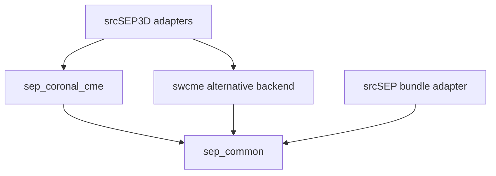
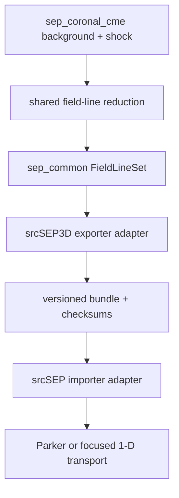

## 3. Model architecture and authority boundaries

The stand-alone model separates authority as follows.

| Quantity | Authoritative component |
|---|---|
| Coronal `B` below `R_i` | signed PFSS provider |
| Unsigned outer-coronal `B` from `R_i` to `R_scs` | finite-shell SCS provider |
| Magnetic sector and HCS geometry | field-line sector mapper |
| Open/closed topology and separatrix geometry | composite topology provider |
| Open-tube `u`, `rho`, `p`, `T` | transonic wind solver on the completed composite tube |
| Closed-tube `u`, `rho`, `p`, `T` | closed-field hydrostatic provider |
| Optional plasma-sheet thermodynamics | empirical tube-normalization provider |
| Heliospheric `B` above `R_scs` | conservative rotating-footpoint extension |
| Wind critical derivative | wind closure using `gamma_w` |
| Characteristic speeds and shock EOS | plasma EOS using `gamma_ad` |
| Shock position, shape, and velocity | ellipsoid kinematics provider |
| Shock existence and downstream jump | oblique ideal-MHD jump solver |
| Shock criticality | critical-Mach model selected by input |
| Generic injection spectra, species-source records, and distribution kernels | dimension-independent `sep_common` injection/species primitives |
| Coronal release eligibility, finite upstream release surface, normalization, and deterministic birth plan | `sep_coronal_cme` source-release planner, composed from the prepared background/shock state and generic `sep_common` primitives |
| Particle scattering and diffusion | generic `sep_common` coefficient physics/registry evaluated from the turbulence and plasma primitives prepared by `sep_coronal_cme` |
| Particle trajectories and weights | AMPS plus the selected application's thin mover adapter |
| Exported field-line geometry/state | shared `sep_coronal_cme` reduction of the prepared background/front snapshots, invoked by a `srcSEP3D` adapter |
| Field-line candidate-front intersections and local shock/source state | shared intersection kernel using the prepared front/shock snapshot |
| Imported 1-D trajectories and weights | AMPS plus the thin `srcSEP` field-line mover adapter |

No component may silently replace a failed value with a value from a different
provider. A PFSS failure cannot fall back to the existing Parker provider; an
inadmissible MHD jump cannot fall back to a user-entered compression ratio; and
missing turbulence cannot become zero scattering unless the input explicitly
selects a ballistic mode.

Topology, magnetic region, sector, and interface side are resolved before
interpolation. No interpolation or finite-difference stencil may mix open-wind
and closed-hydrostatic states, opposite magnetic sectors, or different
one-sided interface states.

Two shock-use modes are distinguished:

1. **Moving-source mode (initial production target).** The locally admissible
   shock surface injects an accelerated population into the upstream region.
   The analytic background is not overwritten by a synthetic downstream
   volume. This mode can represent shock release and subsequent SEP transport,
   but it does not model repeated crossings of a resolved shock sheath.
2. **Discontinuity-transport mode (later capability).** Particles can cross an
   exact mathematical shock surface and sample both upstream and downstream
   states. This requires a separately validated downstream/sheath extension.
   Local Rankine--Hugoniot relations alone do not define a globally
   divergence-free, time-dependent downstream CME solution.

The first mode is the scientifically defensible stand-alone baseline. The
second must not be advertised until its global consistency tests pass.

`sep_common` owns dimension-independent transport mathematics, coefficient
registries, injection-spectrum/species primitives, and every neutral snapshot,
birth-plan, and field-line wire record. `sep_coronal_cme` composes those
primitives into the coronal background and turbulence initialization,
candidate-front/jump classification, finite-surface source release and
normalization, and field-line reduction defined here. Application adapters may
convert application inputs to the shared SI contract, bind compiled species,
populate AMPS storage, and schedule queries, but they may not duplicate an
equation, reclassify a state, or recalculate a physical source weight. The
precise dependency and header rules are normative in Section 15.

---

## 15. Code architecture

The physics implementation and its specification belong to
`src/models/sep_coronal_cme`, not to either application. `srcSEP3D` and
`srcSEP` own only AMPS-facing adapters, application configuration entry points,
and run orchestration. This ownership prevents the 1-D and 3-D applications
from acquiring different formulas, defaults, source semantics, or validation
rules while still allowing each application to map the shared state into its
native mesh and particle representation.

The checked-in `model.md` is the canonical, complete review artifact, but it is
generated rather than edited as a second prose authority. Its maintained
**prose** is partitioned among exactly four nonoverlapping owners:

| Maintained module | Sole content authority |
|---|---|
| `model/physics.md` | equations, physical assumptions, interfaces, boundary/initial conditions, and limitations |
| `model/configuration_validation.md` | schema grammar, discriminated unions, units, cross-option validation, and fingerprints |
| `model/architecture_exchange.md` | code ownership, provider lifecycle, typed APIs, bundle/restart/output contracts |
| `model/testing_validation.md` | roadmap, canonical test registry, diagnostics, observation campaign, and release evidence |

`model/requirements.yaml` is a fifth, non-prose authority: the machine-readable
stable-ID registry. It owns each requirement ID, title, review source and
disposition, and its declared links to numbered sections, configuration keys,
API records, and test IDs. `tools/generate_model.py` checks that every declared
anchor exists and that numbered sections occur in their registered modules; an
anchor-existence check does not by itself prove that a paragraph is a complete
or scientifically relevant implementation of the linked requirement. The
generator also
generates the review-disposition and cross-reference tables, assembles the
four noncontiguous module sources in the explicit
`document.section_order=[1,...,20]` recorded by the registry, and writes this
file deterministically. A level-two `## N. ...` heading outside a Markdown
fence is the machine-recognized source marker for numbered Section `N`; the
physics-module preamble is the sole unnumbered preamble, and the two registered
`GENERATED:<table-name>` insertion tokens are the only generated-table sites.
Simple module concatenation is forbidden because the semantic owners contain
nonadjacent numbered sections. CI fails on a dirty generated diff, duplicate
stable requirement/review IDs, a requirement with no review-disposition link,
duplicate canonical test definitions, an unknown declared requirement-to-test
link, another unresolved declared anchor, malformed Markdown fences,
noncanonical text encoding, or a numbered section outside its registered
module. Semantic review remains responsible for relevance within a correctly
placed section, unlinked test definitions, and roadmap-range completeness.
Hand-maintained duplicate copies of
the review-disposition, schema, diagnostics, or test registry are forbidden.
The split is an editorial build arrangement and cannot change normative
content.

R10 is an executable release condition, not a statement of intent. Its
documentation component is implemented by the paths below and remains
satisfied only while the generator recreates `model.md` byte for byte and
`DOCSCCM01` passes. A missing module, registry, generator, test, or dirty
generated artifact changes that result to a hard failure; prose cannot waive
the executable gate.

The cross-review shared stable IDs are:

{{GENERATED:REQUIREMENT_REGISTRY}}

### 15.1 Shared source ownership and dependency graph

The canonical source and documentation layout is:

```text
src/models/
  sep_common/
    sep_status.h/.cpp
    sep_transport_common.h/.cpp
    sep_coefficient_physics.h/.cpp
    sep_coefficient_registry.h/.cpp
    sep_background_snapshot.h/.cpp
    sep_test_registry.h/.cpp
    sep_injection_spectrum.h/.cpp
    sep_species_source.h/.cpp
    sep_source_birth_plan.h/.cpp
    sep_field_line_exchange.h/.cpp
    sep_field_line_bundle_io.h/.cpp
    sep_flux_tube_geometry.h/.cpp
    sep_observer_exposure.h/.cpp
  sep_coronal_cme/
    README.md
    makefile                    # lib, install-headers, test, and
                                # check-architecture targets.
    include/sep_coronal_cme/
      model_configuration.h
      background_provider.h
      shock_provider.h
      turbulence_initializer.h
      source_release.h
      field_line_reduction.h
    src/
      pfss_harmonics.cpp
      closed_field_plasma.cpp
      scs_harmonics.cpp
      sector_map.cpp
      transition_sheet_topology.cpp
      open_flux_calibration.cpp
      flux_tube_wind.cpp
      empirical_kinematic_wind.cpp
      plasma_sheet_closure.cpp
      source_surface_coupling.cpp
      ellipsoid_geometry.cpp
      shock_kinematics.cpp
      mhd_jump.cpp
      shock_surface_quadrature.cpp
      standalone_shock_provider.cpp
      turbulence_initializer.cpp
      source_release.cpp
      field_line_reduction.cpp
    model.md
    model/
      physics.md
      configuration_validation.md
      architecture_exchange.md
      testing_validation.md
      requirements.yaml
    tools/
      generate_model.py
    test/
      test_model_documentation.py
  swcme/
    ...                         # Sibling CME/wind backend; never included by
                                # sep_coronal_cme.
srcSEP3D/
  adapters/
    sep_coronal_cme_3d_adapter.h/.cpp
    swcme_3d_adapter.h/.cpp
    source_birth_adapter.h/.cpp
    field_line_export_adapter.h/.cpp
  runtime/
    run_configuration.h/.cpp
    configuration_io.h/.cpp
srcSEP/
  adapters/
    field_line_bundle_adapter.h/.cpp
```

The dependency direction is strict:



`sep_common` is the lowest SEP-model layer. `sep_status.h` declares the neutral
`SEP::Core::StatusCode` and `SEP::Core::Status` result used by common and SCCM
APIs; it has no application, AMPS/PIC, MPI, output, or SCCM dependency. In
addition to the new exchange and bundle records, `sep_common` retains the
existing mover-independent transport,
coefficient, injection-spectrum, species-source, background-snapshot, and test-
registry kernels. It may include neither `sep_coronal_cme` nor `swcme`, and it
may not acquire an application or AMPS/PIC dependency. This rule prevents a
neutral serialized type from carrying a C++ enum declared in an upper physics
model.

`sep_coronal_cme` is a dependency-light C++17 library above `sep_common`. Its
public and private sources may include the C++ standard library and approved
neutral `sep_common` headers only; they may not include AMPS/PIC particle or
mesh headers, MPI, Tecplot/output headers, `srcSEP`, `srcSEP3D`, or `swcme`
headers. The sibling `swcme` implementation is an alternative backend selected
and adapted outside this library, not a service called by it. Provider-neutral
snapshots, source birth plans, and exchange records live in `sep_common`, so
either 3-D backend can be mapped to the same application boundary without a
dependency between the two physics models.

The baseline `srcSEP3D` executable links its adapter to either
`sep_coronal_cme` or the registered legacy backend and always uses
`sep_common`. The baseline `srcSEP` executable does **not** link or invoke
`sep_coronal_cme`: it consumes an SCCM-generated, checksummed field-line bundle
through `sep_common`, uses the common coefficient/injection/species records,
and performs no 3-D reconstruction. A future in-memory embedding would be a
separate, versioned capability with its own public API, build selector, and
tests; it is unavailable in the baseline and cannot be inferred from an
include path.

The same boundary applies to any future foreshock-turbulence calibration. A
calibration generated by a 1-D research workflow is an explicit, immutable
input asset; the 3-D process may validate and consume its content, but may not
launch `srcSEP`, search a sibling application directory, or assume that the
current `srcSEP` executable contains a self-excited-wave solver. Such a solver
is not a schema-5 capability. The asset contract and producer qualification
required before it can become one are specified as a post-schema-5 extension
in Section 15.8.

Stage 0 creates the `sep_coronal_cme` archive target and a public-header
installation/export target that installs only `include/sep_coronal_cme/**`.
Generated objects and archives remain under an ignored build directory and are
never release members. `ARCHSCCM01` compiles an empty consumer against the
installed headers using only the standard library and `sep_common`, scans the
complete object/header dependency graph for forbidden AMPS/PIC, MPI, Tecplot,
application, or `swcme` dependencies, and verifies the inverse prohibition that
`sep_common` never includes `sep_coronal_cme`. The test inspects every public
neutral snapshot, birth-plan, and bundle field and rejects a record whose
declared enum/struct resolves to an upper-layer header; mutation cases cover
focused-escape status, topology, sector, region, interface side, validity, and
source-rejection types. It also links the baseline `srcSEP` bundle consumer
without the SCCM archive and rejects application-local copies of shared headers
or source files.

The application adapters translate an already validated shared configuration
and immutable provider state to AMPS storage. Only those adapters may allocate
AMPS nodes or particles, perform MPI collectives or halo exchange, register
internal boundaries, write Tecplot output, or invoke application movers. The
SCCM library owns coronal formulas and physical validity decisions, while the
common library owns its generic numerical primitives and wire contracts;
adapters must not recompute either.

The lower-layer status contract used in all API sketches is explicitly owned
by `sep_common`; `Core::Status` below always means `SEP::Core::Status`, never
the application-owned `SEP3D::Core::Status`:

```cpp
namespace SEP::Core {

enum class StatusCode {
  Ok,
  InvalidConfiguration,
  UnsupportedCapability,
  InvalidState,
  OutOfDomain,
  DataIntegrityFailure,
  NumericalFailure
};

struct Status {
  StatusCode code;
  std::string message;

  bool ok() const noexcept { return code == StatusCode::Ok; }
};

}  // namespace SEP::Core
```

Adapters translate this neutral status to their local fatal/error mechanism at
the application boundary. Shared libraries do not include an application
status header, abort MPI, or throw an application-specific exception.

### 15.2 Shared configuration and application-adapter boundary

Backend selection is application orchestration rather than coronal-model
physics. Existing numeric values remain stable in the application adapters:

```cpp
enum class ApplicationBackgroundAuthority {
  AnalyticParker,
  AnalyticCoronalPfss,
  PythonInterpolator,
  Swmf,
  AnalyticCoronalComposite  // Appended; existing numeric values are unchanged.
};

enum class SolarRotationModel { Rigid, LatitudeDependentVerification };

enum class ApplicationShockAuthority {
  None,
  Swcme,
  StandaloneMhdEllipsoid
};
```

`ApplicationBackgroundAuthority` and `ApplicationShockAuthority` therefore do
not appear in `sep_coronal_cme` headers. They are resolved as a pair before
either backend is constructed; independently legal enum values do not imply
that their Cartesian product is legal:

| Configuration profile | Background authority | Shock authority | Result |
|---|---|---|---|
| schema-5 stand-alone SCCM | `AnalyticCoronalComposite` | `StandaloneMhdEllipsoid` | required pair; constructs the shared SCCM background/shock providers |
| frozen stand-alone legacy schema | `AnalyticParker` | `Swcme` | retained only in the version-specific schemas that already register this pair (including the current schema-3/4 application contract); the SWCME adapter and its canonical Parker ambient state are resolved together |
| parser-free coupled legacy host | `Swmf` | `Swcme` | legal only through the already registered coupled-host typed interface; it is not a schema-5 stand-alone input deck |
| reserved/unimplemented authority | `PythonInterpolator` or an authority with no registered pair | any | typed `NotImplemented`/configuration failure before allocation |
| mixed new/legacy authority | `AnalyticCoronalComposite` + `Swcme`, or any legacy background + `StandaloneMhdEllipsoid` | as shown | configuration failure; no implicit background or shock substitution |

`ApplicationShockAuthority::None` remains available only where the selected
version-specific grammar explicitly admits a source-disabled verification
profile; schema 5 does not infer that exception. `AnalyticCoronalPfss` likewise
retains its numeric enum value for compatibility but has no schema-5 production
pair until a separately registered contract and tests define one. The adapter
converts the selected provider output to neutral `sep_common` snapshots. The
two physics backends never include or call each other.

`SolarRotationModel` and the solver/configuration enums below are part of the
`sep_coronal_cme` contract. They may be used internally while resolving the
model, but a neutral `sep_common` record never contains one of these upper-layer
C++ types. When a selected policy must be serialized, SCCM maps it explicitly
to a stable neutral code or canonical manifest spelling owned by `sep_common`.

Schema 5 adds explicit enums without reusing or reordering old values:

```cpp
enum class SolarWindModel { FluxTubePolytropic, EmpiricalKinematic };
enum class SolarWindEnergyClosure { Isothermal, Polytropic, EmpiricalProfile };
enum class SolarWindTemperatureModel {
  Uniform,
  TubeFromTargetSpeed,
  VersionedProfile
};
enum class KinematicVelocityComponent {
  NotApplicable,
  Radial,
  FieldAligned
};
enum class KinematicVelocityReferenceFrame {
  NotApplicable,
  Inertial,
  Corotating
};
enum class KinematicChannelSelectorKind {
  StableTopologyClass,
  StableLineOrTubeIds
};
enum class KinematicProfileAbscissa {
  NotApplicable,
  HeliocentricRadius,
  FieldLineArcLength
};
enum class MassFluxAuthority {
  UniformBaseDensity,
  MassPerMagneticFlux,
  RadialFluxDensityWithMappedField,
  ColocatedDensityVelocityField
};
enum class RequiredConsumerCoveragePolicy {
  FailRequiredEventSupport,
  DiagnosticMaskSensitivity
};
enum class ClosedFieldPlasmaModel {
  IsothermalHydrostatic,
  PolytropicHydrostatic
};
enum class CurrentSheetModel { None, FiniteShellSchatten };
enum class TransitionSheetPolicy {
  NotApplicable,
  ExcludeClearance
};
enum class CriticalMachOutOfDomainPolicy {
  NotApplicable,
  FailPreflight,
  DiagnosticInapplicable,
  ExcludeSourceBudgeted
};
enum class SourcePopulationSemantics {
  NetFirstPassageUpstreamReleased
};
enum class SourceReleaseModel { EmpiricalNetFirstPassageRelease };
enum class SourceReleaseBoundary {
  UpstreamReferenceFirstPassage,
  FrontConormalFluxNoThroughFlowSensitivity,
  ShockAdjacentAbsorbingVerification
};
enum class FocusedReleasePhaseSpace {
  NotApplicable,
  OutwardFirstPassageFluxWeighted,
  UnrestrictedIsotropicVerification
};
enum class NoFocusedEscapePolicy {
  NotApplicable,
  FailPreflight,
  ExcludeBudgeted
};
enum class ShockReentryPolicy {
  AbsorbPostReferenceReturnLossLedger,
  ConormalNoThroughFlow,
  AbsorbShockAdjacentVerification
};
enum class OpenClosedInterfacePolicy {
  DiagnosticKinematic,
  BoundedApproximation,
  StationaryTangentialDiscontinuityEquilibrium
};
enum class LongitudeMappingModel { FullJacobian, UniformSpeedSpecialCase };
enum class MappingFoldPolicy { FailBackground, MarkInvalidDiagnostic };
enum class SourceTerminationModel { HardCutoff, QuinticTaper };
enum class AxisConvention { RadialPrincipalAxis };
enum class InitialRadialParameterization {
  CenterAndPrincipalAxes,
  ApexAndPrincipalAxes
};
enum class GeometryEvolution { IndependentComponentLaws, TabulatedSnapshots };

// The complete field set is the [open_open_interface] schema in Section 14;
// this declaration establishes its shared SCCM configuration ownership.
struct OpenOpenInterfaceOptions;
```

The shared immutable `SepCoronalCmeConfiguration` includes `PfssOptions`,
`PfssFilterOptions`,
`OpenFluxCalibrationOptions`, `FormationHeightValidationOptions`,
`CurrentSheetOptions`,
`SolarRotationOptions`, `ClosedFieldPlasmaOptions`,
`OpenClosedInterfaceOptions`, `OpenOpenInterfaceOptions`, `PlasmaSheetOptions`,
`SolarWindOptions`, `PlasmaEosOptions`, `SourceSurfaceCouplingOptions`,
`TurbulenceOptions`, `TransportCoefficientOptions`, `AxisKinematicsOptions`,
`StandaloneEllipsoidShockOptions`, `SourceTerminationOptions`,
`SourceOptions` (owning population semantics, release model, release-boundary
discriminant, finite reference-surface geometry, focused first-passage law,
no-escape policy and budgets, and re-entry policy), `SourceSpeciesOptions`,
`ConsumerAcceptanceBudgetOptions`, `ObserverOptions`,
`EnergyGridOptions`, and
`FieldLineFootprintOptions`. “Schema 5” names a versioned schema **family**, not
one input file accepted indiscriminately by both executables. Ownership is:

`OpenOpenInterfaceOptions` solely owns the model/representation/policy
discriminants, catalog and uncertainty assets, thickness ensemble, residual
bounds/quantiles, and convergence controls in `[open_open_interface]`; an
application adapter cannot keep a second copy of those fields.

| Layer/profile | Options owned and parsed | Prohibited duplication |
|---|---|---|
| shared `sep_coronal_cme` physical contract | all `SepCoronalCmeConfiguration` records listed above, including physical observer/energy-grid definitions that are exported in the bundle | neither application may own alternate background, shock, turbulence-initialization, release-surface, or source-normalization fields |
| separately parsed common application controls | each application parses and fingerprints its own species binding, particle time-step/weight, population-control, and output controls using the schema-5 family definitions | a local numerical value may differ between matched runs, but it cannot change bundle physics or reinterpret a stable species identity |
| `srcSEP3D`-only grammar | Cartesian AMR `MeshOptions`, `ActiveCorridorOptions`, field-line export requests, and 3-D AMPS/output bindings | no 1-D line-mesh or bundle-input section |
| `srcSEP`-only grammar | `LineMeshOptions`, immutable field-line-bundle input/binding, and 1-D AMPS/output bindings | no local background, shock, source-species, observer-physics, or 3-D mesh section |
| application orchestration | backend pair selection and construction, CLI mode, and application lifecycle | orchestration enums never enter SCCM headers or a neutral bundle record |

Every shared physical field is normalized into SI before
`SepCoronalCmeConfiguration::Create()`, and the `srcSEP3D` SCCM adapter receives
only the resulting immutable value. The `srcSEP` baseline never creates this
configuration: it validates the immutable bundle and its own local numerical
controls instead.
`SolarRotationOptions` contains the raw rate/convention/axis and conversion
asset plus the factory-derived resolved sidereal vector/rate; providers receive
only this immutable record. `SourceOptions` is likewise the sole typed owner of
the net-first-passage population, reference-surface, conormal sensitivity,
verification-only absorbing branch, and candidate-front-return semantics.
Its `AbsorbPostReferenceReturnLossLedger` enum is a policy selector retained
for input compatibility, not a wire-ledger enum: after positive-distance
flight, an absorbed front return maps only to
`Source::SourceBoundaryLedgerTerm::DelayedFrontReturn`. No neutral enum or
serialized manifest defines `PostReferenceFrontReturnLoss`.

`SolarWindOptions` owns the validated
`sep-kinematic-wind-profile-v1` manifest asset, the selected mass-flux
authority, overlap/blending controls, and the required-consumer coverage
policy. `KinematicVelocityComponent`, `KinematicVelocityReferenceFrame`,
`KinematicChannelSelectorKind`, and `KinematicProfileAbscissa` remain shared
SCCM enum **types**, but there is no global component, frame, projection
tolerance, selector, or abscissa value that a caller can override at an
evaluation site. Each immutable manifest channel owns its own velocity
component/reference frame when applicable, pointwise radial-projection
tolerance, selector kind and members, abscissa and units, coordinate frame and
trace epoch, stable line IDs/topology class/background fingerprint, arc-length
origin/orientation where applicable, closed support segments, data-use role,
uncertainty/covariance identity, and interpolation values/derivatives. Thus a
radial density channel and an independently measured field-aligned velocity
channel may coexist without either being relabelled.

The validated descriptor stores the overlap `[r_a,r_b]`, the complete channel
catalogue, and each channel's represented physical measure. Evaluation first
resolves the requested quantity to exactly one channel and returns a typed
`UnsupportedConsumer`, `ProjectionMismatch`, `LineIdentityMismatch`,
`FrameOrEpochMismatch`, or `OutsideProfileSupport` status before producing a
state. There is no fallback that changes radial data into field-aligned data,
radius into arc length, or one channel's support/geometry identity into
another's.

Schema 5 has pointwise wind residuals and discrete observational comparisons,
but it does not claim a continuous observation-derived plausibility envelope.
A future envelope must be a checksummed asset with its own quantity and frame,
support, topology/line selector, uncertainty representation, interpolation
rule, and provenance. In particular, an inertial radial speed, a corotating
field-aligned speed, and the quasi-steady field-aligned advective acceleration
are different observables; a time-dependent product instead uses a consistently
projected full material derivative. An envelope for one cannot silently
constrain another. Section 15.8 defines
the intended record without introducing an undocumented universal speed cap or
monotonic-wind rule into schema 5.

Every referenced input is resolved before creation:

```cpp
struct ImmutableInputAsset {
  std::string canonicalRole;
  std::string sourcePath;       // Provenance only; not the identity.
  std::string contentChecksum;
  std::vector<std::byte> validatedContent;
};
```

The fingerprint uses the canonical role and content, never a path alone.
`Create()` validates the complete discriminated union in one transaction and
rejects missing active values, nonzero/non-`none` inactive values, EOS/table
mismatch, illegal magnetic radii, structured wind without the conservative
mapping, invalid axes/history, unsupported interface rules, and illegal source
taper ordering.

Schema 5 must not change schema-4 interpretation. Old examples continue to
parse under their declared schema or fail with a precise migration diagnostic.

### 15.3 Background provider

`AnalyticCoronalCompositeProvider` is a shared `sep_coronal_cme`
implementation of the neutral `sep_common` `BackgroundProvider` lifecycle:

1. `SepCoronalCmeConfiguration::Create()` resolves assets and converts the sole raw
   rotation input to the immutable sidereal value; no provider performs a
   second conversion.
2. `Validate()` checks coefficients, flux balance, radius ordering, interface
   policies, wind/EOS branches, mapping controls, resolved rotation, and
   immutable assets without requiring a prepared background.
3. `Prepare(t)` first constructs an unpublished unscaled composite through
   PFSS, both topology classifications, finite SCS, transition, Parker map,
   and raw D6. Under `magnetogram-scale`, it derives the one factor, destroys
   that provisional graph, and rebuilds the same sequence from the retained
   original photospheric coefficients. It then constructs the final
   sector/HCS geometry, composite-footpoint sectors, D9-background/exclusion
   mask, composite tubes, selected wind/mapping, closed plasma and D8,
   plasma-sheet normalization, turbulence/force diagnostics, and final D6/D7.
   `compare-only` uses the first composite directly. Exactly one complete
   immutable candidate state is published after all invariants pass.
4. `Evaluate(x,side)` returns one-sided `B`, gradients, `U`, gradients,
   density, pressure, temperature, wave state, characteristic speeds,
   focusing length, curvature, mapping state, both topology classifications,
   both the composite-footpoint and SCS-construction sectors, region,
   transition state/distance/identity, discontinuity identity, validity, and
   provenance. At qualified interface/layer points it also returns the typed
   interface-balance diagnostic; absence away from support is explicit rather
   than encoded as a zero residual.
5. `EvaluateBatch()` fills cell centers and vertices without allocation in the
   hot loop.

Every categorical value returned in a background snapshot or serialized bundle
is an exchange type declared by `sep_common`, not by the implementing SCCM
provider. The illustrative declarations below therefore live in
`sep_background_snapshot.h` under the neutral namespace:

```cpp
namespace SEP::Background {

enum class SnapshotValueValidity { Valid, Inapplicable, Invalid };
enum class PfssTopology { OpenToRb, ClosedBelowRb, Separatrix };
enum class CompositeTopology { OpenToRi, ClosedBelowRi, Separatrix };
enum class MagneticSector { Negative = -1, Undefined = 0, Positive = 1 };

enum class BackgroundRegion {
  Pfss,
  PfssScsTransition,
  FiniteShellSchatten,
  HeliosphericParker
};

enum class RadialInterfaceSide {
  NotApplicable,
  PfssSide,
  ResolvedTransitionInterior,
  ScsSide
};

enum class SeparatrixSide { NotApplicable, OpenSide, ClosedSide };

enum class TransitionSheetState {
  NotApplicable,
  OutsideClearance,
  ExcludedClearance,
  AmbiguousTopology
};

enum class InterfaceRepresentationCode {
  SharpOneSided,
  FiniteWidthVolume
};

// Stable wire code produced from the SCCM OpenClosedInterfacePolicy selector.
// Keeping a distinct neutral type prevents sep_common from including an SCCM
// configuration header merely to deserialize a diagnostic.
enum class InterfaceBalancePolicyCode {
  DiagnosticKinematic,
  BoundedApproximation,
  StationaryTangentialDiscontinuityEquilibrium
};

enum class InterfaceBalanceDiagnosticKind {
  SharpVectorTractionJump,
  VolumeMomentumResidual
};

enum class InterfaceClassCode {
  OpenClosedSeparatrix,
  GenericOpenOpen,
  PlasmaSheet
};

enum class InterfaceSideTopologyCode { Open, Closed };

enum class InterfaceStateOriginCode {
  AnalyticOneSidedState,
  EquilibriumSolverState,
  ImportedEquilibriumState,
  ImportedOneSidedState,
  ResolvedLayerState
};

enum class TangentialDiscontinuityGateState {
  Passed,
  Failed,
  NotApplicableNonSeparatrix
};

enum class MassFluxJumpGateState {
  Passed,
  Failed,
  NotApplicableFiniteWidth
};

enum class PolicyResidualGateState {
  Passed,
  Failed,
  NotApplicableDiagnosticKinematic
};

enum class InterfaceDiagnosticValidity {
  Valid,
  InapplicableNearZeroRelativeScale,
  InapplicableForRepresentation,
  OutsideQualifiedSupport
};

struct BackgroundRegionState {
  PfssTopology pfssTopology;
  CompositeTopology compositeTopology;
  MagneticSector compositeFootpointSector;
  MagneticSector scsConstructionSector;
  BackgroundRegion region;
  RadialInterfaceSide radialInterfaceSide;
  SeparatrixSide separatrixSide;
  TransitionSheetState transitionSheetState;
  std::uint64_t discontinuityId;
  double signedDistanceToCurrentSheetM;
  double signedDistanceToTransitionSheetM;
  std::uint64_t transitionSheetId;
  bool plasmaSheetModified;
  bool oneSidedOnly;
};

struct LongitudeMapState {
  double sourceLongitudeRad;
  double forwardJacobian;
  double inverseJacobian;
  double minimumMargin;
  bool valid;
};

struct InterfaceBalanceDiagnostic {
  std::uint64_t interfaceId;
  InterfaceClassCode interfaceClass;
  std::uint64_t interfaceClassId;
  std::uint64_t sideAClassId;
  std::uint64_t sideBClassId;
  InterfaceSideTopologyCode sideATopology;
  InterfaceSideTopologyCode sideBTopology;
  InterfaceStateOriginCode sideAOrigin;
  InterfaceStateOriginCode sideBOrigin;
  InterfaceRepresentationCode representation;
  InterfaceBalancePolicyCode policy;
  InterfaceBalanceDiagnosticKind kind;
  double interfaceNormalVelocityMPerS;
  std::uint64_t interfaceVelocityProvenanceId;
  std::uint64_t uncertaintyProvenanceId;
  // This stable identifier and explicit right-handed orthonormal basis make
  // signed normal/tangential components reproducible after serialization.
  std::uint64_t deterministicBasisId;
  std::array<double, 3> unitNormal;
  std::array<double, 3> unitTangent1;
  std::array<double, 3> unitTangent2;
  // Components are ordered {normal,tangent1,tangent2} in the basis above.
  // Units are Pa for a sharp traction jump and N/m^3 for a finite-width
  // volume residual. Inactive storage is never interpreted.
  std::array<double, 3> basisComponents;
  double absoluteNorm;
  double relativeNorm;
  double signedMassFluxJumpKgPerM2PerS;
  double absoluteMassFluxJumpKgPerM2PerS;
  double relativeMassFluxJump;
  InterfaceDiagnosticValidity massFluxJumpValidity;
  InterfaceDiagnosticValidity massFluxRelativeValidity;
  MassFluxJumpGateState massFluxJumpGateState;
  double sideANormalFieldT;
  double sideBNormalFieldT;
  double sideARelativeNormalVelocityMPerS;
  double sideBRelativeNormalVelocityMPerS;
  TangentialDiscontinuityGateState tangentialDiscontinuityGateState;
  PolicyResidualGateState policyResidualGateState;
  InterfaceDiagnosticValidity validity;
};

}  // namespace SEP::Background
```

The SCCM `OpenClosedInterfacePolicy` selector maps one-to-one to
`InterfaceBalancePolicyCode` only when a validated snapshot is published.
`OpenOpenInterfaceOptions` may map only diagnostic or bounded policy; an
inactive open--open selector publishes no interface record, and any attempt to
map stationary-TD equilibrium is rejected. Generic open--open and plasma-sheet
records publish `NotApplicableNonSeparatrix` for the tangential-discontinuity
gate, while a finite-width record publishes `NotApplicableFiniteWidth` for its
mass-flux-jump gate. The same lower-layer rule applies to every validity,
rejection, region, topology,
sector, side, and discontinuity code stored by `BackgroundSnapshot`,
`SourceBirthPlan`, or `FieldLineSet`: the C++ type is declared in `sep_common`,
and SCCM consumes or produces it. Solver choices and configuration policies
that never cross that boundary remain SCCM types. A canonical string in a
manifest is likewise defined by the neutral schema rather than by an upper-
layer enum's incidental integer representation.

The provider exposes a segment/surface discontinuity query so movers and
exporters can split a step exactly. Evaluation on a zero-thickness sheet
returns a typed discontinuity status unless a side is supplied; it never
averages the two sides. A segment reaching `S_tr` returns
`ExcludedClearance` or `AmbiguousTopology` under the schema-5 transition
policy and can never be routed through the ordinary pure-HCS sign-flip event.
New status codes are appended without renumbering old codes.

Analytic derivatives should be used for PFSS, finite SCS, and the outer Parker
field. A finite-difference derivative may be used for the wind only if its
stencil is convergence tested and never crosses an inactive cell, provider
boundary, separatrix, HCS, or mapping-invalid interval. A precomputed field
grid is an optimization and not a second authority.

### 15.4 Shared shock provider

The neutral interface is declared without application headers and implemented
inside `sep_coronal_cme`. It exposes transactional methods similar to the
background provider:

```cpp
class ShockProvider {
 public:
  virtual Core::Status Validate() const = 0;
  virtual Core::Status Prepare(double timeS,
      const Background::BackgroundSnapshot& background) = 0;
  virtual std::shared_ptr<const ShockSurfaceSnapshot>
      PreparedSurface() const = 0;
  virtual Core::Status EvaluateAt(double timeS,
      const Background::BackgroundSnapshot& background,
      std::shared_ptr<const ShockSurfaceSnapshot>* snapshot) const = 0;
  virtual Core::Status BuildHistory(const HistoryRequest& request,
      const Background::BackgroundSnapshot& background,
      std::shared_ptr<const ShockHistory>* history) const = 0;
};
```

`Prepare()` receives an evaluated immutable geometry state, splits its
tessellation at HCS/separatrix interfaces, evaluates one-sided upstream states,
solves admissible jumps, classifies every patch, calculates area/source
weights, and publishes only when the candidate surface is internally
consistent. A completely sub-fast surface is a valid zero-source snapshot,
not a provider failure. A sub-fast patch or a physical no-jump classification
is inactive with a reason; missing upstream authority, inconsistent topology,
or an internal numerical failure aborts the transaction and leaves the
previous generation unchanged.

The geometry evaluator returns center and velocity, orientation and angular
velocity, three axes and rates, `Q` and `Q_dot`, derived apex
position/radius/speed, solar-footprint state, and validity. Patch normal speed
may be decomposed into translation, expansion, and rotation diagnostics, but
the sum from `-F_t/|grad F|` is authoritative. A side-effect-free history
builder root-localizes activation/deactivation events independently of output
cadence.
The implementation must keep the center trajectory and body attitude as
distinct state authorities: changing attitude `R` rotates the ellipsoid about
its center and changes the derived quadratic-form tensor `Q=R D R^T`, but does
not deflect that center. Schema 5 provides a radial center path
and a fixed body attitude; it does not provide observationally fitted,
time-dependent deflection or rotation histories. The future API in Section
15.8 therefore separates `CenterPathState` from `AttitudeState` and derives
neither one from the other.
`EvaluateAt()` and `BuildHistory()` are const, side-effect-free constructions:
they return owning immutable handles and cannot replace the generation returned
by `PreparedSurface()`. Snapshot lifetime remains valid after the next provider
query. Initialization-only export tests both ownership and unchanged active
generation.

Turbulence initialization and particle release have equally explicit layer
boundaries. `TurbulenceInitializer` selects and parameterizes the generic
`sep_common` coefficient primitives, prepares the wave/plasma fields, and
publishes them in the neutral background snapshot. `SourceReleasePlanner`
applies the SCCM shock/source eligibility, finite reference-surface,
normalization, focused-escape, and loss-budget rules, while delegating generic
spectrum and species arithmetic to `sep_common`. Its only executable result is
an immutable neutral plan:

```cpp
namespace SEP::CoronalCme {

class SourceReleasePlanner {
 public:
  static Core::Status Create(
      const SourceOptions& source,
      const Source::SpeciesSourceRegistry& commonSpeciesSources,
      std::unique_ptr<SourceReleasePlanner>* planner);

  Core::Status Build(
      const Background::BackgroundSnapshot& background,
      const ShockSurfaceSnapshot& shock,
      const SourceInterval& interval,
      std::shared_ptr<const Source::SourceBirthPlan>* plan) const;
};

}  // namespace SEP::CoronalCme
```

`SEP::Source::SourceBirthPlan` is declared in `sep_common`. It contains stable
species/compiled-slot identities, patch and interval IDs, phase-space strata,
represented number and energy, deterministic keyed-draw identities, placement
support, and all candidate/excluded/committed ledger terms. The invariant
release quantity is `NetFirstPassageRelease`; live-population closure is the
separate time-dependent `SurvivingUpstreamInventory`. Gross shock-adjacent
emission and hit-reference-before-shock terms exist only in the absorbing
verification branch and cannot be substituted for either invariant. Each loss
budget separately carries represented-number loss, the bounded lost-birth-
energy fraction, and the unbounded event-time-energy impact ratio. The plan
contains no AMPS particle-buffer pointer or MPI rank. It is invariant under
rank count and complete before an application begins allocating particles. An
adapter may partition plan entries between ranks and instantiate them, but
cannot recompute the spectrum, eligibility, weight, direction law, or physical
ledgers.

Schema 5 deliberately has neither a delayed-return re-acceleration operator
nor a flare/impulsive source. A particle that returns to the candidate front
after positive-distance flight is absorbed and entered in
`DelayedFrontReturn`; it is not redrawn from the source spectrum. Re-emission
would require a normalized renewal kernel, a declared shock-work/energy
authority, and additional conservation ledgers. Likewise, an optional
impulsive contribution must be produced by a separate provider and retain a
separate origin ledger rather than being folded into
`NetFirstPassageRelease`. The future interfaces in Section 15.8 make these
requirements explicit without advertising either capability as implemented.

### 15.5 AMPS adapter integration

AMPS-facing code remains in `srcSEP3D` or `srcSEP` adapters and performs only:

- transfer of validated background values into physical center/vertex nodes;
- halo exchange;
- deterministic rank-local distribution of an already validated neutral
  `SourceBirthPlan` without changing its represented physical totals;
- particle instantiation through the existing species-general molecular-data
  API, with every created particle traced back to one plan entry;
- mover calls through the existing adapters;
- output, observer sampling, restart, splitting, and merging.

Population control runs only at the configured cadence after mover/boundary
events and source insertion, and before the next sampling interval begins. It
uses the AMPS conservative split/merge adapter on groups that share stable
species ID and compiled slot, active block, background generation, and source-
label class. Splitting
preserves total weight exactly and uses keyed child perturbations whose weighted
momentum is unchanged. Merging is accepted only when the selected AMPS kernel
closes represented weight, vector momentum, and relativistic kinetic energy
within registered tolerance; an inadmissible group is left unchanged rather
than merged across species or phase-space strata. Source ledgers are immutable
physical-rate records and are never rewritten by population control. Before/
after conservation residuals, attempted/accepted counts, weight variance, and
observer-invariance diagnostics are emitted per species and MPI rank.

PFSS, wind, turbulence initialization, ellipsoid, MHD-jump, source-eligibility,
release-surface, normalization, coefficient, and injection-spectrum equations
must not be duplicated in `main_lib.cpp` or either application adapter.

The background storage-layout version increases. Continuous values and
categorical region/topology/sector values have separate interpolation rules.
A stencil containing more than one sector or interface side is never averaged
component-wise. Particle-local state is evaluated one-sided or with a
sector-aware stencil. For output-only vertex interpolation, an unresolved
mixed-sector stencil emits finite sentinels with `background_valid=0`. Halo
exchange carries every region, sector, discontinuity, mapping-validity, and
side field.

When a supported mover crosses a topology interface, the step is split at the
crossing and coefficients are reevaluated on the new side. For a pure HCS sign
reversal, Cartesian velocity is preserved and pitch cosine is recomputed
relative to the new field. A general PFSS/SCS kink uses only the separately
verified interface operator. These rules replace generic interpolation of the
complete static double slice across a discontinuity.

### 15.6 Output and restart

Initialization and time-dependent output must add:

- PFSS/SCS/Parker region, PFSS/composite topology, composite-footpoint and
  SCS-construction sectors, interface side, transition-sheet state/distance,
  and discontinuity identity;
- signed HCS/interface distances, interface kink/surface current, and
  plasma-sheet factor;
- source longitude, `A_phi`, `J_phi`, fold margin, mapping validity, and
  structured-wind target/residual; D7 density/speed/mass-flux comparisons,
  overlap mismatch, composition conversion, per-channel ID, velocity component/
  reference-frame and resolved rotation authority, local projection guard,
  declared selector and resolved consumer route, abscissa identity, physical-
  measure coverage census, and empirical-kinematic momentum residual;
- `gamma_w`, `gamma_ad`, optional `gamma_c`, and each thermodynamic authority;
- raw solar-rotation rate/convention, resolved sidereal rate/vector/axis, and
  conversion-asset identity;
- flux-tube expansion factor;
- sound, Alfvén, and fast-mode speeds;
- `w_out`, `w_in`, derived field-relative wave energy, both cross-helicity
  conventions, every amplitude ratio, signed wave acceleration, and normalized
  wave-force residual;
- signed distance to piston and candidate front;
- candidate-front patch identifier and local shock/source classification;
- front normal and normal speed;
- center/axes/orientation, component rates, derived apex and footprint, and
  translation/expansion/rotation normal-speed contributions;
- `theta_Bn`, `M_f`, `M_A`, `M_An`, `M_chi`, `M_c^chi`, compression, branch, candidate/fast/jump/
  supercritical/source value-plus-validity states and reasons, first activation times and
  radii, activity interval, source-envelope factor, and untapered/realized
  physical source rates, table-domain margins, criticality-inapplicable
  intervals, and instantaneous/integrated area, incident-number, and
  incident-kinetic-energy exclusion budgets,
  transition-topology exclusion; immutable release-boundary/reference-surface
  identity; direct focused positive-flux normalization and diagnostic `mu_c`;
  candidate/no-escape/committed/`NetFirstPassageRelease`, time-dependent
  `SurvivingUpstreamInventory`, immediate/delayed-return, and transition-loss
  ledgers; plus verification-only gross-emission/hit-reference terms when that
  branch is selected;
- every transition consumer-cap numerator, explicit denominator, fraction,
  stratum, interval, bound, and pass/inapplicable/exceeded state; finite-
  footprint magnetic flux and point-observer rejection states; and
  represented-number and bounded birth-energy-normalized transition/front-
  return runtime loss budgets, the separately labeled unbounded event-time-
  energy impact ratios, and never raw macroparticle-count fractions;
- D6 open-flux reference/ratio and nested-sphere closure; SCS attenuation and
  latitude-flatness products; D8 stable interface/class ID, side origins,
  deterministic basis, policy/representation, open--closed one-sided
  normal-field and relative-normal-flow gates (typed not applicable for generic
  open--open structure), signed/absolute/normalized sharp mass-flux jump,
  sharp full-vector traction or smooth volume momentum residual,
  pointwise/quantile/maximum reductions, and convergence/uncertainty records;
  and D9 transition crossing flux, nulls, sector mismatch, and clearance
  measures;
- when formation-height validation is enabled, every Cartesian candidate tuple
  ID/checksum/prior, D6/topology/D1/D2 results, event-specific type-II/EUV
  likelihood contribution, joint weight/status, and an explicit assertion
  that no SEP product entered selection;
- repeated observer IDs, exact energy/pitch-angle edges, collection measure,
  weighted/effective counts, exposure, value, uncertainty, particle-presence,
  and validity flags; and
- standard AMPS cell macroscopic moments with explicit particle-presence and
  estimator-validity flags, together with local particle time step and
  species-resolved statistical weight (plus logarithm only where positive);
- mesh refinement target/attained level, active-corridor membership and
  closure reason, and population-control before/after diagnostics; and
- background and shock generation identifiers.

Invalid or inapplicable values must be represented by a finite sentinel plus
an explicit field/group-specific validity column, never `NaN`. A single
`background_valid` aggregate may summarize a row but cannot replace magnetic,
plasma, turbulence, shock, source, particle-moment, observer, and numerical
validity states. The output manifest uses the same data-dictionary contract as
the field-line bundle; consumers branch on state and never compare numeric
values with the sentinel.

Restart identity includes the physical domain, mesh/refinement and active-mask
contract, stable species/compiled-slot identity, numerical time-step/weight controls, population-control policy,
output sentinel/data dictionary, run horizon, maximum-step cap, campaign seed,
keyed-stream layout, every active thermodynamic index, PFSS grid/filter
settings and coefficient checksum, both topology-map hashes, SCS/sector/HCS
hashes, structured-wind assets, two-zone overlap, composition conversion,
mass-flux authority, every channel ID/component/reference frame/resolved
rotation authority/local projection guard/selector/resolved route/abscissa, line
catalogue/background fingerprint, required-consumer coverage policy and
ledgers, mapping/fold algorithm and map hash,
closed/plasma-sheet/turbulence authorities, complete shock geometry and
activation-region records, source taper, front/shock generation and patch
topology, traced-footprint/measure-group geometry and checksums, observer
mapping topology/events/exposures, detector-clock mapping, bin definitions,
single resolved solar-rotation authority, D6--D10 products/tolerances,
open-flux reference convention and radius-ensemble/member identity,
source-population semantics, release model, release-boundary discriminant,
finite reference-surface geometry/generation, focused first-passage and
no-escape policies/budgets, conormal-boundary convention, loss-ledger
policies, transition/front consumer-budget asset checksums, cohort edge sets,
formation-height candidate/event-constraint asset checksums and weighting
rule, and kinematic epoch. Restart with different physics
fails before particle data are read.

Temporal interpolation is rejected when either topology classification,
sector, discontinuity identity, or current-sheet map differs between
snapshots. It never linearly
interpolates through a sector reversal or moving interface.

### 15.7 Shared field-line exchange API

The neutral records, validation, interpolation rules, and serializer belong in
`src/models/sep_common`; neither application may include the other
application’s headers or search for a sibling source tree. The field-line
tracing, background/front sampling, intersection, and reduction algorithms
belong in `sep_coronal_cme` because they define the physical reduction. A
`srcSEP3D` exporter adapter supplies requests and invokes that shared kernel;
it does not reproduce it. The `srcSEP` importer adapter converts a validated
neutral line view into its existing field-line storage and
`SEP::Background::BackgroundSnapshot`. It calls only `sep_common` bundle I/O,
validation/interpolation, coefficient-registry, injection/species-record, and
background-snapshot APIs. It neither links an SCCM provider nor reconstructs a
PFSS/SCS/Parker field, shock surface, release surface, or source normalization.
The bundle path is an explicit input; no adapter probes a sibling application
directory.

The intended dependency direction is:



The shared reduction API makes that ownership explicit; it accepts neutral
owning snapshots and returns a neutral set without seeing an AMPS mesh:

```cpp
namespace SEP::CoronalCme {

class FieldLineReductionBuilder {
 public:
  static Core::Status Create(
      std::shared_ptr<const Background::BackgroundSnapshot> background,
      std::shared_ptr<const ShockHistory> shockHistory,
      std::unique_ptr<FieldLineReductionBuilder>* builder);

  Core::Status Build(
      const std::vector<FieldLineRequest>& requests,
      std::shared_ptr<const FieldLine::FieldLineSet>* result) const;
};

}  // namespace SEP::CoronalCme
```

Factories reject null, mutable, unvalidated, or fingerprint-incompatible
snapshots before tracing begins. `Build()` is deterministic, side-effect free,
and transactional: it either returns a complete validated set or no set. The
application adapter owns publication and output policy.

The neutral `sep_common` public API has the following responsibilities. Exact
class names may change during implementation, but ownership and failure
semantics must not:

```cpp
namespace SEP {

namespace Source {

// Neutral outcome stored in birth plans and exported source records. The
// upper-layer NoFocusedEscapePolicy selector remains in sep_coronal_cme.
enum class FocusedEscapeStatus {
  Admissible,
  NoFocusedEscapeZeroPositiveFluxNormalization,
  UnresolvedPositiveFluxNumerics,
  InvalidSourceFrameTransform,
  InvalidReferenceSurface
};

enum class SourceBoundaryLedgerTerm {
  CandidateReferenceRelease,
  NoFocusedEscapeExcluded,
  CommittedFirstPassageRelease,
  ImmediateShockAdjacentReturn,
  DelayedFrontReturn,
  NetFirstPassageRelease,
  SurvivingUpstreamInventory,
  GrossShockAdjacentEmissionVerificationOnly,
  HitEscapeSurfaceBeforeShockVerificationOnly
};

// Extensive sums are never replaced by macroparticle counts. Birth energy and
// event-time energy are distinct because retained work can make the latter
// exceed the former before a terminal event.
struct SourceBoundaryLedgerEntry {
  SourceBoundaryLedgerTerm term;
  double representedNumber;
  double representedBirthKineticEnergyJ;  // Bounded-loss numerator/denominator.
  double representedEventKineticEnergyJ;  // Diagnostic impact; not <= birth.
  std::array<double, 4> birthFourMomentumSi;
  std::array<double, 4> eventFourMomentumSi;
  std::string inertialFrameId;             // Validated stable frame identity.
  bool eventValueApplicable;
};

struct SourceLossBudgetRecord {
  double cohortBirthRepresentedNumber;
  double cohortBirthKineticEnergyJ;
  double lostRepresentedNumber;
  double lostBirthKineticEnergyJ;
  double lostEventKineticEnergyJ;
  double boundedNumberLossFraction;       // In [0,1].
  double boundedBirthEnergyLossFraction;  // In [0,1].
  double unboundedEventEnergyImpactRatio; // Finite >=0; may exceed one.
};
struct SourceBirthPlan;
class SpeciesSourceRegistry;

}  // namespace Source

namespace FieldLine {

// An intersection already exists, so this enum describes only its position
// relative to the independently configured source envelope.
enum class IntersectionDomainStatus {
  WithinSourceEnvelope,
  AfterSourceEnvelope
};

// Coverage and intersection presence are orthogonal: a partial history may
// already contain intersections without licensing a permanent conclusion.
enum class HistoryCoverage { Complete, Incomplete };

enum class SourceRejection : std::uint32_t {
  None                       = 0,
  SubFast                    = 1u << 0,
  JumpInadmissible           = 1u << 1,
  Subcritical                = 1u << 2,
  WeakFieldExcluded          = 1u << 3,
  InvalidUpstream            = 1u << 4,
  ClosedFieldExcluded        = 1u << 5,
  BelowQualifiedSourceRadius = 1u << 6,
  OutsideActiveDomain        = 1u << 7,
  TransitionLayerExcluded    = 1u << 8,
  SourceTerminated           = 1u << 9,
  TransitionSheetTopologyExcluded = 1u << 10,
  CriticalityUnavailable     = 1u << 11,
  FocusedNoEscape            = 1u << 12
};

enum class SourceMeasureStatus {
  ValidFiniteTube,
  CharacteristicOnly,
  TangencyRejected,
  ZeroAssigned
};

class LineId {
 public:
  static Core::Status Create(std::string_view text, LineId* id);
  const std::string& value() const;

 private:
  std::string value_;  // Validated stable serialized identity, not order.
};

class ObserverId {
 public:
  static Core::Status Create(std::string_view text, ObserverId* id);
  const std::string& value() const;

 private:
  std::string value_;
};

class SpeciesId {
 public:
  static Core::Status Create(std::string_view text, SpeciesId* id);
  const std::string& value() const;

 private:
  std::string value_;
};

// This record is evaluated independently for every stable species, momentum
// interval, physical patch, provider generation, and event-split time
// interval. Status is decided by the direct positive-normal-flux integral in
// the fully transformed frame. A tangent magnetic field is not by itself a
// no-escape state because relative bulk advection may make the integral
// positive; simplified mu_c diagnostics never replace this normalization.
struct FocusedEscapeAdmissibility {
  SpeciesId speciesId;
  std::uint64_t momentumIntervalId;
  std::uint64_t patchId;
  std::uint64_t providerGeneration;
  std::uint64_t eventIntervalId;
  double signedBdotNormal;
  double criticalSignedPitchCosine;
  bool criticalSignedPitchCosineApplicable;
  double positiveNormalFluxIntegral;
  double positiveNormalFluxAbsoluteErrorBound;
  double positiveNormalFluxRelativeErrorBound;
  Source::FocusedEscapeStatus status;
};

struct NodeState;             // SI sample plus per-field/group typed validity.
struct FrontIntersection;     // Stable characteristic root or finite-tube component.
struct LineObserverMapping;   // Time-resolved physical tube/observer overlap.
struct ObserverMappingCoverage; // Topology segments, events, and horizon.
struct LineConnectionSummary; // Non-lossy counts, first events, and horizon.
struct LineRecord;            // Immutable nodes, measure, observers, intersections.
struct FieldLineSetMetadata;  // Schema, frame, epoch, fingerprints, validity.
struct FieldLineSet;          // One transactionally validated multi-line product.

// Performs structural and physical validation without application headers.
Core::Status Validate(const FieldLineSet& set);

// Writes to a temporary location, verifies hashes, and atomically publishes
// the final bundle only after every member is complete.
Core::Status WriteBundle(const FieldLineSet& set, const std::string& path);

// Verifies schema and every member checksum before returning an immutable set.
Core::Status ReadBundle(const std::string& path,
                        std::shared_ptr<const FieldLineSet>* set);

// Provides bounded interpolation. Extrapolation and crossing an invalid
// interval return a typed error rather than a clamped value.
class Evaluator {
 public:
  // Rejects null or unvalidated input and returns an owning evaluator only
  // after the complete set passes Validate().
  static Core::Status Create(std::shared_ptr<const FieldLineSet> set,
                             std::unique_ptr<Evaluator>* evaluator);
  Core::Status EvaluateNode(const LineId& lineId, double sM, double timeS,
                            NodeState* state) const;
  Core::Status Intersections(const LineId& lineId, double timeS,
                             std::vector<FrontIntersection>* intersections) const;
  Core::Status ObserverMappings(
      const LineId& lineId, const ObserverId& observerId, double timeS,
      std::vector<LineObserverMapping>* mappings) const;
  Core::Status ObserverCoverage(
      const LineId& lineId, const ObserverId& observerId,
      ObserverMappingCoverage* coverage) const;
  Core::Status ConnectionSummary(const LineId& lineId,
                                 LineConnectionSummary* summary) const;

 private:
  explicit Evaluator(std::shared_ptr<const FieldLineSet> set);
  std::shared_ptr<const FieldLineSet> set_;
};

}  // namespace FieldLine
}  // namespace SEP
```

A serialized line, observer, species, or measure-group ID is case-sensitive
ASCII matching
`[A-Za-z0-9][A-Za-z0-9_-]{0,63}`; path separators, whitespace, empty IDs, and
duplicates in the same namespace are rejected by the matching checked factory.
Comma-separated `line_ids` and `observer.species` lists use those stable IDs,
trim surrounding ASCII whitespace, preserve first-to-last reporting order, and
reject empty or duplicate tokens. Chemical symbols are identity attributes and
may repeat across distinct stable species IDs.

`EvaluateNode(...,timeS,...)` never ignores time. Under
`stationary-in-transport-frame`, it evaluates the static node in the bundle's
declared frame and transforms position/vector state to the requested epoch as
specified by frame metadata. Under `rigid-rotation-from-trace-time`, it applies
the exact stored rigid rotation and line-grid velocity from the trace epoch.
Any other time dependence or a request outside the bundle validity interval is
a typed error. The evaluator owns its immutable set, so its authority and
lifetime cannot dangle after the caller releases its copy.

`FrontIntersection` carries a bitwise set of all applicable
`SourceRejection` values, an optional deterministic primary reason for compact
tables, and an independent `SourceMeasureStatus`; a tangency-measure failure
does not rewrite shock admissibility. `LineConnectionSummary` carries
`HistoryCoverage`, a separate `hasIntersection` boolean, counts/first/last
events, and the exact evaluated horizon. Thus “intersections found, but future
history incomplete” and “no intersections over a complete horizon” are
representable without loss.

The shared `sep_coronal_cme` reduction builder receives a list of
`FieldLineRequest` records and const references to the prepared background and
shock snapshots. It traces and samples all lines into temporary records,
solves every shock intersection, validates cross-line source weights, and only
then constructs the immutable `FieldLineSet`. The `srcSEP3D` exporter adapter
only obtains those requests/snapshots, calls the builder, and publishes the
validated bundle through `sep_common`; it contains no tracing, intersection,
or source-weight physics. No file I/O occurs from an AMPS particle loop. For
analytic prescribed kinematics, initialization-only export may evaluate the
shock at the requested history times without advancing AMPS particles; every
evaluation is a side-effect-free shared-provider query and the active runtime
generation remains unchanged.

The baseline on-disk representation should be a portable bundle with a
canonical JSON manifest and explicitly unit-labeled tabular members. A later
HDF5 backend may be added for large time-dependent sets, but it must encode the
same logical schema and pass cross-backend equivalence tests. The manifest is
the authority for units and checksums; filenames and column order alone are
not an API.

Provider generation, configuration fingerprint, line topology hash, shock
generation, and bundle checksum become part of the `srcSEP` restart identity.
A restart cannot substitute a geometrically similar line or a regenerated file
with different bytes without an explicit, separately tested migration.

### 15.8 Post-schema-5 research-extension contracts

This subsection records architectural consequences of the rev4 scientific
review so that later work cannot add a convenient switch while bypassing
physics ownership, provenance, or conservation. **None of the interfaces in
this subsection is implemented by schema 5.** Their names are illustrative
API design targets, not accepted configuration keys. Selecting any of these
capabilities in a schema-5 deck must therefore fail as unsupported. Promotion
requires a later versioned schema, implementation, requirement/test entries,
restart identity, output fields, and release evidence.

#### Reference-surface calibration and momentum-dependent families

A calibrated finite release surface is meaningful only when the rule that
placed it is inseparably bound to the transport and return assumptions under
which it was inferred. A future immutable calibration record must therefore
carry at least the following information:

```cpp
// Future API sketch. This is deliberately not a schema-5 public type.
struct ReferenceSurfaceCalibrationRecord {
  std::string stableCalibrationId;
  std::string placementRuleId;          // Fixed length, fitted rule, etc.
  std::string inferenceAssetChecksum;   // Data, likelihood, and posterior.
  std::string coefficientModelFingerprint;
  std::string meanFreePathAuthorityFingerprint;
  // The release calibration is mover dependent even when two movers consume
  // the same nominal coefficient law: their transported state, equation
  // frame, collision operator, and return census need not be equivalent.
  std::string moverFingerprint;
  std::string returnPolicyId;
  std::string shockFrameAndNormalConventionId;
  std::string speciesAndMomentumSupportId;
  std::string patchAndTimeSupportId;
  // This is the exact inference/evaluation horizon and its cohort follow-up,
  // right-censoring, or competing-risk convention.  Generic time support is
  // not an alias for the calibration horizon.
  std::string calibrationHorizonId;
  std::string softwareAndAlgorithmVersion;
};
```

The factory rejects a record if any active fingerprint differs from the run,
if its support does not cover every requested species/momentum/patch/time
stratum, or if a fixed-length calibration is relabelled as a diffusion-length
rule. Paths are provenance only; checksummed content and canonical manifest
values define identity. Changing the mean-free-path model, selected mover,
return treatment, or calibration horizon invalidates the calibration rather
than silently retaining its distance. A match in `patchAndTimeSupportId` does
not excuse a different horizon or censoring interpretation.

A possible later release rule may define a family
`L_ref(species,p,patch,t)` rather than the single schema-5 surface. That change
is not a scalar option. It makes the spatial release kernel momentum dependent,
so the source generally cannot retain a separable form
`g(p,t) * phi_ref(x,t)`. Its neutral contract must describe the joint measure:

```cpp
// Each member identifies one surface and its physical measure on canonical
// half-open species/momentum/patch/time bins (the last upper edge is closed).
// Interior overlap and gaps are errors.
struct ReferenceSurfaceFamilyRecord {
  std::string calibrationId;
  std::uint64_t geometryGeneration;
  std::string speciesId;
  double momentumLowerSi;
  double momentumUpperSi;
  std::uint64_t patchId;
  double timeLowerS;
  double timeUpperS;
  std::string surfaceGeometryChecksum;
  std::string jointSourceMeasureChecksum;
  bool sourceIsSeparable;  // Must be false for the general p-dependent case.
};
```

Because existing bundle readers assume one release geometry and a separable
source record, adding this family requires a **bundle schema-major increase**,
not an optional column in the current manifest. Old readers must reject the new
major version before reading particle/source records. The new manifest must
carry every family member, support interval, geometry generation, joint-source
normalization, calibration record, and checksum; restart identity must bind all
of them.

#### Delayed-return renewal kernel and ledgers

A future return-and-reacceleration model cannot be implemented as “redraw from
the original spectrum.” It needs a conditional renewal kernel that maps an
incoming return event to a probability of permanent loss, downstream transfer,
or a delayed re-release state. Its API must carry the full conditional support,
normalization, reference frame, residence-time law, pitch/momentum transform,
and the authority that supplies energy or momentum exchanged with the moving
shock:

```cpp
// A normalized conditional kernel; it is evaluated only after a recorded
// post-reference front-return event and never replaces first-passage release.
struct ReturnRenewalKernelRecord {
  std::string stableKernelId;
  std::string inputStateCoordinatesId;
  std::string outputStateCoordinatesId;
  std::string inertialFrameId;
  std::string residenceTimeLawChecksum;
  std::string transitionKernelChecksum;
  std::string shockWorkAuthorityFingerprint;
  double normalizationAbsoluteTolerance;
  double normalizationRelativeTolerance;
};

enum class RenewalLedgerTerm {
  ReturnedToFront,
  PermanentlyAbsorbedAfterReturn,
  TransferredDownstream,
  ReprocessedAndReReleased,
  RenewalSurvivingInventory,
  ShockWorkTransferredToParticles
};
```

Renewal ledgers are cohort-, species-, and cycle-resolved and store represented
number, four-momentum, birth energy, event energy, and signed shock work in one
declared inertial frame. They augment, but never rewrite, the immutable
first-passage ledgers. Closure is tested for each renewal cycle and cumulatively;
an invalid or non-normalized kernel rejects the transaction. Until a globally
consistent downstream/sheath or separately validated renewal model exists,
schema 5 continues to absorb and ledger `DelayedFrontReturn` exactly once.

#### Offline foreshock-turbulence calibration asset

A later offline shock-amplified directional-wave sensitivity may consume a
precomputed asset, but the producer is outside the run-time dependency graph.
This spectral asset is distinct from the empirical mean-free-path reduction
described for `MFP3D08`:

```cpp
enum class ForeshockCalibrationCouplingKind {
  // The producer advanced particles and waves through the declared coupling
  // loop.  The iteration/cadence fingerprint below is therefore mandatory.
  SelfConsistentParticleWaveIteration,
  // The producer sampled a prescribed wave field.  This is an external-field
  // sensitivity, not evidence of self-consistent streaming amplification.
  PrescribedExternalWaveField
};

struct ForeshockCalibrationAsset {
  std::string stableAssetId;
  std::string producerModelAndVersion;
  // Model/version is not a substitute for the complete resolved producer
  // deck, numerical options, immutable input identities, and build features.
  std::string producerConfigurationFingerprint;
  std::string producerQualificationChecksum;
  std::string backgroundStateAndGenerationFingerprint;
  std::string shockStateHistoryAndGenerationFingerprint;
  std::string shockCoordinateAndFrameId;
  // Bind every source property that controls the streaming population; the
  // background/shock fingerprint alone cannot reproduce wave growth.
  std::string sourceGeometryAndTimingFingerprint;
  std::string sourceSpectrumAndNormalizationFingerprint;
  std::string particleDistributionFingerprint;
  std::string speciesChargeMassAndWeightFingerprint;
  // Bind propagation, boundary/escape, and delayed-return/renewal policies so
  // that a table cannot be replayed under a dynamically different transport.
  std::string transportAndReturnPolicyFingerprint;
  ForeshockCalibrationCouplingKind couplingKind;
  std::string couplingIterationAndCadenceFingerprint;
  // Required only for PrescribedExternalWaveField and forbidden otherwise;
  // identifies the externally imposed directional spectrum and its producer.
  std::string prescribedExternalWaveFieldFingerprint;
  std::string speciesMomentumSupportId;
  std::string spatialTemporalSupportId;
  std::string waveQuantityAndUnitsId;
  // Separates the wave frame and the meaning of W+/- from the shock-coordinate
  // frame; propagation direction is not inferred from magnetic polarity.
  std::string waveFrameAndSignedDirectionConventionId;
  // These are separate replay authorities.  In particular, signed k and
  // |k| with a direction label are not interchangeable conventions.
  std::string waveNumberCoordinateAndSignConventionId;
  std::string spectralGridId;
  std::string spectralBoundaryAndNormalizationId;
  std::string spectralInterpolationRuleId;
  // Identifies every valid/invalid spectral-space-time cell; rectangular
  // bounding-box support cannot stand in for a nontrivial coverage mask.
  std::string coverageMaskChecksum;
  // Binds harmonic, polarity, pitch-sign, species/charge, and frame choices
  // used to map particles to directional resonant wave power.
  std::string resonanceMappingId;
  // Covers solver stopping, interpolation, coupling, positivity, and
  // conservation tolerances rather than leaving them as producer defaults.
  std::string numericalToleranceProfileChecksum;
  // Retains the realized particle-wave energy and momentum residual fields,
  // including every declared damping/cascade/boundary sink, on their grid.
  std::string conservationResidualDefinitionsAndUnitsId;
  std::string conservationResidualFieldsChecksum;
  std::string uncertaintyCovarianceChecksum;
  std::string tableContentChecksum;
};
```

The asset may be produced by a qualified future `srcSEP` workflow, another
solver, or an observational inversion; the manifest states which. A claim of
self-consistent replay additionally requires fingerprints for the source
geometry/timing, spectrum/normalization, represented particle distribution,
species and statistical weights, transport and return policy, and the complete
particle-wave iteration algorithm and cadence. Fields common to both coupling
kinds—producer configuration/qualification, immutable background and shock
generations, coordinate and wave-frame conventions, spectral grid/boundary/
normalization/interpolation, mask, resonance map, tolerances, support, and
content identity—are always active and nonempty.
`SelfConsistentParticleWaveIteration` additionally requires every source,
particle, transport/return, coupling, and particle-wave conservation binding
and sets `prescribedExternalWaveFieldFingerprint=not-applicable`.
`PrescribedExternalWaveField` requires that external-field fingerprint and
sets unavailable coupled-particle bindings to an explicit typed
`not-applicable`, never an empty string or a forged producer value. Its
conservation fields identify the residual inventory actually supplied by the
external producer and explicitly type particle-wave exchange as inapplicable.
It cannot be described as a coupled particle-wave result.
Consumption is by explicit input path plus content checksum through
`ImmutableInputAsset`. There is no sibling-directory search, executable
launch, run-time callback, or implicit fallback to prescribed turbulence. The
reader verifies frames, coordinates, units, support, all applicable producer
configuration/background/shock fingerprints, wave frame and signed-direction
convention, signed wave-number convention, spectral grid/boundary/
normalization/interpolant, coverage mask, resonance map, numerical-tolerance
profile, realized conservation-residual fields, positivity, and interpolation
behavior before constructing a turbulence/coefficient provider. A mask gap at
a requested resonance is unsupported; it is never filled by extrapolation or
an ambient coefficient fallback. No documentation may label the asset
“srcSEP-calibrated” unless the named producer configuration and qualification
evidence are included.

#### Coherent drift/energy operator

Gradient/curvature drift, current-sheet drift, and momentum evolution must not
be added as unrelated increments in an application mover. A future
guiding-center extension belongs in `sep_common` as one provider evaluated from
one background snapshot and one declared equation frame. The two supported
transport equations require different contracts: the Parker equation consumes
an additive antisymmetric diffusion tensor/coefficient, whereas the focused
equation consumes one complete deterministic characteristic. Conflating those
objects into a generic increment makes it possible to add the same drift or
electric/adiabatic work twice.

```cpp
enum class TransportEquationKind {
  ParkerIsotropic,
  FocusedGyrotropic
};

enum class CoherentOperatorOwnership {
  // Add only the returned antisymmetric Parker coefficient/operator to the
  // separately owned symmetric spatial diffusion and convection operators.
  AdditiveParkerAntisymmetricOperator,
  // Replace every deterministic focused dot{x}, dot{p}, and dot{mu} term with
  // this result.  Stochastic pitch-angle scattering remains separately owned.
  FullFocusedDeterministicCharacteristic
};

struct RelativisticTransportPhaseState {
  TransportEquationKind equationKind;
  std::array<double, 3> positionM;
  double scalarMomentumKgMPerS;
  double pitchCosine;  // Required for FocusedGyrotropic; canonical zero otherwise.
  bool pitchCosineApplicable;
  std::string speciesId;
  double restMassKg;
  double chargeC;
  double epochS;
  // State coordinates and all returned rates use this explicitly validated
  // equation frame; the provider may not infer a frame from application state.
  std::string equationFrameId;
};

struct ParkerAntisymmetricOperatorEvaluation {
  TransportEquationKind equationKind;  // Must be ParkerIsotropic.
  CoherentOperatorOwnership ownership;
  std::string equationFrameId;
  // K^A_ij in m^2/s, row-major, including the declared sign convention.  The
  // derived velocity is returned for diagnostics and discrete-consistency tests.
  std::array<double, 9> antisymmetricDiffusionTensorM2PerS;
  std::array<double, 3> derivedDriftVelocityMPerS;
  double estimatedOrderingError;
  std::uint32_t validityFlags;
};

struct FocusedDeterministicCharacteristic {
  TransportEquationKind equationKind;  // Must be FocusedGyrotropic.
  CoherentOperatorOwnership ownership;
  std::string equationFrameId;
  std::array<double, 3> positionRateMPerS;
  double momentumRateKgMPerS2;
  double pitchCosineRatePerS;
  double estimatedOrderingError;
  std::uint32_t validityFlags;
};

class CoherentGuidingCenterTransportProvider {
 public:
  virtual Core::Status EvaluateParkerAntisymmetricOperator(
      const Background::BackgroundSnapshot& state,
      const RelativisticTransportPhaseState& particle,
      ParkerAntisymmetricOperatorEvaluation* result) const = 0;

  virtual Core::Status EvaluateFocusedDeterministicCharacteristic(
      const Background::BackgroundSnapshot& state,
      const RelativisticTransportPhaseState& particle,
      FocusedDeterministicCharacteristic* result) const = 0;
};
```

Both methods derive their outputs from the same relativistic Hamiltonian/
guiding-center convention, charge sign, background generation, and equation
frame. Factories reject a Parker state passed to the focused method (or the
converse), inconsistent frame IDs, invalid pitch applicability, or an output
whose fixed equation-kind or `ownership` enumerator is wrong. For the Parker route, the solver
adds only the antisymmetric operator to its separately owned symmetric tensor
and convection terms; it must not also add `derivedDriftVelocityMPerS` as a
second transport term. For the focused route, the returned deterministic
`dot{x}`, `dot{p}`, and `dot{mu}` replace the corresponding baseline coherent
characteristics, preventing duplicate electric-field work, adiabatic momentum
change, focusing, or gradient/curvature drift. The stochastic scattering
operator remains separately declared and is not hidden in that result. The
provider returns typed invalid/inapplicable states when magnetization or smooth-
field ordering fails. HCS, separatrix, weak-field, and resolved-shock events
remain dedicated interface operators, not extrapolations of a singular smooth-
field expression. Application adapters only select one equation route and
transfer the accepted object according to its ownership tag.

#### Independent center-path and attitude histories

An observational CME reconstruction must represent translation/deflection and
rotation with independent, differentiable histories:

```cpp
struct CenterPathState {
  std::array<double, 3> positionM;
  std::array<double, 3> velocityMPerS;
  std::array<double, 3> accelerationMPerS2;
  std::string inertialFrameId;
  double epochS;
};

struct AttitudeState {
  // R is stored row-major, but its three columns are the body principal axes
  // expressed in the declared inertial frame.  It is therefore the explicit
  // body-to-inertial map, is proper orthogonal with det(R)=+1, and obeys
  // R_dot=[omega]_x R for inertial-frame angular velocity omega.
  std::array<double, 9> bodyToInertialRotationMatrixR;
  // Angular velocity is expressed in that same inertial frame with the
  // right-hand-rule sign convention used by the cross-product matrix above.
  std::array<double, 3> angularVelocityRadPerS;
  double epochS;
};

struct ReconstructedShockGeometryState {
  CenterPathState centerPath;
  AttitudeState attitude;
  std::array<double, 3> principalAxesM;
  std::array<double, 3> principalAxisRatesMPerS;
};
```

Factories validate frame and epoch consistency, smoothness required by the
normal-speed calculation, positive axes, rotation-group constraints, and
analytic/time-converged derivatives. A quaternion may be the interpolation
primitive, but the implementation uses an `SO(3)`-preserving method and emits
the normalized matrix `R` and angular velocity; it never interpolates
quaternion components independently without renormalization. The symbol `Q`
is reserved for the ellipsoid shape tensor
`Q = R diag(a_1^{-2},a_2^{-2},a_3^{-2}) R^T`; it never denotes attitude.
Attitude cannot change the center direction, and center deflection cannot
masquerade as rotation. The reconstruction asset and its covariance are
checksummed and propagated into campaign members.

#### Optional impulsive-source provider and attribution ledger

A flare-associated/impulsive contribution, if later required for arrival-time
attribution, is a separate physical authority rather than another mode of
`SourceReleasePlanner`:

```cpp
class ImpulsiveSourceProvider {
 public:
  virtual Core::Status ValidateAgainst(
      const Background::BackgroundSnapshot& background) const = 0;
  virtual Core::Status Build(
      const SourceInterval& interval,
      std::shared_ptr<const Source::SourceBirthPlan>* plan) const = 0;
};

enum class SourceOriginLedgerTerm {
  CmeShockFirstPassage,
  ImpulsiveCoronalRelease,
  UnknownOrUnresolvedOrigin
};

enum class SourceInteractionLedgerTerm {
  ImpulsiveFrontEncounter,
  ImpulsiveDownstreamTransfer,
  ImpulsiveShockReacceleration
};

enum class ImpulsiveBirthFrontRelation {
  NoFrontGenerationYet,
  Upstream,
  OnFront,
  Downstream
};

enum class ImpulsiveShockEncounterPolicy {
  AbsorbAndLedger,
  CoupledDownstreamTransfer,
  NormalizedRenewalKernel
};
```

The optional provider owns its release time/region, spectrum, angular law,
species composition, normalization, observational inference asset, and
uncertainty. A later `SourcePlanSuperposition` may combine independently
validated plans for particle creation, but every particle and extensive ledger
entry retains its origin ID. Shock and impulsive represented-number/energy
budgets are reported separately before any total; a fit cannot silently move
normalization between them. Absence of this provider means “shock-only model,”
not evidence that an event had no flare-associated contribution. The provider
must classify each birth as upstream, on-front, or downstream using the same
front generation as the shock planner. A birth that legally precedes the first
front generation retains `NoFrontGenerationYet` until the first published
front supplies a relation; absence of a front is never forged into an upstream
classification. Downstream births are unsupported without a validated
downstream provider. An upstream particle later overtaken by the front either
retains its `ImpulsiveCoronalRelease` origin and terminates in the separate
`ImpulsiveFrontEncounter` interaction ledger under
`AbsorbAndLedger`, or enters a validated Stage-11B transfer/renewal operator.
The latter preserves its origin and ancestry, adds residence and shock-work
interaction ledgers, and never creates a second `CmeShockFirstPassage` source
entry. Interaction terms therefore never overwrite source-origin attribution.

#### Imported-MHD background provider

A genuine analytic-versus-MHD integration benchmark requires an implemented
provider, not a plotting script that samples unrelated products. The future
`ImportedMhdBackgroundProvider` must implement the same neutral
`BackgroundProvider` lifecycle and publish the same validated snapshot groups
as the analytic provider. The required manifest fields are explicit rather
than inferred from file metadata:

```cpp
struct ImportedMhdBackgroundManifest {
  std::string sourceModelVersionAndRunId;
  std::string innerBoundaryMagnetogramAndPreprocessingFingerprint;
  std::string harmonicTruncationFilteringAndMapEpochFingerprint;
  std::string coordinateSystemAndFrameId;
  std::string epochsCadenceAndTimeInterpolationId;
  std::string gridGeometryAndSpatialInterpolationId;
  std::string siUnitMappingAndVariableSemanticsId;
  // EOS and composition determine conversions among mass density, number
  // density, pressure, temperature, sound speed, and characteristic speeds.
  std::string equationOfStateAndClosureFingerprint;
  std::string speciesCompositionIonizationAndMeanMassFingerprint;
  // These fingerprints bind dimensionalization/reference-state choices used
  // by normalized MHD products; neither may be guessed by the consumer.
  std::string fieldNormalizationFingerprint;
  std::string signedAndUnsignedOpenFluxConventionFingerprint;
  std::string plasmaNormalizationFingerprint;
  std::string topologyValidityAndBoundaryPolicyId;
  std::string innerOuterSupportId;
  std::string memberChecksumsAndCanonicalManifestChecksum;
};
```

The manifest also fixes magnetic permeability conventions and all derived-
quantity definitions. Conservative/vector-aware interpolation, `div(B)`
diagnostics, positivity, EOS/thermodynamic closure, composition-consistent
characteristic speeds, topology transitions, and complete support of all
benchmark trajectories are preflight gates.
For a structural model-form comparison, the inner magnetogram bytes/epoch,
preprocessing, harmonic content, dimensional magnetic normalization, and
signed/unsigned open-flux conventions must match. If any cannot be matched,
the manifest records the mismatch and the result is labeled combined
input-plus-model discrepancy rather than pure structural model-form
uncertainty.

The imported provider does not reuse `ApplicationBackgroundAuthority::Swmf`,
which names a parser-free coupled legacy host. It requires a new appended
application enum value and a registered backend pair in a later schema. Until
that provider and its ingestion/convergence tests exist, a comparison with an
external MHD data set is correctly described as an inter-model structural
comparison, not an end-to-end MHD integration benchmark.

#### Continuous wind-plausibility envelope

The future continuous gate consumes one versioned observational/model asset
whose separately certified channel quantities are explicit:

```cpp
enum class WindEnvelopeQuantity {
  InertialRadialSpeed,
  CorotatingFieldAlignedSpeed,
  QuasiSteadyFieldAlignedAdvectiveAcceleration,
  TimeDependentProjectedMaterialAcceleration
};

enum class WindEnvelopeDataUseRole {
  Construction,
  Qualification,
  WithheldValidation
};

enum class WindEnvelopeExtremaCertification {
  ExactPiecewiseAnalytic,
  DirectedIntervalArithmetic,
  CertifiedIntervalBranchAndBound
};

struct WindPlausibilityEnvelopeChannel {
  std::string stableChannelId;
  // A channel represents exactly one dimensional quantity.  Speed and
  // acceleration therefore retain distinct units, bounds, interpolants, and
  // extrema certificates even though one asset binds them into one gate.
  WindEnvelopeQuantity quantity;
  std::string coordinateAndFrameId;
  std::string topologyOrLineSelectorId;
  std::string supportAndUnitsId;
  std::string lowerUpperQuantileDefinitionId;
  std::string interpolationRuleAndVersion;
  WindEnvelopeExtremaCertification extremaCertification;
  // Absolute enclosure width accepted for the represented SI quantity.  Zero
  // is legal only for a proven exact analytic extremum calculation.
  double certifiedGlobalExtremaEnclosureToleranceSi;
  std::string extremaCertificateChecksum;
  std::string channelContentChecksum;
};

struct WindPlausibilityEnvelopeGate {
  std::string stableGateId;
  // Exactly one speed channel and one dynamically compatible acceleration
  // channel are required for each resolved selector/support stratum.
  std::string velocityChannelId;
  std::string accelerationChannelId;
};

struct WindPlausibilityEnvelopeAsset {
  std::string stableEnvelopeId;
  // One immutable observation may not silently serve both fit and holdout roles.
  WindEnvelopeDataUseRole dataUseRole;
  // May include cross-quantity covariance, so it belongs to the asset rather
  // than being duplicated inconsistently in individual channels.
  std::string jointUncertaintyCovarianceChecksum;
  std::string observationsAndInferenceProvenance;
  std::vector<WindPlausibilityEnvelopeChannel> channels;
  std::vector<WindPlausibilityEnvelopeGate> gates;
  std::string contentChecksum;
};
```

Each channel remains single-quantity, but the asset is deliberately
multi-channel: every resolved gate pairs either an inertial-radial or
corotating-field-aligned speed channel with a separate acceleration channel.
For a quasi-steady profile the latter is
`QuasiSteadyFieldAlignedAdvectiveAcceleration`; for a time-dependent profile
it is `TimeDependentProjectedMaterialAcceleration`. Missing, duplicated, or
dynamically incompatible members reject the gate, and neither member may
borrow the other's units, frame, interpolant, support, or extrema tolerance.

Validation proves continuous support for both paired channels over every
required consumer interval, evaluates both bounds and all interpolation
extrema rather than checking only listed radii, and reports the maximum
signed/normalized excursion with its location and channel ID. The continuous
claim requires a machine-checkable
global-extrema certificate: exact roots are acceptable only where proven for
the actual interpolant; otherwise directed interval arithmetic or certified
interval branch-and-bound encloses every interior extremum to the declared SI
tolerance. A dense sample or an optimizer without an enclosure certificate is
diagnostic only. Multiple topology or line classes require explicit selectors
and complete physical-measure coverage. The envelope may encode acceleration
and limited deceleration where supported; it must not assume that all
acceptable winds are monotone. Its data-use role is immutable and campaign
validation rejects calibration/holdout reuse. A universal undocumented maximum
speed, mixed-frame comparison, extrapolation outside support, or substitution
of a speed envelope for an acceleration envelope is a hard error. The manifest,
resolved channel route, extrema certificate, tolerances, and result enter
restart/output provenance.

---
